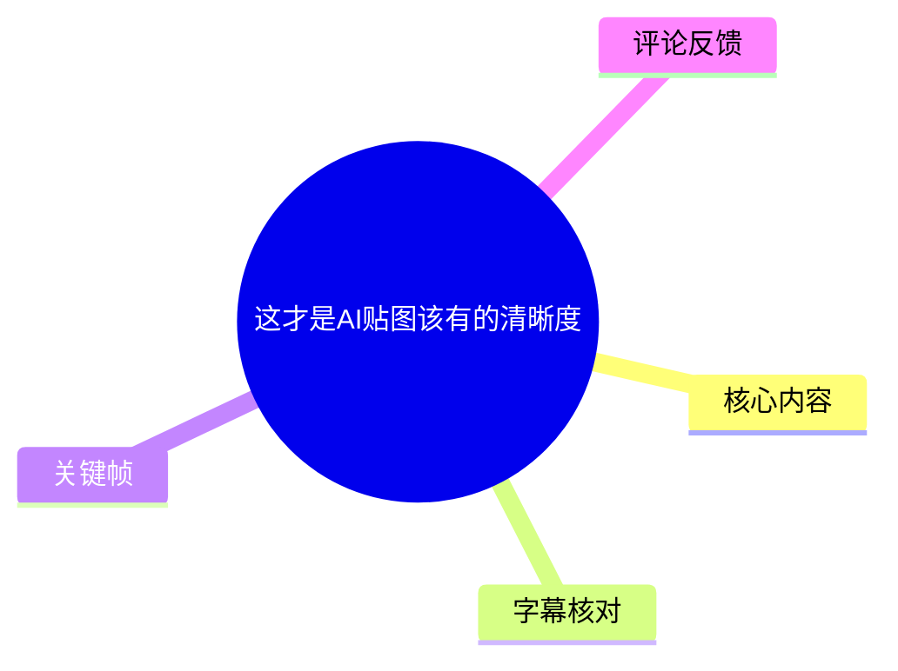
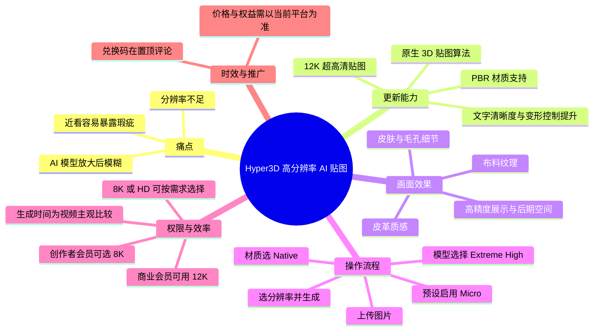
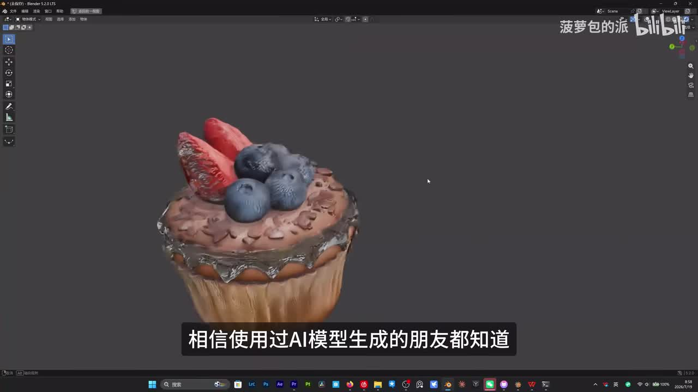
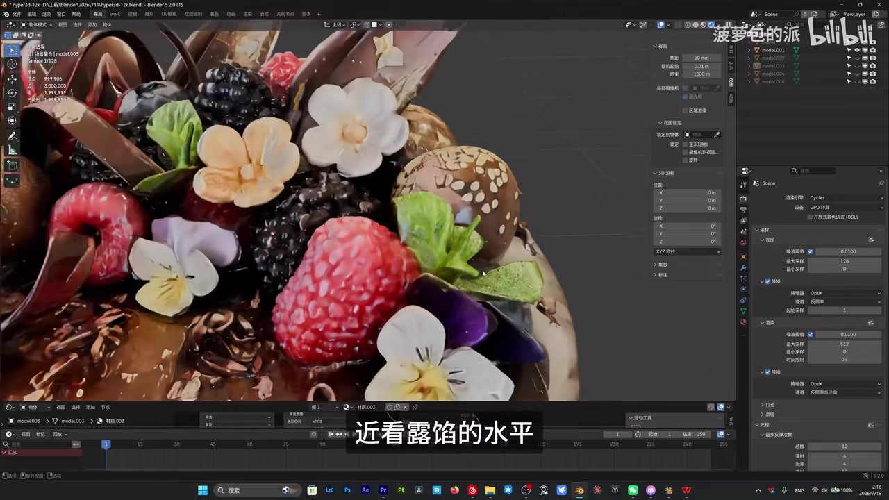
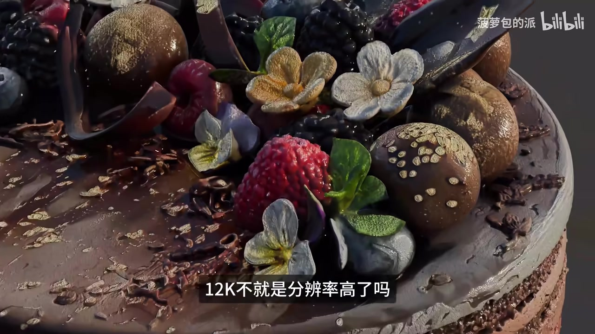
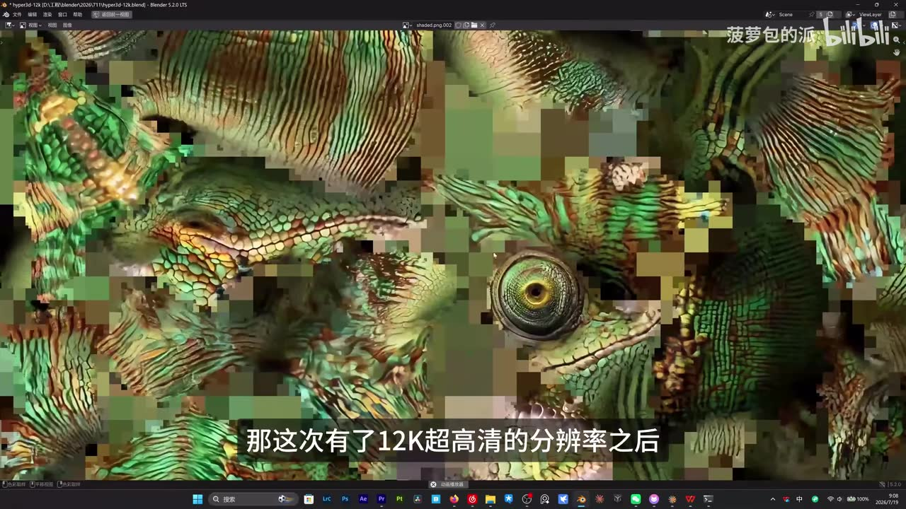

# 这才是AI贴图该有的清晰度

> 来源：[Bilibili 视频](https://www.bilibili.com/video/BV1XhKr69E5q) 
> UP 主：菠萝包的派｜合集：AIcode｜视频时长：190 秒｜画面规格：3840 × 2160

## 小结

视频介绍了 Hyper3D／Hybrid3D（站内字幕与画面中的产品拼写存在不一致）的高分辨率 AI 3D 贴图能力。UP 主的核心判断是：新提供的 **12K 贴图**改善了以往 AI 生成模型“远看可以、放大后模糊或露馅”的问题，尤其面向布料、皮革、皮肤等需要近距离观察纹理的资产。

视频强调，12K 的价值不应只理解为给平面图增加像素。按视频说法，它采用“原生 3D 贴图算法”，让模型在旋转视角时仍能获得较完整的纹理覆盖，并配合 PBR 材质，使金属、布料等表面在场景中更接近对应的物理观感。这些是视频的产品陈述与实测感受，并非本文独立基准测试结论。

实际操作分两段：先在模型生成阶段选择 `Extreme High`，需要微观细节时启用预设中的 `Micro`；再进入材质面板，选择 `Native` 模式和 `Extreme High`，以生成 12K 贴图。对于没有 12K 权限的创作者会员，视频给出 `Native` 模式下选择非 `Extreme High` 的其他模式、再选择 **8K** 或 **HD** 的替代路径。

权限是最重要的限制：视频明确称，**12K 当时仅对商业会员开放**；创作者会员可选 8K。UP 主认为模型展示和日常项目中 8K 已够用。视频还称同等精度资产在同类产品中通常需等待数十分钟，而 Hyper3D 可在数分钟左右完成；这属于作者的行业比较和体验判断，实际耗时仍会随服务版本、队列、模型与会员计划变化。

视频结尾含推广信息：官方兑换码可用 1 美元兑换原价 30 美元、约合 200 元人民币的创作者会员，领取位置为置顶评论。该促销及会员权益均具明显时效性；截至素材抓取时间，无法由视频本身确认其是否仍有效。

## 思维导图

## 目录

- [背景：AI 贴图的放大质量问题](#背景ai-贴图的放大质量问题)
- [12K 贴图的效果与技术主张](#12k-贴图的效果与技术主张)
- [生成 12K／8K 贴图的操作步骤](#生成-12k8k-贴图的操作步骤)
- [权限、效率、推广与时效性](#权限效率推广与时效性)
- [关键帧索引](#关键帧索引)
- [字幕比对](#字幕比对)
- [评论分析](#评论分析)
- [处理记录](#处理记录)

## [背景：AI 贴图的放大质量问题](https://www.bilibili.com/video/BV1XhKr69E5q?t=0)

站内中文字幕从 **00:00:00.100** 起说明，产品此前已经更新过“千万面积的模型生成”；但这一表述本身存在口语与转写歧义。后文字幕又称“从千万面到 12K 的贴图”，日语字幕则明确作“数千万多边形”。因此，能够稳妥记录的是：视频将此前的高面数／高精度模型生成能力，与本次 12K 贴图更新并列为连续升级；不宜将“千万面积”直接解释为确定的面积单位。

视频提出的具体痛点是：过去 AI 生成的模型即使结构与初看贴图尚可，一旦放大观察，容易出现：

- 纹理模糊；
- 贴图分辨率不够；
- 远景可看、近景暴露细节问题；
- 不能支撑高精度展示或较大幅度的后期处理。

UP 主称自己实际使用后，认为这次效果“确实好了很多”。这是个人体验性评价；视频未展示统一输入、对照模型、定量清晰度指标或不同服务的可复现实验条件。

> 图：关键帧展示 Blender 中的蛋糕模型整体。这一画面用于建立视频讨论对象——由 AI 生成并需贴图的 3D 资产——的整体形态；整体外观良好并不能单独证明近景贴图质量，因此后文需要结合放大画面判断。

## [12K 贴图的效果与技术主张](https://www.bilibili.com/video/BV1XhKr69E5q?t=19)

### [可近距离检查的纹理细节](https://www.bilibili.com/video/BV1XhKr69E5q?t=19)

从 **00:00:19.980–00:00:48.810**，视频将 12K 的直观收益概括为：可保留更丰富的纹理信息，画面质感更稳定，因而终于可以把贴图拉近观察。UP 主点名的观察对象包括：

| 观察对象 | 视频所述效果 | 可用于的工作环节 |
| --- | --- | --- |
| 布料 | 可放大查看纹理 | 材质展示、近景渲染 |
| 皮革 | 保留皮革质感 | 道具、角色配件、产品可视化 |
| 皮肤 | 皮肤细节更清楚 | 角色与生物资产 |
| 高信息量贴图 | 后期调整空间更大 | 高精度展示、输出与后期处理 |

作者的判断标准不是“远看是否好看”，而是贴图能否经受放大观察。该标准对最终渲染、近景镜头、资产交付和后期裁切更有意义；但视频未说明 12K 是指单张贴图的边长、贴图集规格，还是其他内部输出定义，使用时应以当前产品界面与导出说明为准。

> 图：该帧在 Blender 视图中展示蛋糕顶部的草莓、蓝莓、花朵、巧克力及奶油细节，适合对应“近看不露馅”的论点。它可帮助观察纹理、颗粒和表面变化，但仅是单个展示案例，不能替代多模型测试。

> 图：该帧以接近最终渲染的角度呈现覆盆子、花朵、巧克力与糖粒等复杂表面。其价值在于说明高细节贴图服务于近景镜头；画面本身不提供纹理尺寸、模型面数或渲染采样等参数。

### [原生 3D 贴图、PBR 与文字效果](https://www.bilibili.com/video/BV1XhKr69E5q?t=52)

在 **00:00:52.430–00:01:22.490**，视频对“12K 不只是分辨率”的解释包含四部分：

1. **原生 3D 贴图算法**  
   视频称其并非“在一张平面图上硬塞像素”，而是使用原生 3D 贴图算法。UP 主据此宣称，模型无论转到哪个角度，纹理都可以覆盖到，不易出现拉伸或盲区，并称为“材质纹理无死角覆盖”。

2. **图像生成级能力**  
   视频称该能力“具备图像生成级的能力”，但未在素材中给出算法结构、训练数据、UV 展开策略、贴图通道数量或技术白皮书。因此只能将其作为视频中的产品能力描述记录。

3. **PBR 材质支持**  
   视频称系统本身支持基于物理的 PBR 材质，并以“金属就是金属、布料是布料”概括不同表面在场景中的真实感。PBR 的实际表现还取决于法线、粗糙度、金属度等贴图通道是否完整，以及渲染器、光照和材质节点设置；这些参数未在视频中展开。

4. **文字与变形控制改善**  
   作者称文字效果有明显提升，过去 AI 生成文字“基本属于碰运气”，现在清晰很多；同时变形控制也有所提升。视频没有给出文字拼写正确率或变形误差的对照样本，所以这同样属于体验观察。

> 图：该帧显示一个蜥蜴／生物表面被大幅放大后出现明显块状像素和纹理失真，具有“反例”价值：它直观解释了视频所说旧式贴图在近看时容易失效的问题。该画面不能据此推断具体生成模型或精确贴图分辨率。

## [生成 12K／8K 贴图的操作步骤](https://www.bilibili.com/video/BV1XhKr69E5q?t=83)

### [一、先保证模型本体细节](https://www.bilibili.com/video/BV1XhKr69E5q?t=83)

依据 **00:01:23.590–00:01:47.170** 的站内中文时间轴，视频的前置步骤如下：

1. 打开 Hyper3D 官方网站。
2. 上传作为生成输入的图片。
3. 在生成模型时选择 `Extreme High` 模式。
4. 需要强化微小结构时，在预设中选择并启用 `Micro` 模式。
5. 等模型细节设置完成后，确认模型。

视频给出的选择逻辑是：

- `Extreme High`：让模型本体拥有足够细节，为后续贴图打基础。
- `Micro`：更好还原皮肤纹理、毛孔等细小结构。
- `Micro + 12K`：视频认为两者组合时效果会更明显。

这里的经验可以迁移为：**高分辨率贴图不能替代几何本体的细节基础**。如果模型轮廓、局部结构或微观形态本身缺失，仅提高贴图分辨率未必能完全恢复真实结构。该句是根据视频流程作出的工作流解释，而非视频提供的量化结论。

### [二、在材质面板生成 12K](https://www.bilibili.com/video/BV1XhKr69E5q?t=108)

依据 **00:01:48.690–00:01:56.600**，视频演示的 12K 路径为：

1. 点击模型确认；
2. 在材质面板选择 `Native` 模式；
3. 选择 `Extreme High`；
4. 选择 **12K**；
5. 点击生成；
6. 等待结果。

可按以下配置表复核关键选项：

| 阶段 | 视频指定设置 | 用途 |
| --- | --- | ---|
| 模型生成 | `Extreme High` | 确保模型有足够细节 |
| 模型预设 | `Micro`（可选） | 偏向皮肤、毛孔等微结构 |
| 材质生成 | `Native` | 视频指定的材质模式 |
| 12K 材质档位 | `Extreme High` + `12K` | 视频中的高分辨率生成组合 |
| 输出动作 | Generate／生成 | 提交任务并等待结果 |

视频未展示具体网页地址、文件大小限制、支持的输入图片格式、额度消耗、失败重试机制、可导出的贴图通道或 Blender 导入步骤。因此，上述内容应作为界面操作路线，而非完整生产部署手册。

### [三、创作者会员的 8K／HD 替代路线](https://www.bilibili.com/video/BV1XhKr69E5q?t=118)

在 **00:01:57.960–00:02:19.900**，视频给出无 12K 权限时的替代方案：

1. 仍选择 `Native` 模式；
2. 在模式选择中，选择 **`Extreme High` 以外的其他模式**；
3. 在下方选择 **8K**，也可选 **HD**；
4. 按模型展示或项目需求决定档位。

UP 主明确表示，日常模型展示和跑项目时，**8K 已经完全够用**。这是带有成本／效率权衡的实务建议，而不是 8K 适用于所有项目的保证；超近景、商业印刷、大幅裁切或多次后期处理的需求可能不同。

## [权限、效率、推广与时效性](https://www.bilibili.com/video/BV1XhKr69E5q?t=118)

### [会员限制](https://www.bilibili.com/video/BV1XhKr69E5q?t=118)

视频在 **00:01:57.960–00:02:03.820** 的明确限制为：

- **12K：仅商业会员可使用。**
- **创作者会员：官方提供 8K 选项。**

这是视频发布时点的服务权益说明。会员层级、可用分辨率、额度、区域可用性与价格都可能变化，不能将其视为当前平台的长期承诺。

### [效率主张](https://www.bilibili.com/video/BV1XhKr69E5q?t=141)

从 **00:02:21.220–00:02:36.769**，UP 主称 Hyper3D 模型与贴图生成速度在行业中较快，并作出以下比较：

- 同类产品要生成该精度的模型与贴图，通常需要等待“几十分钟”；
- Hyper3D 大约“几分钟”可得到一个高精度模型。

这是一项比较性、体验性的性能陈述。素材未提供模型复杂度、队列长度、网络条件、GPU 资源、贴图通道、重复测试次数或计费档位，不能据此承诺稳定的分钟级时延。实际项目应以自身素材跑样、记录耗时与成本后再决定生产流程。

### [产品判断与兑换码](https://www.bilibili.com/video/BV1XhKr69E5q?t=157)

在 **00:02:36.769–00:03:03.640**，UP 主将近期“高面数模型／12K 贴图”更新解读为：平台试图让 AI 生成资产从仅供粗略观看，转向可实际落地使用。这是作者对产品路线的判断。

结尾的促销信息为：

- 官方提供专属兑换码；
- 视频称 1 美元可兑换原价 30 美元、约 200 元人民币的创作者会员；
- 领取或查看位置为 UP 主置顶评论。

该兑换码的有效期、适用地区、适用对象、是否叠加其他优惠以及实际兑换权益均未在视频正文中说明。素材抓取到的热评中也没有兑换码内容，因此不能补全或确认该活动的当前有效性。

## 关键帧索引

| 关键帧 | 正文用途 | 画面价值 |
| --- | --- | --- |
|  | 背景与问题 | 展示 Blender 中的整体蛋糕模型，说明视频的 AI 3D 资产对象。 |
|  | 放大质量问题 | 呈现纹理被放大后产生块状失真，直观说明视频要解决的痛点。 |
|  | 12K 近景效果 | 展示多种复杂材质的近景细节，便于讨论“可放大观察”。 |
|  | PBR 与展示效果 | 展示复杂表面在近景光照下的观感，连接贴图质量与最终渲染用途。 |

> 关键帧来自已提供的 `frames/` 素材。素材未附每张关键帧的独立提取时间戳，因此本文**未把帧序号当作真实视频时间**；章节时间轴均以站内 SRT 的真实起止时间为准。

## 字幕比对

| 字幕来源 | 完整性 | 专有名词 | 时间轴 | 主要问题 |
| --- | --- | --- | --- | --- |
| Bilibili 站内中文字幕 `p01-ai-zh.srt` | 覆盖 00:00:00.100–00:03:08.240，接近全片 | 可辨识 `Hyper3D`、`Extreme High`、`Micro`、`Native`、PBR、12K、8K | 分句细，时间连续，适合作为正文定位依据 | 个别口语转写有误，如“结构结构”“千万面积”“HYBRISD”；产品名拼写前后并不完全一致 |
| 本次 ASR `medium` | 识别到 00:00:26.980–00:03:07.620，诊断语音覆盖率 84.86% | 能识别主要术语，但错误较多 | 有时间戳，但仅 8 个超长段；首段在 26.98 秒才开始，且内容与站内 0 秒内容重叠，分段时间不可靠 | 存在“模形”“贴涂”“分较率”“腐败到”“盲曲”“五四角”“制定评论”等明显错字；部分术语错识为 `Exteme High`、`创造者会呆` |
| 站内外语字幕 | 多语言版本均覆盖完整时段 | 英、日字幕可辅助确认 `Native`、`Extreme High`、`Micro` 等英文界面词 | 与中文站内字幕共用时间段 | 属翻译字幕；英文首句将“千万面”误译成“tens of millions of square meters”，不适合作为该参数的最终释义 |

### 最终字幕选择与校正

正文以 **Bilibili 站内中文时间轴字幕**为主，原因是其从开头覆盖至结尾、分段时间连续，并与本次 ASR 的主要语义相互印证；本次 ASR 已按要求检查，但只作为中文语音存在与主要语义的交叉验证，不作为时间定位来源。

本次 ASR 诊断**未标记 `noAudioStream=true`**，且音频识别语言为中文、置信度为 1，因此源视频存在可识别音轨；并非无音轨视频。

结合中文站内字幕、英文／日文站内字幕和关键帧，本文统一保留或校正的关键名词如下：

- `Hyper3D`：中文站内字幕大多如此拼写；个别位置出现 `HYBRISD`，视为字幕转写问题。
- `Hybrid3D`：外语字幕部分使用此拼写，和 `Hyper3D` 存在命名不一致；本文不擅自断言两者的官方关系，而以中文正文中的 `Hyper3D` 为主。
- `Extreme High`：站内字幕与 ASR 都能对应，ASR 中有 `Exteme` 拼写错误。
- `Micro`、`Native`、PBR、12K、8K：由站内中文字幕及多语字幕交叉确认。
- “千万面积／千万面”：来源存在歧义，本文不据此编造准确面数或面积指标。

## 评论分析

本次可获取热评数量为 **2 条**，不足前三条；以下仅分析已获取内容，不将评论当作事实验证。

| 排名／互动 | 评论 | 观点与可信度分析 |
| --- | --- | --- |
| 1／点赞 0 | 千层蛋糕真的高i：“做得很好啊，一定会火🔥” | 对视频制作或内容表达给予正面评价，并预测传播表现。没有补充产品功能、性能或会员信息，属于情绪支持，不能作为技术效果证据。 |
| 2／点赞 0 | 浮生M_M：“[星星眼]” | 仅表达兴趣或喜爱，没有可分析的技术观点、使用反馈或争议信息。 |

未获取到第 3 条热评，因此不补写不存在的评论内容。现有评论未对 12K 实测质量、生成耗时、会员限制或兑换码有效性提供独立佐证。

## 处理记录

- **Worker ID**：`worker-mrj0wbly-5dc4e50c`
- **模型**：`gpt-5.6-terra`
- **ASR 模型与运行参数**：`medium`；语言自动识别结果为 `zh`，语言置信度 `1`；设备 `cuda`；计算类型 `float16`。
- **使用的素材与工具产物**：视频元数据、站内多语言 SRT、`asr/asr-result.json`、`asr/transcript.srt`、关键帧目录 `frames/`、热评文件 `comments/comments.json`。
- **字幕选择**：主用 `p01-ai-zh.srt` 的真实分段时间；已对本次 ASR 完成检查。ASR 存在超长段、首段偏移和多处错词，故不采用其段落时间作为章节链接依据；外语站内字幕仅用于术语交叉核对。
- **关键帧选择依据**：选择 `frame-001` 展示整体资产，`frame-002` 展示放大失真问题，`frame-003` 和 `frame-004` 展示高细节近景与最终渲染观感。关键帧无独立时间戳元数据，未对其时间位置作推测。
- **缓存清理**：素材清单未提供缓存清理执行结果或日志；本文不虚构已清理状态。
- **未解决问题**：
  - `Hyper3D` 与外语字幕中 `Hybrid3D` 的准确官方命名关系未能由现有素材确认；
  - “千万面积／千万面”的准确单位与数值存在字幕歧义；
  - 12K 的具体贴图尺寸定义、贴图通道、导出格式、价格、额度及当前权限规则未在视频中给出；
  - 兑换码的具体内容与截至整理日的有效性无法确认。
