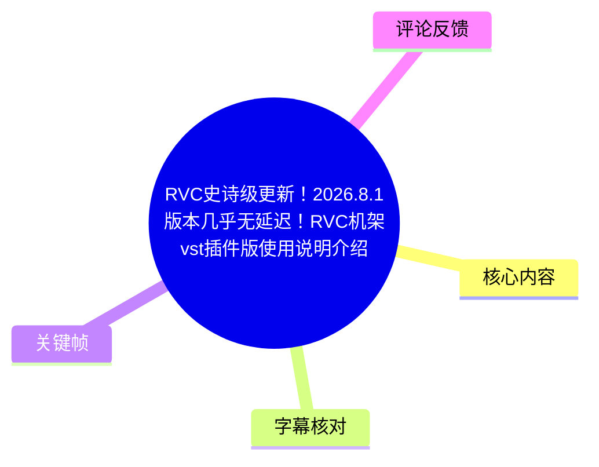
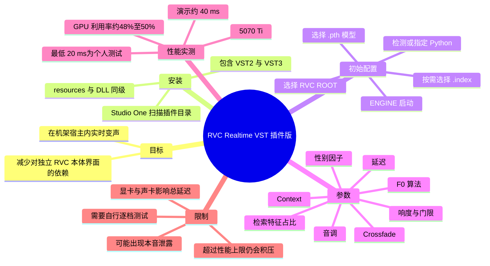
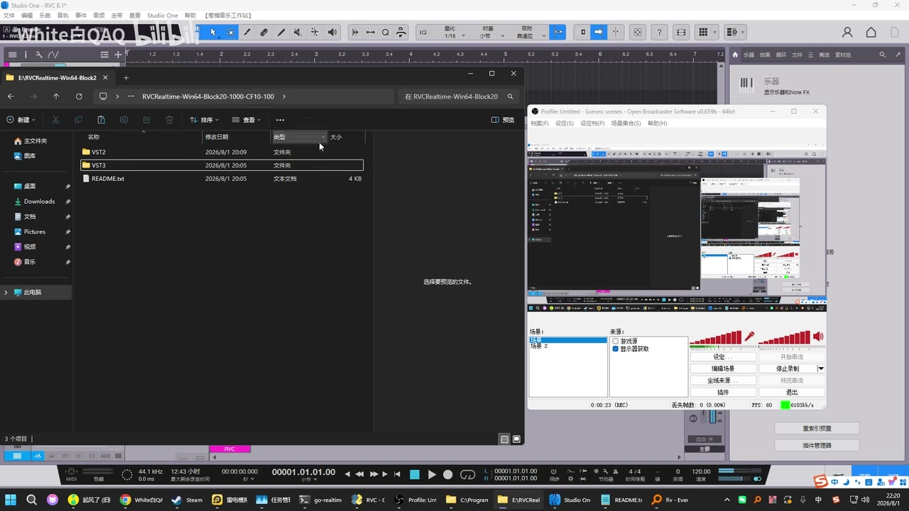
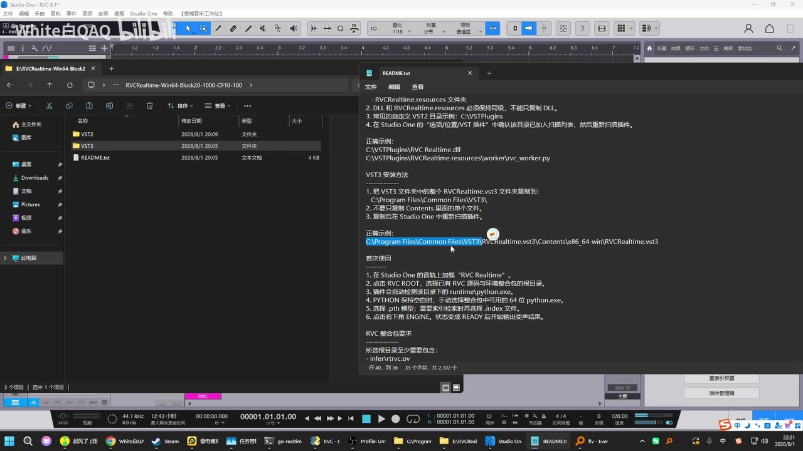
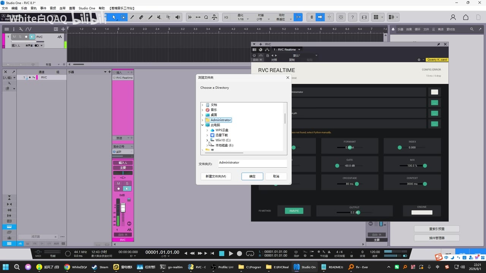

# RVC 机架 VST 插件版：Studio One 中的低延迟实时变声配置说明

> 来源：[Bilibili 视频](https://www.bilibili.com/video/BV1rS3m6eEvD)<br>
> UP 主：White白QAQ｜发布时间：2026-08-01｜视频时长：08:14｜合集：AIcode  
> 视频围绕“花儿不哭”发布的 RVC Realtime 机架/VST 插件版本展开，演示在 Studio One 中安装、配置和试听实时 RVC 变声。

## 小结

视频介绍了一套可在机架宿主内运行的 **RVC Realtime VST 插件方案**。UP 主的核心观点是：使用该版本后，不必再单独打开传统 RVC 本体软件；以 Studio One 为例，将插件部署并载入音轨后，即可在宿主内完成实时变声。

安装侧的关键不是只复制单个 DLL：画面中的 `README.txt` 明确提示，`RVCRealtime.resources` 必须与 `DLL` 保持同级；若采用 VST3，则应将整个 `RVCRealtime.vst3` 目录复制到 VST3 标准目录，而不能只复制内部 `Contents` 文件夹。随后需在 Studio One 的 VST 插件扫描目录中确认路径并重新扫描插件。

配置侧，插件需要先指定 **RVC 根目录（RVC ROOT）**，再选择 `.pth` 模型；如需检索，则还要选择对应 `.index` 文件。画面和讲解还涉及音调、性别因子、检索特征占比、响度、门限、延迟、淡入淡出长度、额外推理时长，以及 F0/音高算法等控件。

视频的性能结论属于 UP 主的个人设备实测：其称在 **RTX 5070 Ti、不运行游戏**时可将插件内延迟调至 **20 ms**；实际演示时界面显示约 **40 ms**，并称外置声卡额外带来约 20 余毫秒，总延迟保守估计可低于 100 ms。其还称在《CS2》1280×960“职业画质”下、设置 60 ms 延迟且不锁帧时未见卡顿。这些数据并非通用基准，显卡、声卡驱动、模型、采样设置、宿主及游戏负载都会显著改变结果。

经验上，UP 主建议将某一与双声/输出表现有关的参数保持较高，并推荐延迟设置先用 **60 ms** 以追求稳定；性能更好的显卡可继续向 40 ms、30 ms 测试，较旧显卡则应相应调高。视频也明确承认：若超出显卡性能上限，仍可能发生 1～2 秒甚至更长的延迟，只是其主观体验中不再出现早期常说的“机关枪”式异常。

本内容具有明确时效性：标题、文件夹日期和视频元数据均指向 **2026-08-01** 前后的版本。插件包结构、文件名、默认参数、Studio One 的扫描方式及兼容性均可能在后续版本改变；应以压缩包内最新 `README` 和官方渠道说明为准。

## 思维导图





## 目录

- [版本背景与适用范围](#版本背景与适用范围-0036)
- [安装包结构与 Studio One 部署](#安装包结构与-studio-one-部署-0037)
- [首次加载：模型、索引与运行环境](#首次加载模型索引与运行环境-0110)
- [插件参数与数值换算](#插件参数与数值换算-0216)
- [实时试听与延迟构成](#实时试听与延迟构成-0406)
- [性能实测、推荐设置与边界](#性能实测推荐设置与边界-0542)
- [可复用操作清单](#可复用操作清单-0037)
- [结论与限制](#结论与限制-0719)
- [字幕比对](#字幕比对)
- [评论分析](#评论分析)
- [处理记录](#处理记录)

## 版本背景与适用范围 [00:36](https://www.bilibili.com/video/BV1rS3m6eEvD?t=36)

本视频从约 00:36 开始进入实际讲解。UP 主称其看到“花儿不哭”推出了一个“机架版本”的 RVC，并将低延迟作为此次更新最突出的变化。视频并非从零讲解 RVC 训练、模型制作或声卡路由，而是面向已有 RVC 模型、希望在 **Studio One** 这类机架/DAW 宿主中使用实时变声的用户。

视频描述中的补充信息包括：

- 可“不打开 RVC 本体软件”，而改由一个机架宿主承担使用流程；
- 演示使用 Studio One；
- 安装包中含更新说明的网盘链接和官方交流答疑群，但视频本身未展示链接内容，本文不对其可用性作验证；
- UP 主提醒该视频为快速录制，可能存在口误，因此关键操作应优先以画面中的 `README.txt` 为准。

需要区分两类表述：

1. **视频实际展示的操作事实**：插件目录、README 的路径要求、Studio One 加载界面、RVC Realtime 参数面板和延迟读数。
2. **UP 主的体验性结论**：例如“几乎无延迟”“完全不卡”“完美”。这些是特定硬件与任务条件下的主观实测，不应直接外推至其他设备。

## 安装包结构与 Studio One 部署 [00:37](https://www.bilibili.com/video/BV1rS3m6eEvD?t=37)

视频开头展示解压后的目录，画面中可见三个项目：`VST2`、`VST3` 和 `README.txt`。UP 主表示自己偏好使用 VST3，因此主要演示 VST3 的安装方式。



> 图：该关键帧直接展示了压缩包解压后的三项内容，是判断安装包结构、确认 VST2/VST3 两种插件形态存在的依据。

### README 中展示的通用要求

画面中的 README 可辨识出以下要求：

1. `RVCRealtime.resources` 文件夹；
2. `DLL` 与 `RVCRealtime.resources` 必须保持同级；
3. 不能只复制 DLL；
4. 解压后的自定义 VST2 目录中应包含完整插件文件；
5. 在 Studio One 中，需要到“选项/位置/VST 插件”确认目录已加入扫描列表，然后重新扫描插件。

这意味着插件并不是“随便抽出一个 DLL 放入目录”即可正常工作。资源目录与主程序文件存在相对路径依赖；破坏文件层级可能导致插件无法载入、找不到资源，或出现配置错误。

### VST3 的复制方法

README 的 VST3 安装说明在画面中给出如下逻辑：

- 将 `VST3` 文件夹中的整个 `RVCRealtime.vst3` 文件夹复制到：

```text
C:\Program Files\Common Files\VST3\
```

- **不要只复制** `RVCRealtime.vst3` 内部的 `Contents` 文件夹；
- 完成复制后，到 Studio One 中重新扫描插件。

画面还给出一个正确层级示例：

```text
C:\Program Files\Common Files\VST3\RVCRealtime.vst3\Contents\x86_64-win\RVCRealtime.vst3
```

该路径是视频 README 中提供的 Windows/VST3 示例，不等同于所有宿主、系统权限或自定义插件目录下的唯一安装路径。若 Studio One 使用自定义 VST3 扫描路径，应确保完整插件目录放在被宿主扫描的位置。



> 图：此帧展示 README 的原始安装说明，包括“resources 与 DLL 同级”“复制完整 `.vst3` 目录”“不要只复制 Contents”三项高风险细节，能避免仅按口述操作时遗漏文件结构要求。

## 首次加载：模型、索引与运行环境 [01:10](https://www.bilibili.com/video/BV1rS3m6eEvD?t=70)

UP 主在 Studio One 内打开 RVC Realtime 插件后，演示首次配置的基本顺序。其设备上的 RVC 根目录位于 C 盘，但这只是其个人路径；用户应选择自己实际解压或部署的 RVC 根目录。



> 图：该帧把 Studio One 音轨、RVC Realtime 面板和“Choose a Directory”目录选择框同时呈现，说明插件需要在宿主中加载后手动指定 RVC 根目录，而不是自动识别任意模型路径。

### 首次使用步骤

结合视频讲解与 README 画面，可整理为：

1. 在 Studio One 的音轨/效果链中加载 **RVC Realtime** 插件。
2. 点击 **RVC ROOT** 对应的目录选择按钮。
3. 选择解压后 RVC 项目的**根目录**，而非随意选择某个模型文件夹。
4. 插件自动检测该目录下的运行环境；README 显示，它会检测目录中的 `runtime\python.exe`。
5. 如果 Python 路径为空，手动指定包含可用 **64 位 `python.exe`** 的 Python 环境。
6. 选择需要使用的 `.pth` 模型文件。
7. 如需使用检索功能，选择对应的 `.index` 文件；不使用检索时可不选。
8. 点击右下角 **ENGINE**，等待状态变为 **READY**。
9. 再进行音频输入、变声试听与参数调节。

### 模型与检索文件

视频中明确将 `.pth` 指为模型文件；其后讲到 `index` 与“检索特征占比”配合使用。可据此理解：

- `.pth`：要加载的 RVC 声音模型；
- `.index`：检索相关文件，是否使用及影响程度由检索特征占比等参数决定；
- 不使用检索时，不应强行指定无关或不匹配的索引文件。

UP 主称自己平时会随意选择或不使用该项，因此没有给出模型—索引匹配规则、索引质量评估或不同检索比例的听感对比。上述未展示内容不能从本视频推出。

## 插件参数与数值换算 [02:16](https://www.bilibili.com/video/BV1rS3m6eEvD?t=136)

插件面板中能看到 `RVC REALTIME` 标题，以及 `FORMAT`、`INDEX`、`GATE`、`MIX`、`CROSSFADE`、`CONTEXT`、`F0 METHOD`、`OUTPUT`、`ENGINE` 等标签。UP 主按从上到下的顺序口头介绍了大部分含义，但 ASR 对具体控件名称存在较多错识，本文对名称以画面可辨识标签和口述含义交叉整理。

### 视频提及的主要控件

| 类别 | 视频中的说明 | 注意事项 |
| --- | --- | --- |
| 音调 | UP 主称第一个参数是音调相关设置。 | 未展示具体单位、增减范围或推荐数值。 |
| 性别因子 | 被称为第二个参数。 | 视频没有给出明确计算方式或跨模型通用范围。 |
| 检索特征占比 | 被称为第三个参数，与 `.index` 检索文件配合。 | 未使用索引时该项的实际效果未被演示。 |
| 响度因子 | UP 主将第四项解释为音量大小。 | 与宿主推子、声卡输入增益的关系未说明。 |
| 门限/Gate | 被解释为“响音的阈值”；界面可见 `GATE`。 | 门限过高或过低对静音、噪声和断字的影响未演示。 |
| 延迟 | UP 主称该项“非常明显”，其设备最低可拉到 20 ms。 | 20 ms 是其个人设备的可运行下限，并非通用推荐值。 |
| 淡入淡出长度 | 对应界面的 `CROSSFADE`。 | 用于衔接/交叉淡化的长度设置。 |
| 额外推理时长 | 对应界面的 `CONTEXT`。 | 视频将其与传统 RVC 的设置作了单位换算。 |
| 音高算法 | 面板左下可见 `F0 METHOD`，UP 主称有两种音高算法。 | 视频未可靠说清具体算法名称，不能据 ASR 错词确定。 |
| 输出/混合 | 面板可见 `MIX` 与 `OUTPUT`。 | 后续演示涉及避免双声，但未完整解释内部信号路由。 |

### 视频给出的单位换算实例

UP 主举了两个数值换算示例：

| 传统/原版设置口述 | 插件中对应设置 | 视频用意 |
| --- | ---: | --- |
| 淡入淡出长度 `0.11` | `110` | 表明插件的对应输入采用更细的数值尺度；视频未明确标出单位，但数值关系为 0.11 → 110。 |
| 额外推理时长 `2` | `2000` | 同样提示存在单位尺度转换。 |

这些是视频中的口述示例，不应据此假设所有版本、所有字段均遵循同样的换算关系。实际配置应以当前插件界面单位、README 和试听结果为准。

## 实时试听与延迟构成 [04:06](https://www.bilibili.com/video/BV1rS3m6eEvD?t=246)

UP 主先用“喂喂”测试本音，随后在约 04:12 表示“现在开始转换了”，并继续讲话以展示变声已生效。约 04:18 起，他称当前已是变声声音，并指向插件左下角的延迟读数。

### 演示中出现的数字

视频中可整理出以下数据：

| 项目 | 数值或描述 | 来源性质 |
| --- | ---| --- |
| 演示界面中的插件延迟 | 约 `40 ms` | UP 主口述指认界面读数。 |
| 另一项推理数值 | 口述为“11” | ASR 对控件名称不可靠，不能明确绑定至具体 UI 字段。 |
| 外置声卡延迟 | 约 `13 + 14 ms`，即 20 余毫秒 | UP 主个人声卡环境。 |
| 总延迟 | UP 主称其当前低于 `100 ms` | 个人估计，不是仪器测得的统一端到端标准。 |
| 不使用外置声卡时 | UP 主估计约 `100 ms` | 经验性估计。 |

UP 主以本音与变声音同时可听、主观上“几乎没有延迟”为例，认为该设置已可支持流畅交流。这里应注意，“插件报告延迟”“声卡缓冲延迟”“操作系统/驱动延迟”“游戏或直播软件链路延迟”并不必然相同；视频没有提供端到端测试方法、采样率、ASIO 缓冲大小或回环测量结果，因此不能将 40 ms 直接视作整个语音链路的绝对总延迟。

## 性能实测、推荐设置与边界 [05:42](https://www.bilibili.com/video/BV1rS3m6eEvD?t=342)

UP 主称其使用的是“50 系”显卡，并在视频描述中具体写为 **RTX 5070 Ti**。在其将延迟设置为 20 ms 的条件下，UP 主观察到 GPU 利用率约为 **48%～50%**，并认为尚可接受；其推测性能更高的 RTX 5090 可能能获得更低延迟。后一句是推测，并非该视频实测。

### 与旧体验的对比

UP 主口述称，以前在较低采样/延迟设置下，延迟可能在约 300 ms 左右；他认为新机架版本带来的改善非常大。ASR 对“采样长度”“300”的单位识别不够清晰，视频也未展示旧版与新版在同一模型、同一硬件、同一音频链路下的对照测试，因此只能记录其方向性判断：**其个人体验认为新版本显著降低了实时变声延迟。**

### UP 主的稳定性建议

约 06:31 起，UP 主提出以下经验性建议：

- 为避免出现两个声音，应将其提到的相关参数调到较高状态；由于口述反复、ASR 严重失真，无法可靠确认该参数的准确名称，不能替用户指定具体控件。
- 对延迟设置，推荐先使用 **60 ms**，因为其主观上感觉更稳定。
- 显卡性能更好时，可尝试更低的延迟，如 **40 ms**；
- 对 30 系、20 系乃至 10 系显卡，应相应提高延迟设置；
- 最终仍需按自己的硬件和实际用途逐项测试。

### 游戏负载测试与上限行为

视频描述和约 07:19 后的口述称，UP 主在玩《CS2》时，以 **1280×960、职业画质**，将延迟设为 **60 ms**，且不锁帧，体感“完全不卡”。他还提到过去出现过“机关枪”式异常，而当前版本在其测试中没有该问题。

但其也给出重要边界：如果负载超过显卡上限，系统仍可能不是立刻崩溃，而是出现延迟变大，可能慢 **1～2 秒**。因此“不机关枪”不等于“任何负载下始终低延迟”，更不表示实时通信一定不会失步。

## 可复用操作清单 [00:37](https://www.bilibili.com/video/BV1rS3m6eEvD?t=37)

以下清单仅重组视频中已经展示或明确说出的步骤，不补充未展示的下载、训练、虚拟声卡或直播推流配置。

### 1. 安装前检查

- [ ] 解压完整插件包，确认至少有 `VST2`、`VST3` 与 `README.txt`。
- [ ] 保留 `RVCRealtime.resources` 与 DLL 的同级关系。
- [ ] 不要只搬运 DLL。
- [ ] 若使用 VST3，不要只复制 `.vst3` 内部的 `Contents` 文件夹。
- [ ] 确认当前 Windows 账户具有写入 `C:\Program Files\Common Files\VST3\` 的权限；若无权限，需要使用宿主实际扫描的可写目录，但视频未提供替代目录规则。

### 2. 部署 VST3

```text
源：解压目录中的 VST3\RVCRealtime.vst3
目标：C:\Program Files\Common Files\VST3\RVCRealtime.vst3
```

完成后：

1. 打开 Studio One；
2. 进入“选项/位置/VST 插件”；
3. 确认安装目录位于扫描列表；
4. 重新扫描插件；
5. 在音轨中加载 RVC Realtime。

### 3. 首次配置插件

1. 点击 `RVC ROOT` 的文件夹按钮；
2. 选择 RVC 根目录；
3. 确认插件可检测到 `runtime\python.exe`；
4. 检测失败时，按 README 提示手动选择含可用 64 位 `python.exe` 的环境；
5. 选择 `.pth` 模型；
6. 有检索需求时，选择相匹配的 `.index`；
7. 选择所需音高算法；
8. 点击 `ENGINE`，等待 `READY`。

### 4. 从保守配置开始调试

视频没有提供完整可复现的全套预设，因此更稳妥的试用顺序应是：

1. 先保持其他参数接近默认状态；
2. 将延迟先设为 **60 ms**，作为 UP 主建议的较稳定起点；
3. 完成变声是否生效、是否双声、是否断续、是否爆音的基础检查；
4. 设备余量足够时，再逐步降低至 40 ms 或更低；
5. 一旦发生明显延迟积压、双声、异常音或游戏卡顿，回退到更高延迟设置；
6. 在“空闲桌面”和“实际游戏/直播负载”两种条件下分别测试。

## 结论与限制 [07:19](https://www.bilibili.com/video/BV1rS3m6eEvD?t=439)

这支视频最有价值的信息，是以画面说明了 RVC Realtime VST3 的**正确文件部署层级**、Studio One 中的**加载与扫描思路**，以及选择 RVC 根目录、模型、索引、Python 环境并启动 ENGINE 的**首次配置路径**。其中“完整复制 `.vst3` 目录”和“资源目录不要脱离 DLL”尤其值得优先核对。

在性能层面，视频提供了一个明确但有限的参考样本：RTX 5070 Ti、外置声卡、插件内延迟可低至 20 ms 的个人实测，演示时约 40 ms，并给出 60 ms 更稳妥的建议。它证明该方案在 UP 主的环境中具有较低延迟潜力，但没有构成跨显卡、跨宿主、跨模型、跨声卡的通用性能结论。

使用时应重点留意：

- **硬件差异**：GPU 性能、显存、CPU、声卡、驱动和缓冲设置都会影响结果。
- **模型差异**：不同 `.pth` 模型、索引文件及音高算法可能改变推理压力和听感。
- **宿主差异**：本视频只展示 Studio One；其他机架、DAW 或直播软件的插件扫描与音频路由未被验证。
- **总延迟不可仅看一个读数**：插件显示的 ms 不一定等于麦克风至听众端的全链路延迟。
- **过载仍有后果**：UP 主称超过显卡上限时仍可能积压到 1～2 秒。
- **版本时效**：本视频对应 2026-08-01 前后的更新，后续文件结构、参数名称和行为可能变化。
- **双声与本音泄露风险**：视频提到可能出现两个声音；热评还补充了本音泄露现象，均说明应实际监听输出链路。

## 字幕比对

| 字幕来源 | 完整性 | 专有名词 | 时间轴 | 主要问题 |
| --- | --- | --- | --- | --- |
| Bilibili 站内字幕 | 与本视频内容不匹配，实际上是手办开箱文本 | 几乎全部不匹配 | 有完整 00:00～05:35 时间段，但不能用于本视频 | 说话人、主题、时长均与 RVC 视频冲突，不能采用 |
| 本次 ASR 字幕 | 覆盖约 434.49 秒语音，诊断覆盖率 88.08% | 部分可从上下文识别，如 VST3、RVC ROOT、PTH、INDEX；大量词语失真 | 覆盖 00:36.660～08:11.880，带真实分段时间 | 分段过长且部分文字明显错识，如“颜值”应为“延迟”；参数名、显卡型号、算法名等存在歧义 |

### 最终字幕选择与校正原则

本次采用 **ASR 时间轴作为章节定位依据**，因为它与视频主题、时长和口述内容一致；但不逐字采信其文本。站内字幕虽存在，却明显来自另一支手办开箱视频，不能作为事实来源或时间轴依据。

ASR 诊断显示：

- 识别模型：`large-v3-turbo`；
- 语言：中文，置信度 `0.99609375`；
- 音频时长：约 `493.27` 秒；
- 首段语音：`00:00:36.660`；
- 末段语音：`00:08:11.880`；
- 未标记 `noAudioStream=true`，且 ASR 已取得连续语音内容，因此源视频**存在可用音轨**，不存在“无音轨改用画面”的情形。

结合画面/README 校正或保留不确定性的重点包括：

- ASR 中的“2VC”“圆满 RVc”等，应按上下文统一理解为 **RVC**，但不把错词当成产品新名称；
- ASR 中的“颜值”按上下文校正为 **延迟**；
- “米.22”等声卡名称无法从现有材料可靠恢复，仅保留“外置声卡”及 UP 主给出的 `13 + 14 ms` 读数；
- `RVC ROOT`、`.pth`、`.index`、`runtime\python.exe`、`ENGINE READY`、`RVCRealtime.resources` 等以关键帧 README/界面可见文字为准；
- F0 算法的具体名称在 ASR 中不可可靠辨认，正文仅记录“有两种音高算法”的视频陈述。

## 评论分析

可获取热评数据中实际返回 **2 条**，未返回第 3 条；因此仅分析这两条，不补充或推测缺失热评。

### 热评 1：UP 主置顶式补充说明（8 赞）

评论者为 `White白QAQ`。内容与视频简介一致，补充强调：

- 不开 RVC 本体软件、仅使用 Studio One 机架的工作方式；
- RTX 5070 Ti 在不玩游戏时可开最低 20 ms；
- 其估计总延迟在 100 ms 以下；
- 《CS2》1280×960“职业画质”、60 ms、不锁帧时不卡；
- 提供官方群号和网盘链接，并声明视频为快速录制，可能口误。

这条评论的价值在于补全了视频中分散出现的设备、游戏场景和下载/交流入口信息；但它仍是发布者的自述，未提供测试录屏、统一延迟测量方法或第三方复现，可信范围应限定为“UP 主个人环境报告”。

### 热评 2：DML 版本用户实测与问题反馈（2 赞）

评论者为 `绿菟葵花精灵王`。其称在 **DML 版本**中，将“额外推理时长”从 `3.25` 调为 `3.00`，其他不变，实测延迟从约 `960` 降至约 `660`。评论还提出：

- 新版本延迟表现更恒定；
- 在未启动原版 RVC、且电脑不重启/不重装驱动的前提下，延迟可保持固定；
- 原版可能只在第一次运行时稳定，后续想恢复稳定可能需要重启电脑或驱动；
- 由于与本音共用一个音轨，可能出现本音泄露；
- 希望添加插件崩溃或变声未启动时的静音功能。

这是一条有价值的反例与补充：它说明不同后端/版本、不同参数下，延迟数值可能远高于视频中 20～60 ms 的设置；同时指出“延迟恒定性”和“本音泄露”是实际使用中值得测试的维度。评论未附硬件、软件版本、测量方法或录音证据，因此不能将 `960 → 660` 视为普适性能结论。

## 处理记录

- Worker ID：`worker-mrj0wbly-5dc4e50c`
- 模型：`gpt-5.6-terra`
- 调用工具与素材：视频元数据、ASR 结果与 SRT、站内 SRT、关键帧、热评 JSON。
- ASR 工具与模型：`large-v3-turbo`，CUDA，`int8_float16`。
- 字幕选择：检查了站内字幕与本次 ASR；站内 SRT 内容为手办开箱，和本视频完全不符，已排除。采用本次 ASR 的真实时间段定位章节，并以关键帧中 README、插件界面和视频上下文校正文本。
- 音轨判定：ASR 结果未标记 `noAudioStream=true`，并给出 493.27 秒音频与 434.49 秒语音覆盖，因此按“存在音轨”处理。
- 关键帧选择依据：  
  - `frames/frame-001.jpg`：展示解压包中 VST2、VST3 与 README 的目录结构；  
  - `frames/frame-002.jpg`：展示 README 中资源目录、DLL 同级与 VST3 安装要求；  
  - `frames/frame-004.jpg`：展示 Studio One 中 RVC Realtime 插件、RVC ROOT 目录选择和核心参数面板。  
  这些帧均直接支撑安装与首次配置内容，未使用无法从画面辨认的细节。
- 评论处理：接口请求上限为前三条，但实际仅获取两条，已全部分析，未虚构第三条。
- 缓存清理：素材清单未提供缓存清理执行结果；本文不声称已执行清理。
- 未解决问题：无法仅依现有素材确认 F0 两种算法的具体名称、外置声卡型号、部分控件精确单位，以及所有显卡/宿主下的可复现端到端延迟。
