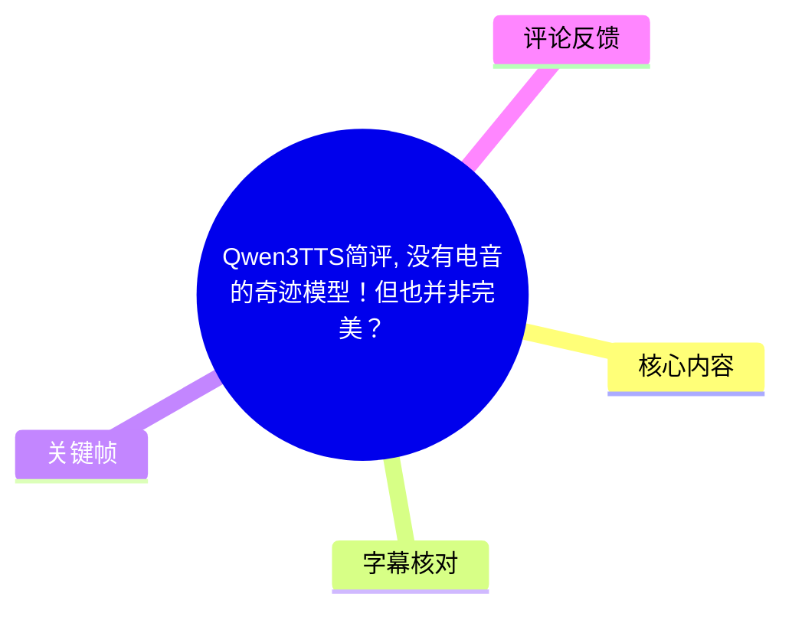
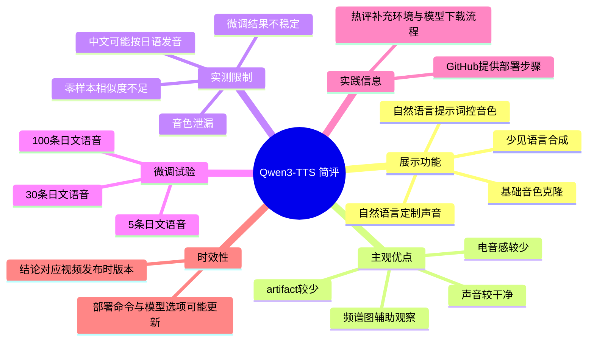
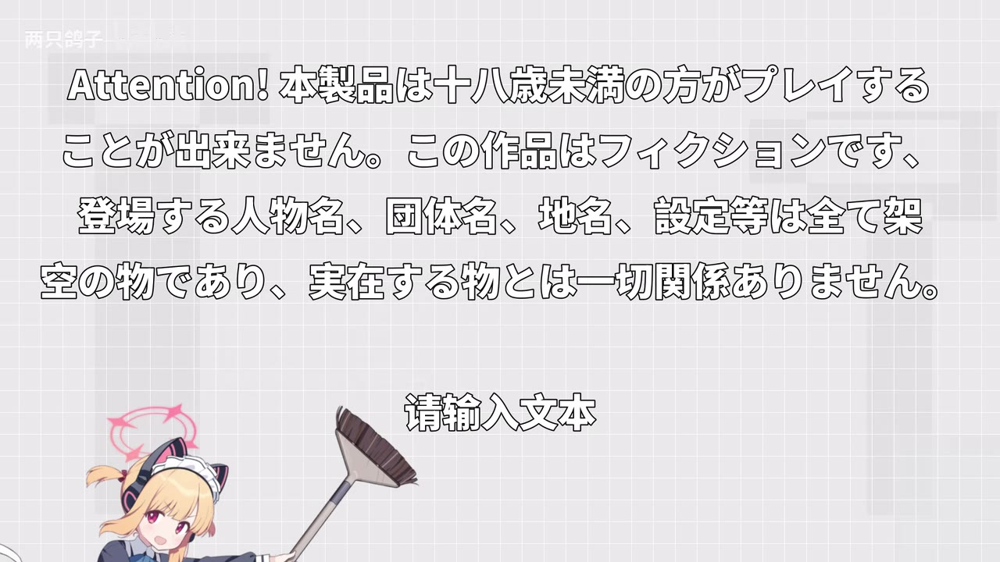
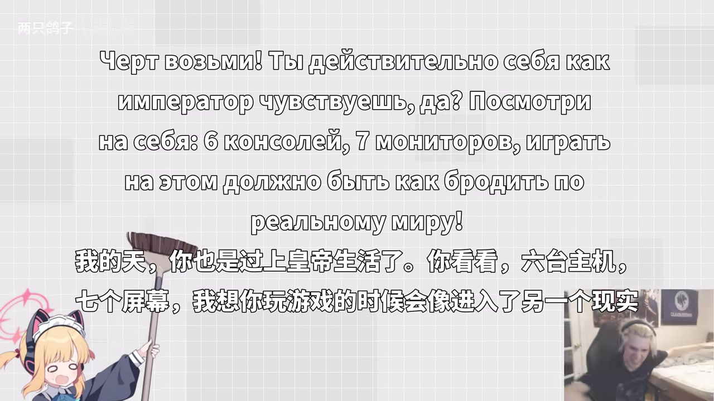
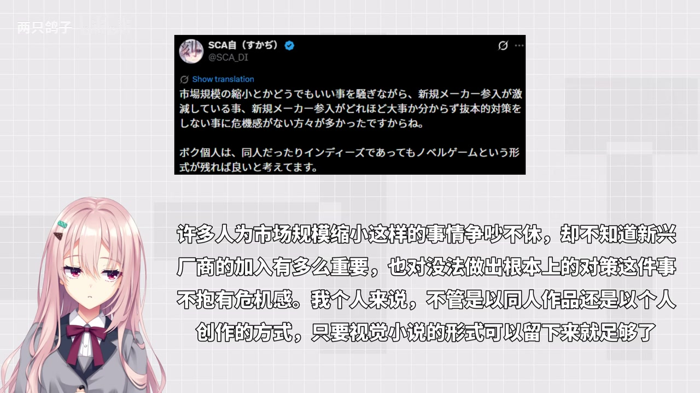

# Qwen3TTS简评：没有电音的奇迹模型，但也并非完美？

> 来源：[Bilibili 视频](https://www.bilibili.com/video/BV1eT6BBYEZ2)  
> UP 主：两只鸽子｜发布时间：2026-01-30｜时长：4 分 42 秒  
> 项目链接：<https://github.com/QwenLM/Qwen3-TTS/tree/main>

## 小结

视频以实际试听为主，对 Qwen3-TTS 的音色克隆、自然语言定制声音、通过自然语言提示词控制输出等能力进行了简评。UP 主的总体判断是：该模型生成的声音较干净，明显的“电音感”和音频伪影（artifact）相对少，整体音质具备较高可用性。

基础音色克隆部分展示了日语、俄语等内容；UP 主认为模型也能处理一些较少见的语言。随后，视频使用英文与一段“夜之城”风格的中文播报，展示自然语言定制声音的效果；并继续演示对特定音色使用提示词进行控制的能力。

但视频并未将其评价为“完美模型”。UP 主指出，零样本（zero-shot）音色克隆的相似度仍是短板；自己尝试以 **5 条、30 条、100 条日文语音**进行微调训练时，结果均不理想，表现为相似度低或出现严重 artifact。

此外，视频记录了两类异常：其一是音色泄漏，生成结果可能与参考音频的音色完全无关；其二是文本编码／跨语言发音问题——在提供日语参考音频时，中文可能被按日语读音处理。UP 主推测这或与模型关联上下文、以及中日文字共享汉字特征有关；该解释是视频作者的推测，并非本视频验证出的模型机制结论。

本视频适合正在评估 Qwen3-TTS、关注低伪影语音合成与角色音色克隆的人阅读。部署与模型仓库会随项目更新而变化；视频中的体验、微调结论和评论区命令均应视作当时版本及个体环境下的结果，而不是通用性能保证。

## 思维导图





## 目录

- [视频背景与评测范围](#视频背景与评测范围-0003)
- [基础音色克隆与多语言样例](#基础音色克隆与多语言样例-0015)
- [自然语言定制声音与提示词控制](#自然语言定制声音与提示词控制-0124)
- [质量评价：干净度、频谱与相似度](#质量评价干净度频谱与相似度-0309)
- [微调测试、音色泄漏与文本编码问题](#微调测试音色泄漏与文本编码问题-0325)
- [部署线索与可复用实践](#部署线索与可复用实践-0430)
- [结论、限制与时效性](#结论限制与时效性)
- [字幕比对](#字幕比对)
- [评论分析](#评论分析)
- [处理记录](#处理记录)

## [视频背景与评测范围](https://www.bilibili.com/video/BV1eT6BBYEZ2?t=3) `00:03`

视频开场说明主题是直接查看 Qwen3-TTS 的“功能和效果”。UP 主还说明，视频中提到的“冬雪莲配音”同样由该模型制作。该说法界定了视频性质：这是一份以样例试听、主观比较与个人微调尝试构成的短评，而不是标准化基准测试报告。

视频主要覆盖以下四类能力或问题：

1. 基础音色克隆；
2. 多语言／少见语言的合成样例；
3. 自然语言定制声音，以及使用自然语言提示词影响输出；
4. 输出音质、克隆相似度、微调可行性、音色泄漏和文字发音异常。


> 图：开场关键帧的字幕写有“直接来看一下这个 Qwen3TTS 的功能和效果”。它用于确认本片的评测对象与范围，而非将后续任一单独试听样例误当成全部功能说明。

## [基础音色克隆与多语言样例](https://www.bilibili.com/video/BV1eT6BBYEZ2?t=15) `00:15`

UP 主首先介绍“基础的音色克隆功能”，并表示找了几个角色语音作为演示参考。该段包含日语内容与其他语言样例，重点是让观众直接听取合成后的声音，而不是展示完整的模型输入、参考音频时长、采样率、推理参数或客观相似度指标。

### 日语样例

约 `00:23–00:35`，视频出现日语警示文本的合成展示。画面中的文本为针对成人内容的日语提示，内容本身不构成模型参数；它的作用是作为较长日语文本，观察合成语音的连贯性和表现。



> 图：画面呈现大段日语文本与“请输入文本”的输入提示，可见该演示属于文本驱动的语音生成场景。它有助于理解视频是在播放合成结果，而非讲解字幕翻译。

### 少见语言样例

在 `00:45` 左右，UP 主评价模型“也可以说一些比较少见的语言，非常有意思”。站内字幕在 `00:50–00:55` 记录了一小段英文／非中文文本；ASR 在这一段存在长间隔和识别遗漏，因此无法仅凭 ASR 完整转写该试听内容。

从视频可确认的结论仅是：UP 主用样例展示了除中文、日语以外的语言输出，并对其效果给出正面主观评价。视频没有给出所用语言列表、模型版本、参考音频来源、语言识别成功率或客观测评，不能据此扩展为“支持任意语言”或“少见语言均稳定可用”。



> 图：画面中可见俄语文字及对应中文字幕，证明视频确实包含跨语言文本展示。该帧的价值在于补足字幕对非中文语音内容识别不完整的问题，但不能单独证明具体语音的准确率或自然度。

## [自然语言定制声音与提示词控制](https://www.bilibili.com/video/BV1eT6BBYEZ2?t=84) `01:24`

视频在 `01:24` 说明，Qwen3-TTS 还有两个“比较新颖”的功能：

- **用自然语言定制声音**；
- **以自然语言作为提示词，改变声音输出**。

这里的“定制声音”与“提示词改变输出”在视频中被作为不同能力提出：前者用于描述、构造所需声音；后者则面向特定音色或输出风格的控制。视频未展示具体 prompt 文本、字段格式、可用标签体系或默认采样参数，因此不能据此复现完全相同的结果。

### 定制声音试听

`01:37–01:50` 播放英文试听片段，其中可辨识文本包括：

> “I thought I have won his heart, but reality always comes with disappointment...”

随后 `01:52–02:34` 播放较长中文播报，以“早上好，夜之城”开头，内容涉及虚构城市中的帮派火并、停电、创伤小组等叙事。UP 主在 `02:35` 给出的评价是“感觉效果还不错”。

该部分说明模型可以在不同语言、不同叙事风格文本中输出较完整的连续语音。但“效果还不错”是作者主观试听结论，并未给出与原始配音演员、基线 TTS 或人工录音之间的盲听对照。

### 对特定音色使用提示词

`02:36` 起，UP 主转入“对特定音色的提示词功能”。接下来的样例包含日语语句，站内字幕未记录这部分具体语音内容，ASR 对日语识别也存在明显误识别。因此，本整理只确认该段是提示词控制效果展示，不将误识别文本视作真实输入或真实输出。



> 图：该帧显示视频以角色画面、原文文本与中文字幕共同承载试听展示。它的价值是说明视频采取“视觉文本 + 合成音频”的演示方式；由于字幕并未完整记录对应提示词，不能从画面反推出 prompt 配置。

## [质量评价：干净度、频谱与相似度](https://www.bilibili.com/video/BV1eT6BBYEZ2?t=189) `03:09`

UP 主在总结部分给出三个关键判断：

1. **声音整体较干净**：生成语音中的“电音”和 artifact 相对少。
2. **频谱图支持该观察**：UP 主称这一点也能在频谱图上看出。
3. **音色克隆相似度仍有不足**：先前的试听中已可听出一些差异。

这里需要区分主观听感与客观证据：

- “声音干净”“电音少”是作者基于试听和画面频谱得出的评价；
- 视频提到频谱图，但未提供频谱图的坐标、采样设置、对照音频、测量窗口或量化指标；
- 因而本视频能支持“作者观察到伪影较少”，不能支持“模型在所有数据集或所有输入上均优于其他模型”的普遍结论。

UP 主将音色相似度不足放在 **zero-shot（零样本）** 条件下讨论，并认为在这一前提下可被理解。视频没有说明零样本参考音频的秒数、是否做过切分或降噪、参考音频语言与待合成语言是否一致，这些均会影响克隆相似度，不能忽略。

## [微调测试、音色泄漏与文本编码问题](https://www.bilibili.com/video/BV1eT6BBYEZ2?t=205) `03:25`

### 微调尝试与数据量

为提升相似度，UP 主尝试了模型微调训练。视频明确给出三组日文语音训练量：

| 训练语音条数 | 视频中的结果描述 |
| --- | --- |
| 5 条 | 结果不太好：可能相似度很低，或有严重 artifact |
| 30 条 | 结果不太好：可能相似度很低，或有严重 artifact |
| 100 条 | 结果不太好：可能相似度很低，或有严重 artifact |

这是该 UP 主在其测试设置下的经验，而非官方公布的微调门槛。视频没有提供每条语音长度、总时长、文本转写质量、训练轮数、学习率、显卡、批次大小、损失曲线、基座模型和检查点选择方法，故无法据此判断失败原因或复现该结果。

UP 主表示若有人知道更合适的微调方法，希望获得建议。这也表明视频并未把这些微调结果视作最终定论。

### 音色泄漏

`03:39` 起，UP 主指出模型可能出现“比较诡异的音色泄漏问题”。在 `03:52` 左右的样例中，UP 主明确说“这个就跟参考音频的音色完全无关了”。

“音色泄漏”在本视频语境中指：输出音色未按预期继承参考音色，导致生成结果偏离参考说话人的声音特征。视频未给出该问题出现的概率、可稳定复现的输入条件或排查方法，因此应将其视为已观察到的个案风险，而非已量化的故障率。

### 中文按日语发音与作者推测

`04:06` 起，UP 主展示另一类问题：中文文本被按日语发音方式处理。UP 主认为，这可能与自己提供了日语原音频有关。

视频进一步转述／概括了 Qwen3-TTS 的介绍：模型会关联上下文来得到输出。基于这一点，UP 主推测：

- 中文与日文都包含汉字；
- 模型的上下文关联特性可能与中日汉字特征共同造成了该问题。

这是一种合理但尚未在视频中验证的解释。视频作者同时指出：使用该音色合成其他采用拉丁字母的语言时，没有遇到这个问题。该现象提示实践中应重点验证“参考音频语言 × 目标文本语言 × 文字系统”的组合，尤其是日语参考音色合成中文时。

## [部署线索与可复用实践](https://www.bilibili.com/video/BV1eT6BBYEZ2?t=270) `04:30`

视频最后指出，Qwen3-TTS 的 GitHub 页面给出了部署步骤；若观众有需要，UP 主表示可以另做教程。视频本身未演示部署过程，因此以下内容分为“视频可确认的信息”与“热评中的未验证经验”。

### 视频可确认的信息

- 官方项目仓库被放在视频简介中：<https://github.com/QwenLM/Qwen3-TTS/tree/main>
- GitHub 页面包含部署步骤，这是 UP 主在视频中的陈述。
- 视频没有实际展示从环境创建、安装依赖、下载权重到运行推理的完整命令序列。

### 实践检查清单

结合视频暴露的问题，实际使用时至少应做如下验证：

1. **先确定任务类型**：是零样本克隆、自然语言定制声音，还是提示词控制声音输出。
2. **保留参考音频信息**：记录语种、时长、清晰度、是否含背景音乐和情绪变化；视频显示参考音频语言可能影响跨语言输出。
3. **分别测相似度与音质**：音频“干净”不等于“像参考音色”；二者应独立试听和评估。
4. **微调需小规模验证**：即使有 5、30、100 条语音，视频作者的结果仍不稳定；不要只按条数推断成功率。
5. **做跨语言回归测试**：特别是日语参考音频配中文文本时，应检查是否出现按日语读汉字的现象。
6. **留意音色泄漏**：若输出与参考音色显著脱离，应保存输入、参考音频和模型版本，以便复现与排查。
7. **部署时以官方仓库当前文档为准**：视频及评论中涉及的环境、模型名称、依赖版本可能已发生变化。

## 结论、限制与时效性

Qwen3-TTS 在本视频中的突出表现是：UP 主认为它输出较干净，电音感和 artifact 较少，并展示了音色克隆、跨语言样例、自然语言定制声音和提示词控制等功能。对于追求“先得到可听、较少机械伪影的 TTS 输出”的创作者，这些样例具有参考价值。

其核心限制也同样明确：

- 零样本音色克隆的相似度并不总是理想；
- UP 主以 5／30／100 条日文语音尝试微调时均未得到满意结果；
- 存在音色泄漏个案；
- 日语参考音频下，中文可能出现日语化读音；
- 视频没有给出可复现的模型版本、推理参数、参考音频规格和客观量化指标。

因此，更稳妥的结论是：**Qwen3-TTS 在该作者测试中展现了较好的音质潜力，但相似度、微调稳定性和跨语言文字处理仍应通过自己的数据与目标场景验证。**

本视频发布于 2026-01-30，元数据抓取时间为 2026-07-16。模型仓库、权重、依赖、示例代码和部署路径都可能已经更新；视频中的结论应绑定当时所使用的版本和作者的测试条件，不宜直接等同于当前最新版表现。

## 字幕比对

| 字幕来源 | 完整性 | 专有名词 | 时间轴 | 主要问题 |
| --- | --- | --- | --- | --- |
| Bilibili 站内字幕 | 中文讲解主体覆盖较好；试听中的外语内容较少 | `Qwen3TTS`、`zero shot`、`artifact` 等大多可结合上下文辨认 | 分段细，提供真实 SRT 起止时间 | “坤／昆3TTS”等写法不统一；部分外语样例缺失或转写不完整 |
| 本次 ASR（medium） | 18 段，语音覆盖约 69.66%，主体讲解基本覆盖 | `Qwen3-TTS` 被多次误识别为“昆山 tts／坤3TTS”；`artifact`、`zero shot` 存在词形错误 | 有时间戳；首段 00:03.57，末段 04:39.88 | 日语、英语和专名误识别明显；存在 19.08 秒、15.10 秒等较大空白区间 |

本次 ASR 已实际检查：识别语言为中文，置信度约 `0.9897`，使用 `medium` 模型、CUDA 与 `float16`；诊断未标记 `noAudioStream=true`，因此确认源视频存在音轨，并非无音轨素材。

最终正文优先采用**站内 SRT 的时间轴与中文讲解文本**，再用本次 ASR 校验站内字幕的覆盖与分段；两者都无法可靠转写的日语、英语试听部分，不强行补写。关键校正如下：

- 视频与标题中的模型名统一写作 **Qwen3-TTS**，不采用 ASR 的“昆山 tts”等误识别；
- `zero shot` 统一规范为 **zero-shot（零样本）**；
- `artifact` 保留英文术语，并按语境译作“音频伪影”；
- `03:52` 的“与参考音频的音色完全无关”由站内字幕、ASR及视频语境共同支持；
- 多语言展示内容结合关键帧确认存在俄语／日语等画面文字，但不根据不可靠 ASR扩写未能确认的音频原文。

## 评论分析

以下仅处理当前可获取的热评前三条；评论内容是用户经验或观点，未经过本整理独立验证。

### 1. Astesia-4314（84 赞）：部署流程、国内模型下载与 CPU 配置

该评论提供了一套个人部署经验，称自己未使用 Web UI，而是运行官方示例代码。其内容包括：

1. 使用 Conda 创建 Python 3.12 环境；
2. 安装 `qwen-tts`、克隆仓库并安装项目；
3. 有 GPU 时可安装 `flash-attn`；
4. 认为 GitHub 或 Hugging Face 下载在国内可能较慢，建议通过 ModelScope 下载模型；
5. 下载后将示例代码中的 `model_dir` 改为本地模型路径，并按 CPU／GPU 修改 `device_map`、数据类型和注意力实现。

评论摘录中的关键命令包括：

```bash
conda create -n qwen3-tts python=3.12 -y
conda activate qwen3-tts
pip install -U qwen-tts
git clone https://github.com/QwenLM/Qwen3-TTS.git
cd Qwen3-TTS
pip install -e
pip install -U flash-attn --no-build-isolation
pip install -U modelscope
```

以及评论给出的代码片段：

```python
import torch
import soundfile as sf
from qwen_tts import Qwen3TTSModel

model_dir = r"C:\Users\HOMO\Qwen3-TTS-12Hz-0.6B-CustomVoice"

model = Qwen3TTSModel.from_pretrained(
    model_dir,
    device_map="cpu",
    dtype=torch.bfloat16,
    attn_implementation="sdpa",
)
```

**可信度与注意点：**该评论对“本人的部署路径”具有实践参考价值，但它不是官方文档。特别是评论原文中的 `pip install -e` 未显示目标路径（常见用法可能还需指定当前目录，但评论没有写出），代码片段也不完整；是否支持 CPU 上的 `bfloat16`、模型路径和参数应以当前官方文档、实际硬件及报错信息为准。

### 2. 我永远喜欢樱小璐露娜（29 赞）：官方有微调示例，但 0.6B 微调报维度错误

该评论称官方 GitHub 仓库中有微调代码示例。评论者曾使用 base 模型，并以《弹丸论破》中“雾切响子”的声音微调一个 custom voice，主观感受“挺不错”。

同时，评论者报告了一个具体问题：按官方提供的代码微调 **0.6B** 模型时出现报错，提示“维度错误”。

**补充价值：**

- 支持“仓库中存在微调代码示例”这一评论者观察；
- 与视频作者“微调效果不佳”的经历形成呼应：微调不仅受数据质量与训练配置影响，也可能遇到代码或模型规格兼容问题；
- 但该评论未给出报错栈、依赖版本、模型精确名称、训练配置及解决方案，无法确认维度错误的根因，更不能推论所有 0.6B 微调都必然失败。

### 3. 潋北流（26 赞）：对动画表现的反馈

评论内容为“动画给我笑飞了”，表达了对视频中抽象小人动画演出的正面娱乐反馈。

这条评论不涉及 Qwen3-TTS 的技术性能、部署或微调，因此不应作为模型质量证据。它仅侧面反映视频的视觉包装获得了部分观众认可。

## 处理记录

- **Worker ID：**`worker-mrj0wjed-b0c290ad`
- **生成模型：**`gpt-5.6-terra`
- **素材与工具：**Bilibili 元数据、站内字幕 `p01-ai-zh.srt`、本次 ASR 结果 `asr/asr-result.json` 与 `asr/transcript.srt`、关键帧目录 `frames/`、热评数据 `comments/comments.json`。
- **ASR 检查：**已检查本次 ASR。模型为 `medium`，语言判定为 `zh`，使用 CUDA／`float16`；存在音轨，未发现 `noAudioStream=true` 标记。
- **字幕选择：**以站内 SRT 作为中文讲解与章节时间轴的主要依据；以 ASR 交叉核对讲解覆盖和时间，遇到外语试听、专有名词误识别时不采用 ASR 的错误转写。
- **关键帧选择依据：**选用 `frame-001` 说明视频主题，`frame-002` 说明日语文本驱动示例，`frame-003` 补足俄语多语言画面，`frame-004` 说明角色化试听展示；均只用于支持画面中可见信息，不据此推断未显示的模型参数。
- **时间轴依据：**章节链接均依据站内 SRT 或 ASR 的实际起止时间换算为秒数，未按文字顺序猜测。
- **缓存清理：**素材清单未提供可验证的缓存清理执行记录；本整理未声明已完成额外缓存删除。
- **未解决问题：**未获得模型版本、推理参数、参考音频规格、频谱图数值、微调日志及完整提示词；外语试听的部分文本无法从现有字幕与 ASR中可靠还原。
