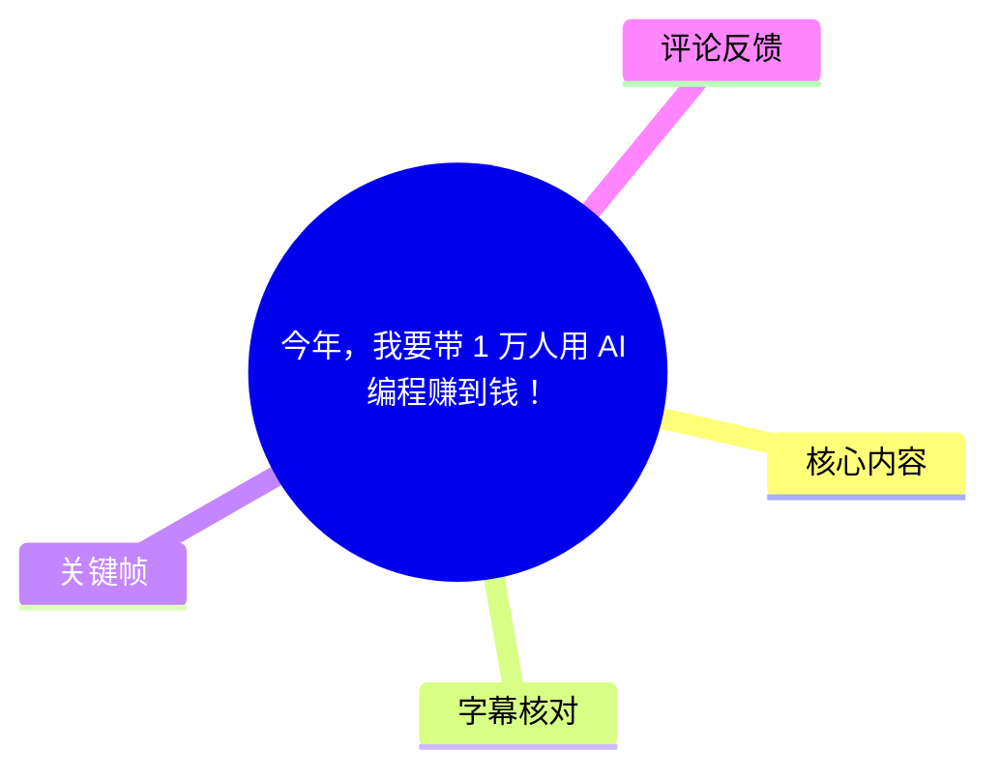
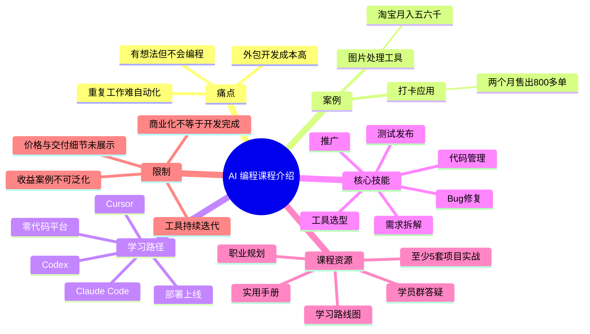
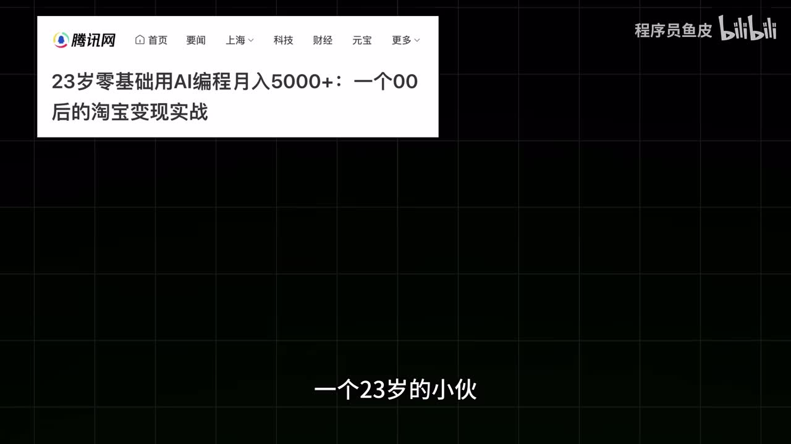
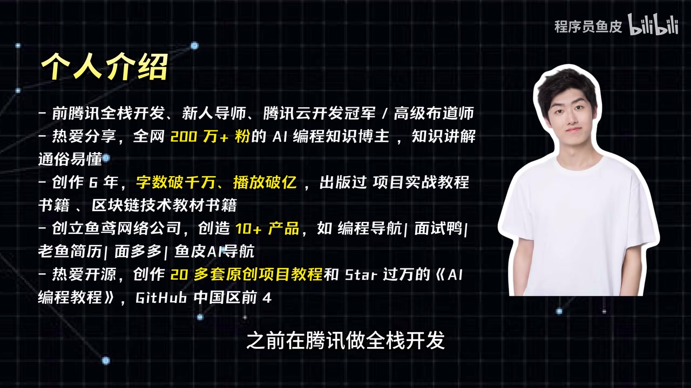

# 今年，我要带 1 万人用 AI 编程赚到钱！

> 来源：[Bilibili 视频](https://www.bilibili.com/video/BV1ntVm6qEu4)<br>
> UP 主：程序员鱼皮｜发布时间：2026-06-03｜视频时长：03:46｜合集：AIcode  
> 数据快照：播放 66,810、点赞 2,503、收藏 1,246、评论 117（抓取于 2026-07-16）

## 小结

这是一支面向零编程基础人群的 AI 编程课程宣传与学习路径介绍视频。UP 主的核心主张是：普通人不必先成为传统意义上的程序员，也可以借助 AI 将重复性需求、个人想法转化为网站、工具或小程序；课程试图教授的重点不是单一工具，而是一套可复用的 AI 协作开发方法。

视频以两个变现案例作为动机：一名 23 岁、无编程基础的用户用 AI 制作图片处理工具并在淘宝销售；一名前媒体人制作打卡应用并售出 800 多单。这些均为视频转述的个案及其收入/销量说法，不能据此推导普遍成功率，也不能将“能做出产品”等同于“必然能赚到钱”。

课程路径按难度推进：先从浏览器可打开的零代码平台起步，快速完成可访问网站；再转向 Cursor、Codex、Claude Code 等专业工具，制作并部署完整项目；随后学习工具选择、需求拆解、Bug 修复、代码管理、测试、发布和推广。视频还承诺至少 5 套企业级项目实战、学习手册、路线图、职业规划与学员群答疑。

值得迁移的经验是：AI 编程的价值不只在“生成代码”，而在于把需求定义、工具选择、验证、交付和推广连成闭环。尤其是非技术学习者，应从一个真实且可验证的微型需求开始，逐步建立“提出需求—生成实现—测试修复—上线使用”的工作流。

视频没有展示课程价格、完整课程大纲、项目源码、平台成本、真实学员转化率、收入分成或售后细则；“企业级”“能变现”“能力不会过时”等措辞属于课程宣传或主观判断，购买及实践前仍需核实。AI 工具、定价、能力、可用地区和产品接口迭代快，视频提到的具体工具与服务安排具有时效性。

## 思维导图





## 目录

- [问题场景与案例主张](#问题场景与案例主张)
- [课程定位、适用人群与讲师自述](#课程定位适用人群与讲师自述)
- [从零代码到上线的学习步骤](#从零代码到上线的学习步骤)
- [完整开发流程与项目实战](#完整开发流程与项目实战)
- [配套资源、答疑与职业路径](#配套资源答疑与职业路径)
- [实践建议：把 AI 编程变成可验证交付](#实践建议把-ai-编程变成可验证交付)
- [结论、限制与时效性](#结论限制与时效性)
- [关键帧索引](#关键帧索引)
- [字幕比对](#字幕比对)
- [评论分析](#评论分析)
- [处理记录](#处理记录)

## [问题场景与案例主张](https://www.bilibili.com/video/BV1ntVm6qEu4?t=35)

视频从“学习或工作中烦人的重复事项”切入：如果能做一个小工具自动处理，或将脑中的想法做成可用网站，许多人都会有类似需求；但不会编程、外包成本较高，往往会成为行动障碍。

UP 主以两个案例说明其观点：

1. **图片处理工具案例**：视频称一名 23 岁、没有编程基础的年轻人，借助 AI 制作图片处理工具并在淘宝销售，月收入可稳定达到“五六千”。
2. **打卡应用案例**：视频称一名从北京辞职的 31 岁前媒体人，在没有代码基础的情况下用 AI 制作打卡应用，两个月售出 800 多单。

视频据此给出的解释是：案例中的人与观众的差异不一定是会不会手写代码，而是是否掌握了正确使用 AI 的方法。课程的销售主张则是，学习者可借助 AI 制作网站、工具、小程序及具有商业价值的产品。



> 图：该关键帧直接展示了视频援引的“23 岁零基础、AI 编程、淘宝变现”案例标题，是理解其宣传切入点的重要画面证据。标题只支持视频确实引用了该案例，不足以独立验证具体收入的持续性、成本和适用范围。

### 对案例的审慎解读

- 视频提供的是**结果叙事**，未提供案例完整产品形态、获客成本、平台抽成、退款率、维护成本或收入证明。
- “做出来”与“卖出去”是两个不同阶段：AI 可以降低开发门槛，但不能自动解决需求验证、定位、获客、交付、售后和合规问题。
- 因此，案例适合被视为“存在某种可能性”的动机，而不应被当作个人收益预测。

## [课程定位、适用人群与讲师自述](https://www.bilibili.com/video/BV1ntVm6qEu4?t=60)

UP 主在视频中自述：曾在腾讯从事全栈开发，目前自主创业并带团队制作了十多款产品；从事知识分享六年多，拥有 200 多万粉丝；过去两年半高强度使用 AI 编程，并编写过数十万字的零基础 AI 编程教程，帮助一些用户上线第一个作品。

画面中的个人介绍页还列出了更多自述履历，包括前腾讯全栈开发、新人导师、腾讯云开发冠军/高级布道师、创作 6 年、字数破千万、播放破亿、创建公司并创造 10+ 产品、制作 20 多套原创项目教程等。这些属于 UP 主在视频中的个人陈述，本文不将其替代为外部可核验事实。



> 图：关键帧以文字列举讲师的职业、创作及产品经历，补充了口播中较简略的个人背景说明，也明确这些信息的来源是视频自述。

### 面向对象

视频明确将课程面向以下零基础或非开发背景人群：

- 学生；
- 产品经理；
- 运营人员；
- 设计师；
- 希望发展副业的上班族；
- 有想法、希望自行做出作品，但没有传统编程基础的人。

UP 主强调，学习目标不只是完成若干具体项目，更是形成可重复调用的方法与 AI 编程能力，使学习者在未来有新想法时可以独立尝试实现。

## [从零代码到上线的学习步骤](https://www.bilibili.com/video/BV1ntVm6qEu4?t=108)

视频给出的教学安排具有由浅入深的顺序，可整理为以下实践路径：

### 第 1 步：完成基础环境搭建

从最基本的环境搭建开始。视频没有列出操作系统、账号、网络环境、API 密钥或具体安装命令，因此无法补充为确定的配置步骤；学习者需要以实际课程或所选工具的官方文档为准。

### 第 2 步：先用零代码平台制作可访问网站

课程首先采用可通过浏览器打开的零代码平台，目标是在几分钟内做出一个可以访问的网站。

这一阶段的重点应是快速把想法变成可点击、可展示的原型，而非一开始追求复杂架构。视频未点名该零代码平台的具体产品，也未说明其免费额度、导出能力、域名配置或数据归属。

### 第 3 步：转向专业 AI 编程工具

视频点名的工具包括：

| 工具名称 | 视频中的定位 | 视频明确说明的用途 |
| --- | --- | --- |
| Cursor | 专业工具 | 用于制作第一个完整项目 |
| Codex | 专业工具 | 用于制作第一个完整项目 |
| Claude Code | 专业工具 | 用于制作第一个完整项目 |

ASR 将 `Claude Code` 识别为“Cloud Code”，结合视频简介中列出的工具名与常见产品名称，本文校正为 **Claude Code**。视频没有比较三者的价格、模型、上下文限制、隐私条款、使用门槛或适用语言，不能据此得出工具优劣结论。

### 第 4 步：部署并让他人访问

视频将“做完整项目”与“部署上线”放在同一阶段，目标是让朋友可以随时访问和使用。部署意味着项目不再只是本机代码或原型，而成为可被真实用户使用的服务。

不过视频未展示部署平台、域名、数据库、鉴权、监控、备份、成本控制或安全设置。若项目包含用户数据、支付、内容发布或开放接口，应额外处理隐私、权限、日志和合规问题。


> 图：画面中的“写代码”被打叉，配合“掌握了一套”字幕，直观呈现视频对学习重点的定位：并非只训练手写代码，而是学习如何借助 AI 完成开发任务。

## [完整开发流程与项目实战](https://www.bilibili.com/video/BV1ntVm6qEu4?t=132)

在完成基础项目后，视频称会教授独立完成项目所需的核心技能。其流程覆盖范围包括：

1. **工具怎么选**：针对任务选择合适的平台或 AI 编程工具。
2. **需求怎么拆**：将模糊想法拆分成可执行的页面、功能、数据和交互任务。
3. **Bug 怎么修**：定位问题、向 AI 提供报错和复现信息、验证修改结果。
4. **代码怎么管理**：管理代码与项目版本；视频未明确提及 Git、分支策略或仓库平台。
5. **产品怎么测试**：在发布前检验功能；视频未列出测试用例、自动化测试或兼容性范围。
6. **发布和推广**：将产品交付给用户并进行推广；视频未展开具体渠道、预算或转化方法。

### 项目实战承诺

课程的“重头戏”是至少 5 套不同类型的企业级项目实战，涵盖网站、小程序等形式，均从零开始讲解。UP 主称，完成后可形成一份可展示的作品集，甚至可用于投递简历。

这里需要区分：

- **视频明确承诺**：至少 5 套项目、网站和小程序等多种形式、从零讲解、可形成作品集。
- **视频未展示的信息**：5 套项目的准确名称、技术栈、源码授权、更新频率、作业批改、项目难度、是否包含上线费用。
- **合理但非视频保证的前提**：作品集能否用于求职，取决于项目真实性、本人理解程度、代码质量、部署地址、文档完整度以及岗位要求，而非仅取决于完成课程。

## [配套资源、答疑与职业路径](https://www.bilibili.com/video/BV1ntVm6qEu4?t=157)

视频称除项目实战外，还会提供以下资源：

- UP 主总结的若干 AI 编程“心法”；
- 可随时查看的 AI 编程实用手册；
- 专属学员群中的提问与答疑；
- 完整 AI 编程学习路线图；
- AI 大模型开发职业规划。

UP 主认为，AI 时代技术迭代很快，但在课程中学到的能力和思维不易过时；即使工具更新，学习者也应能更快上手。其逻辑是：工具界面与模型会变，但需求表达、任务拆解、验证结果、修复问题和完成交付等能力可以迁移。

### 课程支持的边界

视频将购买课程描述为“建立联结”，并称可在学员群提问、获得解决思路和学习建议。但没有说明：

- 群答疑的响应时间、频次、服务期限及是否由本人答复；
- 是否提供一对一辅导；
- 工具账号、模型 API、域名和云资源等第三方费用是否包含在课程内；
- 课程更新是否免费、更新范围如何界定；
- 收益、就业或项目上线是否有任何保证。

因此，学员群和路线图可以视为学习支持资源，不能直接等同于技术支持 SLA、就业承诺或商业成功保证。

## [实践建议：把 AI 编程变成可验证交付](https://www.bilibili.com/video/BV1ntVm6qEu4?t=181)

结合视频提出的“方法优先、完整流程”思路，零基础学习者可采用下面的最小闭环。以下是对视频内容的实践化整理，并非视频逐字展示的操作教程。

### 1. 选择一个重复且具体的问题

不要从“我要做一个平台”开始，而应写成可检验的任务，例如：

- 把固定格式的表格整理为统一字段；
- 为一类图片完成裁切、压缩或加水印；
- 记录每日打卡并汇总连续天数；
- 制作一个可分享的单页信息网站。

问题应包含目标用户、输入、输出和成功标准。比如：“用户上传一张图片后，能得到压缩后的下载文件”比“做图片工具”更容易拆解与测试。

### 2. 先做最小可用版本

先用零代码平台或 AI 工具完成最短路径：

```text
输入 → 处理规则 → 结果展示/下载 → 用户反馈
```

首版只验证核心价值，不要同时加入登录、会员、积分、社区、复杂后台等附加功能。核心流程可用后，再根据实际用户反馈迭代。

### 3. 用任务单与 AI 协作，而非只给一句模糊指令

每个开发任务最好提供：

- 当前项目使用的技术或平台；
- 要修改的页面/模块；
- 用户操作流程；
- 输入和预期输出；
- 边界条件；
- 报错全文、截图或复现步骤；
- 验收标准。

例如，遇到 Bug 时，先复现并记录“何时发生、如何发生、正确结果应是什么”，再让 AI 分析。修改后仍需由人实际测试，不能只接受 AI 的文字说明。

### 4. 上线前完成基础验证

至少应检查：

- 核心流程是否能从头走通；
- 移动端和桌面端是否能正常访问；
- 空输入、异常输入和重复提交是否有合理反馈；
- 第三方密钥是否未暴露在前端代码或公开仓库；
- 用户数据是否有最小必要的权限控制；
- 页面文案、链接、按钮与下载功能是否可用。

### 5. 将“推广与销售”视作独立课题

视频提及推广，但没有展开方法。热评也指出，商业化难点往往不止开发。因此产品完成后仍需要验证：

- 谁愿意使用或付费；
- 用户当前如何解决问题；
- 产品的替代方案是什么；
- 获客渠道与成本能否承受；
- 客服、维护和持续迭代由谁完成。

## [结论、限制与时效性](https://www.bilibili.com/video/BV1ntVm6qEu4?t=205)

视频的可取之处是把 AI 编程学习从“会不会写代码”的单点问题，扩展为“能否独立完成一个产品闭环”的问题。对于零基础人群，先通过零代码或 AI 辅助工具完成可访问作品，再学习需求、调试、测试和部署，比仅观看概念内容更容易获得反馈。

但必须保留以下边界：

- **收益不保证**：视频中的收入、销量与“赚到钱”均是案例或营销目标，不能代表个人可复制的结果。
- **技术输出不等于产品质量**：AI 生成的代码可能存在逻辑错误、安全问题、依赖冲突、性能问题或许可风险，仍需测试与审查。
- **工具名称具有时效性**：Cursor、Codex、Claude Code 及零代码平台的价格、模型、功能、地区支持和使用政策可能已变化，应以使用时官方说明为准。
- **“企业级”需具体核验**：视频未展示项目架构、并发指标、安全设计、运维方案或真实生产规模，不能仅凭宣传词判断其工程级别。
- **课程信息仍不完整**：价格、退款规则、课程有效期、更新计划、源码与资源权限等关键购买条件未在素材中出现。
- **标题中的“带 1 万人”**：这是视频标题中的目标表述；本视频口播素材未说明达成方式、阶段目标或当前完成数量。

## [关键帧索引](https://www.bilibili.com/video/BV1ntVm6qEu4?t=35)

| 关键帧 | 正文用途 | 画面价值 |
| --- | --- | --- |
| [frame-002.jpg](frames/frame-002.jpg) | 案例主张 | 展示视频引用的“23 岁零基础 AI 编程月入 5000+”媒体标题，帮助识别案例来源与营销切入点。 |
| [frame-003.jpg](frames/frame-003.jpg) | 方法定位 | “写代码”被打叉，强调课程想传达的是掌握 AI 协作方法，而非仅手写代码。 |
| [frame-004.jpg](frames/frame-004.jpg) | 讲师背景 | 呈现个人介绍页，可与口播中的职业及创作经历相互参照，并保留其“自述”属性。 |

> 未将其余关键帧强行插入正文：当前提供的画面素材中，上述三帧与案例、课程定位和讲师介绍有直接对应关系，信息密度更高；其余帧未在给定素材中附带可可靠识别的画面说明，避免作超出素材的推断。

## 字幕比对

| 字幕来源 | 完整性 | 专有名词 | 时间轴 | 主要问题 |
| --- | --- | --- | --- | --- |
| Bilibili 站内字幕 | 未提供可用字幕 | 无法核验 | 无法使用 | 素材明确说明没有可用站内字幕。 |
| 本次 ASR 字幕 | 覆盖 35.54–225.08 秒，语音覆盖约 84.2% | 存在多处误识别，但可由视频简介和画面校正部分词语 | 有 9 个真实 SRT 时间段，可直接用于时间轴 | 开头约 35 秒没有 ASR 语音段；长段落内缺少句级切分；“Cloud Code”“BUD”“代砍”等存在误识别及乱码。 |

### 最终字幕选择与校正

最终采用**本次 ASR 的真实 SRT 时间段**作为时间轴依据，并结合视频简介、关键帧文字和上下文对术语进行审慎校正；未提供站内字幕，因此不存在两份字幕的逐句合并。

已校正或标注的重点包括：

| ASR 结果 | 本文采用 | 校正依据 |
| --- | --- | --- |
| “Cloud Code” | Claude Code | 视频简介明确列出“Cursor、Codex、Claude Code”。 |
| “BUD 怎么修” | Bug 怎么修 | 上下文为独立做项目的核心技能，且“Bug 修复”符合常见表述。 |
| “零编成基硃” | 零编程基础 | 明显语音识别错误，上下文多次强调零基础。 |
| “AI 缨程” | AI 编程 | 常见同音/字形误识别。 |
| “代砍” | 代码 | 上下文为“不是会写代码”。 |
| “学书建议” | 学习建议 | 语义与口播上下文校正。 |

ASR 诊断未标记 `noAudioStream=true`，且识别出中文音轨，语言置信度约 0.9995；因此并非无音轨视频。时间轴链接均优先取自 ASR SRT 的真实分段起点：35、60、84、108、132、157、181、205 秒等。

## 评论分析

以下仅分析可获取热评前三条；评论反映的是观众个人观点或玩笑，不作为事实证明。

### 1. 伪善的兔子（177 赞）

> “[吃瓜]真的吗 那能不能先免费给我看看课 我赚到钱了 再给你付费”

评论以玩笑方式质疑“学习后赚钱”的先后关系，希望课程先免费证明价值、自己获利后再支付。它没有提供课程质量或收益可行性的证据，但反映了观众对结果导向营销的谨慎态度：当课程以变现为吸引点时，用户自然会关注风险由谁承担、效果如何验证。

### 2. 安静_苦笑（72 赞）

> “最难的不是怎么开发，是怎么卖，没AI编程前厉害的程序员也多了去了，怎么没几个自己创业成功的，不都是给大厂打工吗？商业比技术难几百倍”

该评论提出了视频中未充分展开的关键补充：开发能力与商业成功之间还隔着产品定位、销售、渠道、运营与管理。其“商业比技术难几百倍”是修辞性主张，无法量化验证；但它提醒学习者，不应将 AI 编程能力与创业成功或稳定收入直接画等号。

### 3. 来迎接汪（27 赞）

> “最烦的每天任务就是手游清日常任务[doge]”

这是对视频“自动化重复任务”开场的轻松联想。它没有提供实际的 AI 编程方案，但说明“重复任务自动化”这一需求点容易引发共鸣。需要注意的是，游戏自动化可能涉及游戏规则、账号安全或平台条款，不宜仅因技术上可能实现就直接实践。

## 处理记录

- Worker ID：`worker-mrj0wbly-5dc4e50c`
- 模型：`gpt-5.6-terra`
- 调用工具与素材：视频元数据、ASR 结果与 SRT（`asr/asr-result.json`、`asr/transcript.srt`）、关键帧目录（`frames/`）、热评数据（`comments/comments.json`）、视频简介与封面信息。
- 使用的应用工具：素材解析工作流已生成 `merged.mp4`、`audio/audio.wav`、12 张关键帧及 ASR 文件；本整理基于所提供的结构化结果完成，未执行外部事实检索。
- 字幕选择：站内字幕未提供可用版本；检查并采用本次 ASR，使用其真实 SRT 分段作为时间轴。ASR 有专有名词和错字问题，已仅在有视频简介或上下文支持时校正。
- 关键帧选择依据：选用 `frame-002`（案例媒体标题）、`frame-003`（“不只是写代码”的课程定位）、`frame-004`（个人介绍）三帧，均与对应正文存在直接信息关联；未对缺乏可确认语义的帧进行扩展解读。
- 评论范围：仅处理可获取的热评前三条，按要求未延伸至其他评论。
- 缓存清理：本任务仅接收并引用既有素材清单，未产生可确认的临时缓存清理记录；无法据现有素材声称已删除缓存。
- 未解决问题：课程价格、购买入口以外的交付条款、退款规则、项目完整清单、AI 工具实际配置与费用、案例收益证据、学员群服务边界均未在提供素材中展示。
