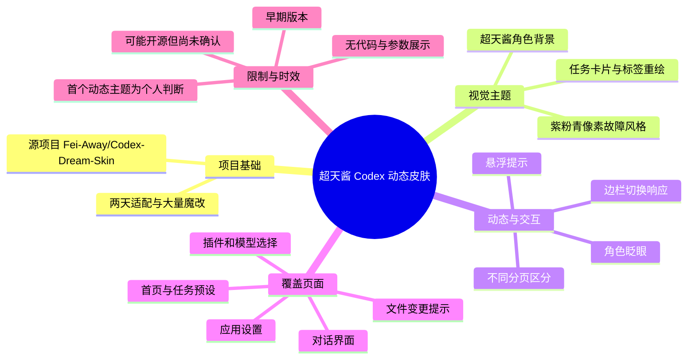
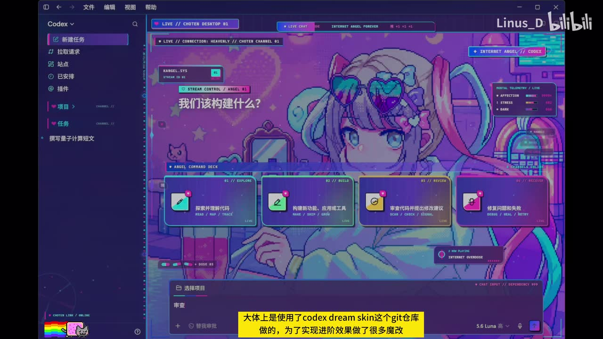
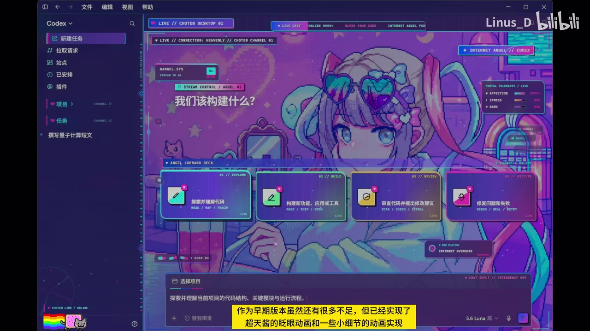
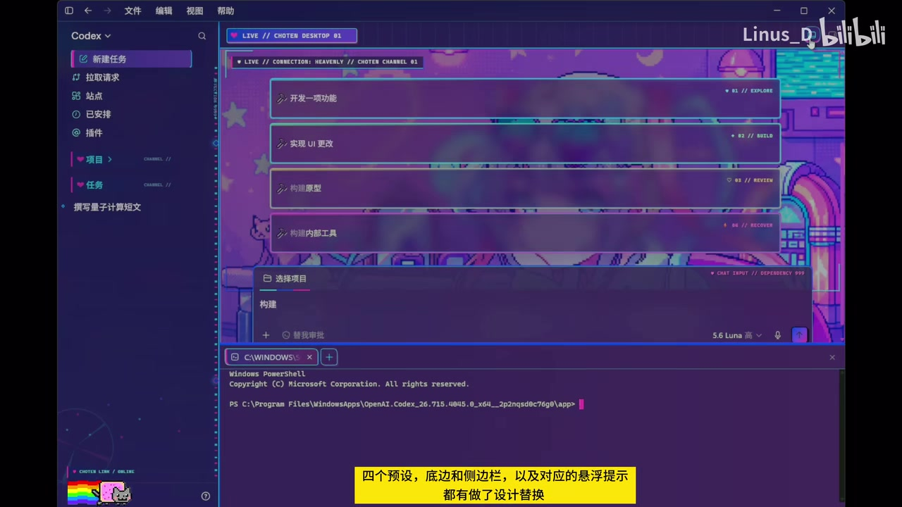

# 超天酱主题Codex皮肤——可能是史上第一个有动态效果的皮肤？

> 来源：[Bilibili 视频](https://www.bilibili.com/video/BV113Kp6RErY) 
> UP 主：Linus_D｜合集：AIcode｜时长：01:28｜分辨率：3840×2160 
> 视频简介提供的源项目：`Fei-Away/Codex-Dream-Skin`

## 小结

这是一段对 **Codex 超天酱主题皮肤早期版本**的展示视频。UP 主表示，自己花了两天将“超天酱”图像适配进 Codex，并以 `Codex-Dream-Skin` 仓库为基础进行了大量修改，目标不仅是更换静态配色和背景，还要让界面具备动态视觉效果。

视频中最关键的成果是：主题中央的超天酱角色具备**眨眼动画**，且任务卡片、预设项、底边栏、侧边栏、悬浮提示、插件设置、模型选择栏、应用设置页、对话页、文件变更提示框及边栏切换等区域均进行了不同程度的视觉重绘或状态响应。画面呈现为以紫、粉、青色为主的像素/故障风格界面。

从实现经验看，这个案例说明：若要把 Codex 类应用皮肤从“换图换色”推进到“动态主题”，需要同时处理背景素材、界面组件、不同页面状态、交互悬浮态与动画状态；仅替换一张背景图无法覆盖完整体验。视频并未给出代码、安装命令、目录结构或具体 CSS/脚本参数，因此其价值主要是设计展示与实现范围参考，而非可直接复现的教程。

UP 主明确将当前版本称为“早期版本”，承认仍有不足；并称若后续全部完成，“可能会开源放出”。这意味着**开源、可下载性、兼容版本和安装方式截至视频素材所示时点均未得到确认**。标题中“可能是史上第一个”的表述属于 UP 主的个人判断，视频没有提供与其他动态 Codex 主题的检索或对比证据。

适合关注 Codex 界面定制、AI 编程工具视觉设计、动态 UI 皮肤及《主播女孩重度依赖》衍生风格的读者。若计划实际部署，应先核验源项目当前状态、许可协议、Codex 客户端版本以及动态素材对性能和可访问性的影响。

## 思维导图

## 目录

- [背景、项目来源与展示范围](#背景项目来源与展示范围)
- [首页主题、角色动画与任务入口](#首页主题角色动画与任务入口)
- [组件替换与页面状态设计](#组件替换与页面状态设计)
- [设置、对话与变更确认界面](#设置对话与变更确认界面)
- [可迁移的实现步骤与经验](#可迁移的实现步骤与经验)
- [参数、限制与时效性](#参数限制与时效性)
- [字幕比对](#字幕比对)
- [评论分析](#评论分析)
- [处理记录](#处理记录)

## 背景、项目来源与展示范围 [00:00](https://www.bilibili.com/video/BV113Kp6RErY?t=0)

视频开头说明，UP 主为超天酱图像适配花费了“两天”，并将成品描述为“可能是 Codex 历史上第一个动态主题”。这两个信息分别说明了作者投入的制作周期，以及其对创新性的主观看法；后者并非经过视频内证据验证的行业结论。

在 [00:07](https://www.bilibili.com/video/BV113Kp6RErY?t=7) 至 [00:14](https://www.bilibili.com/video/BV113Kp6RErY?t=14)，UP 主说明主题大体基于 `Codex Dream Skin` Git 仓库制作，为了实现“进阶效果”进行了许多“魔改”。视频简介给出的项目名称为 `Fei-Away/Codex-Dream-Skin`，但素材没有提供项目链接、提交版本、许可证、依赖项或改动清单。

这里的“魔改”可确认表示：成品并非对基础仓库的原样使用，而是存在额外定制；但无法据此确定改动采用了 CSS、JavaScript、应用资源替换、注入脚本或其他具体技术路径。

> 图：关键帧展示 Codex 主界面已被替换为超天酱背景，并保留左侧导航、中央任务卡片和底部输入区域等原有功能布局。它有助于确认该项目不是单独的壁纸展示，而是覆盖了实际应用界面。

## 首页主题、角色动画与任务入口 [00:14](https://www.bilibili.com/video/BV113Kp6RErY?t=14)

UP 主在 [00:14](https://www.bilibili.com/video/BV113Kp6RErY?t=14) 至 [00:21](https://www.bilibili.com/video/BV113Kp6RErY?t=21) 表示，尽管当前是早期版本、仍有许多不足，但已经实现：

1. 超天酱角色的**眨眼动画**；
2. 一些未逐一展开说明的小细节动画。

连续关键帧可以观察到，角色双眼在不同画面状态下发生变化，和旁白中的“眨眼动画”相互印证。因此，这一动态效果不只是标题宣称，而是视频画面实际展示的一项功能。视频没有展示动画帧率、触发条件、循环周期、资源格式或性能占用，不能进一步推断实现参数。

> 图：该帧中超天酱角色呈睁眼状态，中央显示四张任务入口卡片；与相邻帧对照可帮助识别角色眼部动画，而非单纯切换静态截图。

> 图：该帧中的角色眼部状态与前一帧不同，左侧任务卡片出现高亮边框及底部说明文字。它同时体现了角色动画和任务项交互反馈两个层面。

在 [00:21](https://www.bilibili.com/video/BV113Kp6RErY?t=21) 至 [00:33](https://www.bilibili.com/video/BV113Kp6RErY?t=33)，UP 主介绍首页组件替换。结合 ASR 与画面内烧录字幕，可较可靠地整理为：

- 有“四个预设/任务入口”的视觉设计替换；
- 底边区域与侧边栏进行了替换；
- 对应的悬浮提示进行了设计；
- 项目栏可正常折叠；
- 不同分页做了区分。

其中，ASR 将“预设”误识别为“映射”，将“项目栏”误识别为“橡木蓝”；画面烧录字幕更符合界面语境，故以“预设”“项目栏”为准。视频没有展示这四项预设被点击后的完整功能流程，所能确认的是它们在主题中获得了视觉化卡片样式与至少部分悬浮状态。

## 组件替换与页面状态设计 [00:35](https://www.bilibili.com/video/BV113Kp6RErY?t=35)

在 [00:35](https://www.bilibili.com/video/BV113Kp6RErY?t=35) 至 [00:37](https://www.bilibili.com/video/BV113Kp6RErY?t=37)，UP 主称插件设置和模型选择栏也“有效果”。这句话未详细定义“效果”的具体形式，但从整段展示的设计语言看，可确认其意在强调这些非首页区域同样接受了主题化处理，而非仅修改首屏。

> 图：画面展示四项纵向预设列表、左侧导航、底部区域与 Windows PowerShell 窗口同时存在。该帧的价值在于说明主题设计考虑了任务列表等展开状态，并需要与应用实际操作环境共存。

从前四张关键帧可见的设计要素包括：

| 区域 | 可见设计特征 | 视频可确认的交互/动态 |
| --- | --- | --- |
| 主内容背景 | 超天酱角色插画、像素化装饰、紫粉青配色 | 角色眨眼动画 |
| 顶部标签/状态条 | 心形、`LIVE`、频道/连接等装饰文字 | 仅可见视觉样式，未展示点击逻辑 |
| 任务入口卡片 | 四张带图标的卡片、发光边缘、标签化标题 | 至少展示一项悬浮高亮与说明 |
| 左侧导航 | 深色导航栏配合粉青色细节 | 项目栏可折叠为 UP 主陈述 |
| 底边与输入区域 | 青粉边线、状态信息、带装饰的输入区 | 设计替换得到旁白确认 |
| 预设列表 | 半透明紫色长条列表、编号/英文标签 | 展示列表状态，未展示选择后的执行过程 |

需要注意：画面中的“LIVE”“MENTAL TELEMETRY”等英文元素具有装饰性，不能将其解释为 Codex 实际新增的直播、情绪遥测或联网功能。

## 设置、对话与变更确认界面 [00:46](https://www.bilibili.com/video/BV113Kp6RErY?t=46)

UP 主在 [00:46](https://www.bilibili.com/video/BV113Kp6RErY?t=46) 至 [00:49](https://www.bilibili.com/video/BV113Kp6RErY?t=46) 表示，**应用设置界面**也进行了替换。此后视频进入对话相关界面：

- [00:53](https://www.bilibili.com/video/BV113Kp6RErY?t=53)：切换至对话界面；
- [00:57](https://www.bilibili.com/video/BV113Kp6RErY?t=57)：UP 主称自己为某个“命令/提示”也做出了效果，但本段 ASR 将关键名词识别为“Trump 的命使”，语义不稳定，素材中没有足够画面证据可校正，故不将该名称视为可靠事实；
- [01:01](https://www.bilibili.com/video/BV113Kp6RErY?t=61)：尝试进行一次对话实现；
- [01:06](https://www.bilibili.com/video/BV113Kp6RErY?t=66)：测试文件更改提示框；
- [01:16](https://www.bilibili.com/video/BV113Kp6RErY?t=76)：切换边栏会有相应响应；
- [01:18](https://www.bilibili.com/video/BV113Kp6RErY?t=78)：还有其他细节效果，但未逐一展示。

这部分反映出作者的覆盖目标不局限于静态首页：设置、对话、确认提示与边栏切换等应用状态均被纳入主题适配范围。但视频没有展示一次完整的真实模型响应、文件改动内容、确认按钮行为或错误场景，不能据此评价功能可靠性。

## 可迁移的实现步骤与经验 [00:07](https://www.bilibili.com/video/BV113Kp6RErY?t=7)

以下是根据视频展示范围整理的**实现规划框架**，不是 UP 主公开的实际代码步骤。视频没有给出可复制的命令、文件路径、配置格式或参数，因此不能将本节当作该主题的安装教程。

1. **确定基础皮肤项目与目标客户端**
   - 视频以 `Fei-Away/Codex-Dream-Skin` 为基础。
   - 实践前应确认该项目是否仍可访问、支持的 Codex 版本、安装入口和许可证。
   - 由于视频未给出这些信息，不能假定当前版本仍兼容。

2. **先建立全局视觉语言**
   - 从画面可提炼的元素包括紫/粉/青色、高对比描边、半透明面板、像素风图标与故障风装饰。
   - 需要先统一背景层、文字可读性、边框、卡片、按钮及高亮色，避免只替换背景导致控件与背景混淆。

3. **分别覆盖常用界面状态**
   - 视频涉及首页任务入口、预设列表、侧边栏、底边栏、悬浮提示、插件设置、模型选择、应用设置、对话与文件更改提示。
   - 经验上，应逐页验证默认态、悬浮态、选中态、展开态、折叠态和确认弹窗态；视频中任务卡片高亮与项目栏折叠即是状态适配的例子。

4. **为动态效果单独设计资源与降级方案**
   - 视频已实现角色眨眼及部分细节动画。
   - 动画主题应关注循环是否突兀、是否影响文本阅读、是否会遮挡操作控件，以及禁用动画或低性能环境下的静态降级。
   - 上述性能与无障碍要求是通用工程建议，**并非视频中已展示的实现**。

5. **以真实操作路径回归测试**
   - 至少应检查切换项目栏、进入设置、选择模型、进入对话、触发文件变更确认等路径。
   - 视频展示了这些区域中的部分视觉效果，但未公开测试矩阵、成功率或异常处理结论。

## 参数、限制与时效性 [01:22](https://www.bilibili.com/video/BV113Kp6RErY?t=82)

### 视频中可确认的参数与事实

| 项目 | 内容 |
| --- | --- |
| 视频时长 | 88 秒；ASR 音频时长诊断为 87.5306875 秒 |
| 画面分辨率 | 3840×2160 |
| 制作基础 | `Fei-Away/Codex-Dream-Skin` |
| 制作投入 | UP 主称花费两天 |
| 已展示动态 | 超天酱眨眼动画、其他未逐一展示的细节动画 |
| 已提及区域 | 预设/任务项、底边栏、侧边栏、悬浮提示、项目栏、分页、插件设置、模型选择、应用设置、对话界面、文件变更提示、边栏切换 |
| ASR 识别模型 | `medium`，语言识别为中文，置信概率 0.9868，CUDA / float16 |

### 明确限制

1. **尚属早期版本**：UP 主明确表示仍有许多不足，但没有逐项列出缺陷。
2. **未给出安装资料**：素材没有提供仓库 URL、发布包、代码片段、命令、主题文件格式、配置路径或支持平台。
3. **效果未全量展示**：UP 主称还有许多细节效果未逐一展示，因此不能据此建立完整功能清单。
4. **缺少兼容性与性能数据**：未说明支持的 Codex 版本、操作系统、GPU/CPU 占用、内存消耗、动画帧率或稳定性。
5. **“第一个”不可验证**：标题与旁白中的“可能是历史上第一个动态主题”是作者判断，不能作为已证实事实。
6. **开源未承诺**：截至 [01:22](https://www.bilibili.com/video/BV113Kp6RErY?t=82)，UP 主仅表示“之后全部做完了的话可能会开源放出”，并不等同于已经开源或确定会开源。

### 时效性

本视频元数据抓取于 2026-07-21，主题状态应理解为该时点的早期展示。源项目、Codex 客户端界面、主题注入方式和开源进展均可能后续变化；实际使用前需要重新核对项目仓库与 UP 主最新动态。

## 字幕比对

| 字幕来源 | 完整性 | 专有名词 | 时间轴 | 主要问题 |
| --- | --- | --- | --- | --- |
| Bilibili 站内字幕 | 未提供可用字幕 | 无法核验 | 无法使用 | 素材明确说明未提供可用站内字幕 |
| 本次 ASR 字幕 | 覆盖主要旁白；18 段、语音覆盖约 61.72% | 多个 UI/项目词识别不稳定 | 可用，带精确起止时间 | 存在同音误识别、个别无意义短段及一处约 9.23 秒语音空档 |

本次素材的 `asr-result.json` **未标记** `noAudioStream=true`，并提供了音频文件与带时间戳的 ASR 结果，因此可确认源视频存在可供识别的音轨；不存在“无音轨导致无法转写”的情况。

最终采用策略为：**以本次 ASR 的时间轴为章节定位依据，以视频关键帧中的烧录字幕和界面语境校正明显误识别词，但不对无法证实的内容强行补写。**

重要校正与保留情况：

| ASR 原文 | 处理结果 | 依据 |
| --- | --- | --- |
| “超天降的圖片” | 记为“超天酱的图片” | 视频标题、标签及画面中的角色主题一致 |
| “CODUX / CODUCS Dream Skin” | 记为“Codex Dream Skin” | 视频标题、简介中的 `Fei-Away/Codex-Dream-Skin` |
| “超天戰的眨眼動畫” | 记为“超天酱的眨眼动画” | 主题名称与画面角色一致 |
| “四個映射” | 记为“四个预设/任务入口” | 关键帧烧录字幕与画面中四项任务卡片 |
| “橡木藍” | 记为“项目栏” | 烧录字幕与 Codex 界面语境 |
| “插件設計” | 倾向记为“插件设置” | 语境为界面区域；但原始语音无法完全复核 |
| “Trump 的命使” | 不作具体专有名词结论 | 缺少站内字幕和足够清晰的关键帧证据 |
| 单字“布” | 不纳入内容结论 | 该段仅 0.56 秒，明显不构成可理解语义 |

ASR 在 [00:37.69—00:46.92](https://www.bilibili.com/video/BV113Kp6RErY?t=37) 存在约 9.23 秒的大间隔。该间隔可能主要是无旁白的界面演示；没有站内字幕可补充，故正文不编造该时段的口述内容。

## 评论分析

仅处理可获取的热评前三条；评论是观众反馈，不作为项目已实现功能的证据。

1. **太平岛逃兵**（6 赞）  
   - 评论提出希望实现“AI 输出时角色动嘴”，让超天酱看起来像在说话。
   - 这是一项功能建议，显示观众期待将现有眨眼动画扩展为与 AI 文本输出联动的口型动画。
   - 视频仅确认眨眼等动画，并未展示口型同步、文本长度驱动、语音驱动或流式输出联动，因此该功能目前不能视为已实现。

2. **UUU_MMM**（0 赞）  
   - 评论内容为“@Northfy 懂我意思吗”，属于对其他用户的上下文交流。
   - 未提供可独立核实的主题信息、技术建议或争议观点，无法据此扩展项目结论。

3. **魔法少女糖铃亲**（0 赞）  
   - 评论使用超天酱表情包表达喜爱和关注意愿。
   - 反映出主题在目标 IP 爱好者中的情绪认同，但没有补充可验证的安装、功能或兼容性信息。

## 处理记录

- Worker ID：`worker-mrj0www4-e8d79408`
- 模型：`gpt-5.6-terra`
- ASR 模型与运行信息：`medium`；中文识别；CUDA；`float16`；识别音频时长 87.5306875 秒。
- 使用的素材工具输出：视频合并文件 `merged.mp4`、音频 `audio/audio.wav`、ASR 结果 `asr/asr-result.json`、SRT `asr/transcript.srt`、关键帧目录 `frames/`、评论文件 `comments/comments.json`、元数据与封面文件。
- 字幕选择：站内字幕不可用；已检查本次 ASR，采用其真实 SRT 起止时间作为时间轴依据，并以关键帧中可见的烧录字幕校正“Codex Dream Skin”“超天酱”“四个预设”“项目栏”等明显误识别。
- 关键帧选择依据：选用 `frame-001.jpg` 至 `frame-004.jpg`，原因是这些帧直接展示首页整体视觉、角色不同眼部状态、任务卡片悬浮反馈及预设列表/底栏状态，能对应旁白中已明确提到的主题、动画与组件替换；未对未提供画面内容的帧作臆测性描述。
- 评论处理：仅分析了可获取热评前三条，未扩展到其他评论。
- 缓存清理：素材清单未提供缓存清理执行记录；为避免编造，不宣称已完成清理。
- 未解决问题：源项目的实际链接与版本、许可证、安装步骤、主题实现技术、兼容性、性能参数、完整效果清单，以及是否已正式开源，均无法从现有素材确认。
