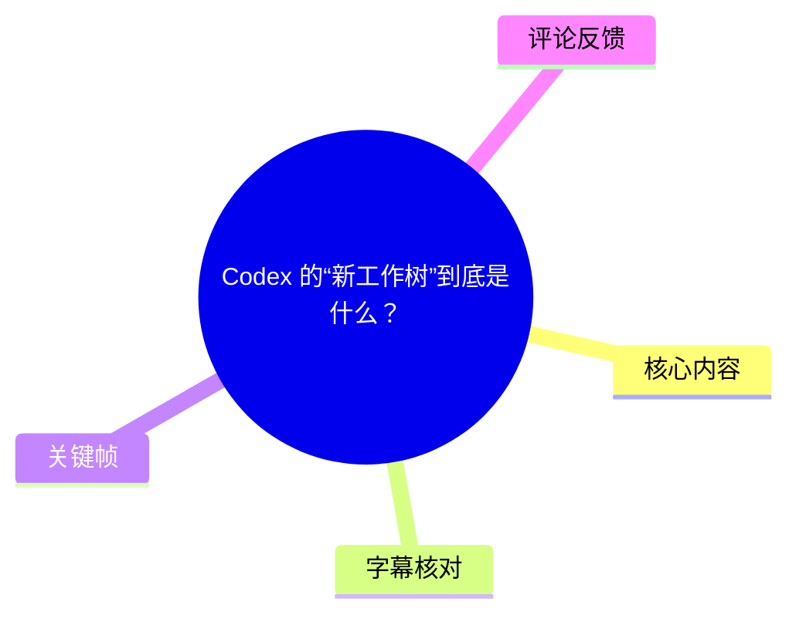
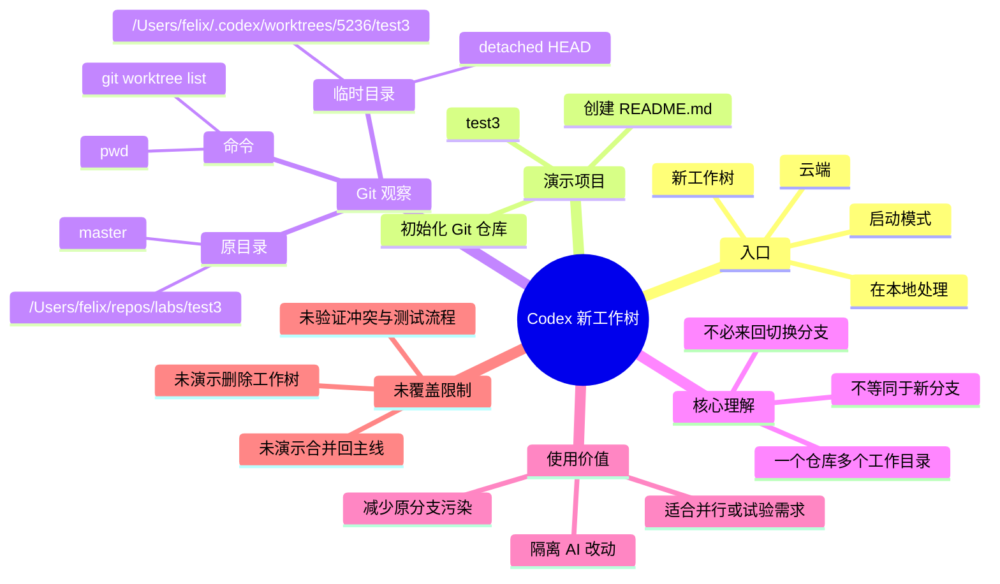
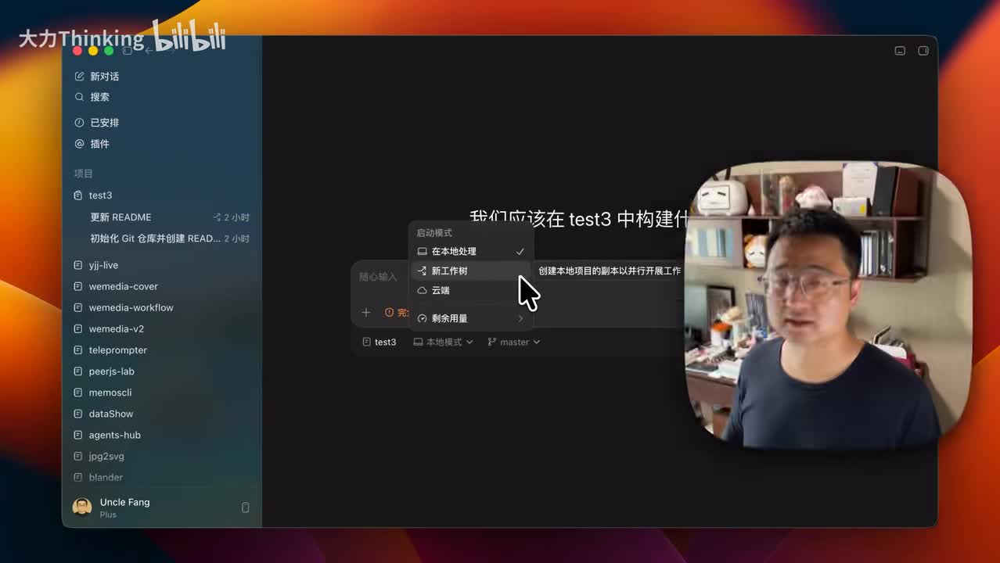
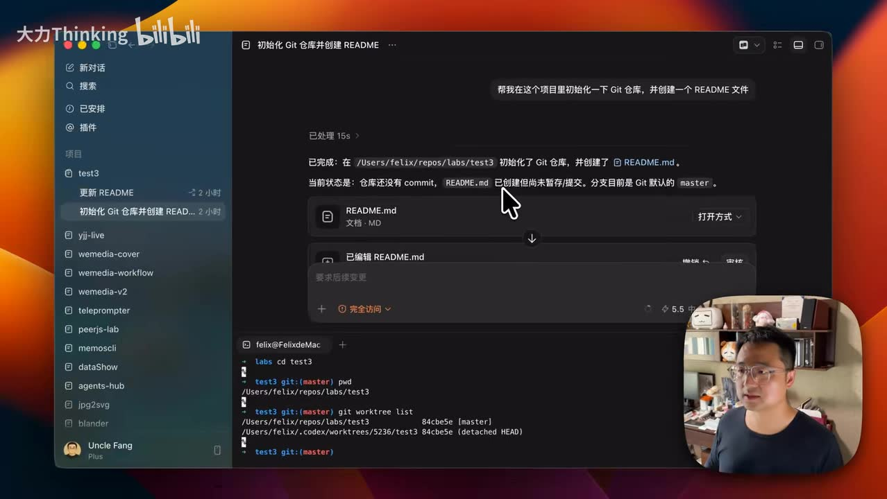
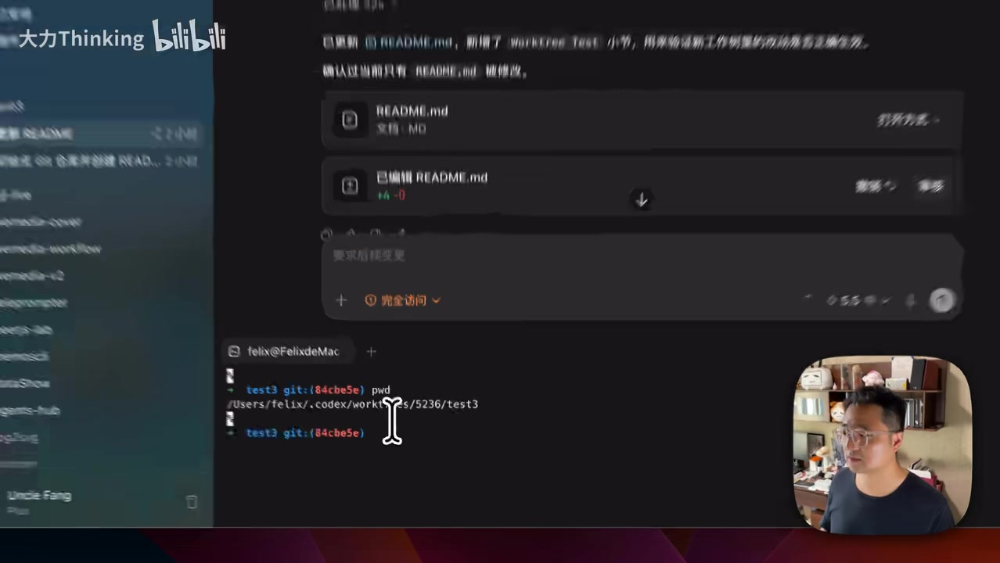
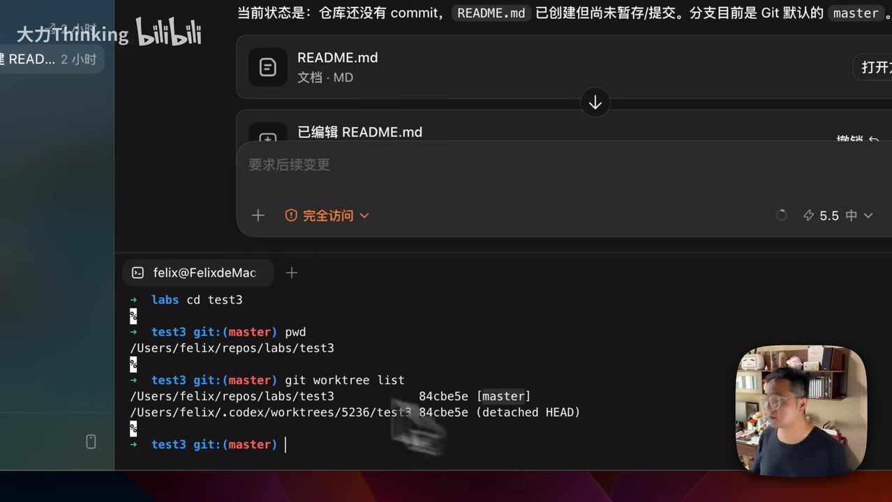

# Codex 的“新工作树”到底是什么？

> 来源：[Bilibili 视频](https://www.bilibili.com/video/BV1bDTg6eEyP)  
> UP 主：大力Thinking｜时长：2 分 46 秒｜标签：`CodeX`、`Worktree`、`Git`  
> 时效说明：本文仅整理该视频及其采集素材中演示的 Codex 界面、Git 输出与评论信息。Codex 产品界面、工作树目录策略和默认行为都可能随版本变化。

## 小结

视频围绕 Codex 启动模式中的“新工作树”展开。作者一开始将其理解为“新建 Git 分支”，但通过创建 `test3` 仓库、让 Codex 修改 `README.md`、检查当前路径并执行 `git worktree list` 后，得出的结论是：**新工作树更接近 Git worktree 提供的额外工作目录，而不等同于常规意义上的新分支。**

演示中，原项目仍位于 `/Users/felix/repos/labs/test3`，并显示在 `master` 分支；切换到新工作树后的会话，则位于 `/Users/felix/.codex/worktrees/5236/test3`。`git worktree list` 同时列出原项目和这一额外目录，后者在画面中标注为 `detached HEAD`。这说明至少在该次演示状态中，Codex 为任务建立了仓库外的独立工作目录，并将其检出到某个提交点，而非直接把原工作目录切到另一个分支。

这项机制的关键价值是隔离：当 AI 编码产生大量不确定、可能不需要的改动时，可以让其在临时工作区先完成修改和提交；如果结果值得保留，再由开发者审阅、迁移或整合；若结果无用，则可丢弃临时工作区，从而避免直接污染原目录或当前分支。视频强调，这也减少了人为来回切换分支时对正在进行工作的干扰。

适用对象包括：已经在 Git 仓库中使用 Codex、需要同时处理多个需求，或希望把 AI 的试验性改动与手头工作隔离的开发者。若只是单一任务、没有并行修改同一仓库文件的风险，是否值得额外创建工作树，需要结合流程复杂度判断。

需要注意，视频没有展示如何将新工作树的提交合并回 `master`、如何删除工作树、如何处理冲突，也没有进行多 Agent 并行写入、集成测试或黑盒测试验证。素材中关于“修改后已提交”与截图中展示的提交状态存在难以完全对齐之处，不能据此推断 Codex 对所有任务都会自动提交。

## 思维导图





## 目录

- [背景与问题](#背景与问题-0000)
- [Codex 模式入口与问题来源](#codex-模式入口与问题来源-0000)
- [实验：创建仓库并切换新工作树](#实验创建仓库并切换新工作树-0030)
- [用 Git 命令确认工作目录关系](#用-git-命令确认工作目录关系-0110)
- [工作树与分支：视频中的比较](#工作树与分支视频中的比较-0135)
- [操作步骤与命令清单](#操作步骤与命令清单-0030)
- [结论、限制与时效性](#结论限制与时效性-0240)
- [字幕比对](#字幕比对-0000)
- [评论分析](#评论分析-0000)
- [处理记录](#处理记录-0000)

## 背景与问题 [00:00](https://www.bilibili.com/video/BV1bDTg6eEyP?t=0)

视频开头展示 Codex 的“启动模式”菜单，包含：

- **在本地处理**
- **新工作树**
- **云端**

作者认为“在本地处理”和“云端”较容易理解，但“新工作树”的含义不够直观。其初始猜测是：新工作树可能只是新建一个 Git 分支；之后通过实际操作发现，这一理解并不完整。

这里需要区分两个层面：

1. **Git 分支（branch）**：通常用于记录一条独立的提交历史指针。开发者在同一个工作目录中切换分支时，工作区文件会随检出内容变化。
2. **Git 工作树（worktree）**：允许同一 Git 仓库在多个目录中拥有多个检出状态。不同目录可以对应不同分支，或者如视频画面所示，处于某个特定提交的 `detached HEAD` 状态。

视频的论点不是“工作树没有分支”，而是强调：**工作树与分支的抽象层次不同。** 分支是版本历史中的引用；工作树是实际文件被检出和编辑的目录环境。一个额外工作树可以关联分支，也可以关联到游离 HEAD 的提交点。

## Codex 模式入口与问题来源 [00:00](https://www.bilibili.com/video/BV1bDTg6eEyP?t=0)

画面中的 Codex 启动模式下拉菜单将“新工作树”与“在本地处理”“云端”并列。作者将其用于一个新的会话，以避免直接在既有项目工作区中处理新需求。



> 图：该帧直接展示了 Codex 界面的“启动模式”选项，“新工作树”位于本地处理与云端之间。这是理解视频讨论对象的关键界面证据，也说明作者讨论的是 Codex 中的实际功能入口，而不是抽象的 Git 命令教学。

视频中作者还提到，工作树并非 Codex 独有概念，而是 Git 已有的能力；Codex 在此处将其用于 AI 任务的隔离执行。该说法与视频后续使用 `git worktree list` 检查目录的演示相互呼应。

## 实验：创建仓库并切换新工作树 [00:30](https://www.bilibili.com/video/BV1bDTg6eEyP?t=30)

作者以名为 `test3` 的项目进行试验，命名原因是此前已有 `test1`、`test2`。实验流程可从 ASR 和关键帧整理为以下顺序：

1. 在第一个 Codex 会话中，让 Codex 初始化 Git 仓库并创建 `README.md`。
2. 作者描述中称，Codex 完成了仓库创建并进行了提交。
3. 随后新开一个会话，将启动模式从“在本地处理”切换为“新工作树”。
4. 在新工作树会话中，要求 Codex 更新 `README.md`。
5. 作者称更新后 Codex 做了提交，并在终端检查该任务所在路径。



> 图：该帧同时包含 Codex 中“初始化 Git 仓库并创建 README”的对话内容和终端区域，适合用来连接“AI 操作项目”与“用 Git/终端核验结果”这两个环节。画面下方还出现了 `git worktree list` 的输出。

不过，必须保留素材中的状态不确定性：画面上方文本可见“仓库还没有 commit”“README.md 已创建但尚未暂存/提交”之类的状态描述，而 ASR 又转述作者称已经进行了提交。截图下方的 `git worktree list` 则显示提交短哈希 `84cbe5e`。由于没有逐字时间码字幕、完整终端历史或仓库数据，无法严格判定这些画面是否处于同一操作瞬间，也不能确认每一步提交的确切顺序。

## 用 Git 命令确认工作目录关系 [01:10](https://www.bilibili.com/video/BV1bDTg6eEyP?t=70)

作者在新工作树会话的终端中执行了 `pwd`。画面显示该目录不是原项目目录，而是：

```text
/Users/felix/.codex/worktrees/5236/test3
```

这条路径是视频最直接的实证之一：Codex 在此次演示中把新工作树放在用户目录下 `.codex/worktrees/` 目录结构中，附带编号 `5236` 和项目名 `test3`。这是**该机器、该次演示**的观察结果，不应泛化为所有操作系统、所有 Codex 版本都使用完全相同的路径。



> 图：该帧放大了终端中的 `pwd` 结果，清晰显示 `/Users/felix/.codex/worktrees/5236/test3`。它证明新工作树不是把原项目目录“原地切换”为另一状态，而是使用了独立路径。

回到第一个会话后，作者在原项目中执行：

```bash
pwd
git worktree list
```

画面中 `pwd` 显示原项目路径：

```text
/Users/felix/repos/labs/test3
```

而 `git worktree list` 显示两条工作树记录，可按画面可辨识内容整理为：

```text
/Users/felix/repos/labs/test3              84cbe5e [master]
/Users/felix/.codex/worktrees/5236/test3   84cbe5e (detached HEAD)
```



> 图：该帧是视频解释“新工作树”机制的核心证据。终端中可同时看到原路径对应 `[master]`，以及 `.codex/worktrees/5236/test3` 对应 `(detached HEAD)`；它比单独的界面选项更能说明两个目录并存的 Git 状态。

从该输出可以确定的事实包括：

| 观察项 | 视频画面中的结果 | 可作出的谨慎解释 |
| --- | --- | --- |
| 工作目录数量 | `git worktree list` 列出两条记录 | 同一仓库存在原目录和额外工作树目录 |
| 原项目状态 | `/Users/felix/repos/labs/test3`，`[master]` | 原工作目录仍在 `master` |
| 新工作树状态 | `.codex/worktrees/5236/test3`，`(detached HEAD)` | 演示时额外目录检出在特定提交，而非命名分支 |
| 提交短哈希 | 两行均显示 `84cbe5e` | 该截图瞬间两者均指向这个短哈希；不能仅凭此图证明后续改动如何合并 |

## 工作树与分支：视频中的比较 [01:35](https://www.bilibili.com/video/BV1bDTg6eEyP?t=95)

作者的核心比较是：工作树和分支都可用于在不同功能或需求之间切换，但两者不是同一件事。

| 维度 | 视频对分支的描述 | 视频对工作树的描述 |
| --- | --- | --- |
| 主要位置 | 一个工作目录中的版本分支状态 | 不同的工作目录 |
| 任务切换方式 | 通常需要在原目录中切换分支 | 可以进入另一个目录处理另一项需求 |
| 对原项目的影响 | 切换会直接作用于当前工作目录 | 原项目仍留在原路径、原分支 |
| 演示中的实际状态 | 原目录处在 `master` | Codex 目录处在 `detached HEAD` |
| 作者强调的价值 | 便于不同功能之间切换 | 避免来回切分支、减少相互打扰 |

作者将 AI 写代码描述为“慢”和可能产生大量不需要改动的过程。其经验性判断是：让 AI 在临时 workspace 中先执行，能够把试验性结果与主工作目录隔离；如果 AI 写出的内容没有价值，就不用让这些变动污染当前分支。

需要补充一项技术边界：视频所称“工作树和分支有本质区别”，可理解为两者解决的问题不同，但不应理解为二者相互排斥。Git 的额外工作树通常仍需要检出某个提交或分支；本次视频恰好演示的是 `detached HEAD`，并未展示一个新工作树绑定独立命名分支的情况。

## 操作步骤与命令清单 [00:30](https://www.bilibili.com/video/BV1bDTg6eEyP?t=30)

以下仅复原视频实际展示或明确叙述的操作，不补充视频未展示的 Codex 自动化命令、合并命令或清理命令。

### 1. 准备一个 Git 项目

作者建立项目 `test3`，并在第一个会话中让 Codex：

- 初始化 Git 仓库；
- 创建 `README.md`；
- 根据作者口述，进行提交。

在原工作区检查当前位置可使用：

```bash
pwd
```

视频中的原路径为：

```text
/Users/felix/repos/labs/test3
```

### 2. 在新会话选择“新工作树”

在 Codex 新开会话时：

1. 打开“启动模式”菜单；
2. 将模式从“在本地处理”切换为“新工作树”；
3. 在该会话向 Codex 提出新的修改需求，例如更新 `README.md`。

视频的重点不是 README 内容，而是该任务执行时使用的工作目录发生了变化。

### 3. 在新工作树中检查位置

在新工作树会话的终端执行：

```bash
pwd
```

本次演示观察到的路径为：

```text
/Users/felix/.codex/worktrees/5236/test3
```

这可用于确认当前终端是否位于 Codex 创建的额外工作目录中。

### 4. 从原项目查看全部工作树

回到原项目目录，执行：

```bash
git worktree list
```

该命令列出当前仓库注册的工作树目录及其对应的提交/分支状态。视频输出中包含：

- 原项目路径，标注 `[master]`；
- Codex 生成的 `.codex/worktrees/5236/test3` 路径，标注 `(detached HEAD)`。

### 5. 根据结果决定是否采用 AI 改动

视频传达的工作策略是：

1. 在原项目中继续保留原来的工作和分支状态；
2. 将 AI 新需求交给新工作树中的会话处理；
3. 对结果进行人工判断；
4. 不需要的试验性结果不进入原分支。

但视频**没有**给出将工作树改动带回原分支的具体命令，也没有展示删除工作树的界面或 Git 命令。因此，实际使用时应先确认团队的提交、审阅、合并和清理规范，不能将“新工作树”误认为自动完成集成的流程。

## 结论、限制与时效性 [02:40](https://www.bilibili.com/video/BV1bDTg6eEyP?t=160)

### 可迁移的经验

- 当 AI 任务具有探索性、改动范围不确定，或不希望打断当前分支工作时，使用独立工作树能提供目录级隔离。
- 不要只根据 Codex 的模式名称判断其行为；应像视频一样通过 `pwd` 和 `git worktree list` 检查真实目录和 Git 状态。
- “新工作树”不是“自动生成新分支”的同义词。本视频画面中，新目录显示为 `detached HEAD`，说明任务可在不具名分支的提交状态下执行。
- 对 AI 产生的改动，应保留人工审阅、测试和整合环节。隔离能减少污染，但不能替代代码质量验证。

### 视频未验证或未提供的内容

- 未展示新工作树结果如何合并、拣选或复制回 `master`。
- 未展示 `git worktree remove`、Codex 内置清理入口或临时目录的生命周期。
- 未展示两个 Agent 同时修改同一文件时的冲突处理。
- 未展示单元测试以外的集成测试、黑盒测试、联调测试。
- 未展示 Windows、Linux 或不同 Codex 版本中的工作树路径和行为。
- 未能从现有素材消除“初始仓库是否已提交”与画面状态文本之间的时间顺序疑点。

### 时效性

视频元数据的发布时间戳对应 **2026-06-29 10:35:57 UTC**。Codex 的界面、可选模式、底层工作树路径和提交行为可能会在后续版本中调整；本文中的 `.codex/worktrees/5236/test3` 只能作为作者演示环境的实例，而不是稳定 API 或通用目录约定。

## 字幕比对 [00:00](https://www.bilibili.com/video/BV1bDTg6eEyP?t=0)

本次已执行 ASR。站内字幕抓取未获得可用资源，素材处理警告为：`Missing JSON resource URL.`

| 字幕来源 | 完整性 | 专有名词 | 时间轴 | 主要问题 |
| --- | --- | --- | --- | --- |
| Bilibili 站内字幕 | 无可用字幕 | 无法评估 | 无法评估 | 字幕工具未获取到 JSON 资源 URL，未提供可用站内字幕文本 |
| 本次 ASR 字幕 | 覆盖了视频主要口述流程，但结尾在“直接把一个临时的 workspace”处截断 | 存在明显同音/识别错误 | 未提供逐句时间戳，仅能按叙事顺序定位 | 将多个 Git/Codex 术语识别为近音词；部分句子缺少标点或上下文 |

最终正文采用**本次 ASR 为主体**，并以关键帧中可见的界面与终端输出进行术语校正；由于站内字幕不可用，未进行逐句合并。

| ASR 原文或近似转写 | 正文采用的校正 | 校正依据 |
| --- | --- | --- |
| “新工作数”“新工作室” | 新工作树 | 视频标题、界面菜单和主题均指向“新工作树” |
| “Gate” | Git | 视频标签含 `Git`，且后续命令为 `git worktree list` |
| “绘画” | 会话 | 语境为 Codex 中的第一个/新的会话 |
| “Redmi 文件” | `README.md` 文件 | 关键帧可见 `README.md` |
| “PWB” | `pwd` | 终端路径检查命令的标准形式及关键帧终端内容 |
| “WalkTrade”“WordTrade” | worktree | 终端命令、路径 `.codex/worktrees/` 和视频标题共同佐证 |
| “AE 写代码” | AI 写代码 | 语义上下文为讨论 AI 编码速度和改动质量 |

字幕限制也影响结论力度：ASR 中关于“提交”的口述与截图上方可见状态无法完全按时间对应，因此本文只记录作者的陈述和画面可见结果，不把自动提交机制写成已被完整验证的通用事实。

## 评论分析 [00:00](https://www.bilibili.com/video/BV1bDTg6eEyP?t=0)

仅处理本次可获取的热评前三条；评论是用户经验和观点，不等同于已验证的产品或 Git 行为说明。

### 1. AndyTalk（50 赞）

评论以“分叉、派生、派生到本地、派生到工作树”梳理概念，并提出：不涉及并发、不会同时修改同一文件时可使用本地；否则可选择派生到工作树。评论还称工作树通常落在当前工作区之外，常见于 `.codex/`。

- **补充价值**：将是否存在并发修改风险作为模式选择条件，进一步解释了为什么 AI 并行任务可能需要隔离目录。
- **与视频的关系**：与视频中 `.codex/worktrees/...` 的路径现象一致，也与“避免互相污染”的主旨一致。
- **限制与可信度**：评论术语“分叉/派生”未在视频中完整定义，且“通常是 `.codex/`”属于评论者概括。实际目录和产品语义应以当前 Codex 版本、项目设置及终端检查结果为准。

### 2. deek1（46 赞）

评论认为，传统非 AI 开发中 worktree 使用频率较低，但在 AI 时代、多 Agent 并行开发和单仓库多服务模块场景中，worktree 是重要能力。同时评论指出现实难题在测试：AI 可以编码并做单元测试，但集成测试、黑盒测试和联调测试仍缺乏成熟的落地方案。

- **补充价值**：把视频的“隔离编码任务”扩展到多 Agent 并行开发，并提醒工作树只解决工作区隔离，不解决端到端质量保障。
- **与视频的关系**：视频强调避免 AI 改动污染原工作区；评论进一步指出，即使目录隔离成功，测试与集成仍是另一层问题。
- **限制与可信度**：这是评论者基于近期 AI 开发的经验判断，不是视频中的实测结论，也未提供具体工具版本、测试环境或量化结果。

### 3. 【FourMoon】四月君（4 赞）

评论将工作树比喻为：避免不同任务对同一文件相互修改或污染，仿佛从“一个人做两个任务”变成“两个人各做一个任务”。

- **补充价值**：以任务隔离的直觉模型解释工作树，适合作为入门理解。
- **与视频的关系**：与作者“原项目还在原地、另一个会话处理新需求”“不相互打扰”的观点一致。
- **限制与可信度**：该比喻没有讨论两个工作树对同一文件做出不同修改后仍可能产生的合并冲突。因此它适合解释隔离，不应被理解为冲突自动消失。

## 处理记录 [00:00](https://www.bilibili.com/video/BV1bDTg6eEyP?t=0)

- **Worker ID**：`worker-mrj0www4-e8d79408`
- **模型**：`gpt-5.6-terra`
- **素材与工具记录**：使用任务提供的视频元数据、素材清单、ASR 输出、关键帧、热评 JSON 结果进行整理；素材包记录显示已生成 `merged.mp4`、`audio/audio.wav`、`frames/`、`comments/comments.json` 和 `asr/`。
- **站内字幕处理**：已尝试获取站内字幕，但工具报错 `Missing JSON resource URL.`，故无可用站内字幕。
- **字幕选择**：本次 ASR 已执行，并作为正文口述内容的主要来源；以标题、标签、Codex 界面和终端关键帧校正 `Git`、`worktree`、`pwd`、`README.md`、会话等误识别词。
- **关键帧选择依据**：
  - `frames/frame-001.jpg`：展示 Codex 启动模式及“新工作树”入口；
  - `frames/frame-002.jpg`：同时呈现 README 初始化任务和终端核验场景；
  - `frames/frame-003.jpg`：展示新工作树的 `.codex/worktrees/...` 实际路径；
  - `frames/frame-004.jpg`：展示 `git worktree list` 的双目录、`master` 与 `detached HEAD` 证据。
- **未使用关键帧说明**：`frame-005.jpg`、`frame-006.jpg` 虽在素材清单中，但未提供其对应画面内容；为避免对未确认内容作图像解释，正文未引用。
- **评论范围**：只分析可获取热评前三条，未扩展到其他评论或回复链。
- **缓存清理**：素材未提供缓存清理执行日志，无法确认是否已清理；本记录不虚构清理结果。
- **未解决问题**：
  - ASR 缺少逐句时间码，章节时间为依视频叙事顺序和总时长作出的近似定位；
  - 无法从现有素材确认 Codex 自动提交、工作树回收、合并回主分支的完整机制；
  - 无法确认该演示路径是否适用于其他系统、账号配置或后续 Codex 版本。

## 评论分析

本次流程未获取到可用热评，因此不推断观众态度或额外结论。
