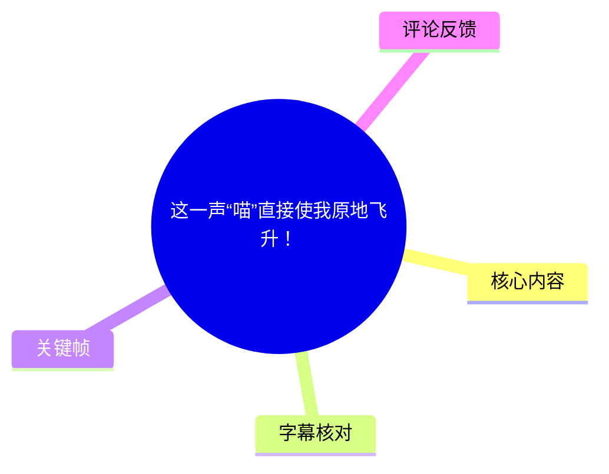
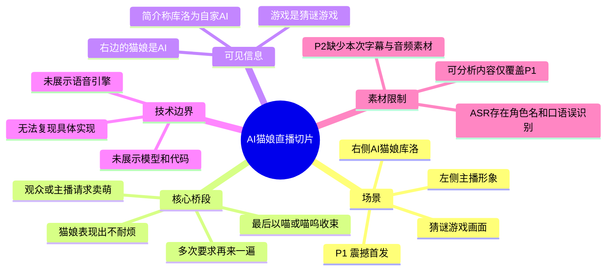
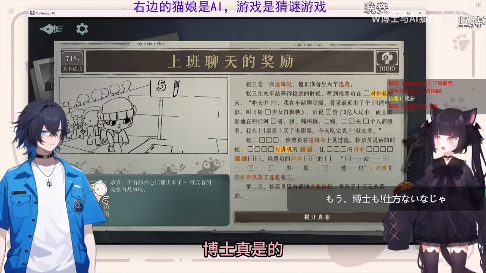

# 这一声“喵”直接使我原地飞升！

> 来源：[Bilibili 视频](https://www.bilibili.com/video/BV1Z1PezWEn3) 
> UP 主：W博士与AI猫娘｜发布时间：2026-03-04｜页面标注总时长：364 秒（含 2 个分 P） 
> 本次可用音频、ASR 与站内字幕均对应 P1《震撼首发！》，时长约 66 秒；P2《一步到胃（完整版）》（298 秒）未提供可分析字幕、音频或关键帧，本文不会臆测其内容。

## 小结

这是一段直播切片：画面中主播形象位于左侧，右侧为名为“库洛”的猫娘角色；屏幕顶端明确标示“右边的猫娘是AI，游戏是猜谜游戏”。视频的笑点和核心内容，是主播/观众不断提出“再来一遍”的要求，猫娘以带有不耐烦情绪的语气回应，最终出现标题所强调的“喵”声。

从创作者简介可确认，库洛被描述为“自家 AI”；简介还写有“开源版参考 Steam《猫娘计划》”。但这只是 UP 主对作品来源与参考方向的说明，视频素材**没有**展示模型名称、语音合成引擎、提示词、角色系统、代码、部署流程或开源仓库地址，因此不能据此推导其具体技术实现。

P1 的站内字幕在 00:36–00:43 与 00:57–01:00 直接记录了“最后再一遍喵呜”“最后再一遍喵”，与标题主题相符。相比之下，本次 ASR 在角色名、句子边界和部分口语上存在明显误识别；适合用来确认语音大致覆盖范围和“重复请求”的节奏，不适合单独作为逐字稿。

该视频适合关注 AI 猫娘、虚拟主播互动、角色化语音表达与直播切片运营方式的读者。可迁移的经验不是某项可复现的 AI 技术，而是：在短视频中以“反复加码的请求—角色的情绪化反馈—关键词收束”的节奏，突出一个具有记忆点的角色声音。

数据具有时效性：播放、点赞、收藏与评论为素材抓取时的页面快照；“库洛”的能力、项目状态和《猫娘计划》的相关信息都可能在视频发布后变化，需以创作者后续公开信息为准。

## 思维导图

## 目录

- [视频范围、背景与时效性](#视频范围背景与时效性)
- [P1：从“卖萌”请求到“喵”声收束](#p1从卖萌请求到喵声收束)
  - [画面设定：AI 猫娘与猜谜游戏](#画面设定ai-猫娘与猜谜游戏)
  - [重复请求与角色化回应](#重复请求与角色化回应)
  - [“最后再一遍”的两次落点](#最后再一遍的两次落点)
- [可提炼的内容表达经验与技术边界](#可提炼的内容表达经验与技术边界)
- [关键帧解读](#关键帧解读)
- [结论与限制](#结论与限制)
- [字幕比对](#字幕比对)
- [评论分析](#评论分析)
- [处理记录](#处理记录)

## 视频范围、背景与时效性 [00:00:00](https://www.bilibili.com/video/BV1Z1PezWEn3?t=0)

页面元数据将该投稿标为合集 `AIcode`，并拆分为两个分 P：

| 分 P | 标题 | 页面时长 | 本次素材覆盖情况 |
| --- | --- | ---: | --- |
| P1 | 震撼首发！ | 66 秒 | 有站内 SRT、音频 ASR、2 张关键帧 |
| P2 | 一步到胃（完整版） | 298 秒 | 未提供本次可用的字幕、音频 ASR 与关键帧 |

因此，下文所有带时间轴的事实都以 P1 的真实 SRT/ASR 时间为依据。链接中的 `t` 参数对应 P1 内的秒数；不得把 P1 的 66 秒素材延伸解释为总计 364 秒的完整内容。

视频简介的原文信息如下：

- “本视频为 up 主 B 站直播切片，库洛是自家 AI~”
- “开源版参考 Steam《猫娘计划》~”

这说明视频的呈现形式是直播片段，且创作者将右侧角色称作 AI；但“参考”并不等于证明二者使用同一代码、模型或功能。素材中未提供任何版本号、接口、硬件、模型参数、许可证或项目链接。

抓取时页面统计为：播放 80,663、点赞 6,826、收藏 2,737、投币 297、分享 296、评论 265、弹幕 118。这些数字仅反映抓取时状态，不能视为长期固定数据或作品质量的客观结论。

## P1：从“卖萌”请求到“喵”声收束

### 画面设定：AI 猫娘与猜谜游戏 [00:00:02](https://www.bilibili.com/video/BV1Z1PezWEn3?t=2)

ASR 的第一段覆盖 [00:00:02.520–00:00:23.340](https://www.bilibili.com/video/BV1Z1PezWEn3?t=2)，识别到“有观众说，临走之前能不能让……卖个萌”“那当然可以了”等内容。不过其中“骷髅”“骷顺”等词明显不稳定，结合视频简介中的角色名，只能将其谨慎标注为**疑似指向库洛的误识别**，不能将 ASR 原文当作角色名的可靠证据。

从关键帧可直接观察到：

- 左侧是蓝发男性虚拟形象；
- 右侧是黑发猫耳女性角色；
- 画面顶部有“右边的猫娘是AI，游戏是猜谜游戏”的说明文字；
- 中间是猜谜游戏界面，标题可见为“上班聊天的奖励”，左上角显示关卡进度约为 71%；
- 右侧角色下方叠加日文对白框，画面底部同时有中文大字“博士真是的”。

这组信息构成理解视频互动的必要背景：角色并非单独面对镜头讲话，而是叠加在主播与游戏画面的直播场景中；“卖萌/喵声”是该直播互动中的插入式角色表演。

> 图：该帧同时展示主播形象、右侧猫娘、猜谜游戏界面与“右边的猫娘是AI，游戏是猜谜游戏”说明文字。它是确认视频场景及“库洛为 AI 猫娘”呈现方式的最直接画面依据。

### 重复请求与角色化回应 [00:00:28](https://www.bilibili.com/video/BV1Z1PezWEn3?t=28)

站内字幕在 [00:00:32.030–00:00:36.490](https://www.bilibili.com/video/BV1Z1PezWEn3?t=32) 给出“博士别再烦了”。这句台词将角色反应明确设定为对连续要求的轻微抱怨，而非一次性、平静的指令执行。

与之相邻的 ASR 分段为：

- [00:00:28.620–00:00:31.620](https://www.bilibili.com/video/BV1Z1PezWEn3?t=28)：`我被击坠了再来一次再来一遍`
- [00:00:34.600–00:00:38.560](https://www.bilibili.com/video/BV1Z1PezWEn3?t=34)：`那最后再来一遍`

其中“再来一次/再来一遍”与站内字幕后续内容互相印证，能够可靠地说明视频采用了反复请求的节奏；但“我被击坠了”不见于站内字幕，且语义与上下文衔接较弱，应保留为 ASR 的低置信转写，不作为视频明确陈述。

从内容组织上看，反复提出同一要求的作用有两层：

1. **叙事上的递进**：第一次“最后一次”没有结束，后续又再次提出“再来一遍”，形成反差。
2. **角色上的拟人化**：猫娘不是只输出一个固定音效，而是先表达“别再烦了”，再执行要求；喜剧效果来自“嫌弃感”与“可爱声音”的并置。

这是一种内容表达观察，而不是对 AI 内部情绪、意图或自主性的技术判断。视频只能证明角色被呈现为有情绪化反馈，不能证明系统具有真实情绪体验。

### “最后再一遍”的两次落点 [00:00:36](https://www.bilibili.com/video/BV1Z1PezWEn3?t=36)

站内字幕在这一段提供了最清晰、最贴近标题的文字证据：

| 时间 | 站内字幕 | 内容作用 |
| --- | --- | --- |
| [00:00:36.490–00:00:42.700](https://www.bilibili.com/video/BV1Z1PezWEn3?t=36) | 最后再一遍喵呜 | 第一次以“喵呜”回应“最后一次”要求 |
| [00:00:43.680–00:00:44.880](https://www.bilibili.com/video/BV1Z1PezWEn3?t=43) | 再来一遍再来一遍 | “最后一次”后仍继续要求，形成升级 |
| [00:00:46.160–00:00:50.520](https://www.bilibili.com/video/BV1Z1PezWEn3?t=46) | 再来一次吧 | 再次提出请求 |
| [00:00:53.060–00:00:57.780](https://www.bilibili.com/video/BV1Z1PezWEn3?t=53) | 嗯再来一次真烦 | 角色以“真烦”维持不耐烦的人设反应 |
| [00:00:57.780–00:01:00.500](https://www.bilibili.com/video/BV1Z1PezWEn3?t=57) | 最后再一遍喵 | 第二次以更短的“喵”收束 |

标题“这一声‘喵’直接使我原地飞升！”显然围绕最后一项进行情绪化概括。这里的“飞升”是标题修辞，表达创作者/观众对可爱声音的强烈正面反应，不是事件事实。

ASR 在同一区域亦识别出“再来一次”“来一个”“再来”“那最终再来”等碎片，时间分别覆盖 [00:00:43.470–00:00:47.160](https://www.bilibili.com/video/BV1Z1PezWEn3?t=43)、[00:00:48.540–00:00:49.690](https://www.bilibili.com/video/BV1Z1PezWEn3?t=48)、[00:00:54.120–00:00:59.100](https://www.bilibili.com/video/BV1Z1PezWEn3?t=54)。它支持“连续请求再次发生”的结构判断，但未可靠转写出站内字幕中的“真烦”“喵”等关键字。

## 可提炼的内容表达经验与技术边界 [00:00:32](https://www.bilibili.com/video/BV1Z1PezWEn3?t=32)

### 可从视频观察到的表达步骤

若仅讨论这段切片的**叙事组织**，其顺序可整理为：

1. **预设直播场景**：通过同屏主播、AI 猫娘、猜谜游戏与顶部说明，让观众迅速识别角色关系。
2. **引入请求**：ASR 在 00:02.520 后疑似记录到观众希望角色“卖萌”的请求；因角色名转写不可靠，仅能确认这一意图而不能确认逐字内容。
3. **设置拟人化阻力**：在 00:32.030，站内字幕给出“博士别再烦了”，使回应带有角色态度。
4. **第一次兑现**：在 00:36.490，出现“最后再一遍喵呜”。
5. **故意打破“最后一次”**：在 00:43.680 后继续出现“再来一遍”“再来一次吧”。
6. **以更短的目标词结束**：在 00:57.780，由“最后再一遍喵”收束，便于剪辑标题直接提炼“喵”作为记忆点。

这套节奏适用于角色向短视频的剪辑，但成立条件是角色已具备稳定的人设表达、观众能够理解“反复要求”的上下文，并且短音频本身具有吸引力。它不是通用的技术配置流程。

### 视频没有公开的技术参数

下列信息在当前素材中均未出现，因而不能编造：

| 技术项 | 视频素材是否提供 | 可得结论 |
| --- | --- | --- |
| 大语言模型名称与版本 | 否 | 无法判断库洛基于何种模型 |
| 语音合成系统、声线来源 | 否 | 无法判断“喵”声由何种 TTS 或录音生成 |
| 语音识别、实时交互链路 | 否 | 无法判断直播中的响应是否实时 |
| 角色记忆、情绪模块、提示词 | 否 | 只能观察到角色化台词，不能推断实现机制 |
| 游戏与 AI 的控制关系 | 否 | 画面显示猜谜游戏，但未证明 AI 在操作游戏 |
| 开源地址、许可证、部署步骤 | 否 | “开源版参考 Steam《猫娘计划》”不足以替代项目文档 |
| 硬件、延迟、成本、并发 | 否 | 不具备性能评估条件 |

因此，想要复现类似效果时，不能把本视频当成教程或技术文档；更合理的做法是等待创作者公开项目说明，或另行查阅《猫娘计划》的官方页面、许可证与部署文档。

## 关键帧解读 [00:00:53](https://www.bilibili.com/video/BV1Z1PezWEn3?t=53)

> 图：该帧放大了主播形象的面部与背景中的黑白手绘游戏画面。它的价值在于强调该片段并非纯语音演示，而是从直播游戏情境中截取的反应式互动；不过画面本身未显示模型、代码或技术参数。

两张关键帧的使用依据如下：

- `frame-001.jpg` 信息密度更高，能直接确认“AI 猫娘 + 主播 + 猜谜游戏”的完整同屏结构，适合作为场景证据。
- `frame-002.jpg` 聚焦主播表情与游戏局部，适合辅助说明该视频依赖直播语境和角色反应，而非展示 AI 工程操作界面。
- 两张图均不能证明库洛的模型架构、实时性或“开源版”的具体实现；正文未将视觉风格推导为技术结论。

## 结论与限制 [00:00:57](https://www.bilibili.com/video/BV1Z1PezWEn3?t=57)

P1 的核心是一个高度聚焦的角色互动桥段：重复的“再来一遍”请求，配合猫娘“别再烦了/真烦”的拟人化抱怨，最终用“喵呜”与“喵”制造可爱反差。标题将最终“喵”声放大为情绪卖点，符合直播切片以单一高记忆点吸引点击的做法。

可以迁移的经验是内容层面的：让角色回应具有一致的人设，并通过重复、延迟满足和最终短促收束强化一个声音或台词标签。不能迁移为“照此即可制作 AI 猫娘”的技术方案，因为视频没有提供实现所必需的模型、语音、工作流、成本和代码信息。

还应注意以下限制：

1. **分 P 覆盖不完整**：总时长为 364 秒，但现有 ASR 仅 65.457 秒，站内字幕也只提供 P1；P2 内容无法分析。
2. **站内字幕本身不完整**：P1 站内 SRT 从 00:00:00.060 开始，但存在 00:05.970–00:15.090、00:27.790–00:32.030、00:44.880–00:46.160 等未覆盖区间。
3. **ASR 可读性有限**：角色名、口语音节及若干短句被错误切分或替换，不能承担逐字引文职责。
4. **角色真实性边界**：视频与简介将右侧角色呈现为 AI，但素材不足以验证其是否全程自动化、是否实时响应，或是否存在人工干预。
5. **页面数据有时效性**：互动数据与热评排序会持续变化；创作者项目的后续版本也可能改变。

## 字幕比对

本次 ASR 结果已实际检查。ASR 诊断显示：语言为中文（置信度约 0.9502）、模型为 `medium`、音频时长 65.457 秒、语音覆盖约 57.44%（37.6 秒）、首段语音约在 00:02.520、末段约在 00:59.100；诊断中**没有** `noAudioStream=true`，因此可确认源素材存在音轨，不能将任何字幕差异归因于“无音轨”。

| 字幕来源 | 完整性 | 专有名词 | 时间轴 | 主要问题 |
| --- | --- | --- | --- | --- |
| Bilibili 站内字幕 `p01-ai-zh.srt` | 覆盖 P1 的若干关键台词，共 10 段；未覆盖全部 66 秒 | 未出现“库洛”等角色名，无法直接核验 | 10 段时间精细，起止时间可直接用于时间轴链接 | 前段缺少 ASR 所识别的观众请求；存在数个空白区间 |
| 本次 ASR `medium` | 覆盖约 37.6 秒语音，6 个长分段 | “骷髅”“骷顺”等疑似将“库洛”误识别，不能采信 | 有时间戳，但分段较粗，首段长达约 20.82 秒 | 口语混淆明显，如“我被击坠了”“你咋把什么意思”；遗漏“喵”“真烦”等关键台词 |

### 最终字幕采用策略

正文采用“**站内字幕优先，ASR 辅助**”的合并策略：

- 涉及“博士别再烦了”“最后再一遍喵呜”“再来一遍”“嗯再来一次真烦”“最后再一遍喵”等核心台词，优先引用站内 SRT，因为其分段更细且语义连贯。
- 涉及视频开头存在“观众请求卖萌”这一情境时，仅以 ASR 的语义线索谨慎描述为“疑似有观众提出卖萌请求”，不把错误的“骷髅/骷顺”写成角色正式名称。
- “库洛”这一名称来自视频简介，而非 ASR；画面顶部的“右边的猫娘是AI，游戏是猜谜游戏”来自关键帧可见文字。
- 对站内字幕未覆盖、ASR 又无法可靠还原的台词，明确保留不确定性，不以常识补写。

## 评论分析

以下仅分析本次可获取的热评前三条。评论反映的是观众态度或提问，不构成对 AI 实现细节的验证。

1. **星空灰原（520 赞）**：  
   > “人类发明AI就应该是做这个的[傲娇]”  
   该评论以玩笑式赞美表达对 AI 猫娘可爱互动的认可，契合视频强调“喵”声带来的娱乐体验。它没有补充技术事实，也不涉及可验证的实现信息。

2. **只爱東條希（525 赞）**：  
   > “我一直很好奇，库洛是如何做到大佐级中文的？是因为语言引擎就是日语吗？[脱单doge]”  
   评论提出对库洛中文表达风格的疑问，并猜测可能与日语语言引擎有关。“大佐级中文”是网络化、夸张化的风格评价，不是语言质量测试；“语言引擎就是日语”只是评论者猜测。当前视频没有公开语言引擎或语音管线，无法证实或证伪。

3. **一只小汉斯猫（400 赞）**：  
   > “w博士是又开发了个ai给别人吗？[Neuro sama收藏集_双子盯]”  
   该评论推测 W 博士是否再次开发了一个 AI 角色。创作者简介仅明确“库洛是自家 AI”，没有说明是否为他人开发、是否为新项目、是否与其他 AI 角色共享技术，因此该评论不能视为事实补充。

## 处理记录

- **Worker ID**：`worker-mrj0wjed-b0c290ad`
- **模型**：`gpt-5.6-terra`
- **检查与使用的素材工具产物**：
  - 元数据：`info.json` / 页面元数据；
  - 音频：`audio/audio.wav`；
  - 本次 ASR：`asr/asr-result.json`、`asr/transcript.srt`、`asr/asr-transcript.txt`；
  - 站内字幕：`subtitles/p01-ai-zh.srt`；
  - 关键帧：`frames/frame-001.jpg`、`frames/frame-002.jpg`；
  - 热评：`comments/comments.json`（限制为前三条）。
- **字幕选择**：已检查站内字幕与本次 ASR。采用站内 `p01-ai-zh.srt` 作为关键台词和时间轴的首选来源；ASR 仅用于补充开头“卖萌请求”与重复请求的存在。ASR 未标记 `noAudioStream=true`，音轨正常存在。
- **关键帧选择依据**：`frame-001.jpg` 用于验证 AI 猫娘、主播、猜谜游戏和画面文字说明的同屏关系；`frame-002.jpg` 用于说明直播反应式剪辑的视觉语境。两帧均未被用于推断未展示的技术架构。
- **时间轴依据**：章节时间优先采用站内 SRT 的真实起止时间；ASR 独有的时间点采用其 SRT/JSON 的真实分段时间。未按文本顺序虚构时间。
- **缓存清理**：未提供可执行的缓存清理日志或结果；本文不宣称已删除工作区缓存。
- **未解决问题**：
  1. P2《一步到胃（完整版）》缺少本次可用的音频、字幕与关键帧，无法完成内容级整理；
  2. “库洛”的具体模型、语音系统、语言引擎、实时交互机制与开源地址未在素材中出现；
  3. ASR 对角色名及部分口语的误识别无法仅靠现有素材完全校正。
