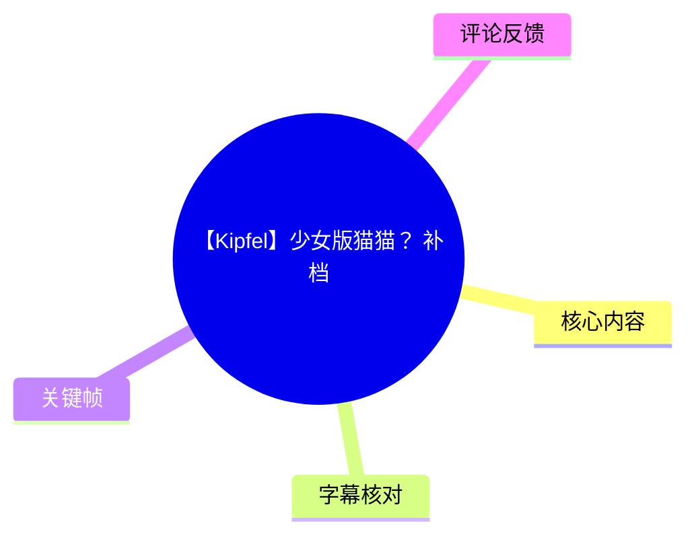
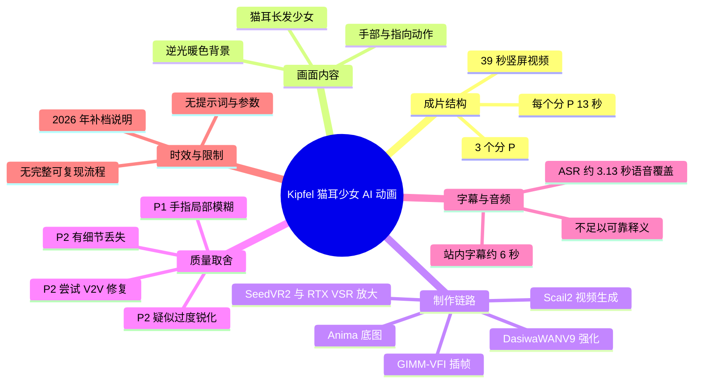
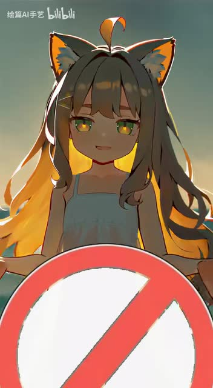
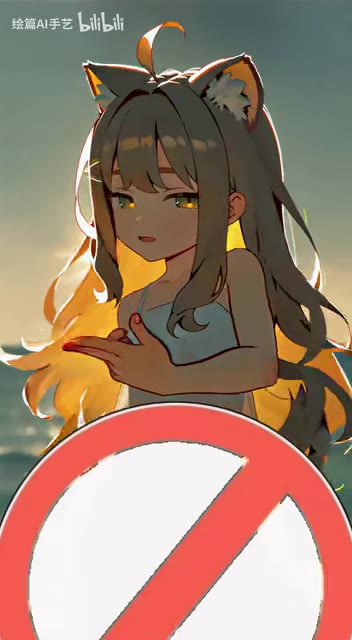
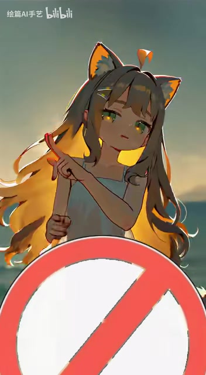
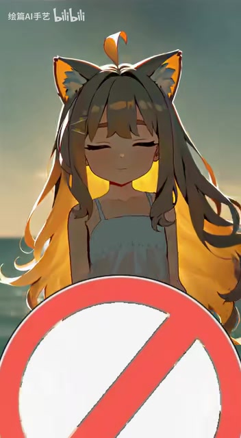

# 【Kipfel】少女版猫猫？(补档)

> 来源：[Bilibili 视频](https://www.bilibili.com/video/BV1KFjA6ZE3o)<br>
> UP 主：绘篇AI手艺｜视频总时长：39 秒｜画面规格：2112 × 3840 竖屏｜分为 3 个、各 13 秒的分 P

## 小结

这是一个以猫耳少女形象为主体的 AI 动画补档作品，而非讲解型教程。视频由 3 个各 13 秒的分 P 组成，素材信息显示分 P 名称分别为 `Kipfel_O_C02`、`Kipfel_E_C02`、`Kipfel_A`；关键帧展示了同一位长发猫耳少女在逆光环境中做手部、指向与闭眼等动作。

UP 主在简介中披露了制作链路：以 **Anima** 制作底图，使用 **Scail2** 生成视频，以 **DasiwaWANV9** 进行视频强化，并采用 **GIMM-VFI + SeedVR2 + RTX Video Super Resolution** 完成“插针放大”。这些是作者对所用工具的说明，并未提供提示词、采样参数、模型版本、插帧倍率或超分配置，因此不能据此复刻相同结果。

作品的制作重点和问题也较明确：P1 是 Scail2 初版视频加插针放大，局部存在手指模糊；P2 尝试使用 V2V 强化来修复手指，但作者认为结果更接近整体锐化，且丢失了一部分细节；简介另称 P3 完整版使用了此前生成的另一份素材。由此可见，作者正在比较“局部手部修复”和“整体细节保留”之间的取舍。

本次可用的站内字幕仅覆盖一个约 6 秒的英文歌词片段，ASR 则只在约 0.56—3.69 秒识别出一条葡萄牙语样式文本；两者均无法形成可靠的完整语义转写。视频可被确认含有音轨：ASR 诊断没有 `noAudioStream=true` 标记，且成功处理到 12.693 秒音频；但该音频处理时长与全片 39 秒不一致，应避免把 ASR 文本扩展为整支视频的歌词或对白。

适合将本文作为 AI 短动画的制作信息索引、画面问题记录及字幕可靠性核查，而不应视为完整的操作教程。工具与模型名称均来自视频简介，且内容涉及 2026 年的补档说明，后续模型能力、可用性与命名均可能变化。

## 思维导图





## 目录

- [视频定位、结构与时效性](#视频定位结构与时效性-0000)
- [画面内容与关键帧](#画面内容与关键帧-0000)
- [作者披露的制作链路](#作者披露的制作链路-0000)
- [版本差异与质量取舍](#版本差异与质量取舍-0000)
- [可整理出的实践流程与缺失参数](#可整理出的实践流程与缺失参数-0000)
- [字幕比对与音频覆盖核查](#字幕比对与音频覆盖核查-0000)
- [评论分析](#评论分析-0000)
- [结论与限制](#结论与限制-0000)
- [处理记录](#处理记录-0000)

## [视频定位、结构与时效性](https://www.bilibili.com/video/BV1KFjA6ZE3o?t=0)

- **标题与定位**：视频标题为“【Kipfel】少女版猫猫？(补档)”，标签包含“可爱、舞蹈、猫猫、AI动画、AICG、kipfel、Scail2、竖屏、vrchat”。其中“舞蹈”“vrchat”是站点标签，素材中没有可供逐帧验证的完整舞蹈编排或 VRChat 工程信息，不能进一步推导。
- **时长与分段**：视频总长 39 秒，页面数据列出 3 个分 P，每段均为 13 秒：
  1. P1：`Kipfel_O_C02`
  2. P2：`Kipfel_E_C02`
  3. P3：`Kipfel_A`
- **画面规格**：2112 × 3840 像素、竖屏。此类高纵横比构图将人物置于画面中央，并为前景遮挡物和背光发丝保留了较强的纵向延展空间。
- **补档信息**：简介中明确写有“**2026.06.20** 补档了，P3完整版用了之前生成的另一份素材”。但页面元数据的发布时间为 2026-06-18，与简介日期存在前后矛盾。本文保留两项原始信息，不擅自判定哪一项准确。
- **内容性质**：视频没有可用的口述教程，核心知识主要来自 UP 主简介、分 P 元数据、字幕/ASR 结果与关键帧画面。

## [画面内容与关键帧](https://www.bilibili.com/video/BV1KFjA6ZE3o?t=0)

关键帧均呈现同一视觉主体：一名深色长发、猫耳、金色眼睛的少女。背景为暖色逆光，头发边缘有明显的光照轮廓；画面下方有大面积红白圆形斜杠图案前景。该图案的具体含义无法仅凭提供帧图确认，因此以下仅描述其构图作用。



> 图：人物正面位于画面中轴，猫耳、眼睛和发丝轮廓清晰，下部红白圆形前景遮挡了身体区域。这一帧有助于识别视频的主体设计、竖屏中心构图及“前景遮挡 + 逆光人物”的视觉层次。



> 图：人物侧转并在胸前做手部动作。由于作者特别提及手指存在模糊问题，这一类包含手势的画面是评估生成视频局部稳定性的重要观察点；但单张关键帧不能证明问题出现于哪个分 P，也不能替代逐帧检查。



> 图：人物做抬手指向动作，手指、手腕和头部倾斜同时出现。它展示了 AI 人物动画中较容易暴露生成瑕疵的区域：指节结构、肢体连接和动作连续性。



> 图：人物闭眼，长发在背光下形成金色轮廓，前景遮挡物仍占据下半画面。此帧有助于观察角色表情、发丝边缘与整体光影风格的一致性，而非用于判断精确时间点。

### 可确认的视觉特征

1. **角色设定**：猫耳、长发、少女形象和金色眼睛构成主要识别元素，呼应标题中的“少女版猫猫”。
2. **光影风格**：人物背后有暖黄色轮廓光，发丝边缘被明显提亮；这使发丝形状与角色剪影在竖屏小尺寸观看中仍较容易辨识。
3. **动作类型**：提供的帧图至少可确认包含正面停留、双手动作、手指指向和闭眼表情。由于没有关键帧对应的原始时间戳，不能将这些动作精确映射到 39 秒内的具体秒数。
4. **画面水印**：帧图左上可见“绘篇AI手艺”与 bilibili 标识，说明提供帧为带平台画面元素的成片截图。

## [作者披露的制作链路](https://www.bilibili.com/video/BV1KFjA6ZE3o?t=0)

简介明确列出的工具链如下。工具职责按作者原文表述整理；对于名称无法由素材进一步验证的具体版本、算法或云端实现，不作额外推测。

| 制作环节 | 作者列出的工具 | 可确认用途 | 素材未提供的信息 |
| --- | --- | --- | --- |
| 底图制作 | Anima | 生成初始底图 | 提示词、参考图、尺寸、种子、重绘范围 |
| 视频生成 | Scail2 | 基于底图生成视频 | 动作提示词、时长设置、帧率、相机控制、生成批次 |
| 视频强化 | DasiwaWANV9 | 对视频进行强化尝试 | 强化模型参数、输入输出分辨率、去噪与锐化设置 |
| 插帧与放大 | GIMM-VFI + SeedVR2 + RTX Video Super Resolution | “插针放大”流程 | 插帧倍率、帧率变化、超分倍率、处理顺序、显卡及驱动配置 |

### 工具关系

作者的描述可整理为以下内容链路：

```text
Anima 底图
  ↓
Scail2 视频生成
  ↓
（按版本选择）DasiwaWANV9 视频强化
  ↓
GIMM-VFI 插帧 + SeedVR2 / RTX Video Super Resolution 放大
  ↓
竖屏成片
```

这里的“插针放大”是作者对组合流程的称呼。素材只确认其同时提到插帧与放大工具，**没有提供“插针”的明确定义、处理先后顺序和参数设置**。因此，该流程图只能作为制作环节的归纳，不能直接作为可复现的操作配方。

## [版本差异与质量取舍](https://www.bilibili.com/video/BV1KFjA6ZE3o?t=0)

作者在简介中对不同版本给出了较具体的自评，重点集中在手指质量与整体细节。

| 版本 | 作者说明 | 目标或结果 | 已知问题 |
| --- | --- | --- | --- |
| P1 | Scail2 生成的初版视频 + 插针放大 | 作为初版成片 | 部分片段手指有模糊问题 |
| P2 | 尝试用 V2V 强化的视频 + 插针放大 | 尝试修复手指问题 | 作者认为“不太行”，看起来像整体锐化，并丢失一些细节 |
| P3 | 使用此前生成的另一份素材的完整版 | 作为补档时说明的完整版素材 | 未提供与 P1/P2 的逐项技术对比或质量评价 |

### 可迁移的制作经验

- **不要只以“手指更清楚”判断修复成功**：作者的 P2 尝试说明，V2V 强化可能改善局部视觉印象，却以整体过锐、细节丢失为代价。
- **应分别检查局部与整体**：手指、手腕、头发边缘、服装纹理和背景过渡应同时观察。只放大局部可能忽略强化模型对画面其他区域的破坏。
- **保留不同生成批次**：P3 使用“之前生成的另一份素材”，反映出在 AI 视频制作中，保留可选素材批次有助于在后期发现质量问题时回退或替换，而非只依赖一次强化修复。
- **压缩是最终呈现链路的一部分**：UP 主在热评中提到“视频压缩的有点狠”。即使原始处理结果细节较好，平台转码或上传压缩仍可能使发丝、手指和低对比纹理变差。

## [可整理出的实践流程与缺失参数](https://www.bilibili.com/video/BV1KFjA6ZE3o?t=0)

这不是视频中演示的逐步教程。以下仅将作者已披露的环节按合理的制作任务归类，并明确标出不可从素材补齐的关键参数。

### 已披露的流程

1. **制作底图**
   - 使用 Anima 制作角色底图。
   - 成片角色的猫耳、深色长发、暖色逆光与竖屏构图可作为底图风格延续的视觉结果观察，但不能反推出具体提示词。

2. **生成初版视频**
   - 使用 Scail2 从底图生成视频。
   - P1 被作者定义为“Scail2生成的初版视频 + 插针放大”。

3. **检查高风险区域**
   - 作者指出 P1 的问题位于“部分片段手指有模糊”。
   - 对此类人物动作视频，应优先检查手指数量与连接、手掌轮廓、手腕过渡、发丝边缘，以及表情在相邻帧间是否稳定。

4. **尝试 V2V 强化**
   - 作者将 DasiwaWANV9 列为“视频强化”模型，并说明 P2 使用了 V2V 强化尝试修复手指。
   - 结果未获作者认可：强化倾向于整体锐化，同时丢失细节。

5. **插帧与放大**
   - 作者列出 GIMM-VFI、SeedVR2 和 RTX Video Super Resolution。
   - 这一步被概括为“插针放大”，但无法确认是先插帧再超分、先超分再插帧，还是各工具并行用于不同版本。

6. **比较并选取素材**
   - P3 使用此前生成的另一份素材作为完整版。
   - 素材没有记录最终选片标准、各版本输出文件参数或压缩前后的质量对比。

### 无法复现的关键缺口

以下参数没有出现在简介、字幕、ASR、关键帧或元数据中：

- Anima、Scail2、DasiwaWANV9 的具体版本与访问方式；
- 提示词、负面提示词、角色参考图与版权/授权状态；
- 生成帧率、原始时长、随机种子、采样步数、去噪强度；
- V2V 的输入分辨率、输出分辨率、重绘力度与运动控制设置；
- GIMM-VFI 的插帧倍数及其产生的目标帧率；
- SeedVR2 与 RTX Video Super Resolution 的倍率、锐化/降噪参数；
- 成片编码格式、码率、上传前文件体积，以及平台压缩前后的对比样本。

因此，若要实践这一思路，最稳妥的结论是：**先保存 Scail2 初版，再对“局部修复版”和“整体强化版”分别导出对照，最后在平台实际转码后的画面中判断是否保留细节。** 这是一项由作者版本对比引出的工作流建议，而不是原视频明示的具体操作规范。

## [字幕比对与音频覆盖核查](https://www.bilibili.com/video/BV1KFjA6ZE3o?t=0)

### 站内字幕与本次 ASR 的对照

| 字幕来源 | 完整性 | 专有名词/歌词可靠性 | 时间轴 | 主要问题 |
| --- | --- | --- | --- | --- |
| Bilibili 站内字幕 `p02-ai-zh.srt` | 仅提供 00:00:00.080—00:00:06.060 的 5 条歌词片段，未覆盖全片 39 秒 | 文本为英文样式歌词，如 “A little bit coal for you”“Jdball”，无从据此可靠还原歌名或歌词 | 有精确 SRT 起止时间，可作为该片段的时间依据 | 文件名含 `zh`，但实际字幕为英文样式；多处文本语义不通 |
| 本次 ASR 字幕 | 仅识别 1 段，00:00:00.560—00:00:03.690，语音覆盖 3.13 秒 | ASR 自动识别语言为葡萄牙语（置信度 0.9814），输出为“Pico do fússil, toma só o radiodão”，与站内字幕不一致 | 有精确 SRT 起止时间 | ASR 处理音频时长为 12.693 秒，低于视频总长；仅一段结果，且更像音乐/演唱误识别，不宜作为可信语义文本 |

### 可直接使用的时间轴片段

站内字幕提供的真实分段时间如下，保留原始文本，不对含义作强行翻译：

- [00:00:00.080—00:00:01.980](https://www.bilibili.com/video/BV1KFjA6ZE3o?t=0)：`♪ A little bit coal for you ♪`
- [00:00:01.980—00:00:03.160](https://www.bilibili.com/video/BV1KFjA6ZE3o?t=1)：`♪ I thought master hard ♪`
- [00:00:03.160—00:00:04.600](https://www.bilibili.com/video/BV1KFjA6ZE3o?t=3)：`♪ Jdball ♪`
- [00:00:04.600—00:00:05.080](https://www.bilibili.com/video/BV1KFjA6ZE3o?t=4)：`♪ My all ♪`
- [00:00:05.080—00:00:06.060](https://www.bilibili.com/video/BV1KFjA6ZE3o?t=5)：`♪ My all my e ♪`

本次 ASR 的真实分段时间：

- [00:00:00.560—00:00:03.690](https://www.bilibili.com/video/BV1KFjA6ZE3o?t=0)：`Pico do fússil, toma só o radiodão`

### 结论：字幕采用策略

- **未发现 `noAudioStream=true`**：本次 ASR 结果并未标记源视频无音轨，因此不能把字幕异常归因于“没有音频”。
- **不采用任一字幕作为完整语义转写**：站内字幕和 ASR 在相同开头时段内容不一致，且均呈现歌词识别不稳定的特征。
- **时间轴优先采用站内 SRT**：其覆盖范围较 ASR 更长，且分段更细；但仅用于定位开头音乐片段，不用于翻译或确认歌词。
- **画面理解以关键帧为主**：角色形象、手势、前景遮挡与逆光风格均由帧图直接支持；工具链、版本差异则以 UP 主简介为准。

## [评论分析](https://www.bilibili.com/video/BV1KFjA6ZE3o?t=0)

以下仅处理可获取的热评前三条，按评论内容分析，不将评论自动视为已验证事实。

1. **绘篇AI手艺（152 赞）**  
   评论：“这张是Anima生成的底图，感觉视频压缩的有点狠[大哭][大哭][大哭]”  
   - **补充信息**：作者确认底图由 Anima 生成，与简介中的“底图制作：Anima”一致。
   - **价值**：补足了成片质量判断中的交付环节——平台或上传链路压缩可能影响最终观感。
   - **可信度与边界**：评论来自 UP 主，对其自身制作流程具有较高的一手信息价值；但未提供压缩前原文件、码率或对比图，无法量化压缩损失。

2. **HCen_（70 赞）**  
   评论：“👍”  
   - **观点**：表达正向认可。
   - **补充信息**：没有提供制作、画面质量、音乐或模型使用方面的实质信息。
   - **分析边界**：可反映互动层面的正反馈，但不能据此推导作品的技术质量或工具性能。

3. **千叶樱火（49 赞）**  
   评论：“做偏”  
   - **观点**：对成片风格或目标还原度持负面评价。
   - **可能指向**：结合简介中“还是天凉多喝防冻液大佬的画风，但是不知道为什么看起来不像”，该评论可能是在表达作品与预期画风/参考方向存在偏差。
   - **可信度与边界**：评论过于简短，未说明“偏”的对象是角色体型、画风、动作还是参考视频，不能将其转化为具体技术问题结论。

## [结论与限制](https://www.bilibili.com/video/BV1KFjA6ZE3o?t=0)

这支作品呈现的是一条以 AI 生成猫耳少女为主体的竖屏短动画，其可确认的制作框架为“底图生成 → 视频生成 → 可选视频强化 → 插帧/超分 → 成片”。作者最有价值的经验不是某个固定参数，而是对版本质量的实际判断：面向手指等高风险细节做 V2V 强化，未必比保留原始生成细节更好；整体锐化可能掩盖或造成纹理损失。

对于希望参考该作品的人，最可迁移的做法是保留多个生成版本，并在最终上传压缩后的环境中比较局部手部、发丝边缘和整体细节，而非单靠单一增强流程判断好坏。

同时应注意以下限制：

- 视频未提供提示词、种子、模型版本、参数、工作流文件与编码信息，无法严格复现。
- 关键帧没有附带逐帧时间戳，不能据画面排列推断精确动作发生秒数。
- 站内字幕和 ASR 都不足以可靠还原音乐歌词；本片没有可用的完整对白文本。
- 简介中的“2026.06.20 补档”与页面发布元数据“2026-06-18”存在日期冲突。
- AI 模型、增强工具与平台压缩策略均有时效性；本文记录的是抓取素材中披露的信息，不代表相关工具在后续仍以相同能力、名称或可用状态存在。

## [处理记录](https://www.bilibili.com/video/BV1KFjA6ZE3o?t=0)

- **Worker ID**：`worker-mrj0wbly-5dc4e50c`
- **整理模型**：`gpt-5.6-terra`
- **ASR 模型与运行信息**：`medium`；自动语言识别为葡萄牙语（`pt`），语言置信度 `0.9814453125`；CUDA、`float16`；处理音频时长 `12.6933125` 秒。
- **可用素材与工具产物**：`merged.mp4`、`audio/audio.wav`、`asr/transcript.srt`、`asr/asr-result.json`、站内字幕 `p02-ai-zh.srt`、热评 JSON，以及 4 张关键帧。
- **字幕选择**：已检查站内字幕与本次 ASR。站内 SRT 的时间分段用于开头音乐片段定位；因其文本与 ASR 结果冲突且均不具备可靠语义，不采用任何一方作为完整歌词/对白转写。
- **音轨判断**：ASR 结果未标记 `noAudioStream=true`，并产出一条带时间戳的识别片段；因此按“视频存在可处理音轨但识别覆盖不足”记录，而非工具失败或无音轨。
- **关键帧选择依据**：选用 4 张帧图分别展示人物正面构图、胸前手部动作、指向手势和闭眼表情，以覆盖角色设计、光影风格及作者特别提及的手指质量观察区域。素材未提供这些帧的精确时间戳，未为其编造时间位置。
- **缓存清理**：提供的素材清单未包含缓存清理日志，无法确认是否执行清理；本文不虚构清理结果。
- **未解决问题**：无法确认各关键帧所属分 P 与精确秒数；无法确认歌曲歌词、模型版本和参数；无法量化作者所述的平台压缩损失。

## 评论分析

- 热评 1：这张是Anima生成的底图，感觉视频压缩的有点狠[大哭][大哭][大哭]
- 热评 2：👍
- 热评 3：做偏

以上内容是观众反馈摘录，只用于补充理解视频反响，不作为正文事实依据。
