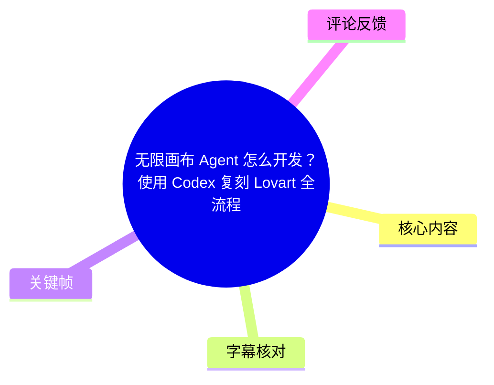
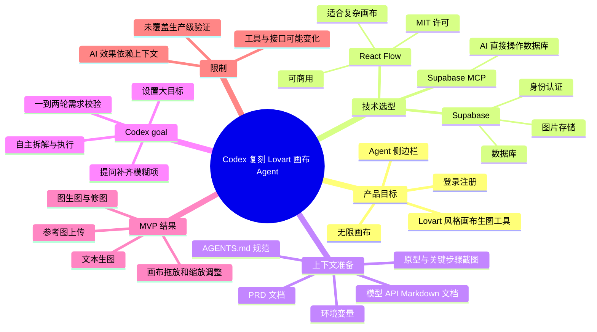
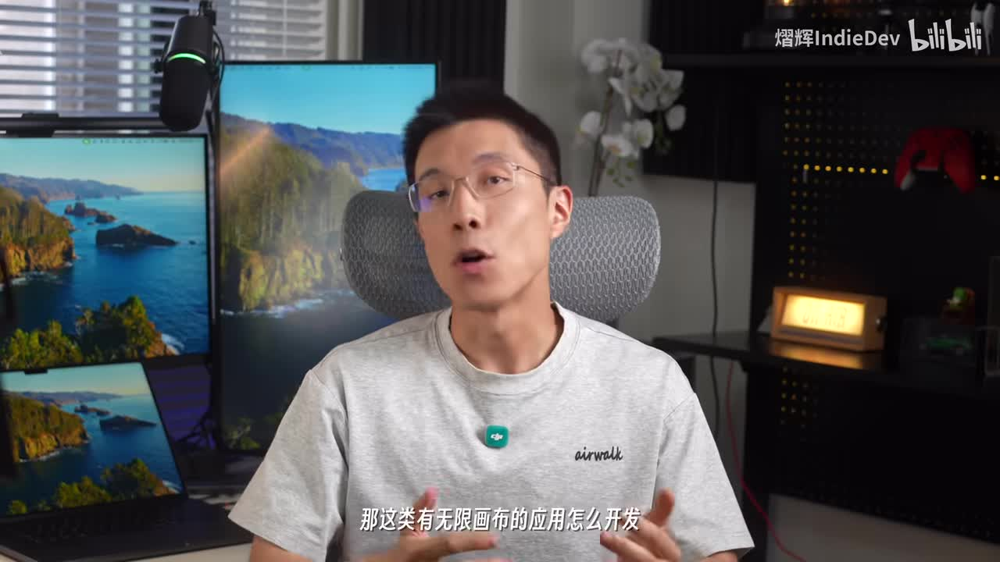
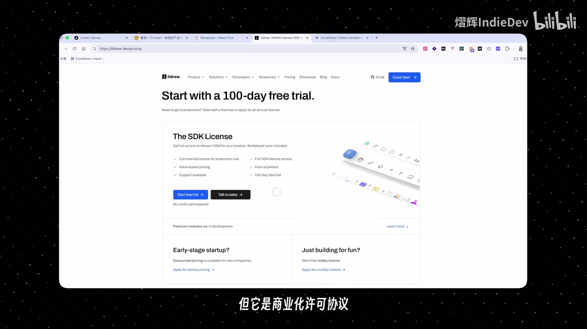
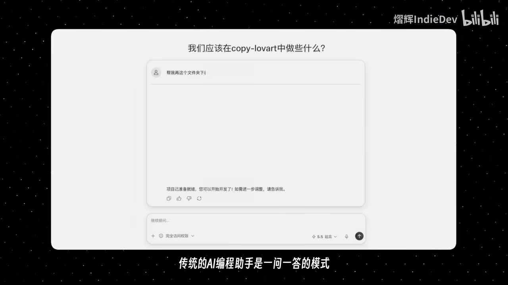

# 无限画布 Agent 怎么开发？使用 Codex 复刻 Lovart 全流程

> 来源：[Bilibili 视频](https://www.bilibili.com/video/BV1UnV96vEAo)<br>
> UP 主：熠辉IndieDev｜视频时长：04:53｜合集：AIcode  
> 视频简介明确的技术组合：**React Flow + Supabase**；目标是以 Codex 的 `/goal`（ASR 识别为 “Go”）长任务能力，复刻 Lovart 风格的画布生图工具。

## 小结

这是一份从产品拆解、工程准备到交由 Codex 长任务开发的实操流程。视频要解决的问题不是“如何手写一个无限画布”，而是：如何通过高质量项目上下文，让 Codex 一次性承担 Lovart 风格画布 Agent 的 MVP 开发工作。

画布层的核心选型是 **React Flow**。作者将其与 tldraw、Excalidraw 对比：tldraw 功能强且支持文档编辑，但视频称其商业化使用涉及付费许可；Excalidraw 免费开源、适合白板/原型表达，但作者认为其不适合本案例所需的复杂画布应用；React Flow 则因 MIT 许可、可商用及文档相对完善而被选中。该判断是作者面向“画布生图”场景的工程取舍，而非对三者能力边界的完整评测。

后端采用 **Supabase**，用于数据库、登录注册和图片存储；并配置 Supabase MCP，让 AI 能直接参与数据库操作。工程中最关键的并非只创建项目，而是建立 `Docs` 目录、补齐 PRD、参考截图、模型 API 文档，并通过 `AGENTS.md` 固化技术栈、目录结构与开发规范。

Codex `/goal` 的工作方式是：给定明确的大目标后，由 AI 自主拆解、规划并连续执行开发。作者强调这不是“魔法”：结果高度取决于上下文是否完整、需求是否清楚，以及是否提前提供原型和接口文档。启动前还应让 AI 主动审查缺失的环境变量、模糊需求和未明确的工程细节，并根据其问题补充一到两轮。

视频展示的最终 MVP 包含：登录注册、项目页、带 Agent 对话面板的核心 Canvas 页、文本生图、参考图上传、图生图/修图，以及在无限画布上拖放和调整图片。作者称约一小时左右可完成一个完整的画布生图应用；这是视频中的经验性估计，实际时间会受模型、需求规模、API 可用性、代码问题和人工反馈影响。

时效性上，视频涉及 Codex 的 `/goal`、Supabase MCP、NanoBanana、GPT Image 2 等持续迭代的服务或模型，具体入口、权限、定价、模型名称和 API 格式均可能已变化。视频未展示完整源码、实际提示词全文、部署过程、成本账单或正式生产环境压测，因此其结论应视为 **MVP 开发流程参考**，不能直接等同于生产级架构方案。

## 思维导图





## 目录

- [背景：无限画布与产品目标](#背景无限画布与产品目标)
- [画布技术选型：React Flow、tldraw 与 Excalidraw](#画布技术选型react-flowtldraw-与-excalidraw)
- [Codex `/goal`：从问答助手到长任务执行](#codex-goal从问答助手到长任务执行)
- [工程准备：初始化、Supabase 与 MCP](#工程准备初始化supabase-与-mcp)
- [文档驱动：PRD、截图、API 与 AGENTS.md](#文档驱动prd截图api-与-agentsmd)
- [需求校验与启动目标任务](#需求校验与启动目标任务)
- [MVP 成果、修正与边界](#mvp-成果修正与边界)
- [可复用实施清单](#可复用实施清单)
- [结论与限制](#结论与限制)
- [字幕比对](#字幕比对)
- [评论分析](#评论分析)
- [处理记录](#处理记录)

## 背景：无限画布与产品目标 [00:00:28](https://www.bilibili.com/video/BV1UnV96vEAo?t=28)

视频开场将“画布模式”定位为 AI 生图、生视频产品中的常见交互形态。其基本特征是一个可无限延展的二维空间：用户可以自由创建、摆放和编排内容，尤其适合需要可视化组织创作资产的场景。

本期的具体目标是复刻 Lovart 风格的画布能力，而非只实现一个静态白板。作者列出的目标功能包括：

1. **登录与注册**；
2. **Agent 侧边栏/对话入口**；
3. **无限画布模式**；
4. 通过画布承载生图、参考图和图片编辑等创作操作。



> 图：画面以讲解者出镜和字幕提出核心问题。它明确本视频的范围是“无限画布应用开发”，而不是泛泛介绍 AI 绘图工具。

作者还表示会使用 Codex 的 `/goal` 长任务能力，以一段完整提示词让 AI 持续完成项目开发。视频末尾提及文档和提示词可在评论区相关内容中获取，但素材未提供具体链接、提示词全文或文件内容。

## 画布技术选型：React Flow、tldraw 与 Excalidraw [00:00:29](https://www.bilibili.com/video/BV1UnV96vEAo?t=29)

作者从开源画布方案中提到 React Flow、tldraw 与 Excalidraw，并按本项目“画布生图”需求做了选择。

| 方案 | 视频中的描述 | 作者的结论 |
| --- | --- | --- |
| tldraw | 功能强大，支持写作/编辑；视频称商业化许可需要付费 | 不作为本项目的优先方案 |
| Excalidraw | 免费开源，偏手绘风格；更适合演示和原型 | 作者认为不太适合复杂画布应用 |
| React Flow | MIT 协议、可商用、文档完善 | 推荐用于本次画布生图场景 |

视频最终选择 **React Flow**。需注意，ASR 将名称误识别为“Rectflow”，但视频元数据简介明确写为 “React Flow + Supabase”，因此本文据此校正为 React Flow。



> 图：画面展示 tldraw 的定价/许可页面，并配有“但是商业化许可协议”的字幕，是作者进行许可维度取舍的直接画面依据。该画面只支持“作者关注商业许可”这一点，不足以替代对实时许可证条款的独立核验。

选型经验可以归纳为：先定义产品动作（节点式内容编排、图片资产拖放、画布编辑），再评估许可、扩展性、交互模型和工程成熟度。视频没有展示 React Flow 的具体代码、节点 schema、状态管理或性能优化配置，因此不能据此推导其完整实现细节。

## Codex `/goal`：从问答助手到长任务执行 [00:01:18](https://www.bilibili.com/video/BV1UnV96vEAo?t=78)

作者将传统 AI 编程助手描述为“一问一答”：每次处理一个相对局部的任务；而 Codex `/goal`（ASR 中持续识别作 “Go”）则允许开发者给出一个大目标，再由 AI 自主进行：

- 任务拆解；
- 开发步骤规划；
- 持续执行；
- 直至完成目标或需要人工补充信息。



> 图：画面中出现“我们应该在 copy-lovart 中做些什么？”以及“传统的 AI 编程助手是一问一答的模式”，直观说明作者要从碎片化指令转向目标驱动开发。

作者明确提出一个关键限制：**`/goal` 并不自动解决需求不清的问题。** AI 的表现取决于输入上下文的质量和明确程度。视频建议提前准备：

- 完整的需求文档；
- UI/交互相关文档；
- API 文档；
- 原型图和页面截图等视觉参考。

这里的核心方法论是“用文档约束生成”，而不是把一句“帮我仿一个 Lovart”当作充分规格。AI 能执行任务，但无法可靠地补全未定义的产品决策、密钥、权限模型和视觉细节。

## 工程准备：初始化、Supabase 与 MCP [00:01:42](https://www.bilibili.com/video/BV1UnV96vEAo?t=102)

作者按以下顺序准备工程环境。

### 1. 初始化项目

视频称先使用一个模板快速初始化项目，并把模板链接交给 Codex，由 AI 完成安装。ASR 将该模板名称识别为“NectarJS”，但该专有名词没有得到视频元数据或关键帧的交叉确认，本文不将其作为可靠技术结论。

可确认的操作原则是：**先给 Codex 一个可运行的基础工程和模板来源，而不是从空目录直接要求完整产品。**

### 2. 创建 Supabase 项目

作者使用 Supabase 提供后端基础能力，视频明确列出：

- 数据库；
- 登录注册；
- 图片存储。

创建完成后，复制环境变量并填写到项目的 `.env` 文件中，再运行项目进行验证。验证重点是注册、登录等基础链路是否正常。

> 视频未给出环境变量键名、数据库表结构、存储桶策略、认证回调地址或部署平台配置。因此这些均需按当前 Supabase 文档和实际项目安全要求自行配置，尤其不要将服务端密钥暴露到前端环境变量中。

### 3. 安装 Supabase MCP

作者强调 Supabase MCP “很关键”，其用途是让 AI 能够直接操作数据库，减少开发者手动执行数据库相关操作的负担。

这一能力的实际风险也值得明确：让 AI 直连数据库前，必须控制 MCP 的权限范围、环境隔离和凭据管理。视频没有展示权限配置、生产库保护或迁移回滚策略；在生产项目中，应避免让自动化 Agent 无限制接触生产数据。

## 文档驱动：PRD、截图、API 与 AGENTS.md [00:02:30](https://www.bilibili.com/video/BV1UnV96vEAo?t=150)

工程基础就绪后，作者在项目根目录创建 `Docs` 文件夹，用它集中放置 AI 执行任务时需要读取的项目上下文。视频提到的结构如下：

```text
项目根目录/
├─ Docs/
│  ├─ prd.md
│  ├─ images/
│  └─ api/
└─ AGENTS.md
```

各部分用途为：

| 文件/目录 | 视频说明 | 在 AI 协作中的作用 |
| --- | --- | --- |
| `Docs/prd.md` | 需求文档 | 描述功能、页面、交互与验收要求 |
| `Docs/images/` | 参考图与页面截图 | 给 AI 提供视觉目标和页面对应关系 |
| `Docs/api/` | API 文档 | 为模型调用、参数和接口接入提供依据 |
| `AGENTS.md` | 技术栈、目录结构、开发规范 | 约束 AI 的实现方式和项目规则 |

### 页面拆解

作者将待复刻产品拆为三个页面：

1. **首页**：上方为输入/对话框，下方为项目卡片；
2. **项目列表页**：展示所有项目；
3. **核心 Canvas 页**：无限画布与 Agent 创作页面。

对于每个页面，建议截取页面及关键操作步骤的截图，存入 `Docs/images/`，并在提示词中明确每张图对应的页面或流程。这样可避免 AI 只能根据自然语言猜测布局和交互。

### API 文档输入

作者从第三方 API 服务商网站复制两个生图模型的文档，保存为 Markdown 文件放进 `Docs/api/`：

- NanoBanana；
- GPT Image 2。

ASR 分别误识别为 “NanoBanana” 与 “GBT Image2”；前者在素材中无法进一步验证正式拼写，后者根据常见命名及视频语义校正为 **GPT Image 2**，但具体模型是否仍以该名称提供、其 API 路径和参数为何，均应以调用服务商的实时文档为准。

这一环节的价值在于：让 AI 不仅知道“需要接生图模型”，还拥有可引用的接口格式、参数说明和调用约束，降低凭空编造接口的概率。

## 需求校验与启动目标任务 [00:03:18](https://www.bilibili.com/video/BV1UnV96vEAo?t=198)

在真正启动长任务前，作者安排 AI 对需求与工程准备进行一次反向审查。应询问 AI：

- 需求文档是否完备；
- 哪些环境变量缺失；
- 哪些需求描述不明确；
- 哪些技术/工程条件尚未准备；
- 是否存在需确认的交互、数据或接口细节。

随后根据 AI 的问题逐项补充。作者建议将“AI 提问—人工补充”重复 **1 到 2 次**，以确保 AI 充分理解需求并且工程条件齐备。

启动方式是：在 Codex 中点击加号，打开 `/goal` 功能，输入提示词，要求其**基于需求文档完成项目的完整开发**。视频的逻辑顺序很明确：

```text
可运行工程
→ 后端与认证可用
→ MCP 接入
→ 文档、图片、API 文档齐备
→ AGENTS.md 规定工程规范
→ AI 主动发现缺口
→ 人工补充 1~2 轮
→ 启动 /goal 长任务
```

此流程中最可迁移的经验是：把人工时间放在**定义问题、补全上下文和验收结果**上，而不是把“要求 AI 写代码”当成唯一指令。

## MVP 成果、修正与边界 [00:04:06](https://www.bilibili.com/video/BV1UnV96vEAo?t=246)

作者称大约一小时左右，Codex 可以完成一个画布生图应用的 MVP，并展示其复刻出的 Lovart 风格页面。视频列出的已实现能力包括：

- 在右侧面板提出生图需求；
- 上传参考图；
- 图生图与修图；
- 在画布中自由拖放图片；
- 调整图片。

在反馈闭环上，作者举例：发现画布中图像不能调整大小时，直接把这个缺陷/需求告诉 Codex，AI 会协助实现该功能。它说明长任务并非一次生成后不可变，而是可以继续通过问题描述进行迭代修正。

视频最后提到：

- 文档与提示词可查看评论区的文档示例；
- 作者的 AI 编程课程中有更完整的手把手长视频；
- 作者称已有“3000 多位 AI Builder 加入”。

上述课程人数和资料可得性属于作者在视频中的陈述，素材未提供课程页面、评论区链接或独立数据，不能作为外部已验证事实。

## 可复用实施清单 [00:01:42](https://www.bilibili.com/video/BV1UnV96vEAo?t=102)

以下清单严格基于视频流程整理，可用于类似“AI Agent + 画布创作工具”的 MVP 开发准备。

### 产品与架构

- [ ] 明确 MVP 范围：认证、项目管理、Agent 面板、无限画布、图片节点。
- [ ] 根据许可、复杂交互和可商用需求选择画布框架；本视频选择 React Flow。
- [ ] 明确后端职责：数据库、认证、图片存储由 Supabase 承担。
- [ ] 选定并核实所用生图 API 的当前模型名、认证方式、费用和调用限制。

### 工程与权限

- [ ] 以已有模板初始化可运行工程。
- [ ] 创建 Supabase 项目并写入环境变量。
- [ ] 首先验证注册和登录功能。
- [ ] 安装并配置 Supabase MCP。
- [ ] 对 MCP 执行权限实施最小授权；开发、测试与生产环境分离。
- [ ] 不把敏感服务端密钥提交到仓库或暴露给客户端。

### 给 AI 的上下文

- [ ] 撰写 `Docs/prd.md`，列出页面、流程、边界和验收条件。
- [ ] 将参考页面与关键操作截图放入 `Docs/images/`。
- [ ] 在需求中标明每张截图对应的页面和步骤。
- [ ] 将第三方模型 API 文档保存为 Markdown 放入 `Docs/api/`。
- [ ] 用 `AGENTS.md` 约定技术栈、目录结构、编码规范和开发限制。
- [ ] 在启动 `/goal` 前，让 AI 反问缺失信息，并补充 1～2 轮。

### 验收与迭代

- [ ] 验证登录、项目列表、画布加载和图片存储。
- [ ] 验证文本生图、参考图上传、图生图/修图。
- [ ] 验证节点拖放、图片尺寸调整等画布基本交互。
- [ ] 将发现的问题描述为可验证行为，再交给 Codex 修复。
- [ ] 对 API 错误、失败重试、成本控制、数据权限和生产性能进行额外测试；这些部分未在视频中展开。

## 结论与限制 [00:04:30](https://www.bilibili.com/video/BV1UnV96vEAo?t=270)

视频的核心结论不是“只靠一条提示词即可稳定生产完整产品”，而是：在模板、后端、MCP、PRD、截图、API 文档和工程规范均准备充分的前提下，Codex `/goal` 可以把大量 MVP 实现工作连续地交给 AI 执行。

对实际开发最有价值的部分是文档驱动协作：用 `Docs` 和 `AGENTS.md` 将原本隐含在开发者脑中的需求显式化，让 AI 读取可追踪、可修订的上下文；再用“AI 审查缺口—人工补充—启动任务—验收修复”形成闭环。

同时应保留以下边界意识：

1. **时效性**：Codex、Supabase MCP、第三方模型 API、许可证和价格会变化，须核验当前官方文档。
2. **时间估计不可泛化**：视频称约一小时完成，是作者对所展示 MVP 的经验描述，不是服务承诺。
3. **生产化未验证**：视频未展示并发性能、画布大数据量渲染、错误恢复、权限隔离、审计、费用控制、部署与监控。
4. **复刻边界**：视频讲的是功能层面的 Lovart 风格复刻；视觉资产、商标、原产品代码和受保护内容不应直接复制。
5. **信息缺口**：素材没有提供完整提示词、源码、数据库 schema、精确 API 配置和最终部署地址，因此无法据此复现完全一致的项目。

## 字幕比对

| 字幕来源 | 完整性 | 专有名词 | 时间轴 | 主要问题 |
| --- | --- | --- | --- | --- |
| Bilibili 站内字幕 `p01-ai-zh.srt` | 与本视频内容完全不一致 | 出现“帕尼尼减肥法”等无关内容 | 00:00:00～00:02:59，看似完整但对应另一段视频 | 明显串入了健身/饮食视频字幕，不可用于本视频事实整理 |
| 本次 ASR 字幕 | 覆盖 00:00:28.980～00:04:52.420；诊断语音覆盖率 90.04% | 存在较多误识别，但可结合元数据与画面校正 | 含真实分段起止时间，可用于章节定位 | 开场 0～约29秒无 ASR 语音；React Flow、Supabase、`/goal`、GPT Image 2 等名称有误识别 |

### 最终字幕选择与校正原则

本文**不采用站内字幕**，因为其内容与标题、视频主题和本次 ASR 完全冲突。源视频的 ASR 诊断未标记 `noAudioStream=true`，且识别到中文音轨，因此这不是无音轨视频，也不是工具故障；本次 ASR 有效覆盖至 04:52.420。

本文以 **本次 ASR 的真实时间轴** 为章节定位依据，并结合视频元数据、标题、简介和关键帧修正下列关键名词：

| ASR 识别文本 | 本文采用表述 | 校正依据 |
| --- | --- | --- |
| Rectflow | React Flow | 视频简介明确写有“React Flow + Supabase” |
| Lavarts / Lobvart | Lovart | 标题与视频主题 |
| SwapBase / Swapbase | Supabase | 视频简介与上下文 |
| Go | Codex `/goal` | 标题、视频简介和任务描述 |
| GBT Image2 | GPT Image 2 | 上下文语义；具体实时名称仍需以服务商文档为准 |
| Excellential | Excalidraw | 上下文中与 tldraw、React Flow 并列的画布方案 |
| NectarJS | 未作为确定结论保留 | 缺乏元数据、画面或其他素材交叉佐证 |

## 评论分析

仅获取到 2 条热评，少于“热评前三条”的上限；以下仅分析可获取内容，未获取到的第 3 条不作推断。

1. **达达Dax｜15 赞**  
   评论称自己也开发了带完整前后端、UI、用户登录和后台监控的画布，并评价“Codex 真好用”。这从用户侧印证了 Codex 可用于画布类项目开发的实践热度，但没有提供项目地址、技术细节或可复现证据；“完整前后端”“后台监控”等描述应视为评论者自述，不能替代验证。

2. **CH0918｜7 赞**  
   评论称“已经做出来了，欢迎各位体验”。这表明有观众尝试跟随教程落地，但评论未提供体验链接、实现范围、运行情况或与视频方案的一致性，因而只能说明存在实践意愿，不能证明教程在所有环境中均可直接复现。

## 处理记录

- Worker ID：`worker-mrj0wbly-5dc4e50c`
- 模型：`gpt-5.6-terra`
- 调用工具与素材：视频元数据、站内 SRT、`asr/asr-result.json`、ASR 时间轴 SRT、关键帧列表、热评 JSON。
- 本次 ASR 检查：已检查。识别语言为中文，置信度 `0.99853515625`；音频时长 `292.5653125` 秒；共 12 个分段；语音覆盖 `263.44` 秒（`90.04%`）；未出现 `noAudioStream=true` 标记。
- 字幕选择：站内字幕与视频主题明显不符，判定为错误/串片字幕并弃用；正文采用本次 ASR 的起止时间作为时间轴，并以标题、简介、关键帧校正专有名词。
- 关键帧选择依据：选用 `frame-001` 说明问题定义，`frame-003` 支撑许可选型讨论，`frame-004` 展示传统问答与目标任务的对照。未将未提供画面内容说明的其他帧强行纳入正文，避免虚构画面信息。
- 热评处理：按要求最多处理前三条；实际仅可获取 2 条，均标注为未经独立验证的用户评论。
- 缓存清理：素材中未提供缓存清理执行日志或结果，无法确认是否已清理；本文不虚构清理状态。
- 未解决问题：未提供完整源码、提示词正文、模板链接、Supabase 配置、MCP 权限策略、模型 API 文件、部署信息及性能测试结果；相关内容无法从现有素材补全。
