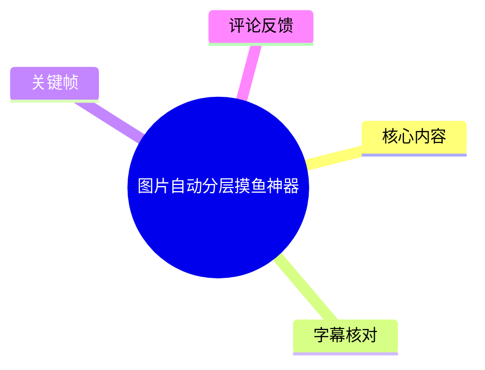
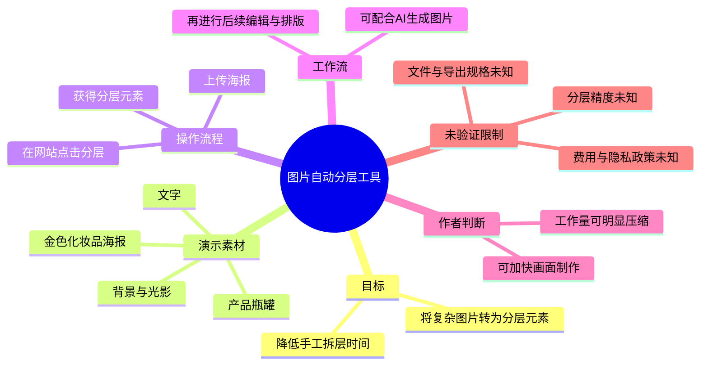

# 图片自动分层摸鱼神器

> 来源：[Bilibili 视频](https://www.bilibili.com/video/BV1FA7z6xELE) 
> UP 主：小圆圆有大宝贝｜发布时间：2026-06-05｜视频时长：19 秒｜分辨率：2074 × 1080 
> 视频简介：一键生成、一键分层，大幅降低设计时间；工具地址为 `layercraft.com.cn`。

## 小结

视频介绍了一个面向海报等复杂图片的自动分层工具。UP 主演示的核心流程是：将一张成品海报上传至网站，点击页面中的分层操作，即可将画面拆分为多个可编辑元素；简介将该工具指向 `layercraft.com.cn`。

UP 主的主要价值判断是，该工具能够减少设计中的手工拆层工作量，并以“工作量压缩一半”“分分钟做完各种画面”“每天按时下班”等口语化表达强调效率提升。这里应将其视为作者的使用感受或宣传性判断，而非经过视频量化验证的性能结论。

画面案例是一张金色调化妆品海报，包含文字、瓶罐产品、丝绸/布料背景及光影等复合视觉元素。此类画面若要后期独立调整产品、背景或排版，通常需要分离不同视觉对象；视频展示的功能定位正是服务于这一需求。

视频还提到可与“网上自带的 GPTe-mail 神图”配合使用，但 ASR 对这一专有名词的识别不够可靠，且没有可用站内字幕或清晰画面文字用于校正。因此，本文保留 ASR 原文，不把它扩展解释为某个确定的具体产品、模型或平台。

适合需要快速制作或二次编辑视觉海报的设计从业者、运营人员和 AI 图片工作流使用者参考。视频仅展示了输入与“分层元素”结果的概念性过程，未说明支持的文件格式、导出格式、图层数量、分层精度、价格、版权政策、隐私处理或失败处理方式；正式用于项目之前仍需自行测试。

## 思维导图

## 目录

- [背景与问题](#背景与问题)
- [核心演示：复杂海报一键分层](#核心演示复杂海报一键分层)
- [方法与实践](#方法与实践)
- [参数、限制与时效性](#参数限制与时效性)
- [字幕比对](#字幕比对)
- [评论分析](#评论分析)
- [处理记录](#处理记录)

## 背景与问题 [00:00:00](https://www.bilibili.com/video/BV1FA7z6xELE?t=0)

视频从办公场景切入，提出设计制作中“工作量”较高的问题。UP 主将自动分层称为能显著减轻设计工作量的工具，并强调其可把“复杂的图片一键做成分层图”。

这里的“分层”可按视频语境理解为：将原先合并在一张位图中的不同画面元素拆开，形成可分别处理的元素集合。对于包含标题文字、主体商品、装饰材质与光影背景的海报，这种拆分有助于后续替换、移动、遮挡关系调整或再排版；但视频没有展示具体编辑器、图层面板或导出文件，不能据此确认其输出一定是 PSD、SVG、PNG 序列或其他格式。

> 图：该关键帧对应视频开头的口播引入，字幕明确显示“给你看一个很恶心的东西”。它说明“恶心”是夸张的口语化悬念表达，后续实际指向的是可提升工作效率的工具，而非负面技术事件。

UP 主随后称“有了这个，设计工作量压缩一半”。这是一项个人主张，视频未给出任务样本、原始耗时、对照组、成功率或统计口径，不能将“压缩一半”视为适用于所有项目的固定参数。

> 图：该帧直接保留了“工作量压缩一半”的画面字幕，便于区分视频作者的主观效率判断与已被独立验证的技术指标。

## 核心演示：复杂海报一键分层 [00:00:00](https://www.bilibili.com/video/BV1FA7z6xELE?t=0)

ASR 的唯一时间段覆盖 00:00:00–00:00:17.680，包含完整口播：“可以把复杂的图片一键做成分层图，比如这个海报，丢进去这个网站，点这里一下，就变成分层元素了。”

演示输入为一张竖版金色化妆品宣传海报。画面中可识别的组成包括：

- 顶部大标题“LUXE RADIANCE”及多处小号文字；
- 三个金色化妆品容器；
- 承载产品的浅色丝绸材质；
- 金色布料、暗色背景与高光阴影；
- 产品、文字与背景之间的遮挡、光照和材质关系。

这类素材能够体现自动分层任务的复杂性：系统不仅要区分主体商品与背景，也可能要面对文字、反光、阴影、透明边缘和相互遮挡的物体。视频画面只展示了上传前/处理中海报，以及“变成分层元素”的结果性说法，没有公开每个元素的边界、掩膜质量、图层命名、可编辑性或瑕疵情况。

> 图：该帧展示被用于演示的复杂海报：产品、文字、布料和光影叠加在同一画面内。它是理解“为何需要自动分层”的关键证据，也提示此功能面对的并非仅有纯色背景的简单抠图任务。

视频简介提供工具地址：`layercraft.com.cn`。这是素材中唯一明确给出的站点信息。视频本身未展示完整网址栏、账号状态、计费页面或服务条款，因此不能进一步断言该站点的注册要求、免费额度、付费方案、处理速度或数据留存规则。

### 视频中的工作流主张 [00:00:00](https://www.bilibili.com/video/BV1FA7z6xELE?t=0)

UP 主建议将自动分层与网络上的 AI 图片生成能力配合使用，ASR 原话为“配合网上自带的 GPTe-mail 神图，分分钟做完各种画面”。根据已提供素材：

1. 可以确认作者建议“生成图片 + 自动分层”的组合式流程；
2. 无法确认“GPTe-mail 神图”的准确写法、所属平台与功能；
3. “分分钟做完各种画面”没有任务规模或质量标准，应理解为效率愿景，而非承诺时长。

更稳妥的可迁移经验是：先获得一张满足视觉方向的合成图，再通过分层工具为后续局部修改争取空间。是否能真正减少返工，取决于原图中元素之间的边界是否清楚、文字是否被正确识别、阴影是否能合理保留，以及导出结果能否进入目标设计软件继续编辑。

## 方法与实践 [00:00:00](https://www.bilibili.com/video/BV1FA7z6xELE?t=0)

以下步骤按视频口播的实际顺序整理；其中未在视频中展示的操作不补写为既定事实。

1. **准备待处理的复杂图片**  
   视频以一张商业海报为例。输入图中同时存在商品、文字、装饰布料与复杂光影，说明目标可以是已经合成好的整张图片，而不局限于单一前景对象。

2. **进入视频简介给出的工具站点**  
   地址为：`layercraft.com.cn`。  
   视频没有提供完整的页面路径、注册步骤或入口名称；访问时应以站点当前页面为准。

3. **将海报“丢进去”网站**  
   UP 主以口语描述上传动作。可确认要将图片提交给网站处理，但无法从素材确认允许的图像格式、文件大小、最高分辨率、批处理能力或是否必须登录。

4. **点击页面中的分层操作**  
   口播为“点这里一下”。这表明演示强调一键式触发，但没有可验证的按钮文案、参数选项或模型配置。不要假定存在“主体分层”“文字分层”“背景分层”等特定模式。

5. **获取“分层元素”并进行后续制作**  
   视频声称操作后会变成“分层元素”。后续可将这些元素用于独立调整或画面再创作，这是该流程的合理用途；但视频未展示实际下载或导入设计软件的过程，因此不能确认最终文件能否保留图层结构。

### 实操验收建议

以下为基于视频功能定位提出的验收清单，不是视频已经展示的功能：

- 检查主体商品边缘是否完整，尤其是高光、透明材质、细小轮廓；
- 检查文字是否被独立出来，还是被错误地并入背景；
- 检查投影、反光、丝绸纹理是否被保留在合适的元素中；
- 检查重叠物体之间是否产生缺口、重复片段或不自然的补全区域；
- 在实际商业使用前，确认导出格式是否适配目标软件，以及素材上传后的授权、隐私与使用范围。

## 参数、限制与时效性 [00:00:00](https://www.bilibili.com/video/BV1FA7z6xELE?t=0)

### 已知参数与事实

| 项目 | 素材可确认的信息 |
| --- | --- |
| 视频时长 | 19 秒 |
| 有效语音覆盖 | 00:00:00–00:00:17.680，共 17.680 秒 |
| ASR 语言 | 中文，语言置信度 0.9751 |
| 演示对象 | 一张复杂的金色化妆品海报 |
| 操作表达 | 上传图片后点击一次分层操作 |
| 工具地址 | `layercraft.com.cn`（来自视频简介） |
| 作者效率表述 | “工作量压缩一半”“分分钟做完各种画面” |
| 视频分辨率 | 2074 × 1080 |

### 未披露限制

素材没有给出下列信息，使用者不应自行补全：

- 是否支持 JPEG、PNG、WebP、PSD 或其他输入格式；
- 最大上传文件体积、分辨率、并发量与任务时长；
- 输出是独立图片、透明 PNG、可编辑图层文件还是其他形式；
- 图层拆分数量、文字识别能力、遮挡补全质量与失败率；
- 是否收费、是否有免费试用、积分消耗或商用授权；
- 上传图片是否被保存、用于模型训练，或如何删除；
- 对人物肖像、品牌素材、版权图片的使用限制。

### 时效性

本视频发布于 2026-06-05，素材抓取于 2026-07-15。AI 图片处理站点的模型版本、入口位置、额度、收费标准、服务可用性和隐私条款均可能在发布后变化。本文只记录视频与元数据中可见的当时信息，不将其视作当前站点状态的保证。

## 字幕比对

| 字幕来源 | 完整性 | 专有名词 | 时间轴 | 主要问题 |
| --- | --- | --- | --- | --- |
| Bilibili 站内字幕 | 未提供可用字幕，无法比对 | 无法核验 | 无 | 素材明确标注“未提供可用站内字幕” |
| 本次 ASR 字幕 | 高：覆盖 17.680 秒语音，诊断语音覆盖率为 98.19% | “GPTe-mail 神图”识别存在歧义 | 有：单段 00:00:00.000–00:00:17.680 | 全片压缩为单一长句，缺少细粒度断句；网站名称未在 ASR 口播中明确识别 |

最终采用**本次 ASR 字幕**作为口播内容与时间轴依据，因为没有可用的 Bilibili 站内字幕。ASR 诊断显示存在音频流：未出现 `noAudioStream=true` 标记；识别语言为中文，且无大段静音警告，因此并非“无音轨”情形。

关键校正原则如下：

- “工作量压缩一半”“复杂的图片一键做成分层图”“丢进去这个网站”“变成分层元素”等核心表述，既出现在 ASR 中，也能由提供的关键帧字幕或演示画面支持；
- `layercraft.com.cn` 来自视频简介，而非 ASR 的明确识别结果；
- “GPTe-mail 神图”为 ASR 原文，缺少站内字幕及可靠画面证据，本文不对其进行强行纠错或映射到具体产品名称。

## 评论分析

以下仅处理可获取的热评前三条。评论反映的是个体态度，不构成对工具功能、效果或安全性的验证。

1. **我的一生都在原地踏步**（5 赞）：`💀`  
   该评论只有表情符号，没有提供对工具效果、使用步骤或风险的可验证信息。结合视频的“摸鱼神器”表达，可能是对效率冲击的情绪化反应，但无法确定具体观点。

2. **BRS梦幻佼佼者**（0 赞）：`发现宝藏UP！！作品超棒，可以互关吗…`  
   评论表达了对 UP 主内容的赞赏和互动请求，没有补充该自动分层服务的实际使用经验，也没有技术争议信息。

3. **bili_50349872485**（0 赞）：`支持一下up！`  
   这是泛支持性留言，不涉及工具的准确性、价格、使用门槛或分层质量。

可获取的前三条热评均未提供实测反馈、教程补充或负面案例，因此无法从评论区获得对 `layercraft.com.cn` 实际能力的额外佐证。

## 处理记录

- **Worker ID**：`worker-mrj0wjed-b0c290ad`
- **模型**：`gpt-5.6-terra`
- **调用工具与模型**：素材处理链已提供音频提取、关键帧抽取、ASR、视频元数据与评论结果；ASR 模型为 `medium`，运行设备为 CUDA，计算类型为 float16。
- **使用的素材工具结果**：使用 `merged.mp4` 对应的视频素材信息、`audio/audio.wav`、`asr/transcript.srt`、`asr/asr-result.json`、关键帧目录 `frames/`、视频元数据及 `comments/comments.json`。
- **字幕选择**：站内字幕未提供可用版本；已检查本次 ASR，确认其有时间戳、语音覆盖率 98.19%，故采用 ASR 的 00:00:00–00:00:17.680 分段作为全部正文时间轴依据。
- **关键帧选择依据**：选择 `frame-001.jpg` 说明开场语境，`frame-003.jpg` 固定“工作量压缩一半”的作者表述，`frame-004.jpg` 展示复杂海报输入案例；三者分别服务于背景、主张与技术对象说明，避免用重复人物镜头替代功能证据。
- **缓存清理**：本次仅基于任务提供的已处理素材进行整理；未执行额外下载、转码或生成临时缓存，故无新增缓存需要清理。
- **未解决问题**：无法从现有素材确认站点当前可访问性、账户与价格规则、输入输出格式、图层可编辑程度、分层精度、数据隐私政策及“GPTe-mail 神图”的准确名称。
