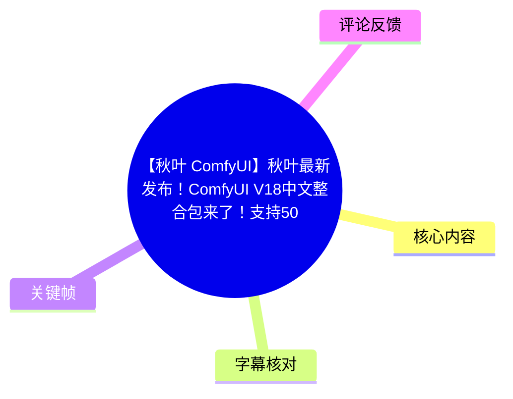
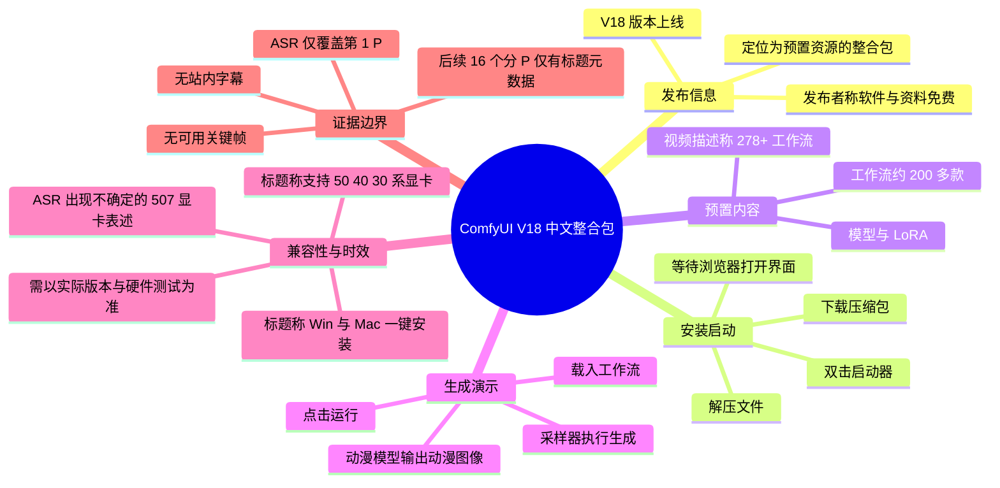

# 【秋叶 ComfyUI】秋叶最新发布！ComfyUI V18中文整合包来了！支持50 40 30系显卡，Win+Mac一键下载安装（附新Comfyui整合包）

> 来源：[Bilibili 视频](https://www.bilibili.com/video/BV18QRVB4ERv)  
> UP 主：秋葉aaakki｜合集：AIcode｜元数据总时长：2:36:20  
> 本次可用 ASR 音频覆盖：第 1 P《最新 V18 整合包安装教程》，约 00:00–02:35；其余分 P 仅有标题级元数据，未提供对应音频字幕或关键帧证据。

## 小结

视频开篇发布并演示了一个名为 **ComfyUI V18 中文整合包** 的版本。UP 主的核心主张是：用户可通过“**下载压缩包 → 解压 → 双击启动器**”三步打开 ComfyUI，不必自行安装复杂插件或配置运行环境；整合包内预置模型与工作流，定位为开箱即用的本地 AI 图像、视频创作环境。

在已被 ASR 覆盖的第 1 P 中，UP 主展示了启动器打开浏览器内 ComfyUI 界面的过程，并说明左侧模型区域放置了常见模型、LoRA 等资源；工作流部分则称有“约 200 多款”。视频描述中另称整合包包含“278+ 工作流、模型、插件、LoRA 等”，两种数量口径并不完全一致，应以实际压缩包清单为准。

视频把“免费”“预置资源”“支持新显卡”和“视频工作流”作为主要卖点。需要注意：免费性质、模型授权范围、工作流可运行性、下载入口安全性及硬件兼容性均属于发布者陈述，本素材未提供下载页、许可证、文件哈希、实际硬件测试记录或完整配置清单，不能据此独立验证。

元数据标题与简介称其支持 **50 / 40 / 30 系显卡**，并声称 Windows、Mac 可“一键安装”；而第 1 P 的 ASR 中出现“支持 507 显卡”的识别文本。由于该表述可能是口语或型号识别错误，不能据此确认具体型号，更不能将其扩展为所有 NVIDIA 50 系显卡均已验证支持。Mac 支持也未在本次可用音频中演示。

本视频的总时长元数据为 9,380 秒、共 17 个分 P，但本次音频素材时长只有约 157.73 秒，实际仅覆盖第 1 P。后续“文生图、图生图、高清放大、ControlNet、IPAdapter、老照片修复及视频生成”等主题可以依据分 P 标题确认其存在，但缺乏可审计的逐步内容，本文不会补写其具体操作或参数。

## 思维导图

## 目录

- [发布内容、卖点与证据范围](#发布内容卖点与证据范围-000000)
- [三步安装与启动流程](#三步安装与启动流程-000112)
- [预置模型、LoRA 与工作流](#预置模型lora-与工作流-000136)
- [运行工作流与生成示例](#运行工作流与生成示例-000200)
- [分 P 课程结构：可确认主题与不可确认内容](#分-p-课程结构可确认主题与不可确认内容)
- [限制、风险与时效性](#限制风险与时效性)
- [关键帧与画面证据](#关键帧与画面证据)
- [字幕比对](#字幕比对)
- [评论分析](#评论分析)
- [处理记录](#处理记录)

## [发布内容、卖点与证据范围](https://www.bilibili.com/video/BV18QRVB4ERv?t=0)

### 发布者的主要陈述

根据 ASR 的 00:00:00.080–00:01:12.180 内容，UP 主宣布其“ComfyUI 自用整合包 V18 版本”上线，并将其描述为适合图片与视频生成使用的整合环境。其宣传重点包括：

1. **降低本地部署门槛**  
   发布者称用户不必自行安装复杂插件，也不必为环境配置烦恼；模型被描述为已经提前准备好。

2. **免费主张**  
   视频明确表示软件使用与资料分享“完全免费”。  
   这属于发布者声明，不等于对压缩包内每一个模型、插件、工作流或第三方资源的许可证作出保证。实际使用前仍需核验资源来源与授权。

3. **预置工作流**  
   发布者称增加了许多可直接使用的工作流，涉及动作牵引、角色替换、视频创作等方向，但 ASR 对具体工作流、模型名的识别存在明显混淆，无法据此建立可靠的模型/节点清单。

4. **显卡兼容性宣传**  
   视频元数据简介称“全面支持 50 40 30 系显卡”。ASR 在 00:00:24–00:00:48 中识别到“完美地支持 507 显卡”，该词可能是型号识别误差或口语截断；本素材没有展示显卡型号、CUDA/PyTorch 版本、驱动版本、显存占用或实际测试截图，因此无法进一步确认。

### 可确认与不可确认的信息边界

| 信息 | 素材依据 | 结论 |
| --- | --- | --- |
| V18 整合包已被发布者宣称上线 | ASR 00:00–00:00:24 | 可记录为发布者陈述 |
| 安装思路为下载、解压、双击启动器 | ASR 00:01:12–00:01:36 | 有明确步骤描述 |
| 界面中有模型、LoRA、工作流等资源 | ASR 00:01:36–00:02:00 | 可记录为视频展示说明 |
| 工作流数量 | ASR 称约 200 多款；视频简介称 278+ | 数量口径不一致，不作精确结论 |
| 支持 50/40/30 系显卡 | 标题、简介 | 发布元数据主张，缺乏实测细节 |
| Windows 与 Mac 一键安装 | 标题 | 元数据主张；本次音频未演示 Mac |
| 特定视频模型、ControlNet、IPAdapter 的具体配置 | 仅有后续分 P 标题 | 无可用字幕/画面，不可补写 |

## [三步安装与启动流程](https://www.bilibili.com/video/BV18QRVB4ERv?t=72)

ASR 的 00:01:12.180–00:01:36.300 给出了第 1 P 中最明确的操作流程。原视频没有给出下载地址、压缩包文件名、目录结构、启动脚本名称、系统权限设置或报错处理方法，因此以下仅整理已经出现的步骤。

### 操作步骤

1. **下载整合包压缩文件**  
   发布者称先下载压缩包，但未在本次可用素材中提供链接、文件大小、版本号或校验值。  
   建议实际下载时仅从 UP 主可验证的官方发布渠道取得文件，并保留压缩包原始文件名与版本信息。

2. **解压压缩包**  
   下载后对压缩包进行解压。视频未说明是否必须解压到纯英文路径、是否禁止中文路径、是否需要管理员权限，故这些事项不能作为视频结论。

3. **找到启动器图标并双击**  
   在解压后的目录中找到启动器图标，双击打开。视频未说明启动器实际名称，不能擅自推定为某个 `.bat`、`.exe` 或 shell 脚本。

4. **等待黑色命令窗口初始化**  
   双击后会出现黑色窗口。该窗口可理解为启动过程的终端/控制台界面，但视频没有展示日志内容，因此无法判断其具体在执行 Python 环境、依赖检查、服务启动还是模型加载。

5. **通过默认浏览器进入界面**  
   稍等后，整合包会在系统默认浏览器打开 ComfyUI 界面。视频将此作为启动成功的结果。

### 实践经验：把“能启动”与“能稳定生成”分开验证

视频演示侧重于快速启动，但实际使用时至少应分别确认：

- 启动器能否正常运行；
- 浏览器是否真正打开本地 ComfyUI 页面；
- 工作流节点是否全部加载，没有缺失节点；
- 已选模型是否能被加载；
- 提交任务后采样器是否开始执行；
- 最终是否能输出图像。

其中，只有“运行工作流后采样器执行、最终生成图像”在本次 ASR 中被明确讲述；其他检查项是通用验证建议，并非视频逐项展示的内容。

## [预置模型、LoRA 与工作流](https://www.bilibili.com/video/BV18QRVB4ERv?t=96)

### 资源组织方式

在 00:01:36.300–00:02:00.300 中，发布者介绍界面左侧的模型区域，称其中放置了常见模型、用于大模型的资源以及 LoRA 等内容；同时称工作流部分有“约 200 多款”。

由于 ASR 将多个专有名词识别为“Flex”“千萬模型”“Laura”等，不能把这些字符串直接视作准确资源名。结合视频主题，能可靠保留的只有以下层级信息：

- **模型**：整合包内被宣称预置了多种模型；
- **LoRA**：整合包内被宣称包含 LoRA 类资源；
- **工作流**：整合包内被宣称包含大量预配置工作流；
- **用途**：发布者提到图像生成及 AI 视频创作相关使用场景。

### 工作流数量的两个口径

| 来源 | 数量表述 | 处理方式 |
| --- | --- | --- |
| ASR，约 00:01:36–00:02:00 | “大概有 200 多款” | 保留为视频口述的概数 |
| 视频简介 | “含 278+ 工作流、模型、插件、lora 等” | 保留为简介宣传口径 |
| 本文结论 | 不采用单一精确数值 | 需以压缩包实际文件列表为准 |

### 资源预置的价值与限制

预置模型、插件和工作流的价值在于减少首次安装时的依赖配置、节点寻找和路径组织成本，尤其适合希望快速体验 ComfyUI 工作流的用户。

但预置资源也带来几个必须自行核验的问题：

- 压缩包体积、磁盘空间需求和解压耗时未提供；
- 模型版本、来源和授权未提供；
- 不同显卡、显存和操作系统上的可运行性未展示；
- 工作流即使随包提供，也可能因版本更新、模型缺失或节点变化而失效；
- 视频没有展示自定义模型导入、模型目录管理和插件更新方法。

## [运行工作流与生成示例](https://www.bilibili.com/video/BV18QRVB4ERv?t=120)

### 视频中的最小生成闭环

ASR 的 00:02:00.300–00:02:35.020 描述了一个基础工作流执行过程：

1. 获得或打开一个工作流；
2. 点击“运行”；
3. 观察采样器处于执行生成的状态；
4. 最终得到一张图像；
5. 演示使用的是动漫模型，因此输出为动漫风格图像；
6. 发布者表示还可尝试人物模型等其他模型。

这里体现出 ComfyUI 的基本使用方式：**工作流决定节点连接和处理链路，模型影响生成能力与风格，运行后由采样器等节点完成生成过程。**

### 视频未给出的关键参数

虽然出现了“采样器正在进行生成”的描述，但本次素材没有给出以下决定结果的重要参数：

| 参数类别 | 本视频是否提供 | 影响 |
| --- | --- | --- |
| 提示词与负面提示词 | 未提供 | 决定画面主体、风格与约束 |
| 模型精确名称与版本 | 未可靠提供 | 决定适用能力、画质和资源占用 |
| 图像尺寸 | 未提供 | 影响构图、生成速度与显存 |
| 采样器名称 | 未提供 | 影响采样行为与画面特征 |
| 采样步数 | 未提供 | 影响速度与细节收敛 |
| CFG/引导强度 | 未提供 | 影响提示词服从度 |
| Seed | 未提供 | 决定可复现性 |
| 显存、生成耗时 | 未提供 | 无法据此评估硬件门槛 |

因此，该演示能够说明“整合包可以被启动并执行一个工作流”的预期流程，但不足以复现同一张图片，也不能用于比较不同显卡或模型的性能。

## [分 P 课程结构：可确认主题与不可确认内容](https://www.bilibili.com/video/BV18QRVB4ERv?t=158)

该 BV 在元数据中包含 17 个分 P，总时长为 9,380 秒。以下时间按分 P 时长累加计算，属于页面元数据的课程定位信息；除第 1 P 外，没有与这些分 P 对应的 ASR、站内字幕或关键帧，故仅记录主题，不扩展为教程步骤。

| 分 P | 累计时间位置 | 标题 | 当前可确认范围 |
| --- | ---: | --- | --- |
| P1 | 00:00–02:38 | 最新 V18 整合包安装教程 | 有 ASR，本文已展开 |
| P2 | 02:38–20:56 | ComfyUI 界面导览与最基础生图流程 | 仅确认主题 |
| P3 | 20:56–42:39 | 文生图与背后的运行逻辑 | 仅确认主题 |
| P4 | 42:39–55:31 | 图生图与背后的运行逻辑 | 仅确认主题 |
| P5 | 55:31–1:06:55 | AIGC 有关网站与模型下载 | 仅确认主题 |
| P6 | 1:06:55–1:23:53 | 高清放大与细节添加 | 仅确认主题 |
| P7 | 1:23:53–1:36:26 | ControlNet（上） | 仅确认主题 |
| P8 | 1:36:26–1:48:47 | ControlNet（下） | 仅确认主题 |
| P9 | 1:48:47–1:56:31 | IPAdapter | 仅确认主题 |
| P10 | 1:56:31–2:12:40 | 综合案例：老照片修复工作流 | 仅确认主题 |
| P11 | 2:12:40–2:14:21 | ComfyUI 视频生成简介 | 仅确认主题 |
| P12 | 2:14:21–2:18:10 | 视频生成：文生视频 | 仅确认主题 |
| P13 | 2:18:10–2:21:41 | 视频生成：图生视频 | 仅确认主题 |
| P14 | 2:21:41–2:24:57 | 视频生成：首尾帧 | 仅确认主题 |
| P15 | 2:24:57–2:28:45 | 视频生成：视频高清放大 | 仅确认主题 |
| P16 | 2:28:45–2:32:50 | 视频生成：动作迁移 | 仅确认主题 |
| P17 | 2:32:50–2:36:20 | 视频生成：视频换脸 | 仅确认主题 |

> 说明：P2–P17 的时间位置依据各分 P 元数据时长累计计算，用于课程导航；它们不是从 ASR/SRT 中推导出的语音分段。正文的实质性时间轴均优先使用了第 1 P ASR 的真实 SRT 起止时间。

## 限制、风险与时效性

### 素材覆盖限制

- 元数据记录的是 17 P、2 小时 36 分 20 秒的课程；
- 本次提供的 `audio.wav` 和 ASR 仅长约 157.73 秒；
- ASR 的最后语音结束于 00:02:35.020，与 P1 的 158 秒时长基本对应；
- 因此，关于文生图、图生图、ControlNet、IPAdapter、视频生成等后续主题，本文不能提供具体节点、参数、案例结果或故障排查。

### 版本与兼容性风险

1. **V18 是发布时的版本标签，不是长期稳定承诺**  
   ComfyUI、插件、模型和显卡驱动均可能更新。视频中可用的工作流，之后可能因节点接口、模型文件名或依赖版本变化而需要调整。

2. **显卡支持应以实测为准**  
   标题/简介的“50、40、30 系显卡”属于发布方宣传信息。没有看到驱动、CUDA、PyTorch、显存和不同系统的测试证据时，不宜将其理解为所有型号、所有显存容量均可稳定运行。

3. **Mac 支持未得到本次音频演示佐证**  
   虽然标题称“Win+Mac 一键下载安装”，但可用 ASR 没有出现 macOS 安装或 Apple Silicon/Intel Mac 配置演示。实际安装前需确认对应安装包、系统版本和硬件要求。

4. **“免费”不替代授权审查**  
   软件包免费、资料免费与其中第三方模型及插件的再分发权限是不同问题。商用、公开发布或二次分发时尤其需要检查各资源许可证。

5. **下载安全需要独立验证**  
   本素材未提供可核验下载链接、哈希值或数字签名。不要仅依据评论区“求分享”或非官方网盘链接安装可执行文件。

## 关键帧与画面证据

本任务未提供任何关键帧路径，素材清单同时记录：

- `frames failed: ffmpeg 执行失败，退出码 -22`
- 站内字幕抓取失败：`Invalid URL`

因此，**没有可用的 `frames/xxx.jpg` 文件可嵌入正文**。为避免伪造画面证据，本文未插入不存在的关键帧图片，也未根据封面图或文字顺序臆测界面细节。

可从 ASR 直接确认的画面相关描述仅包括：

- 启动器双击后会弹出黑色窗口；
- 稍候会在默认浏览器打开 ComfyUI 界面；
- 界面左侧有模型相关区域；
- 运行工作流时可看到采样器进行生成；
- 演示结果为动漫风格图像。

这些均为语音叙述，不能替代实际关键帧或屏幕录像的视觉验证。

## 字幕比对

| 字幕来源 | 完整性 | 专有名词 | 时间轴 | 主要问题 |
| --- | --- | --- | --- | --- |
| Bilibili 站内字幕 | 未提供可用字幕 | 无法评估 | 无法评估 | 字幕工具返回 `Invalid URL`，未获得站内字幕内容 |
| 本次 ASR 字幕 | 覆盖约 154.94 秒语音，覆盖率 98.23%；对应第 1 P | 较弱：多处模型/工作流名明显误识别 | 较好：提供 7 段 SRT，起止时间可直接使用 | 未覆盖后续 16 P；“空VI”“507 显卡”“Flex”“Laura”等词需谨慎解释 |

### 最终字幕选择

本文采用 **本次 ASR 的带时间戳 SRT** 作为第 1 P 的主要时间轴依据，原因是站内字幕未能获取，而 ASR：

- 识别语言为中文，置信度约 `0.9956`；
- 使用 `medium` 模型；
- 在 CUDA 上以 `float16` 推理；
- 有 7 个带真实起止时间的分段；
- 首段语音开始于 00:00:00.080，最后语音结束于 00:02:35.020；
- 诊断未标记 `noAudioStream=true`，且已提供 `audio.wav`，因此不能将此视频视为无音轨源视频。

### ASR 中的重点校正与保留原则

| ASR 文本 | 本文处理 | 原因 |
| --- | --- | --- |
| “空VI” | 结合标题规范为“ComfyUI” | 标题、分 P 标题和全片主题均明确为 ComfyUI |
| “Laura” | 规范为“LoRA” | 视频简介明确写有 `lora`，且 LoRA 是该领域常用术语 |
| “Flex 模型” | 保留为未完全确认的“模型名识别结果” | 缺乏站内字幕、画面和文件清单，不能断言其为具体模型 |
| “千萬模型” | 不作具体模型名修正 | 识别不可靠，缺乏足够交叉证据 |
| “Y2.2”及后续串词 | 不纳入具体技术结论 | ASR 语义严重破碎 |
| “507 显卡” | 标记为不确定表述 | 与元数据“50/40/30 系”口径不同，不能擅自确定具体 GPU 型号 |

## 评论分析

仅处理本次可获取的热评前三条。三条评论点赞数均为 4，内容较短，不能视为对整合包质量、兼容性或安全性的独立验证。

| 排名 | 用户 | 点赞 | 评论 | 分析 |
| --- | --- | ---: | --- | --- |
| 1 | 又有幽灵 | 4 | `666` | 纯正向感叹，表达认可或支持，未提供可验证的使用反馈。 |
| 2 | 心火灬 | 4 | `666` | 同样是简短赞许，没有涉及下载、安装成功率、模型效果或问题。 |
| 3 | bili_61771361157 | 4 | `666，求分享` | 表达对资源获取的需求，说明“分享/下载入口”是观众关注点；但没有提供官方来源，也不能据此推断资源已公开、链接安全或许可完备。 |

评论区没有出现关于显卡兼容、Mac 安装、工作流可用性、文件体积、报错处理或授权问题的有效补充信息。

## 处理记录

- **Worker ID**：`worker-mrj0wjed-b0c290ad`
- **整理模型**：`gpt-5.6-terra`
- **ASR 模型与推理配置**：`medium`；语言自动识别为中文（概率 `0.99560546875`）；CUDA；`float16`
- **使用的素材工具结果**：
  - 音频提取：已提供 `audio/audio.wav`
  - ASR：已提供 `asr/transcript.srt`、`asr/asr-result.json` 与诊断数据
  - 站内字幕获取：失败，错误为 `Invalid URL`
  - 关键帧提取：失败，`ffmpeg` 退出码 `-22`
  - 评论：成功获取热评 3 条
- **字幕选择**：未获得可用站内字幕；采用本次 ASR 的 SRT 时间轴。ASR 仅覆盖约 2 分 35 秒，对应第 1 P，不将其误用为全 17 P 字幕。
- **关键帧选择依据**：没有可用关键帧文件，且关键帧提取失败；为保证真实性，未引用任何虚构的 `frames/xxx.jpg` 路径。
- **缓存清理**：素材中未提供缓存清理日志，无法确认是否已清理；不作“已清理”声明。
- **未解决问题**：
  - 未获取第 2–17 P 的音频、字幕或关键帧；
  - 未获取整合包下载链接、版本号、校验值、目录清单与许可证；
  - 无法核验“50/40/30 系显卡”“Mac 一键安装”“278+ 工作流”等宣传信息；
  - ASR 对多个模型、工作流及显卡专名存在识别不确定性。
