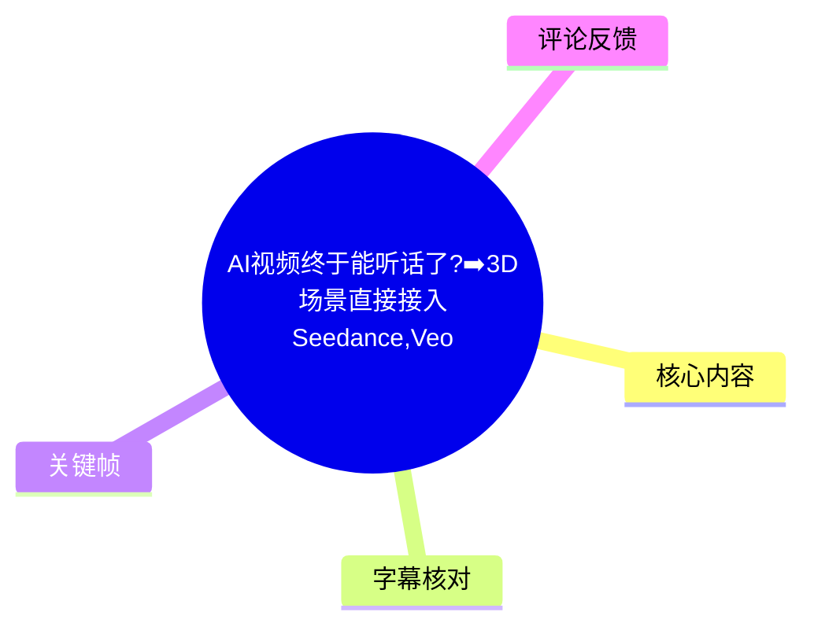
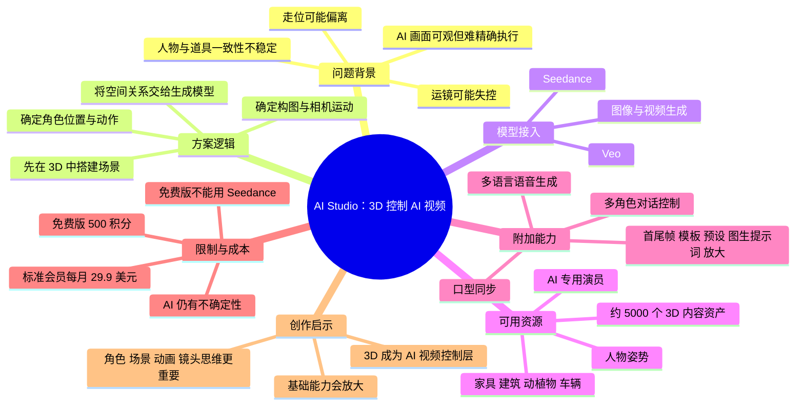
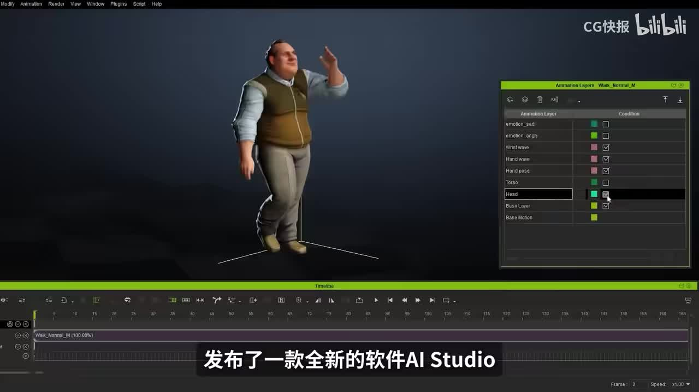
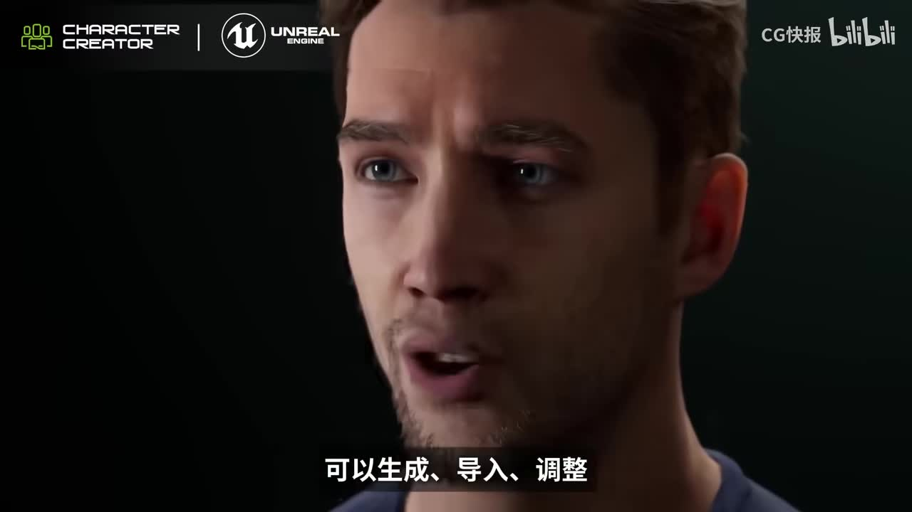
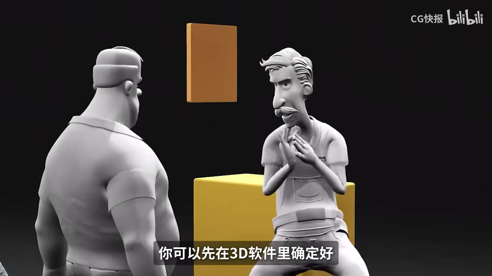

# AI视频终于能听话了?➡️3D场景直接接入Seedance,Veo

> 来源：[Bilibili 视频](https://www.bilibili.com/video/BV1TMVp6VEos) 
> UP 主：CG快报｜视频时长：05:04｜官网：<https://ai.reallusion.com/ai-studio/default.html#early-access>

## 小结

视频介绍了 Reallusion 推出的 **AI Studio**：它试图把传统 3D 制作中的场景、角色位置、镜头构图、摄像机运动与角色动画，转化为 AI 图像/视频生成的明确控制条件，再将这些条件接入 Seedance、Veo 等视频模型。

视频的核心观点是：当前 AI 视频的难点不只是“画面是否好看”，而是能否稳定遵守导演意图，例如角色按指定路线移动、镜头按指定路径推拉或跟拍、人物动作后仍维持服装、脸部和道具的一致性。AI Studio 的思路不是仅增加提示词，而是先用 3D 场景确定空间关系与动作节奏，再让生成模型据此出图或出视频。

对已有 3D 基础的创作者，视频建议将角色、场景、镜头和动画能力视为新的 AI 视频控制能力；对不熟悉 3D 的用户，软件提供约 5,000 个可用于 AI 流程的 3D 内容资产，帮助先搭建镜头而非从零建模。视频还提到可通过 3D 角色或参考图制作较稳定的“AI 专用演员”。

需要注意，视频明确表示这并非“百分之百不出问题”：生成式 AI 仍有不确定性。价格与上线信息也具有时效性——视频称免费版仅有 500 积分且不能使用 Seedance，视频商用需订阅每月 29.9 美元的标准会员；iClone 8、Character Creator 4 / 5 正式会员可免费完整使用一个月，完整软件预计于“6 月份”正式上线。以上均为视频发布时的陈述，应以官网当前规则为准。

适合阅读者：希望提高 AI 视频镜头可控性的人、已有 iClone / Character Creator 工作流的用户、3D 动画师、角色/IP 内容创作者，以及希望将 3D 预演与 AI 视频生成结合的团队。

## 思维导图

## 目录

- [问题：AI 视频为何“不听话”](#问题ai-视频为何不听话)
- [产品背景：Reallusion 与 AI Studio](#产品背景reallusion-与-ai-studio)
- [核心工作流：先搭 3D，再生成 AI 视频](#核心工作流先搭-3d再生成-ai-视频)
- [为什么接入 Seedance、Veo 有意义](#为什么接入-seedanceveo-有意义)
- [实践步骤：从 3D 预演到生成结果](#实践步骤从-3d-预演到生成结果)
- [资产库与 AI 专用演员](#资产库与-ai-专用演员)
- [附加生成、语音与编辑功能](#附加生成语音与编辑功能)
- [价格、会员与上线时效](#价格会员与上线时效)
- [创作经验与适用边界](#创作经验与适用边界)
- [字幕比对](#字幕比对)
- [评论分析](#评论分析)
- [处理记录](#处理记录)

## 问题：AI 视频为何“不听话” [00:00:28](https://www.bilibili.com/video/BV1TMVp6VEos?t=28)

视频将 AI 视频的关键痛点定位为 **可控性**，而非单纯画质。即使单帧或短片段看起来“很炸”，在需要精细执行的创作任务中仍可能失效：

- 角色被要求从桌子旁走到门口时，人物身份也许大致保持，但行走路线不一定遵循要求。
- 希望镜头从侧面缓慢跟拍时，生成结果的镜头路径可能不符合预期。
- 希望制作推拉镜头时，镜头可能在过程中失控。
- 即使指定了某个动作，人物衣服、脸部、道具等视觉元素也可能发生不一致变化。

视频因此把问题概括为：**镜头能否按导演意图拍出来**。这也是后续引入 3D 场景的原因——用显式空间关系、镜头和动作信息替代仅凭自然语言提示词猜测。

> 图：关键帧用直观场景对应“角色走位 + 侧面跟拍”的例子，有助于理解视频所说的并非一般画面生成，而是角色路径与镜头语言的精确控制问题。

## 产品背景：Reallusion 与 AI Studio [00:00:31](https://www.bilibili.com/video/BV1TMVp6VEos?t=31)

视频称，**Reallusion**——iClone 与 Character Creator（CC）相关软件的开发商——推出了 AI Studio。视频将其定位为能从 3D 场景生成 AI 图片和 AI 视频的新工具。

### 既有产品与能力 [00:00:31](https://www.bilibili.com/video/BV1TMVp6VEos?t=31)

按照视频介绍：

- **iClone** 面向实时 3D 动画，涵盖角色动画、动作编辑、口型以及群组动画等能力。
- **Character Creator（CC）** 面向 3D 角色创建，可生成、导入和调整写实或风格化角色。
- 完成的角色可以进入 Maya、Blender、Unreal Engine 等 3D 工作流；此处是视频对其生态兼容性的概述。
- 因此，Reallusion 的基础并非纯文本生成，而是已有较深的 3D 角色与动画工作流积累。

> 图：画面展示角色位于 iClone 类动画界面中，右侧为 Animation Layers 面板、下方为时间线，说明该方案的输入基础包含可编辑的角色动作而非纯提示词。

> 图：该帧以 Character Creator、Unreal Engine 标识和写实角色示例，补充了视频关于 CC 用于 3D 角色创建、并可接入后续 3D 流程的说明。

## 核心工作流：先搭 3D，再生成 AI 视频 [00:00:55](https://www.bilibili.com/video/BV1TMVp6VEos?t=55)

AI Studio 的重点不只是增加一个提示词输入框，而是把传统 3D 制作的“预演”环节放到 AI 生成之前。根据视频描述，创作者可先在 3D 软件内确定：

1. **场景**：环境与物体的空间布置。
2. **角色位置**：人物站在哪里、人与物之间如何相对分布。
3. **构图**：画面中人物、物体与背景的取景关系。
4. **角色动画**：角色做什么动作、动作的先后节奏。
5. **摄像机运动**：机位在哪里、镜头如何移动。

完成这些控制信息后，由 AI Studio 基于它们生成图像或视频。这里的关键转变是：

| 传统纯提示词生成 | 视频所述的 3D 驱动生成 |
| --- | --- |
| 用语言描述角色、场景、运镜 | 在 3D 场景中直接摆放与设定 |
| 模型需要猜测空间布局 | 角色与场景的空间关系先被确定 |
| 运动、走位容易偏离 | 走位与动作节奏有 3D 参考 |
| 多依赖反复“抽卡” | 先控制再生成，减少碰运气成分 |

视频并未承诺生成结果会完全等同于 3D 预演画面；它的主张是，3D 信息能为生成模型提供更明确的参照，从而提升贴合预设走位、构图和镜头安排的可能性。

> 图：关键帧直接呈现人物、座椅、道具在三维空间内的相对关系。这正是 AI Studio 要先确定并带入生成流程的控制信息，也是理解“3D 场景作为 AI 条件”的核心画面。

## 为什么接入 Seedance、Veo 有意义 [00:01:19](https://www.bilibili.com/video/BV1TMVp6VEos?t=79)

视频重点提到 AI Studio 与 **Seedance** 的深度结合，也提及可以直接输出给 **Seedance、Veo 等大模型**生成视频。

视频以 Seedance 2.0 为例，认为其对 3D 空间结构有较强理解，因此当 3D 场景已经提供明确参考时，模型不必完全依赖提示词推断导演意图。视频举出的传统提示词运镜表达包括：

- 吊臂镜头；
- 推压镜头；
- 多轴环绕；
- 多机位切换。

这些术语若仅写入提示词，可能出现“跑偏”；而如果镜头位置与运动本来就在 3D 场景中设定好，模型可获得更直接的空间与运动参照。

在角色动作方面，视频给出的机制是：

1. 在 3D 软件中通过**关键帧**或**动作捕捉数据**先做出动作；
2. 由 AI Studio 将空间关系和动作节奏带入 Seedance 的生成流程；
3. 生成的视频更有机会贴合 3D 软件中预先确定的走位。

这属于视频对工具价值的解释，并非对所有模型、所有镜头类型下稳定性的实测保证。

## 实践步骤：从 3D 预演到生成结果 [00:01:43](https://www.bilibili.com/video/BV1TMVp6VEos?t=103)

结合视频内容，可整理出如下实际制作顺序：

### 1. 明确需要被锁定的内容

在开始生成前，先区分哪些元素不能交由模型自由发挥：

- 人物的起点、终点和行进路线；
- 人物与家具、建筑、道具之间的距离关系；
- 机位、镜头朝向、推拉、跟拍或环绕运动；
- 动作的姿势、时长与节奏；
- 需要长期保持一致的角色外观。

如果作品只追求氛围或随机性，精细 3D 预演未必必要；如果需要分镜落地、角色连续性或可重复修改，预先控制更有价值。

### 2. 在 3D 环境中搭建场景与构图

使用已有模型或资产搭建场景，放置角色、道具和环境，并先确定画面构图。视频强调，这一步的目标不是直接渲染成最终片，而是先把生成所需要的空间信息建好。

### 3. 设定角色动作

对角色采用关键帧动画或动作捕捉数据，明确角色的动作过程和节奏。视频特别指出，动作并非只通过一句自然语言提示交给模型猜测，而是可以先在 3D 侧做出来。

### 4. 设定摄像机

在场景内定义镜头的位置、构图与运动。这样，传统提示词中的“推拉”“侧面跟拍”“环绕”等描述可以对应到更具体的 3D 镜头安排。

### 5. 交给 AI Studio 并选择视频模型生成

视频称，完成 3D 调整后，可以直接输出给 Seedance、Veo 等模型生成视频，也可以生成图像。其相对于“先渲染一条视频、再将视频丢给模型”的优势，被视频概括为减少渲染时间和反复调试的负担。

### 6. 检查一致性并迭代

视频没有给出具体的导出格式、采样轮数、分辨率或提示词参数，因此不能补写为固定参数。可根据视频逻辑重点检查：

- 走位是否仍贴合预演；
- 运镜是否沿用设定；
- 动作节奏是否自然；
- 人脸、服装、道具和角色外观是否出现漂移；
- 不同背景、画风变化时主角是否仍可识别。

> 视频明确提醒：即使采用这种 3D 转 AI 的方式，AI 生成仍有不确定性。它降低的是“完全依靠提示词碰运气”的比例，而不是消除所有生成偏差。

## 资产库与 AI 专用演员 [00:02:31](https://www.bilibili.com/video/BV1TMVp6VEos?t=151)

### 3D 内容库 [00:02:55](https://www.bilibili.com/video/BV1TMVp6VEos?t=175)

针对“不懂 3D 怎么办”的疑问，视频称 AI Studio 内有较实用的 3D 内容库，创作者不必每次都从零建模，可以先用现成素材搭建镜头画面。

视频给出的数量与类型为：

- 约 **5,000 多个**面向 AI 制作流程的 3D 内容；
- 资产主要来自其自有软件生态；
- 示例包括：人物姿势、家具、建筑、动物、植物、车辆等。

这些资产的意义不是替代所有建模工作，而是让用户在生成前快速完成基本画面排布，为人物、场景和镜头提供可见的空间结构。

### AI 专用演员 [00:03:19](https://www.bilibili.com/video/BV1TMVp6VEos?t=199)

视频还介绍了面向 IP 角色创作的“AI 专用演员”能力：

- 输入可以是自己的 3D 角色，或若干参考图；
- 可生成一个外观相对稳定的 AI 角色；
- 用途是将其作为固定的主角演员；
- 即使背景与画风变化，视频称该主角可尽量保持一致；
- 多角色也可放到同一个场景中生成视频，角色本身保持不变，而变化集中在背景与风格。

这里“保持一致”应理解为视频所介绍的目标能力，而不是绝对结果承诺；人物一致性仍是 AI 视频生成中需要实际验收的项目。

## 附加生成、语音与编辑功能 [00:03:43](https://www.bilibili.com/video/BV1TMVp6VEos?t=223)

除 3D 场景控制和角色一致性外，视频列出的功能还包括：

| 类别 | 视频提到的能力 |
| --- | --- |
| 语音与角色表演 | 口型动画同步、多角色对话控制、多语言语音生成 |
| 视频生成 | 传统 AI 视频生成功能 |
| 画面控制 | 首尾帧生成、模板生成、预设生成 |
| 图像辅助 | 从图像生成提示词 |
| 输出增强 | 分辨率放大 |

视频只列出能力名称，未展示具体操作界面、支持语言范围、最长视频长度、输入/输出格式、各模型可用性或质量差异。因此这些功能适合作为进一步验证官网和试用版的检查项，不能据此推导出未说明的技术规格。

## 价格、会员与上线时效 [00:03:43](https://www.bilibili.com/video/BV1TMVp6VEos?t=223)

视频在肯定功能后，也给出费用和可用性限制：

- **免费版**：仅有 **500 积分**；
- **模型限制**：免费版**不能使用 Seedance 模型**；
- **商用限制**：视频称若要将视频用于商用，需要开通**每月 29.9 美元的标准会员**；
- **既有用户权益**：iClone 8、Character Creator 4 与 Character Creator 5 的正式会员，可免费完整使用一个月；
- **上线时间**：视频称完整软件将在“6 月份”正式上线。

这些信息是视频发布时点的价格与产品计划，变化风险较高，尤其涉及积分、模型权限、商用授权、会员资格和正式上线日期。实际使用前应以视频简介提供的 [AI Studio 官方页面](https://ai.reallusion.com/ai-studio/default.html#early-access) 中最新协议和价格页为准。

## 创作经验与适用边界 [00:04:07](https://www.bilibili.com/video/BV1TMVp6VEos?t=247)

视频最后将 AI 定义为“能力的放大器”：

- 已会画画的人，AI 会放大其画面表达；
- 已会剪辑的人，AI 会放大其运镜和叙事效率；
- 已有 3D 能力的人，可将角色、场景、镜头、动作等原本擅长的内容带入 AI 视频生成。

### 可迁移的创作原则

1. **先设计约束，再追求生成质感**  
   用 3D 确定角色、空间、构图、镜头和动作，将不可妥协的内容前置，而不是完全依赖后期抽选结果。

2. **将 3D 视为控制层，而非必须的最终渲染层**  
   视频的思路是用 3D 提供可控的预演信息，然后交由 AI 生成更具质感的画面，不一定要先输出传统最终渲染视频。

3. **角色资产值得长期维护**  
   对系列内容或 IP 项目，稳定的角色模型、参考图和动作数据可能比单次提示词更有复用价值。

4. **基础能力仍然决定上限**  
   视频认为，随着 AI 视频的发展，角色设计、场景构成、动作动画和镜头思维将更重要。AI 可以加速表达，但不能自动补齐所有创作判断。

### 不适用或仍需谨慎的情况

- 对镜头和角色一致性要求极高的商业项目，仍应进行多轮生成与人工验收。
- 不具备 3D 基础的用户虽可使用资产库，但复杂的角色绑定、动画设计、镜头调度仍有学习成本。
- 视频没有提供模型输出稳定性、单段时长、排队时间、分辨率上限、项目导入导出格式等实测数据，不能仅凭介绍判断其是否适合生产级交付。
- 会员费用、积分、Seedance 权限和商用授权均属于强时效信息，应在制作前复核。

## 字幕比对

| 字幕来源 | 完整性 | 专有名词 | 时间轴 | 主要问题 |
| --- | --- | --- | --- | --- |
| Bilibili 站内字幕 `p01-ai-zh.srt` | 时间覆盖 00:00–04:22，但内容与本视频不符 | 内容为诺贝尔奖、物理学奖等，与 AI Studio 无关 | 分段时间轴完整，但无法用于本片知识整理 | 疑似错误关联到另一条视频的字幕，不能采纳 |
| 本次 ASR 字幕 | 覆盖 00:27.620–05:02.960，语音覆盖率 90.35% | 多个英文名误识别，如 iClone、CC、Seedance、Veo | 带真实分段起止时间，可用于本片主要时间轴 | 前约 27.62 秒无语音转写；部分长段未断句，专名与“商用”等词存在同音/识别误差 |

### 最终字幕选择与校正

最终以**本次 ASR 时间轴**作为正文时间轴依据，原因是它的内容与标题、关键帧画面和视频主题一致；站内字幕虽有完整时间戳，但实际内容为关于诺贝尔奖的另一段文本，未被采用。

本次 ASR 已被检查：识别语言为中文，模型为 `medium`，音频时长约 303.37 秒，未标记 `noAudioStream=true`，因此可确认源视频存在音轨，不能将站内字幕异常归因于无音轨。

依据标题、视频简介、关键帧画面及上下文，对 ASR 中的重要词语作如下规范化处理：

| ASR 近似写法 | 正文采用写法 | 校正依据 |
| --- | --- | --- |
| iKON / iKon | iClone | 视频提及 Reallusion 的实时 3D 动画产品；关键帧展示其动画界面 |
| CC / CCI Kong | Character Creator（CC） | 视频上下文为 3D 角色创建工具；关键帧有 Character Creator 标识 |
| Cdance / Cdiance / Cdancy | Seedance | 视频标题明确写有 Seedance |
| VEO | Veo | 视频标题明确写有 Veo |
| U1 / Man of Human | Unreal Engine / MetaHuman | ASR 误识别明显；关键帧呈现 Unreal Engine 标识 |
| 动谱、动谋 | 动作捕捉数据 | 结合“关键帧或者……数据先把角色动作做出来”的上下文整理 |
| 视频删用 | 视频商用 | 结合价格段落语义整理；具体商用条款仍需以官网为准 |

## 评论分析

仅分析本次可获取的热评前三条。评论表达的是用户立场或使用体验预期，不构成对软件功能、价格或流程的独立验证。

1. **AA老爹｜56 赞**  
   > “专业的事儿就得专业的人来做……二十多年的平面和动画经验真没白学白用……”

   - 观点：认可“专业基础会在 AIGC 中重新产生优势”的判断。
   - 与视频的呼应：与视频最后“AI 放大既有画面、动画、镜头能力”的观点一致。
   - 可信度边界：这是经验型评价，说明资深平面与动画从业者感受到机会，但未提供具体项目数据或 AI Studio 使用验证。

2. **轻轻无尽｜44 赞**  
   > “首先积分翻倍 其次流程相对复杂”

   - 观点：关注积分成本，并认为流程较复杂。
   - 补充价值：指出了视频中费用与学习成本之外的实际使用疑虑。
   - 可信度边界：评论未说明“积分翻倍”的具体产品版本、活动规则或对比基准，不能据此确认当前价格政策；“流程复杂”属于主观使用评价。

3. **闹钟abc｜16 赞**  
   > “终于走在正确的方向……渲染是最废时间并且最不可逆的过程。”

   - 观点：认同先进行可编辑的 3D 场景与动画控制、再生成视频的路线。
   - 与视频的呼应：对应视频中“不必先把模型渲染成视频再交给模型”的论述，强调传统渲染耗时和修改成本。
   - 可信度边界：其“最废时间”“最不可逆”是概括性判断。不同项目的渲染成本、AI 生成成本和可编辑性取决于镜头复杂度、硬件、渲染器与模型能力。

## 处理记录

- **Worker ID**：`worker-mrj0www4-e8d79408`
- **模型**：`gpt-5.6-terra`
- **ASR 模型与运行信息**：`medium`；中文识别；CUDA；`float16`；音频时长约 303.37 秒；语音覆盖率 90.35%。
- **使用的素材与工具产物**：视频元数据、`asr/asr-result.json`、`asr/transcript.srt`、站内字幕 `p01-ai-zh.srt`、关键帧 `frames/frame-001.jpg` 至 `frames/frame-012.jpg`、热评数据 `comments/comments.json`。
- **字幕选择**：检查了站内字幕与本次 ASR。站内字幕内容错误关联为诺贝尔奖话题，未采用；采用与视频内容、标题和画面一致的本次 ASR 时间轴，并对 Reallusion、iClone、Character Creator、Seedance、Veo、Unreal Engine / MetaHuman 等专名做上下文校正。
- **关键帧选择依据**：选择 `frame-001` 说明镜头跟拍与走位痛点，`frame-002` 说明 iClone 动画工作流，`frame-003` 说明 Character Creator 与 Unreal Engine 角色生态，`frame-004` 说明三维场景、角色与道具的空间预演；所选帧均直接支持正文关键论点。
- **评论处理范围**：仅处理可获取热评前三条，未扩展到其他评论或弹幕。
- **缓存清理**：未提供缓存清理执行日志，无法确认是否已清理；此处不虚构清理结果。
- **未解决问题**：
  - 前约 27.62 秒没有对应 ASR 语音分段，正文未对该段补写未提供的信息。
  - 视频未展示实际导出格式、模型参数、时长上限、分辨率上限和生成成功率。
  - 价格、积分、商用条款、会员权益及“6 月份上线”均可能已变化，需以官网实时信息复核。
