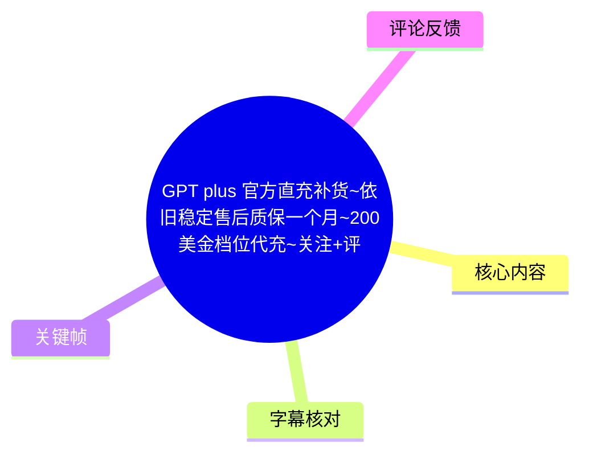
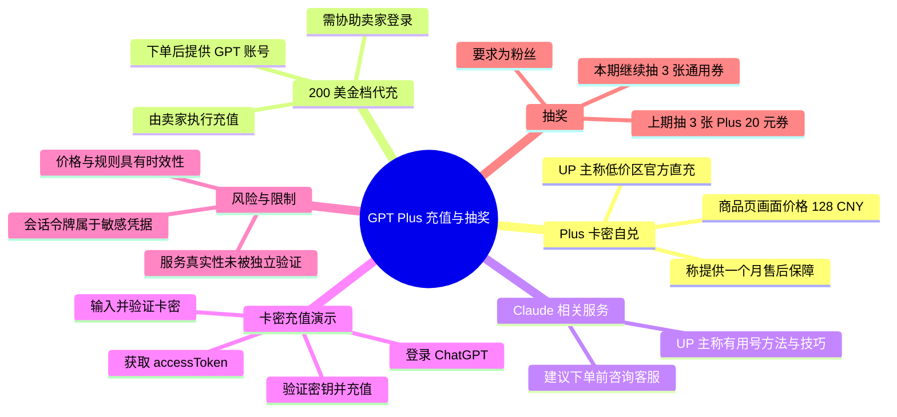
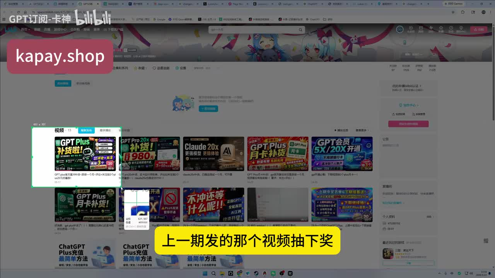
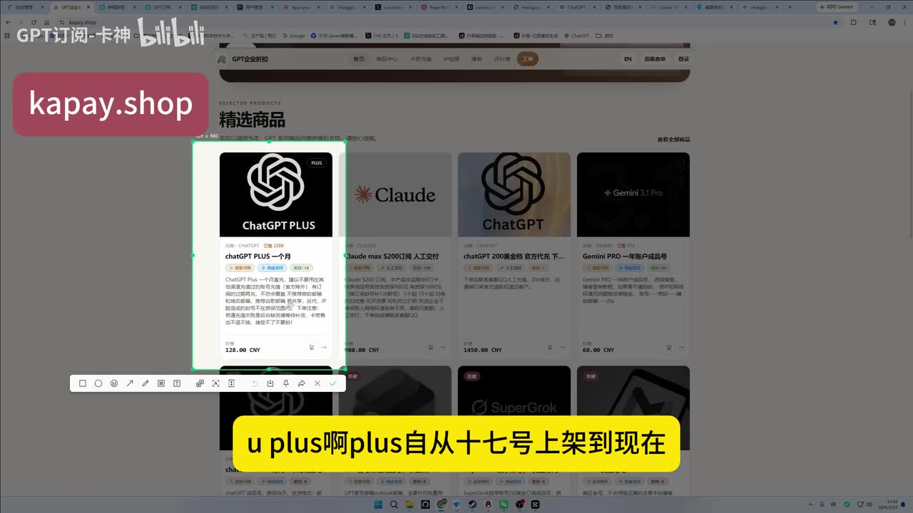
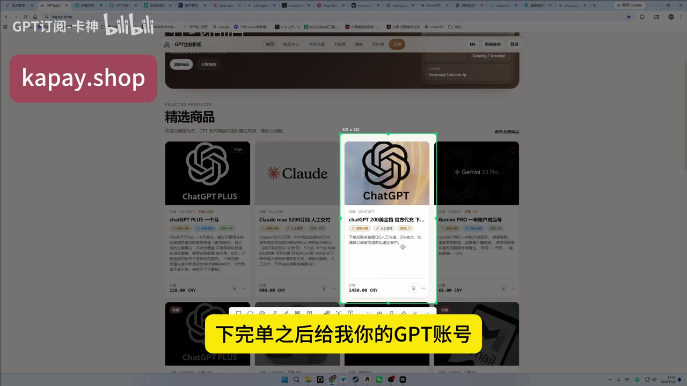
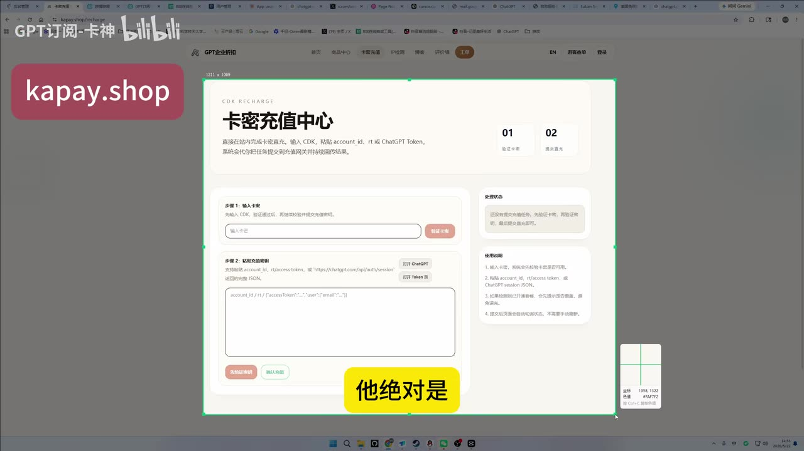

# GPT plus 官方直充补货、200 美金档位代充与抽奖说明

> 来源：[Bilibili 视频](https://www.bilibili.com/video/BV13WGb6YEAD) 
> UP 主：GPT订阅-卡神｜视频时长：04:05｜抓取时视频数据：3,842 播放、82 回复、55 收藏、25 点赞

## 小结

视频是 UP 主对其所售 ChatGPT Plus 充值服务、200 美金档位代充服务及抽奖活动的说明。其核心营销主张是：主页的 Plus「卡密自兑」商品为“低价区官方直充”、非“黑充”，并称可提供一个月售后/保障；这属于发布者单方陈述，视频内没有出示可独立验证的官方授权、支付链路或售后条款。

UP 主称该 Plus 商品自“17 号”上架以来已售出“大几百”，且运行“非常稳”。画面中的商品页可见 ChatGPT Plus 一个月价格为 **128.00 CNY**；但价格、库存、地域可用性、服务规则与保障承诺均可能随时变化，应以实际下单页及书面售后规则为准。

对于标为“200 美金档”的 ChatGPT 代充，视频说明的流程是下单后向卖家提供 GPT 账号并协助登录，由卖家执行充值。对于 Claude 相关商品，UP 主强调应在下单前咨询人工客服，因其称虽然“稳定”，但存在特定“用号方法/技巧”。这类流程涉及账户登录协助与账户凭据处理，存在账号控制权、隐私、会话令牌泄露及平台条款合规风险。

视频还演示了卡密充值页面：输入卡密并验证、登录 ChatGPT、获取并粘贴 `accessToken` 等账号会话信息、验证密钥后充值。**`accessToken`/会话令牌可等同于账号登录凭据**；不应将其提供给不受信任的网站、第三方或个人，也不建议把复制会话令牌作为常规充值手段。

结尾为上期抽奖：奖品是 3 个 Plus 20 元优惠券，抽奖要求为粉丝。视频中确认了一位获奖用户为 `ATRI`，另提及“幸运的新意”，但其余中奖昵称在 ASR 中不完整；视频简介列出的上期中奖名单为 `@atriiiiiiiiiiiii`、`@ncjtsrr`、`@幸运的新意哦`。本期继续以“关注+评论”抽 3 个 20 元通用优惠券。

## 思维导图

## 目录

- [背景、商品与活动范围](#背景商品与活动范围)
- [Plus 卡密自兑：UP 主的服务主张](#plus-卡密自兑up-主的服务主张)
- [200 美金档代充与 Claude 服务说明](#200-美金档代充与-claude-服务说明)
- [卡密充值演示与账号安全边界](#卡密充值演示与账号安全边界)
- [上期抽奖与本期参与方式](#上期抽奖与本期参与方式)
- [关键参数、限制与时效性](#关键参数限制与时效性)
- [字幕比对](#字幕比对)
- [评论分析](#评论分析)
- [处理记录](#处理记录)

## 背景、商品与活动范围 [00:02](https://www.bilibili.com/video/BV13WGb6YEAD?t=2)

视频开始时，UP 主表示本期有两个目的：

1. 为上一期视频抽取 3 个 Plus 20 元优惠券；
2. 介绍其主页中与 ChatGPT Plus、200 美金档代充及 Claude 相关的商品/服务。

UP 主称上期视频在“17 号”发布，距离当前视频已有“好多天”。此处“17 号”未包含月份和年份，不能仅凭口述推断为具体日历日期。

> 图：画面展示 UP 主的 Bilibili 主页及“上一期发的那个视频抽下奖”字幕，并标有 `kapay.shop`。该帧有助于确认视频开场确实将抽奖与其主页商品展示放在同一叙事中；域名仅为画面所示，不代表其安全性、合法性或与任何官方机构存在关系。

## Plus 卡密自兑：UP 主的服务主张 [00:27](https://www.bilibili.com/video/BV13WGb6YEAD?t=27)

### 商品状态与发布者口述 [00:27](https://www.bilibili.com/video/BV13WGb6YEAD?t=27)

UP 主称其 Plus 商品自“17 号”上架以来已卖出“大几百”，并将服务评价为“非常稳”。同时，他反复强调：

- 主页可通过“卡密自兑”方式充值；
- 该服务是“官方直充”；
- 使用“低价区”；
- 并非“黑充”；
- 可提供“保售后”保障。

这些内容均为视频口述中的业务声明，而不是视频材料已经证明的客观事实。视频未展示 OpenAI 官方授权文件、资金流来源、充值的官方订单凭证、不同地区的许可依据，亦未展示具体售后协议。因此，不能据此确认其“官方直充”“低价区”或售后保障的真实性与适用范围。

### 画面可见的商品信息 [00:27](https://www.bilibili.com/video/BV13WGb6YEAD?t=27)

> 图：商品页“精选商品”区域被框选的卡片显示“ChatGPT PLUS 一个月”，可见价格为 **128.00 CNY**。该帧能作为视频录制时页面展示价格的证据，但不等同于实时售价、最终支付价格或服务可用性保证。

视频标题中包含“售后质保一个月”，而口述仅概括为“可以给他保售后”。两者均没有交代以下关键条款：

- 一个“月”的起算时间；
- 保障涵盖的具体故障类型；
- 账号被限制、区域变动、平台策略改变时是否支持处理；
- 退款、补充、换号或重充的条件；
- 售后响应时限与争议处理方式。

因此，如确需购买，至少应在付款前取得可留存的具体条款，并避免仅依据标题或口头承诺判断保障范围。

## 200 美金档代充与 Claude 服务说明 [00:56](https://www.bilibili.com/video/BV13WGb6YEAD?t=56)

### 200 美金档 ChatGPT 代充流程 [00:56](https://www.bilibili.com/video/BV13WGb6YEAD?t=56)

UP 主介绍标为“200 美金档”的代充商品，称其同样是“官方代充”“低价区”。按其描述，流程为：

1. 用户下单；
2. 用户向 UP 主提供 GPT 账号；
3. 用户协助 UP 主登录；
4. UP 主登录后代为充值。

> 图：商品页中框选“chatGPT 200 美金档 官方优充下…”商品卡，视频字幕写有“下完单之后给我你的GPT账号”。它直接对应了代充流程需要账户协助登录这一环节，也提示此模式的主要安全边界在于账号访问权的交付。

该模式的风险不取决于 UP 主是否作出稳定性承诺，而在于操作本身需要第三方接触账号。应特别注意：

- 不向第三方发送密码、一次性验证码、恢复代码或完整会话信息；
- 若第三方要求远程控制设备、复制浏览器 Cookie、`accessToken`、`session` 内容，应视为高敏感操作；
- 账户可能保存聊天记录、已绑定的付款信息、邮箱信息及 API/订阅相关信息；
- 跨地区支付、低价区订阅或由他人登录操作，可能与服务平台地区、支付、账户使用规则不一致；
- 即使充值成功，也不代表后续订阅、账户或权益不会发生变化。

### Claude 服务的使用前置条件 [01:16](https://www.bilibili.com/video/BV13WGb6YEAD?t=76)

UP 主表示，Claude 相关商品在下单前“最好联系人工客服”，由其说明如何使用和注意事项；用户确认接受后再拍下。他称服务虽为“成品号”且“非常稳定”，但“有用号的一定方法”“有一定技巧”，可在下单后或下单前咨询。

这里能确定的是：发布者明确提示存在额外用号规则或技巧。不能确定的是这些规则具体为何、是否符合 Claude 官方服务条款、账号是否归用户完全控制、是否允许改密/绑定邮箱，以及发生限制时的处理机制。视频没有提供这些细节。

## 卡密充值演示与账号安全边界 [01:47](https://www.bilibili.com/video/BV13WGb6YEAD?t=107)

### 视频演示的操作顺序 [01:47](https://www.bilibili.com/video/BV13WGb6YEAD?t=107)

UP 主演示的页面标题为“卡密充值中心”。按视频口述及画面，其操作顺序如下：

1. 在首页置顶的 Plus 商品下单，获取卡密；
2. 在充值中心输入卡密；
3. 点击“验证卡密”；
4. 打开登录入口，在弹出的界面中登录 ChatGPT；
5. 登录后关闭登录界面；
6. 点击“打开 Token”；
7. 复制页面中显示的一组账号会话/密钥内容；
8. 将内容粘贴到充值中心输入区；
9. 点击“验证密钥”；
10. 点击“充值”，等待数秒。

> 图：画面显示“卡密充值中心”，包含“输入卡密”“验证卡密”、打开 ChatGPT、打开 Token 及大段账号信息输入区域。它解释了为什么视频操作不只是兑换卡密，还要求粘贴账户相关会话数据。

### 关于 Token 的安全说明 [02:29](https://www.bilibili.com/video/BV13WGb6YEAD?t=149)

ASR 将该字段识别为 `Token`，UP 主口述称其为“你账号的密钥”。关键帧中的说明文字可辨识到 `account_id`、`accessToken`、`session`、JSON 等字样。这意味着该流程会处理可用于访问账户会话的数据。

**不建议照搬“导出并粘贴 Token”的步骤。**原因是：

- `accessToken`、Session Token、Cookie 与授权 JSON 都可能用于以当前用户身份访问账户；
- 这类内容泄露后，攻击者可能绕过常规密码输入直接接管会话；
- 视频未展示数据在网站端如何存储、传输、删除、审计或隔离；
- 即使服务完成，令牌是否被留存、是否可撤销、是否会失效，视频均未说明。

若已经在第三方页面提交过会话令牌，应优先在官方账户侧退出其他会话、更新密码、检查绑定邮箱与订阅状态，并仅通过官方帮助渠道核实账户情况。视频没有展示任何官方的令牌授权机制，因此不能把这一做法视为官方推荐流程。

## 上期抽奖与本期参与方式 [03:02](https://www.bilibili.com/video/BV13WGb6YEAD?t=182)

### 上期抽奖结果 [03:08](https://www.bilibili.com/video/BV13WGb6YEAD?t=188)

UP 主称使用“初音社”博主提供的抽奖工具，且抽取资格要求为粉丝。视频中可确认：

- 首位中奖者口述/字幕为 `ATRI`；
- 后续抽奖过程语音不完整，只能辨识到“幸运的新意”；
- UP 主称共抽出 3 位中奖者；
- 视频简介列出完整名单：`@atriiiiiiiiiiiii`、`@ncjtsrr`、`@幸运的新意哦`。

对用户名的处理以视频简介为准，因为 ASR 对昵称识别不稳定，尤其没有完整记录第二位获奖者。

UP 主称会在本期/下期视频中艾特中奖者，并通过后台私信，获奖者可联系领取。视频未说明优惠券的有效期、使用门槛、适用商品范围及是否可叠加。

### 本期活动 [03:53](https://www.bilibili.com/video/BV13WGb6YEAD?t=233)

视频结尾要求观众“评论加关注”，并称本期继续抽 3 个优惠券；视频简介明确为“3 个 20 元通用优惠券”。活动资格、开奖时间、获奖通知方式、优惠券有效期与争议规则均未在视频中完整说明，参与前应查看视频评论区或向发布者索取最新规则。

## 关键参数、限制与时效性 [00:27](https://www.bilibili.com/video/BV13WGb6YEAD?t=27)

| 项目 | 视频中出现的信息 | 需要注意的限制 |
| --- | --- | --- |
| 视频时长 | 245 秒，实际音频识别至 04:03 左右 | 片尾存在少量无语音画面/间隔。 |
| Plus 商品 | 商品卡显示“ChatGPT PLUS 一个月”、128.00 CNY | 仅代表录制画面；不是报价承诺。 |
| 服务主张 | UP 主称低价区官方直充、非黑充、稳定、可售后 | 未提供独立验证材料或完整售后条款。 |
| 200 美金档 | 标题及口述称为 200 美金档代充 | 未说明具体货币结算、到账权益、适用账户或地区规则。 |
| 账号协助登录 | 代充需给 GPT 账号并协助登录 | 会带来账户访问、隐私和控制权风险。 |
| Token 流程 | 页面/口述涉及 `accessToken`、账户会话信息 | 属于敏感凭据，不宜提交给第三方。 |
| Claude 商品 | 下单前需咨询，发布者称有使用技巧 | 规则未披露，合规性与持续可用性无法从视频确认。 |
| 售后期限 | 标题称“质保一个月” | 起止、范围、例外、退款与处理时限均未说明。 |
| 抽奖 | 上期 3 张 Plus 20 元券；本期 3 张 20 元通用券 | 规则与兑奖期限未完整披露。 |

本视频属于商业推广及操作演示，具有明显时效性。抓取数据时间为 2026-07-16，但视频元数据中的价格、库存、服务流程、站点页面、抽奖状态及平台规则均可能已发生变化。尤其是涉及“低价区”、跨区订阅、第三方代充和账号会话信息的事项，不能用视频发布者的稳定性表述替代官方规则、账户安全检查或风险判断。

## 字幕比对

| 字幕来源 | 完整性 | 专有名词 | 时间轴 | 主要问题 |
| --- | --- | --- | --- | --- |
| Bilibili 站内字幕 | 未提供可用字幕，无法比对正文 | 无 | 无 | 素材明确标注“未提供可用站内字幕”。 |
| 本次 ASR 字幕 | 较完整：19 段，语音覆盖约 205.6 秒，占视频约 84.15% | 存在明显误识别 | 完整保留 SRT 起止时间，可直接用于本笔记时间轴 | “Cloud”应结合商品画面理解为 Claude；“200米金”应为“200美金”；“验证密石/秘钥”应为“验证密钥”；部分获奖昵称缺失。 |

最终采用**本次 ASR 的时间轴**作为章节定位基础，并以关键帧与视频简介对重要信息进行谨慎校正：

- ASR 的“Cloud”按画面商品名称和上下文统一记为 **Claude**，但不扩展其具体套餐或权益；
- “200米金档”校正为 **200 美金档**；
- “Token 码”保留为视频口述概念，并结合画面中 `accessToken`、`session` 等字段说明其属于会话/授权数据；
- 获奖人昵称以视频简介中的三位 `@atriiiiiiiiiiiii`、`@ncjtsrr`、`@幸运的新意哦` 为准；
- 本次 ASR 诊断未标记 `noAudioStream=true`，且识别语言为中文、置信度约 0.993，说明源视频存在可识别音轨，并非无音轨素材。

## 评论分析

仅获取到 2 条热评，未达到“前三条”的数量；以下只分析可获取内容，不将评论视为已验证事实。

1. **朝暮Nii**（2 赞）：“一百多有理由支持土区了”  
   - 观点：评论者将“一百多”的价格与“土区”联系起来，并表达支持倾向。  
   - 补充价值：从侧面反映观众关注价格和地区因素。  
   - 可信度边界：这只是用户的主观态度；“土区”是否为实际服务区域、是否符合平台规则、商品是否长期可用，均不能由该评论证实。

2. **Zane__H**（2 赞）：“拖着没给售后的加我维权”  
   - 观点：评论者声称存在售后未及时处理的情况，并邀请他人共同维权。  
   - 补充价值：与视频中“售后”“质保一个月”的营销表述形成潜在张力，提示购买者应重视书面售后条件和证据留存。  
   - 可信度边界：评论未提供订单、沟通记录、发生时间或处理结果，无法单独证实具体纠纷事实；但它构成应进一步核实售后机制的风险信号。

## 处理记录

- Worker ID：`worker-mrj0wjed-b0c290ad`
- 模型：`gpt-5.6-terra`
- 使用素材与工具结果：已使用视频元数据、ASR 诊断与 SRT 时间轴、12 张关键帧清单、可获取热评 JSON；未提供可用 Bilibili 站内字幕。
- 字幕选择：采用本次 ASR SRT 为主。其具有真实起止时间，章节链接均依据对应 ASR 段落起始秒数生成；对 Claude、200 美金、验证密钥及获奖昵称进行了基于画面/简介的有限校正。
- 关键帧选择依据：选用 `frame-001` 说明开场抽奖与主页展示，`frame-002` 记录 Plus 商品卡及画面价格，`frame-003` 说明卡密充值中心与会话数据输入风险，`frame-004` 对应 200 美金档代充和账号协助登录环节。未使用无法从提供画面中可靠判读的其他帧。
- 缓存清理：本任务提供的素材中未附带缓存清理执行日志；无法据此声称已执行清理。
- 未解决问题：无法独立验证“官方直充”“低价区”“非黑充”“稳定”“一个月质保”等业务主张；无法确认实时价格、库存、地区适用性、售后规则、抽奖时效或第三方站点对令牌数据的处理方式。
