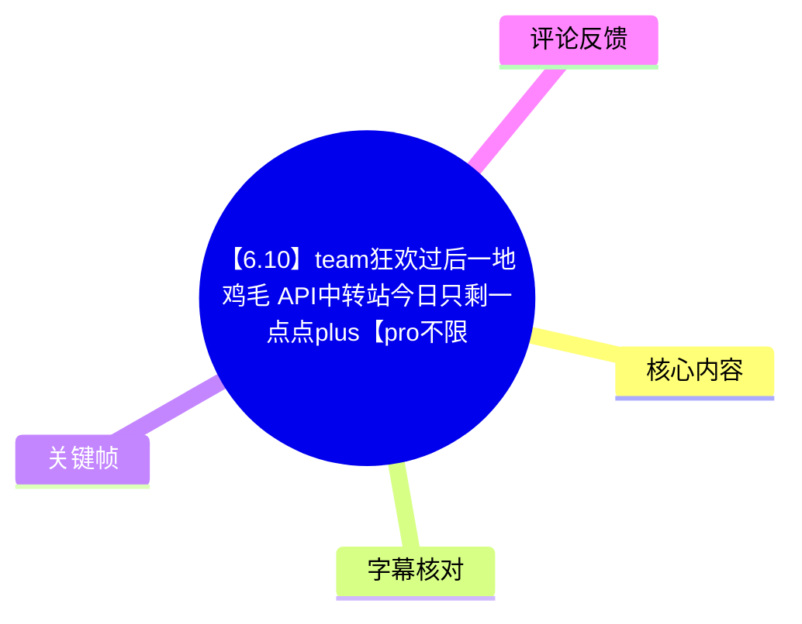
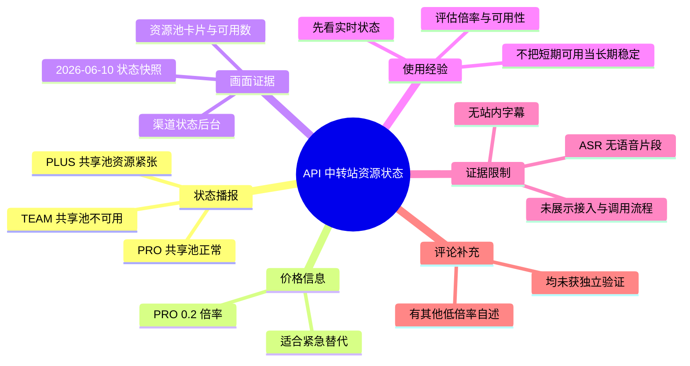
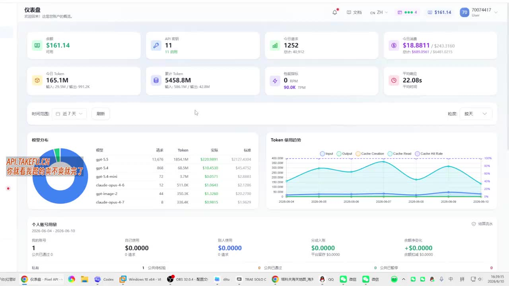
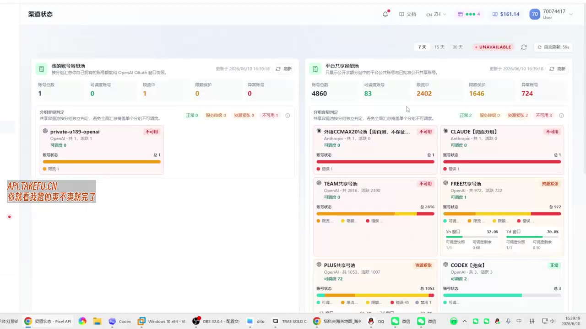
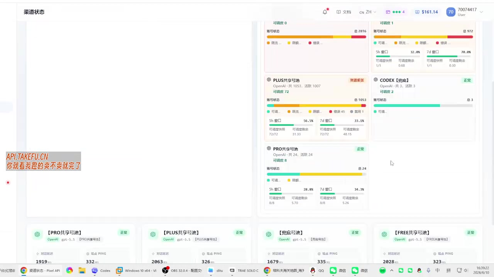

# 【6.10】team狂欢过后一地鸡毛 API中转站今日只剩一点点plus【pro不限量】就是价格贵0.2倍率

> 来源：[Bilibili 视频](https://www.bilibili.com/video/BV1FnE96PEoo)  
> UP 主：生于忧患死于忧患｜时长：43 秒｜标签：`api`、`中转站`  
> 视频简介给出的站点为：`API.TAKEFU.CN`

## 小结

这是一则面向 API 中转站用户的短时状态播报。视频标题、简介与后台画面共同表达的核心信息是：此前被称为 “TEAM” 的共享资源池在短期高负载后已不可用；`PLUS` 资源仅剩少量；`PRO` 资源仍处于可用状态，但计费倍率为 **0.2 倍**，相较于 UP 主暗示的低价预期更贵。

视频的主要证据是中转站管理后台的“渠道状态”页，而不是接口调用演示或官方公告。画面中，`TEAM共享池` 标为“不可用”，`PLUS共享池` 标为“资源紧张”，`PRO共享池` 标为“正常”。因此，视频的价值在于提供某一时点的资源池健康度快照，不能据此推导长期稳定性、实际吞吐能力或所有用户的可用性。

对急需继续调用服务的既有用户，视频给出的实际建议是优先使用 `PRO` 作为临时替代方案；但该建议以更高的 **0.2 倍率** 为代价。视频没有展示注册、购买、创建 Key、配置 Base URL、模型调用或退款等操作，不能补全为具体接入教程。

时效性极强。后台画面可见更新时间为 **2026/06/10 16:39:18** 左右，且资源池状态会随账号池、限额、并发、供应上游与站点策略快速变化。标题中的“今日”、简介中的“暂时”都说明这不是长期承诺。

本次 ASR 未识别出任何语音片段，且没有站内字幕可用；因此本文以标题、简介、带时间信息的后台关键帧及可获取评论为主要依据。ASR 诊断未标记 `noAudioStream=true`，不能断言视频没有音轨，只能如实记录为“本次未识别到有效语音”。

## 思维导图

## 目录

- [背景与信息时效](#背景与信息时效)
- [后台状态：TEAM、PLUS 与 PRO](#后台状态teamplus-与-pro)
- [价格、容量与紧急替代建议](#价格容量与紧急替代建议)
- [可迁移的判读步骤与使用限制](#可迁移的判读步骤与使用限制)
- [关键帧索引](#关键帧索引)
- [字幕比对](#字幕比对)
- [评论分析](#评论分析)
- [处理记录](#处理记录)

## 背景与信息时效 [00:00](https://www.bilibili.com/video/BV1FnE96PEoo?t=0)

视频讨论的是一个 API 中转站在特定时点的共享资源池状态。标题将背景概括为“team 狂欢过后一地鸡毛”，这是 UP 主的评价性表述；能够由后台画面直接支持的事实是，`TEAM共享池` 当时显示为“不可用”。

简介进一步说明：

- 站点：`API.TAKEFU.CN`；
- `PLUS` “暂时号没剩几个”；
- `PRO` “还坚挺”，但“价格贵了些，0.2倍率”；
- 对着急的用户，可先用 `PRO` 应急。

这里的“PLUS”“PRO”“TEAM”是该站后台中的资源池名称或套餐/渠道分类。视频没有给出这些名称与上游官方产品、账户类型或计费规则之间的完整对应关系，因此不应把它们直接等同于任何官方服务层级。

> 图：关键帧展示“仪表盘”页，包括可用余额、API 密钥、今日请求、Token 使用趋势和模型分布等汇总面板。它的价值在于确认视频确实展示了一个中转站后台，而非仅以文字宣称资源状态；但这些汇总数值并不能单独证明某个资源池对所有用户可用。

画面右下角系统日期显示为 **2026/06/10**，渠道页面顶部可见“更新于 2026/06/10 16:39:18”附近的时间文本。故本文将它视为 2026 年 6 月 10 日下午的一次后台快照，而非当前实时状态。

## 后台状态：TEAM、PLUS 与 PRO [00:00](https://www.bilibili.com/video/BV1FnE96PEoo?t=0)

### TEAM 共享池：画面标记为不可用

渠道状态页中，`TEAM共享池` 卡片的状态标签为红色“不可用”。卡片下方可见 OpenAI 相关账户统计，画面显示总量约 **2816**、活跃约 **2390**，但“可用量”为 **0**。

这解释了标题中“team……一地鸡毛”的直接画面依据：即使资源池中仍存在账户总数或活跃数，当前可供使用的资源数仍可能为零。也就是说，账户数量、活跃数量与用户侧可调用性不是同一个指标。

> 图：该帧同时展示 TEAM共享池“不可用”、PLUS共享池“资源紧张”、FREE共享池“资源紧张”等状态。它是判断资源分层状态差异的核心证据，避免仅依据标题将所有资源池概括为完全失效。

### PLUS 共享池：资源紧张，而非稳定充足

`PLUS共享池` 在画面中标为橙色“资源紧张”。可见统计包括总量约 **1053**、活跃约 **1007**、可用量 **72**；状态条中也显示了可用、限流、错误等不同颜色的区间。下方可见 5 小时与 7 天窗口统计，说明后台至少尝试以短期窗口追踪可用性与剩余量。

需要注意两点：

1. 视频简介中的“只剩一点点 plus”“暂时号没剩几个”与画面的“资源紧张”相互印证，但不等于 `PLUS` 完全不可用。
2. “可用 72”是画面时点的后台计数；视频没有说明该数量对应账号、渠道、并发槽位还是其他内部对象，也没有提供用户实际调用成功率，不能过度解释其容量含义。

> 图：该帧聚焦 PLUS共享池和 PRO共享池。PLUS 显示“资源紧张”，而 PRO 显示“正常”，有助于理解视频为何建议在紧急情况下从 PLUS 转向 PRO。

### PRO 共享池：状态正常，但规模与价格需分开看

`PRO共享池` 在画面中显示绿色“正常”。卡片可见 OpenAI 相关统计，约为总量 **24**、活跃 **24**、可用量 **8**。这与 UP 主“PRO 倒是还坚挺”的说法一致，但“正常”只是在该后台状态模型下的标记，并不代表无限容量或无任何限流。

画面下方还出现多个渠道的延迟指标。例如 `PRO共享池` 卡片可见对话延迟约 **1919 ms**、PING 约 **332 ms**；`PLUS共享池` 卡片可见对话延迟约 **2063 ms**、PING 约 **326 ms**。这些仅为该时刻的后台监测读数，视频没有说明采样次数、测试模型、请求长度、地域与网络条件，不能据此比较长期性能优劣。

## 价格、容量与紧急替代建议 [00:00](https://www.bilibili.com/video/BV1FnE96PEoo?t=0)

视频中最明确的价格参数是：

| 项目 | 视频给出的信息 | 证据来源 | 可得出的结论 |
| --- | --- | --- | --- |
| PLUS | 暂时仅剩少量 | 标题、简介、后台“资源紧张” | 可用性偏紧，不能视为稳定供给 |
| PRO | 不限量/“还坚挺” | 标题、简介、后台“正常” | 可作为视频所述时点的替代选项 |
| PRO 价格 | **0.2 倍率** | 标题、简介 | 使用成本高于 UP 主所期待的低倍率方案 |
| TEAM | 不可用 | 后台关键帧 | 不适合作为当时的可调用渠道 |

“`PRO不限量`”出现在标题中，但后台画面没有展示“不限量”的具体限额定义、限速、并发上限、日限额、模型范围或公平使用政策。更严谨的理解应是：UP 主将 PRO 描述为可持续使用的选项；它不构成对任何维度“无限”的可验证保证。

视频给出的应急路径可以还原为：

1. **确认 TEAM 是否仍可用**：在画面时点，答案是否定的，后台显示“不可用”。
2. **检查 PLUS 状态与余量**：其状态为“资源紧张”，不宜依赖为唯一渠道。
3. **若任务有即时性，转向 PRO**：这是 UP 主明确提出的临时建议。
4. **接受成本上升**：PRO 的已知参数为 **0.2 倍率**。
5. **在实际调用前复查状态**：资源池状态是短时快照，视频没有替代实时检测。

上述第 1—4 步来自视频陈述与画面；第 5 步是基于资源紧张、状态可变这一事实给出的审慎使用建议，并非视频展示的操作界面流程。

## 可迁移的判读步骤与使用限制 [00:00](https://www.bilibili.com/video/BV1FnE96PEoo?t=0)

### 资源状态判读经验

对于此类中转站状态播报，可按以下顺序判断，而不是只看套餐名称或宣传词：

1. **先区分状态标签**：例如“正常”“资源紧张”“不可用”反映的是不同层级的风险。视频中 PRO、PLUS、TEAM 分别对应这三种差异。
2. **再看可用数而不是总数**：TEAM 画面中的总量、活跃量并不低，但可用数为 0；这说明“池子大”不能替代“现在能用”。
3. **将成本与可用性一起比较**：PRO 能作为替代，不等于它是低成本方案；已知倍率为 0.2。
4. **单独核验实际调用能力**：后台状态、延迟和用户调用成功率并非同一指标。视频未提供请求日志、成功率或错误码分布。
5. **保留备选路径**：当某一共享池进入“资源紧张”时，不应将关键任务完全依赖于其单一渠道。这是从视频状态差异可迁移出的风险控制原则。

### 视频未提供的操作与参数

以下内容在素材中均未出现，不能编造：

- 注册、登录或购买流程；
- API Base URL、认证 Header、API Key 创建步骤；
- 支持的完整模型列表和各模型倍率；
- `PRO不限量` 的限额、限速、并发和公平使用边界；
- `PLUS`、`TEAM`、`PRO` 的完整账户来源与调度机制；
- 真实调用请求、响应示例、错误码或重试策略；
- 退款、售后、隐私与数据留存政策；
- 站点运营方对状态变化的官方说明。

### 风险与合规边界

视频展示的是第三方中转站后台。无论资源池名称是否带有某些模型或厂商名称，均不应据此推定其与对应厂商存在官方授权关系。用户若考虑接入，需自行核实服务主体、数据处理方式、账号来源、模型使用条款、所在地区法律要求及原始服务商政策。

尤其是标题中的“狂欢”“一地鸡毛”带有强烈情绪色彩，适合用作风险提醒，不适合替代技术验收。对于生产任务，应以自身账号下的实时可用性、调用成功率、延迟、成本账单及服务条款为准。

## 关键帧索引 [00:00](https://www.bilibili.com/video/BV1FnE96PEoo?t=0)

| 关键帧 | 正文用途 | 可见信息 | 选取价值 |
| --- | --- | --- | --- |
| [frame-001](frames/frame-001.jpg) | 背景与站点后台性质 | 仪表盘、模型分布、Token 趋势、汇总指标 | 证明视频主体为后台录屏，并提供状态发生的系统环境 |
| [frame-002](frames/frame-002.jpg) | TEAM/PLUS 状态对比 | TEAM“不可用”、PLUS“资源紧张”、FREE“资源紧张” | 是标题所称 TEAM 问题与 PLUS 稀缺的直接视觉依据 |
| [frame-003](frames/frame-003.jpg) | PLUS 与 PRO 的分层比较 | PLUS“资源紧张”、PRO“正常”、延迟与可用数区域 | 支撑“PRO 可临时替代但与 PLUS 状态不同”的结论 |
| [frame-004](frames/frame-004.jpg) | 复核渠道状态 | TEAM、PLUS、PRO 状态卡片 | 用于交叉确认同一状态页中的分层结果，而不依赖单张画面 |

> 关键帧路径均为相对路径。素材没有提供每张关键帧的独立采样时间戳；因此，正文只使用视频起点 `00:00` 作为可确认的时间轴锚点，不伪造帧级出现时间。

## 字幕比对 [00:00](https://www.bilibili.com/video/BV1FnE96PEoo?t=0)

| 字幕来源 | 完整性 | 专有名词 | 时间轴 | 主要问题 |
| --- | --- | --- | --- | --- |
| Bilibili 站内字幕 | 未提供可用字幕 | 无法核验 | 无 | 素材中没有站内 SRT 或可用字幕段落 |
| 本次 ASR 字幕 | 空，0 个语音分段 | 无法识别 | ASR 输出虽支持时间戳，但没有任何段落 | 语言自动判断为 `en`，置信度约 0.541；诊断提示未识别到语音 |

本次 ASR 使用模型为 `medium`，音频时长诊断为 **42.368 秒**，但 `sentenceCount=0`、`speechSeconds=0`、`speechCoverage=0`。诊断信息是“未识别到语音片段，建议检查可听语音或正确音轨”。

需要特别区分：素材的 ASR 结果**没有** `noAudioStream=true` 标记。因此不能说源视频“没有音轨”，也不能将其表述为工具失败；准确表述应为：**本次 ASR 未识别到有效语音内容，站内字幕也不可用。**

最终文本依据的优先级为：

1. 视频标题与简介中的明确文字；
2. 关键帧中可辨识的后台标签、状态和数值；
3. 元数据与热评；
4. 对画面可直接观察到的内容进行保守描述。

经关键帧校正并采用的关键名称为：`API.TAKEFU.CN`、`TEAM共享池`、`PLUS共享池`、`PRO共享池`、`FREE共享池`、`CODEX【兜底】`。其中 `PLUS`、`PRO`、`TEAM` 的业务含义未由字幕或视频旁白解释，本文仅按画面名称记录。

## 评论分析 [00:00](https://www.bilibili.com/video/BV1FnE96PEoo?t=0)

仅获取到热评前三条，均为评论者自述或推广性信息，未经过独立验证，不能作为站点价格、稳定性或服务质量的事实依据。

1. **稳定0点02倍率gpt中转**  
   - 评论内容：称“依旧 0.1 倍率，月卡 80 不限额”。  
   - 补充价值：反映有用户将视频中的 0.2 倍率 PRO 与其他自称低倍率服务进行对比。  
   - 可信度与风险：评论未给出可验证的服务条款、模型范围、限速规则或稳定性数据；“不限额”定义不明，且带有明显导流性质。

2. **晅弌Xanthichi**  
   - 评论内容：称“0.1 的 plus 依旧稳定”，并引导查看主页视频中的群号。  
   - 补充价值：说明评论区存在与视频“PLUS 资源紧张”不同的个体体验或其他服务来源。  
   - 可信度与风险：该说法没有说明是否为同一站点、同一时间窗口、同一模型或同一套餐，不能据此反驳视频后台快照；同样具有推广导向。

3. **君临天下大秦**  
   - 评论内容：称“0.08 倍率，已经稳定两个月”。  
   - 补充价值：提供了更低倍率和“稳定两个月”的个人陈述。  
   - 可信度与风险：没有提供证据、服务名、使用量、失败率或测试条件；“稳定”是主观评价，且可能不适用于其他用户和负载环境。

综合来看，前三条评论共同强调更低倍率的替代渠道，但没有一条提供可复现的技术指标。它们可作为“市场上存在低价自述”的线索，不能替代对实际服务、合规性与可用性的独立核验。

## 处理记录 [00:00](https://www.bilibili.com/video/BV1FnE96PEoo?t=0)

- **Worker ID**：`worker-mrj0wbly-5dc4e50c`
- **整理模型**：`gpt-5.6-terra`
- **ASR 模型**：`medium`（CUDA、`float16`、自动语言识别）
- **使用的素材与工具产物**：视频元数据、封面信息、音频文件、ASR 诊断与空转写结果、`frames/` 关键帧、热评 JSON、视频简介。
- **字幕选择**：未提供可用站内字幕；本次 ASR 输出为空且无分段。最终不采用任何转写文本，而采用标题、简介和关键帧多模态信息进行保守整理。
- **时间轴依据**：ASR 没有可用起止分段，站内 SRT 缺失，关键帧也未提供逐帧采样时间；故只使用视频开始时刻 `00:00` 作为已知且不臆测的章节时间锚点。
- **关键帧选择依据**：选择 `frame-001` 证明后台场景，选择 `frame-002` 与 `frame-003` 提取 TEAM/PLUS/PRO 状态差异，选择 `frame-004` 用于复核同页状态；未将未能清晰辨认的字段写成确定事实。
- **缓存清理**：素材未提供缓存清理日志，无法确认是否执行过清理；本文不虚构清理结果。
- **未解决问题**：无法确认视频是否含有可听但未被识别的语音；无法确认资源站在视频发布后是否已变更；无法从现有素材验证 0.2 倍率的详细计费规则、“不限量”的边界及各资源池的真实调用成功率。

## 评论分析

- 热评 1：可以来我这，依旧0.1倍率，月卡80不限额
- 热评 2：0.1的plus依旧稳定[doge] 主页新视频有群号[doge]
- 热评 3：我0.08倍率，已经稳定两个月了

以上内容是观众反馈摘录，只用于补充理解视频反响，不作为正文事实依据。
