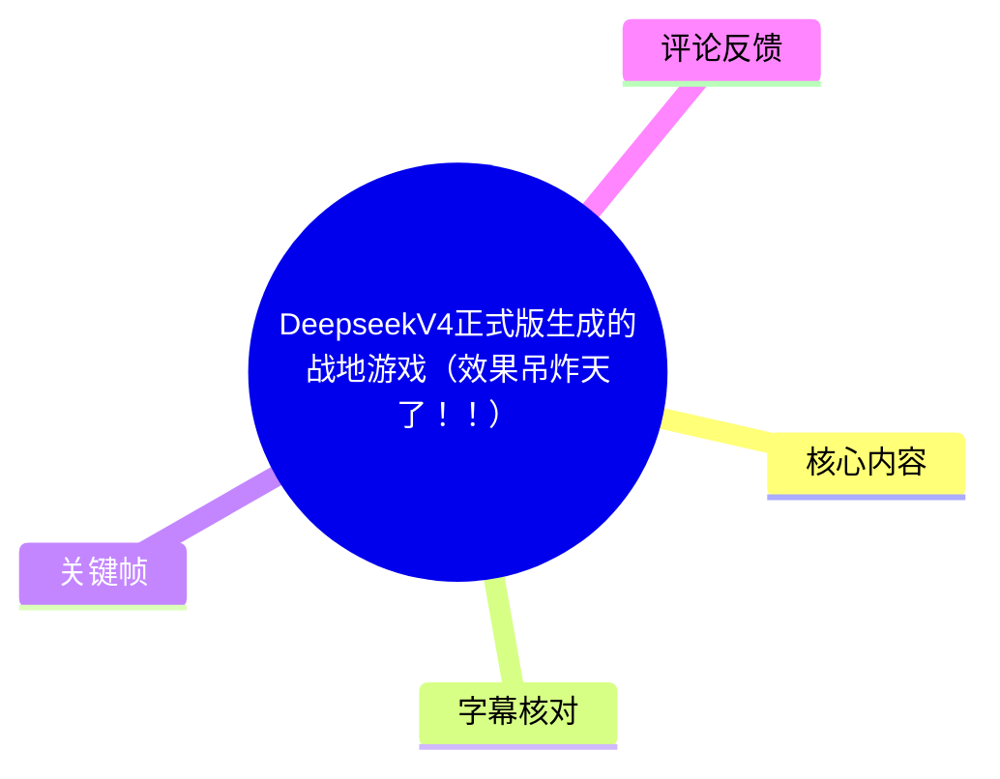
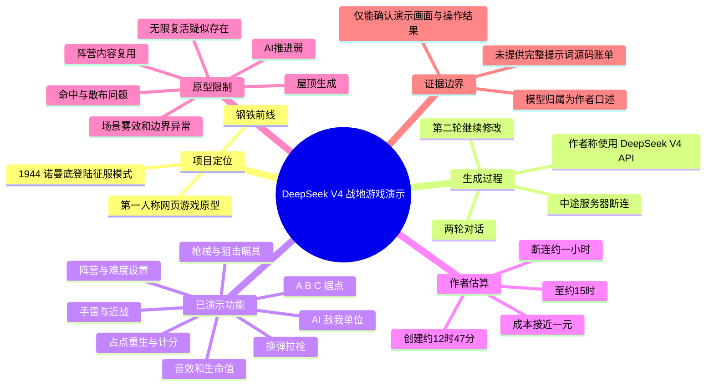
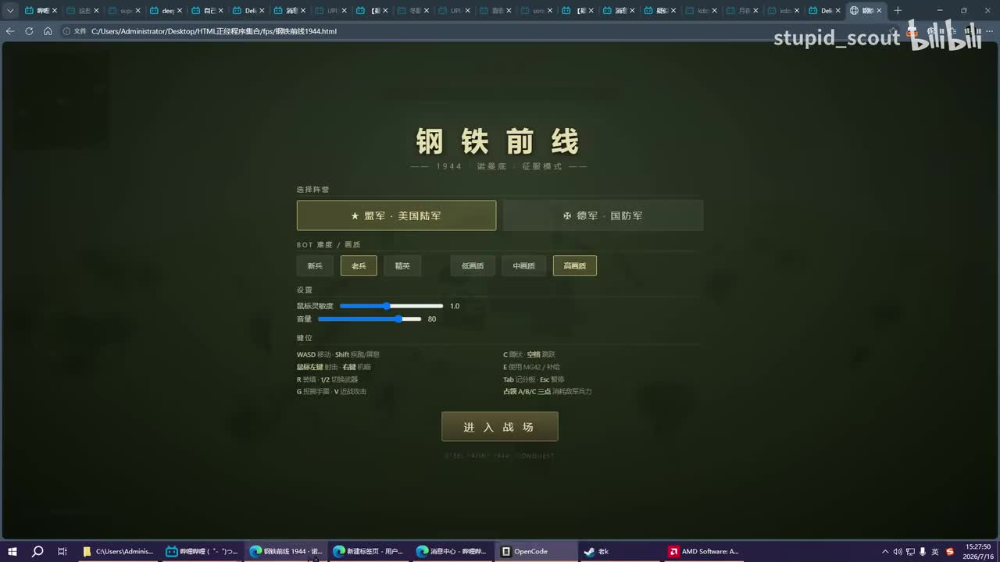
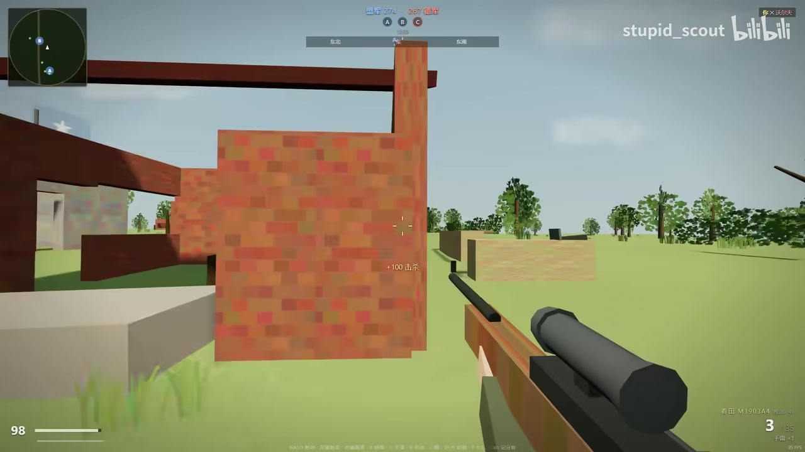
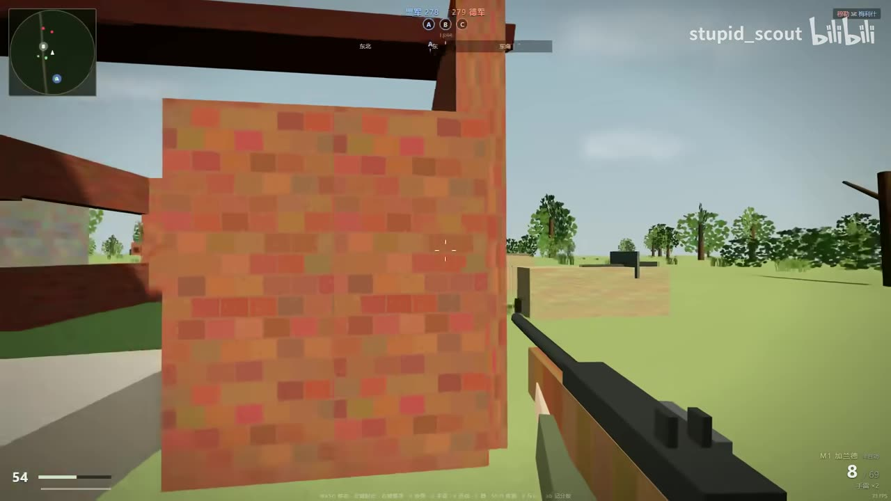
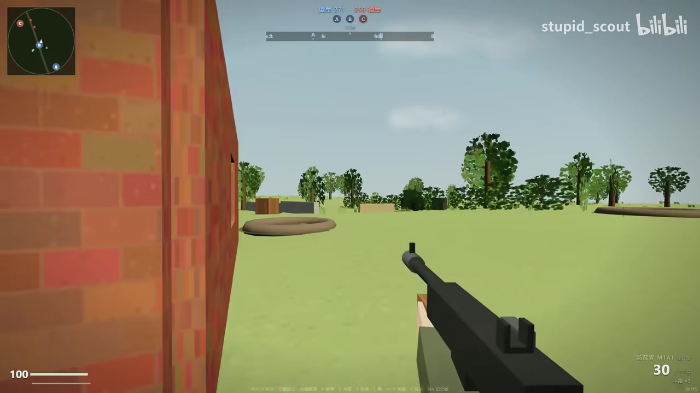

# DeepseekV4正式版生成的战地游戏（效果吊炸天了！！）

> 来源：[Bilibili 视频](https://www.bilibili.com/video/BV1hPKV6zERi)  
> UP 主：stupid_scout｜合集：AIcode｜视频时长：14:04｜画面规格：1920×1080  
> 元数据发布时间：2026-07-16（按抓取元数据记录）

## 小结

视频展示了 UP 主声称由 **DeepSeek V4 正式版 API** 生成、并经两轮对话修改的第一人称“战地”风格网页游戏。演示中的游戏标题为“钢铁前线”，背景标注为“1944 诺曼底登陆征服模式”，可选择盟军/美军与德军阵营，并进入含 A、B、C 据点的战场。

从演示可确认，这个原型已具备较完整的可玩循环：第一人称移动与射击、武器切换、狙击枪瞄具、换弹与拉栓动画、手雷、近战刀、生命值与自动回血、据点重生、AI 队友/敌人、占点和阵营计分、弹着/空枪声音等。UP 主尤其将其与此前“预览版”的生成结果比较，认为正式版完成度明显提高。

视频也同时暴露出原型限制：枪械命中可能不稳定或散布过大、敌人会生成至屋顶、部分角色手臂方向异常、AI 队友推进能力不足、敌方似乎无限复活、场景边界/雾效表现怪异；阵营内容存在复用，德军部分枪械和职业仅是换皮或没有改动。它是可演示的生成式编码结果，而不是经过完整平衡、性能和可靠性验证的成品游戏。

所谓“DeepSeek V4 生成”的归因，主要来自 UP 主口述；视频中虽提到 API、对话轮次、创建时间和约“接近一块钱”的成本，但提供的素材没有可独立复核的完整提示词、源码、API 调用记录、账单或可访问在线版本。因此应将模型归属、成本和耗时均视为**作者陈述**，不能据此推导模型的普遍能力或稳定产出水平。

本视频适合关注 AI 编程、浏览器游戏原型、提示词迭代和生成式开发边界的读者。内容具有明显时效性：模型版本、API 可用性与价格可能随时变化；视频展示的是一次个案，不能替代对代码安全、素材版权、浏览器兼容性、性能、多人同步和玩法平衡的测试。

## 思维导图

## 目录

- [项目背景与证据边界](#项目背景与证据边界)
- [生成过程：两轮对话与断连续作](#生成过程两轮对话与断连续作)
- [游戏入口与可配置参数](#游戏入口与可配置参数)
- [战场玩法与已演示功能](#战场玩法与已演示功能)
- [战斗表现、AI 与玩法限制](#战斗表现ai-与玩法限制)
- [阵营、画质与场景细节检查](#阵营画质与场景细节检查)
- [成本、耗时与可复用经验](#成本耗时与可复用经验)
- [结论、限制与时效性](#结论限制与时效性)
- [字幕比对](#字幕比对)
- [评论分析](#评论分析)
- [处理记录](#处理记录)

## 项目背景与证据边界 [00:01](https://www.bilibili.com/video/BV1hPKV6zERi?t=1)

视频标题把作品表述为“DeepseekV4正式版生成的战地游戏”。根据本次 ASR 的开场内容，UP 主表示自己让 “DeepSeek V4 正式版”在网页端制作了一个“战地”游戏；后续多次强调是通过 API 完成。

这里需要区分三层事实：

1. **可由视频画面和演示确认的事实**：存在一个本地浏览器中运行的第一人称战场游戏原型，且视频实际展示了菜单、战场、武器、角色和交互反馈。
2. **UP 主的口述陈述**：该原型由 DeepSeek V4 正式版生成，使用了两轮对话，成本接近一元，过程发生过多次服务器断连。
3. **无法由当前素材验证的内容**：完整提示词、每轮模型输出、人工修改比例、实际模型版本、API 计费明细、源代码完整性与是否可复现。

因此，本视频最有价值的不是证明某一模型“必然能一次性产出完整 FPS”，而是展示一个 AI 协助生成的网页游戏原型在单次演示中的功能覆盖范围与明显缺陷。

## 生成过程：两轮对话与断连续作 [00:13](https://www.bilibili.com/video/BV1hPKV6zERi?t=13)

UP 主在 [00:13](https://www.bilibili.com/video/BV1hPKV6zERi?t=13) 至 [00:42](https://www.bilibili.com/video/BV1hPKV6zERi?t=42) 说明：

- 项目使用了**两轮对话**；
- 第一轮之后，服务端曾发生断连；
- 他在恢复后继续对话，形成第二轮；
- 第二轮进行了“一些东西”的修改，随后展示成品。

这是一种典型的生成式编码迭代模式：先让模型搭建可运行骨架，再基于实际运行效果提出修复或扩展要求。视频没有公开两轮对话的原文，因而无法整理出具体提示词、代码改动或修复清单；但从后续的试玩范围看，第二轮结果至少覆盖了战场 UI、角色、武器、据点、AI 和部分音效等多个模块。

UP 主在 [00:44](https://www.bilibili.com/video/BV1hPKV6zERi?t=44) 将正式版与此前预览版对比，主观评价为“天神下凡”。该评价反映其对完成度跃升的感受，不等同于严格基准测试结论。

## 游戏入口与可配置参数 [01:08](https://www.bilibili.com/video/BV1hPKV6zERi?t=68)

试玩前，UP 主在 [01:08](https://www.bilibili.com/video/BV1hPKV6zERi?t=68) 表示“前往前线”；在 [01:11](https://www.bilibili.com/video/BV1hPKV6zERi?t=71) 表示难度只能开到“新兵”，否则“根本活不下去”。这说明难度对战斗存活有实际影响，或至少被设计为影响 BOT 压力。

> 图：该关键帧直接证明游戏并非只展示单一战斗画面，而是具有可进入的设置入口。画面中可见标题“钢铁前线”、1944 诺曼底主题、盟军/美军与德军/国防军的阵营选择、BOT 难度档位、鼠标灵敏度和音量滑杆，以及“进入战场”按钮；它是识别玩法定位与配置项的关键依据。

从菜单画面可读出的项目包括：

| 类别 | 画面/口述所示信息 | 说明 |
| --- | --- | --- |
| 游戏名称 | 钢铁前线 | 画面标题。 |
| 主题 | 1944、诺曼底、征服模式 | 画面副标题信息，属于玩法与美术背景设定。 |
| 阵营 | 盟军·美国陆军、德军·国防军 | 视频后半段实际切换并检查了德军。 |
| BOT 难度 | 新兵、老兵、精英、低画质、中画质、高画质 | 菜单将难度/画质选项呈现在同一区域；其中“新兵”被选中，UP 主口述确认其降低难度的目的。 |
| 鼠标灵敏度 | 滑杆，画面显示 1.0 | 这是演示时的画面状态，不代表固定默认值。 |
| 音量 | 滑杆，画面显示 80 | 同样仅代表此时设置。 |
| 进入方式 | “进入战场”按钮 | 表明为浏览器 UI 驱动的启动流程。 |

画面操作提示显示其采用 PC 第一人称游戏常见控制方案：WASD 移动、Shift 疾跑、鼠标射击/瞄准、R 换弹、数字键切换武器、G 投掷手雷、V 近战攻击；右侧还能看到 C、E、Tab、Esc 等键位提示，但当前关键帧中部分细字难以可靠辨认，故不对它们的具体功能作超出画面的断言。

## 战场玩法与已演示功能 [01:20](https://www.bilibili.com/video/BV1hPKV6zERi?t=80)

### 武器、换弹与瞄具 [01:20](https://www.bilibili.com/video/BV1hPKV6zERi?t=80)

UP 主在 [01:20](https://www.bilibili.com/video/BV1hPKV6zERi?t=80) 关注开场动画；随后在 [01:30](https://www.bilibili.com/video/BV1hPKV6zERi?t=90) 至 [01:54](https://www.bilibili.com/video/BV1hPKV6zERi?t=114) 展示步枪、狙击手切换与控制点重生。

[01:59](https://www.bilibili.com/video/BV1hPKV6zERi?t=119) 至 [02:10](https://www.bilibili.com/video/BV1hPKV6zERi?t=130) 的演示中，他特别指出狙击枪拥有拉栓动作；[03:32](https://www.bilibili.com/video/BV1hPKV6zERi?t=212) 又再次指出换弹动画中存在拉栓。视频同时提到部分换弹动画与加兰德“通用”，意味着不同武器的动画资源或逻辑并未完全差异化。

> 图：该关键帧展示狙击类武器的第一人称模型及瞄具，同时保留了小地图、A/B/C 据点、阵营分数、生命值与弹药 HUD。它说明游戏不仅有武器模型，也把战斗状态信息整合进了同一界面。

### 据点、重生、生命与交战反馈 [01:47](https://www.bilibili.com/video/BV1hPKV6zERi?t=107)

视频中的战场 UI 可看到 A、B、C 三个据点标识、顶部双方计分/进度信息和左上角圆形小地图。UP 主在 [01:47](https://www.bilibili.com/video/BV1hPKV6zERi?t=107) 表示可在已占领控制点重生；在 [04:30](https://www.bilibili.com/video/BV1hPKV6zERi?t=270) 说到“呼吸回血一下”，表明游戏实现了至少一种回血机制。

在 [02:48](https://www.bilibili.com/video/BV1hPKV6zERi?t=168) 至 [03:10](https://www.bilibili.com/video/BV1hPKV6zERi?t=190) 的片段中，UP 主展示：

- 近战时会掏出刀；
- 可使用手雷；
- 手雷/爆炸具备可见爆炸反馈；
- 该原型还存在与“手雷”有关的 HUD 或交互元素。

> 图：画面清楚呈现生命值“54”、当前弹匣“8”、备弹、左上小地图和顶部 A/B/C 据点状态。它有助于理解本作已实现基础射击 HUD、掩体场景和征服模式信息结构，而非仅有静态枪模展示。

### 声音、跑射和击杀 [12:20](https://www.bilibili.com/video/BV1hPKV6zERi?t=740)

后段的场景检查中，UP 主指出：

- [12:20](https://www.bilibili.com/video/BV1hPKV6zERi?t=740)：子弹打空后有对应声音；
- [13:23](https://www.bilibili.com/video/BV1hPKV6zERi?t=803)：子弹打在地面也有声音；
- [13:51](https://www.bilibili.com/video/BV1hPKV6zERi?t=831)：跑步时仍可开枪；
- [13:08](https://www.bilibili.com/video/BV1hPKV6zERi?t=788)：尝试从侧后方偷袭敌人后完成击杀，UP 主据此推测敌人可能没有完善的视野系统。

这些表现说明原型已有事件触发式音效和基本战斗交互，但“敌方没有视野系统”只是 UP 主根据一次绕后成功作出的推测，不能确认 AI 完全没有感知逻辑。

## 战斗表现、AI 与玩法限制 [03:44](https://www.bilibili.com/video/BV1hPKV6zERi?t=224)

### 命中、散布与生成异常 [04:21](https://www.bilibili.com/video/BV1hPKV6zERi?t=261)

试玩不是单纯展示优点，UP 主也记录了多个问题：

1. **命中疑似失灵或散布过大**  
   在 [01:26](https://www.bilibili.com/video/BV1hPKV6zERi?t=86)、[01:40](https://www.bilibili.com/video/BV1hPKV6zERi?t=100) 以及 [04:21](https://www.bilibili.com/video/BV1hPKV6zERi?t=261) 附近，他多次认为打不出伤害；[04:30](https://www.bilibili.com/video/BV1hPKV6zERi?t=270) 后确认曾命中，并猜测是枪械散布过大。  
   这不能精确定位为碰撞检测、弹道、后坐力、准星对齐还是数值配置问题，但可确定远距离射击的可控性不足。

2. **敌人生成位置异常**  
   [04:02](https://www.bilibili.com/video/BV1hPKV6zERi?t=242) 处，UP 主发现敌人“生成在房顶上”。这类问题常见于导航、出生点校验或碰撞边界不完整，但视频未提供代码，不能确定根因。

3. **自动瞄准/命中体验疑问**  
   [05:03](https://www.bilibili.com/video/BV1hPKV6zERi?t=303) 处 UP 主说“全是自瞄”，但语境和 ASR 识别都有噪声，无法可靠判断其指的是实际存在的辅助瞄准、敌人行为，还是当时的夸张感叹。因此不能把它写成已验证功能。

### AI 行为与胜负条件 [05:21](https://www.bilibili.com/video/BV1hPKV6zERi?t=321)

UP 主认为 AI 是本作较突出的一环：

- [05:21](https://www.bilibili.com/video/BV1hPKV6zERi?t=321)：展示队友模型，指出其手臂方向有误；
- [05:27](https://www.bilibili.com/video/BV1hPKV6zERi?t=327)：队友可下蹲；一些敌人会在窗口处反复下蹲、起身；
- [06:05](https://www.bilibili.com/video/BV1hPKV6zERi?t=365)：再次观察到敌人下蹲；
- [08:20](https://www.bilibili.com/video/BV1hPKV6zERi?t=500)：指出敌人也会扔手雷。

但实际对局平衡尚不成熟：

- [03:44](https://www.bilibili.com/video/BV1hPKV6zERi?t=224)：UP 主认为自己一出掩体就会死亡，只能主要靠 AI 队友推进；
- [06:00](https://www.bilibili.com/video/BV1hPKV6zERi?t=360)：他估计难以获胜，因为敌人“无限复活”；
- [06:05](https://www.bilibili.com/video/BV1hPKV6zERi?t=365)：己方队伍冲锋意愿/能力不强；
- [06:51](https://www.bilibili.com/video/BV1hPKV6zERi?t=411)：队友不向前走，导致据点推进受阻。

上述“无限复活”“AI 不冲锋”均来自单局试玩观察，尚不能证明它们是设计机制还是局部逻辑错误。

> 图：该图展示了低多边形场景、砖墙建筑、树木、空旷地形和基础 HUD 的组合。它说明原型完成了可移动的三维战场空间，但也有助于直观看出场景资产、材质和掩体细节仍处于较简化的原型水平。

## 阵营、画质与场景细节检查 [09:36](https://www.bilibili.com/video/BV1hPKV6zERi?t=576)

### 德军与职业差异 [09:36](https://www.bilibili.com/video/BV1hPKV6zERi?t=576)

UP 主在 [09:36](https://www.bilibili.com/video/BV1hPKV6zERi?t=576) 开始检查德军阵营，并在 [09:41](https://www.bilibili.com/video/BV1hPKV6zERi?t=581) 表示低画质与此前画面“区别不是很大”，猜测差异可能主要在采样。

其后观察到的阵营/职业差异包括：

| 时间 | 演示观察 | 结论边界 |
| --- | --- | --- |
| [10:13](https://www.bilibili.com/video/BV1hPKV6zERi?t=613) | UP 主猜测部分枪械是换皮 | 这是基于试玩的判断，未检查源码。 |
| [10:20](https://www.bilibili.com/video/BV1hPKV6zERi?t=620) | 画面主体差异不明显，但“手上”有区别 | 至少存在局部第一人称模型或阵营视觉差异。 |
| [10:41](https://www.bilibili.com/video/BV1hPKV6zERi?t=641) | 某把“鼠枪”使用相同模型 | 说明武器资产复用。ASR 对具体枪名识别不可靠，故保留口语称呼。 |
| [11:01](https://www.bilibili.com/video/BV1hPKV6zERi?t=661) | 突击兵的内容“不一样” | 可确认存在至少部分职业差异。 |
| [11:21](https://www.bilibili.com/video/BV1hPKV6zERi?t=681) | UP 主认为有一项只是套皮，另一项“纯没改” | 体现内容覆盖不均衡。 |
| [11:49](https://www.bilibili.com/video/BV1hPKV6zERi?t=709) | A 点旗帜与盟军不同；德军旗帜较复杂，UP 主认为模型没能做出来 | 可见阵营旗帜尝试差异化，但并非完整复刻。 |

### 地图边界、雾效与场景 [12:02](https://www.bilibili.com/video/BV1hPKV6zERi?t=722)

UP 主在 [12:02](https://www.bilibili.com/video/BV1hPKV6zERi?t=722) 尝试走到场外，并在 [12:25](https://www.bilibili.com/video/BV1hPKV6zERi?t=745) 至 [12:49](https://www.bilibili.com/video/BV1hPKV6zERi?t=769) 观察边界效果：

- 他怀疑没有有效空气墙或场外限制；
- 画面出现“诡异”效果；
- 他推测问题与雾效有关；
- 他进一步推测整个场景可能是正方体或扁平长方体结构。

这里“正方体/长方体”“雾效问题”是 UP 主的实时技术猜测，不应当作渲染实现的确定结论。能够确定的是：场外探索暴露了视觉边界异常，表明地图封闭、远景处理和雾效过渡仍需完善。

在 [13:38](https://www.bilibili.com/video/BV1hPKV6zERi?t=818)，UP 主总体评价场景做得较细致，并以“对于 DeepSeek 来说做得非常好”概括。结合关键帧可见，场景已经包含建筑、树木、草地、掩体与开阔区域，但材质和建模风格较简化，距离商业 FPS 的美术一致性、地形细节和场景密度仍有明显差距。

## 成本、耗时与可复用经验 [08:30](https://www.bilibili.com/video/BV1hPKV6zERi?t=510)

### 作者的成本与耗时估算 [08:48](https://www.bilibili.com/video/BV1hPKV6zERi?t=528)

UP 主在 [08:30](https://www.bilibili.com/video/BV1hPKV6zERi?t=510) 至 [09:34](https://www.bilibili.com/video/BV1hPKV6zERi?t=574) 讨论模型归属、成本和时长：

- 强调该结果为“DeepSeek V4 API”生成；
- 估计本次消耗“差不多接近一块钱”；
- 在 [09:10](https://www.bilibili.com/video/BV1hPKV6zERi?t=550) 说自己约 **12:47** 创建任务；
- 在 [09:15](https://www.bilibili.com/video/BV1hPKV6zERi?t=555) 说此时已到约 **15:00**；
- 中间发生多次断连，断连累计约 **1 小时左右**。

按其口述的钟表时间，创建至查看时相隔约 2 小时 13 分；扣除其估计的约 1 小时断连，连续有效过程可能约 1 小时上下。但这只是基于口述进行的时间关系整理，不是从 API 日志得出的精确耗时。成本“接近一元”同样缺少账单佐证，不能用于价格比较或预算承诺。

### 可迁移的实践经验

虽然视频没有展示具体提示词和代码，仍能从过程归纳出几条受素材支持的实践原则：

1. **采用“生成—运行—试玩—继续修改”的迭代，而不是期待一次生成完成**  
   两轮对话和实际试玩说明，复杂交互原型需要在运行结果的基础上继续修正。

2. **先验证完整玩法闭环，再追求美术与资产差异化**  
   该原型先实现了移动、射击、据点、重生、敌我 AI、生命和音效；但阵营模型、职业内容、地图边界与美术仍较粗糙。这种顺序有利于较早获得可玩验证。

3. **把试玩中发现的问题转化为可测试项**  
   本视频已经暴露了可直接进入后续修复清单的事项：  
   - 远距离命中与散布；  
   - 出生点是否落在屋顶或非法区域；  
   - AI 路径、推进目标与胜负条件；  
   - 双方复活规则；  
   - 武器动画是否按枪械区分；  
   - 阵营/职业资源是否真正差异化；  
   - 场外空气墙、雾效与远景边界；  
   - 跑射、近战和手雷的平衡。  

4. **对“模型产出”保留可审计证据**  
   若要把作品作为模型能力案例，应同时保存提示词、生成代码、人工改动 diff、依赖版本、运行步骤、调用日志和费用记录。视频仅展示结果和口述，足以用于观摩，却不足以严格复现或归因。

## 结论、限制与时效性 [14:01](https://www.bilibili.com/video/BV1hPKV6zERi?t=841)

这是一段围绕 AI 编程产物的实机演示：其亮点在于一个网页端第一人称战场原型同时具备菜单、战场 HUD、枪械、换弹、瞄具、手雷、近战、据点、重生、AI、音效等多个可交互模块。对“由语言模型协助快速搭建复杂原型”的可能性而言，演示具有直观参考价值。

但它不是完整的开发教程，也不是严谨性能评测。视频没有公开提示词、源码、部署方式、浏览器要求、AI 行为树/导航实现、碰撞与弹道逻辑、模型调用日志或费用明细；而试玩中出现的命中、生成、AI、地图边界和内容复用问题，也表明该作品仍属原型阶段。

信息时效性主要体现在以下方面：

- “DeepSeek V4 正式版”这一名称、能力、API 形态与价格，均依赖视频发布时的环境；
- API 服务稳定性在本次过程中已出现断连，未来可用性无法由单次经历保证；
- “接近一元”“两轮对话”是单一项目、单次执行的作者估算，不能外推到其他项目；
- 游戏素材、美术表现、玩法结构可能涉及既有战争射击游戏的风格联想；视频未提供资产来源与授权信息，不能据此判断版权合规性；
- 若要继续工程化，需要补充可复现构建、代码审查、性能测试、输入兼容性、存档/联网设计以及安全与版权审查。

## 字幕比对

| 字幕来源 | 完整性 | 专有名词 | 时间轴 | 主要问题 |
| --- | --- | --- | --- | --- |
| Bilibili 站内字幕 `p01-ai-zh.srt` | 形式上覆盖 00:01–08:38，但与本视频内容完全不对应 | 出现“上证指数”“白酒”“茅台”“巴菲特”等，与战地游戏演示无关 | 时间段完整，但指向另一段财经内容 | 明显为错配字幕，不能用于正文事实或定位。 |
| 本次 ASR 字幕 | 覆盖 00:01.170–14:02.480；诊断识别 99 段、有效语音约 512.93 秒、语音覆盖率 60.82% | 将 DeepSeek V4 多次误识别为“dbc”“deep six”等；部分枪名、动作和口语断句失真 | 含逐段真实起止时间，可可靠用于章节时间轴 | 口语、游戏音效和断连造成大量同音错字；存在 4 段约 9–11 秒的较大静音/未识别间隙。 |

**最终字幕选择：本次 ASR 为主，关键帧与上下文为辅；站内字幕弃用。**

本次 ASR 诊断未标记 `noAudioStream=true`，且明确给出音频来源、中文识别结果和 60.82% 语音覆盖率，说明源视频存在音轨；站内字幕错误并非无音轨导致。

关键校正原则如下：

- ASR 中的“dbc”“DFC”“deep six”等，结合标题、视频口述上下文和 [08:30](https://www.bilibili.com/video/BV1hPKV6zERi?t=510) 附近的 API 说法，统一整理为 **DeepSeek V4**；这是对明显语音识别错误的上下文校正，不是新增事实。
- ASR 中“占地”在语境中统一整理为“战地”风格游戏。
- ASR 对武器名、具体快捷键、部分动作和“自瞄”相关语句辨识不稳定；正文仅保留能够由反复口述或画面确认的内容，不把模糊转写扩展成确定技术细节。
- 站内字幕与视频内容完全冲突，因此未采用其时间轴；本文所有时间轴均依据本次 ASR 分段起止时间换算为秒数。

## 评论分析

仅处理本次可获取的热评前三条。评论代表观众感受与讨论方向，不构成对模型能力、成本或技术实现的验证。

1. **GrotesqueG｜387 赞**  
   > “[笑哭]dsv4这种无多模态硬梭美术的哥布林绿皮科技式操作真是令人震撼的同时感到费解【】”

   该评论认为，在其理解中，模型缺乏多模态能力却能“硬做”出美术和游戏界面，形成一种粗粝但令人震撼的“绿皮科技”观感。它补充了观众对低多边形、简化美术与高功能密度之间反差的体验；但“无多模态”是评论者的判断，视频素材未提供模型模态能力说明，不能当作已验证事实。

2. **Coraline-Jones｜81 赞**  
   > “以后是 4399DeepSeek 小游戏[doge]”

   评论以“4399 小游戏”类比该项目未来可能成为由 DeepSeek 批量生成的轻量网页小游戏，反映观众对低门槛浏览器游戏原型的联想。这是对产品形态的玩笑式预测，并未提供额外技术证据。

3. **十分普通的一只鸽子｜71 赞**  
   > “我瘫坐在原子弹上，仿佛看到椅子爆炸”

   这是一句夸张的网络化感叹，没有补充项目实现、模型版本或玩法信息。其价值主要在于表明观众对演示效果的惊讶和娱乐化接受，而非技术论据。

## 处理记录

- Worker ID：`worker-mrj0wjed-b0c290ad`
- 整理模型：`gpt-5.6-terra`
- 使用素材与工具产物：视频元数据、音频 `audio/audio.wav`、本次 ASR 结果 `asr/asr-result.json`、ASR SRT `asr/transcript.srt`、站内字幕 `p01-ai-zh.srt`、关键帧目录 `frames/`、热评数据 `comments/comments.json`。
- 字幕选择：检查了站内字幕与本次 ASR。站内字幕为与视频完全无关的财经内容，确认错配后弃用；使用带时间戳的本次 ASR 作为时间轴依据，并以标题、上下文和关键帧修正显著同音错误。
- 关键帧选择依据：  
  - `frames/frame-001.jpg`：展示游戏名称、阵营、难度、灵敏度、音量与进入战场按钮，是配置与项目定位的直接证据；  
  - `frames/frame-002.jpg`：展示步枪、生命值、弹药、小地图、据点和掩体；  
  - `frames/frame-003.jpg`：展示狙击瞄具及完整战斗 HUD；  
  - `frames/frame-004.jpg`：展示开阔战场、建筑、植被与 HUD，有助于说明场景风格和原型完成度。  
  未使用未在本次素材中实际展示内容的其余帧路径，避免对画面内容作无依据描述。
- 缓存清理：素材未提供缓存清理执行日志，无法确认是否已清理；因此如实标记为**未验证**，不虚构“已清理”结果。
- 未解决问题：缺少完整提示词、源码、运行链接、API 调用与费用日志；无法独立验证 DeepSeek V4 归属、人工修改比例、精确成本、精确生成耗时及游戏的可复现性。
