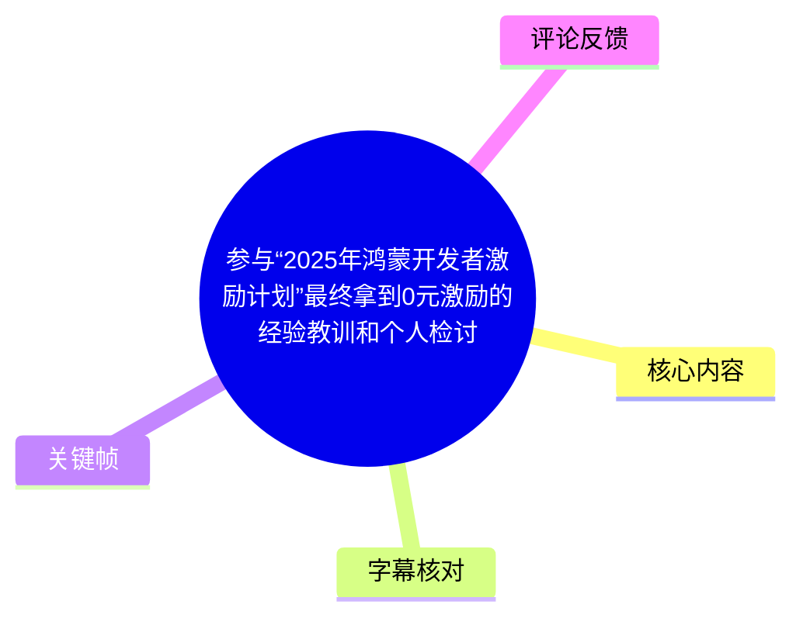
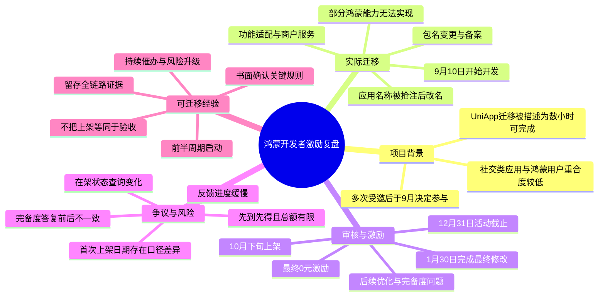
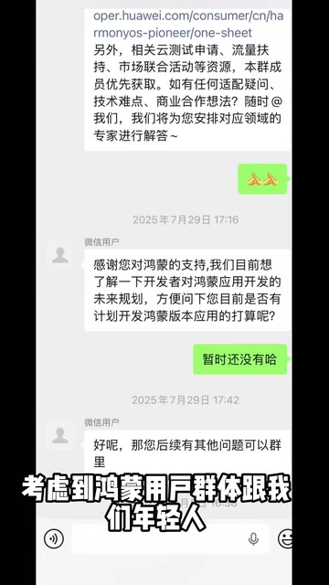
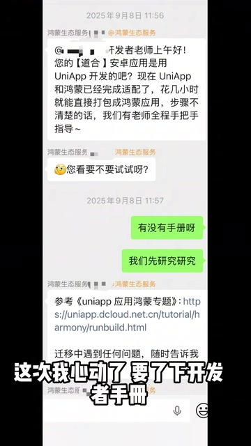
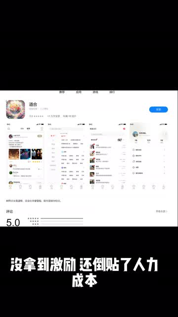
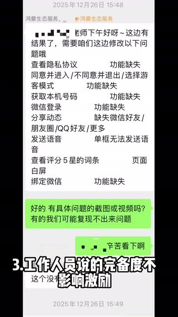

# 参与“2025年鸿蒙开发者激励计划”最终拿到0元激励的经验教训和个人检讨

> 来源：[Bilibili 视频](https://www.bilibili.com/video/BV1N2VT6wEG1)<br>
> UP 主：辛浦江｜视频时长：07:35｜分辨率：1920 × 3414（竖版）<br>
> 标签：鸿蒙、鸿蒙开发者、华为、小米

## 小结

视频是 UP 主对一次参与“2025 年鸿蒙开发者激励计划”的个人复盘。其团队为一款面向年轻人社交方向的应用开发鸿蒙版本：自 2025 年 9 月 10 日启动，至 2026 年 1 月 30 日完成最终修改并上架，UP 主按自身统计共经历 142 天，最终未获得激励，并认为人力投入已经超过预期激励金额。

UP 主将问题归为双方因素：个人方面，前期没有足够紧迫地推进，也相信了工作人员“完备度不影响激励、上架即可”的口头/聊天答复；平台侧则被其质疑存在迁移难度估计过于乐观、后期反馈缓慢、临近截止日集中提出问题，以及后台“在架”状态变化影响激励判断等情况。以上是 UP 主基于沟通记录和后台截图作出的个人陈述，不构成对平台流程的独立认定。

技术与项目管理层面，视频否定了“UniApp 应用数小时即可直接打包为鸿蒙应用”的简化预期。实际迁移中涉及功能适配、包名变更后的备案、应用名称冲突、商户服务申请，以及鸿蒙端无法实现而华为版本已具备的功能差异等事项。UP 主估算，原本认为 5,000 元激励可覆盖人力、10,000 元可获利，但实际成本远超 5,000 元，即便拿到激励也未必划算。

最可迁移的经验是：将“应用已上架”与“符合激励验收条件、完成验收、能获得激励”分开管理；不要仅依据工作人员的非正式答复安排资源；在存在截止日、限额、先到先得规则的活动中，应在考核周期前半段启动，保留报名、上架、状态、工单和答复证据，并持续推动审批和验收节点。

本视频所述活动已在视频引用的工单回复中标明于 **2025 年 12 月 31 日结束**。该复盘反映的是该 UP 主参与旧活动时的个案，不能直接推导至之后的鸿蒙开发政策、新版本激励计划、所有应用审核结果或所有开发者的实际成本。

## 思维导图





## 目录

- [背景、范围与时效性](#背景范围与时效性)
- [受邀与立项：从观望到迁移评估](#受邀与立项从观望到迁移评估)
- [开发与上架：实际工作并非数小时迁移](#开发与上架实际工作并非数小时迁移)
- [审核、商户服务与激励节点风险](#审核商户服务与激励节点风险)
- [最终结果、规则口径与时间线矛盾](#最终结果规则口径与时间线矛盾)
- [可执行的项目管理步骤](#可执行的项目管理步骤)
- [技术、业务与证据限制](#技术业务与证据限制)
- [关键帧索引](#关键帧索引)
- [字幕比对](#字幕比对)
- [评论分析](#评论分析)
- [处理记录](#处理记录)

## 背景、范围与时效性 [00:00:00](https://www.bilibili.com/video/BV1N2VT6wEG1?t=0)

视频开头概述了结果：UP 主称自己真实参加了 2025 年鸿蒙开发者激励计划，历时 142 天完成开发和上架，却因其所称的“官方审核后期极度拖延”错过激励节点，最终没有获得激励，并承担了人力成本。

UP 主明确说明，其应用是年轻人社交方向 App，自行判断其用户群体与鸿蒙用户群体的重合度不高。因此，这并非一个其业务本来就必须做的版本，而是一次以激励和迁移可行性为重要考虑因素的开发决策。这一背景决定了项目应以完整成本核算评估，而不能只以“能否迁移”作为立项标准。

视频中的激励规则信息来自 UP 主转述的后续工单答复，核心表述包括：

- 活动于 **2025 年 12 月 31 日正式结束**；
- 对符合规则的应用、游戏、元服务，按“首次正式上架时间”排序；
- 按“先到先得”顺序验收；
- 激励金总额有限，“发完即止”。

这些规则意味着，开发完成、应用上架、后台状态正常、材料齐备、通过完备度或其他审核、完成激励验收，可能是不同阶段；其中任一阶段拖延都可能影响最终结果。

## 受邀与立项：从观望到迁移评估 [00:01:18](https://www.bilibili.com/video/BV1N2VT6wEG1?t=78)

### 1. 多次邀约与前期拒绝

据视频时间线：

| 时间 | 事件 | UP 主的判断 |
| --- | --- | --- |
| 2025 年 7 月 | 鸿蒙工作人员多次电话邀请其参加激励计划 | 因用户群体重合度不高而拒绝 |
| 2025 年 7 月后 | 对方建议先加入微信群了解政策 | 加群、查看政策后，仍因开发成本暂不启动 |
| 2025 年 8 月 | 再次被询问是否参与 | 再次拒绝 |
| 2025 年 9 月 | 工作人员确认其应用采用 UniApp 开发 | 迁移描述改变了其决策 |



> 图：画面展示 2025 年 7 月的微信沟通片段，包括“了解一下开发者政策”和邀请加入鸿蒙应用开发相关群聊的信息。它说明 UP 主并非立即参与，而是经过政策与成本评估后仍一度拒绝。

### 2. “数小时迁移”与财务预期

视频称，工作人员在 2025 年 9 月告知：UniApp 与鸿蒙“已经完成适配”，花几小时即可直接打包成鸿蒙应用。UP 主因此索取开发者手册并重新评估项目。

UP 主随后发现，手册所示的实际工作并没有宣传语中“几个小时”那么简单。但其当时按激励金额估算：

| 假设激励 | 当时的成本判断 |
| --- | --- |
| 5,000 元 | 大致覆盖人力成本 |
| 10,000 元 | 预计为纯收益 |

这是一种以激励覆盖迁移成本的商业判断。视频后半段表明，该判断未纳入后续反复适配、审核等待、补功能、名称冲突、备案和商户服务等不确定成本。



> 图：该关键帧保留了“UniApp 和鸿蒙已经完成适配”“花几小时就能直接打包成鸿蒙应用”等沟通内容。它是理解 UP 主为何改变立项决定、以及其后续认为难度估计偏乐观的重要证据画面。

## 开发与上架：实际工作并非数小时迁移 [00:02:13](https://www.bilibili.com/video/BV1N2VT6wEG1?t=133)

### 1. 开发阶段与已出现的问题

UP 主的叙述时间线如下：

| 时间 | 进展或问题 |
| --- | --- |
| 2025-09-10 | 开始开发鸿蒙版本 |
| 2025-09-26 | 开发完成并上传 |
| 之后 | 华为侧反馈存在若干问题 |
| 2025-10-23 | 又提出功能问题 |
| 2025-10-24 | 团队称已将该轮功能问题解决 |
| 过程中 | 因修改包名，备案需要时间 |
| 过程中 | 应用软件名在鸿蒙市场被其他主体抢注，被迫改名 |

视频提到，“道和”这个名称在华为市场没有问题，但在鸿蒙市场无法使用。此处反映出跨市场或跨生态发布时，应用名称可用性并不当然一致；名称冲突可能直接造成产品命名、备案、素材、商店资料和发布节奏的连锁修改。

### 2. 迁移中涉及的实际工作类别

视频没有给出具体代码、SDK 版本、API 或配置文件，因此不能据此还原完整技术方案。但可以从其陈述中归纳出已经实际发生的工作类别：

1. **框架适配与功能实现**：虽然原应用采用 UniApp，但仍出现需逐项解决的问题。
2. **包名调整及备案**：变更包名不是单纯改配置，视频称其带来了备案等待时间。
3. **应用名称治理**：鸿蒙市场名称冲突导致改名。
4. **平台差异功能处理**：后续被要求处理的功能中，部分在鸿蒙端“无法实现”，但华为版本已有相应能力。
5. **商户服务流程**：后期出现“未开通商户服务”、重新申请与修改申请等状态问题。
6. **审核后的优化或完备度要求**：即使已被称为审核通过上架，仍有进一步问题和修改要求。

因此，“能打包”只能说明构建链路可能具备基础条件，并不等于产品能力、平台规范、商店资料、账号服务和激励验收条件已经满足。

## 审核、商户服务与激励节点风险 [00:02:45](https://www.bilibili.com/video/BV1N2VT6wEG1?t=165)

### 1. 上架后仍未闭环的事项

UP 主称 2025 年 10 月 27 日应用“已经审核通过上架”，但仍存在一个优化问题，遂向工作人员询问是否已经解决。对方回复“请稍候哈，我帮您看一下”，之后直到 11 月 18 日未继续答复。

这构成视频最关键的管理教训：**上线状态不等于项目完成状态**。如果项目目标是获得激励，则应追踪到“资格确认—验收完成—激励结果”而非停留在“可在商店下载”。



> 图：画面同时展示应用商店中的应用页面和结论性字幕“没拿到激励还倒贴了人力成本”。其价值在于直观区分“产品已经展示在商店中”与“激励结果为零”这两个并不等价的事实。

### 2. 11 月至 12 月的状态与催办

UP 主描述的关键节点包括：

| 时间 | 其称发生的情况 | 与激励的关系 |
| --- | --- | --- |
| 2025-11-18 | 首次明显催办，担心进度被拖延 | 临近截止日，等待风险上升 |
| 2025-11-19 | 后台查询截图显示“在架”，首次上架时间显示为 2025-10-25 | UP 主认为该状态应符合激励政策 |
| 2025-11-24 | 再次催问 | 获得“应该没那么快”的回复 |
| 2025-12-02 | 再催仍无进展 | 获得“整体进度有点慢”的回复 |
| 2025-12-09 | 因 12 月 31 日截止而着急 | 称提出回滚至华为、不再进入鸿蒙 |
| 2025-12-11 | 投诉工单称未开通商户服务 | 之前能查询的应用状态此时无法查询 |
| 2025-12-19 | 按要求修改商户服务申请 | 后续一段时间未再联系 |
| 2025-12-26 | 突然收到一批问题 | 距截止日仅约 5 天，UP 主称距上次实质进展约 60 天 |

视频强调，11 月 19 日其截图中“在架”状态明确存在，但 12 月再次查询时已无法查到。UP 主认为后台状态发生变化，并认为这直接影响激励结果。不过，素材未提供后台变更日志、完整规则原文或平台独立回应，故只能将其描述为 UP 主根据截图作出的判断。

### 3. “完备度不影响激励”的信赖风险

UP 主称工作人员曾表示“完备度不影响激励，上架了就行”，因此其对 12 月 26 日临近截止日收到的一批问题没有充分升级处理。他在复盘中明确认为，该答复“不可信”，因为 2026 年 1 月 30 日完成修改上架后，得到的口径变为：完备度按 2025 年 12 月 31 日的结果为准，导致无法获得激励。



> 图：关键帧显示工作人员列出隐私协议、功能缺失、同意进入、青少年模式、获取手机号、微信登录、动态分享、发送语音、评分词条白屏、绑定微信等多项问题。它说明视频中的“完备度”并非抽象概念，而对应一组具体功能与合规/体验项。

从该画面可见，提出的问题包含但不限于：

- 隐私协议查看；
- 某些功能缺失；
- 同意进入/不同意并退出逻辑；
- 青少年模式；
- 获取本机号码；
- 微信登录；
- 分享动态；
- 发送语音；
- 查看评分 5 星词条时页面白屏；
- 绑定微信。

但应注意：关键帧中的具体条目只证明当时沟通中提出过这些问题，无法仅凭该画面确认所有问题是否属于激励活动的硬性验收标准，也无法确认每项问题的最终修复状态。

## 最终结果、规则口径与时间线矛盾 [00:05:09](https://www.bilibili.com/video/BV1N2VT6wEG1?t=309)

### 1. 2026 年 1 月完成修改后的结果

UP 主称，针对 12 月 26 日提出的问题，团队在 2026 年 1 月 30 日终于完成修改并上架；但此时得到“完备度按照 12 月 31 日结果为准”的说法，故不能取得激励。

其转述的工单规则回复为：

> 活动已于 2025 年 12 月 31 日正式结束；对于符合活动规则所述激励条件的应用、游戏、元服务，按照首次正式上架时间排序，将按照先到先得的顺序验收；激励金总额有限，发完即止。

视频据此提出两个疑问：

1. 若按首次正式上架时间验收，其应用是否应以 2025 年 10 月下旬的首次上架时间参与排序；
2. 在规定时间内上架是否仍不足以确保获得激励，因为还受验收顺序、资格判断与有限总额影响。

### 2. 日期口径存在不一致，不能擅自统一

视频材料中出现了三种与“首次上架”相关的日期，彼此并不完全一致：

| 来源位置 | 日期 | 描述 |
| --- | --- | --- |
| 约 02:45 的口述 | 2025-10-27 | “已经审核通过上架了” |
| 约 03:13 的后台截图转述 | 2025-10-25 | 首次上架时间显示为该日期 |
| 约 05:33 的总结口述 | 2025-10-24 | “10 月 24 日上架” |

因此，本文不把上述日期强行校正为某一日期。较稳妥的表述是：**UP 主主张应用于 2025 年 10 月下旬已经上架，但视频内对于具体首次上架日存在 10 月 24 日、25 日和 27 日三种口径。**

此外，站内字幕在 00:00:42 附近概述为“10 月 27 日开发完成并上架”，而后续叙述表明其 9 月 26 日已完成开发上传、10 月下旬仍有后续修改。这一概述性表述可能把“上架”与“完整完成全部问题”混在一起，应以分段时间线理解，而不应把它视为严格的版本发布记录。

### 3. 成本与项目周期

UP 主总结的数字为：

| 指标 | 数值 | 说明 |
| --- | ---: | --- |
| 全流程时长 | 142 天 | 从 2025-09-10 开发至 2026-01-30 最终完成 |
| 截止日前可用周期 | 112 天 | 从 2025-09-10 至 2025-12-31 |
| 原估算可覆盖成本的激励 | 5,000 元 | UP 主早期估算 |
| 原预期可能盈利的激励 | 10,000 元 | UP 主早期估算 |
| 实际成本判断 | 远超 5,000 元 | UP 主的事后评价 |
| 最终获得激励 | 0 元 | 视频标题及陈述结论 |

UP 主最终认为，问题并不完全归咎于平台：自己没有在 9 月、10 月足够紧急地赶进度，也过度相信“完备度不影响激励”的信息。但其同样认为，平台对迁移难度的预估、后期沟通和流程响应也使项目风险放大。

## 可执行的项目管理步骤 [00:07:10](https://www.bilibili.com/video/BV1N2VT6wEG1?t=430)

以下不是视频中某个平台的官方流程，而是根据 UP 主的踩坑经历整理出的可执行控制点。

### 1. 立项前：把激励从“收益”降级为“风险收益项”

1. 明确产品是否本来就需要目标平台版本。
2. 将迁移成本拆分为开发、测试、UI/交互适配、账号能力、备案、商店资料、命名、审核返工和等待成本。
3. 按“没有激励”情形核算项目是否仍值得做。
4. 不将工作人员对“数小时迁移”的描述直接视作工期承诺。
5. 查验激励的完整条件：报名、首次上架、完备度、验收、名额、资金池、截止日及申诉机制。

### 2. 开发中：建立平台差异清单

建议至少维护如下表格，而非只记录“能否打包”：

| 检查项 | 应确认的问题 |
| --- | --- |
| 包名 | 是否需改包名；改动是否触发备案、签名或上线等待 |
| 应用名称 | 目标市场名称是否可注册、是否冲突 |
| 登录 | 是否需要平台账号、微信或手机号等登录能力 |
| 隐私与授权 | 隐私协议、授权说明、拒绝后退出逻辑是否完整 |
| 功能差异 | 原版本已有但目标系统无法实现的功能如何替代或说明 |
| 社交能力 | 分享、语音、绑定第三方账号等能力是否可用 |
| 页面质量 | 评分页、二级页面、异常/白屏等基础体验问题 |
| 商户服务 | 是否必须开通、状态如何查询、申请材料是否齐备 |
| 审核与激励 | 上架后是否已进入验收，是否还有待解决事项 |

### 3. 截止期管理：以“验收闭环”为里程碑

- 在活动周期前半段启动，而不是临近截止前数月才立项。这是 UP 主在视频结尾给出的直接建议。
- 为审核返工预留足够缓冲；不能以首次开发完成日替代可验收日。
- 每次沟通后形成可追踪的书面事项：问题、责任方、截止时间、解决证据、当前状态。
- 对关键问题要求明确书面答复，例如“完备度是否影响激励”“当前是否已经具备验收资格”。
- 定期截图或导出后台状态，包括报名状态、应用在架状态、首次上架时间、商户服务状态和工单编号。
- 截止日前仍存在未答复工单时，应按平台公开渠道及时升级，而非仅等待单一联系人回复。

### 4. 避免的逻辑跳跃

视频案例表明，以下等式都不可靠：

```text
框架支持迁移 ≠ 数小时完成产品迁移
应用审核上架 ≠ 符合激励全部条件
工作人员口头/聊天答复 ≠ 最终规则解释
截止日前上架 ≠ 必然获得激励
完成修改 ≠ 仍在活动考核时间内
```

## 技术、业务与证据限制 [00:06:46](https://www.bilibili.com/video/BV1N2VT6wEG1?t=406)

1. **个案限制**：视频记录的是单一开发团队、单一应用和单次活动参与经历，不足以证明普遍审核效率或所有鸿蒙迁移项目的复杂度。
2. **规则证据限制**：素材提供的是 UP 主转述或展示的沟通、工单内容，并非完整的活动规则原文、审核规范全文或平台公开说明。
3. **因果限制**：UP 主认为审核拖延、状态变化与失去激励存在关联；但仅凭现有素材无法独立证明具体后台操作、审核责任归属或资金池何时耗尽。
4. **技术细节限制**：视频未给出 UniApp 版本、HarmonyOS SDK、原生插件、构建参数、代码改动量或实际工时，不能据此得出通用迁移工作量。
5. **日期矛盾**：关于首次上架时间，视频中出现 2025-10-24、2025-10-25、2025-10-27 三种日期，应保留冲突而非擅自修订。
6. **时效性限制**：视频所涉活动截止于 2025-12-31；评论中还有“新版活动就好了”的说法，但没有提供规则内容或官方来源，不能据此判断新活动是否已解决旧问题。
7. **业务适配限制**：UP 主自述其社交 App 与鸿蒙用户群体重合较低，因此其“即使获激励也不划算”的结论，不能直接套用于本就有鸿蒙用户需求的产品。

## 关键帧索引

| 关键帧 | 正文位置 | 画面内容 | 使用价值 |
| --- | --- | --- | --- |
|  | 审核、商户服务与激励节点风险 | 应用商店页面与“没拿到激励还倒贴了人力成本”字幕 | 直观呈现“已经上架”与“没有激励”的结果差异 |
|  | 完备度问题 | 2025-12-26 沟通中列出的功能与页面问题 | 使“完备度”对应到可见的具体问题项 |
|  | 受邀与立项 | 2025 年 7 月邀请加入群聊了解政策的沟通 | 说明参与决策经历多轮邀约与前期观望 |
|  | 迁移评估 | 2025 年 9 月关于 UniApp 已适配、数小时打包的沟通 | 记录项目工期预期形成的关键依据 |

其余关键帧文件虽在素材目录中可用，但当前提供的多模态画面内容未逐帧展开。为避免对未展示画面作出推测，正文仅选用上述四帧。

## 字幕比对

| 字幕来源 | 完整性 | 专有名词 | 时间轴 | 主要问题 |
| --- | --- | --- | --- | --- |
| Bilibili 站内字幕 `p01-ai-zh.srt` | 覆盖 00:00:00.220 至 00:07:34.120，接近全片 | “鸿蒙”“UniApp”“商户服务”等整体较稳定 | 细粒度短分段，可直接用于章节时间轴 | 00:00:32.530 至 00:00:37.310 存在约 4.78 秒空段；部分自动字幕词形错误，如“再嫁”应结合语境理解为“在架”；首次上架日期存在视频内部口径冲突 |
| 本次 ASR `medium` | 诊断显示语音覆盖 414.72 秒、覆盖率 0.9131；实际识别从 00:00:39.220 开始至 00:07:33.940 | 专名错识较多，如“鸿蒙”被识为“鸯蒙/红蒙”，“激励”被识为“机力/激利”，“UniApp”存在字形混乱 | 具有时间戳，但每段约 24 秒且段内文本过长 | 漏失前约 39 秒内容；同音错字明显；“在架”被识为“在驼”等，不适合单独作为事实文本依据 |

### 最终字幕选择

正文以 **Bilibili 站内字幕** 作为主时间轴和主要事实转写依据，原因是其从视频开头开始覆盖且切分更细；同时对本次 ASR 进行了完整检查，确认其语言识别为中文（置信度约 0.9995）、存在音频内容且未标记 `noAudioStream=true`，并非无音轨视频。

本次 ASR 对后半段的流程主线具有交叉验证价值，例如确认了“12 月 26 日集中提出问题”“1 月 30 日修改完成”“先到先得、总额有限”等叙述，但因错字和首段缺失，未作为主文本来源。

结合站内字幕、ASR 语境和关键帧，对以下词语进行了审慎校正：

| 原始异常文本 | 正文采用 | 校正依据 |
| --- | --- | --- |
| “再嫁”“再价”“在驼” | 在架 | 站内字幕语境为后台应用状态；ASR 同位置也出现相近误识 |
| “机力”“激利” | 激励 | 全片主题及活动名称 |
| “鸯蒙”“红蒙” | 鸿蒙 | 视频标题、元数据、站内字幕与上下文一致 |
| “包明” | 包名 | 上下文为修改包名与备案 |
| “抢住” | 抢注 | 上下文为应用名称被其他主体占用 |

## 评论分析

仅处理素材中可获取的热评前三条。评论均为用户观点，不应替代活动规则、审核记录或独立产品评测。

### 1. 等风等雨01（641 赞）

> “还有鸿蒙开发者被骗方案的，发文警示后来者”

- **观点概括**：评论者将视频归入“开发者被骗”的叙事，并支持发文警示后来者。
- **补充信息**：没有提供独立经历、规则截图或可验证事实。
- **可信度与争议**：该评论表达的是情绪性支持和价值判断。“被骗”属于强定性，而现有素材只能确认 UP 主自述未获激励及其对流程的质疑，不能据此独立认定欺骗事实。

### 2. 日川岡昄（768 赞）

> “你参加的旧版活动，新版活动就好了”

- **观点概括**：认为问题属于旧版活动，新版活动已有改善。
- **补充信息**：没有给出新版活动名称、发布日期、规则变化、官方链接或实际案例。
- **可信度与争议**：这可能提示活动规则存在版本迭代，但素材不足以核实“新版已经解决问题”的结论。阅读者不应据此降低风险控制，应自行查阅当前活动的官方细则与验收口径。

### 3. Wakanozomi（241 赞）

> 评论者称自己实际体验过 UP 主的应用，认为其无法获得激励、甚至后续补功能，与应用完善程度、开发规范、视觉交互、账号能力、隐私功能以及非原生开发等因素有关。

- **观点概括**：评论者认为 UP 主自身也应对结果负责，重点质疑功能完整性、平台设计规范符合度、华为账号登录、防窥模式、视觉效果、卡片式界面与原生程度。
- **补充信息**：评论提供了应用体验视角，并指出视频展示的客服记录中确有功能缺失清单；这与关键帧中 2025-12-26 的问题列表存在一定对应。
- **可信度与争议**：评论者自称体验过应用，但未提供设备、系统版本、测试时间、审核标准或官方验收依据。其中“应当需要防窥模式”“应有毛玻璃”“大部分界面应该是 Web”等含有个人审美、推测或主观规范判断，不能等同于官方硬性要求。其价值在于补充了视频单一叙事之外的产品质量视角，而非证明平台最终裁决必然正确。

## 处理记录

- **Worker ID**：`worker-mrj0wjed-b0c290ad`
- **模型**：`gpt-5.6-terra`
- **素材与工具产物**：依据已提供的视频元数据、站内字幕 `p01-ai-zh.srt`、本次 ASR 结果 `asr/asr-result.json` 与 `asr/transcript.srt`、关键帧目录 `frames/`、热评文件 `comments/comments.json` 整理；素材显示音频已导出为 `audio/audio.wav`，关键帧与字幕产物已生成。
- **字幕选择**：主用站内字幕的细粒度时间戳；复核本次 ASR。ASR 未标记 `noAudioStream=true`，确认源视频存在音轨；因 ASR 前 39 秒未覆盖且专名错识较多，仅作为交叉校验。
- **时间轴依据**：章节链接优先采用站内 SRT 的真实起始时间换算为秒数，未按文字顺序臆测时间位置。
- **关键帧选择依据**：选择了能直接显示应用已上架、12 月 26 日问题清单、7 月邀约、9 月“数小时迁移”说法的 `frame-001` 至 `frame-004`；其余帧未展示具体视觉内容，未做推断性引用。
- **评论处理范围**：仅分析可获取热评前三条，未延伸到其他评论或将评论观点作为已验证事实。
- **缓存清理**：提供的素材未包含缓存清理执行日志；本文不虚构已执行的清理结果。
- **未解决问题**：活动完整规则原文、激励总额与发放明细、应用后台状态变更日志、具体首次正式上架日期、工作人员答复的正式效力、12 月 31 日时的实际完备度与验收状态，均无法仅凭现有素材独立确认。
