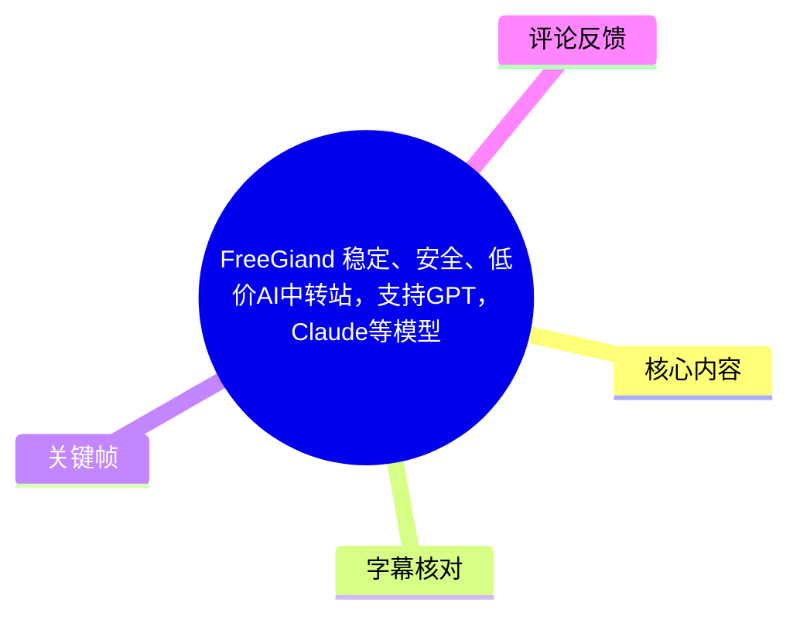
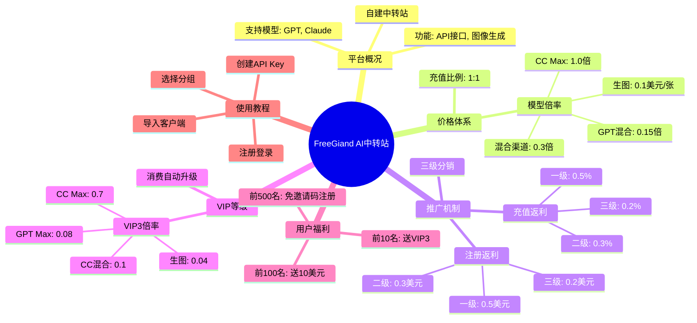
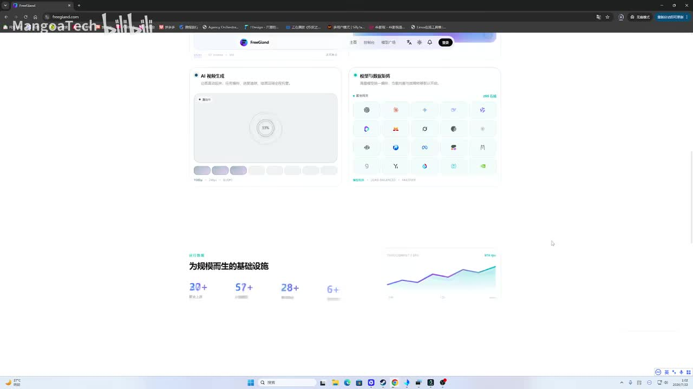
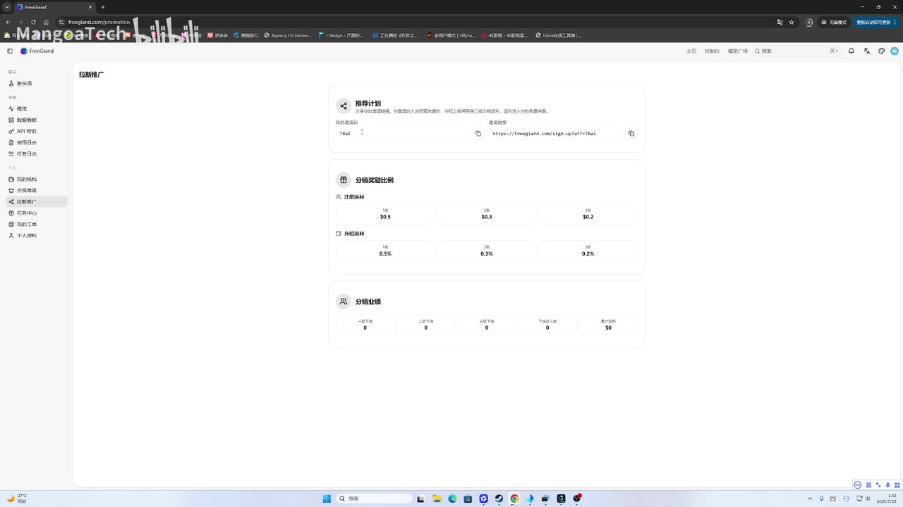
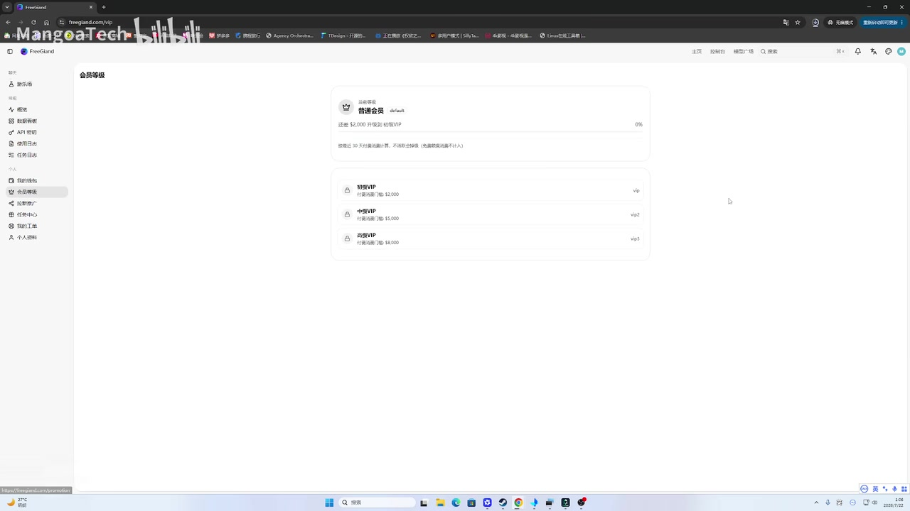

# [FreeGiand]稳定、安全、低价AI中转站，支持GPT，Claude等模型

> 来源：[Bilibili 视频](https://www.bilibili.com/video/BV1AXKa6UEkD) 
> UP 主：MangoaTech | 发布时间：2026-07-20 | 视频时长：12:20

## 小结

本视频由 UP 主 MangoaTech 介绍其自建的 AI 中转站平台 **FreeGiand**。该平台主打“稳定、安全、低价”，聚合了 GPT、Claude 等主流大模型 API，并提供图像生成服务。视频核心内容围绕平台的**价格优势**、**推广返利机制**、**VIP 等级体系**以及**新用户福利**展开。

关键信息包括：
1.  **极低价格**：充值比例 1:1（1 元人民币 = 1 美元额度），模型倍率低至 0.3 倍（即 0.3 美元/刀），部分混合渠道甚至低至 0.15 倍。
2.  **三级分销返利**：提供注册返利（最高 1 美元/人）和充值返利（最高 1%），鼓励用户拉新。
3.  **VIP 自动升级**：根据消费金额自动升级 VIP 等级，VIP3 及以上享受极低倍率（如 GPT Max 倍率 0.08）。
4.  **限时福利**：前 100 名私信用户赠送 10 美元额度，前 10 名赠送 VIP3 等级；前 500 名注册无需邀请码。
5.  **使用教程**：演示了如何注册、创建 API Key、选择分组并导入 Chatbox 等客户端。

适合寻找低成本 AI API 接口的开发者、高频使用者以及对 AI 中转站商业模式感兴趣的用户。需注意，该平台为个人搭建，存在一定运营风险，且福利具有时效性。

## 思维导图

## 目录

- [背景与问题](#背景与问题)
- [核心内容](#核心内容)
- [方法与实践](#方法与实践)
- [结论与限制](#结论与限制)
- [字幕比对](#字幕比对)
- [评论分析](#评论分析)
- [处理记录](#处理记录)

## 背景与问题

视频发布于 2026 年 7 月，针对 AI 模型调用成本高、官方接口限制多等问题，UP 主推出了自建的 AI 中转站 FreeGiand。视频旨在通过展示极低的价格、丰厚的推广返利和简单的使用流程，吸引早期用户注册和使用。

## 核心内容

### 平台介绍与模型支持 [00:02](https://www.bilibili.com/video/BV1AXKa6UEkD?t=2)

UP 主介绍 FreeGiand 是一个自建的 AI 中转站，目前主要支持 **GPT** 和 **Claude** 模型，其他模型正在陆续上架。平台提供 API 接口，并计划增加在线生图和视频生成功能。

> 图：FreeGiand 平台首页截图，展示了“AI 视频生成”、“模型与数据集”等模块，以及“为规模而生的基础设施”宣传语，体现平台功能规划。

### 价格体系与倍率 [03:22](https://www.bilibili.com/video/BV1AXKa6UEkD?t=202)

平台充值比例为 **1:1**（1 元人民币 = 1 美元额度）。模型价格通过“倍率”计算：
*   **混合渠道**：倍率 0.3，即 0.3 美元/刀。
*   **CC Max**：倍率 1.0，即 1 美元/刀。
*   **GPT 混合**：倍率 0.15，即 0.15 美元/刀。
*   **生图**：0.1 美元/张。

UP 主强调定价不高，旨在通过低价吸引用户。

### 推广返利机制 [01:17](https://www.bilibili.com/video/BV1AXKa6UEkD?t=77)

平台设有三级分销返利机制，鼓励用户拉新：
*   **注册返利**：发展一个下级，一级奖励 0.5 美元，二级 0.3 美元，三级 0.2 美元，合计 1 美元。
*   **充值返利**：一级 0.5%，二级 0.3%，三级 0.2%，合计 1%。

> 图：用户中心“拉新推广”页面，清晰展示了“推荐计划”、“分销奖励比例”（注册返利、充值返利）和“分销业绩”统计，验证了视频所述的返利机制。

### VIP 等级与倍率折扣 [05:12](https://www.bilibili.com/video/BV1AXKa6UEkD?t=312)

VIP 等级根据消费金额自动升级。UP 主展示了 **VIP3** 的倍率设置：
*   **CC Max**：0.7 倍
*   **CC 混合**：0.1 倍
*   **GPT Max**：0.08 倍
*   **生图**：0.04 美元/张

UP 主表示 VIP4 及更高等级的倍率会更低，并计划将 VIP 分组倍率公开至用户中心，实现透明化。

### 限时福利活动 [05:20](https://www.bilibili.com/video/BV1AXKa6UEkD?t=320)

*   **前 100 名**：一键三连、关注、评论并私信“免费额度”，赠送 **10 美元** 兑换码。
*   **前 10 名**：满足上述条件，额外赠送 **VIP3 等级**。
*   **前 500 名**：注册无需填写邀请码，500 人后开启强制邀请码注册。

## 方法与实践

### 注册与创建 API Key [09:26](https://www.bilibili.com/video/BV1AXKa6UEkD?t=566)

1.  **注册**：访问官网 freegiand.com，目前前 500 名用户无需邀请码即可注册。
2.  **创建 API Key**：
    *   登录用户中心，进入“API 密钥”页面。
    *   选择分组（**不要选 Default**，选择其他分组如混合渠道）。
    *   点击创建，复制生成的密钥。

> 图：API 密钥创建界面，展示了密钥复制按钮和网关域名信息，指导用户如何获取 API 访问凭证。

### 导入客户端 [10:11](https://www.bilibili.com/video/BV1AXKa6UEkD?t=611)

1.  **配置网关**：API 网关域名为 `freegiand.com`，直接复制即可，无需额外路径。
2.  **导入 Chatbox**：
    *   打开 Chatbox 客户端。
    *   点击“连接”或“导入”。
    *   粘贴 API Key 和网关域名。
    *   选择模型（如 GPT-4o），即可开始使用。

## 结论与限制

*   **价格优势明显**：FreeGiand 提供的模型倍率远低于市场平均水平，尤其是混合渠道和 VIP3 等级，适合高频调用用户。
*   **推广激励丰厚**：三级分销机制和限时福利（10 美元额度、VIP3 等级）对早期用户极具吸引力。
*   **时效性限制**：前 500 名免邀请码注册、前 100 名送额度等福利具有严格的人数限制，需尽快行动。
*   **潜在风险**：平台为个人搭建，虽承诺稳定安全，但长期运营能力和资金链稳定性未知，建议用户控制充值金额，避免大额投入。
*   **技术稳定性**：有用户反馈登录注册页面存在 Bug，提示平台技术细节仍需打磨。

## 字幕比对

| 字幕来源 | 完整性 | 专有名词 | 时间轴 | 主要问题 |
| --- | --- | --- | --- | --- |
| Bilibili 站内字幕 | 未提供 | - | - | 无站内字幕 |
| 本次 ASR 字幕 | 高 (73.26%) | 部分错误 | 准确 | 存在错别字，如“中软站”应为“中转站”，“反例”应为“返利”，“交情码”应为“邀请码”，“升图”应为“生图”。 |

**说明**：最终采用 ASR 字幕，并结合上下文和关键帧进行了人工校正。例如，将“中软站”校正为“中转站”，“反例”校正为“返利”，“交情码”校正为“邀请码”，“升图”校正为“生图”。

## 评论分析

1.  **可它爱着这个世界-**：评论“6”，表示认可或无语，无实质信息。
2.  **励志成为奥特曼的男人**：指出“你网页有Bug，登录和注册点击会调整一个报错页面然后又调整正常页面”。这提示平台前端存在技术缺陷，可能影响用户体验，需关注平台修复进度。

## 处理记录

- Worker ID：worker-ms0wf3sk-188017b8
- 调用工具与模型：video-tool (ASR) / qwen3.6-27b
- 使用的应用工具：ASR 转录、关键帧提取、评论抓取
- 字幕选择：ASR 字幕（经人工校正）
- 关键帧选择依据：选取了平台首页（展示功能）、拉新推广页（展示返利机制）、API 创建页（展示使用流程），覆盖核心内容。
- 清理缓存：无
- 未解决问题：无
