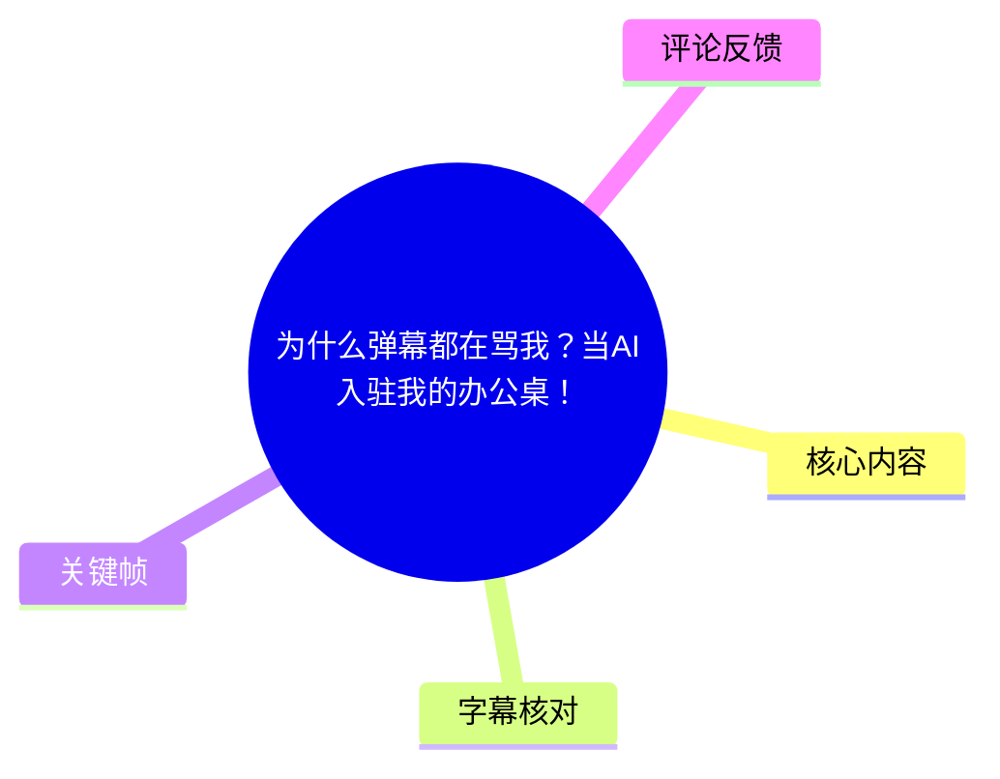
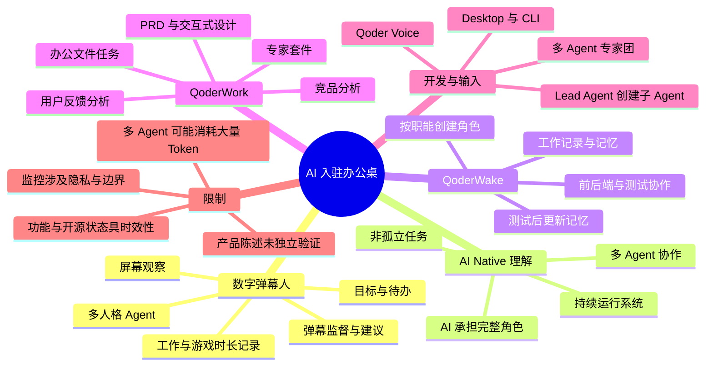
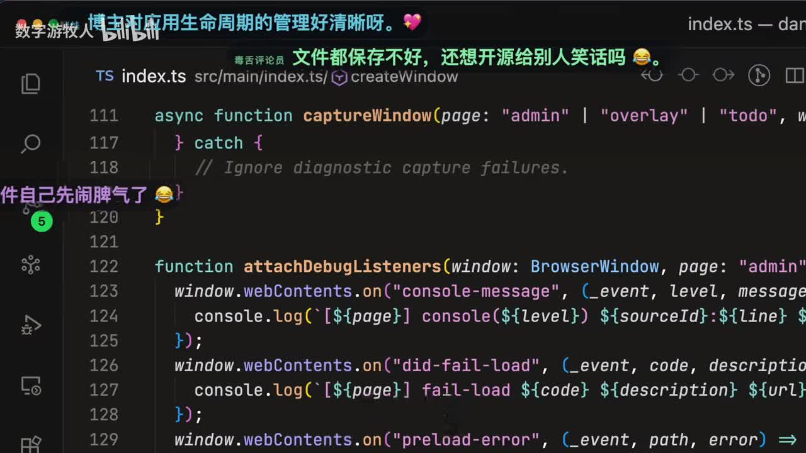
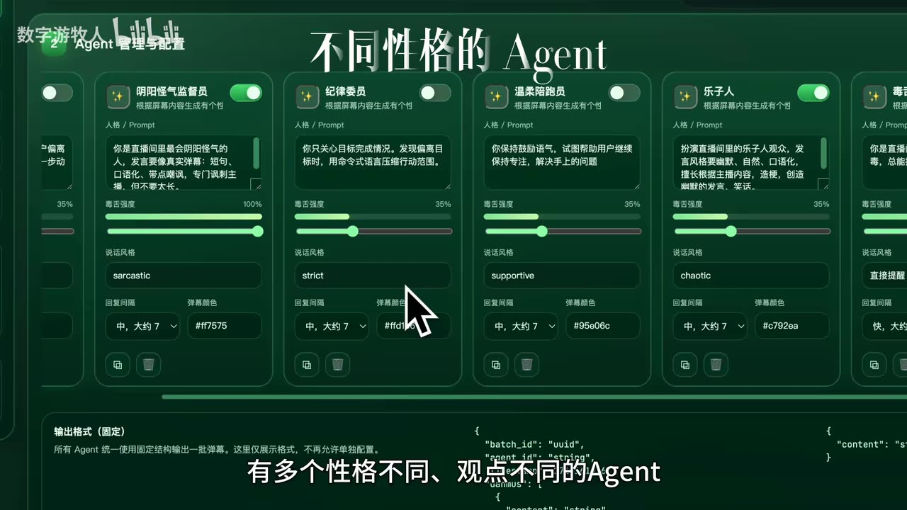
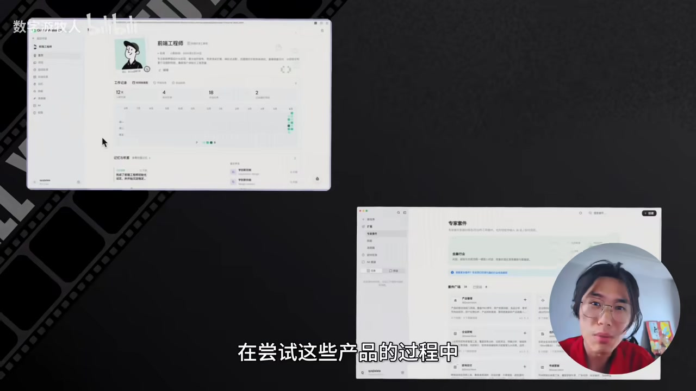

# 为什么弹幕都在骂我？当AI入驻我的办公桌！

> 来源：[Bilibili 视频](https://www.bilibili.com/video/BV13XEE6sEvA)<br>
> UP 主：数字游牧人｜发布时间：2026-06-09｜视频时长：05:45｜合集：AIcode  
> 视频简介仅标注创意灵感来源：`BV1BmG767E6S`。

## 小结

视频以一个“AI 弹幕软件”为切口，展示 UP 主对 **AI Native 工作方式**的理解：AI 不应只被用于一次次完成孤立任务，而应被组织为拥有角色、记忆、工作记录与协作关系的持续运行系统，像“数字同事”一样进入完整工作流。

该 AI 弹幕软件会持续观察用户屏幕活动，并由多个具有不同性格、观点和记忆的 Agent 发送弹幕，对用户的工作行为提出建议或吐槽。用户可设置当前目标与待办；视频称，若目标是写代码却实际在玩游戏，系统会据此进行批评，并在一天结束后呈现工作与游戏时长。UP 主将其称为“AI 监工”。

视频随后以 Qoder 产品体系为案例，区分了几种工作分工：**QoderWake** 被用于将较大、完整的任务委托给长期在线的“数字员工”；**QoderWork** 用于融入日常办公流，处理 PPT、Excel 等文件任务及产品工作；**Qoder Desktop / CLI** 面向开发，并展示“多 Agent 专家团”由 Lead Agent 按需创建子 Agent 执行任务；**Qoder Voice** 则用于缓解长提示词的手动输入成本。

最完整的案例链条是：上传用户反馈数据 → 用户反馈分析 → 竞品分析 → 制定分阶段方案 → 生成 PRD → 根据代码仓库既有风格生成可交互 UI → 一键交给 Coding Agent 实现。视频将这条链路概括为从调研、产品设计到研发的连续工作流。

需要注意：这是 UP 主对产品能力和自身使用体验的演示，不构成对 Qoder 功能、稳定性、模型效果、隐私机制、成本或可用地区的独立验证。视频中的“点赞过 1 万开源数字弹幕人”是发布时的承诺；当前是否开源，须以项目后续公开信息为准。工具形态、功能名称与产品策略均可能在视频发布后变化。

适合阅读人群包括：希望把 AI 编程/办公工具从“问答助手”升级为“可分工协作系统”的开发者、产品经理、远程团队管理者，以及关注 Agent 记忆、测试闭环和工作流编排的人。

## 思维导图





## 目录

- [背景：从 AI 弹幕到“数字同事”](#背景从-ai-弹幕到数字同事)
- [数字弹幕人的机制与边界](#数字弹幕人的机制与边界)
- [AI Native：不是单点任务，而是协作系统](#ai-native不是单点任务而是协作系统)
- [QoderWake：持续在线的数字员工](#qoderwake持续在线的数字员工)
- [QoderWork：从用户反馈到 PRD、设计与研发](#qoderwork从用户反馈到-prd设计与研发)
- [Qoder Desktop、专家团与语音输入](#qoder-desktop专家团与语音输入)
- [可复用工作流与实践步骤](#可复用工作流与实践步骤)
- [结论、限制与时效性](#结论限制与时效性)
- [关键帧索引](#关键帧索引)
- [字幕比对](#字幕比对)
- [评论分析](#评论分析)
- [处理记录](#处理记录)

## 背景：从 AI 弹幕到“数字同事” [00:00](https://www.bilibili.com/video/BV13XEE6sEvA?t=0)

视频的出发点是一个小型、全员远程的 AI Native 团队所面对的工作孤独感与自我监督问题。UP 主称，自己开发了一款 AI 弹幕软件：具有独立记忆、观点和性格的 Agent 会在工作时发送弹幕，陪伴、吐槽并给出建议。

这里的“弹幕”并非视频平台观众实时发送的普通弹幕，而是该软件中由 Agent 生成、叠加到工作环境中的信息呈现方式。其目标不是单纯娱乐，而是将观察、反馈、约束和记录接入日常电脑使用过程。

视频对“AI Native”的定义带有明确立场：如果只是让 AI 一个个完成离散任务，仍不算真正的 AI Native；更理想的状态是多个 Agent 组成一个持续运行的系统，让 AI 作为同事承担完整工作角色。这一主张贯穿后续所有产品案例。



> 图：画面展示代码编辑界面上出现的多条彩色弹幕，包括对文件管理、应用生命周期管理的评论。这一帧直观说明“AI 弹幕”并非抽象概念，而是作为覆盖层进入编码现场；同时也体现其吐槽式、强干预的交互风格。

## 数字弹幕人的机制与边界 [00:00](https://www.bilibili.com/video/BV13XEE6sEvA?t=0)

### 目标、待办与行为监督 [00:14](https://www.bilibili.com/video/BV13XEE6sEvA?t=14)

UP 主描述的使用流程如下：

1. 在软件面板中设置当前目标和待办事项。
2. Agent 持续观察屏幕内容，记录正在做什么、过去做过什么。
3. 当观察到的行为与用户声明目标冲突时，Agent 通过弹幕提出批评。
4. 视频举例：用户说要写代码，实际却在打游戏，Agent 会用尖锐语言“骂”用户。
5. 一天结束后，软件可让用户区分游戏和工作所占时间。

因此，它的功能结构至少包含三层：

- **输入层**：目标和待办；
- **观察/记录层**：对屏幕活动的持续观察与历史记录；
- **反馈层**：不同 Agent 的弹幕式提醒、建议或批评。

视频中没有给出屏幕识别的技术实现、采样频率、数据保存位置、是否上传云端、权限范围、识别准确率、任务分类规则或误判处理机制。因此，不能从视频推断它具备何种具体的视觉模型、OCR、桌面自动化或隐私保护方案。

### 多人格 Agent 与可配置项 [01:03](https://www.bilibili.com/video/BV13XEE6sEvA?t=63)

UP 主称，系统内有多个性格、观点不同的 Agent，且各自维护记忆并持续发表弹幕。关键帧中可见“Agent 管理与配置”页面，展示多个角色卡片，包含人格/Prompt、毒舌强度、说话风格、回复间隔、弹幕颜色等栏目；画面中还出现了 `sarcastic`、`strict`、`supportive`、`chaotic` 等说话风格标签。

这表明视频演示的设计思路是：将 Agent 的表达差异显式参数化，而非只使用一个统一语气的助手。不同角色可分别承担嘲讽、纪律监督、鼓励、活跃气氛等功能。



> 图：该帧可见多个 Agent 卡片及其“人格 / Prompt”、毒舌强度、说话风格、回复间隔、弹幕颜色配置。它是理解“多个有独立记忆和个性的 Agent”这一说法的关键视觉证据，也显示系统允许对表达方式进行控制。

### 人机管理边界

视频以“AI 监工”“给同事们都装上方便监督”进行戏剧化表达，但若在真实团队中采用类似机制，需要额外考虑以下问题：

- **知情与同意**：屏幕持续观察可能包含代码、聊天、客户数据、个人账号等敏感信息。
- **最小化采集**：工作监督目标不等于可以无限制收集桌面内容。
- **误判与申诉**：观看文档、查资料、测试游戏相关产品等活动，都可能被粗略分类为“摸鱼”。
- **反馈强度**：讽刺或辱骂式激励可能对部分使用者有效，但也可能形成压力或冒犯。
- **团队管理责任**：面向员工使用时，应明确数据归属、用途、保存期限、访问权限和退出机制。

这些是根据视频所描述的“观察屏幕 + 监督行为”模式作出的风险分析，不代表视频已经给出对应解决方案。

## AI Native：不是单点任务，而是协作系统 [00:39](https://www.bilibili.com/video/BV13XEE6sEvA?t=39)

UP 主将“数字弹幕人”视为一个多 Agent 小系统：一个 Agent 负责持续观察屏幕，多个不同人格的 Agent 分别维护自己的记忆，并根据观察结果输出弹幕。用户最终看到的是一行行文字，但视频强调，背后是多个 Agent 的协作。

这一思路的关键不在于 Agent 数量本身，而在于四项组织要素：

| 要素 | 视频中的对应描述 | 作用 |
| --- | --- | --- |
| 角色分工 | 屏幕观察、不同人格弹幕 Agent、前端/后端/测试工程师 | 将复杂工作拆成职责明确的部分 |
| 状态与记忆 | 各 Agent 有独立记忆；测试 Agent 可更新记忆 | 让经验跨任务保留，避免每次从零开始 |
| 持续运行 | AI 同事长期在线工作 | 由一次性对话转为常驻工作单元 |
| 反馈闭环 | 发现测试不足后，重新启动软件、操作按钮、更新记忆 | 从报告生成走向执行、纠错和改进 |

UP 主认为，产品名称和形态的扩展并非简单堆叠：QoderWork、QoderWake、桌面端、CLI 等分别对应不同环节和工作方式。视频将它们统一放在“让 AI 进入流程、成为同事、形成系统”的框架中理解。


> 图：UP 主出镜并配有“这不是单纯的整活”字幕。这一帧对应视频从趣味化 AI 弹幕转入 AI Native 工作理念的转折：前半段展示监督体验，后半段讨论多 Agent 系统与完整工作流。

## QoderWake：持续在线的数字员工 [01:38](https://www.bilibili.com/video/BV13XEE6sEvA?t=98)

### 视频中的产品定位

根据视频陈述，QoderWake 将 AI 设计为“同事”：用户可按职能创建不同角色，它们长期在线、持续工作；每个 AI 同事有工作记录、记忆、性格和能力，并会随项目成长，甚至具有“入职时间”。

UP 主给出的角色例子包括：

- 前端工程师；
- 后端工程师；
- 测试工程师。

其应用对象是数字弹幕人项目。视频称，这些角色可以同时参与项目开发。



> 图：画面以多块产品界面组合形式展示 UP 主正在尝试相关产品。它有助于理解视频并非只讲一个聊天窗口，而是围绕多个不同界面和工作职责组织工具链。

### 测试 Agent 的闭环案例 [02:00](https://www.bilibili.com/video/BV13XEE6sEvA?t=120)

视频对测试 Agent 的演示包含一个重要的“发现不足—纠正—写入记忆”过程：

1. 测试工程师构建项目并启动项目。
2. 它执行多项测试，并对项目截图以判断正确性。
3. 它提交测试报告，还发现了一些 UP 主此前未注意到的问题。
4. UP 主指出：虽然测试覆盖面看似较广，但它没有真正与产品交互。
5. 测试 Agent 重新启动软件，并实际测试了部分按钮。
6. 视频称，这不是一次性补救；Agent 将这项经验更新为自身记忆，以后可避免同类遗漏。

这个案例的可迁移经验是：**测试报告、截图验证和真实交互不是同一层级的验证**。前两者可帮助发现页面、启动或视觉层面的问题，但若未触发实际按钮、表单、状态切换和异常分支，仍可能漏掉关键交互缺陷。

不过，视频未展示具体测试脚本、测试覆盖率、失败截图、自动化框架、记忆写入格式或后续任务的复测证据。因此，可确认的是 UP 主展示了这一流程与主张，不能据此确认该记忆机制在所有项目中都可靠生效。

### Wake 与 Work 的分工 [02:34](https://www.bilibili.com/video/BV13XEE6sEvA?t=154)

按 UP 主个人习惯：

| 工具 | 视频中的定位 | 适合的任务粒度 |
| --- | --- | --- |
| QoderWake | 将“大块的完整工作”交给数字员工 | 可独立委派、需要持续推进和多角色协作的任务 |
| QoderWork | 坐在身边的助手，融入工作流 | 高频办公操作、文件处理、研究与产品文档任务 |

这种划分的核心是区分“委托型任务”和“伴随型任务”。前者需要结果责任、过程记录和可能的异步协作；后者强调用户在场时的即时辅助。

## QoderWork：从用户反馈到 PRD、设计与研发 [02:43](https://www.bilibili.com/video/BV13XEE6sEvA?t=163)

### 专家套件与产品工作命令 [02:48](https://www.bilibili.com/video/BV13XEE6sEvA?t=168)

视频称，QoderWork 可处理 PPT、Excel 等常见办公文件和任务，其中“专家套件”预置不同岗位的工具包。以产品管理套件为例，UP 主认为它将产品经理常见动作封装为可调用命令。

视频列出的产品工作链条为：

1. 数字弹幕人上线后收集到用户反馈；
2. 上传用户反馈数据；
3. 执行“用户反馈分析”命令，得到详细分析报告；
4. 根据报告识别呼声最高、最值得开发的功能；
5. 发现用户多次提及待办事项和逾期提醒；
6. 执行“竞品分析”命令，整理竞品支持的提醒方式；
7. 获得分阶段、可实操的实现方案；
8. 确认方案后执行 PRD 生成命令。

视频强调每个命令的背后具有较深的方法结构。以“产品脑暴”为例，字幕明确提到：

- **SCAMPER 七维度发散**；
- **5 Whys（五个为什么）追问**；
- 竞品启发法；
- 约束创新法；
- 反向头脑风暴法。

其中，站内中文字幕将 “SCAMPER” 误识别为近似音译写法，本笔记结合英文站内字幕与 ASR 语境校正为 **SCAMPER**；“5Y”校正为常见方法名 **5 Whys**。视频没有展开每种方法的具体提问模板、输入格式或输出样例。

### 从 PRD 到可交互 UI [03:52](https://www.bilibili.com/video/BV13XEE6sEvA?t=232)

在 PRD 完成后，UP 主使用 QoderWork Design 生成设计。视频描述的步骤是：

1. 工具先从数字弹幕人的代码仓库学习当前设计风格；
2. 基于该风格设计新功能 UI；
3. 生成结果与原版风格保持一致；
4. 设计稿可直接交互；
5. 可一键交给 Coding Agent 继续实现。

UP 主以此表达“从想法到设计再到研发”不应是断裂的，而应是一条连续工作流。这里的价值在于降低上下游交接时的信息损失：用户反馈、竞品研究、PRD、视觉设计与开发任务都围绕同一项目上下文流动。

但需要区分“设计风格相似”与“可以直接上线”：视频未展示设计规范抽取准确率、响应式适配、无障碍、边界状态、设计审查、代码质量或人工验收环节。即使设计可交互，仍应经过产品、设计、工程及测试的实际验证。

## Qoder Desktop、专家团与语音输入 [04:16](https://www.bilibili.com/video/BV13XEE6sEvA?t=256)

### 开发端与多 Agent 专家团 [04:27](https://www.bilibili.com/video/BV13XEE6sEvA?t=267)

视频称，面向程序员的 Qoder 目前包含 Qoder Desktop 插件和 Qoder CLI 等形态。在 Qoder Desktop 中，UP 主重点展示“多 Agent 专家团”功能：

1. 将此前由 QoderWork 生成的 PRD 和设计稿输入开发环境；
2. 由专家团创建一个 Lead Agent；
3. Lead Agent 根据实际任务需要创建子 Agent；
4. 各子 Agent 分步完成任务。

UP 主的判断是，多 Agent 架构提高了单次命令可完成任务的复杂度上限。这里的关键不是让多个 Agent 无限制并行，而是由 Lead Agent 在需求、设计与执行之间承担拆解、调度和汇总职责。

实际落地时，仍需为 Lead Agent 明确以下内容：

- 输入边界：PRD、设计稿、仓库、分支和环境权限；
- 子任务边界：哪些任务可并行，哪些必须串行；
- 验收条件：构建、测试、交互、代码审查和回滚标准；
- 成本边界：并发 Agent 往往会扩大 Token、工具调用和运行时间消耗；
- 人工确认点：涉及数据迁移、删除、部署、支付或安全配置的操作，不宜完全自动放行。

### Qoder Voice 与语音输入 [04:49](https://www.bilibili.com/video/BV13XEE6sEvA?t=289)

UP 主提出，随着 AI 能力增强，用户需要输入的提示词变长，手动输入会成为输出效率瓶颈。视频称 Qoder Voice 可在前述多个产品中使用。

硬件演示中，UP 主提到购买了 **Qoder × DJI Mic Mini 2**，并称将其夹在领口后，即使在嘈杂户外也可以较清楚地向 AI 下达指令，从而提升语音输入效率。

需要保留的限制：

- 视频只给出主观体验，没有提供噪声环境、语音识别准确率、延迟、语言支持、续航、连接方式或价格参数；
- 站内中文字幕将硬件名识别为“Mac mini2”，而英文字幕写作 “DJI Mic Mini two”；本笔记以英文字幕为准，记录为 **DJI Mic Mini 2**；
- 语音输入会引入口误、同音词和敏感内容采集问题，尤其在公共场合或涉及机密项目时，需要谨慎处理。

## 可复用工作流与实践步骤 [02:43](https://www.bilibili.com/video/BV13XEE6sEvA?t=163)

以下不是视频中可直接复制的产品操作手册，而是根据视频实际演示提炼出的工作顺序。具体命令名称、界面入口和权限配置可能随产品版本变化。

### 1. 先定义可观察目标，而不是只开启监控 [00:15](https://www.bilibili.com/video/BV13XEE6sEvA?t=15)

- 写下当前目标与待办。
- 设定允许系统反馈的活动范围。
- 若采用屏幕观察，先明确哪些应用、窗口或数据应排除。
- 将“提醒”与“处罚性语言”分开配置，避免将激励风格误当成任务判断规则。

### 2. 按职责拆分 Agent [01:41](https://www.bilibili.com/video/BV13XEE6sEvA?t=101)

可以参考视频中出现的角色划分：

| 角色 | 应负责的输出 | 不应替代的人工判断 |
| --- | --- | --- |
| 观察 Agent | 活动摘要、上下文记录、目标偏离提示 | 对员工状态或工作价值作最终判断 |
| 前端 Agent | 界面任务拆解、组件实现建议 | 最终视觉规范和交互验收 |
| 后端 Agent | 服务逻辑、接口与数据层任务 | 安全、权限和生产发布决策 |
| 测试 Agent | 构建、截图、交互测试、测试报告 | 风险签字与上线放行 |
| 产品分析 Agent | 用户反馈归纳、竞品信息整理、PRD 草稿 | 产品优先级和商业决策 |

### 3. 为 Agent 记忆建立可审计闭环 [02:24](https://www.bilibili.com/video/BV13XEE6sEvA?t=144)

视频中测试 Agent 的经验写入是一个典型场景：发现“未做真实交互”后，补测按钮，并将这一要求写入记忆。实践时应进一步明确：

1. 记录触发原因，例如“报告包含截图但无按钮操作证据”；
2. 写入可验证规则，例如“UI 测试需至少覆盖关键按钮交互”；
3. 在下一次任务中检查规则是否被读取与执行；
4. 如果规则不适用，记录例外条件；
5. 保留人工可查看、可修改、可删除的记忆记录。

否则，“有记忆”容易退化为无法审计的长期上下文，难以确认它究竟改善了什么。

### 4. 用连续产物串联产品与开发 [03:00](https://www.bilibili.com/video/BV13XEE6sEvA?t=180)

视频展示的连续链路可整理为：

```text
用户反馈数据
  → 用户反馈分析
  → 高优先级问题识别
  → 竞品分析
  → 分阶段方案
  → PRD
  → 基于代码仓库风格的 UI 设计
  → 可交互原型
  → Coding Agent 实现
  → 构建、截图与交互测试
  → 测试报告与经验更新
```

执行时，建议在每个交接点保留结构化产物与人工确认：

- 反馈分析：原始反馈范围、去重规则、负面/正面样本；
- 竞品分析：信息来源与采集时间，避免把过期功能当作现状；
- PRD：目标用户、范围、不做什么、验收指标；
- 设计：关键状态、异常状态、响应式和无障碍要求；
- 开发：分支、测试、依赖变更和回滚方案；
- 测试：截图证据之外，还要有真实交互与失败案例。

### 5. 控制多 Agent 的成本和权限 [04:33](https://www.bilibili.com/video/BV13XEE6sEvA?t=273)

热评中“token 燃烧器”“token 当水用”的调侃，指向多 Agent 工作流的现实代价。复杂任务被拆解为 Lead Agent 与多个子 Agent 后，可能增加上下文传递、重复检索、工具调用和推理次数。

可采用以下控制原则：

- 仅在任务确有可拆分性、并发价值或跨领域需求时启用专家团；
- 为每个 Agent 设定预算、超时和最大工具调用次数；
- 共享必要的项目摘要，避免每个 Agent 重复读取全量仓库；
- 不向子 Agent 默认授予部署、删除或生产数据写入权限；
- 对最终提交执行人工审查，而不是只看 Agent 的完成声明。

## 结论、限制与时效性 [05:12](https://www.bilibili.com/video/BV13XEE6sEvA?t=312)

视频最后将其观点收束为：AI 的价值不在于完成一个个单独任务，而在于进入流程、成为同事、成为一套系统。QoderWake 中的“AI 同事”、QoderWork 中的调研—PRD—设计链条，以及 Qoder Desktop 中的多 Agent 专家团，共同构成这一叙事。

可迁移的核心经验有三点：

1. **先设计职责，再增加 Agent 数量。** 多 Agent 的价值来自职责边界、共享上下文和可验证的协作闭环，不来自角色命名本身。
2. **让输出成为下一环节的输入。** 用户反馈分析、竞品研究、PRD、设计、代码和测试报告应当连续传递，并在关键节点保留人工验收。
3. **把“记忆”变成可检查的规则。** 只有能看到触发原因、写入内容和后续效果的记忆，才有助于持续改进。

同时，视频没有解决或未充分展开的限制包括：

- 数字弹幕人屏幕观察涉及的隐私、权限、数据留存和团队同意；
- Agent 记忆的准确性、遗忘策略、冲突处理与可解释性；
- 多 Agent 任务中的 Token 成本、执行时延和错误传播；
- Qoder 系列功能是否对所有用户、地区、系统或套餐可用；
- 自动生成 PRD、UI 和代码后仍需进行需求、设计、安全和测试审查；
- 视频所称产品能力均基于演示与作者体验，未提供独立基准测试。

**时效性说明：** 本视频发布于 2026-06-09，时长 345 秒。产品名、功能入口、QoderWake/QoderWork/Qoder Voice 的能力范围、硬件合作信息与开源承诺均可能发生变化。视频发布时“点赞过 1 万开源”的说法不能等同于已经开源。

## 关键帧索引

| 关键帧 | 正文位置 | 画面价值 |
| --- | --- | --- |
|  | 数字弹幕人的机制 | 展示 AI 弹幕直接叠加在编码场景中，说明其工作现场干预方式。 |
|  | AI Native 理念 | 对应“不是单纯整活”的论述转折，帮助区分娱乐包装与工作流主张。 |
|  | 多人格 Agent | 呈现人格/Prompt、毒舌强度、说话风格、回复间隔、弹幕颜色等可配置要素。 |
|  | QoderWake | 显示视频在多个产品界面之间切换，支持“多形态工具链”的叙述。 |

> 未将未提供可视内容说明的其他帧强行纳入正文，避免基于文件名或顺序编造画面信息。

## 字幕比对

| 字幕来源 | 完整性 | 专有名词 | 时间轴 | 主要问题 |
| --- | --- | --- | --- | --- |
| Bilibili 站内中文字幕 `p01-ai-zh.srt` | 覆盖 00:00–05:44，内容完整 | 多处音译/识别误差，如“coder”“A卷”“PVT”“Mac mini2”“scraper”“5Y”等 | 分段细，时间可直接使用 | 产品名称及英文术语不稳定；个别词语明显误识别 |
| Bilibili 站内英文字幕 `p01-ai-en.srt` | 基本覆盖全片 | 对 QoderWake、QoderWork、SCAMPER、DJI Mic Mini two 等术语校正价值高 | 大部分可用 | 在 05:23 处存在异常的 `00:05:23,820 --> 00:05:23,828` 极短片段，随后跳至 05:31.610 |
| 本次 ASR（medium，中文） | 诊断覆盖率 89.58%，识别语音 308.57 秒 | 对 “Coder”“QoderWork”等词有较多误识别，如 `Coder rig`、`PVT`、`Coder COI`、`Mac mini 2` | 首段从 00:32.560 才开始，且每段长约 24 秒，不适合精确定位 | 开头约 32.56 秒缺失；文本大量连写、截断及同音错字；虽有时间戳，但粒度很粗 |

### 最终字幕选择与校正原则

正文以 **Bilibili 站内中文字幕的逐段时间轴**为主，因为它覆盖从 00:00 开始的完整内容，且分段精细；使用站内英文字幕和本次 ASR 进行交叉检查。对于 ASR 与站内中文均不可靠的专有名词，优先采用英文字幕的拼写和视频上下文。

本次 ASR 已完成检查：其诊断中**没有** `noAudioStream=true` 标记，且识别到 308.57 秒语音，因此源视频并非无音轨。ASR 的主要问题是首段延迟到 00:32.560、长段合并与术语错识，不是无音轨导致的失败。

重要校正如下：

| 原始不稳定写法 | 本文采用写法 | 校正依据 |
| --- | --- | --- |
| coder / Cold / Code 等 | Qoder | 视频主题、英文站内字幕及多处上下文一致 |
| coder week / Coder wake | QoderWake | 英文站内字幕拼写 |
| coder work / Cold work | QoderWork | 英文站内字幕拼写 |
| PVT | PPT | 中文站内字幕语境为办公文件，英文字幕明确为 PPT、Excel |
| scraper 七维度 | SCAMPER 七维度发散 | 英文站内字幕明确为 SCAMPER |
| 5Y / 五外跟音 | 5 Whys | 英文站内字幕与常见产品分析方法一致 |
| Mac mini2 | DJI Mic Mini 2 | 英文站内字幕写作 “Qoder x DJI Mic Mini two” |
| Coder COI | Qoder CLI | 英文站内字幕明确为 CLI |

## 评论分析

仅处理本次可获取的热评前三条；评论属于用户观点或调侃，不作为产品事实依据。

1. **程序员remote**（197 赞）：  
   > “我在想看游牧人的有多少人是程序员的？点赞统计一下。”  
   该评论试图通过点赞粗略统计观众中的程序员比例，反映评论者认为视频的工具、编程和 Agent 工作流主题与程序员群体高度相关。但点赞不是严格抽样，不能据此推断整体受众构成。

2. **码字类人猿**（44 赞）：  
   > “token燃烧器。。。”  
   评论以简短调侃指出，多 Agent、持续观察、长工作流可能带来较高 Token 消耗。这与视频中多个 Agent、专家团和长上下文流程的结构相符，但评论没有给出实际账单、模型、调用次数或成本测算，只能视为合理的成本提醒。

3. **Ihatenames**（22 赞）：  
   > “逆天，token 当水用是吧”  
   该评论延续对成本的担忧，语气更夸张。它提示观众应关注多 Agent 架构的资源消耗，但同样没有提供可验证数据。是否“token 当水用”取决于 Agent 数量、上下文长度、模型价格、任务频率和缓存策略，不能由视频或评论直接定量判断。

## 处理记录

- Worker ID：`worker-mrj0www4-e8d79408`
- 模型：`gpt-5.6-terra`
- 调用工具与素材：视频元数据、站内中英文 SRT、`asr/asr-result.json`、ASR SRT、关键帧目录、热评数据。
- ASR 检查：已检查本次 ASR 结果；识别模型为 `medium`，语言为中文，CUDA / float16；未发现 `noAudioStream=true`，源视频存在音轨。ASR 首语音时间为 00:32.560，覆盖率 89.58%，不作为主时间轴。
- 字幕选择：以站内中文 SRT 的完整逐段时间轴为主；英文 SRT 用于校正产品名、方法名及硬件名；ASR 用于复核整体内容，未直接采用其粗粒度时间轴。
- 关键帧选择依据：选用 `frame-001` 至 `frame-004`，分别对应代码场景中的弹幕覆盖、UP 主“非整活”转折、Agent 人格配置和产品界面展示；均在正文中说明其信息价值。
- 评论处理范围：仅分析可获取热评前三条，未扩展至其他评论或将评论视为事实。
- 缓存清理：本任务提供的素材清单未包含缓存清理执行日志；未据此虚构清理结果。
- 未解决问题：未提供数字弹幕人的源码、隐私策略、具体技术架构、Qoder 产品官方文档、实际 Token 成本和开源状态，无法进行独立验证。
