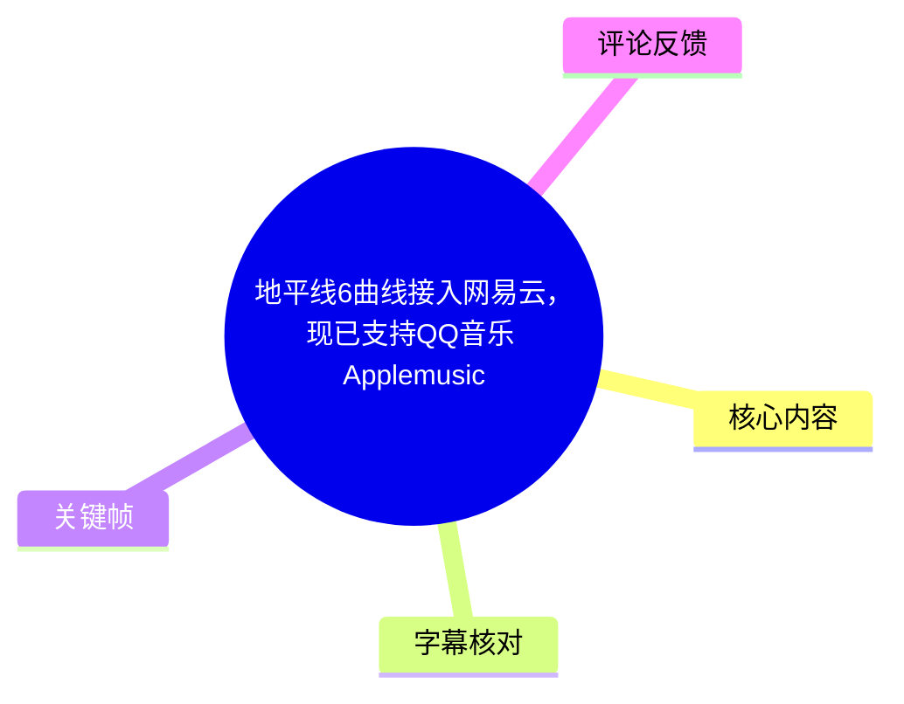
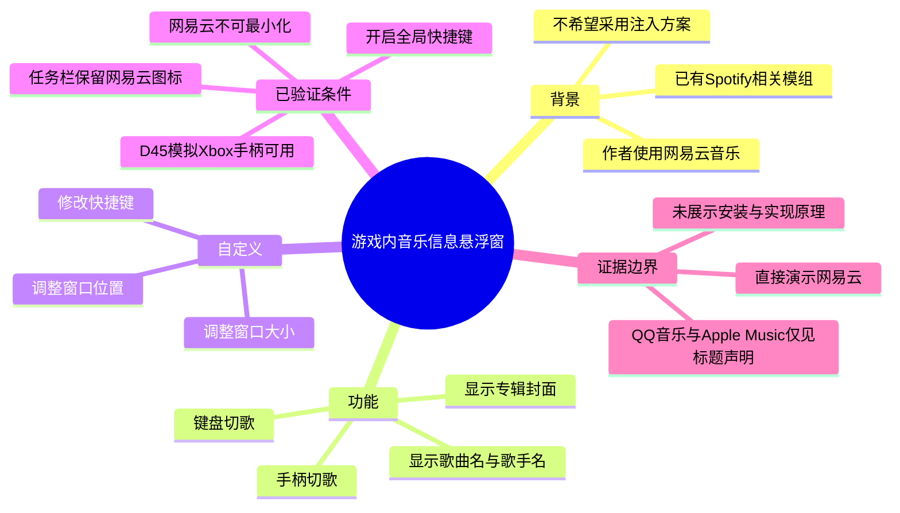
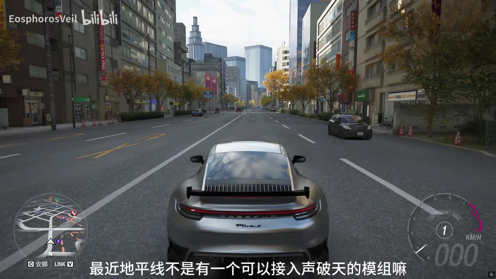
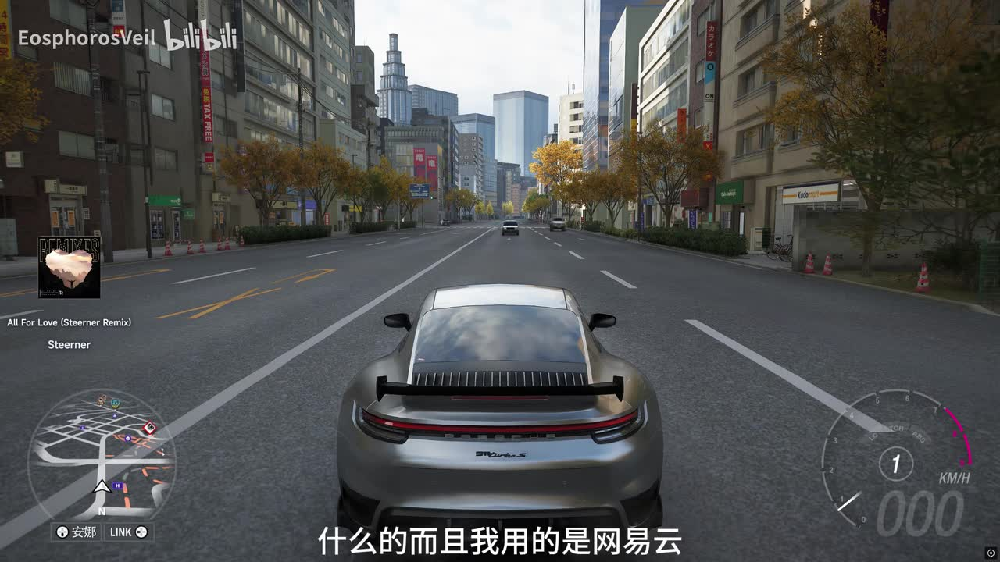
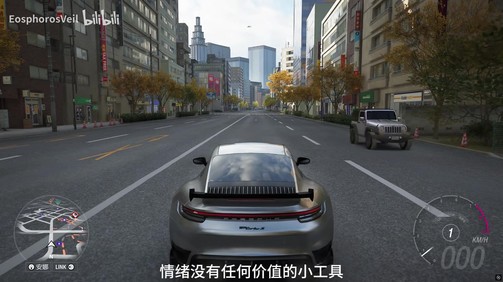
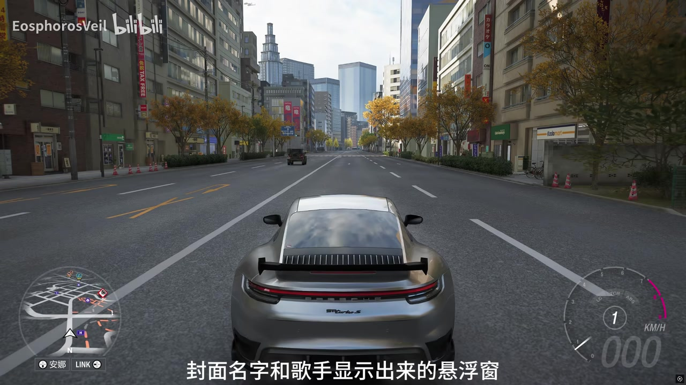

# 地平线6曲线接入网易云，现已支持QQ音乐 Applemusic

> 来源：[Bilibili 视频](https://www.bilibili.com/video/BV1PdVV6JE8e) 
> UP 主：EosphorosVeil｜视频时长：01:03｜分辨率：1920×1080 
> 视频简介仅提示“请先查看置顶评论及回复”；本次提供的素材中未包含置顶评论内容。

## 小结

视频展示的是一个为《极限竞速：地平线》驾驶场景制作的独立悬浮窗工具。UP 主的出发点是：已有可接入 Spotify（“声破天”）的相关模组，但自己使用网易云音乐、且不希望处理“注入”类方案，因此制作了一个在歌曲切换时显示**封面、歌曲名和歌手名**的小工具。

从演示画面可见，游戏画面左侧会显示专辑封面与歌曲信息；示例曲目为 **“All For Love (Steerner Remix)”**，歌手显示为 **Steerner**。该工具的定位不是将音乐服务直接嵌入游戏，而是在游戏运行时提供音乐状态的视觉叠加，因此标题中的“曲线接入”更符合其表现形式。

操作层面，作者称可通过键盘及手柄切歌；其已验证使用“D45”模拟 Xbox 手柄可以工作，但未测试其他设备。工具还支持自定义快捷键、窗口尺寸和位置，以降低游戏中使用默认网易云快捷键的不便。

已明确的使用条件包括：运行时网易云音乐**不能最小化**，任务栏需要保留网易云图标；并且必须在网易云中开启**全局快捷键**。作者称程序独立运行，“不用担心封号什么的”，但这属于作者个人说明，视频没有提供代码、工作原理、安装包来源、权限需求或官方兼容性证明，不能据此延伸为安全保证。

标题宣称“现已支持 QQ 音乐、Apple Music”，但本次语音内容和已给出的关键帧只直接演示/说明了网易云音乐；没有提供 QQ 音乐和 Apple Music 的配置、切换或实际运行画面。因此，这两项兼容性应视为标题中的作者声明，使用前仍应以发布页置顶评论、回复或后续版本说明为准。

## 思维导图

## 目录

- [背景：从 Spotify 模组到网易云悬浮窗](#背景从-spotify-模组到网易云悬浮窗)
- [核心功能：歌曲信息显示与输入切歌](#核心功能歌曲信息显示与输入切歌)
- [配置与使用步骤](#配置与使用步骤)
- [限制、风险与时效性](#限制风险与时效性)
- [关键帧索引](#关键帧索引)
- [字幕比对](#字幕比对)
- [评论分析](#评论分析)
- [处理记录](#处理记录)

## 背景：从 Spotify 模组到网易云悬浮窗 [00:00](https://www.bilibili.com/video/BV1PdVV6JE8e?t=0)

视频开头提到，近期《地平线》存在“可以接入声破天（Spotify）的模组”；作者表示自己也想使用类似能力，但“不会注入”，同时自己的音乐服务是网易云音乐。这里的“注入”具体是何种技术路线、相关 Spotify 模组名称及适配游戏版本，均未在视频中说明。

因此作者制作的方案不是视频所能证实的“游戏内直接接入网易云音乐”，而是一个独立运行的小工具：当网易云音乐切歌时，在画面上显示歌曲相关信息。作者自称其“只有情绪没有任何价值”，可理解为其强调沉浸感与视觉体验，而非游戏玩法、性能优化或音乐控制的刚需功能。

> 图：画面为城市道路驾驶场景，左下方是游戏地图和车辆 HUD。它说明工具面向的是驾驶时听歌的沉浸式场景，也提供了悬浮窗不应遮挡主要驾驶视野的画面语境。

## 核心功能：歌曲信息显示与输入切歌 [00:06](https://www.bilibili.com/video/BV1PdVV6JE8e?t=6)

### 歌曲切换时的信息展示 [00:06](https://www.bilibili.com/video/BV1PdVV6JE8e?t=6)

根据 ASR 的 00:06.500—00:21.400 语段，工具在网易云音乐切歌时可显示：

- 歌曲封面；
- 歌曲名称；
- 歌手名称。

关键帧中可见信息卡位于画面左侧、游戏小地图上方附近，采用专辑封面配合两行文本的简洁布局。示例显示：

| 字段 | 画面可读内容 |
| --- | --- |
| 歌曲名 | `All For Love (Steerner Remix)` |
| 歌手 | `Steerner` |
| 封面 | 方形专辑封面缩略图 |

> 图：该帧直接展示了歌曲封面、曲名“ All For Love (Steerner Remix) ”及歌手“Steerner”的左侧浮层，是判断工具实际输出内容与界面布局的关键证据。

### 键盘与手柄切歌 [00:21](https://www.bilibili.com/video/BV1PdVV6JE8e?t=21)

作者在 00:21.400—00:28.540 表示，切歌可通过两类输入完成：

1. **键盘**；
2. **手柄**。

已被作者实际测试的组合是“D45 去模拟 Xbox 手柄”，作者说“是可以的”。由于视频未展示设备型号全称、映射软件、手柄按键名称或设置过程，以下结论需要严格限制：

- 可以确认：作者声称其 D45 模拟 Xbox 手柄的环境可用。
- 无法确认：其他 Xbox 手柄、PlayStation 手柄、第三方手柄、原生 DirectInput/XInput 设备是否可用。
- 无法确认：切歌对应的是上一首、下一首还是其他媒体控制动作，也未展示按键映射细节。

### 快捷键与悬浮窗布局 [00:28](https://www.bilibili.com/video/BV1PdVV6JE8e?t=28)

作者指出，网易云音乐默认快捷键在游戏中“不好按”，工具提供了两个改善点：

- **可自行修改快捷键**：作者特别提到“一个键也可以方便很多”，但没有给出默认键位、可设键位范围或是否支持组合键。
- **可修改大小和位置**：可根据游戏 HUD、分辨率与个人视线习惯调整悬浮窗。

> 图：该画面强调游戏本体仍占据主要视野，适合用来理解“位置可调整”这一需求：悬浮信息应避免遮挡道路、车辆状态表和地图等驾驶信息。该帧本身未展示设置面板，不能据此推断具体的拖拽或配置方式。

## 配置与使用步骤 [00:40](https://www.bilibili.com/video/BV1PdVV6JE8e?t=40)

视频没有展示下载、安装、启动顺序或配置界面。以下步骤仅将作者**明确说明**的运行条件与功能顺序整理为检查清单，不补充未出现的命令、路径或参数。

1. **准备正在运行的网易云音乐**
   - 作者明确说“网易云也不能最小化”。
   - 同时要求任务栏中存在网易云图标。
   - 因此，若将网易云最小化到任务栏或完全隐藏，可能导致工具无法读取或控制其状态；具体原因未说明。

2. **在网易云音乐中开启全局快捷键**
   - 00:57.330—01:00.350，作者强调“用的时候一定要打开网易云的全局快捷键”。
   - 这是视频里最明确、语气最强的前置条件。

3. **启动并摆放悬浮窗**
   - 工具作为独立程序运行。
   - 根据游戏 HUD 布局调整悬浮窗大小和位置；视频未说明设置入口、保存方式或数值参数。

4. **设置并测试切歌快捷键**
   - 若游戏中不便使用网易云默认快捷键，可改用更方便的单键方案。
   - 可用键盘或手柄触发；手柄方面仅有 D45 模拟 Xbox 手柄的作者自测结论。

5. **在游戏过程中验证显示效果**
   - 切歌后应观察是否出现封面、曲名和歌手名。
   - 若无响应，优先核查：网易云是否仍未最小化、任务栏图标是否存在、全局快捷键是否已经开启。这是由作者列出的条件所推导出的排查顺序，并非视频展示的官方故障诊断流程。

> 图：该帧的画面字幕与作者对功能的口述相呼应，能帮助确认工具的信息展示范围是封面、歌曲名与歌手名；但画面没有出现工具设置页，不能将其当作安装或参数配置证据。

## 限制、风险与时效性 [00:40](https://www.bilibili.com/video/BV1PdVV6JE8e?t=40)

### 已明示限制

| 项目 | 视频中的表述 | 使用时的含义 |
| --- | --- | --- |
| 网易云运行状态 | 不能最小化，任务栏要有网易云图标 | 工具对网易云前台/任务栏状态存在依赖。 |
| 全局快捷键 | 一定要打开 | 未开启时，键盘或手柄切歌相关功能可能无法正常工作。 |
| 手柄兼容性 | D45 模拟 Xbox 手柄可用，其他未试 | 不能泛化为所有手柄均兼容。 |
| 快捷键参数 | 可以自行修改 | 只确认可修改，不知道默认键位、配置文件或组合键支持情况。 |
| 悬浮窗参数 | 可改变大小、位置 | 未给出具体范围、缩放逻辑或多显示器支持情况。 |

### 未被视频证实的事项

- **QQ 音乐与 Apple Music 支持**：仅出现于标题；本次 ASR 没有提及，关键帧也没有展示。不能据此整理出其启用方法、兼容范围或稳定性。
- **安装来源与版本**：视频未给出工具名称、下载链接、开源仓库、版本号、安装步骤或更新渠道。
- **游戏范围**：标题写“地平线6”，标签中包含“极限竞速：地平线”，但画面与口述未提供可独立核验的游戏版本信息；不宜外推至其他赛车游戏。
- **安全与封号风险**：作者称独立运行、“不用担心封号什么的”，但并无反作弊规则、服务条款或长期运行测试佐证。实际使用仍应自行核对游戏、平台及音乐服务的最新规则。
- **性能影响与隐私权限**：视频未提供 CPU/GPU/内存占用、音乐数据读取机制、网络请求、账户登录或隐私处理信息。

### 时效性

视频元数据中的发布时间为 **2026-05-30 12:10:21 UTC**，素材抓取时间为 **2026-07-16**。音乐客户端、全局快捷键行为、Windows 窗口权限、游戏反作弊策略和工具版本均可能随更新发生变化。尤其是标题内 QQ 音乐、Apple Music 的支持状态，应以发布页置顶评论及其回复中当时的说明为优先依据；但这些内容未包含在当前素材中，无法复述或验证。

## 关键帧索引

| 关键帧 | 内容 | 正文价值 |
| --- | --- | --- |
|  | 城市道路驾驶画面与游戏 HUD | 建立工具在赛车驾驶场景中使用的上下文。 |
|  | 左侧歌曲封面、曲名与歌手信息卡 | 直接证明悬浮窗展示内容及示例曲目信息。 |
|  | 未被大面积遮挡的驾驶主视野 | 有助于解释窗口位置与尺寸调整的实际需求。 |
|  | 与“封面、名字、歌手悬浮窗”相对应的字幕画面 | 作为口述功能说明的画面辅助证据。 |

> 未将其余关键帧纳入正文：当前提供的可见关键画面已足以覆盖驾驶环境、悬浮信息和功能口述；为避免对未展示细节作推断，不将其余帧强行解释为设置、兼容性或安装证据。

## 字幕比对

| 字幕来源 | 完整性 | 专有名词 | 时间轴 | 主要问题 |
| --- | --- | --- | --- | --- |
| Bilibili 站内字幕 | 未提供可用字幕 | 无法评估 | 无法使用 | 素材记录显示字幕获取过程返回 `Invalid URL`，没有可供对照的站内字幕文本。 |
| 本次 ASR 字幕 | 覆盖 00:00—01:00.350；诊断语音覆盖率约 74.69%，45.24—57.33 有约 12.09 秒无语音段 | 存在识别错误，但可由上下文/画面校正部分词语 | 有 SRT 原始时间戳，可直接用于本页时间轴 | “王易云/王易亭/网利云”应校正为“网易云”；“快捶键”应为“快捷键”；“手柠”应为“手柄”；“声破天”是 Spotify 的中文俗称。 |

本次音频 ASR 使用 `medium` 模型识别中文，语言置信度为 0.98486328125，音频时长为 62.20625 秒；诊断中**未标记** `noAudioStream=true`，且已获得带时间戳的实际语音识别结果，说明源视频存在可供识别的音轨。

最终采用**本次 ASR 的 SRT 时间戳**组织章节。由于没有站内字幕，无法做逐句对照；文本层面结合视频标题、上下文与关键帧进行了有限校正：

- `声破天`：保留作者口语说法，并在正文括注为 Spotify。
- `王易云`、`王易亭`、`网利云`：统一校正为“网易云音乐”。
- `快捶键`：校正为“快捷键”。
- `手柠`：依据上下文“模拟 Xbox”校正为“手柄”。
- `D45`：ASR 原样识别为“D45”，素材未提供清晰设备文字，故不扩展为具体品牌或型号。
- 00:45.240—00:57.330 的无语音间隔未被擅自补写为操作说明。

## 评论分析

仅分析本次可获取的热评前三条；评论反映的是用户观点，不构成对工具功能、安全性或兼容性的验证。

1. **作业快没了**（1246 赞）
   - 观点：赞赏作者“没有多言、直接开发工具”的个人开发者行动力。
   - 补充信息：无具体使用反馈、安装信息或兼容性报告。
   - 可信度边界：属于价值判断与鼓励，不能用于证明工具质量或稳定性。

2. **Octave_Ericka**（447 赞）
   - 观点：以“车载 CD 机放碟”的方式调侃替代方案。
   - 补充信息：没有涉及本工具的实际使用、配置或技术评价。
   - 可信度边界：幽默评论，不应解读为功能建议或兼容性结论。

3. **VROOML**（412 赞）
   - 观点：认可界面“简洁好看、有审美”，并表示在《神力科莎》、首都高驾驶时也有类似需求。
   - 补充信息：反映赛车驾驶场景中，用户对不破坏沉浸感的音乐信息浮层存在需求。
   - 可信度边界：评论没有说明其已在《神力科莎》使用该工具；因此不能将其视为工具支持其他游戏的证据。

## 处理记录

- Worker ID：`worker-mrj0www4-e8d79408`
- 模型：`gpt-5.6-terra`
- 使用工具与素材：
  - 视频元数据与统计信息；
  - 音频 ASR 结果：`medium`，中文识别，CUDA / `float16`；
  - ASR SRT：`asr/transcript.srt`；
  - 关键帧目录：`frames/`；
  - 热评数据：`comments/comments.json`，限制为前三条。
- 字幕选择：
  - 已检查站内字幕：未提供可用站内字幕；素材警告记录为字幕工具请求 `Invalid URL`。
  - 已检查本次 ASR：存在带真实起止时间的 7 个语段，未标记 `noAudioStream=true`。
  - 正文时间轴以 ASR SRT 的起止时间换算秒数生成，并对明显专有名词误识别作上下文校正。
- 关键帧选择依据：
  - 选用 `frame-001` 至 `frame-004`，因为它们分别呈现游戏使用环境、歌曲信息浮层、视野布局和功能口述字幕。
  - 不把没有直接展示设置、安装、QQ 音乐或 Apple Music 的画面解释为相应功能证据。
- 缓存清理：素材清单未提供缓存清理执行记录；本文不虚构清理结果。
- 未解决问题：
  - 未获得置顶评论及回复，无法确认下载方式、版本更新或标题中 QQ 音乐/Apple Music 的具体支持条件。
  - 未展示安装流程、代码/实现、快捷键默认值、窗口参数范围与性能数据。
  - 未验证 D45 以外手柄及其他音乐服务、其他游戏的兼容性。
