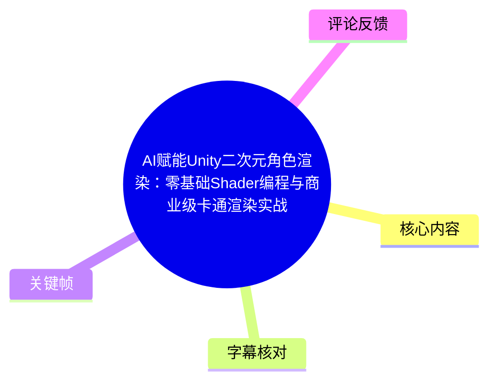
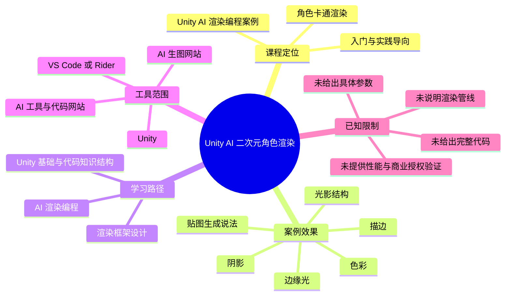
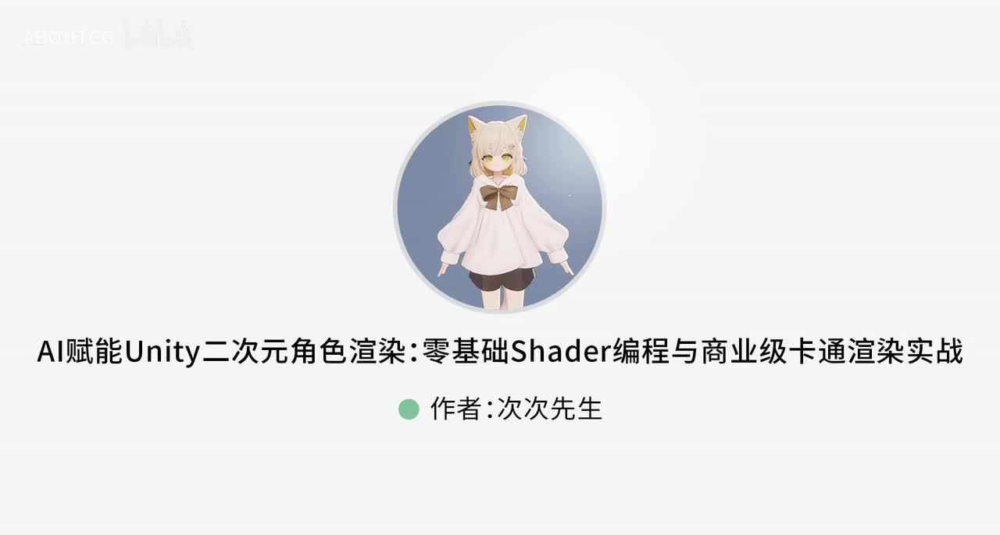
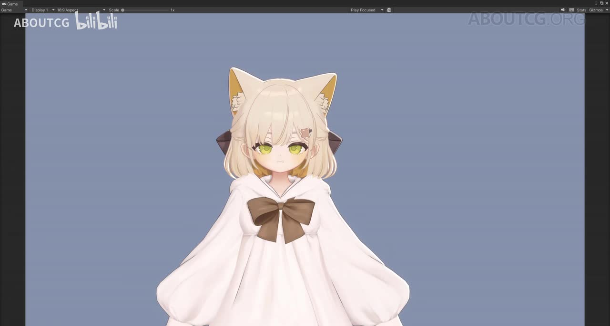
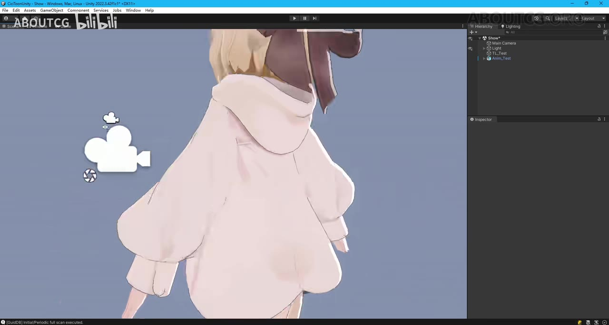
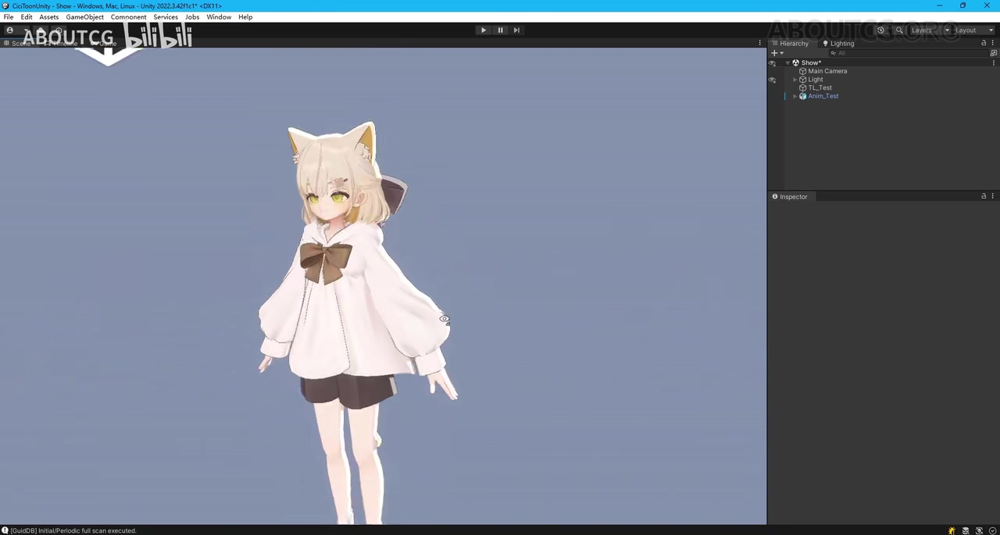

# AI赋能Unity二次元角色渲染：零基础Shader编程与商业级卡通渲染实战

> 来源：[Bilibili 视频](https://www.bilibili.com/video/BV1VVjQ6VEMS) 
> UP 主：ABOUTCG｜合集：AIcode｜时长：02:27｜视频画面：1920×1030 
> 本视频是课程导览性质的短片，介绍课程目标、案例效果、学习路径与工具范围，不包含完整 Shader 代码、参数配置或调试过程演示。

## 小结

视频介绍了一门以 Unity 二次元角色为案例的 AI 辅助渲染编程课程。课程的核心不是直接展示某一段 Shader 成品代码，而是提出一条学习路径：先建立 Unity 与代码结构的基础，再设计渲染框架，最后借助 AI 进行渲染编程。

案例画面为一名卡通风格的兽耳角色。视频称，角色的光影结构、阴影、边缘光、色彩、描边，以及字幕中称为“法庭贴图”的贴图内容，基本由 AI 生成；其中“法庭贴图”与上下文及 ASR 均存在识别歧义，不能据此确定其实际技术名词或贴图类型。

视频特别强调，代码规模可以达到“几千行”，但称这些代码基本由 AI 生成。这传达的经验是：AI 可以参与复杂渲染代码的生成，但视频并未证明其生成代码可以不经人工审阅、测试与性能验证便直接用于项目。

课程定位为入门与实践导向：学习后，观众应能初步理解 Unity 渲染、AI 辅助渲染编程的接入思路，并自行尝试用 AI 辅助渲染。UP 主在唯一可获取热评中补充，课程还会涉及角色渲染思路、渲染模块与框架设计，以及利用 AI 调试渲染。

视频列出的软件与资源范围包括 Unity、VS Code、Rider，以及 AI 生图网站、AI 工具和 AI 代码网站；但没有说明 Unity 版本、渲染管线（Built-in/URP/HDRP）、目标平台、具体 AI 服务、模型、提示词、Shader 类型、性能指标或商业授权条件。

时效性方面，元数据显示视频发布时间为 2026-06-24；AI 工具、网站功能、价格、代码质量和 Unity 生态均可能随后变化。视频中的“商业级”属于标题表述，当前素材未提供商业项目案例、性能测试、兼容性测试或授权说明，不能将其视为已被独立验证的工程结论。

## 思维导图

## 目录

- [视频定位与案例效果](#视频定位与案例效果-0008)
- [角色卡通渲染案例：AI 参与生成的内容](#角色卡通渲染案例ai-参与生成的内容-0021)
- [代码规模与课程学习成果](#代码规模与课程学习成果-0044)
- [三阶段学习路线](#三阶段学习路线-0122)
- [软件、AI 工具与课程范围](#软件ai-工具与课程范围-0145)
- [可执行的学习与验证步骤](#可执行的学习与验证步骤-0122)
- [结论、限制与时效性](#结论限制与时效性-0219)
- [字幕比对](#字幕比对)
- [评论分析](#评论分析)
- [处理记录](#处理记录)

## [视频定位与案例效果](https://www.bilibili.com/video/BV1VVjQ6VEMS?t=8) [00:08]

视频在约 00:08 开始口播，介绍主题为“Unity 的 AI 渲染编程案例”。课程拟借助 AI 编写渲染代码，案例对象为二次元风格的角色渲染。

这段内容是课程宣传与导览，不是完整教学实录。它明确给出“AI 辅助编写渲染代码”的方向，但没有展示以下实现信息：

- Shader 使用的语言或框架，例如 ShaderLab、HLSL、Shader Graph 或自定义 Render Pass；
- 使用的 Unity 渲染管线；
- 角色模型、材质和贴图的来源及许可证；
- AI 的具体产品、模型版本、上下文输入方式或提示词；
- 从 AI 输出到 Unity 可运行 Shader 的调试、编译与验证流程。

> 图：关键帧展示课程标题和居中的兽耳角色形象，可确认视频聚焦“AI、Unity、二次元角色渲染”这一组合主题。它的价值在于建立案例对象与课程定位；画面本身未给出技术参数。

## [角色卡通渲染案例：AI 参与生成的内容](https://www.bilibili.com/video/BV1VVjQ6VEMS?t=21) [00:21]

视频以“小兔娘”角色作为效果展示对象，依次提到以下视觉元素：

1. **光影结构**：角色整体的受光与明暗关系。
2. **阴影**：视频提及角色上的阴影效果，但未交代阴影来自实时光照、贴图、Ramp、屏幕空间效果还是其他实现。
3. **边缘光**：即角色轮廓附近的亮边视觉效果。视频未给出边缘光强度、颜色、视角依赖计算或遮罩控制参数。
4. **色彩**：视频称画面中的色彩也基本由 AI 生成，但没有区分是材质颜色设计、贴图内容、调色流程还是 Shader 内的颜色计算。
5. **描边**：视频点名了描边效果，但没有说明采用背面扩张、屏幕空间边缘检测、几何描边或其他实现路线。
6. **贴图**：中文站内字幕将某项称为“法庭贴图”，ASR 识别为“发现贴图”；多语字幕对此处也存在明显不稳定翻译。该术语无法仅据素材可靠还原，故本文保留为“字幕所称贴图”，不擅自改写为某种确定贴图类型。

视频的原意是强调：上述视觉资产或效果相关内容“基本上”由 AI 生成。这里的“基本上”并不等于所有渲染步骤完全自动化，也不等于 AI 输出已通过工程质量、性能或版权审查。

> 图：关键帧显示 Unity 的 Game 视图与角色正面近景，可用于观察角色的浅色服装、轮廓和整体卡通风格。它是视频所述效果的视觉证据，但单帧无法判定阴影、边缘光和描边各自的具体算法。

> 图：关键帧展示 Unity 编辑器内的角色服装局部。该画面对理解“角色材质效果”有价值，能够看到服装褶皱处的明暗与轮廓线；不过素材没有给出对应材质面板、Shader 属性或纹理通道，不能由画面反推参数。

> 图：关键帧展示 Unity 编辑器中角色的全身构图及场景层级区域。它说明案例在 Unity 环境中呈现，但层级、灯光和 Inspector 信息均不足以确认完整技术配置。

## [代码规模与课程学习成果](https://www.bilibili.com/video/BV1VVjQ6VEMS?t=44) [00:44]

视频在展示角色效果后转向代码结构，强调代码“并不简单”，并称可以看到“几千行”长度的代码；随后说明这些代码基本由 AI 生成。

这一表述可提炼为两层信息：

- **复杂度信息**：课程所涉渲染代码并非仅是极短的示例片段，而可能包含较多逻辑。
- **工作流信息**：AI 被定位为代码生成的参与者，用于协助完成渲染编程。

不过，视频未展示实际代码内容，无法据此确认代码结构、模块边界、可编译状态、异常处理、平台兼容性或性能表现。对于实际开发，较稳妥的使用方式应是将 AI 输出视为候选实现，并进行人工审阅和 Unity 内验证，而非默认其正确。

视频承诺的学习结果包括：

- 初步了解 Unity 渲染；
- 初步了解 AI；
- 初步了解如何接入 AI 辅助的渲染编程案例；
- 在课程后自行尝试使用 AI 辅助渲染。

需要注意，“初步了解”是视频原有定位，因此它没有承诺观众完成后即可独立构建完整商业项目，也没有给出学习时长、作业、源码交付或答疑机制。

## [三阶段学习路线](https://www.bilibili.com/video/BV1VVjQ6VEMS?t=82) [01:22]

视频将学习过程划分为三个模块、三个阶段：

| 阶段 | 视频表述 | 可确定的学习目标 | 素材未提供的部分 |
| --- | --- | --- | --- |
| 第一阶段 | 学习 Unity 基础、代码知识结构 | 建立 Unity 与代码结构的基础认知 | 具体 Unity 版本、C# 基础要求、Shader 前置知识 |
| 第二阶段 | 进行渲染框架设计 | 先设计渲染组织方式，再进入实现 | 框架图、模块职责、接口与目录结构 |
| 第三阶段 | 基于渲染框架设计，进行 AI 渲染编程 | 让 AI 参与代码编写 | AI 工具名称、提示词、上下文组织、调试示例 |

这一路线的关键经验是**先设计，再让 AI 协助实现**。视频没有把 AI 描述为绕过基础知识与架构设计的替代品：学习路径仍以 Unity 基础和渲染框架设计为前置步骤。

## [软件、AI 工具与课程范围](https://www.bilibili.com/video/BV1VVjQ6VEMS?t=105) [01:45]

视频列出课程会用到的软件与网站类别：

| 类别 | 视频提及内容 | 可确定信息 |
| --- | --- | --- |
| 游戏引擎 | Unity | 作为角色渲染案例的运行与编辑环境 |
| 代码编辑器 | VS Code | 可作为编辑工具之一 |
| IDE | Rider | 站内英文字幕明确为 Rider；中文字幕写作“read”，应以英文字幕的产品名为准 |
| AI 图像资源 | AI 生图网站 | 会介绍相关网站，但未列出站点名称 |
| AI 辅助工具 | AI 工具 | 未列出具体工具、版本与用途边界 |
| AI 编程资源 | AI 代码网站 | 未列出具体网站、模型或访问方式 |

视频最后表示，会讲解如何“让 AI 用得更好”、让 AI 高效辅助开发。这是课程的目标方向，但没有在该短片中提供可复现的提示词模板、分工规则、代码审查清单或调试参数。

## [可执行的学习与验证步骤](https://www.bilibili.com/video/BV1VVjQ6VEMS?t=82) [01:22]

以下步骤按视频明确给出的三阶段路线整理，并将未在视频中交代的内容标记为需学习者自行补足，而非视频已提供的操作细节。

1. **建立 Unity 与代码基础**
   - 按视频第一阶段，先学习 Unity 基础和代码知识结构。
   - 建议在实际操作中确认项目所使用的 Unity 版本与渲染管线；这两项信息未在视频中公开。
   - 理解角色、材质、Shader 与灯光在项目中的基本关系。

2. **先拟定渲染框架**
   - 按视频第二阶段，设计渲染框架。
   - 根据 UP 主热评补充，课程会涉及“拟定和设计渲染模块和渲染框架”。
   - 在向 AI 提问前，至少应明确希望实现的视觉模块，例如阴影、边缘光、描边与色彩控制；这些模块名称来自视频，但具体算法仍需自行选定或在完整课程中学习。

3. **让 AI 协助编写渲染代码**
   - 按视频第三阶段，在框架设计基础上进行 AI 渲染编程。
   - 视频的经验重点在于让 AI 参与复杂代码生成，而非只生成孤立片段。
   - 由于素材未给出任何提示词、代码或接口，不能从本视频复现具体调用步骤。

4. **在 Unity 内验证视觉结果**
   - 视频画面显示角色在 Unity 编辑器与 Game 视图中运行，因此实际流程应包含 Unity 内观察与验证。
   - 应分别检查正面、局部、全身和不同视角下的效果；视频确实展示了正面、服装局部与全身画面。
   - 阴影、边缘光、描边是否正确，以及不同平台性能如何，均未在视频中测试展示。

5. **对 AI 输出进行调试与审阅**
   - UP 主热评称课程会利用 AI 进行渲染调试。
   - 该评论是发布者提供的课程补充，而非视频中已展示的完整调试记录。
   - 因没有公开报错案例、调试日志与最终代码，无法总结具体故障处理命令或参数。

## [结论、限制与时效性](https://www.bilibili.com/video/BV1VVjQ6VEMS?t=139) [02:19]

### 可迁移经验

- 学习顺序应是：**基础认知 → 渲染框架设计 → AI 辅助实现**。
- AI 在视频中被定位为渲染代码和视觉资源生成的辅助力量，但不替代对 Unity 渲染结构的理解。
- 对二次元角色效果，可从视频点名的光影、阴影、边缘光、色彩和描边等视觉目标拆分需求，再进入实现与验证。

### 关键限制

- 本片仅约 02:27，属于课程导览，未展示完整 Shader、材质配置、AI 提示词、代码仓库或工程文件。
- 未说明 Unity 版本、渲染管线、目标平台、角色资产来源、AI 服务名称与模型版本。
- 未提供性能数据，如帧率、Draw Call、GPU 耗时、移动端适配或内存占用。
- 未给出商业授权、AI 生成资产权属或第三方角色模型使用许可信息。
- 标题中的“零基础”“商业级”为课程宣传表述；现有素材不足以独立验证零基础学习门槛或商业生产可用性。
- “法庭贴图”一词在站内中文字幕、ASR 和其他语言字幕中均存在不稳定性，不能作为确定技术名词引用。

### 时效性

元数据显示视频发布时间为 2026-06-24。视频中提到的 AI 生图网站、AI 工具与 AI 代码网站均未点名；即使在发布时可用，其访问条件、费用、模型能力、政策与版权条款也可能变化。实践时应以所使用工具的当前官方文档、Unity 当前版本文档及项目授权要求为准。

## 字幕比对

| 字幕来源 | 完整性 | 专有名词 | 时间轴 | 主要问题 |
| --- | --- | --- | --- | --- |
| Bilibili 站内中文字幕 `p01-ai-zh.srt` | 覆盖约 00:08–02:21，句子切分完整 | Unity、VS Code 可辨；“read”需结合英文字幕校正为 Rider | 精细，最小片段可至数百毫秒 | 存在口语转写与个别词语歧义，如“法庭贴图” |
| Bilibili 站内英文字幕 `p01-ai-en.srt` | 与中文字幕同样完整 | 明确出现 Unity、VS Code、Rider | 与中文站内字幕对齐 | 个别翻译不自然；“courtroom flooring texture”显然不能可靠解释中文歧义词 |
| 本次 ASR `medium` | 识别到 00:07.980–02:20.980；语音覆盖率 90.6% | Unity、VS Code 可辨，但 Rider 被识别为“Read”；部分技术词错误 | 有时间戳，但共 6 个长分段，每段约 12–24 秒 | “渲染”误识别为“渲览/渲感”，“代码结构”等出现乱码；“法庭贴图”识别为“发现贴图” |

### 最终字幕选择

正文以**站内中文字幕的精细时间轴**为主，并用站内英文字幕与本次中文 ASR 交叉核验：

- 站内中文与 ASR 在主题、案例效果、三阶段路径和工具类别上高度一致。
- 本次 ASR 诊断显示存在正常音频流：识别语言为中文、置信度约 `0.9873`、音频时长约 `146.80` 秒；结果中**未标记 `noAudioStream=true`**，因此没有音轨缺失问题。
- “Rider”采用站内英文字幕的明确产品名校正：中文站内字幕为“read”，ASR 为“Read”，均不足以单独作为正确拼写依据。
- “法庭贴图/发现贴图”未能通过字幕互证得到可靠术语，本文不作技术名词归一化。
- 本文各正文时间轴链接优先使用站内 SRT 的真实起止时间换算秒数，而非按文本顺序估算；关键帧没有提供独立时间戳元数据，故不以关键帧反推章节时间。

## 评论分析

仅获取到 1 条热评，未达到前三条；以下不将评论内容视为已独立验证的事实。

1. **ABOUTCG（UP 主，获赞 0）**
   - 评论提供了课程介绍页链接：`https://www.aboutcg.org/courseDetails/3090/introduce`。
   - 补充称课程将学习角色渲染思路、拟定和设计渲染模块与渲染框架、利用 AI 编写角色渲染编程，以及利用 AI 进行渲染调试。
   - 这与视频中的“三阶段”路线一致，尤其强化了“先设计模块与框架，再进行 AI 编程”的流程。
   - 可信度边界：评论作者为 UP 主，属于课程发布方说明，可作为课程范围补充；但评论未提供代码、性能数据、授权资料或学员成果，因此不能验证其商业适用性与实际教学深度。

其余两条热评未在提供素材中获取，故不作补充性分析。

## 处理记录

- **Worker ID**：`worker-mrj0wjed-b0c290ad`
- **模型**：`gpt-5.6-terra`
- **ASR 模型**：`medium`，CUDA，`float16`；识别语言为中文，语言概率 `0.9873046875`。
- **使用的素材与工具结果**：视频元数据、站内多语言 SRT、`asr/transcript.srt`、`asr/asr-result.json`、关键帧目录 `frames/`、热评数据 `comments/comments.json`。
- **字幕选择**：以站内中文字幕 `p01-ai-zh.srt` 的细粒度时间轴为正文定位依据；以站内英文字幕校正 Rider 名称；检查并对照本次 ASR，未直接采用其错误转写词。
- **关键帧依据**：选用 `frame-001.jpg` 确认课程主题与角色案例，`frame-002.jpg` 观察角色正面渲染效果，`frame-003.jpg` 观察服装局部光影与轮廓，`frame-004.jpg` 确认 Unity 编辑器内的全身案例展示。素材未提供这些关键帧的独立时间戳，因此未将其作为时间轴推断依据。
- **缓存清理**：提供的素材中没有缓存清理执行记录；本文不虚构清理结果。
- **未解决问题**：未获得完整课程、Shader 源码、材质参数、AI 工具与模型名称、Unity 渲染管线信息、性能测试、资产版权与商业授权信息；“法庭贴图”术语无法由现有字幕和 ASR 可靠校正。
