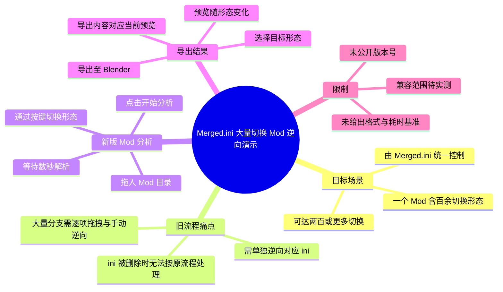
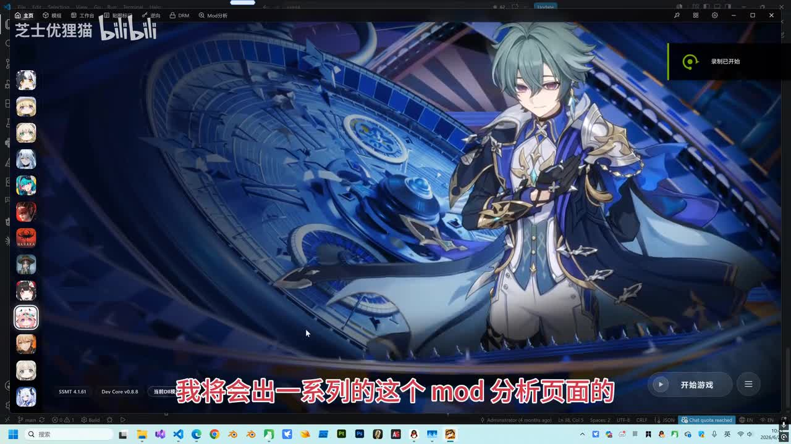
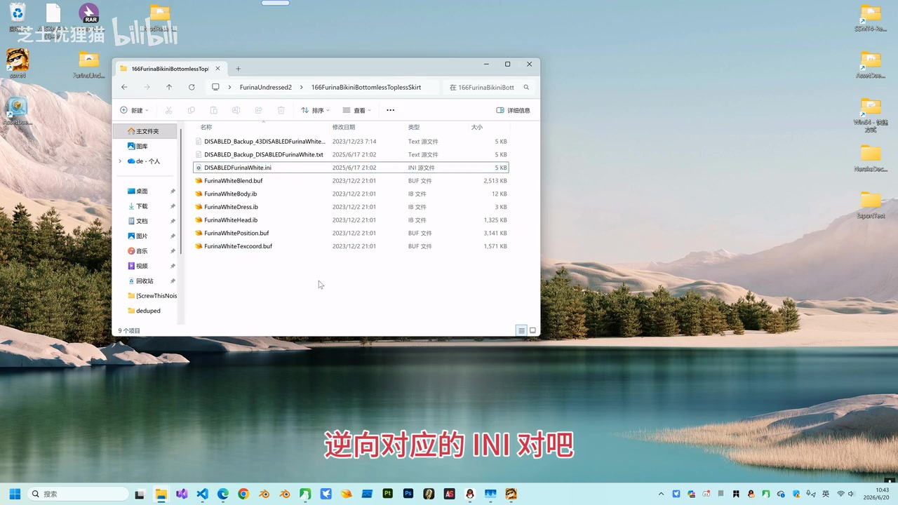
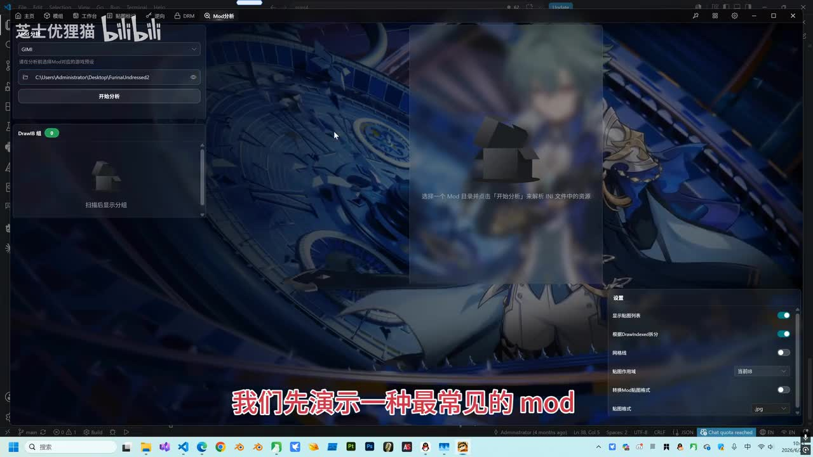
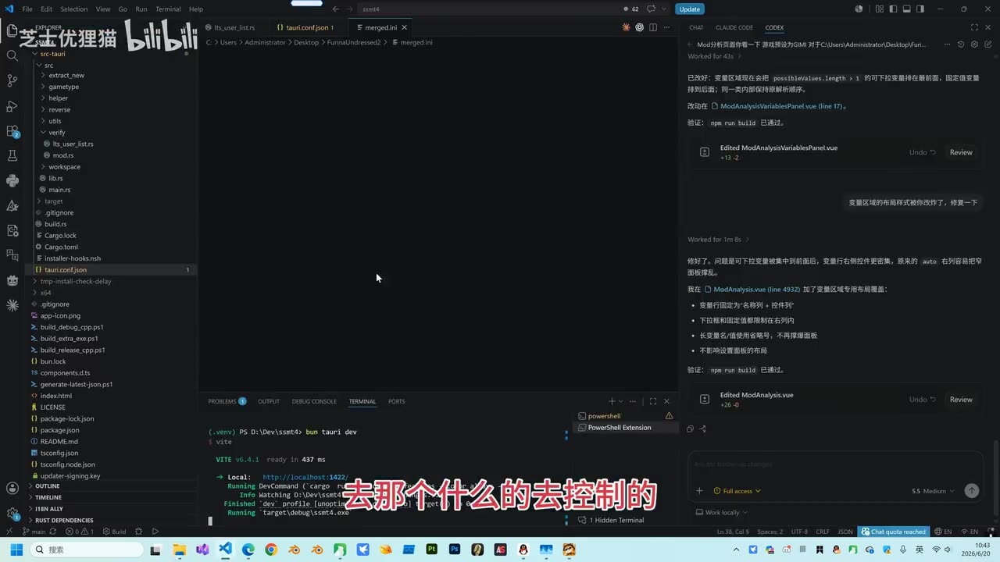

# 演示：Merged.ini几百个切换Mod轻松逆向

> 来源：[Bilibili 视频](https://www.bilibili.com/video/BV1hijE6EESq)  
> UP 主：芝士优狸猫｜时长：02:09｜分辨率：3840×2160  
> 视频简介：演示 Mod 分析页面对基于 `Merged.ini` 的大量切换 Mod 进行逆向并导入 Blender 的流程。

## 小结

本视频是“Mod 分析页面”使用演示系列的第一节，针对一种常见但处理量很大的 Mod 组织形式：一个 Mod 内含一百、两百乃至更多可切换形态，并通过一个 `Merged.ini` 统一控制。

作者指出，旧流程下，如果要对该类 Mod 执行一键逆向，通常还需要进入对应内容并单独逆向其 `.ini` 文件；若作者删除了该 `.ini`，则只能将大量分支逐个拖入并手动逆向，操作成本很高。

视频演示的新版“Mod 分析”流程是：将 Mod 目录拖入分析页面，点击“开始分析”，等待数秒完成解析；随后在页面中通过按键切换不同形态，并观察预览区域随当前形态同步变化。

核心结果是：在当前演示环境中，用户选定某个形态后执行导出，导入 Blender 的内容会与分析页面中该形态的当前预览保持一致。作者据此宣称，这类“数百切换、由 Merged.ini 控制”的场景已可被该方案处理。

该视频适合需要整理或逆向大量切换 Mod、并希望将特定形态导出至 Blender 的用户。它是功能演示而非完整教程：未展示软件获取方式、版本号、实际导出文件格式、耗时基准、失败案例，以及对不同游戏/Mod 结构的兼容性范围。

时效性方面，视频中的“最新版本 Mod 分析”是发布时的功能表述；软件界面、功能可用性及兼容性可能随版本更新改变。应以实际安装版本和待处理 Mod 的目录结构为准。

## 思维导图

## 目录

- [背景：大量切换 Mod 的逆向瓶颈](#背景大量切换-mod-的逆向瓶颈)
- [演示环境与目标目录](#演示环境与目标目录)
- [新版 Mod 分析的操作步骤](#新版-mod-分析的操作步骤)
- [形态切换、预览与 Blender 导出](#形态切换预览与-blender-导出)
- [参数、经验与适用边界](#参数经验与适用边界)
- [结论与时效性](#结论与时效性)
- [关键帧索引](#关键帧索引)
- [字幕比对](#字幕比对)
- [评论分析](#评论分析)
- [处理记录](#处理记录)

## [背景：大量切换 Mod 的逆向瓶颈](https://www.bilibili.com/video/BV1hijE6EESq?t=0)

视频开头说明，作者将围绕“Mod 分析页面”制作一系列使用演示，重点涉及较极端的 Mod 情况。本节选取的是较常见的一类：一个 Mod 中存在 **100 多个切换**，甚至可能达到 **200 多个切换**，并由一个 `Merged.ini` 文件进行控制。

这里的难点并不在于单个形态本身，而在于形态数量与控制文件的关系：

1. 一个 `Merged.ini` 可能汇总或控制大量切换分支。
2. 按作者描述，旧的一键逆向流程仍需进入对应内容，单独逆向对应的 `.ini`。
3. 如果 Mod 作者删除了该 `.ini`，原有流程无法直接复用。
4. 在 `.ini` 缺失时，用户可能不得不逐个拖拽分支并手动逆向；面对上百个切换，工作量显著上升。

作者将这类场景概括为“很麻烦”：无论是逐个自动逆向，还是在 `.ini` 丢失后逐个手动逆向，都会产生大量重复操作。

> 图：画面显示游戏角色预览及左侧工具界面，字幕说明这是“Mod 分析页面”系列演示的开端。该帧用于建立视频的工具与任务背景，但未展示完整配置参数。

## [演示环境与目标目录](https://www.bilibili.com/video/BV1hijE6EESq?t=25)

在介绍 `Merged.ini` 的控制模式后，视频短暂展示开发环境及目标 Mod 文件目录。画面中可以看到一个资源目录，包含多个以角色/部件命名的 `.buf`、`.ib` 文件，以及一个 `.ini` 文件；这说明演示对象属于由多个资源文件组成的 Mod 目录。

需要注意：

- 视频字幕与画面能确认存在 `.ini`、`.buf`、`.ib` 等文件类型，但未完整讲解各文件的语义。
- 画面中出现的具体目录名和文件名属于演示样例，不应推广为必须使用的命名规范。
- 作者重点讨论的是“由 `Merged.ini` 控制的大量切换”这一结构，而不是某个单独资源文件的逆向方法。

> 图：Windows 文件资源管理器展示了目标目录中的 `.ini`、`.buf`、`.ib` 等资源文件。它补充说明了视频所说的“拖入目录”是面向完整 Mod 资源目录，而不是只选择某一个模型文件。

## [新版 Mod 分析的操作步骤](https://www.bilibili.com/video/BV1hijE6EESq?t=49)

作者在约 00:49 开始展示新版 Mod 分析页面，并给出实际操作顺序。依据 ASR 时间轴，可整理为以下流程。

### 步骤 1：准备待分析的 Mod 目录

将包含目标 Mod 资源的目录准备好。视频强调的是“把这个目录拖过来”，因此输入对象是目录。

> 前提：该目录需要是待处理 Mod 对应的资源目录。视频未说明是否支持压缩包、嵌套目录、多个 Mod 目录批量输入或仅输入单个 `.ini` 文件。

### 步骤 2：拖入目录

把目标目录拖放到 Mod 分析页面中。画面中的分析界面包含目录输入区域和“开始分析”按钮。

> 图：左侧界面可见目录路径输入区域及“开始分析”按钮，中央区域在未完成分析时提示选择 Mod 目录并进行分析。该帧直接对应“拖入目录”的操作入口。

### 步骤 3：点击“开始分析”

目录进入页面后，点击“开始分析”。作者没有展示命令行、脚本或额外配置文件编辑，演示的入口即页面按钮。

### 步骤 4：等待解析完成

作者提示：当文件较多时，分析可能会“多等几秒”。这是一条唯一明确的耗时描述，但没有给出精确秒数、硬件配置、文件数、资源总大小或性能测试数据。

因此可得到的操作经验是：

- 文件量较多时，不应在点击后立即认定任务失败；
- 需等待页面完成分组/显示；
- “几秒”仅是作者对本样例的口头描述，不构成性能承诺。

### 步骤 5：确认形态已被识别并显示

解析完成后，作者强调内容会“直接就显示出来”。这意味着新版功能的目标是在分析阶段识别 `Merged.ini` 所关联的大量切换，并将可操作形态呈现在分析页中。

视频未展示以下信息，不能据此补充推断：

- 具体解析规则；
- 对损坏、加密、语法不完整 `.ini` 的容错策略；
- 对“作者删除 `.ini`”这一情况是否仍能自动恢复全部切换关系；
- 分析结果的保存位置、可否导出或复用；
- 失败时的错误提示与排查路径。

## [形态切换、预览与 Blender 导出](https://www.bilibili.com/video/BV1hijE6EESq?t=70)

解析结果出现后，作者继续演示在页面内切换形态。其要点是：通过按键切换不同形态时，预览区域会随之改变。

### 形态切换行为

作者口述该 Mod 有“100 多个形态”，并依次提到第三、第四个形态。视频的可验证演示逻辑为：

1. 当前分析结果中存在多个可选形态；
2. 在页面内进行按键切换；
3. 每切换一个形态，预览区域内容相应变化；
4. 用户可从多个形态中选择自己需要的目标状态。

这里的“100 多个形态”是作者对该演示资源的陈述，并非所有 `Merged.ini` Mod 的固定数量。

### 以当前预览状态为准导出

在约 01:34 至 01:58，作者说明选择目标形态后，可在界面中执行导出。ASR 将相关按钮识别为“导出字幕”，但结合上下文“导出后进入 Blender 的内容”和“当前预览”，该处显然是在描述导出操作；由于缺少可读的按钮特写与站内字幕，本文不将按钮中文名称作为已确认事实。

作者给出的结果关系是：

> 分析页面当前显示什么形态，导入 Blender 后就对应什么形态。

随后画面展示 Blender 中的导入结果，作者称其与当前预览“是一模一样的”。这构成视频最重要的功能验证：导出对象与分析页中当前选择的形态一致。

> 图：画面包含项目代码、`merged.ini` 文件标签及工具开发相关界面，可辅助理解该功能围绕 `Merged.ini` 处理逻辑展开。此图不是最终 Blender 验证画面，不能用于推定具体算法实现。

### 导出操作的最小闭环

按视频中的实际顺序，可复现为：

1. 拖入完整 Mod 目录；
2. 点击“开始分析”；
3. 等待资源较多时的额外解析时间；
4. 确认形态已显示；
5. 用页面提供的按键方式切换形态；
6. 观察预览是否变化，并停留在目标形态；
7. 从页面执行导出；
8. 在 Blender 中检查导入内容是否与导出前预览一致。

## [参数、经验与适用边界](https://www.bilibili.com/video/BV1hijE6EESq?t=94)

### 视频明确给出的数量与时间参数

| 项目 | 视频信息 | 解读 |
| --- | --- | --- |
| 视频时长 | 129 秒（素材诊断为 128.576 秒） | 本文时间轴以 ASR 的真实分段时间为依据。 |
| 演示对象切换数量 | 100 多个 | 作者对当前示例的描述。 |
| 极端情形举例 | 200 多个切换 | 作者用以说明该类 Mod 的规模。 |
| 分析等待时间 | 文件多时“多等几秒” | 无精确耗时、硬件和资源规模数据。 |
| ASR 语音覆盖 | 124.95 秒，约 97.18% | 原视频有持续音轨，ASR 基本覆盖讲解内容。 |

### 可迁移经验

- **先分析目录，再选择形态。** 对大量分支逐一拖拽的低效路径，视频所演示的替代方案是以 Mod 目录为整体输入，让分析页面先生成可切换的结果。
- **以预览作为导出前检查点。** 在执行导出前切换至目标形态，并确认预览变化，是减少导出错形态的重要步骤。
- **文件多时预留等待。** 作者明确提醒分析文件多时要等待数秒，实际操作中不宜过早中断。
- **区分“已展示能力”与“广泛兼容性”。** 视频只展示了一个样例；“完全通杀”是作者的结论性表达，不能替代对其他目录结构、资源数量或游戏版本的实测。

### 未披露或未验证的关键限制

1. **软件版本不明。** 作者称为“最新版本”的 Mod 分析，但视频未读出工具版本号、发布日期或下载渠道。
2. **操作系统与依赖不完整。** 画面为 Windows 桌面环境，但未说明 Blender 版本、插件要求或运行依赖。
3. **导出格式未确认。** 视频确认可导入 Blender，但未展示文件扩展名、贴图处理方式、骨骼/权重保留情况及材质配置。
4. **缺失 `Merged.ini` 的实际演示不足。** 作者以“有些作者会把 `.ini` 删掉”为旧流程痛点，但本视频没有完整展示一个已删除 `Merged.ini` 的样例如何被新版功能处理。
5. **批量与异常处理未展示。** 未展示一次处理多个目录、解析失败、路径含特殊字符、资源缺失、重复哈希或版本不匹配等情况。
6. **“完全通杀”应视为待验证主张。** 这是作者对类似场景的推广性结论；在生产任务中仍应先以小规模样例验证分析结果与 Blender 导出结果。

## [结论与时效性](https://www.bilibili.com/video/BV1hijE6EESq?t=118)

本节演示的价值在于，将“上百个切换、由 `Merged.ini` 控制”的 Mod 处理过程压缩为一个可视化工作流：**目录分析 → 形态切换 → 预览确认 → 导出到 Blender**。

视频实际证明的是：作者所展示的样例可以在新版 Mod 分析页面中显示大量形态，且切换形态会同步改变预览，导出后 Blender 中的内容与导出前当前预览对应。

但使用时应保持边界意识：

- 不要把一个样例的成功直接等同于所有 `Merged.ini` Mod 都可无条件处理；
- 若源 Mod 的 `.ini` 已被删除、资源不完整、结构异常或版本不同，应单独验证；
- 不要根据 ASR 中的“导出字幕”等误识别文字寻找按钮，应以软件实际界面为准；
- 视频发布于 2026-06-20，作者所称“最新版本”具有时间敏感性，后续更新可能改变入口、功能或结果。

## [关键帧索引](https://www.bilibili.com/video/BV1hijE6EESq?t=0)

| 关键帧 | 正文用途 | 画面价值 |
| --- | --- | --- |
|  | 背景说明 | 展示游戏画面与分析工具共存的演示环境，建立主题。 |
|  | 操作步骤 | 直观呈现目录输入与“开始分析”入口，支持“拖入目录后分析”的叙述。 |
|  | 技术背景 | 可见 `merged.ini` 标签，辅助确认视频讨论对象与 Merged.ini 有关。 |
|  | 输入范围 | 展示包含 `.ini`、`.buf`、`.ib` 文件的资源目录，说明输入是一个 Mod 目录。 |

> 未将其余关键帧强行插入正文：当前提供的帧中，以上四张与背景、目录输入及资源结构的对应关系最明确。未根据未提供的帧内容补写 Blender 具体界面细节。

## [字幕比对](https://www.bilibili.com/video/BV1hijE6EESq?t=1)

| 字幕来源 | 完整性 | 专有名词 | 时间轴 | 主要问题 |
| --- | --- | --- | --- | --- |
| Bilibili 站内字幕 | 不可用 | 无法核验 | 无法使用 | 素材明确标注“未提供可用站内字幕”；抓取过程记录了 `Invalid URL` 警告。 |
| 本次 ASR 字幕 | 较完整，6 段覆盖约 124.95 秒语音 | 存在误识别 | 可用 | `mode/modes`、`merge`、`mild-ni`、`逆象/逆响`、`导出字幕`等词存在明显语音识别误差。 |

### 最终字幕选择

本文采用**本次 ASR 时间轴**作为时间定位依据。ASR 使用 `medium` 模型识别中文，语言置信度为 `0.99951171875`，带有真实分段起止时间；诊断显示语音覆盖约 `97.18%`，首段从 `00:00:00.620` 开始，末段至 `00:02:07.650`，没有大间隔告警。

源素材中**没有** `noAudioStream=true` 标记，且提供了 `audio/audio.wav`，因此不能将站内字幕缺失误判为“视频没有音轨”；本视频存在音轨，并已对该音轨执行 ASR。

### 基于上下文与关键帧的校正

| ASR 原文/近似识别 | 本文处理 | 校正依据 |
| --- | --- | --- |
| `mode`、`modes` | Mod | 标题、视频简介、标签均使用“Mod”。 |
| `merge的.ini` | `Merged.ini` | 视频标题与简介明确给出 `Merged.ini`。 |
| `mild-ni` | `Merged.ini` | 该词位于“几百个切换使用……这种”的总结语境，且标题已给出准确文件名。 |
| `逆象`、`逆响` | 逆向 | 全句在讨论 Mod/INI 的逆向操作，属于同音或近音误识别。 |
| `导出字幕` | 不将其作为确认的 UI 文案 | 上下文是在描述导入 Blender；ASR 可能将“导出”后的界面术语误识别。画面未提供足够清晰的按钮文字供确认。 |
| `形怀`、`形台` | 形态 | 作者一直在谈切换的不同状态，语义一致。 |

## [评论分析](https://www.bilibili.com/video/BV1hijE6EESq?t=118)

本次仅获取到 2 条评论，少于“热评前三条”的上限；以下仅分析可获取内容，不补造不存在的第三条评论。

1. **Sakura丶道尔**（点赞 1）：“超级老粉，恭喜up秽土转生成功”  
   - 观点：以玩笑式表达欢迎或祝贺 UP 主恢复更新。  
   - 补充信息：侧面反映评论者认为 UP 主此前可能较少更新或暂离，但这只是评论者的情绪化表述。  
   - 可信度与边界：不涉及本视频的功能效果、软件兼容性或技术事实，不能作为功能验证依据。

2. **3318183664**（点赞 0）：“加油”  
   - 观点：对作者的鼓励。  
   - 补充信息：没有提供操作经验、问题反馈或可验证技术信息。  
   - 可信度与边界：属于互动性评价，不影响对视频技术内容的判断。

## [处理记录](https://www.bilibili.com/video/BV1hijE6EESq?t=0)

- Worker ID：`worker-mrj0wbly-5dc4e50c`
- 模型：`gpt-5.6-terra`
- ASR 模型与运行信息：`medium`；语言 `zh`；CUDA；`float16`；音频时长 `128.576` 秒。
- 可用素材工具产物：`merged.mp4`、`audio/audio.wav`、`asr/transcript.srt`、`asr/asr-result.json`、`frames/`、`comments/comments.json`。
- 字幕选择：站内字幕不可用，原因是未提供可用站内字幕，且字幕抓取记录出现 `Invalid URL`；采用本次 ASR 的 SRT 时间轴，并以标题、简介、标签和关键帧上下文校正明显术语错误。
- 时间轴依据：所有正文时间链接均依据 ASR SRT 的真实起止时间换算为秒数，例如 `00:00:48.900` 对应 `t=49`、`00:01:09.740` 对应 `t=70`。
- 关键帧选择依据：选取 `frame-001` 建立工具背景、`frame-002` 对应目录输入与开始分析、`frame-003` 辅助确认 `merged.ini` 技术语境、`frame-004` 说明目标资源目录结构；未对关键帧未清晰呈现的 UI 文案和功能细节作推断。
- 评论处理：仅分析可获取的 2 条热评，未虚构第三条。
- 缓存清理：提供的素材中没有缓存清理执行记录；本文不声称已执行缓存清理。
- 未解决问题：软件准确名称与版本、获取渠道、导出文件格式、Blender 版本要求、`.ini` 缺失时的实际处理效果、异常目录的兼容性及性能上限，均未在本视频中充分展示。

## 评论分析

- 热评 1：超级老粉，恭喜up秽土转生成功
- 热评 2：加油

以上内容是观众反馈摘录，只用于补充理解视频反响，不作为正文事实依据。
