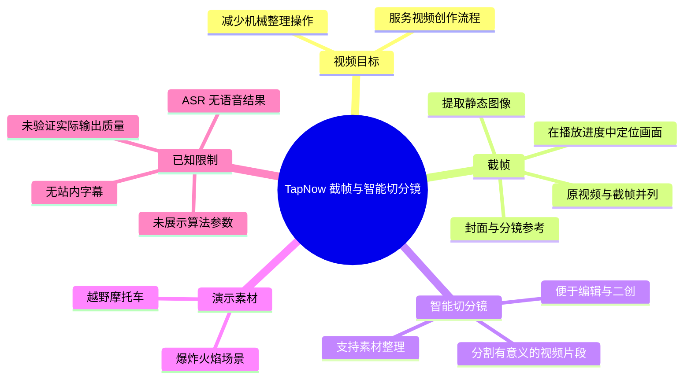
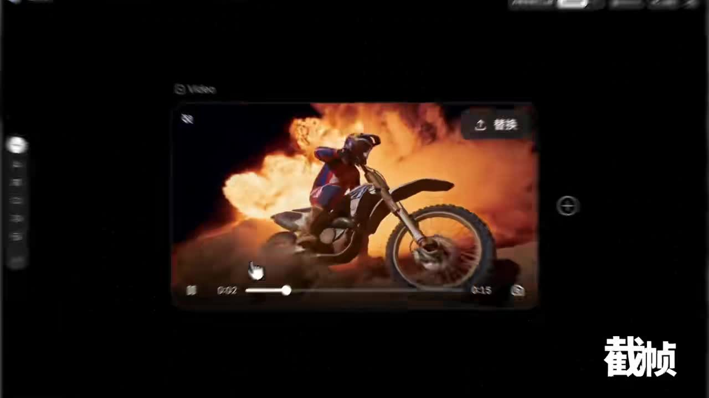
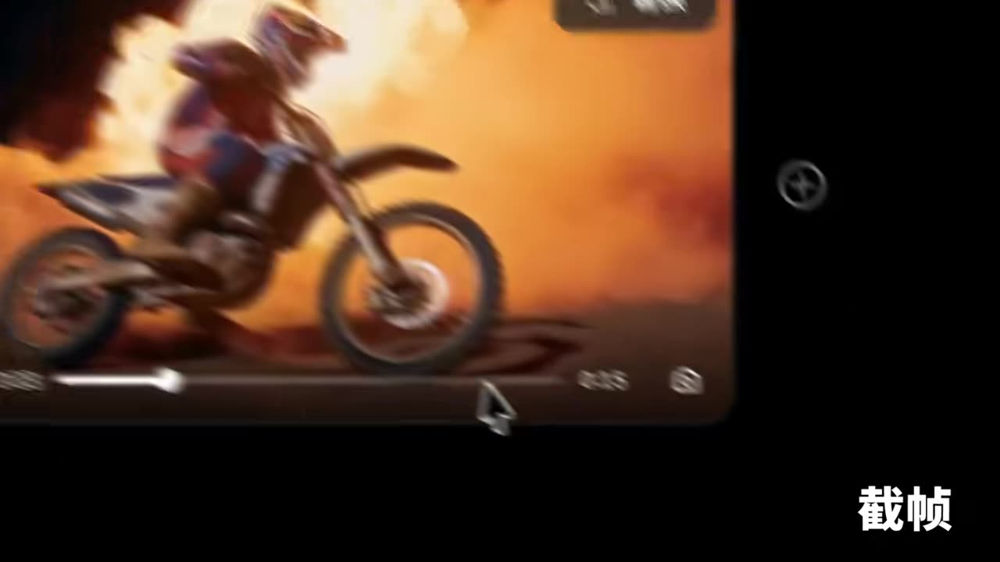
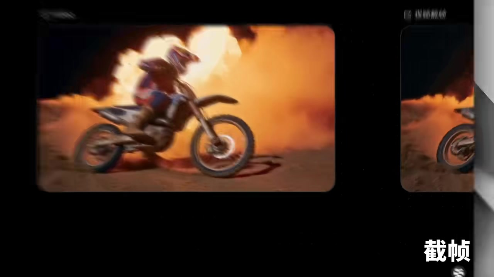
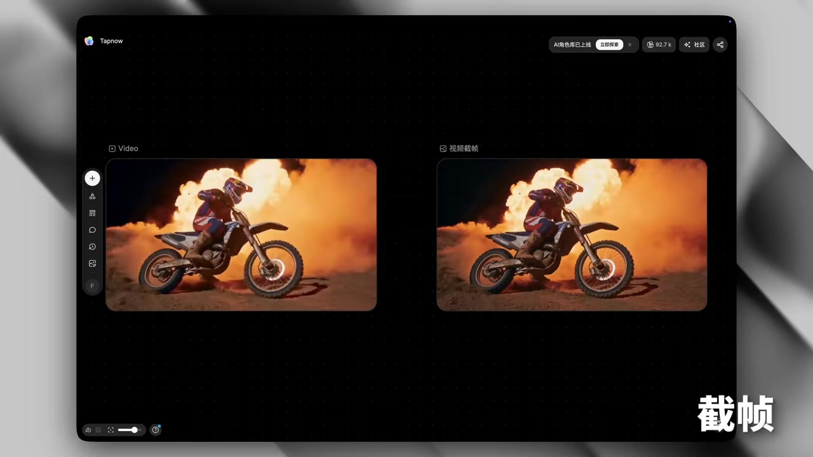

# 「截帧&智能切分镜」功能｜丝滑剪辑实操

> 来源：[Bilibili 视频](https://www.bilibili.com/video/BV1WAVz6DEA4)  
> UP 主：TapNow ｜时长：16 秒｜画面规格：1920×1080  
> 数据抓取时间：2026-07-15；当时视频显示 29,686 次播放、9,314 个点赞、5,217 次收藏。

## 小结

该短视频展示 TapNow 的两个视频素材整理功能：**截帧**与**智能切分镜**。画面以一段越野摩托车、爆炸火焰背景的视频为例，演示从播放进度中定位画面、提取静态帧，并将原视频与输出的“视频截帧”并列呈现。

视频的核心价值在于把“从视频中找可用画面”的过程可视化：用户不必依赖手工截图后再单独整理，截出的画面可作为封面、分镜参考、视觉灵感素材或后续编辑输入。UP 主在视频简介中进一步将“智能切分镜”定义为把视频切成具有意义的片段，以降低跨平台素材整理、编辑和二次创作的机械操作。

不过，这支视频只有 16 秒，重点是功能印象和界面效果，**没有展示智能切分镜的具体触发入口、切分规则、阈值、片段数量、导出格式、处理耗时或失败案例**。因此，不能仅凭本视频判断其切分准确率或“高清晰度”输出的实际质量。

本次 ASR 未识别出任何语音片段，站内也没有提供可用字幕；文档对操作流程的还原主要依据已给出的关键帧、视频简介及页面中可辨识的界面文字。时间轴只能可靠锚定到视频开头，无法伪造细分的字幕级时间点。

该内容属于软件功能宣传与工作流说明。功能入口、产品界面、可用范围、会员/额度政策及处理效果均可能在视频发布后变化，实际使用应以 TapNow 当前产品页面与应用内说明为准。

## 思维导图




## 目录

- [视频定位与素材示例](#视频定位与素材示例-0000)
- [截帧：从时间轴定位到静态画面](#截帧从时间轴定位到静态画面-0000)
- [结果呈现与智能切分镜的已知信息](#结果呈现与智能切分镜的已知信息-0000)
- [可复用的工作流与操作步骤](#可复用的工作流与操作步骤-0000)
- [参数、限制与时效性](#参数限制与时效性-0000)
- [字幕比对](#字幕比对)
- [评论分析](#评论分析)
- [处理记录](#处理记录)

## 视频定位与素材示例 [00:00](https://www.bilibili.com/video/BV1WAVz6DEA4?t=0)

视频标题直接点明“截帧 & 智能切分镜”以及“丝滑剪辑实操”。从 UP 主简介可知，其希望解决的是视频创作中素材筛选、整理和二次利用时反复拖动进度条、截图、归档等机械操作。

关键帧显示演示使用了一段视觉变化明显的越野摩托车片段：骑手驾驶摩托车，背景为强烈的火焰/爆炸效果。此类画面适合演示截帧，因为运动主体、火焰和尘土使不同时间点的画面差异较大，用户可以据此观察自己希望保留的构图。



> 图：画面展示带播放进度条的视频播放器，右下角叠有“截帧”文字。它说明演示的起点是从视频播放状态中选择目标画面，而非先展示一个脱离视频的静态图库。

视频简介对两个功能的表述如下：

| 功能 | UP 主给出的用途 | 本视频可直接观察到的证据 |
| --- | --- | --- |
| 截帧 | 从视频素材中精准提取高清静态图像；可用于封面、分镜脚本、灵感库（Moodboards）或关键视觉参考 | 播放器进度位置、摩托车画面以及后续原视频/截帧对照 |
| 智能切分镜 | 将视频分割为有意义的片段，便于跨平台素材整理、编辑和二次创作 | 标题与视频简介明确提及；给出的关键帧未展示具体切分标记、片段列表或算法设置 |

这里应区分两类信息：**“可用于封面、分镜、灵感库”等为 UP 主在简介中提出的用途**；而“本视频实际展示了从播放器画面到截帧输出的过程”则来自画面证据。二者都不等于对输出质量或算法准确率的独立测评。

## 截帧：从时间轴定位到静态画面 [00:00](https://www.bilibili.com/video/BV1WAVz6DEA4?t=0)

画面中的播放器底部可见播放进度条、圆形进度控制点以及时间读数区域。虽然关键帧文字存在运动模糊，无法可靠辨认精确的当前时间与总时长，但可以确认视频以拖动/选择播放位置的方式定位帧。



> 图：该帧放大了播放器下方的进度条与指针区域，摩托车主体因运动而略有模糊。其价值在于说明“截帧”依赖对具体播放位置的选择；对运动视频而言，选点会直接影响主体清晰度、构图和爆炸背景的覆盖范围。

在随后画面中，原视频画面以卡片形式被保留，并出现类似由左向右展开的视觉过渡。由于没有字幕和完整的逐帧操作记录，不能断言该动画是否对应某个固定按钮、导出步骤或“智能切分镜”的内部处理过程；但它明确强调了从原始动态素材到可独立使用视觉内容的转换。



> 图：画面左侧保留摩托车视频卡片，右侧出现被展开的画面区域，右下角仍有“截帧”标识。它帮助理解视频的叙事重点：把动态素材中某一时刻转化为后续可调用的视觉资产。

### 截帧在实际剪辑中的合理使用方式

基于视频简介与演示画面，可将截帧纳入如下工作流：

1. **准备视频素材**：先在 TapNow 或相应项目环境中打开需要筛选的视频。
2. **播放并定位候选画面**：通过预览与进度条移动至主体姿态、构图、光线或特效最合适的时刻。
3. **执行截帧**：使用产品提供的截帧功能生成静态图像。视频未展示按钮名称、快捷键或确认弹窗，因此这些细节不能补写。
4. **核验输出**：重点检查主体是否被运动模糊、是否截在转场中间、亮部是否过曝，以及输出的分辨率/格式是否符合后续用途。
5. **按用途归档**：可按封面候选、分镜参考、情绪板、关键视觉或二创素材等类别存放。这些用途来自 UP 主简介。
6. **进入剪辑或素材整理**：将确认后的静帧用于选题封面、镜头沟通、视觉参考或后续项目。

对于高速运动、火焰、闪光等画面，单次截帧未必正好获得最佳构图。更稳妥的做法是在目标动作前后保留多个候选帧，再从中挑选；这是针对演示素材特征的通用剪辑建议，不是视频展示的自动批量能力。

## 结果呈现与智能切分镜的已知信息 [00:00](https://www.bilibili.com/video/BV1WAVz6DEA4?t=0)

关键帧中出现 TapNow 深色画布界面：左侧区域标为“Video”，右侧区域标为“视频截帧”，两边各显示同一越野摩托车画面。这个并列布局直观地将原视频输入与截取后的静态结果对应起来。



> 图：左侧“Video”卡片与右侧“视频截帧”卡片并排出现，二者均显示摩托车与火焰画面。该图是理解功能输出关系最有价值的关键帧：它直接支持“截帧结果被作为独立资产呈现”的结论。

### 截帧输出的可见特征

- **输入与结果相邻**：画面中原始视频与“视频截帧”被放在同一工作画布，便于比对。
- **视觉内容一致**：结果画面保持摩托车、骑手与火焰背景的关键构图，符合从源视频中提取静态画面的预期。
- **项目化工作区**：左侧有竖向工具栏，主区域为卡片式节点/素材展示，表明它不是单纯播放器，而是具有素材组织含义的界面。
- **没有可核验的文件信息**：关键帧未显示导出路径、文件后缀、像素尺寸、压缩率、色彩空间或是否保留元数据，不能据此确认其“高清”标准。

### 智能切分镜：本视频披露到什么程度

“智能切分镜”虽与“截帧”一起出现在标题和简介中，但当前提供的可见画面主要围绕“截帧”。可可靠记录的产品主张仅包括：

1. 按有意义的片段切分视频；
2. 目标是让跨平台素材整理、编辑与二次创作更轻松；
3. 该功能被定位为减少无意义机械操作、把时间留给创意的工作流工具。

以下关键内容**没有被视频画面、字幕或简介证明**：

- “有意义片段”的判定依据是否为镜头切换、画面内容、人物动作、语音语义、字幕或多模态模型；
- 是否允许手动调整切点；
- 是否支持一次生成多个片段；
- 片段命名、标签、检索、导出及跨平台同步能力；
- 处理时长、支持的视频时长/格式/分辨率上限；
- 付费、积分、订阅或并发限制；
- 对快速剪辑、闪白转场、相似镜头和无声素材的鲁棒性。

因此，智能切分镜在本文中只能作为**官方功能定位**记录，不能扩展为已验证的自动分镜方案。

## 可复用的工作流与操作步骤 [00:00](https://www.bilibili.com/video/BV1WAVz6DEA4?t=0)

下面将视频已展示的界面逻辑与简介用途整理为一套可执行的素材处理流程。标有“建议”的部分是基于剪辑实践的补充，并非视频中逐项演示的功能步骤。

### 1. 先决定“截帧”要解决什么问题

截帧不只是保存一张画面。应在开始前明确用途：

| 目标 | 选帧重点 | 后续检查 |
| --- | --- | --- |
| 封面候选 | 主体清楚、信息集中、留有标题排版空间 | 小尺寸缩略图中的主体辨识度 |
| 分镜脚本 | 动作节点与镜头关系清楚 | 与前后镜头的连贯性 |
| Moodboard / 灵感库 | 色彩、光线、氛围具有代表性 | 是否能表达预期的视觉方向 |
| 关键视觉参考 | 人物、场景、服装、道具或特效完整 | 局部细节是否被模糊或遮挡 |

演示素材中的火焰背景具有强色彩与高动态特征。若用作封面，建议额外评估文字放置区的可读性，避免将标题压在火焰高亮区；此为通用视觉设计建议。

### 2. 在预览中精确选择候选时间点

视频画面表明截帧前存在播放器时间轴。可按以下方式操作：

1. 先粗略播放，找到动作或镜头变化的前后范围。
2. 在目标范围内细调进度条，观察主体姿态和画面清晰度。
3. 对运动内容避免只选一个位置：建议在动作前、动作峰值、动作后各保留候选。
4. 排除明显的转场帧、拖影帧、闪白帧与 UI 覆盖严重的帧。
5. 选定后执行截帧，并回到素材画布核对结果。

视频没有给出逐帧前进、键盘快捷键、帧率显示或时间码输入功能，若产品实际界面提供这些能力，应以当前版本界面为准。

### 3. 将静帧作为独立节点/素材进行整理

从“Video”与“视频截帧”的并列卡片可推知，截帧结果至少以可单独查看的对象呈现。建议建立可检索的命名习惯，例如：

```text
项目名_素材主题_镜头/动作_用途_版本
示例：越野摩托_火焰背景_侧向骑行_封面候选_v01
```

视频未展示名称编辑、标签、文件夹或导出系统，上述命名结构仅是方便跨项目协作的通用建议。

### 4. 再评估是否需要智能切分镜

若素材较长且包含多个镜头、段落或平台来源，可使用智能切分镜来减少先手动拆段再筛选的工作量。合理的验证顺序应为：

1. 用一条结构清晰的样片测试自动切分；
2. 检查每一个切点是否落在镜头边界或内容段落边界；
3. 手动校正错切、漏切与过度切分；
4. 再对每段素材执行截帧、标注和复用；
5. 在真实项目中记录处理时间与人工修正比例。

该验证步骤用于避免把“智能”直接等同于“无需审核”。视频没有提供准确率或基准测试，人工复核仍然必要。

## 参数、限制与时效性 [00:00](https://www.bilibili.com/video/BV1WAVz6DEA4?t=0)

### 已知参数与事实

| 项目 | 可确认信息 |
| --- | --- |
| 视频时长 | 16 秒（素材处理结果中的音频时长为约 15.47 秒） |
| 原视频画面 | 1920×1080，横向 16:9 |
| 演示内容 | 越野摩托车与火焰/爆炸背景的视频画面 |
| 已展示输出关系 | “Video”与“视频截帧”在 TapNow 画布中并列 |
| ASR 模型 | medium |
| ASR 运行设置 | CUDA、float16、自动语言识别；识别语言结果为英语，置信概率约 0.5410 |
| ASR 结果 | 0 个语音分段、0 秒语音覆盖 |

### 未披露或不可验证的参数

以下不是遗漏，而是原始素材没有给出可核验信息：

- 截帧输出分辨率、图片格式和压缩质量；
- 截帧是否支持原始分辨率或无损输出；
- 智能切分镜的模型、输入要求和切分准则；
- 单文件大小、视频时长、帧率、编码格式和上传数量限制；
- 任务排队时长、云端处理速度、失败重试规则；
- 免费额度、付费方案、区域可用性与版权条款；
- 与其他剪辑软件、云盘或社交平台的实际连接方式。

### 使用限制与风险

1. **无音频文本证据**：本次 ASR 没有识别到可转写的语音，不能从口播中补全操作细节。
2. **演示时长极短**：16 秒不足以展示完整上传、处理、编辑、导出及异常处理链路。
3. **功能宣传不等于性能评测**：视频中的画面并列呈现可说明功能意图，但不能证明各种素材条件下的稳定性。
4. **版权与授权仍需用户处理**：从视频截取静帧、拆分片段并进行二创，仍应确认原素材的使用许可、肖像权、音乐权利与平台规则。视频未提供相关规则说明。
5. **工具界面可能变化**：简介给出了 TapNow 使用入口 `https://app.tapnow.ai/home`，但视频发布后产品 UI、功能名称和可用资格可能调整。

## 字幕比对

站内没有提供可用字幕文件。本次 ASR 已实际检查：输入音频文件存在，ASR 诊断未标记 `noAudioStream=true`，因此**不能将问题描述为“源视频没有音轨”**；准确说法是，系统生成了约 15.47 秒音频文件，但识别模型没有检测到可转写的语音内容。视频可能本身没有口播，或语音信号不足以被模型识别；现有素材不足以区分这两种情况。

| 字幕来源 | 完整性 | 专有名词 | 时间轴 | 主要问题 |
| --- | --- | --- | --- | --- |
| Bilibili 站内字幕 | 未提供 | 无法核验 | 无可用分段 | 没有可用于正文校对的站内字幕 |
| 本次 ASR 字幕 | 空 | 无法识别 | 无有效分段；ASR 有时间戳能力但未产出 segments | 识别语言判为英语（概率约 0.5410），但语音片段数为 0，诊断提示未识别到语音 |
| 关键帧与多模态画面 | 仅覆盖可见界面及标题字 | 可确认 “Tapnow”“Video”“视频截帧”“截帧” | 仅能锚定视频开头，不具备字幕级细分时间 | 运动模糊与短片时长限制了精细界面文字识别 |
| 视频简介 | 覆盖功能定位与用途 | 可确认 “截帧”“智能切分镜”“Moodboards”“TapNow” | 无时间信息 | 属于发布说明，不是逐帧口播文本 |

最终未采用任何字幕作为逐句正文依据，而是采用“**视频简介中的功能定义 + 关键帧中的界面证据**”的交叉记录方式。本文已据此校正并保留的关键术语为“截帧”“智能切分镜”“Video”“视频截帧”和“TapNow”。由于不存在有效 SRT/ASR 分段，章节时间轴统一谨慎链接到 00:00，不虚构后续秒点。

## 评论分析

以下仅处理可获取的热评前三条；评论反映的是个体反馈，不构成对产品能力或事件的验证。

| 排名 | 评论与点赞 | 观点概括 | 可用信息与可信度 |
| --- | --- | --- | --- |
| 1 | 满云老师，59 赞：“看不出效果” | 认为视频未能清楚传达功能效果。 | 与本视频时长短、未展示切分参数和完整前后对比的观察相呼应，但这是主观观感，不足以证明功能无效。 |
| 2 | 我的灵宝，48 赞：“这个叫b站是吧，视频都好有趣啊，萌新请多关照(｀・ω・´)” | 与 TapNow 功能无直接关系，属于平台互动。 | 不提供产品使用反馈、技术信息或争议证据。 |
| 3 | 老非凡是2B，17 赞 | 评论内容为个人家庭关系与情绪困扰的长篇倾诉，与视频主题无关。 | 不应将其纳入对截帧或智能切分镜功能的评价。就内容本身而言，评论者表达了受伤与压力；若其仍在公开讨论中寻求支持，应优先考虑可信赖的亲友、学校支持资源或当地专业帮助。 |

最相关的反馈是第一条“看不出效果”。它提示演示型短视频若要提高可理解性，可补充：原始视频—切分结果—静帧导出物的清晰对比、操作入口、处理耗时，以及一个切错后人工修正的例子。该建议是基于评论与素材不足提出的改进方向，并非原视频承诺。

## 处理记录

- **Worker ID**：worker-mrj0wjed-b0c290ad
- **模型**：gpt-5.6-terra
- **调用工具与素材**：Bilibili 元数据抓取结果、视频素材处理产物、关键帧、ASR 诊断与结果、热评抓取结果。
- **使用的应用工具**：视频合并产物 `merged.mp4`、音频抽取产物 `audio/audio.wav`、关键帧目录 `frames/`、ASR 产物目录 `asr/`、评论数据 `comments/comments.json`；本次 ASR 模型为 `medium`，运行于 CUDA / float16。
- **字幕选择**：站内无可用字幕；本次 ASR 已检查但输出为空（0 个 segments），故不采用伪造的转写文本。正文依据视频简介、可见 UI 与关键帧进行多模态整理。
- **时间轴依据**：没有站内 SRT 或 ASR 的 `HH:MM:SS,mmm --> HH:MM:SS,mmm` 有效分段；章节只使用可确定的视频开头 `00:00` 链接，未根据文字顺序臆测后续秒数。
- **关键帧选择依据**：`frame-001.jpg` 用于说明播放器与截帧主题；`frame-002.jpg` 用于说明进度条定位；`frame-003.jpg` 用于说明源视频到输出的视觉过渡；`frame-004.jpg` 用于证明 “Video” 与“视频截帧”的并列结果关系。未使用其余帧，避免在未提供画面内容的情况下杜撰信息。
- **缓存清理**：素材清单未提供缓存清理执行日志；不能声称已完成清理。原始处理产物路径按素材清单保留用于可追溯核验。
- **未解决问题**：无法确认视频是否有可听但未被识别的口播；无法核验截帧导出规格、智能切分镜算法逻辑、准确率、入口、费用与限制；无法从现有材料建立更细粒度时间轴。
