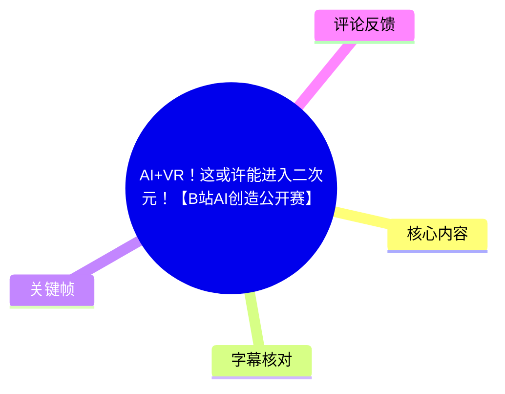
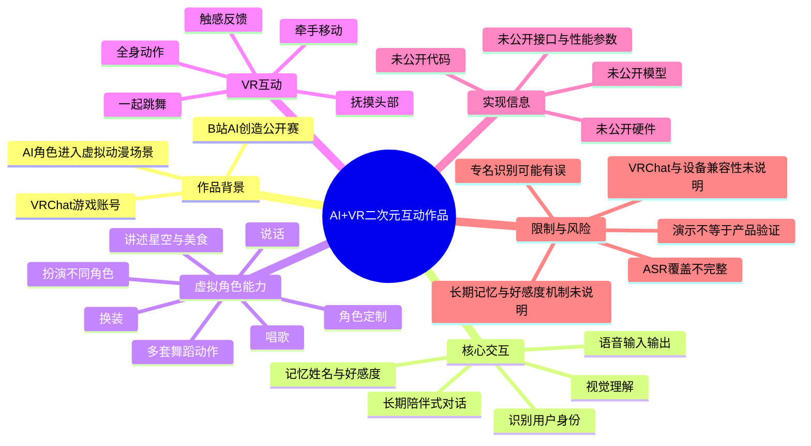
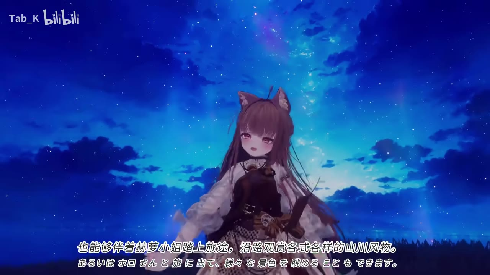
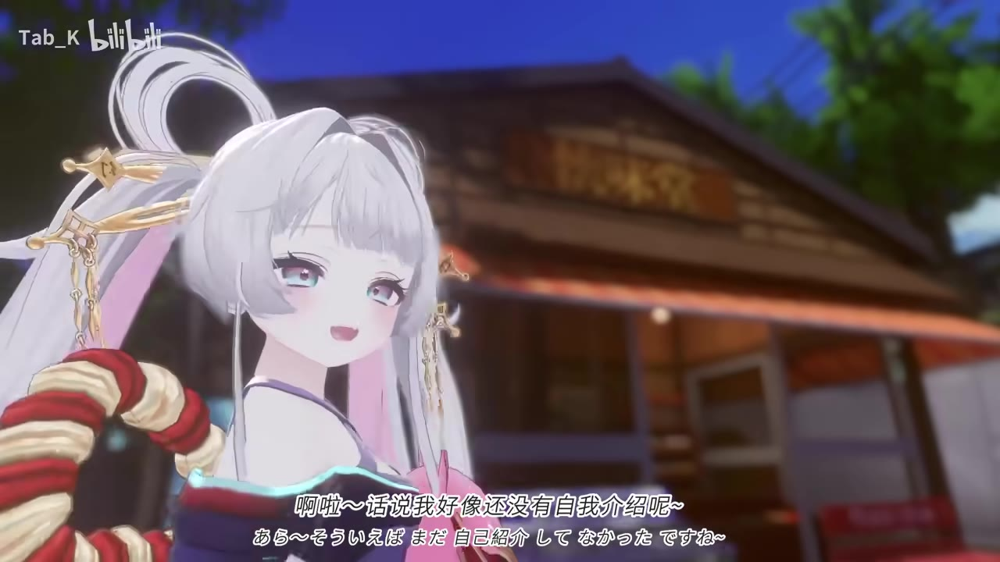

# AI+VR！这或许能进入二次元！【B站AI创造公开赛】

> 来源：[Bilibili 视频](https://www.bilibili.com/video/BV1jpgR6GEDS) 
> UP 主：Tab_K | 发布时间：2026-07-27（素材路径中的发布日信息） | 视频时长：321 秒

## 小结

1. 视频展示了一个基于 **VRChat 游戏账号**的 AI 角色系统：用户通过语音与角色交流，AI 结合视觉理解、角色形象和全身动作，模拟真人式的输入与输出。
2. 作品的核心卖点不是单纯的聊天机器人，而是把 AI 放进可漫游、可互动的 VR/二次元场景中。视频中描述了语音对话、唱歌、识别用户、记忆姓名、触感反馈、牵手移动、好感度、换装和多套舞蹈动作等能力。
3. 视频还强调了长期记忆：系统能够记住说话的人及其对应的好感度；同时可以快速扩展到不同动漫角色，用户也可以定制自己喜欢的角色形象。
4. 展示内容主要以角色宣传和功能演示为主，并未给出代码、模型名称、硬件型号、部署命令、接口协议、延迟、显存占用或训练数据等工程参数。因此，不能据此复现完整系统，也不能把演示效果直接等同于稳定可用的产品能力。
5. 本次 ASR 识别出的音频语言为日语，覆盖约 50.68%，且中间存在约 25 秒和约 83.52 秒的大段无识别文本区间。站内未提供可用字幕，因此正文依据 ASR 时间轴、画面中的中日双语字幕与已给出的作品介绍整理；部分日语专名和句子存在识别不确定性。
6. 这是一条面向 **B站AI创造公开赛**的作品展示视频，适合关注 AI 角色、VRChat、虚拟人交互和二次元内容创作的读者。由于视频发布时间、素材抓取时间均属于特定时间点，功能状态和平台兼容性可能随后变化。

## 思维导图

## 目录

- [作品定位与进入二次元的设想](#作品定位与进入二次元的设想)
- [AI角色与场景交互能力](#ai角色与场景交互能力)
- [视觉识别、记忆与好感度](#视觉识别记忆与好感度)
- [触感、牵手、动作与外观系统](#触感牵手动作与外观系统)
- [视频实际展示流程](#视频实际展示流程)
- [技术信息、参数与复现边界](#技术信息参数与复现边界)
- [结论与限制](#结论与限制)
- [字幕比对](#字幕比对)
- [评论分析](#评论分析)
- [处理记录](#处理记录)

## 作品定位与进入二次元的设想 [00:17](https://www.bilibili.com/video/BV1jpgR6GEDS?t=17)

视频在约 17.2 秒开始出现可识别的人声。开场文案提出：用户不必只隔着显示器观看动漫世界，也不只是沉默旁观，而是可以亲自走进原本只存在于想象中的动画世界，与喜欢的事物产生交流。

画面展示了日式动漫风格的虚拟角色和场景，并配有中文、日文双语字幕。视频将作品定位为一个让用户进入“二次元”或“虚拟幻境”的沉浸式体验，而不是只在二维界面中使用 AI。

> 图：画面中的角色、天空和动漫风格场景直观呈现了作品的视觉定位；双语字幕与角色特写也能帮助确认开场主题。该关键帧用于说明“进入想象中的动漫世界”的宣传语境，不代表已经验证了所有底层技术。

### 可进入的场景与角色想象 [00:47](https://www.bilibili.com/video/BV1jpgR6GEDS?t=47)

17.2—57.15 秒的 ASR 内容集中在作品愿景：

- 用户可以进入充满温柔、热烈和浪漫氛围的不同“次元风景”。
- 用户想象中的形象与世界，被描述为存在于这个虚拟幻境中。
- 视频用具体情境说明体验，例如与“シノブ”（ASR 音译为“Shinobu”）乘坐电车、购买甜甜圈。
- 还展示了与“赫萝/ホロ”（ASR 识别为“オロさん”，结合画面字幕可理解为相关角色）旅行、欣赏沿途景色的设想。
- 用户可以与喜欢的二次元角色相遇，也可以按照自己的喜好定制角色。
- 视频同时把 AI 助手设定为可以陪用户一起度过虚拟体验的角色。

其中部分日语专名来自自动识别，ASR 对专名的结果并不稳定；正文仅在画面字幕或上下文能够相互印证时采用较确定的中文称呼。

> 图：角色抱着粉色物体、面对镜头互动，配合“亲身走进温柔、热烈、浪漫的次元场景”的字幕，体现了作品从观看转向陪伴式互动的表达。

## AI角色与场景交互能力 [01:30](https://www.bilibili.com/video/BV1jpgR6GEDS?t=90)

### 专属 AI 助手设定 [01:30](https://www.bilibili.com/video/BV1jpgR6GEDS?t=90)

约 90.36 秒开始，视频转入角色自我介绍。ASR 识别到的内容包括：

- 角色先表示此前还没有正式自我介绍。
- 随后进行问候，并自称为“君ヤキオ”，又说可以称呼为“ヤキヨ”。由于日语 ASR 结果和中文音译均存在不确定性，这一名称不宜视为已核实的官方角色名。
- 角色将自己描述为守望这个虚拟幻境的专用 AI。
- 它被定位为用户沉浸式游玩动漫世界时的专属伙伴。
- 视频强调用户获得的不只是“冷冰冰的程序”，而是带有温柔陪伴感的互动体验。

这里体现的是产品叙事层面的角色人格设计：AI 不仅负责响应指令，还以固定身份、固定称呼和陪伴关系参与场景。视频没有进一步说明人格提示词、对话模型、上下文窗口、记忆数据库或安全策略。

### 语音与内容生成能力 [02:08](https://www.bilibili.com/video/BV1jpgR6GEDS?t=128)

在约 128.35 秒，角色开始回答“能做什么”。视频口述或字幕展示的能力包括：

1. 与用户聊天。
2. 唱歌。
3. 讨论星空。
4. 讨论美食。
5. 扮演或承担不同角色。
6. 根据用户身份和互动历史进行持续交流。

这些能力说明系统至少在演示层面将语音输入、AI 生成回复和虚拟角色表现连接起来。但素材没有给出：

- 使用的语言模型或语音模型名称；
- 语音识别、文本生成、语音合成的具体链路；
- 回复延迟；
- 是否支持打断、连续对话或多人同时交流；
- 日语、中文及其他语言的实际支持范围；
- 语音输出是否完全实时。

因此，上述内容应理解为视频中的功能展示和作品宣称，而非经过独立测试的性能结论。

## 视觉识别、记忆与好感度 [02:24](https://www.bilibili.com/video/BV1jpgR6GEDS?t=144)

### 视觉理解与身份识别 [02:24](https://www.bilibili.com/video/BV1jpgR6GEDS?t=144)

ASR 在 144.72—151.12 秒描述，系统能够：

- 识别用户的身影或外观；
- 记住用户的名字；
- 在再次见面时以名字称呼用户。

随后角色以类似“好久不见”的方式向一名用户问候，并询问是否要在神社游玩。该段意在展示角色能够把视觉识别与记忆结合起来：不是每次都把用户当成陌生人，而是根据既有身份信息产生连续性。

作品介绍进一步声称，系统拥有长期记忆，可以记住每一个说话的人及其对应的好感度。素材没有说明识别依据是人脸、VRChat 账号、语音特征、设备身份还是其他数据，也没有说明多人环境中的误识别处理方式。

### 长期记忆与好感度机制 [02:52](https://www.bilibili.com/video/BV1jpgR6GEDS?t=172)

约 172.8 秒开始，视频说明：

- 用户与角色交流越多，好感度会逐渐提升；
- 双方的羁绊会不断加深；
- 当羁绊达到一定程度后，可以一起跳舞。

这是一个将长期记忆、关系状态和互动内容结合起来的机制。它使 AI 角色不只是即时回答问题，而是根据历史交流改变后续互动表现。

不过，视频未公开好感度的数值范围、增长规则、衰减规则、存储周期、重置方式、跨设备同步方式以及用户删除记忆的操作。因而不能推导出具体的算法或可重复的数值结果。

> 图：夜空和角色画面体现了作品用于营造沉浸感的场景表现，也与视频中关于旅行、观赏风景和长期陪伴的叙述相呼应。该图适合说明“场景体验”而非证明 AI 已经完成视觉识别或记忆。

## 触感、牵手、动作与外观系统 [02:37](https://www.bilibili.com/video/BV1jpgR6GEDS?t=157)

### 触感与抚摸反馈 [02:37](https://www.bilibili.com/video/BV1jpgR6GEDS?t=157)

在 157.46—165.56 秒，视频展示或描述了与角色的触感互动：

- 角色能够感知用户的触碰；
- 用户可以抚摸角色的头部；
- 如果持续抚摸，角色会反馈“头发被弄乱了”一类的回应。

这说明作品试图把 VR 中的碰撞、触碰或控制器输入转化为角色的语言反馈和动作表现。素材没有明确说明触感来自真实力反馈设备、控制器震动、碰撞检测，还是画面与语音共同制造的拟真效果，不能据此断言系统具备完整的力反馈能力。

### 牵手与共同移动 [02:47](https://www.bilibili.com/video/BV1jpgR6GEDS?t=167)

167.04—171.74 秒的 ASR 表示，用户可以牵着角色的手一起走动。该功能至少涉及以下交互关系：

1. 用户发起牵手或接触动作。
2. 角色的手部与用户动作建立关联。
3. 用户移动时，角色跟随或与用户共同移动。
4. 角色通过语音或动作表现出陪伴感。

但视频没有公开牵手的具体触发方式、网络同步机制、移动速度限制、碰撞处理或多人场景下的行为规则。

### 全身动作、跳舞、换装与多套动作 [03:04](https://www.bilibili.com/video/BV1jpgR6GEDS?t=184)

视频简介明确提到，本次加强了全身动作，并加入：

- 全身动作表现；
- 多套舞蹈动作；
- 角色换衣服；
- 角色 ID 识别；
- 触感互动；
- 牵手移动；
- 长期记忆和好感度。

ASR 在 184.49—194.37 秒进一步说明，关系加深后可以一起跳舞，随后进入舞蹈或动作展示片段。由于 ASR 在此后出现较长空白，舞蹈画面的具体动作名称、切换方式和动作数量无法从字幕中确认。

热评中有用户询问动作是否使用预制动作，但视频本身没有回答这一问题。因此，不能把动作判断为“全部由实时生成”或“全部为预制动画”。更严谨的结论是：视频展示了全身动作和多套舞蹈效果，但实现来源未披露。

> 图：角色在神社风格建筑前的近景有助于说明作品把角色、场景和陪伴式对话结合在一起；它不能单独证明换装、动作生成或 VR 设备兼容性。

## 视频实际展示流程 [00:17](https://www.bilibili.com/video/BV1jpgR6GEDS?t=17)

按照有明确 ASR 时间戳的内容，视频展示顺序可以整理为：

1. **提出沉浸式愿景（00:17—00:57）**  
   作品邀请观众离开现实烦恼，进入想象中的动漫世界。画面配合动漫角色、风景和双语字幕进行宣传式表达。

2. **举例说明可进入的体验（00:58—01:28）**  
   视频以乘电车、购买甜甜圈、旅行、欣赏风景、与二次元角色相遇和定制角色为例，说明用户不只是观看，而是参与其中。

3. **AI 角色自我介绍（01:30—02:07）**  
   角色介绍自己的身份，将自己定位为守望虚拟幻境、陪伴用户游玩的专属 AI。

4. **展示对话和内容互动（02:08—02:23）**  
   角色声称可以聊天、唱歌、讨论星空和美食，并承担不同角色。

5. **展示视觉识别和记忆（02:24—02:36）**  
   角色表示可以识别用户外观并记住名字，还以熟人式口吻进行问候。

6. **展示触碰和抚摸反馈（02:37—02:45）**  
   角色回应用户的触碰和持续抚摸。

7. **展示牵手和共同移动（02:47—02:51）**  
   角色表示能够牵手并一起走动。

8. **展示好感度与关系成长（02:52—03:08）**  
   视频将频繁交流与好感度提升、羁绊加深联系起来，并说明关系达到一定程度后可以一起跳舞。

9. **展示舞蹈或动作片段（03:09—03:22）**  
   ASR 记录到“这样”“我们相遇了”“不要松开手”等句子，随后出现零散的“星”字内容。由于字幕识别不完整，只能确认这里存在动作/情感展示，无法可靠还原完整台词。

10. **长时间无有效 ASR 文本的展示段（03:22—05:11）**  
    202.59—227.55 秒以及 228.09—311.61 秒之间存在较长空白。视频总时长约 321 秒，但这些片段没有可用的 ASR 句子，不能根据文字顺序补写其中可能展示的功能。

11. **结尾致意（05:11—05:19）**  
    末尾 ASR 识别到“如果有心情或愿望……请……”以及“请期待/请……”“下次再见”一类的结束语。具体中间句子因 ASR 断裂而不确定。

## 技术信息、参数与复现边界 [02:24](https://www.bilibili.com/video/BV1jpgR6GEDS?t=144)

### 素材中能够确认的技术组成

结合视频简介、ASR 和画面，可确认作品涉及以下功能模块：

| 模块 | 素材中明确的信息 | 未披露的信息 |
| --- | --- | --- |
| 运行场景 | VRChat 游戏账号内的交互 | VRChat 版本、插件或账号接入方式 |
| 输入 | 语音输入、用户触碰或动作 | 麦克风型号、采样率、控制器型号、输入协议 |
| AI 能力 | 语音输入输出、视觉理解、长期记忆 | 使用的模型、推理服务、上下文长度、延迟 |
| 视觉理解 | 可识别角色 ID；可识别用户身影/身份的作品宣称 | 识别算法、摄像头或 VR 追踪设备、误识别率 |
| 输出 | 语音对话、角色语言反馈、动作表现 | TTS 模型、音色、码率、实时性 |
| 记忆 | 记住说话的人、姓名和好感度 | 数据库、保存期限、隐私管理、删除机制 |
| 动作 | 全身动作、牵手移动、多套舞蹈 | 动捕设备、预制动作与实时生成的比例 |
| 外观 | 角色定制、换装、多套服装 | 资源格式、切换流程、资产来源 |
| 互动反馈 | 触碰、抚摸、牵手 | 触觉设备、震动反馈或碰撞检测的具体实现 |

### 未提供的步骤、命令和参数

视频没有给出可执行的安装或开发教程，因此不能编造以下内容：

- VRChat SDK 或插件的安装步骤；
- AI 服务的 API 地址、密钥配置和调用格式；
- 语音识别、语言模型、语音合成的模型名称；
- 视觉识别的输入设备和推理阈值；
- 好感度的计算公式；
- 长期记忆的数据结构；
- 动作捕捉、骨骼绑定和动画状态机配置；
- 角色换装资源格式；
- 运行所需 CPU、GPU、显存、网络带宽和帧率参数；
- 多人联机同步及异常恢复方案。

因此，本视频更适合作为功能概念展示和作品介绍，而不是完整的技术复现教程。若要复现，至少需要额外确认 VRChat 账号接入方式、虚拟角色资源、语音链路、AI 推理服务、视觉/动作追踪设备及数据存储方案；这些均不在当前素材中。

## 结论与限制 [05:11](https://www.bilibili.com/video/BV1jpgR6GEDS?t=311)

### 可迁移经验

- **把 AI 放进场景，而不是只放在聊天窗口中**：VR 场景、角色动作和语音反馈共同构成沉浸感。
- **持续记忆能增强角色连续性**：记住名字、身份和互动关系，可以让用户感受到“再次见面”。
- **关系机制提供长期互动目标**：好感度、羁绊和解锁舞蹈等设计，使对话与后续内容产生联系。
- **多模态交互需要统一角色表现**：语音、视觉识别、触碰、移动和动作应围绕同一个角色状态协同工作。
- **角色可扩展性是重要卖点**：作品声称可以快速扩展到不同动漫角色，也支持用户定制角色，但具体扩展成本尚未公开。

### 主要限制

1. **演示范围有限**：视频展示的是作者提供的场景和角色，不能证明系统在任意动漫角色、任意场景或任意用户环境下都能稳定运行。
2. **工程参数缺失**：没有公开模型、硬件、网络、帧率、延迟、内存和部署配置。
3. **动作实现未知**：视频展示了全身动作和舞蹈，但未说明动作是预制、动捕、程序生成还是混合方案。
4. **识别准确性未知**：视觉识别、角色 ID 识别和多人身份区分没有准确率、误报率或异常案例。
5. **长期记忆存在隐私问题**：姓名、说话人身份和好感度属于用户相关信息；素材没有说明保存、授权、删除和共享规则。
6. **触感能力定义不清**：视频提到能够感知触碰，但没有说明是物理触感、控制器震动、碰撞检测还是角色语音反馈。
7. **ASR 记录不完整**：音频时长为 320.67 秒，ASR 只有 162.51 秒有效语音，覆盖率为 50.68%；中段的功能演示缺少可靠文字证据。
8. **版权与平台限制未说明**：视频涉及动漫角色、VRChat 和用户定制内容，但未说明角色资产授权、平台规则及商业使用边界。
9. **时效性**：素材抓取完成于 2026-08-04，作品发布信息对应 2026-07-27。VRChat、模型服务、插件和作品功能都可能在此后更新，本文仅反映本次素材中的状态。

## 字幕比对 [00:17](https://www.bilibili.com/video/BV1jpgR6GEDS?t=17)

| 字幕来源 | 完整性 | 专有名词 | 时间轴 | 主要问题 |
| --- | --- | --- | --- | --- |
| Bilibili 站内字幕 | 未提供可用字幕 | 无法核对 | 无法使用 | 素材清单中的 `subtitles/` 未提供可用站内字幕 |
| 本次 ASR 字幕 | 部分完整 | 日语专名和个别句子可能误识别 | 可用，37 个分段 | 识别语言为日语；有效语音覆盖约 50.68%；202.59—227.55 秒和 228.09—311.61 秒存在大段空白；部分词句语义不完整 |

### 最终字幕选择

本次没有站内字幕，因此以本次 ASR 的真实起止时间作为时间轴主依据，并结合关键帧中可见的中文/日文双语字幕进行语义校正。对于 ASR 无法覆盖的段落，不根据画面顺序或文字顺序猜测具体台词。

可确认的时间信息包括：

- 首段有效人声：17.20 秒；
- 角色设定和功能介绍：约 90.36—194.37 秒；
- 动作/舞蹈相关展示：约 184.49 秒后开始；
- 第一处较长空白：202.59—227.55 秒；
- 第二处较长空白：228.09—311.61 秒；
- 结尾有效语音：311.61—319.03 秒；
- ASR 音频总时长：320.6675625 秒。

### 识别结果的校正说明

- ASR 中的角色名“君ヤキオ”“ヤキヨ”存在听写不确定性，正文保留为不完全核实的音译/日文形式。
- ASR 将部分角色名识别为“オロさん”，结合视频上下文和画面字幕，可能对应“赫萝/ホロ”，但不能视为完全确认。
- ASR 中“ラクラディス”等身份名称没有足够资料进行可靠校正，正文仅概括为角色对用户进行熟人式问候。
- ASR 在舞蹈片段和结尾前的大段内容缺失，因此未补写舞蹈名称、动作数量或未显示的技术流程。

## 评论分析 [00:00](https://www.bilibili.com/video/BV1jpgR6GEDS?t=0)

以下仅分析可获取的热评前三条，不把评论内容当作已验证事实。

### 1. “我能变得真实吗？”

- **观点**：评论关注作品是否能让用户或虚拟角色获得更强的“真实感”。
- **补充信息**：从侧面反映观众注意到视频将语音、视觉、触碰、牵手和长期记忆结合起来。
- **争议与可信度**：这属于体验期待和哲学化提问，不是对系统真实性、意识或技术成熟度的证明。视频只展示了虚拟角色互动，没有证明角色具有意识或独立主体性。
- **获赞情况**：62 赞，是三条热评中获赞最高的一条。

### 2. “牛逼[支持]。在动作方面，up主是用了预制动作吗？”

- **观点**：评论认可作品效果，同时追问全身动作和舞蹈的实现方式。
- **补充信息**：说明动作表现是观众关注的技术点，尤其是视频简介中提到的全身动作和多套舞蹈。
- **争议与可信度**：问题本身不能证明使用了预制动作。当前素材没有作者回复或实现说明，因此只能记录为未解决的技术疑问。
- **获赞情况**：8 赞。

### 3. “这就开始做月读了？？！[辣眼睛][惊讶][点赞]”

- **观点**：评论以夸张、玩梗的方式评价作品的沉浸式虚拟体验，表达惊讶和调侃。
- **补充信息**：从侧面说明作品的“进入二次元/虚拟世界”概念容易引发关于动漫作品和沉浸式幻境的联想。
- **争议与可信度**：这是情绪化评论，不提供可验证的技术信息，也不能据此判断作品是否达到评论所暗示的效果。
- **获赞情况**：14 赞。

## 处理记录 [00:00](https://www.bilibili.com/video/BV1jpgR6GEDS?t=0)

- Worker ID：`worker-mrj0wbly-5dc4e50c`
- 调用工具与模型：视频素材整理 Agent；正文模型为 `gpt-5.6-terra`；ASR 模型为 `large-v3-turbo`
- 使用的应用工具：
  - 读取 Bilibili 元数据、视频标题、UP 主、时长、简介、标签和统计信息；
  - 使用已提供的 `merged.mp4`、`audio/audio.wav` 和 `frames/` 素材；
  - 检查 `asr/asr-result.json`、`asr/transcript.srt` 和 `asr/asr-transcript.txt`；
  - 检查站内字幕目录，确认未提供可用站内字幕；
  - 读取可获取热评前三条。
- ASR 执行信息：语言自动识别为日语，语言概率 `0.9990234375`；设备为 CUDA；计算类型为 `int8_float16`；音频时长 `320.6675625` 秒；识别出 37 个分段，语音覆盖率 `50.68%`。
- 字幕选择：无可用站内字幕，因此采用本次 ASR 作为主要时间轴来源，并用关键帧中的中日双语字幕进行有限校正；对 ASR 空白段不作文字推断。
- 时间轴依据：章节时间均优先取自 ASR/SRT 的真实起止时间或其明确分段起点，没有依据文章文字顺序猜测视频位置。
- 关键帧选择依据：
  - `frames/frame-001.jpg`：开场动漫角色与双语字幕，用于说明进入想象中的动漫世界；
  - `frames/frame-002.jpg`：角色在虚拟场景中进行陪伴式互动，用于说明场景化交互；
  - `frames/frame-003.jpg`：夜空下的角色画面，用于说明旅行、风景和沉浸式氛围；
  - `frames/frame-004.jpg`：神社风格建筑前的角色近景，用于说明角色与环境结合；
  - 其余关键帧未在正文中强行使用，因为当前可见素材不足以为其建立可靠的时间或内容对应关系。
- 缓存清理：素材清单显示处理流程已完成，且 `warnings` 为空；未提供独立的缓存删除日志，因此无法确认具体临时文件是否已清理。
- 未解决问题：
  - 站内字幕缺失；
  - ASR 中日语专名和部分句子存在识别误差；
  - 约 202.59—311.61 秒内容缺少连续 ASR；
  - AI 模型、VRChat 接入方式、硬件、动作来源、记忆机制、好感度算法和性能参数均未公开；
  - 视频未回答热评提出的“动作是否使用预制动作”问题。

## 评论分析

- 热评 1：我能变得真实吗？
- 热评 2：牛逼[支持]。在动作方面，up主是用了预制动作吗？
- 热评 3：这就开始做月读了？？！[辣眼睛][惊讶][点赞]

以上内容是观众反馈摘录，只用于补充理解视频反响，不作为正文事实依据。
