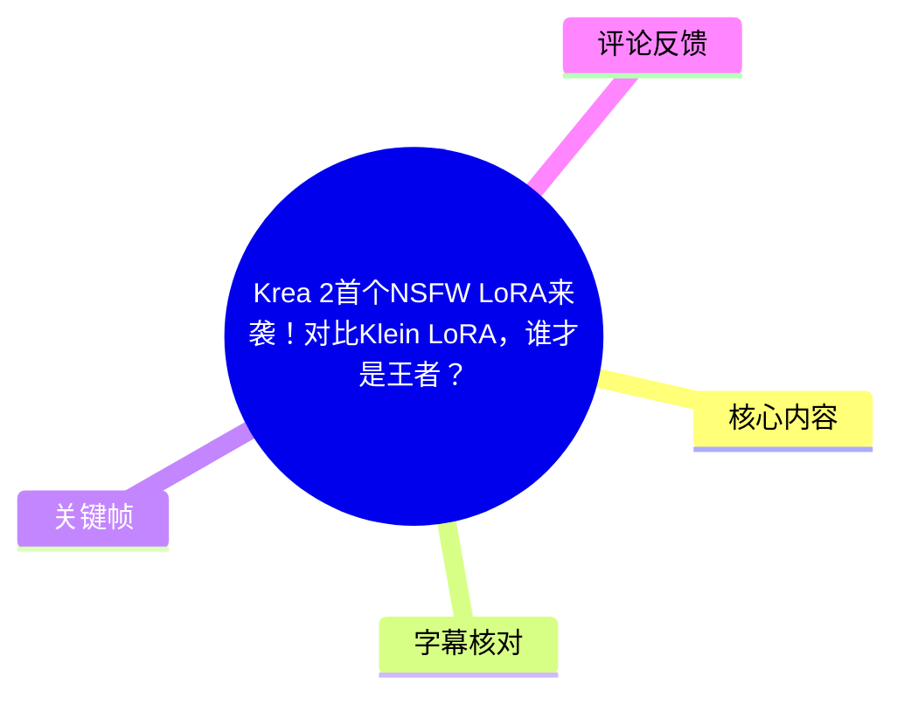
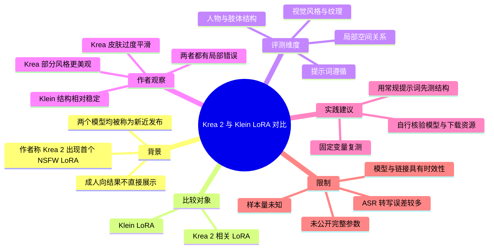
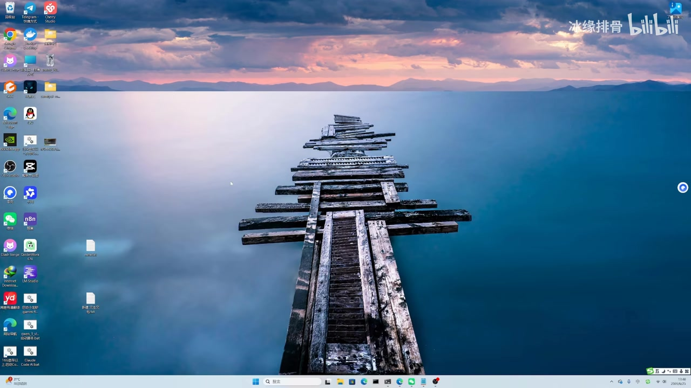
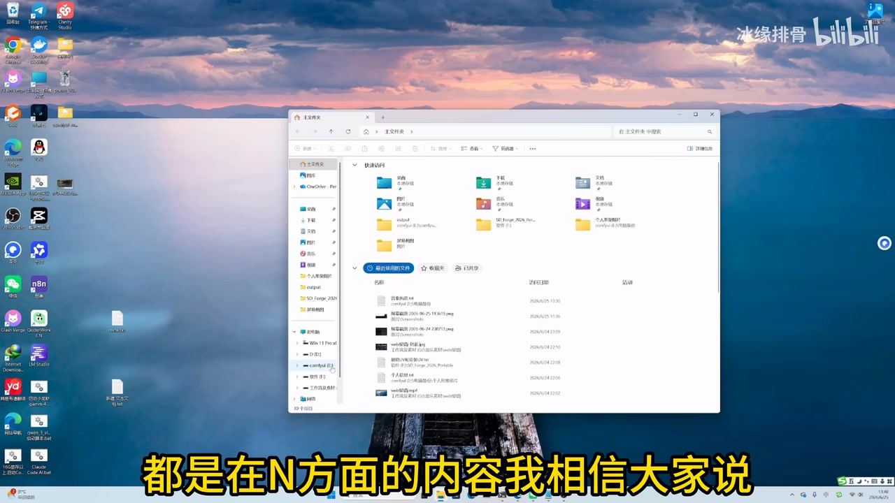

## 小结

本视频是一次围绕两款带有成人向（NSFW）能力倾向的 LoRA 的短测对比：一款被作者称为 **Krea 2 的首个 NSFW LoRA**，另一款为 **Klein LoRA**。作者将重点放在二者的提示词遵循、人物结构、局部空间关系、视觉质感，以及常规合规提示词下的出图稳定性上。

作者的核心判断是：**Klein LoRA 在结构、肢体/组件关系和提示词执行上总体更稳，Krea 2 方案则在部分画面风格与人物外观上更“漂亮”**。不过，Krea 2 方案被指出存在明显的过度磨皮、塑料感与局部不理解提示词的问题；Klein 方案也并非没有问题，作者展示中提到其偶有多肢体、局部空间关系错误，以及纹理表现偏弱的情况。

由于成人向示例不便直接展示，视频采用“常规提示词”生成结果来侧面测试两个 LoRA 的结构和画面表现。作者明确表示，相关成人向提示词只展示给观众自行测试，视频没有完整公开可复现的提示词、种子、采样器、步数、CFG、LoRA 权重或底模版本，因此本次结论属于作者在有限样例上的经验性评价，而非严格可重复的基准测试。

视频发布时，两款 LoRA 被作者描述为“刚放出来”的新模型，并称已放至网盘供下载；简介中还列出模型、工作流、ComfyUI 节点及整合包的网盘资源。但链接可用性、模型版本、授权范围与内容合规要求均可能变化，使用前应自行核验来源、许可证及本地法律与平台规则。

适合正在比较 Krea 2 与 Klein 相关 LoRA、且关心人物生成中“结构正确性”和“视觉风格”取舍的创作者阅读。若目标是可复现实验，应在同一底模、同一工作流、同一随机种子与同一提示词条件下重新对照测试。

## 思维导图

## 目录

- [背景、对象与时效性](#背景对象与时效性)
- [作者的对比逻辑与成人向内容边界](#作者的对比逻辑与成人向内容边界)
- [常规提示词下的出图观察](#常规提示词下的出图观察)
- [作者结论与下载信息](#作者结论与下载信息)
- [可复现实践步骤与参数缺口](#可复现实践步骤与参数缺口)
- [限制、风险与适用范围](#限制风险与适用范围)
- [字幕比对](#字幕比对)
- [评论分析](#评论分析)
- [处理记录](#处理记录)

## 背景、对象与时效性 [00:00](https://www.bilibili.com/video/BV1WA7a6GEtU?t=0)

视频开头，作者介绍本期关注的是近期出现的 LoRA。根据标题与口述上下文，比较对象为：

1. **Krea 2 相关的 NSFW LoRA**：视频标题将其称作“Krea 2 首个 NSFW LoRA”。这是作者/视频标题的表述，素材中没有提供模型页、版本号或官方公告，不能据此独立验证“首个”的范围与定义。
2. **Klein LoRA**：作者在 ASR 中多次说出接近“KLINE”“可莱尼”等发音；结合视频标题，本文统一记为 **Klein LoRA**。

作者说明，这两个 LoRA 都涉及“暗用/成人向”内容；ASR 中相应词语出现较多识别错误，但语境与标题中的 NSFW 一致。作者认为 Krea 2 的相关 LoRA 已经开始陆续出现，而 Klein LoRA 的生成效果“更稳/更滑”，这里的“更滑”应理解为口语化主观评价，可能指画面或生成表现更顺畅，并非可量化参数。

> 图：该关键帧显示作者进入本机录屏环境，表明视频以本地工作流/文件管理与生成结果演示为主，而非在线模型页面的官方说明。它有助于理解本期证据主要来自作者的实测截图与口述，而非公开基准报告。

### 时效性说明

- 元数据显示视频时长为 **690 秒（11 分 30 秒）**，视频元数据抓取时间为 2026-07-13。
- 作者在结尾称两个模型是“刚刚今天放出来”的模型；这只能反映视频录制/发布阶段的状态。
- 简介中的网盘链接、模型文件、工作流、ComfyUI 整合包及第三方平台活动均可能失效、迁移或更新；不应将其视为长期有效的技术文档。
- 模型名称在 ASR 中存在明显音译混乱，使用具体模型前应以原始下载页或工作流文件中的名称为准。

## 作者的对比逻辑与成人向内容边界 [约 01:10](https://www.bilibili.com/video/BV1WA7a6GEtU?t=70)

作者先表达了自己的初步测试结论：Krea 2 相关 LoRA 的成人向能力“不是很理想”，而 Klein LoRA 在这一方向上被认为更强一些。但作者同时指出，两者并不是简单的“有/无”差异：

- Krea 2 相关 LoRA 并非完全不能产生成人向倾向的结果；
- 在提示词没有明确描述相关内容时，它仍可能生成不适合公开展示的内容；
- 但当提示词需要准确表达特定局部关系或解剖结构时，Krea 2 方案可能无法正确理解，出现“牛头不对马嘴”的结果；
- 作者举例说明：某个原本应当在特定位置的“戒指”被生成为戴在手上，反映出对象位置与语义关系未被正确执行。

这一段的技术重点不是具体成人向画面，而是**提示词中的对象—位置—人体结构关系是否被模型正确解析**。对于图像生成工作流而言，这类问题通常会直接影响角色交互、道具位置、手脚关系与身体局部的可靠性。

作者没有公开完整的成人向提示词，而是表示会把提示词放出，或让观众自行编写更合适的提示词测试。因此，视频无法支持以下结论：

- 无法确认两款 LoRA 使用的精确权重；
- 无法确认是否使用相同底模、VAE、采样器、分辨率和随机种子；
- 无法确认展示案例是否经过挑选；
- 无法确认成人向能力在更大规模样本中的成功率。

> 图：关键帧中可以看到作者的文件管理器与画面字幕“都是在 N 方面的内容”。它直接支撑视频比较对象涉及成人向内容这一背景，也说明作者未在公开画面中直接展示具体成人向生成结果。

## 常规提示词下的出图观察 [约 03:20](https://www.bilibili.com/video/BV1WA7a6GEtU?t=200)

为了避免直接展示成人向内容，作者转而使用“常规”的提示词生成图片，并通过这些结果比较两个 LoRA 的基础能力。作者认为，在常规提示词条件下，单纯比较并不完全容易，因此主要通过放大图片、查看人物局部和画面关系来判断。

### 1. Klein：结构和提示词关系相对占优

作者对 Klein LoRA 的正面评价集中在以下方面：

- 在人物整体结构、人体组件关系方面，表现“算不错”；
- 对部分提示词要求的响应更好；
- 面对某些复杂的局部关系时，比 Krea 2 方案更可能生成到位；
- 作者认为其视觉/结构层面“还好”，尤其是相较于 Krea 2 的某些无法理解的关系要求。

但作者也展示或提到多种错误现象，包括：

- 图片中出现多出一只脚等肢体异常；
- 个别画面中的光照方向不合理；
- 一些水泡、衣物或局部细节的表现不够清晰；
- 部分画面依然存在空间关系错误。

因此，“Klein 的结构更稳”是作者在展示样例中的相对判断，不意味着其完全避免肢体崩坏或构图错误。

### 2. Krea 2：局部风格更有吸引力，但真实性与关系理解不足

作者认为 Krea 2 相关 LoRA 在部分风格化画面中有优势，例如某些人物图“挺漂亮”“漂亮很多”。其优点主要体现在作者主观感受上的观感与风格，而不是结构准确度。

与此同时，作者给出的主要批评包括：

- 人物皮肤有明显“磨皮太严重”的问题；
- 表面过于光滑，缺乏真实纹理；
- AI 感较重；
- 某些要求对象位置、肢体关系或局部解剖理解的提示词无法正确执行；
- 局部画面可能出现不符合要求的生成结果。

作者将 Krea 2 的视觉倾向类比为偏“Anime/艾尼美”式的观感，但这只是个人审美上的近似描述，并非对模型训练数据或模型架构的技术判定。

### 3. 视频内的综合取舍

作者最终给出的对比倾向可整理如下：

| 维度 | Krea 2 相关 LoRA（作者观察） | Klein LoRA（作者观察） |
| --- | --- | --- |
| 成人向相关生成 | 有一定效果，但复杂内容不够理想 | 被认为更强、更稳定 |
| 提示词中的位置/关系理解 | 某些场景无法正确理解 | 相对较好，但仍会出错 |
| 人物结构 | 有时无法生成或关系错位 | 整体相对稳定，仍偶见多肢体等错误 |
| 视觉风格 | 部分图片更漂亮 | 作者认为视觉纹理存在不足 |
| 皮肤质感 | 过度平滑、AI 感重 | 相对没有被重点批评为“磨皮” |
| 结论倾向 | 偏风格/美观取向 | 偏结构与提示词执行取向 |

表中所有判断均为视频作者基于展示样例的评价，不应替代独立测试。

## 作者结论与下载信息 [约 09:40](https://www.bilibili.com/video/BV1WA7a6GEtU?t=580)

视频结尾，作者总结本次测试，并邀请观众自行下载、试用两个 LoRA。作者再次强调，两款模型均为近期放出的模型；其最终观点可概括为：

- **Klein LoRA**：人物结构、组件关系与提示词执行的整体表现相对更好，但人物视觉纹理仍有不足，且并非没有生成错误。
- **Krea 2 相关 LoRA**：部分图像在风格和美观度上较突出，但人物皮肤过于平滑，真实感不足；在复杂局部关系、解剖或特定位置描述上可能失效。
- 选择时应根据目标取舍：若更在意结构与复杂提示词关系，可优先自行验证 Klein；若偏好某些风格化人物观感，也可测试 Krea 2 方案。

简介中列出了若干资源信息，包括：

- 两个模型的夸克网盘链接；
- 工作流下载链接；
- 作者自制 ComfyUI 节点；
- ComfyUI v5.0 整合包、模型及节点；
- SD WebUI Forge v2/v3 整合包；
- AIXstudio、RunningHub、AGCE/updream 等第三方平台推广链接与邀请码。

这些链接属于视频简介的外部资源，不等同于模型的官方来源或安全保证。下载前应注意文件安全、许可证、模型适用平台与平台内容政策。

## 可复现实践步骤与参数缺口 [约 08:20](https://www.bilibili.com/video/BV1WA7a6GEtU?t=500)

视频没有提供完整的操作录屏、节点连线或参数面板，因此无法从真实素材中还原精确工作流。依据作者实际演示逻辑，若要自行验证其结论，可以采用以下**复测框架**；其中“固定变量”是为了避免把底模、采样设置等差异误判为 LoRA 差异。

1. **核验模型文件与适配底模**
   - 从作者说明的下载资源或模型原始发布页确认文件名、版本、触发词、推荐权重和许可证。
   - 确认两个 LoRA 是否适配同一基础模型；若不适配，则不能将结果视为严格横向对比。

2. **先以合规常规提示词测试**
   - 以人物肖像、服装、道具、手部、双人交互、对象位置等常规场景为测试集。
   - 将“对象在何处”“由谁持有”“朝向何方”等关系写得明确，用于检验空间理解与提示词遵循。
   - 视频中作者正是通过常规提示词来公开展示基础结构表现。

3. **控制变量进行双组生成**
   - 同一底模；
   - 同一提示词与负面提示词；
   - 同一分辨率；
   - 同一采样器、步数、CFG 与随机种子；
   - 仅替换 LoRA 文件及其权重。
   
   上述控制变量是复测建议，**并非视频公开的实际参数**。

4. **按可观察维度记录结果**
   - 人体是否多肢、缺肢或肢体连接异常；
   - 手部、脚部、衣物与道具是否符合提示词；
   - 对象位置与空间关系是否正确；
   - 光照方向、局部纹理是否自然；
   - 皮肤是否出现过度平滑、塑料感或强 AI 感。

5. **谨慎处理成人向测试**
   - 视频没有公开完整成人向提示词和对应图片；
   - 应遵守所在地法律、模型许可证与所用平台规则；
   - 不应将视频中“NSFW”标签理解为任何场景都可稳定生成，或认为它规避了平台内容审核。

### 视频未提供的关键参数

| 项目 | 视频素材是否提供 | 影响 |
| --- | --- | --- |
| 基础模型名称与版本 | 未明确提供 | 无法确认 LoRA 的适配条件 |
| LoRA 权重 | 未提供 | 难以复现强度与画面差异 |
| 触发词 | 未完整提供 | 无法判断是否正确激活模型特征 |
| 正向/负向提示词全文 | 未提供 | 无法复现展示案例 |
| 采样器、步数、CFG | 未提供 | 无法区分模型差异与采样差异 |
| 分辨率、批次数、随机种子 | 未提供 | 无法进行严格同图对照 |
| 样本量与失败率 | 未提供 | 结论不具统计代表性 |

## 限制、风险与适用范围 [约 10:50](https://www.bilibili.com/video/BV1WA7a6GEtU?t=650)

本视频的价值在于提供了一个明确的对比方向：生成模型评估不能只看单张图是否“好看”，还要检查提示词遵循、肢体结构、局部空间关系与纹理真实性。不过，使用其结论时需要保留以下边界：

1. **样例有限且参数不透明**  
   视频没有展示完整参数与批量统计，单张或少量图片可能受到随机种子、挑图、权重和底模差异影响。

2. **“Krea 2 首个 NSFW LoRA”未经独立验证**  
   这是标题和作者叙述中的定位，不能据现有素材确认它是否为全平台、全社区或特定模型生态中的“首个”。

3. **成人向能力没有公开可审查样例**  
   作者出于展示限制未直接呈现对应结果，观众无法从视频中独立判断该部分的真实质量与稳定性。

4. **模型与资源具有快速变化特征**  
   作者称模型为新近发布版本。后续更新、下架、重训、资源替换或平台规则变化，都可能使本视频判断过时。

5. **生成风险依然存在**  
   即使作者认为 Klein 的结构更稳，视频也明确展示/提及了肢体、光照、局部关系等错误。对于商用、电商、角色一致性或高精度人体任务，应进行人工审核和多轮筛选。

## 字幕比对 [00:00](https://www.bilibili.com/video/BV1WA7a6GEtU?t=0)

本次任务已执行 ASR，但未提供可用的 Bilibili 站内字幕。

| 字幕来源 | 完整性 | 专有名词 | 时间轴 | 主要问题 |
| --- | --- | --- | --- | --- |
| Bilibili 站内字幕 | 不可用 | 无法评估 | 无法评估 | 素材明确标注“未提供可用站内字幕” |
| 本次 ASR 字幕 | 覆盖了开场、对比、结论和下载说明 | 较差，需要上下文校正 | 未附逐句时间戳，只能按内容顺序估算章节时间 | 大量同音替换、断句错误；Krea/Klein/LoRA/NSFW 等术语识别不稳定 |

### 最终字幕选择与校正原则

本文以**本次 ASR 字幕**为主要文字依据，并结合视频标题、简介、关键帧和上下文作有限校正；没有站内字幕可供合并或优先采用。

重点校正如下：

| ASR 形式 | 本文采用写法 | 校正依据 |
| --- | --- | --- |
| “可乐呀”“可乐业” | Krea / Krea 2 | 视频标题明确出现 “Krea 2” |
| “KLINE”“可莱尼”“client” | Klein | 视频标题明确写作 “Klein LoRA” |
| “LULA”“LUNA”“路纳” | LoRA | 视频主题、标签 `loras` 与上下文均指向 LoRA |
| “暗用”“N方面” | 成人向/NSFW 相关内容 | 标题含 NSFW，画面字幕出现“N方面的内容” |
| “第四词”“逐骗” | 常规提示词/常规图片 | 前后语义为以非成人向的常规生成结果进行比较 |

由于 ASR 没有提供逐句时间戳，正文中的时间轴定位为基于视频总时长与内容顺序的近似导航，不应视为精确转录切点。

## 评论分析 [约 11:10](https://www.bilibili.com/video/BV1WA7a6GEtU?t=670)

仅处理本次可获取的热评前三条；评论是用户体验或提问，不构成已验证事实。

1. **@lxlluxi（4 赞）**  
   > “提示词遵循度比Z好太多了，Z就是空间理解太差了”

   该评论认可某个模型在提示词遵循方面的表现，并批评“Z”的空间理解较差。“Z”没有在提供素材中被定义，无法确定其具体指代。评论与视频中“对象位置、空间关系、结构理解”是重要评测维度的观点相呼应，但没有给出参数、样例或测试条件，可信度仅限个人使用反馈。

2. **@假面骑士涩骑（1 赞）**  
   > “出的N图对比WAN2.2怎么样？”

   该评论提出希望将成人向图片结果与 WAN2.2 对比。这说明观众关注的并不只是 Krea 2 与 Klein 的二选一，也希望了解它们与其他模型/工作流的相对位置。原视频未提供 WAN2.2 对照，因此无法从本视频推导该问题的答案。

3. **@Resto-druids（0 赞）**  
   > “试了这个模型太能猛了[笑哭]，肢体基本不会蹦。”

   评论者给出积极的个人试用反馈，认为该模型的肢体稳定性较好。“这个模型”未被明确指向 Krea 2 还是 Klein，且“基本不会崩”没有量化样本、提示词或配置支撑。它可作为社区感受的补充，但不能覆盖视频中作者已提到的多肢体和局部错误风险。

## 评论分析

本次流程未获取到可用热评，因此不推断观众态度或额外结论。

## 处理记录

- **Worker ID**：worker-mrj0wbly-5dc4e50c
- **模型**：gpt-5.6-terra
- **调用工具与素材来源**：基于任务提供的 Bilibili 元数据、视频素材清单、ASR 字幕、关键帧路径、视频简介及可获取热评前三条进行整理；未获得可用站内字幕。
- **使用的素材输出**：`info.json` 对应元数据、`asr/` 对应本次 ASR 结果、`frames/` 对应关键帧、`comments/comments.json` 对应热评数据。
- **字幕选择**：站内字幕不可用；采用本次 ASR 作为主体，并仅依据标题、简介、画面文字与上下文校正 Krea 2、Klein、LoRA、NSFW 等关键术语。未将 ASR 误识别内容当作确定技术事实。
- **关键帧选择依据**：选用 `frames/frame-003.jpg` 展示作者进入本地录屏/工作环境，选用 `frames/frame-004.jpg` 支撑视频所述“N 方面内容”的比较背景。未使用未在提供画面中可核验内容的关键帧，避免对图像生成样例作无依据描述。
- **缓存清理**：素材中未提供缓存清理执行记录；本整理未能核验清理结果，因此不宣称已完成缓存清理。
- **未解决问题**：
  - 两个 LoRA 的精确文件名、底模、触发词、权重与许可证未在素材中明确；
  - 未提供可复现的完整提示词、采样参数、随机种子与样本统计；
  - 无法独立验证“Krea 2 首个 NSFW LoRA”的“首个”范围；
  - ASR 未带逐句时间码，章节时间轴为内容顺序估算。
