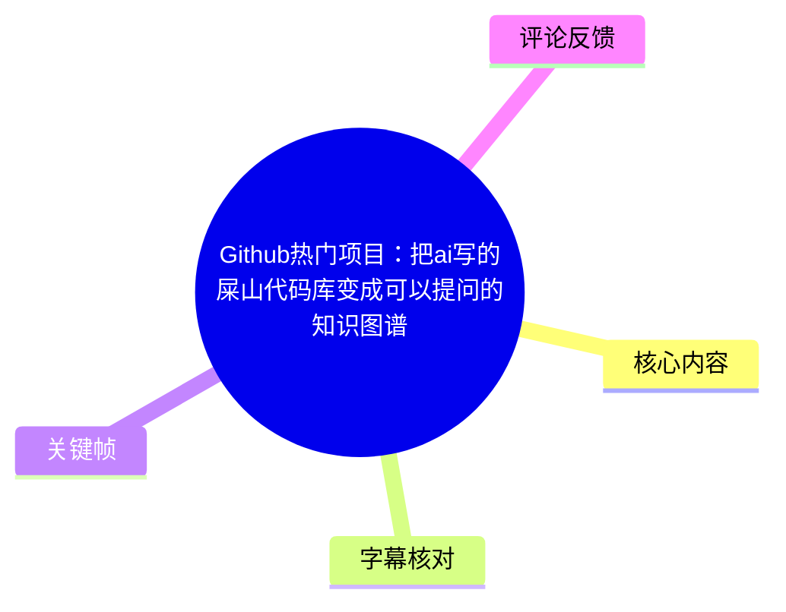
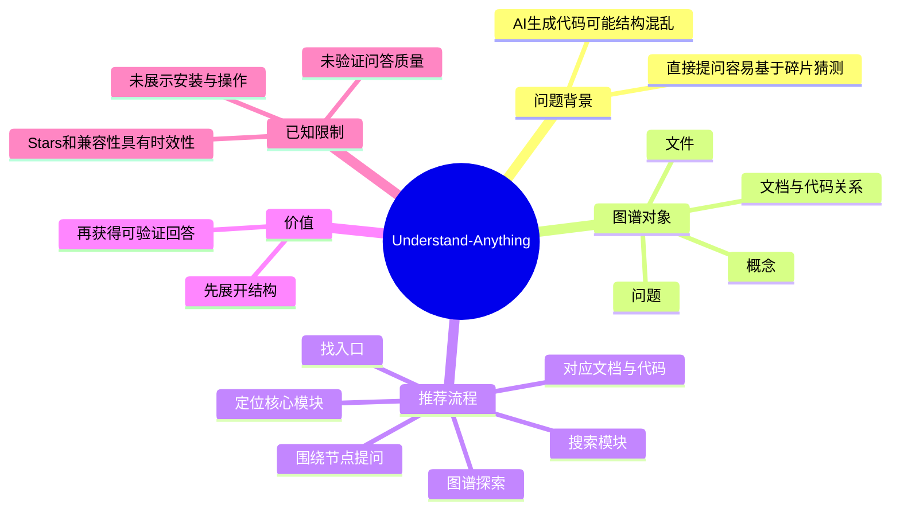
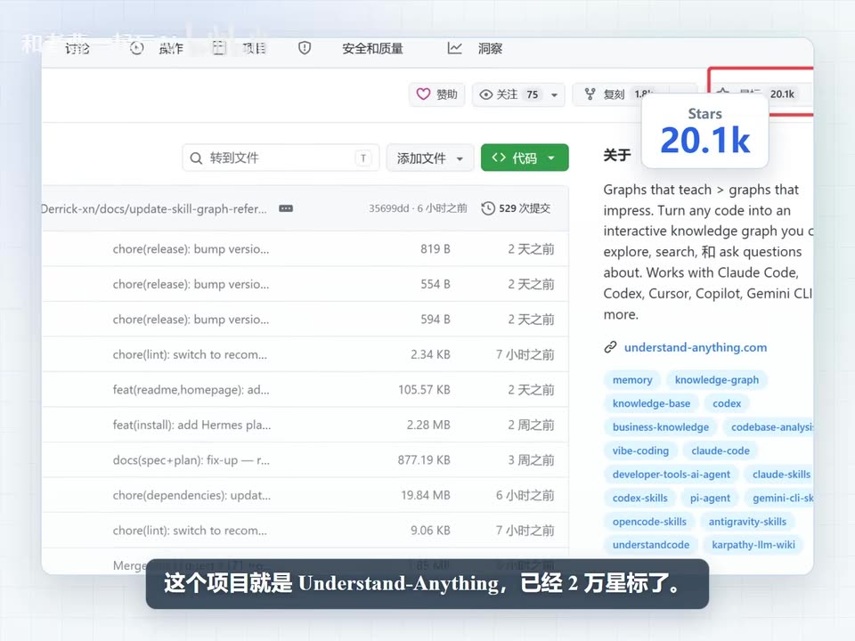
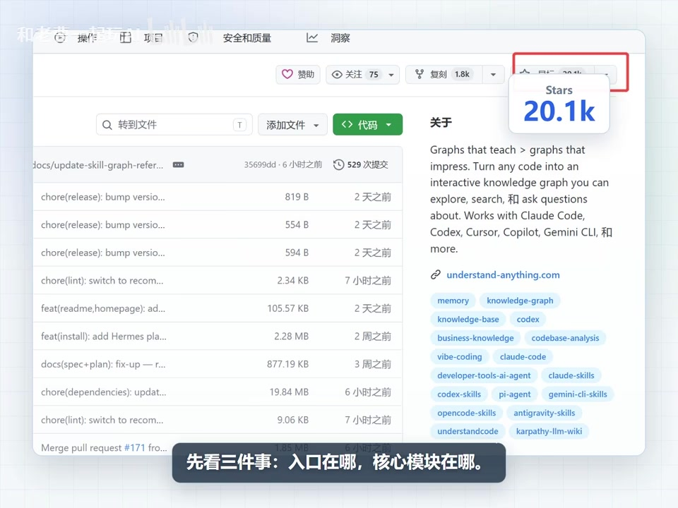
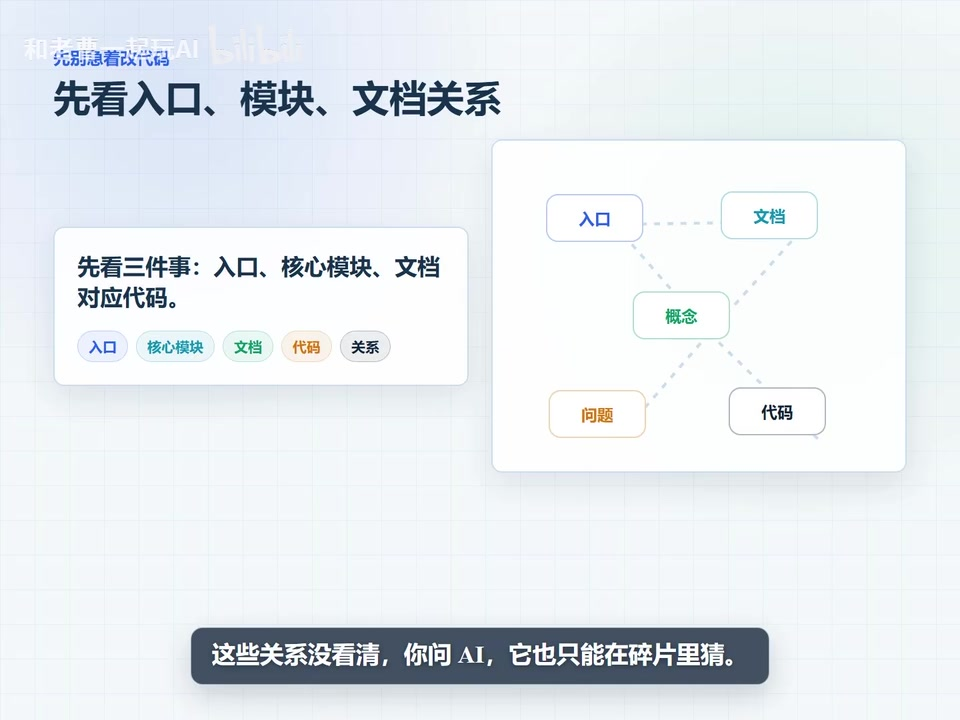

# Github热门项目：把ai写的屎山代码库变成可以提问的知识图谱

> 来源：[Bilibili 视频](https://www.bilibili.com/video/BV1JbGE6JEwK)  
> UP 主：和老曹一起玩AI ｜时长：62 秒｜合集：AIcode  
> 标签：科技猎手、屎山代码、GitHub、知识图谱

## 小结

视频介绍开源项目 **Understand-Anything**。UP 主将其定位为一种把代码库及相关文档组织为“可探索、可搜索、可提问”的知识图谱的工具，尤其面向 AI 辅助开发后可能出现的复杂、结构不清晰的代码库。

视频传递的核心方法不是让 AI 一开始就直接修改代码，而是先建立项目结构认知：确认**入口在哪里、核心模块在哪里、文档如何对应代码**。在这一结构没有厘清前，直接向 AI 提问，回答可能只是基于局部碎片进行猜测，较难验证。

项目图谱中的信息不止是文件列表。按视频表述，文件、概念和问题都可成为节点，重点在于展示它们之间的关系。推荐的使用路径是：**先沿图谱探索，再搜索模块，最后围绕具体节点提问**；这样得到的 AI 回答更容易回到具体结构中核验。

画面中的 GitHub 页面显示该项目当时约有 **20.1k Stars、1.8k Forks**，采用 **MIT License**；口播概括为“已 2 万星标”。这些均是视频制作时的页面快照，不应视为当前实时数据。画面还列出 Claude Code、Codex、Cursor、Copilot、Gemini CLI 等兼容或搭配对象，但视频没有展示具体安装命令、运行环境、模型配置、索引耗时或实际问答效果。

## 思维导图

## 目录

- [项目定位与热度快照](#项目定位与热度快照)
- [先建立结构认知：入口、模块与文档](#先建立结构认知入口模块与文档)
- [知识图谱如何组织项目](#知识图谱如何组织项目)
- [图谱优先于聊天框的工作流](#图谱优先于聊天框的工作流)
- [可搭配的 AI 编程工具与边界](#可搭配的-ai-编程工具与边界)
- [实践步骤、参数与限制](#实践步骤参数与限制)
- [字幕比对](#字幕比对)
- [评论分析](#评论分析)
- [处理记录](#处理记录)

## 项目定位与热度快照

### Understand-Anything：将代码库和文档转为知识图谱 [00:00:26](https://www.bilibili.com/video/BV1JbGE6JEwK?t=26)

视频介绍的项目名称为 **Understand-Anything**。其目标是把 AI 生成的复杂代码库及文档转换为可交互的知识图谱，而不是只呈现传统目录树或文件清单。

视频与画面可确认的项目快照信息如下：

| 项目项 | 视频中呈现的信息 | 说明 |
| --- | --- | --- |
| 项目名称 | Understand-Anything | 标题页、GitHub 页面及口播均出现 |
| Stars | 20.1k（口播称“2 万星标”） | 视频画面中的历史快照，非实时查询结果 |
| Forks | 1.8k | 仅见于项目展示画面 |
| 许可证 | MIT | 仅见于项目展示画面 |
| 核心定位 | 将代码转为可探索、可搜索、可提问的交互式知识图谱 | 来自 GitHub 页面英文简介及口播概括 |

> 图：开场页将 Understand-Anything 概括为“AI 代码库变知识图谱”，同时显示 20.1k Stars、1.8k Forks 和 MIT License。该帧适合用于区分“视频所见的项目快照”与当前项目的实时状态。

> 图：GitHub 项目页右侧“About”区域显示 20.1k Stars，并描述其可将代码转化为可探索、可搜索和可提问的交互式知识图谱。它是核对项目名称、星标量级及功能定位的画面证据。

### 时效性与“热门”表述

“GitHub 热门”“2 万星标”是视频发布时的叙述与截图状态。素材没有提供项目仓库链接、抓取日期对应的 GitHub 实时数据，因而不能据此断言其目前仍处于热门榜单、Stars/Forks 数量不变，或功能与兼容列表没有更新。

此外，元数据中的 `pubdate` 与素材抓取时间字段均为任务提供的记录；本文只将其作为视频资料的时间背景，不将其延伸为对项目当前版本的判断。

## 先建立结构认知：入口、模块与文档

### 修改代码前先确认三件事 [00:00:26](https://www.bilibili.com/video/BV1JbGE6JEwK?t=26)

UP 主给出的首要经验是：拿到复杂项目后，**不要马上让 AI 修改代码**。应优先回答以下三个结构问题：

1. **入口在哪**：项目从哪里启动、主要调用从何处进入。
2. **核心模块在哪**：承担主要业务或关键能力的模块分布在哪里。
3. **文档和代码怎么对应**：文档描述的概念、功能或流程，分别由哪些代码实现或支撑。

视频的判断是：若这些关系尚未看清，向 AI 发问时，AI 只能在缺少上下文的碎片中猜测。这里的“猜测”是 UP 主对复杂项目理解风险的概括，并非视频中展示的量化评测结论。

> 图：画面强调“先看三件事：入口在哪、核心模块在哪”，并以 GitHub 项目页作为背景。它将抽象的“理解代码库”落实为可执行的初步检查清单。

### 为什么这一步对 AI 生成代码尤其重要

视频标题以“AI 写的屎山代码库”描述代码质量或结构可读性不足的情境。视频没有定义“屎山代码”的技术指标，也没有提供特定代码库案例；其可迁移的经验是：无论代码由人还是 AI 编写，只要项目规模较大、模块关系不透明或文档脱节，先建立全局结构图都会比直接要求 AI 改动某个文件更稳妥。

这也是后续知识图谱的作用：先把项目中的关系显式化，再使提问落到具体的结构对象上。

## 知识图谱如何组织项目

### 文件、概念、问题与关系 [00:00:27](https://www.bilibili.com/video/BV1JbGE6JEwK?t=27)

按口播，Understand-Anything 做的事情是把代码库和文档变成“一张知识图谱”。UP 主特别说明：它并不只是列出文件，而是将**文件、概念、问题**之间的关系展示出来；问题也可以挂到具体节点上。

画面进一步给出可见的节点类型：

| 节点/对象 | 在视频中的含义 |
| --- | --- |
| 入口 | 用于定位项目的切入点 |
| 核心模块 | 用于识别关键实现区域 |
| 文档 | 承载说明、设计或使用信息 |
| 代码 | 具体实现载体 |
| 概念 | 跨文档与代码的业务/技术语义 |
| 问题 | 可关联到特定节点的待理解事项或提问 |

> 图：该帧以虚线连接“入口、文档、概念、问题、代码”等节点，并明确写出“先看入口、模块、文档关系”。它直观说明视频所说的知识图谱重点是关系，而非单纯文件枚举。

### 图谱的技术价值：把上下文显式化

视频没有披露内部实现，例如代码解析器、依赖抽取策略、向量检索方案、图数据库或 LLM 调用方式。因此，能够严格确认的是产品层面的交互目标，而不是其底层技术架构。

基于视频明确展示的节点关系，可以将其价值概括为：

- **结构可视化**：让入口、模块、文档、代码等对象以关系形式被查看。
- **语义关联**：让概念不局限于某一个文件，而可以同文档、实现和问题建立联系。
- **问题定位**：将问题挂到特定节点，使提问有明确上下文和可回查对象。
- **回答可验证性**：AI 给出解释后，使用者可以回到相关节点、模块或文档检查依据。

最后一项是 UP 主提出的工作方式收益，而非视频提供的实验数据或准确率承诺。

## 图谱优先于聊天框的工作流

### 先探索，再搜索，最后节点提问 [00:00:27](https://www.bilibili.com/video/BV1JbGE6JEwK?t=27)

视频中最值得讨论的观点是：理解复杂项目时，**聊天框未必应是第一入口**。UP 主将两者的角色区分为：

- **图谱**：负责把项目结构“摊开”，帮助使用者理解对象与关系。
- **聊天/AI 问答**：负责回答具体问题。

由此形成视频建议的实际顺序：

1. **顺着图谱探索**：从入口、模块、文档或概念节点进入，先理解整体结构。
2. **搜索模块**：在已建立的结构背景下，定位目标模块或相关信息。
3. **围绕节点提问 AI**：将问题绑定到具体节点或明确上下文中。
4. **验证答案**：回看图谱中的关联对象、文档和代码，检查回答是否与项目结构一致。

这一流程不是视频中演示的软件操作教程，而是 UP 主给出的理解复杂项目的策略。视频未展示搜索框输入、节点问答界面、提问模板、答案示例或验证结果，因此不能补充为具体产品操作步骤。

### 适合的使用场景

根据视频内容，该方法尤其适合以下情境：

- 接手缺乏清晰架构说明的旧代码库；
- 面对 AI 辅助生成、文件多且关联不透明的项目；
- 文档与实现需要反复对照的项目；
- 需要向 AI 询问“某概念由哪里实现”“某模块与哪些文档相关”等结构型问题。

不适合直接推断的场景包括：极小型单文件脚本、无需跨模块理解的局部修复，或要求立即产出部署配置、性能基准等具体工程结果的任务。视频没有对此进行对比测试。

## 可搭配的 AI 编程工具与边界

### 视频列举的搭配对象 [00:00:27](https://www.bilibili.com/video/BV1JbGE6JEwK?t=27)

UP 主称该项目适合与多种 AI 编程工具搭配使用。ASR 在该处对专有名词识别存在明显错误；结合 GitHub 页面画面，可较可靠地校正为：

- Claude Code
- Codex
- Cursor
- Copilot
- Gemini CLI
- 以及更多工具（画面英文为 “and more”）

需要注意，“Works with”或“适合搭配”不等同于视频已证明了每个工具的完整集成方式、官方插件状态或兼容性保证。视频未展示：

- 各工具的安装步骤；
- API Key、模型或权限配置；
- 是否需要 MCP、CLI、插件或特定工作区设置；
- 索引生成后如何传递给上述工具；
- 不同工具间的效果、成本和上下文限制对比。

因此，实际采用前仍需以项目当时的官方文档和各工具版本说明为准。

## 实践步骤、参数与限制

### 可依据视频执行的最小工作法 [00:00:27](https://www.bilibili.com/video/BV1JbGE6JEwK?t=27)

视频没有给出可复现命令或界面操作，但可严格整理出以下“方法层”步骤：

1. 准备需要理解的代码库及其相关文档。
2. 用 Understand-Anything 的思路或工具将代码、文档及其关系组织为图谱。
3. 首先查看项目入口与核心模块。
4. 查找文档描述与代码实现之间的对应关系。
5. 沿图谱探索，并搜索目标模块。
6. 将问题收敛到具体节点后再向 AI 提问。
7. 根据图谱中的关联信息回查 AI 回答。

### 已出现的参数与事实

| 类别 | 信息 | 来源与解释 |
| --- | --- | --- |
| 视频时长 | 62 秒 | 视频元数据 |
| ASR 有效语音覆盖 | 32.6 秒，占 61.3239 秒音频的约 53.16% | 本次 ASR 诊断 |
| 项目 Stars 快照 | 20.1k | 视频画面；口播四舍五入为“2 万” |
| 项目 Forks 快照 | 1.8k | 视频画面 |
| 许可证快照 | MIT | 视频画面 |
| ASR 模型 | medium | 本次识别诊断 |
| ASR 设备/精度 | CUDA / float16 | 本次识别诊断 |

### 重要限制

1. **没有安装教程**：视频未提供仓库地址、安装命令、依赖、配置文件或部署要求。
2. **没有性能数据**：未给出索引时长、资源占用、可支持代码库规模、图谱构建准确率或问答正确率。
3. **没有真实案例演示**：未展示从代码库输入到图谱生成、节点点击、搜索、提问及结果验证的完整过程。
4. **兼容性未经本视频逐项验证**：画面列出可搭配的 AI 编程工具，但未展示集成细节。
5. **图谱本身也可能受源材料影响**：若代码、文档或关联信息本身不完整，图谱和基于它的问答仍可能缺少上下文；这是由“图谱依赖输入材料”的一般逻辑得出的使用风险，视频没有对此做测评。
6. **热度和功能会变化**：Stars、Forks、标签、兼容列表与项目行为均可能在视频发布后更新。

## 字幕比对

| 字幕来源 | 完整性 | 专有名词 | 时间轴 | 主要问题 |
| --- | --- | --- | --- | --- |
| Bilibili 站内字幕 `p01-ai-zh.srt` | 不完整：仅覆盖约 00:00:00.160–00:00:42.080 | 无有效项目名或工具名 | 分段时间有效，但内容均为“♪ 音乐 ♪” | 没有转写实际口播，无法用于正文事实提取 |
| 本次 ASR 字幕 | 覆盖诊断为 32.6 秒语音、约 53.16% 音频时长 | 有较多误识别 | 共有 3 段，时间戳有效但分段极粗 | 首段仅 0.62 秒却包含大量文本；“史山/代砲/文桦”等同音或乱码较多，工具名称错误明显 |

本次 ASR 已被检查，诊断中**没有** `noAudioStream=true` 标记；素材也提供了 `audio/audio.wav`，故不能将字幕问题归因于源视频无音轨。站内字幕虽然拥有时间轴，但内容只有音乐标记，不能承载口播信息；正文以**本次 ASR 的时间范围和语义主线**为主，并以关键帧画面校正关键术语。

重要校正如下：

| ASR 原始识别 | 正文采用 | 校正依据 |
| --- | --- | --- |
| understand anything | Understand-Anything | 标题页与 GitHub 页面均清晰显示 |
| 史山 | 屎山 | 视频标题及画面字幕 |
| 代砲、代砂 | 代码 | 语境与画面文案 |
| 文桦、文界 | 文档 | 语境与画面文案 |
| 知诏图铺、图铺 | 知识图谱/图谱 | 视频标题、主视觉和节点图 |
| Cloud Code | Claude Code | GitHub 页面英文简介 |
| Cassel | Cursor | GitHub 页面英文简介 |
| Corepilot | Copilot | GitHub 页面英文简介 |
| Gemini C1 Lite | Gemini CLI | GitHub 页面英文简介 |

由于 ASR 的 3 个分段内部过于粗糙，本文只在章节层级使用其实际起始时间 26 秒、27 秒和 51 秒建立时间轴链接，不把其错误的极短分段误解为真实语速或逐字时间定位。

## 评论分析

未获取到可分析的热评。提供的评论数据中 `items` 为空，且视频元数据显示 `reply: 0`；因此不存在“热评前三条”，也不应虚构用户观点、补充信息或争议。

## 处理记录

- Worker ID：`worker-mrj0wbly-5dc4e50c`
- 模型：`gpt-5.6-terra`
- 使用素材与工具结果：
  - 视频元数据与页面信息；
  - 音频导出文件 `audio/audio.wav`；
  - 本次 ASR 结果 `asr/asr-result.json`、`asr/transcript.srt`、`asr/asr-transcript.txt`；
  - 站内字幕 `subtitles/p01-ai-zh.srt`；
  - 关键帧提取目录 `frames/`；
  - 评论采集结果 `comments/comments.json`。
- ASR 配置记录：`medium` 模型、语言识别为中文（置信度 `0.9990234375`）、CUDA、`float16`；总音频时长 `61.3239375` 秒。
- 字幕选择：未采用站内字幕作为口播正文依据，原因是其全部内容为音乐标记；采用本次 ASR 的有效时间段与语义，并根据标题、画面内文字和 GitHub 截图校正专有名词。
- 关键帧选择依据：
  - `frames/frame-001.jpg`：项目定位、Stars/Forks/License 快照；
  - `frames/frame-002.jpg`：GitHub About 区域及功能英文描述；
  - `frames/frame-003.jpg`：入口与核心模块的优先检查方法；
  - `frames/frame-004.jpg`：入口、文档、概念、问题、代码之间的图谱关系。
- 缓存清理：素材未提供缓存清理执行记录，无法确认是否已清理；本文不将其标记为已完成。
- 未解决问题：
  - 未提供 Understand-Anything 的仓库链接、版本号和官方安装文档；
  - 未展示实际构图、检索与节点问答过程；
  - GitHub 星标、Fork 数和兼容工具列表仅能确认视频截图时状态，无法据此确认当前状态。
