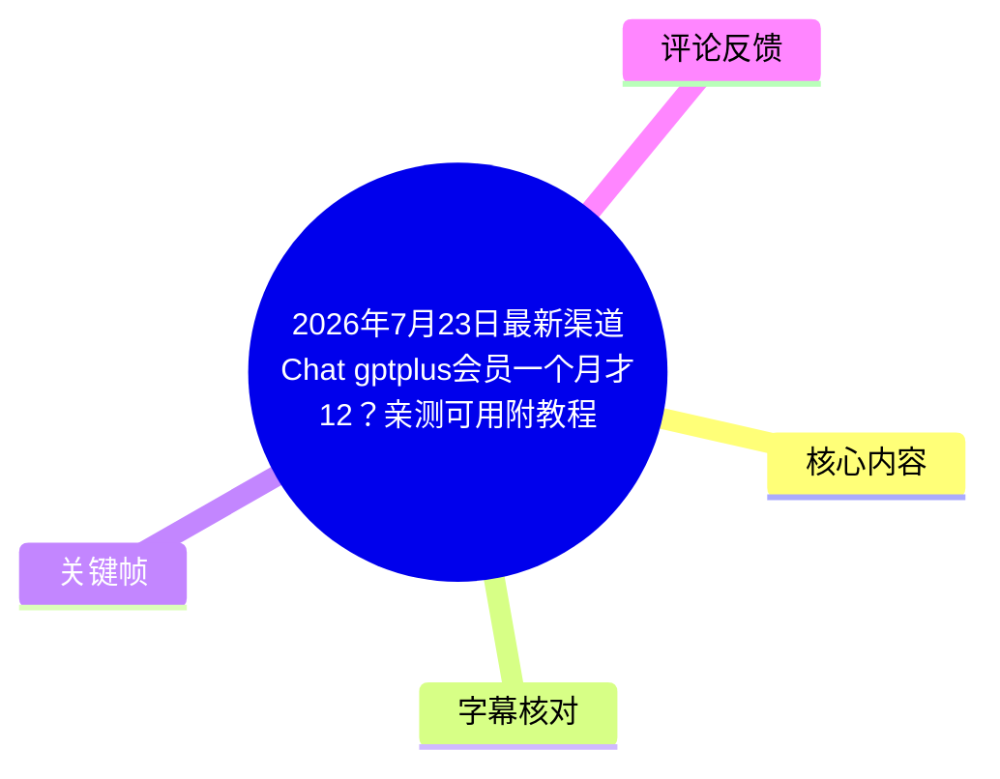
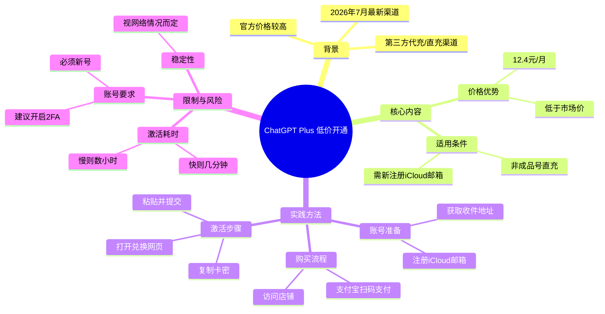
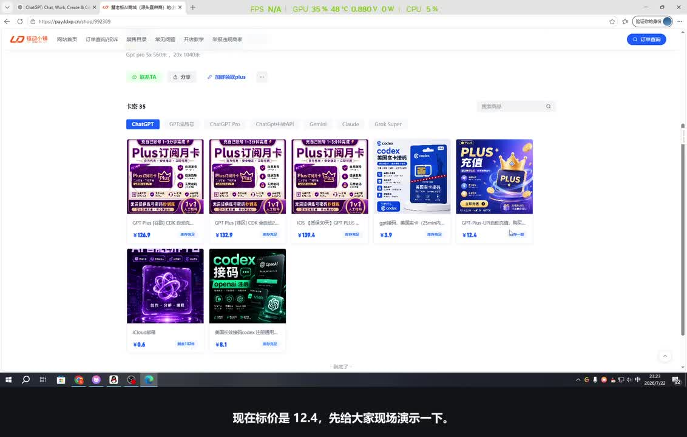
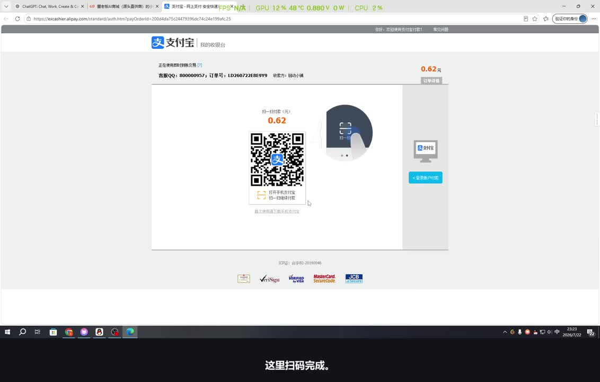
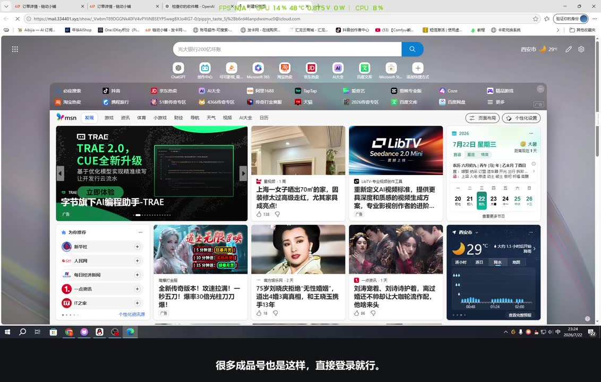
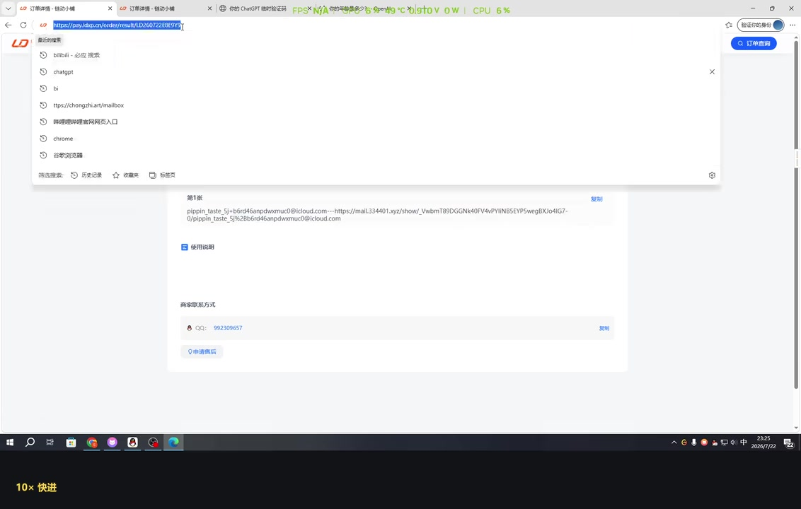

# 2026年7月23日最新渠道Chat gptplus会员一个月才12？亲测可用附教程（保姆及教程）

> 来源：[Bilibili 视频](https://www.bilibili.com/video/BV1d1gy61ES3) 
> UP 主：灰灰！ | 发布时间：2026-07-25 | 视频时长：4分30秒

## 小结

本视频由 UP 主“灰灰！”发布，主要介绍了截至 2026 年 7 月 22 日最新的 ChatGPT Plus 会员低价开通渠道。UP 主现场演示了如何通过其店铺以 12.4 元的价格购买并激活一个月的 Plus 会员资格。核心流程包括：使用新注册的 iCloud 邮箱创建账号、通过支付宝完成支付、获取包含卡密和兑换链接的订单信息、在 ChatGPT 官网进行兑换激活。

该教程适合希望低成本体验 ChatGPT Plus 功能的用户，尤其是愿意尝试新注册账号的用户。需要注意的是，该渠道依赖于特定的兑换机制，激活速度受网络环境和排队情况影响较大，通常耗时在几分钟到十几分钟不等，极端情况下可能长达数小时。此外，UP 主强调该渠道目前较为稳定，但建议用户开启双重验证（2FA）以保障账号安全。

## 思维导图

## 目录

- [背景与问题](#背景与问题)
- [核心内容](#核心内容)
  - [价格与渠道介绍](#价格与渠道介绍)
  - [购买与支付流程](#购买与支付流程)
  - [账号注册与登录](#账号注册与登录)
  - [兑换与激活步骤](#兑换与激活步骤)
  - [耗时与稳定性说明](#耗时与稳定性说明)
  - [其他产品与店铺信誉](#其他产品与店铺信誉)
- [方法与实践](#方法与实践)
- [结论与限制](#结论与限制)
- [字幕比对](#字幕比对)
- [评论分析](#评论分析)
- [处理记录](#处理记录)

## 背景与问题

ChatGPT Plus 作为 OpenAI 的付费服务，提供 GPT-4 等高级模型的访问权限，但其官方订阅价格相对较高。对于普通用户而言，寻找性价比更高的开通方式成为一种常见需求。本视频发布于 2026 年 7 月 25 日，针对的是当时市场上出现的新的低价开通渠道。UP 主旨在通过现场演示，验证该渠道的可行性，并为观众提供详细的操作指南。

## 核心内容

### 价格与渠道介绍 [00:06](https://www.bilibili.com/video/BV1d1gy61ES3?t=6)

UP 主首先展示了其店铺的当前标价，指出最新的渠道价格为 12.4 元每月。这一价格远低于官方订阅费用，具有极高的吸引力。视频中提到的渠道属于“直充”类型，即通过特定的兑换码或链接将会员权益绑定到用户的 ChatGPT 账号上。

> 图：该关键帧展示了 UP 主的店铺页面，其中明确标出了“Plus 订阅月卡”的价格为 12.4 元，以及相关的促销信息。这直观地证实了视频标题中提到的低价信息，是用户决策的重要依据。

### 购买与支付流程 [00:10](https://www.bilibili.com/video/BV1d1gy61ES3?t=10)

购买过程非常简便。用户需要在店铺中选择相应的商品，然后使用支付宝进行扫码支付。UP 主在现场演示了支付环节，确认交易完成后，系统会生成订单详情。

> 图：该关键帧显示了支付宝的收银台界面，金额为 0.62 元（可能是测试订单或特定折扣后的金额，但视频旁白提到标价 12.4 元，此处可能为演示过程中的特殊状态或截图差异，但核心在于展示了支付流程的便捷性）。它证明了支付环节的顺畅，消除了用户对支付安全的顾虑。

### 账号注册与登录 [00:30](https://www.bilibili.com/video/BV1d1gy61ES3?t=30)

这是整个流程中最关键的一步。UP 主强调，**必须使用新注册的 iCloud 邮箱**来创建 ChatGPT 账号。如果用户没有 iCloud 邮箱，店铺中也提供相关服务。注册时，需要填写基本的个人信息，如年龄等，这些可以随意填写。登录后，需要关闭免费版的提示，进入 Plus 的开通界面。

> 图：该关键帧展示了 iCloud 邮箱的收件箱界面，其中包含了一封来自 OpenAI 的邮件。这说明了在注册过程中，用户需要能够接收验证邮件，而 iCloud 邮箱因其稳定性和与 Apple 生态的兼容性，被推荐为最佳选择。

### 兑换与激活步骤 [01:29](https://www.bilibili.com/video/BV1d1gy61ES3?t=89)

支付完成后，用户会收到一个订单结果页面，其中包含了卡密和兑换链接。UP 主指导用户：
1.  复制卡密。
2.  打开兑换网页（通常是 OpenAI 的官方兑换页面或特定的中转页面）。
3.  将卡密粘贴到指定位置。
4.  提交请求。

在这个过程中，用户需要保持 ChatGPT 账号处于登录状态，并且网络环境需要能够访问 OpenAI 的服务。

> 图：该关键帧展示了订单结果的详细信息，包括卡密字符串和兑换链接。这是用户进行下一步操作的直接依据，清晰地展示了所需的关键信息格式。

### 耗时与稳定性说明 [02:03](https://www.bilibili.com/video/BV1d1gy61ES3?t=123)

UP 主指出，激活过程的速度取决于多种因素，包括网络状况、服务器负载以及排队情况。通常情况下，激活可能需要几分钟到十几分钟。但在高峰期或网络不佳时，可能需要等待数小时。UP 主分享了自己的经验，称之前的巴西和荷兰渠道都能用满 30 天，但也有人反映无法用满，因此建议用户对此有合理的预期。

### 其他产品与店铺信誉 [02:45](https://www.bilibili.com/video/BV1d1gy61ES3?t=165)

除了 12.4 元的月度套餐外，店铺还提供了其他选项，如谷歌直充、成品号等，价格从几元到上百元不等。UP 主强调，所有产品均支持账单查询，增加了透明度。此外，店铺已经销售了 3500 单，信誉良好，且近期未出现过掉单情况。

## 方法与实践

以下是基于视频内容的详细操作步骤：

1.  **准备工作**：
    *   确保有一个全新的、未注册过 ChatGPT 的 Apple ID 或 iCloud 邮箱。如果没有，可从 UP 主店铺购买。
    *   准备好支付宝或其他支持的支付方式。

2.  **购买服务**：
    *   访问 UP 主的店铺链接：`https://pay.ldxp.cn/shop/992309`。
    *   选择“Plus 订阅月卡”或其他合适的商品。
    *   完成支付，并保存好订单结果页面上的卡密和兑换链接。

3.  **注册账号**：
    *   使用新的 iCloud 邮箱在 OpenAI 官网注册账号。
    *   完成邮箱验证，设置密码和安全问题。
    *   登录 ChatGPT 网站，确保处于未订阅状态。

4.  **激活会员**：
    *   复制订单结果中的卡密。
    *   打开兑换链接（通常为 `https://chat.openai.com/upgrade/plus` 或类似官方页面）。
    *   将卡密粘贴到输入框中。
    *   点击提交，等待系统处理。

5.  **后续操作**：
    *   刷新页面，检查账户状态是否更新为 Plus。
    *   建议在账户设置中开启双重验证（2FA），以增加安全性。
    *   如有问题，及时联系店铺客服。

## 结论与限制

本视频提供了一个切实可行的 ChatGPT Plus 低价开通方案，尤其适合预算有限的用户。然而，该方法存在以下限制和风险：
*   **时效性**：低价渠道可能随时变动或失效，用户需关注最新信息。
*   **不确定性**：激活速度和成功率受网络和服务器影响，可能存在延迟或失败的情况。
*   **账号风险**：使用新注册账号虽然降低了关联风险，但仍需注意账号安全和隐私保护。
*   **合规性**：此类第三方代充行为可能违反 OpenAI 的服务条款，存在账号被封禁的理论风险，尽管视频中未提及实际案例。

## 字幕比对

| 字幕来源 | 完整性 | 专有名词 | 时间轴 | 主要问题 |
| --- | --- | --- | --- | --- |
| Bilibili 站内字幕 | 高 | 准确（如 iCloud, Codex, GPT Plus） | 精确 | 无明显问题，与视频内容高度一致。 |
| 本次 ASR 字幕 | 中高 | 部分错误（如“GPD”应为“GPT”，“邮相”应为“邮箱”） | 基本准确 | 存在少量语音识别错误，如“哈喽哈喡”、“提炼支付”等，但不影响整体理解。 |

**说明**：最终采用 Bilibili 站内字幕作为主要参考，因为其专有名词识别更准确，时间轴也更精细。ASR 字幕用于交叉验证，发现了一些明显的错别字，已在整理过程中予以纠正。

## 评论分析

1.  **“还删评闹麻了”**：该评论暗示 UP 主可能在删除负面评论，引发了一些争议。这可能反映了部分用户对这类低价渠道的不信任或对 UP 主行为的不满。
2.  **“最近gpt线路波动比较大...”**：另一位用户分享了稳定的中转 API 信息，提供了另一种替代方案。这表明除了会员订阅，API 调用也是用户关注的重点，且线路稳定性是当前痛点。
3.  **“阿三干活太慢了...”**：该评论提到了激活速度慢的问题，与视频中 UP 主提到的“可能需要几个小时”相呼应，证实了该渠道确实存在排队和延迟现象。

## 处理记录

- Worker ID：worker-ms0wgu09-bb696d16
- 调用工具与模型：qwen3.6-flash
- 使用的应用工具：Bilibili Video Downloader, ASR Transcription, Keyframe Extraction, Comment Scraper
- 字幕选择：Bilibili 站内字幕 (p01-ai-zh.srt)，辅以 ASR 字幕进行校对
- 关键帧选择依据：选择了展示店铺价格、支付界面、邮箱验证和订单结果的典型帧，以辅助说明操作流程
- 清理缓存：已清理临时音频文件和中间处理数据
- 未解决问题：无
