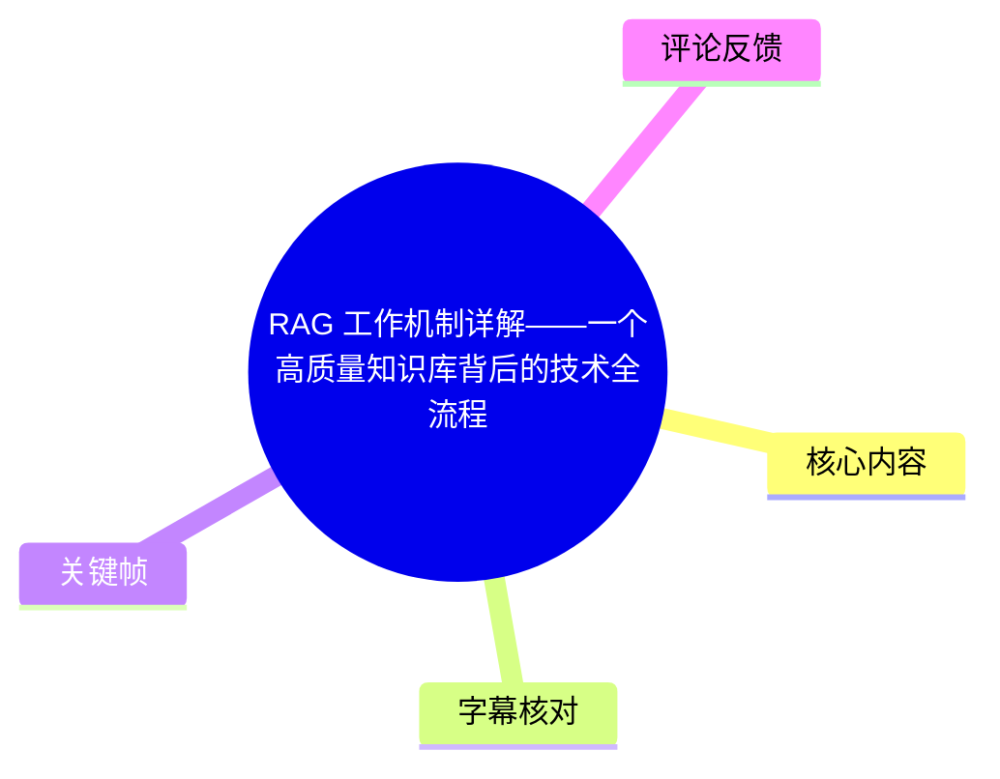
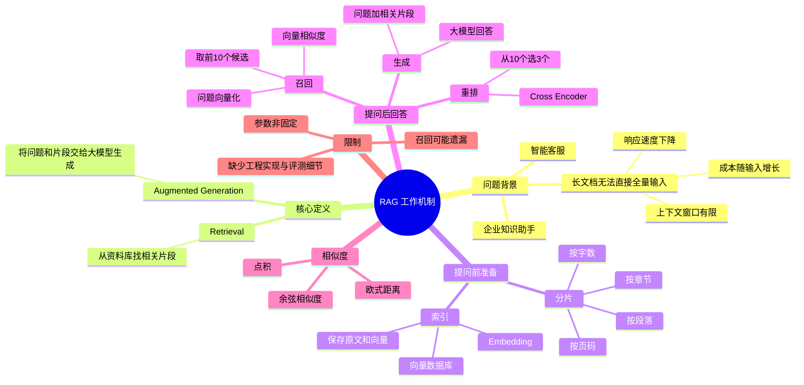
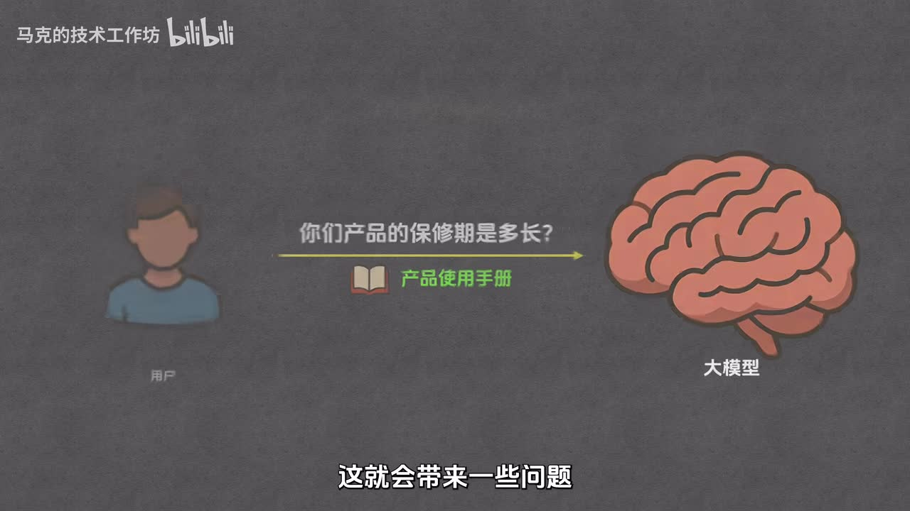
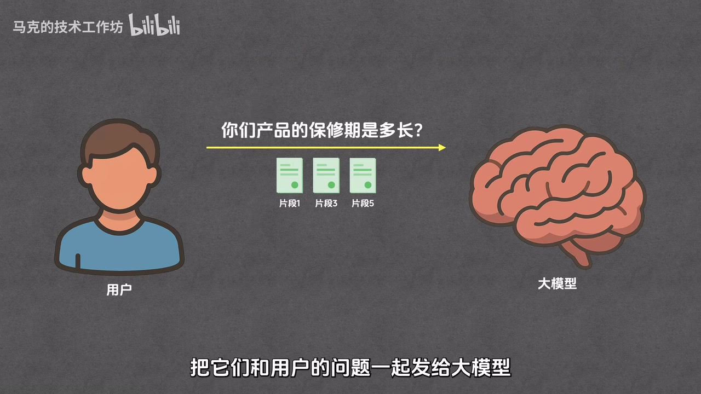
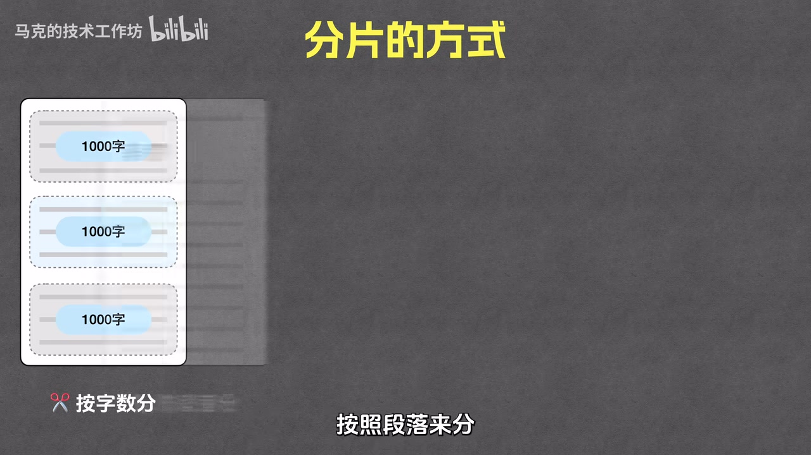
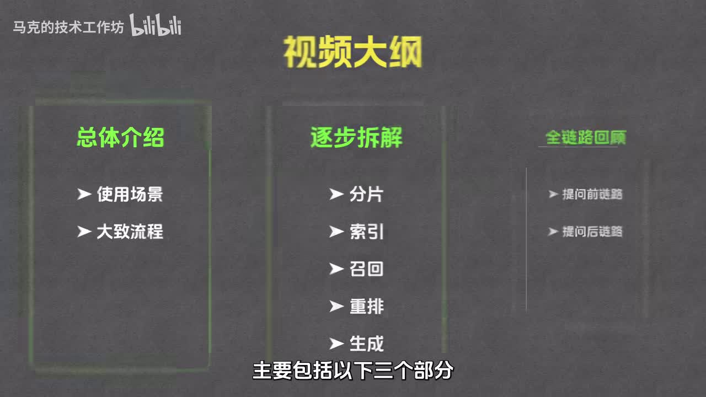

# RAG 工作机制详解——一个高质量知识库背后的技术全流程

> 来源：[Bilibili 视频](https://www.bilibili.com/video/BV1JLN2z4EZQ)  
> UP 主：马克的技术工作坊｜发布时间：2025-06-21｜视频时长：17:02  
> 标签：AI、RAG、大模型、知识库、向量、客服、编程教程

## 小结

RAG（Retrieval Augmented Generation，检索增强生成）是一种面向知识库问答、企业知识助手和智能客服的常见方案。视频将其概括为两件事：**先从资料库中检索相关内容，再基于这些内容让大模型生成答案**。它的价值在于，不必把整本产品手册或全部企业资料一次性塞进模型上下文，而是只提供与当前问题有关的少量片段。

视频解释了“直接把完整文档交给大模型”在长文档场景中的三个主要问题：模型的上下文窗口有限、输入越多推理成本越高、模型消化更多内容会拖慢响应速度。RAG 通过文档分片、向量化索引、相似度召回、重排与生成，试图在相关性、成本和延迟之间取得平衡。

完整流程分为两段。**提问前**，对资料进行分片，为每个片段生成 Embedding 向量，并把“原始文本 + 对应向量”保存到向量数据库中，完成知识库构建。**提问后**，将用户问题向量化，从库中粗筛一批相近片段；再以 Cross Encoder 做精排；最后将问题与筛出的片段共同交给大模型生成回答。

视频中的示例参数是：召回阶段从所有片段中取 **10 个**候选，重排阶段从这 10 个中选出 **3 个**最相关片段。作者同时明确说明，10、15、20 等召回数量均可选，数字本身不是固定规则；这里的“10 → 3”是讲解流程的演示配置，而不是通用最优参数。

这是一支**概念与机制导向**的视频：它解释了向量、Embedding、向量数据库、余弦相似度、欧式距离、点积以及 Cross Encoder 的角色，但没有提供可直接运行的代码、具体数据库产品、切分长度调优方法、评测指标或工程部署细节。因此，适合刚开始理解 RAG 链路的人；若要落地生产系统，还需要补充数据清洗、元数据过滤、权限控制、召回评测、引用溯源、提示词约束与持续更新等工程环节。

视频发布于 2025 年 6 月，内容中的具体模型名称、MTEB 排行榜结果和模型能力会随时间变化；RAG 的基本流程可作为稳定的入门框架，但不应把视频中提到的模型或排行视作截至当前仍然有效的选型结论。

## 思维导图





## 目录

- [背景：为什么不能直接把整份资料交给大模型](#背景为什么不能直接把整份资料交给大模型)
- [RAG 的最小工作链路](#rag-的最小工作链路)
- [提问前：分片与索引](#提问前分片与索引)
  - [分片：把文档拆成可检索单元](#分片把文档拆成可检索单元)
  - [索引：Embedding、向量与向量数据库](#索引embedding向量与向量数据库)
- [提问后：召回、重排与生成](#提问后召回重排与生成)
  - [召回：从全部片段中粗筛候选](#召回从全部片段中粗筛候选)
  - [向量相似度：余弦、欧式距离与点积](#向量相似度余弦欧式距离与点积)
  - [重排：用 Cross Encoder 精选结果](#重排用-cross-encoder-精选结果)
  - [生成：基于问题和片段回答](#生成基于问题和片段回答)
- [端到端流程与实施清单](#端到端流程与实施清单)
- [关键限制、适用边界与时效性](#关键限制适用边界与时效性)
- [字幕比对](#字幕比对)
- [评论分析](#评论分析)
- [处理记录](#处理记录)

## 背景：为什么不能直接把整份资料交给大模型 [00:01:24](https://www.bilibili.com/video/BV1JLN2z4EZQ?t=84)

视频以“智慧客服”为例：用户询问公司产品的保修期，系统需要回答有关产品的各种问题。客服内部可以使用 GPT-4o、DeepSeek 一类大模型，但大模型本身并不知道企业内部的产品信息。

一种直觉方案是：每次用户提问时，将用户问题和完整产品手册一起发给模型。视频认为，在产品手册达到数百页甚至上千页时，这种做法会产生以下问题：

1. **上下文窗口限制**：每个模型只能容纳有限的信息量，即上下文窗口大小。资料超过窗口后，模型无法完整读取，且可能出现“后面忘了前面”的情况，影响回答准确性。
2. **推理成本上升**：输入文本越多，成本越高。若每次问答都附带一本很厚的手册，单次调用成本会显著增加。
3. **响应变慢**：模型需要处理的输入越多，输出通常越慢；将数百页手册直接送入模型会对推理速度造成严重影响。

因此，视频提出的核心转向是：**不要发送全部文档，而是先找出文档中真正与当前问题相关的内容，再将这些内容交给模型。**



> 图：画面展示用户提出“你们产品的保修期是多长？”并将“产品使用手册”直接传给大模型。这张图直观呈现了视频批评的全量上下文方案，是理解 RAG 必要性的起点。

## RAG 的最小工作链路 [00:02:57](https://www.bilibili.com/video/BV1JLN2z4EZQ?t=177)

RAG 的全称为 **Retrieval Augmented Generation**，中文通常译作“检索增强生成”。

按照视频的定义，它包含两个连续动作：

1. **检索（Retrieval）**：在资料库的全部片段中找到和用户问题有关的内容。
2. **生成（Generation）**：把用户问题与找到的相关内容一起交给大模型，由模型据此生成答案。

视频举例：对于一本数百页的产品手册，某个问题可能只与 3 个片段有关。系统将这 3 个片段和问题一并发送给大模型，模型处理的是有限的、相关的上下文，而不是整本手册。由此缓解上下文长度、成本与速度问题。

作者特别提醒：这只是简化链路，真正实现仍涉及“如何分片”和“如何选择相关片段”等细节。随后将整体流程拆分为五个环节：

| 阶段 | 发生时机 | 环节 | 目的 |
| --- | --- | --- | --- |
| 数据准备 | 用户提问前 | 分片 | 将资料拆成多个可处理片段 |
| 数据准备 | 用户提问前 | 索引 | 向量化并写入向量数据库 |
| 回答问题 | 用户提问后 | 召回 | 从大量片段中找出候选 |
| 回答问题 | 用户提问后 | 重排 | 对候选进行更精细的相关性排序 |
| 回答问题 | 用户提问后 | 生成 | 大模型根据候选片段回答问题 |



> 图：画面中用户的问题指向“片段 1、片段 3、片段 5”，再一起传给大模型。它准确对应视频所说的“只发相关片段”的 RAG 最小链路。

## 提问前：分片与索引 [00:04:21](https://www.bilibili.com/video/BV1JLN2z4EZQ?t=261)

### 分片：把文档拆成可检索单元 [00:04:21](https://www.bilibili.com/video/BV1JLN2z4EZQ?t=261)

分片（Chunking）就是把一篇文档切分为多个片段。视频列出的切分方式包括：

- **按字数分**：例如每 1000 字一个片段；
- **按段落分**：一个段落一个片段；
- **按章节分**；
- **按页码分**；
- 以及其他切分方式。

无论具体采用何种规则，目标都是将一篇原始文档拆成多份，以便后续分别处理、检索与返回。

视频没有给出“每片必须多少字”或“必须有多少重叠”的固定工程参数。画面中出现的“1000 字”是按字数分片的示例，不应被理解为通用推荐值。



> 图：画面标题为“分片的方式”，展示将文档切为多个“1000 字”片段的方式。它说明分片的核心是建立多个可独立检索的文本单元，而不是保留整篇文档。

### 索引：Embedding、向量与向量数据库 [00:04:56](https://www.bilibili.com/video/BV1JLN2z4EZQ?t=296)

视频定义的“索引”包含两步：

1. 通过 **Embedding** 将每个片段文本转换为向量；
2. 将片段原文及其对应向量一同存入**向量数据库**。

#### 1. 向量是什么

视频先从数学概念解释向量：向量是一个具有大小和方向的量，通常可用数组表示。数组中数值的个数对应向量维度。

- 一维向量可以在一维坐标轴上展示，例如 `1` 表示大小为 1、方向向右；`-3` 表示大小为 3、方向向左。
- 二维向量需要二维坐标系，例如 `(2, 2)`、`(-1, 2)`。
- 三维向量需要三维坐标系。
- 在 RAG 中使用的向量维度通常较大，可能是数百维甚至数千维，无法直接可视化。

视频的表述是：一般而言，维度越大，单个向量承载的信息越丰富，后续基于向量进行工作的可靠性也可能越强。这是教学性的概括，不等价于“维度越高必然越好”；具体效果仍依赖 Embedding 模型、数据分布、检索策略和资源约束。

#### 2. Embedding 是什么

Embedding 是将文本转换为向量的过程。视频使用二维示例说明语义关系：

- “马克喜欢吃水果”对应一个向量；
- “马克爱吃水果”对应一个与前者接近的向量；
- “天气真好”对应一个距离较远的向量。

该示例表达的是：**语义相近的文本，经 Embedding 后，其向量通常也会更接近**。因此，用户问“马克喜欢吃什么”时，也可以先把问题转换为向量，再借助向量相似度找回相关句子。

Embedding 由专门的 Embedding 模型执行，不是视频中所举的 GPT-4o、DeepSeek 等通用生成模型本身。视频建议可参考 **MTEB 排行榜**了解 Embedding 模型评测与排序；但榜单结果具有时效性，选型时应以当前榜单、语言覆盖、领域数据和实际评测为准。

#### 3. 向量数据库保存什么

向量数据库用于存储与查询向量，并针对向量存储、相似度计算等需求做优化。

视频强调：写入向量数据库时，不能只保存向量，还应保存**原始文本**。原因是检索阶段虽然依赖向量相似度找到相近向量，但最终送给大模型处理的是对应的原文片段，而不是一串向量数字。

因此，视频所描述的最基本表结构至少包括：

| 字段 | 用途 |
| --- | --- |
| 原始文本 | 检索命中后取回，作为大模型回答的上下文 |
| 向量 | 表示文本语义，用于相似度计算与近邻查询 |

索引阶段会对每个片段重复以上过程：片段 1 向量化并入库、片段 2 向量化并入库，直到所有片段处理完毕。至此，提问前的知识库准备完成。

## 提问后：召回、重排与生成 [00:09:42](https://www.bilibili.com/video/BV1JLN2z4EZQ?t=582)

### 召回：从全部片段中粗筛候选 [00:09:42](https://www.bilibili.com/video/BV1JLN2z4EZQ?t=582)

召回（Retrieval）指搜索与用户问题相关片段的过程。视频给出的顺序如下：

1. 用户输入问题；
2. 将问题发送给 Embedding 模型；
3. Embedding 模型将问题转换为问题向量；
4. 将问题向量提交给向量数据库；
5. 向量数据库查询并返回与问题最相似的一批片段。

视频演示中，向量数据库返回最相关的 **10 个片段**。作者明确说明，这个数量不是固定值，也可以选 15、20 等；重点是返回数量应是可控的有限集合，而不是把全部片段交给后续模型。

召回的关键任务是：为问题向量与库中每个片段向量计算相似度，排序后选取数值最高的一批。视频为便于讲解只展示了 3 条数据，但实际使用时需要在全部片段范围内进行检索。

### 向量相似度：余弦、欧式距离与点积 [00:11:43](https://www.bilibili.com/video/BV1JLN2z4EZQ?t=703)

视频列举三种常见的向量相似度或关联度计算方式：

| 方法 | 视频中的解释 | 判定直觉 |
| --- | --- | --- |
| 余弦相似度 | 计算两个向量夹角的余弦值 | 夹角越小，相似度越高 |
| 欧式距离 | 计算两个向量之间的直线距离 | 距离越小，相似度越高 |
| 点积 | 代数方式衡量向量关系，同时考虑方向与长度 | 点积越大，视频中视为相似度越高 |

关于点积，视频进一步说明：

- 两个向量方向一致时，向量越长，点积越大；
- 两个向量方向相反时，点积为负；
- 两个向量垂直时，点积为 0；
- 因此可通过点积判断向量是否朝同一方向，以及“同向程度”。

这里应注意一个实现层面的边界：视频以教学方式讲解三种方法的直觉和排序方向，但没有讨论向量是否归一化、不同 Embedding 模型的相似度推荐方式、近似最近邻索引算法或距离度量配置。在实际系统中，距离度量必须与所选模型及数据库配置一致。

召回完成后，视频中的 10 个候选片段会进入重排阶段。

### 重排：用 Cross Encoder 精选结果 [00:13:11](https://www.bilibili.com/video/BV1JLN2z4EZQ?t=791)

重排（Reranking）即重新排序。它与召回一样都在衡量“片段与问题是否相关”，但处理范围和计算方式不同：

| 环节 | 输入范围 | 视频示例输出 | 核心方法 | 特点 |
| --- | --- | --- | --- | --- |
| 召回 | 全部片段 | 前 10 个候选 | 向量相似度 | 成本低、耗时短、准确率相对低 |
| 重排 | 召回的 10 个候选 | 前 3 个片段 | Cross Encoder | 成本较高、耗时较长、准确率较高 |

视频回答了“为何不在召回阶段直接取 3 个”的问题：因为召回和重排使用不同的文本相似度计算逻辑。向量相似度计算较快，适合从成千上万片段中粗筛；Cross Encoder 成本更高、速度更慢，但准确率更高，适合对较少候选进行精挑细选。

作者使用招聘类比：

- **召回**像筛简历：候选数量极大，只能快速粗略筛出 10 位候选人；
- **重排**像面试：对这 10 人进行更仔细判断，尽可能选出最合适的 3 人。

该设计体现的是一种两阶段检索策略：先以低成本扩大候选覆盖，再以高精度模型提高最终上下文质量。

### 生成：基于问题和片段回答 [00:15:11](https://www.bilibili.com/video/BV1JLN2z4EZQ?t=911)

生成阶段的输入包括：

- 用户原始问题；
- 重排后选出的 3 个相关片段。

系统将两部分共同发送给大模型，让模型**根据片段内容**回答用户问题。视频将这一步视为整条 RAG 流程的终点。

需要区分的是：视频讲清了“把什么交给模型”，但没有展示生成阶段的提示词模板，也没有说明如何要求模型拒答、如何返回引用来源、如何在片段不足时提示“不知道”。这些都属于生产级 RAG 中影响答案可信度的关键补充项，但并未在视频中展开。

## 端到端流程与实施清单 [00:15:30](https://www.bilibili.com/video/BV1JLN2z4EZQ?t=930)

视频最后将五个环节串联为两条完整链路。

### 一、用户提问前：构建知识库 [00:15:54](https://www.bilibili.com/video/BV1JLN2z4EZQ?t=954)

```text
相关资料
  → 分片
  → 每个片段送入 Embedding 模型
  → 生成各片段对应向量
  → 原始片段文本 + 向量写入向量数据库
  → 知识库构建完成
```

按视频描述，可整理为以下准备步骤：

1. 收集要供客服或知识助手使用的资料。
2. 根据字数、段落、章节、页码或其他规则完成分片。
3. 逐片调用 Embedding 模型，得到向量。
4. 将片段原文与对应向量共同存储至向量数据库。
5. 等待用户查询触发检索与回答流程。

### 二、用户提问后：检索并回答 [00:16:18](https://www.bilibili.com/video/BV1JLN2z4EZQ?t=978)

```text
用户问题
  → Embedding 模型生成问题向量
  → 向量数据库召回最相近的 10 个片段
  → Cross Encoder 重排
  → 从 10 个候选中选出最相关的 3 个
  → 问题 + 3 个片段发送给大模型
  → 输出最终答案
```

视频中的关键参数和角色可汇总如下：

| 项目 | 视频中的内容 | 注意事项 |
| --- | --- | --- |
| 分片方式 | 字数、段落、章节、页码等 | 未给出固定最优切分策略 |
| 字数分片示例 | 1000 字/片段 | 为示例，不是强制参数 |
| 向量维度 | 常见为数百至数千维 | 具体取决于 Embedding 模型 |
| 召回数量 | 演示为 10 个 | 可为 15、20 等，不固定 |
| 重排结果数 | 演示为 3 个 | 应与上下文预算和任务目标共同确定 |
| 初筛方法 | 向量相似度 | 低成本、快速、准确率相对较低 |
| 精排模型 | Cross Encoder | 高成本、耗时更长、准确率更高 |
| 最终生成模型 | 大模型 | 依据问题与筛选片段生成答案 |



> 图：画面以“视频大纲”列出总体介绍、逐步拆解与全链路回顾，并明确拆解内容为分片、索引、召回、重排、生成。它与视频最终串联出的五环节流程相对应，适合作为全篇结构索引。

## 关键限制、适用边界与时效性 [00:16:42](https://www.bilibili.com/video/BV1JLN2z4EZQ?t=1002)

### 视频已说明的限制

1. **RAG 不是把所有数据完整枚举出来的机制**  
   它先根据语义相似度召回有限候选，再重排并选择少数片段供生成模型使用。因此，若问题要求对全部资料做完全覆盖、逐条统计或不遗漏地穷举，单纯依赖视频所述的“召回 10、重排 3”链路可能不适合。

2. **召回结果数是可调参数，不是固定真理**  
   视频明确表示 10 个候选不是固定数字。召回过少可能遗漏相关内容，过多则增加重排和生成的成本、延迟与上下文压力。

3. **向量相似不等于事实充分或答案正确**  
   视频说明向量相近通常意味着语义相近，但没有主张这能保证事实准确。若检索片段本身过时、缺失、切分不完整或与问题只表面相关，后续大模型仍可能给出不可靠回答。

4. **Cross Encoder 提升精度但增加成本和时延**  
   视频将 Cross Encoder 定位为高成本、高耗时、较高准确率的精排工具。因此，不是所有低延迟、高并发场景都能无条件增加复杂重排。

### 视频未展开但落地时应补充的事项

以下是根据视频流程做出的工程补充，不是视频中已经给出的具体方案：

- 资料入库前的数据清洗、格式解析和版本管理；
- 分片边界与片段之间是否重叠；
- 文档标题、来源、更新时间、权限等元数据的存储与过滤；
- 对召回率、重排效果、回答准确率及引用正确性的离线评测；
- 检索不到充分依据时的拒答或澄清策略；
- 生成回答附带原文来源，以便用户核查；
- 企业知识库中的访问控制、敏感信息隔离与审计；
- 知识更新、删除后向量索引的同步重建。

### 时效性说明

视频发布于 2025 年 6 月，所讲的“分片—索引—召回—重排—生成”是较稳定的基础范式；但下列信息具有显著时效性：

- GPT-4o、DeepSeek 等具体模型的能力、价格、上下文窗口与接口；
- MTEB 等排行榜的排名；
- Embedding、Cross Encoder 与向量数据库的实际选型；
- 不同模型对应的最佳相似度度量和参数。

因此，应将本视频用于建立原理框架，并在实施时以当前模型文档、当前榜单和自身数据集评测结果为准。

## 字幕比对

| 字幕来源 | 完整性 | 专有名词 | 时间轴 | 主要问题 |
| --- | --- | --- | --- | --- |
| Bilibili 站内字幕 `p01-zh-CN.srt` / `p01-en-US.srt` | 不匹配本视频，仅覆盖约 3 分 12 秒 | 内容为 Jane Goodall、TED 动画诗，和 RAG 无关 | 时间轴本身完整，但对应的是错误内容 | 明显属于另一支视频，不能作为本视频正文依据 |
| Bilibili 站内字幕 `p01-ai-zh.srt` | 不匹配本视频，仅覆盖约 3 分 12 秒 | 机器翻译质量较差，且内容仍为错误视频 | 时间轴存在 | 内容与 RAG、UP 主和视频时长均不一致 |
| 本次 ASR 字幕 | 覆盖 00:00:31.360 至 00:17:00.790；诊断语音覆盖率 0.943 | 能识别 RAG、Embedding、Cross Encoder、MTEB 等，但存在错字和同音误识别 | 有真实分段时间轴，可直接定位正文 | 首段切分异常短；“模型/向量/召回/重排”等词多处识别为“魔形/象量/照回”等 |

### 最终字幕选择

正文以**本次 ASR 时间轴**为准，因为它与视频标题、17:02 时长、关键帧画面及 RAG 主题一致。ASR 诊断未标记 `noAudioStream=true`：源视频存在音轨，且识别结果覆盖绝大部分视频语音，因此不存在“无音轨而改用站内字幕”的情况。

站内字幕虽提供了真实时间段，但其内容是另一支约 3 分钟的 Jane Goodall/TED 动画视频，与当前素材不符，故不采用。

### 基于上下文与画面校正的主要术语

下列修正仅用于提升可读性，时间位置仍来自 ASR：

| ASR 常见识别 | 正文采用写法 | 校正依据 |
| --- | --- | --- |
| Rag / RAG | RAG | 标题、口播英文全称及上下文 |
| 检锁 / 检所 | 检索 | RAG 的标准中文译法与口播语义 |
| 魔形 | 模型 | 上下文为大模型、Embedding 模型 |
| 象量 | 向量 | 视频概念讲解与 RAG 标准术语 |
| 照回 | 召回 | RAG 检索阶段标准术语 |
| 重排 / 重新排序 | 重排（Reranking） | 视频明确解释全称 |
| embeddin / embedded | Embedding | 视频口播及领域术语 |
| Cross Coder | Cross Encoder | 视频在重排环节的模型名称 |
| mtab | MTEB | 视频所说 Embedding 模型评测排行榜 |
| GBT-4O / GPD4O | GPT-4o | 语境中的模型名称 |
| Deepseq | DeepSeek | 语境中的模型名称 |

## 评论分析

> 以下仅处理本次可获取的热评前三条。评论表达的是用户个人观点或使用经验，不构成已验证事实。

### 1. 拼搏的少年郎（526 赞）

评论提炼了视频开头反对“整本手册直接输入模型”的三点理由：

1. 上下文窗口大小有限；
2. 输入越多，推理成本越高；
3. 输入越多，模型消化时间越长，推理速度越慢。

这条评论基本准确复述了视频 [01:48](https://www.bilibili.com/video/BV1JLN2z4EZQ?t=108) 至 [02:37](https://www.bilibili.com/video/BV1JLN2z4EZQ?t=157) 的核心论证，属于对视频结构化笔记式的补充。评论后半部分因原始素材截断为“RAG 的...”，无法据此推断其完整观点。

### 2. 元太酱vv（284 赞）

评论者认为视频清晰，并结合自身尝试处理数千条新闻的经历提出：RAG 更像是先做“模糊检索”，缩小到少量、较符合需求的片段；它未必适合在特定条件下对文本数据集进行完整穷举。评论者还推测，若目标是穷举类任务，“MCP + 数据库”可能更合适。

其中“RAG 会从全量片段筛到有限候选”的理解，与视频的“全部片段 → 10 个召回候选 → 3 个重排结果”一致。至于“MCP + 数据库更适合穷举”的结论是评论者的方案判断，视频并未讨论 MCP、传统数据库查询或二者的比较，不能视作视频已经验证的结论。其“经常漏内容”的体验也提示了召回系统可能存在覆盖不足，但具体原因仍需通过数据、分片、召回参数与评测确认。

### 3. 帆随风动（48 赞）

评论提出疑问：为什么不通过 MCP，让大模型使用传统搜索引擎获得答案，而需要向量数据库搜索？

这是一个有效的技术选型问题，但视频没有直接比较 MCP、传统搜索引擎和向量数据库。视频所讲向量数据库的定位是：保存 Embedding 向量，并提供相似度查询能力，以支持按语义相近程度检索文本片段。评论中的替代方案是否更合适，取决于任务是关键词精确匹配、结构化查询、网页搜索、语义检索还是工具调用；现有素材不足以给出确定结论。

## 处理记录

- Worker ID：`worker-mrj0www4-e8d79408`
- 模型：`gpt-5.6-terra`
- 调用工具与素材：视频元数据、关键帧素材、站内 SRT 字幕、ASR 时间轴字幕、`asr-result.json` 诊断信息、热评数据。
- ASR 检查结果：已检查本次 ASR；识别语言为中文，`languageProbability=1`，使用 `medium` 模型、CUDA、`float16`；音频时长约 1021.27 秒，语音覆盖率约 0.943，未见 `noAudioStream=true` 标记。
- 字幕选择：站内三份字幕内容均与当前 RAG 视频不匹配，未用于正文；采用本次 ASR 的真实时间轴，并依据领域术语、上下文与关键帧对明显错识别进行文字校正。
- 关键帧选择依据：
  - `frames/frame-001.jpg`：展示视频自身大纲，适合概览五环节结构；
  - `frames/frame-002.jpg`：展示完整手册直接输入大模型的方案，支撑问题背景；
  - `frames/frame-003.jpg`：展示只把相关片段与问题发送给模型，支撑 RAG 核心机制；
  - `frames/frame-004.jpg`：展示按字数分片，支撑分片方式说明。
- 评论处理：仅分析了可获取热评前三条，未扩展至其他评论。
- 缓存清理：素材清单未提供缓存清理执行日志；本记录不宣称已执行或已完成缓存清理。
- 未解决问题：
  - 未提供完整逐帧说明，未引用未展示的关键帧；
  - 视频未提供可运行代码、具体向量数据库产品、Embedding/Cross Encoder 型号、提示词模板或评测结果，无法据此还原一套可直接部署的实现。
