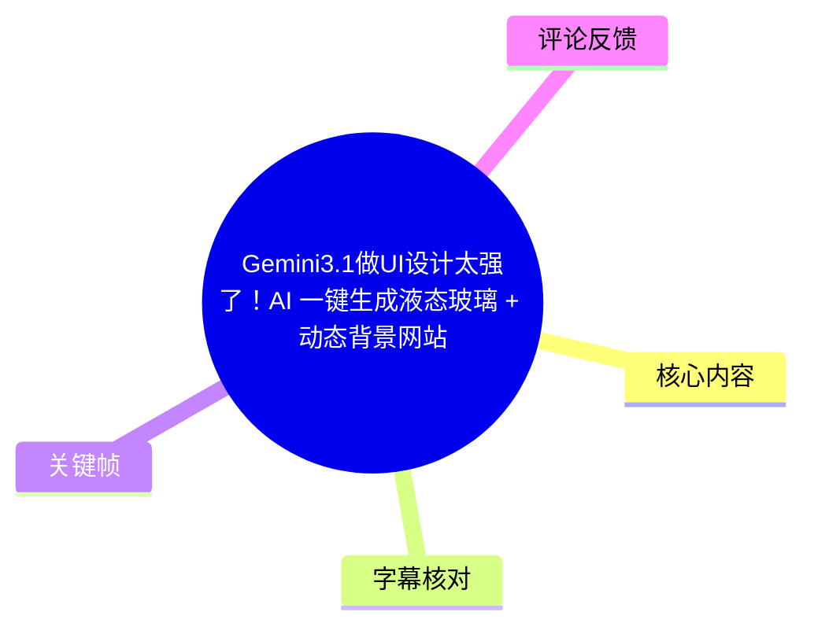
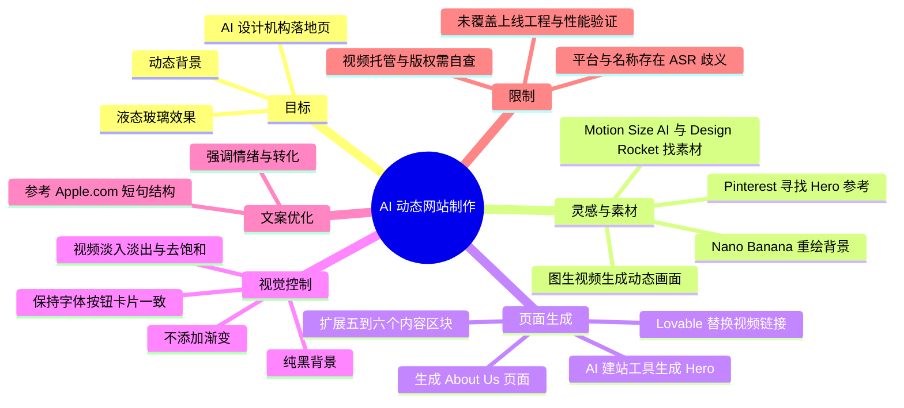
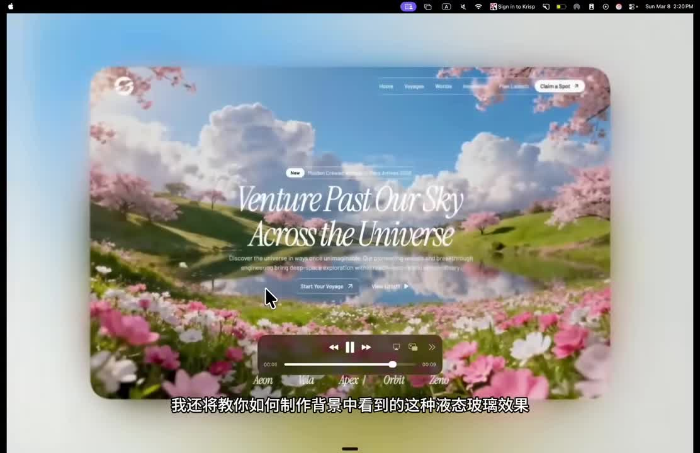
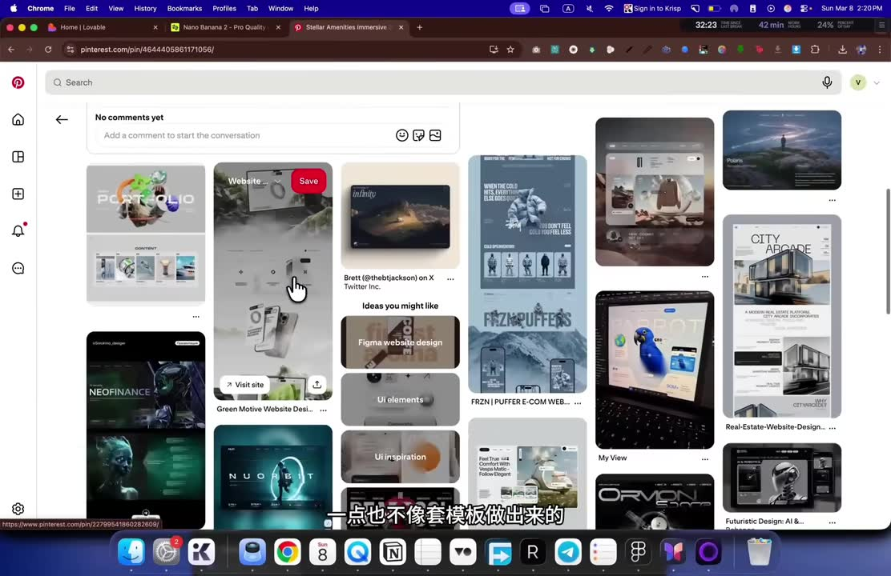
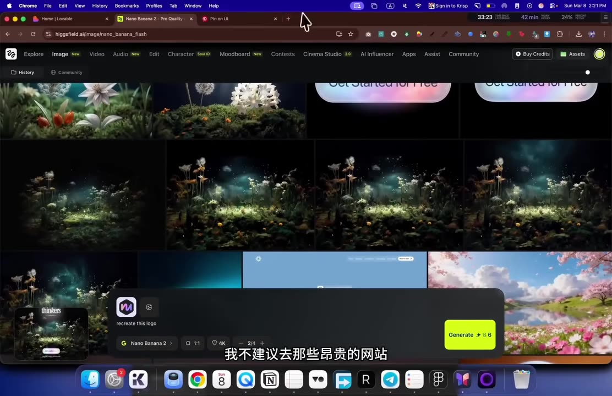
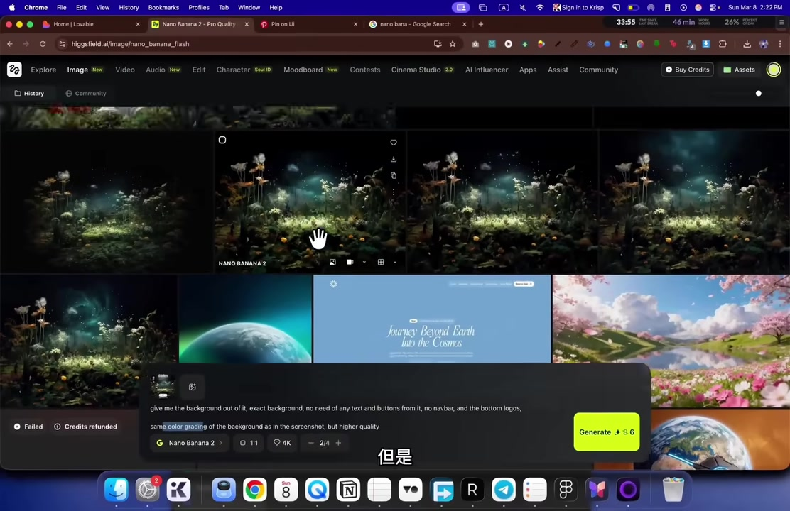

# Gemini3.1做UI设计太强了！AI 一键生成液态玻璃 + 动态背景网站

> 来源：[Bilibili 视频](https://www.bilibili.com/video/BV1QiwuziE17)<br>
> UP 主：芬达最快乐｜时长：14 分 33 秒｜分辨率：1670 × 1080<br>
> 视频简介原文：AI 不会取代设计师，但会用 AI 的设计师一定会取代不会用的。

## 小结

本视频演示了一套以“视觉参考图 → AI 重绘纯背景 → 图生视频 → AI 建站工具生成页面 → 替换素材与优化文案”为主线的网站制作流程。目标是快速做出带有动态视频背景、液态玻璃卡片与按钮、深色高对比排版的 AI 网页设计机构落地页，并继续扩展出“About Us”页面。

视频强调的核心并不是从零手写代码，而是提高提示词的具体程度：先从 Pinterest 等灵感站提取有辨识度的画面，再让图像模型移除文字、按钮、Logo 等干扰元素，随后以固定机位和极慢动作生成可循环感更强的背景动画，最后把素材 URL 交给 AI 建站工具处理。

作者展示了一个重要经验：仅输入“为我建立一个 AI 网页设计机构落地页”往往会得到模板化、缺乏特色的结果；而明确规定视觉风格、区块数量、左右图文布局、液态玻璃效果、字体与颜色一致性、黑色背景、禁止渐变等约束，能显著提高初稿质量。视频中称完整首页仅通过约两轮主要对话形成初版，再逐区替换视频和 GIF 素材。

适合希望快速做概念验证、作品集、营销落地页初稿的设计师、独立开发者和 Vibe Coding 使用者参考。若要正式上线，仍需自行处理素材版权、视频托管稳定性、移动端适配、加载性能、无障碍、真实业务文案和转化数据验证；这些内容没有在视频中完整展示。

标题提到“Gemini3.1”，但给定 ASR 所能确认的实操工具包括 Pinterest、Nano Banana、Klin/Kling 3.0（名称存在 ASR 识别不确定性）、Motion Size AI、Lovable、Maxcom（名称待核）、Design Rocket 等。不能仅根据标题推断视频具体展示了 Gemini 3.1 的哪项能力或配置。

本视频中的网站、模型和素材平台均属于变化较快的 AI 工具链。元数据显示视频发布时间为 2026-03-15；截至素材抓取时间 2026-07-13，工具定价、入口、模型版本、生成额度、URL 托管规则都可能已经发生变化。

## 思维导图





## 目录

- [背景、目标与成片效果](#背景目标与成片效果)
- [从 Pinterest 参考图提取背景](#从-pinterest-参考图提取背景)
- [图像转动态背景视频](#图像转动态背景视频)
- [生成 Hero 与液态玻璃界面](#生成-hero-与液态玻璃界面)
- [搭建完整落地页与替换媒体素材](#搭建完整落地页与替换媒体素材)
- [扩展 About Us 页面](#扩展-about-us-页面)
- [文案改写与提示词质量对比](#文案改写与提示词质量对比)
- [可复用操作步骤与提示词要点](#可复用操作步骤与提示词要点)
- [限制、风险与时效性](#限制风险与时效性)
- [字幕比对](#字幕比对)
- [评论分析](#评论分析)
- [处理记录](#处理记录)

## 背景、目标与成片效果 [00:00](https://www.bilibili.com/video/BV1QiwuziE17?t=0)

视频开头展示的目标页面是一个沉浸式 Hero 区域：背景为花海、天空、湖泊一类的动态自然场景；前景包含导航、标题、说明文字、按钮以及类似播放器控制条的半透明浮层。作者把浮层效果称为“液态玻璃效果”。



> 图：该关键帧直观呈现视频最终想复现的视觉语言——动态场景作为底层，文字与操作控件放在半透明、圆角、模糊感的玻璃层上。它有助于理解后续为何需要同时处理背景动画、可读性与卡片层级。

作者明确提出本期会覆盖两件事：

1. 如何获得并制作背景图像及背景动画；
2. 如何做出画面中看到的液态玻璃效果，并将二者整合到网站中。

这里的“液态玻璃”在视频语境中更接近视觉设计指令，而非给出可复现的 CSS 参数、滤镜数值或组件源码。视频主要通过 AI 建站工具的自然语言提示来实现。

## 从 Pinterest 参考图提取背景 [00:36](https://www.bilibili.com/video/BV1QiwuziE17?t=36)

### 寻找不模板化的 Hero 灵感 [00:36](https://www.bilibili.com/video/BV1QiwuziE17?t=36)

作者的第一步是到 Pinterest 搜索或浏览 Hero Section（首屏/头图区域）相关的设计灵感，筛选标准是视觉独特、看起来不像常规网站模板的参考图。视频中选中的素材本身并非网站，但作者认为可以将它“展开”成网站 Hero 的背景来源。



> 图：该关键帧展示参考图筛选阶段。画面中同时出现多种网页设计、UI 卡片及海报式视觉，说明作者不是直接复制某一现成网页，而是从视觉气质与构图中挑选灵感。

操作上的关键不是截图本身是否完美。作者表示，即使截图画质较低、含有不需要的元素，也可以借助后续的 AI 图像重绘阶段处理。实际使用时仍应注意：截图来源可能具有版权和商标限制，尤其不应直接把他人的 Logo、文案、品牌标识用于商业页面。

### 通过图像模型重绘“无文字背景” [01:15](https://www.bilibili.com/video/BV1QiwuziE17?t=75)

作者随后打开 Nano Banana 或其他图像生成工具上传截图，并建议不必优先使用昂贵的服务。ASR 显示其选择的模型界面为 “Nano Banana 2”，图像比例设置为 `1:1`，并显示了 `4K` 选项；但视频没有说明这些设置是否为效果成立的必要条件。



> 图：该关键帧显示 AI 图像工具同时呈现多张背景候选图，说明流程并非一次生成即结束，而是需要从多结果中挑选构图与氛围较合适的一张。

作者使用的英文提示词在关键帧中可辨识为：

```text
give me the background out of it, exact background,
no need of any text and buttons from it, no navbar,
and the bottom logos, same color grading as in the screenshot,
but higher quality
```

可归纳为以下约束：

- 只提取或重构原图的背景；
- 去掉文本、按钮、导航栏和底部 Logo；
- 保持参考图的综合色调；
- 提升图像质量。



> 图：该关键帧直接保留了提示词输入框和生成结果，是理解“从参考图提取可用背景”这一环节的证据。它也表明作者并非要求模型一比一复制完整网页，而是要求保留背景氛围并排除 UI 杂项。

作者从生成的多个结果中选取自己更喜欢的一张，并认为其在相同提示词下能较准确地重构原图背景。需要注意，图像模型输出具随机性；“精确重构”是作者对当前样张的评价，不等同于模型具有稳定的像素级复刻能力。

## 图像转动态背景视频 [02:08](https://www.bilibili.com/video/BV1QiwuziE17?t=128)

作者将选中的背景图带入名为 “Klin 3.0” 的工具生成视频。该名称可能是 ASR 对工具名的误识别，结合常见产品名称可能指向 Kling 3.0，但给定素材不足以完全确认，因此以下保留 ASR 所示名称。

作者给出的动画提示词要点为：

```text
固定机位 / 锁定镜头
无镜头运动
超慢电影级动作
微风轻轻吹过画面
```

这组约束的设计目的很明确：

- **固定机位、无镜头运动**：避免背景大幅推拉、摇移，减少作为网页底图时的干扰；
- **超慢动作**：让动画更接近环境氛围，而不是叙事镜头；
- **微风效果**：为静态自然图像引入低频、细微的生机。

作者认为生成结果“非常酷、非常干净”，随后将其作为网站 Hero 的动态背景。视频未说明视频长度、帧率、循环方式、编码格式、静音处理、文件体积或移动端降级策略；这些均是实际部署时必须补充的技术事项。

## 生成 Hero 与液态玻璃界面 [02:45](https://www.bilibili.com/video/BV1QiwuziE17?t=165)

### 先获取首屏初稿 [02:45](https://www.bilibili.com/video/BV1QiwuziE17?t=165)

作者接着使用名为 Motion Size AI 的网站获取 Hero 区域初稿。他表示自己不需要其中的视频本身，而是希望参考或复制 UI 元素，特别是液态玻璃的视觉风格。随后将相关要求交给 AI 建站工具生成。

视频没有完整展示 Hero 提示词全文，但 ASR 确认其内容包含：

- 对字体的描述；
- 对背景视频的描述，且作者计划稍后替换；
- 对液态玻璃效果的描述；
- 对 Hero 页面结构的要求。

作者称这个提示词可复现片头所示的液态玻璃效果。最终生成的页面有动画背景、前景文案和半透明 UI 控件。

### 将生成视频替换为托管 URL [03:39](https://www.bilibili.com/video/BV1QiwuziE17?t=219)

作者将生成的视频上传到任意视频托管平台，并推荐一个 ASR 识别为 “Maxcom” 的服务，同时特别声明这不是赞助、也与该网站不存在利益关系。由于平台名称存在识别不确定性，不能据此确定其准确拼写、套餐或使用条件。

作者在 Lovable 中将原有背景视频链接替换成托管后的链接，然后预览效果。这个步骤揭示了 AI 建站工具中一个常见现实约束：即使网页页面由 AI 生成，媒体文件仍通常需要一个可访问的外部 URL 或项目内托管地址。

作者认为初步效果可用，但也承认可读性还可改善。可读性问题通常来自动态画面对正文文字的竞争；视频后续采用淡入淡出、去饱和与内容层前置等办法进行缓解，但未给出字体对比度、遮罩透明度等定量指标。

## 搭建完整落地页与替换媒体素材 [04:12](https://www.bilibili.com/video/BV1QiwuziE17?t=252)

### 用一条较长提示扩展页面 [04:12](https://www.bilibili.com/video/BV1QiwuziE17?t=252)

在完成 Hero 后，作者让 AI 建站工具继续生成 AI 网页设计机构的完整落地页。其提示要求可整理为：

1. 将既有文本改写为适合 AI 网页设计机构的内容；
2. 保留既有 Hero 的总体风格；
3. 增加其余落地页内容；
4. 采用两个交错式图文区块：
   - 一个左侧内容、右侧图片；
   - 一个右侧内容、左侧图片；
5. 添加由四张卡片构成的功能区；
6. 添加客户评价、数据统计和适合该页面的其他区块；
7. 总量控制在约 5～6 个区块；
8. 保持相同的颜色、字体、按钮、卡片样式及液态玻璃效果；
9. 背景维持纯黑；
10. 不要添加背景渐变，也不要添加背景动画。

这条指令很长，但其价值在于把抽象的“做一个高级网站”转换成了可检查的页面约束：区块数量、信息架构、交错布局、视觉一致性与明确禁止项。

作者展示的结果包括：

- Hero 区；
- “我们做什么”区块，其中包含后续会被替换的生成图片；
- “为什么选择我们”区块，搭配图标与液态玻璃效果；
- 数据统计区；
- 客户评价区；
- CTA（行动号召）区。

作者评价其结果优于通常的 AI 生成页面，并强调其主要使用了两轮提示词完成初版。这里应理解为对界面原型生产效率的主观比较，不表示页面已完成工程化交付。

### 用视频替换数据区背景 [06:02](https://www.bilibili.com/video/BV1QiwuziE17?t=362)

作者从素材中挑选另一个视频，复制视频链接后向 AI 建站工具提出要求：

- 在数据统计区块使用该视频作为背景；
- 视频在区块顶部和底部淡入淡出；
- 将视频放置在内容层之后。

作者提到语音识别软件把 `StatsSection` 识别成了 `StartSection`，但认为生成出来的视觉效果依然不错。这是一个值得注意的实际问题：若通过语音输入或语音转文字输入页面选择器、组件名等技术词，可能发生误识别；生成后必须检查目标元素是否正确被修改。

### 用 GIF 和视频替换占位素材 [06:48](https://www.bilibili.com/video/BV1QiwuziE17?t=408)

对于图片区块，作者回到 Motion Size AI 寻找设计素材，并将图片另存为 GIF 后上传替换原始 GIF。视频描述了将一张 GIF 放入“高转化率网站”区块中的笔记本电脑图片位置，再把另一张 GIF 放入下方“学习与自适应智能系统”相关位置。

作者还从 Design Rocket 寻找更多视频素材。对于数据统计区，他再次强调以下处理：

- 将视频设为背景；
- 顶部和底部做淡入淡出，以保证区块过渡平滑；
- 将视频饱和度调为 `0`。

将饱和度设为 `0` 的意图是把背景变为黑白或近似无彩色，降低其对前景统计数字、文案和玻璃卡片的视觉干扰。视频没有给出具体 CSS、滤镜实现或数值以外的调色参数。

### CTA 与导航区域 [08:21](https://www.bilibili.com/video/BV1QiwuziE17?t=501)

作者继续为底部 CTA 区块添加视频背景，并保留液态玻璃按钮。完成后，他认为 CTA 区域以及导航栏都具有较好的视觉效果。

在这个阶段，页面已形成统一的设计系统：

- 黑色作为整体底色；
- 局部使用视频增加视觉张力；
- 通过透明、圆角、玻璃质感容器承载内容；
- CTA 和导航使用相同的玻璃语言；
- 不让所有区块都同时播放强动画，而是选择性嵌入视频。

## 扩展 About Us 页面 [08:55](https://www.bilibili.com/video/BV1QiwuziE17?t=535)

作者随后让 AI 建站工具创建“About Us”页面。他复用前面已有的风格描述，只修改为“构建关于我们页面”，并要求约 5～6 个区块。

作者展示的结果与首页保持了类似的颜色、排版与玻璃效果，并认为符合预期。接下来仍只需要根据同一方法，从 Design Rocket 或 Motion Size 等来源寻找视频，再逐一置换背景或媒体素材。

这个步骤体现的是“先建立风格锚点，再生成多页面”的方法：首页 Hero、色彩、字体、按钮和卡片样式一旦确定，后续页面应明确要求继承这些元素，而不是每个页面从零描述风格。

## 文案改写与提示词质量对比 [10:16](https://www.bilibili.com/video/BV1QiwuziE17?t=616)

### 用 Apple.com 式短句改善文案 [10:16](https://www.bilibili.com/video/BV1QiwuziE17?t=616)

视频最后回到首页，作者提出一个文案技巧：让 AI 重写网站文本，采用 Apple.com 式的短句、高级感排版与文案框架。其提示意图不是复制苹果的具体文案，而是要求 AI 采用短句、情绪化、强调价值的表达结构。

作者展示的改写结果含有类似以下表述：

- “你的品牌值得拥有的网站。”
- “我们交付……”
- “专业功能，零复杂性。”
- “为转化而设计，为性能而构建。”
- “只需数天，无需数月。”
- “极致打造，只为转化。”

作者认为这种处理比原文更清晰、更具情绪感染力。需要注意：模仿特定品牌的文案框架可以作为风格练习，但正式商用时应避免造成品牌混淆、直接抄袭或忽略自身产品定位。

### 无约束提示与详细提示的差异 [11:38](https://www.bilibili.com/video/BV1QiwuziE17?t=698)

作者展示了只输入“为我建立一个 AI 网页设计机构落地页”时得到的对照结果，评价为视觉偏重、使用标准手机素材、缺少亮点和独特性。

其结论是：AI 不会直接取代设计师，但会使用 AI 的设计师会替代不会使用 AI 的设计师。视频将本次项目概括为约十条提示词、不到 15 分钟完成，并与传统 Figma 设计、搭建动效框架及制作 About Us 页可能耗费数天的流程进行对比。

这是作者的效率判断，适合用作“快速制作原型”的参考，不应直接外推到完整商业网站的总工期。真实项目还会包含需求澄清、品牌策略、代码审查、测试、内容审核、埋点、SEO、性能优化和上线维护等环节。

作者还建议将完成的作品录屏发布到 Twitter/X，并说明可以标记所借用视觉灵感或素材的公司、也可以标记自己，以争取转发和曝光。这属于个人增长建议；发布作品前应先确认素材、Logo、视频和截图的转载授权。

## 可复用操作步骤与提示词要点 [00:36](https://www.bilibili.com/video/BV1QiwuziE17?t=36)

以下按视频实际顺序整理为可执行流程。平台名称、模型可用性和收费规则应以使用当日页面为准。

### 1. 选取视觉参考

1. 在 Pinterest 等网站浏览 Hero Section 或风格参考。
2. 优先选择构图、色彩、氛围独特而非模板化的画面。
3. 展开或截图保存。
4. 不把截图中的 Logo、按钮、文字直接视为可商用资产。

### 2. 生成干净背景图

1. 上传截图至 Nano Banana 或其他图像生成工具。
2. 明确要求保留背景、色调与整体气氛。
3. 明确排除文字、按钮、导航栏和品牌 Logo。
4. 多次生成并人工筛选候选图。
5. 对低清截图，可增加“higher quality”一类的质量要求，但应人工检查是否引入了不合理细节。

参考提示词：

```text
给我这张图的背景；保持精确的背景构图和相近色调；
去掉所有文字、按钮、导航栏和底部 Logo；
提高画面质量。
```

### 3. 把背景图转为网页背景动画

1. 将筛选后的背景图输入图生视频工具。
2. 限制镜头运动，避免强烈运镜。
3. 要求极慢、细微的环境动态，例如微风。
4. 选择干净、前景文字可读性较高的结果。
5. 导出或托管前检查文件大小、时长、循环衔接与授权。

参考提示词：

```text
固定机位，锁定镜头，无镜头运动。
超慢电影级动作。
微风轻轻吹过画面。
```

### 4. 先生成 Hero，再替换真实视频链接

1. 在 AI 建站工具中描述字体、Hero 结构、背景视频与液态玻璃风格。
2. 先接受工具生成的初步背景占位。
3. 将自己的视频上传至可访问的托管位置。
4. 把生成页面中的视频 URL 替换为实际 URL。
5. 在桌面与移动端检查文字是否被背景淹没。

### 5. 用结构性提示生成完整首页

提示中至少应包含：

```text
- 网站主题与目标用户
- 保留现有 Hero 风格
- 需要的区块数量
- 交错图文布局
- 四卡片功能区
- 客户评价、数据统计、CTA
- 沿用颜色、字体、按钮和卡片样式
- 保持液态玻璃效果
- 背景纯黑
- 不添加渐变
- 不添加全局背景动画
```

“禁止项”与“需要项”同样重要。视频中的“纯黑、不要渐变、不要背景动画”正是为控制视觉噪声而添加的约束。

### 6. 对不同区块分别替换媒体

- **数据统计区**：视频置于内容层之后，上下淡入淡出，必要时去饱和。
- **图文功能区**：用 GIF 或更贴合产品的设计素材替换 AI 默认图片。
- **CTA 区**：可使用视频背景，但要保证按钮和标题仍是视觉焦点。
- **导航与卡片**：维持同一套玻璃质感和圆角规则，避免每个区块都使用不同风格。

### 7. 最后改写文案

1. 先确保页面结构与视觉风格已稳定。
2. 再让 AI 按指定的品牌语气改写文本。
3. 可借鉴“短句、强利益点、强调结果”的高端消费科技文案结构。
4. 人工核实所有“数天完成”“高转化”“性能更好”等承诺是否有事实依据。

## 限制、风险与时效性 [12:36](https://www.bilibili.com/video/BV1QiwuziE17?t=756)

### 视频未覆盖的工程问题

视频的重点是视觉原型与提示词方法，未提供以下关键实现细节：

- 液态玻璃效果的 HTML、CSS、JavaScript 或设计令牌；
- 背景视频的格式、码率、时长、循环和静音策略；
- 视频托管的带宽、跨域、HTTPS、稳定性与成本；
- 首屏加载优化、懒加载、移动端网络降级与低性能设备适配；
- 无障碍要求，例如动态背景减弱偏好、文字对比度、键盘导航和替代文本；
- 真实数据统计、客户评价和案例内容的来源验证；
- SEO、分析埋点、Cookie 合规与隐私处理；
- 最终导出的代码质量、响应式布局和浏览器兼容性。

### 版权与品牌风险

从 Pinterest、Motion Size AI、Design Rocket 或其他站点下载、截图、复制的视频和 GIF，并不天然意味着可商用。尤其应关注：

- 原图、视频、GIF 是否允许下载、修改和商业展示；
- Logo、品牌名、角色、产品 UI 是否受商标或著作权保护；
- AI 重绘是否足以消除原作品的实质性相似风险；
- 标记素材来源公司以求转发，不等于取得使用许可。

### 工具名称与版本不确定性

本次 ASR 对多个英文专有名词存在误识别迹象：

- “Klin 3.0”可能是某款图生视频工具，但无法仅凭 ASR 确认拼写；
- “Maxcom”为作者推荐的视频托管服务的 ASR 转写，名称待核；
- “StatsSection”被 ASR 或语音输入识别为“StartSection”；
- 标题中出现“Gemini3.1”，但 ASR 实操段落未能确认其具体使用位置和参数。

因此，文中将这些名称作为视频素材中的转写信息记录，而非对产品能力、费用、版本或官方拼写的断言。

### 时效性说明

- 元数据 `pubdate` 对应 **2026-03-15 09:45:20 UTC**。
- 素材抓取完成于 **2026-07-13**。
- AI 建站、图像生成、图生视频与托管平台变动频繁，页面入口、模型版本、免费额度、导出限制和收费政策均可能在抓取后变化。
- 视频中的“不到 15 分钟”“仅用两条提示词”等说法是作者在其演示环境下的经验，不是可保证的通用工时或效果标准。

## 字幕比对 [00:00](https://www.bilibili.com/video/BV1QiwuziE17?t=0)

| 字幕来源 | 完整性 | 专有名词 | 时间轴 | 主要问题 |
| --- | --- | --- | --- | --- |
| Bilibili 站内字幕 | 不可用 | 无法评估 | 无法评估 | 素材记录显示字幕工具报错：`Missing JSON resource URL`，未提供可用站内字幕。 |
| 本次 ASR 字幕 | 覆盖全片主要叙述 | 存在多处歧义 | 未提供逐句时间戳，只能按内容顺序估算段落时间 | 中英混杂、人名/工具名误识别、个别句子不通顺，如 “Klin 3.0”“Maxcom”“StartSection”“GF/DFET”等。 |

本次任务已执行 ASR。由于站内字幕缺失，正文以本次 ASR 为主，并结合视频元数据、关键帧可见文字和上下文进行有限校正。

重要校正与保留策略如下：

- 将“手评”统一理解为 **Hero 区域/首屏区域**，但没有把 ASR 错字当作产品或技术名称。
- “Nano Banana 2”可由关键帧界面文字确认。
- 提示词中“no navbar”“bottom logos”“same color grading”“higher quality”等可由关键帧文本确认。
- “Klin 3.0”“Maxcom”缺少可靠的画面文字证据，保留 ASR 形式并注明不确定性。
- `StatsSection` 与 `StartSection` 的误识别由作者叙述明确提及，正文据此记录为一次组件名识别错误。
- “GF”“GFB”“DFET”等词在 ASR 中上下文不稳定，正文以“GIF/占位素材替换”概述，不虚构其具体文件名或格式。

## 评论分析 [13:20](https://www.bilibili.com/video/BV1QiwuziE17?t=800)

仅处理本次可获取的热评前三条，不将评论内容视作已验证事实。

1. **AuroraBoreale（76 赞）**：  
   > “这种网页能当毕设吗[doge]”  
   评论以玩笑式提问表达了对成片视觉完成度的认可，也侧面反映观众可能将此类快速生成页面视为学生项目展示素材。需要区分的是：视觉效果可用于毕设展示，不代表其自动满足毕业设计对研究过程、原创性、技术实现、文档和答辩的要求。

2. **Nova来了（99 赞）**：  
   > “claude code 也不错，vibe coding 一天弄了个博客前后端分离”  
   该评论补充了另一条工具路线：Claude Code 与 Vibe Coding 也可用于快速完成前后端分离博客。它与视频强调的 AI 辅助效率相呼应，但属于评论者个人经验，未提供项目地址、技术栈、部署条件或性能数据，不能直接与视频中的视觉建站流程进行严谨效率比较。

3. **比拉比啦111231（16 赞）**：  
   > “能告诉我是哪个youtube博主吗？”  
   该评论说明部分观众认为视频内容可能源于 YouTube 教程或希望追溯原始创作者。但给定素材未提供对应 YouTube 博主身份、视频链接或转载说明，无法确认来源，也不应据此推断视频的制作或授权关系。

## 评论分析

本次流程未获取到可用热评，因此不推断观众态度或额外结论。

## 处理记录

- **Worker ID**：worker-mrj0wjed-b0c290ad
- **模型**：gpt-5.6-terra
- **调用工具与素材**：视频素材整理产物 `merged.mp4`、`audio/audio.wav`、`frames/`、`info.json`、`comments/comments.json`、`asr/`；站内字幕获取流程曾调用视频工具，但未成功取得字幕资源。
- **字幕选择**：站内字幕未提供可用内容；本次 ASR 已执行并作为正文主字幕来源。对于专有名词及不通顺片段，优先参考关键帧可见文字与上下文；无法确认的名称明确保留不确定性。
- **关键帧选择依据**：
  - `frames/frame-001.jpg`：展示开场成片、动态背景与液态玻璃视觉目标；
  - `frames/frame-002.jpg`：展示 Pinterest 灵感检索的起点；
  - `frames/frame-003.jpg`：展示 Nano Banana 候选图与生成界面；
  - `frames/frame-004.jpg`：展示背景提取提示词及“移除文字/按钮/导航/Logo”的核心约束。
  
  其余关键帧虽在路径清单中存在，但未随本次素材提供可验证画面内容，因此未强行引用或编造说明。
- **时间轴依据**：ASR 未附逐句时间戳；本文时间轴按视频总时长、叙述先后和段落转换进行近似定位，用于快速跳转，不应视作逐字级时间标注。
- **缓存清理**：未提供缓存清理执行结果；本记录不虚构已完成清理。素材输出目录及既有文件清单按任务输入保留。
- **未解决问题**：
  - “Gemini3.1”在实操中的具体功能、模型版本与提示词未能从 ASR 确认；
  - “Klin 3.0”“Maxcom”等名称存在 ASR 误识别可能；
  - 无站内字幕可供交叉校对；
  - 未提供网页导出代码、最终部署链接或素材授权信息，无法验证最终实现质量与商用合规性。
