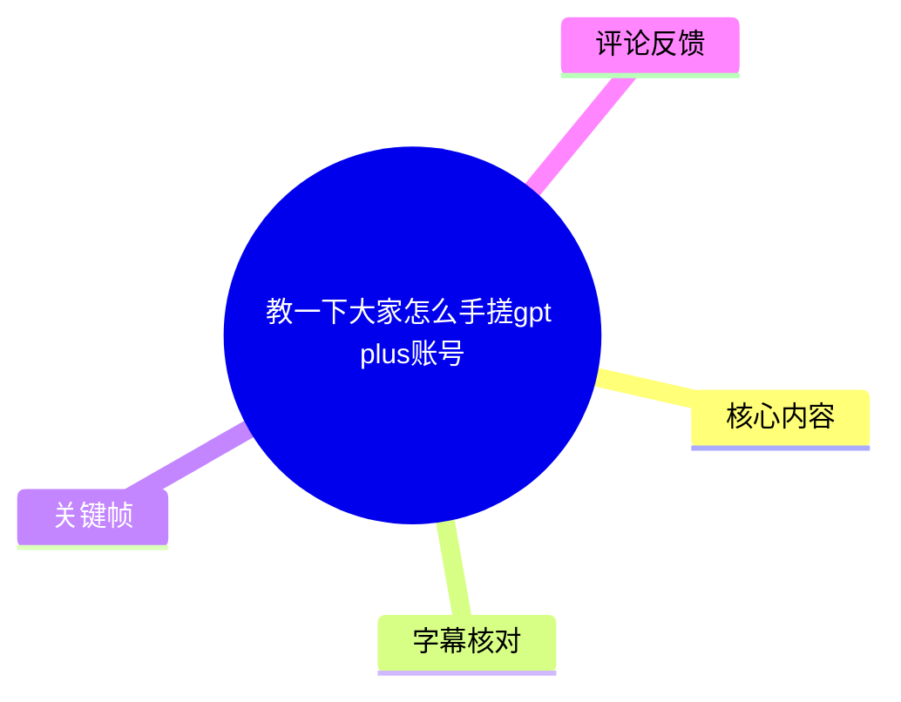
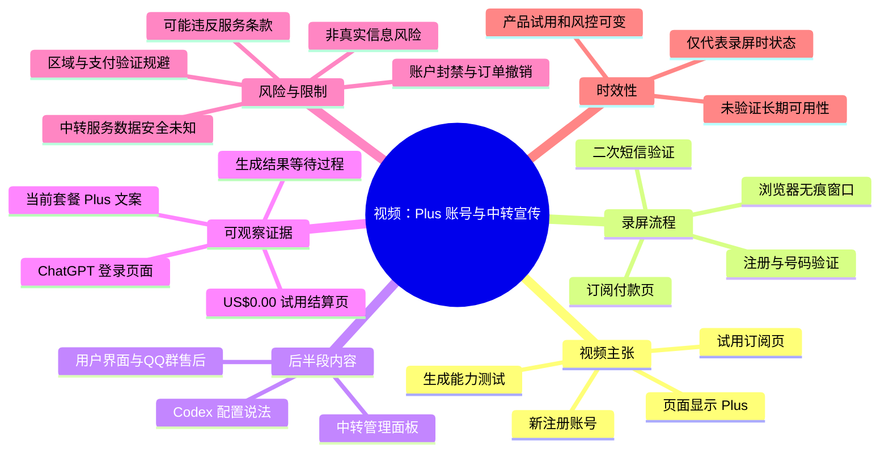
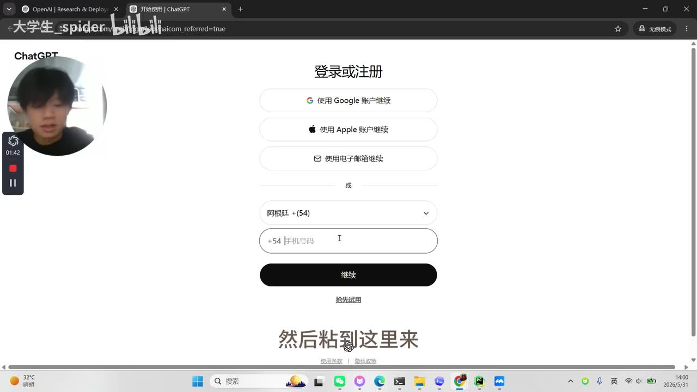
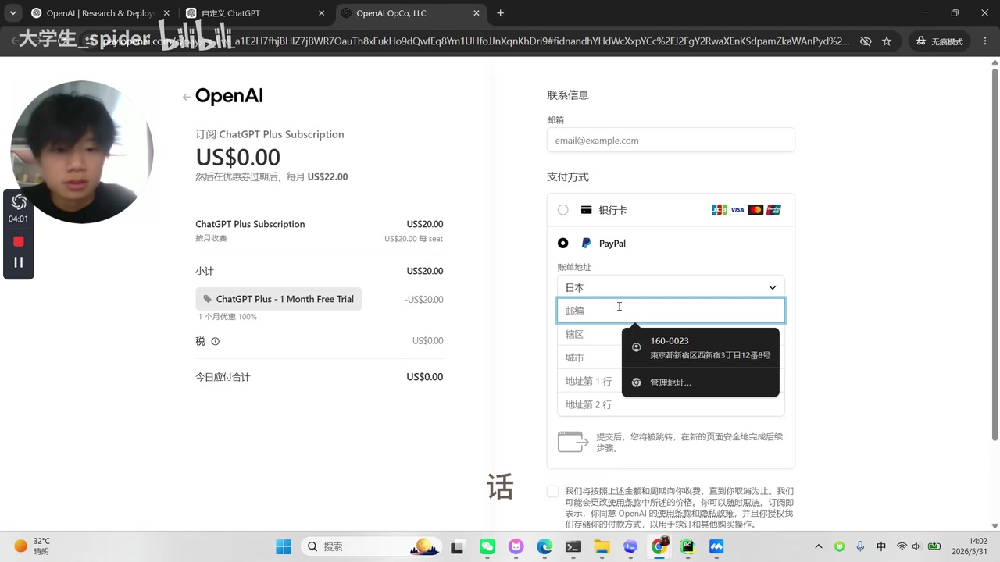
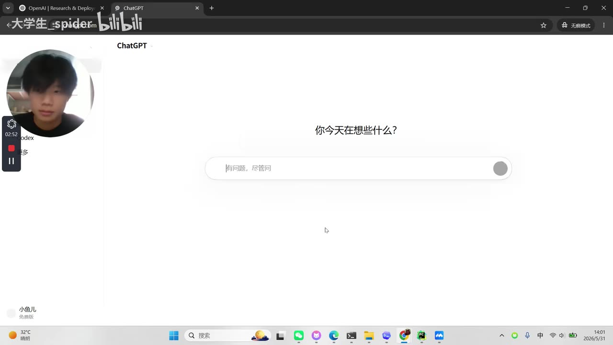
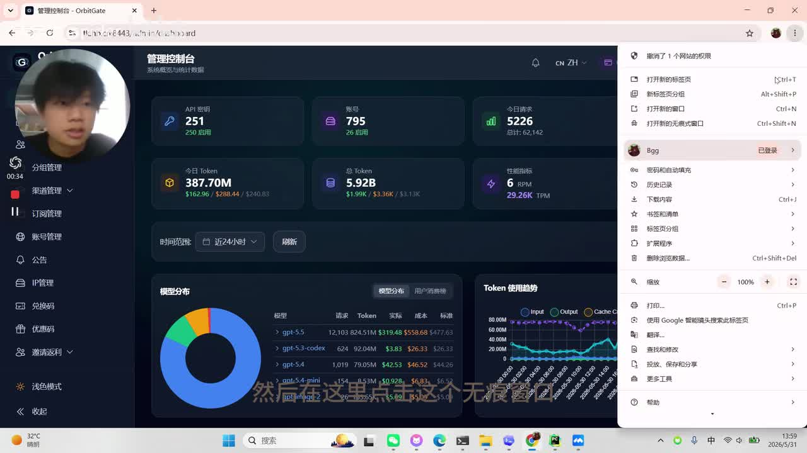

# 教一下大家怎么手搓gpt plus账号

> 来源：[Bilibili 视频](https://www.bilibili.com/video/BV1XhVn6UExa)  
> UP 主：大学生_spider｜时长：15:00｜分辨率：1920 × 1080  
> 数据抓取时可见：34,269 播放、2,017 收藏、927 点赞、466 分享、277 评论。以上互动数据具有时效性。

## 小结

该视频是一段屏幕录制教程。UP 主声称演示了如何通过新注册的 ChatGPT 账号、区域与号码验证、试用订阅页以及支付页面等环节，获得显示为 ChatGPT Plus 的账户；随后用“生成电商详情页”和图像生成能力进行验证，并展示其自建中转服务的管理/用户界面。

视频中最关键的技术信息并非某项公开的 ChatGPT 正常订阅功能，而是其宣称使用浏览器开发者工具脚本生成付款链接，并以临时邮箱、接码号码、非真实支付信息和地址信息完成订阅流程。这类内容涉及绕过服务区域、身份/支付验证及可能的试用资格限制，存在明显的账号封禁、订单撤销、资金损失、隐私泄露与违反服务条款风险。本文仅记录视频事实与风险，不复现脚本、支付信息构造、接码平台选择、地址伪造或绕过步骤。

UP 主在约 09:29 处看到页面显示“当前套餐 Plus”，约 09:42 起对生成能力进行测试；这只能证明录屏当时页面展示及该次会话中的表面结果，**不能证明方法长期有效、账户合规、试用资格有效，或能稳定使用全部 Plus 功能**。

视频后半段转向推广其自建“中转”服务，声称可将 Plus 相关能力接入 Codex，并展示了包含模型分布、Token 用量、API 密钥和账号数量的管理面板。该服务的实际资质、数据处理方式、模型来源、稳定性、售后承诺和收费规则均未在素材中获得独立验证。

适合阅读本笔记的人群是：希望识别此类“低成本/免费 Plus”宣传风险、理解视频展示链路及其证据边界的读者。若确有订阅需求，应通过 OpenAI 官方页面、适用于所在地的合规支付方式和真实身份/账单信息完成订阅。

## 思维导图

## 目录

- [背景、范围与合规边界](#背景范围与合规边界)
- [视频叙事与时间轴](#视频叙事与时间轴)
  - [开场：声称“手搓”Plus 账号](#开场声称手搓plus-账号)
  - [注册与号码验证展示](#注册与号码验证展示)
  - [试用页、控制台与付款链路](#试用页控制台与付款链路)
  - [二次验证及“成功”展示](#二次验证及成功展示)
  - [功能测试与证据强度](#功能测试与证据强度)
  - [中转服务与 Codex 接入宣传](#中转服务与-codex-接入宣传)
  - [结尾说法](#结尾说法)
- [技术信息、参数与经验判断](#技术信息参数与经验判断)
- [关键帧解读](#关键帧解读)
- [结论、限制与时效性](#结论限制与时效性)
- [字幕比对](#字幕比对)
- [评论分析](#评论分析)
- [处理记录](#处理记录)

## 背景、范围与合规边界 [00:00:02](https://www.bilibili.com/video/BV1XhVn6UExa?t=2)

视频标题为“教一下大家怎么手搓gpt plus账号”。UP 主在开场自称“普通的逆向爱好者”，并称将演示“手搓一个 Plus 号”；ASR 将若干产品词误识别为“GVT/GPT”等，结合画面中的 ChatGPT 页面，可校正为 ChatGPT/Plus 语境。

本视频的内容边界需要特别说明：

1. **视频的目标是获取订阅或试用状态，而不是讲解公开 API 或正常付费订阅。**  
   录屏包含跨地区号码、临时接收验证码、订阅链接、账单资料与支付验证等环节。

2. **关键风险在于验证规避。**  
   视频口述包含使用接码服务、生成支付卡信息、生成地址和姓名等主张。这些做法可能违反服务提供方规则，也可能触及支付欺诈、身份冒用或不当使用促销资格等问题。

3. **本文不提供可执行复现。**  
   不列出脚本内容、第三方平台、不提供支付/账单字段填写策略，不转写域名、群组入口或推广渠道。保留这些内容会降低不当操作门槛。

4. **合规替代路径。**  
   如需使用 ChatGPT Plus 或 API 服务，应以官方订阅页面、真实账户信息、可用地区和合规支付方式为准；企业或开发用途则应使用官方 API 文档、项目密钥管理及预算/权限控制机制。

## 视频叙事与时间轴

### 开场：声称“手搓”Plus 账号 [00:00:02](https://www.bilibili.com/video/BV1XhVn6UExa?t=2)

UP 主称教程的对象是 ChatGPT Plus 账号，并称除“接码成本”外不需要其他成本。此为 UP 主的主张，不等同于平台规则或可验证的实际成本。

他在约 00:26 开始使用 Google Chrome，并在约 00:33 打开无痕窗口；约 00:51 清理网站数据，明确说该操作仅因“之前弄过”，不要求观众照做。无痕模式和清理网站数据只能改变本地浏览器的 Cookie、缓存或会话状态，**不能保证绕过服务端风控、账户资格校验或支付审核**。

### 注册与号码验证展示 [00:01:21](https://www.bilibili.com/video/BV1XhVn6UExa?t=81)

此段展示 ChatGPT 登录/注册页面以及电话继续注册的界面。UP 主口述选择阿根廷区号，并称从接码渠道购买号码、复制至页面、设置密码后等待验证码。

> 图：该帧提供了视频正在进行电话号码注册的直接画面证据，且能辅助校正 ASR 中“阿根廷”等地区词。它同时说明视频将账户注册与非本地号码绑定；此类号码的归属、持续控制权和合规性均无法由录屏证明。

约 02:11 至 02:37，UP 主等待短信验证、返回注册页并填写姓名。他说姓名“随便输入、没有要求”，但这只是其录屏中的个人描述，不能推出平台对身份信息没有要求，更不能证明虚假资料可被允许或长期有效。

### 试用页、控制台与付款链路 [00:03:07](https://www.bilibili.com/video/BV1XhVn6UExa?t=187)

账号进入 ChatGPT 页面后，UP 主在头像菜单中选择“免费试用 Plus”。他特别说不要直接领取，而是打开浏览器开发者工具、寻找并输入某段脚本，由此“生成一个付款链接”。

这一段是视频风险最高的环节：其意图是改变或利用正常订阅流程中生成的付款链接，再进入结算页面。素材未提供脚本原文的可靠文本，本文也不转录或推导脚本功能。

> 图：该关键帧是视频“试用结算页”主张最直接的可视证据。页面可见首月 US$0.00、优惠后每月 US$22.00 的文字，但它不等于订阅已经完成，也不等于以后不会扣费、不会审核或不会撤销。

约 04:00 起，UP 主开始填入结算表单。他声称可借助生成式工具生成地址、邮编、城市、邮箱、姓名等信息，并在约 05:42 明确表示信用卡“不要填真实的”、可使用卡号生成器。该内容涉及伪造/规避支付与账单验证，本文不保留其操作细节。需要强调：

- 页面出现银行卡和 PayPal 选项，只能说明录屏中结算页提供了这些选项；
- 首月为零元的显示不必然免除支付方式验证，也不必然代表后续不扣费；
- 使用虚假卡号、非真实账单资料或无授权号码，可能导致支付失败、账户受限、优惠取消或其他法律与平台风险；
- 在约 07:13，UP 主提到翻译页面字段后避免“填错”，说明跨语言表单本身也存在误填风险。

### 二次验证及“成功”展示 [00:08:00](https://www.bilibili.com/video/BV1XhVn6UExa?t=480)

约 08:00 起，UP 主称需要再次填入电话号码；约 08:15 选择“同意并继续”，并于约 08:38 粘贴验证码。此处又一次使用接码号码的表述，意味着账户注册和订阅/支付流程可能存在多重号码验证，而非一次性验证。

约 08:52 至 09:05，UP 主反复等待并说“成功”；约 09:28 说“终于成功了”，约 09:37 指向页面上的“当前套餐 Plus”字样。

> 图：该帧可以确认视频已进入 ChatGPT 登录后的会话首页，但画面本身没有完整展示账户账单、资格、有效期或支付状态。因此它只能作为会话可进入的证据，不能单独证明 Plus 订阅的长期有效性。

### 功能测试与证据强度 [00:09:42](https://www.bilibili.com/video/BV1XhVn6UExa?t=582)

UP 主随后测试所称的 Plus 功能：

- 约 09:42：准备让模型生成电商详情页；
- 约 09:55：先提及“马斯克”，随后改为生成电商详情；
- 约 10:34：将示例改为黄桃，理由是家中售卖黄桃；
- 约 10:42 至 10:50：称使用“image 2”（ASR 误为“emit2”）并发送；
- 约 10:55 起：等待生成结果；
- 约 11:16：评价速度“还是很快的”；
- 约 11:53：称 Plus 账号可以正常使用，并评价图片“还是可以的”。

该验证的证据强度有限：

| 观察对象 | 视频实际展示/口述 | 可以支持的结论 | 不能支持的结论 |
| --- | --- | --- | --- |
| 套餐状态 | UP 主称页面显示“当前套餐 Plus” | 录屏时页面存在这一显示 | 账户长期有效、官方不会审核/撤销 |
| 文本生成 | 提示词围绕电商详情页 | 当时会话可提交生成请求 | 全部 Plus 模型、额度和工具均可用 |
| 图像能力 | UP 主称使用 image 2 并等待结果 | 他尝试了图像相关功能 | 该能力的具体模型版本、生成来源、长期稳定性 |
| 响应速度 | UP 主主观说“很快” | 他对当次等待时间的主观评价 | 性能可量化、所有地区/时段都快 |

视频没有给出可审计的订单号、账单历史、扣费周期、账号持续使用时长、官方确认邮件或服务条款授权证据。因此，“测试成功”应理解为**一次录屏演示中的表面可用状态**。

### 中转服务与 Codex 接入宣传 [00:12:07](https://www.bilibili.com/video/BV1XhVn6UExa?t=727)

约 12:07 起，内容从个人账号演示转为 UP 主的服务推广：他称将把该账号上传到一个未明示名称的平台，随后让有需求者访问其域名；约 12:30 评价其价格“很良心”。

> 图：该帧显示的是一个第三方管理控制台，而不是 OpenAI 官方 ChatGPT 订阅界面。其价值在于说明视频后段确实转向 API/中转服务的运营面板；页面内的“API 密钥”“账号”“模型分布”等指标为该服务的自述展示，无法据此验证模型授权、数据安全或计费准确性。

约 12:42 至 13:23，UP 主称其“号池”由 GPT Plus 账号构成，具有图像能力，且可以接入 Codex；他说在文档中配置 `baseURL` 和 `API Key` 即可使用。这里可提炼的技术概念是：

- **Base URL**：API 客户端所访问的服务端地址；
- **API Key**：服务端据以识别调用者、实施鉴权或计费的凭据；
- **中转服务**：通常指在客户端与上游模型服务之间增加代理/网关的一层，可能统一模型格式、实施额度控制或进行流量转发。

但视频没有展示完整配置文件、请求协议兼容性、模型 ID、限流策略、计费规则或隐私政策；更没有证明“Plus 账号”可以合法地被用于向第三方转售、共享或作为中转上游。对 API Key 而言，用户还应注意其可能暴露提示词、响应内容、来源 IP、用量数据及项目元数据。

约 13:35 起，UP 主称有售后保障；约 14:07 指向可进入 QQ 群的位置。此为服务方单方面承诺，素材无法验证售后兑现能力、群组持续性或争议解决机制。

### 结尾说法 [00:14:16](https://www.bilibili.com/video/BV1XhVn6UExa?t=856)

UP 主总结称，本视频主要演示 Plus 账号如何“生成出来”，并称“这样的话就一个月”“Plus 还是可以用蛮久的”；若观众嫌麻烦，可使用其“中转”。约 14:51，他再次称套餐价格便宜。

这些说法都缺少外部验证，且与平台的试用资格、地区策略、支付验证、反滥用系统和产品定价变更高度相关。尤其“能用一个月”不是视频可充分证明的结果：录屏仅记录了同一时点的账号状态，未覆盖完整一个月后的续费、验证、风控或封禁情况。

## 技术信息、参数与经验判断 [00:03:16](https://www.bilibili.com/video/BV1XhVn6UExa?t=196)

### 视频中出现的参数与界面信息

| 项目 | 素材中的信息 | 解读与限制 |
| --- | --- | --- |
| 视频时长 | 900 秒，实际音轨分析时长约 899.68 秒 | 单 P 视频，画面为桌面录屏和摄像头画中画 |
| 浏览器环境 | Google Chrome、无痕窗口 | 无痕模式不等于匿名、合规或可规避服务端检测 |
| 注册地区 | 画面显示阿根廷区号 `+54` | 仅为录屏的号码国家区号选择；不代表适用地区规则 |
| 试用结算页 | 首月 `US$0.00`；画面提示优惠后每月 `US$22.00` | 仅代表该录屏页面文字；价格、币种和试用资格随时间及地区变化 |
| 支付选项 | 画面出现银行卡、PayPal | 不代表任一方式对任意地区或账户都可用 |
| 二次号码验证 | 约 08:00 后再次要求电话信息及验证码 | 提示流程可能存在多层验证，也意味着临时号码有失效风险 |
| 生成示例 | 黄桃电商详情页、图像相关功能 | 示例没有记录模型版本、完整提示词、结果质量基准或调用额度 |
| 中转配置 | 口述 `baseURL`、`API Key` | 属于一般 API 网关配置概念；未验证具体服务与 Codex 的兼容性 |
| 售后渠道 | 口述 QQ 群 | 仅为 UP 主宣称，未验证可用性与承诺范围 |

### 可迁移的正向经验

尽管视频主流程存在明显合规问题，仍可从中抽取不涉及规避的通用经验：

1. **先区分“页面显示”与“权益已稳定生效”。**  
   一个页面显示套餐名称，只是某一时刻的 UI 状态。对于订阅服务，还应核验账单周期、支付授权、账户通知、订阅管理页和服务条款。

2. **测试应当覆盖真实工作流。**  
   UP 主尝试文本生成与图像生成，思路上属于“用目标任务验收能力”。合规用户可采用自己的非敏感任务，记录提示词、模型、耗时、输出质量和失败率，形成可复核的测试记录。

3. **第三方 API 网关应按最小信任原则使用。**  
   使用中转服务前，应确认服务商主体、隐私政策、模型来源、数据保留期限、计费方式、限流与退款规则。不要提交密钥、源码、客户数据、证件信息或其他高敏感内容。

4. **不要把生成式工具当作身份或支付信息生成器。**  
   即使工具能够生成格式看似合理的地址、姓名或卡号，也不代表可以用于平台注册、支付或身份验证。格式正确不等于具备授权、真实性或合规性。

## 关键帧解读 [00:01:21](https://www.bilibili.com/video/BV1XhVn6UExa?t=81)

本素材仅提供帧文件路径与画面内容，未提供每张帧的精确提取时间。因此，下列图片按**画面主题**关联到 ASR 已知时间段，不把图片文件序号当作精确时间戳。

| 关键帧 | 画面内容 | 正文价值 |
| --- | --- | --- |
| `frames/frame-002.jpg` | ChatGPT 电话注册页，显示阿根廷 `+54` | 对应注册与区域号码选择，校正 ASR 的地区信息 |
| `frames/frame-003.jpg` | ChatGPT 已登录后的对话首页 | 说明录屏进入会话状态，但不足以证明长期订阅权益 |
| `frames/frame-004.jpg` | OpenAI 结算页面，显示试用优惠和后续月费 | 是分析“试用页”与自动续费风险的核心视觉证据 |
| `frames/frame-001.jpg` | 第三方管理控制台及模型/Token 数据 | 说明后段已从个人账号演示转向中转服务推广 |

未选用其余帧作为正文插图，原因是素材未提供可靠帧时间映射，且上述四帧已经覆盖本视频的注册、会话、订阅结算及中转推广四个关键阶段。

## 结论、限制与时效性 [00:14:16](https://www.bilibili.com/video/BV1XhVn6UExa?t=856)

### 结论

- 视频展示了一个从新账号注册到试用结算页、短信验证、Plus 页面状态及功能测试的录屏链路。
- UP 主将“页面显示 Plus”和一次生成测试视为成功，并进一步推广第三方中转服务。
- 录屏中最敏感的环节涉及使用临时号码、生成或非真实账单资料及支付信息，以及通过开发者工具处理订阅链接；这些不应被视为安全、合规或可持续的使用方式。
- 合法订阅、稳定访问和数据安全应优先依赖官方渠道，而非身份、区域、支付或账号共享方面的规避操作。

### 未被视频证明的事项

1. 该账户是否真实完成了有效支付授权；
2. 首月试用是否对该账户、地区及后续用户普遍适用；
3. 账户是否能持续使用一个月或更久；
4. 是否会发生续费、退款、取消优惠、风控、封禁或订单撤销；
5. 所称图像功能对应的确切模型、额度及质量水平；
6. 第三方中转服务是否得到上游授权，是否安全存储请求数据；
7. “售后保障”“价格良心”等营销表述是否可兑现。

### 时效性提示

视频源数据指向 2026-05-31 发布，素材抓取完成于 2026-07-15。ChatGPT 的订阅价格、试用资格、地区可用性、功能命名、支付方式和风控策略都可能随地区、账户历史与时间变动。本文所有界面与价格信息均仅限于该录屏中可见的当时状态，不能作为当前订阅政策或操作依据。

## 字幕比对 [00:00:02](https://www.bilibili.com/video/BV1XhVn6UExa?t=2)

| 字幕来源 | 完整性 | 专有名词 | 时间轴 | 主要问题 |
| --- | --- | --- | --- | --- |
| Bilibili 站内字幕 `p01-ai-zh.srt` | 与视频内容完全不符，仅覆盖约 00:00–00:33 | 内容为“新车被鸡血涂满”等，与本视频无关 | 时间段本身完整但对应错误内容 | 疑似串台/错误关联字幕，不能用于本视频整理 |
| 本次 ASR `medium` | 覆盖约 406.3 秒语音，占总时长约 45.16%；首段 00:02，末段 14:55 | 多处误识别，如 “GVT”“Kodak”“emit2”“base12l”“apak” | 提供 80 个带起止时间的分段，可用于章节定位 | 画面操作等待时存在较大空白；专名、产品名和英文配置项错误较多 |

### 最终字幕选择与校正原则

本次采用 **ASR 的时间轴** 作为章节定位依据，因为其内容与视频标题、关键帧中的 ChatGPT/OpenAI 页面以及后段控制台画面一致。站内字幕虽有可用 SRT 时间格式，但内容实际描述“鸡血新车”，与视频完全矛盾，故不采纳。

本次 ASR 已实际检测到音轨：诊断中语言为中文、置信度约 `0.9985`，不存在 `noAudioStream=true` 标记。因此，本视频不是无音轨源视频，也不是 ASR 工具失败；问题主要是自动识别对中英混合术语、口语及界面名词的准确性有限。

结合关键帧和上下文作出的谨慎校正如下：

| ASR 原文/近似词 | 校正或保留方式 | 依据 |
| --- | --- | --- |
| `GVT PLUS`、`gbt` | 按 ChatGPT Plus 语境记录 | 标题、ChatGPT/OpenAI 页面画面与上下文一致 |
| `Open AM` | 不确定具体输入内容，不扩写 | ASR 仅在约 00:39 短句中出现，画面证据不足 |
| `Kodak` | 可能指 Codex，但仅在后段明确口述/画面上下文中记为 Codex | 约 12:42–13:23 的“接入 Codex”语境 |
| `emit2` | 仅表述为“UP 主称使用 image 2/图像功能”，不确定官方模型名 | ASR 音译不稳定，素材未给出可靠模型标签 |
| `base12l`、`apak` | 归纳为 `baseURL`、`API Key` 的一般配置概念 | 后段 API 网关配置语义及常见字段形式；不转写为可操作配置 |
| `Plus 货号` | 视为“Plus 账号”的口语/误识别 | 全片语境一致 |

## 评论分析 [00:14:16](https://www.bilibili.com/video/BV1XhVn6UExa?t=856)

以下仅处理当前可获取的热评前三条；评论是用户意见，不构成对视频内容或相关风险的验证。

1. **-星--光--（98 赞）**：  
   评论称 UP 主是其见过“敢露脸”的人，并配有笑哭表情。该评论关注的是 UP 主在屏幕录制中展示人脸这一行为，而非教程的技术有效性。其隐含观点是：该类敏感教程中露脸会增加可识别性与个人风险，但这只是评论者的调侃，不能据此判断法律或平台后果。

2. **浙江骑兵后卫（100 赞）**：  
   评论称“大学生就是不怕死，直接露脸”，同样聚焦露脸与风险感知。与第一条形成呼应，反映部分观众将视频中的身份暴露与高风险操作联系在一起。该看法不提供额外事实，但提示创作者与观众均应重视个人信息暴露、平台追责和不当教程传播风险。

3. **bili_87448306662（8 赞）**：  
   评论询问：若用自己的账号获取“免费一个月”，是否会有被发现、封号等不良后果。该评论提出了最实质的风险问题，但未给出答案或证据。结合视频涉及试用资格、区域、号码和支付信息的规避性描述，封号、权益撤销或支付异常确实属于合理风险类别；但素材中没有官方回应，不能量化发生概率，也不能将其视为已证实的结果。

## 评论分析

- 热评 1：你是我见过的，敢露脸的[笑哭]
- 热评 2：大学生就是不怕死，直接露脸[笑哭][笑哭][笑哭]
- 热评 3：主播想问一下，这个操作的话，使用自己的账号去薅免费的一个月可以吗？会不会有啥不好的，比如被发现了封号啥的一类的？

以上内容是观众反馈摘录，只用于补充理解视频反响，不作为正文事实依据。

## 处理记录

- Worker ID：`worker-mrj0www4-e8d79408`
- 模型：`gpt-5.6-terra`
- 调用工具与模型：素材解析结果中的音频 ASR 模型为 `medium`，运行于 `cuda`、`float16`；本整理使用提供的元数据、SRT、ASR 分段、关键帧与热评素材。
- 使用的应用工具：视频元数据读取、关键帧提取、音频导出、ASR 转写、站内字幕获取、热评获取；未执行视频中所述的注册、付款、接码、脚本或中转访问操作。
- 字幕选择：检查了站内字幕与本次 ASR。站内字幕内容与视频完全错配，弃用；选用本次 ASR 的真实起止时间作为时间轴来源，并以关键帧和上下文谨慎校正专有名词。
- 音轨判断：ASR 结果含 80 段带时间戳的中文语音，未标记 `noAudioStream=true`，故按“有音轨视频”处理。
- 关键帧选择依据：选取注册页（`frame-002`）、已登录会话页（`frame-003`）、试用结算页（`frame-004`）和中转管理台（`frame-001`），分别支撑注册、会话、订阅展示与服务推广四个核心叙事节点；未将帧序号误当作精确时间。
- 缓存清理：素材只提供任务产物清单与完成状态，未提供可核验的缓存清理日志；本记录不声称已执行缓存删除。
- 未解决问题：无法从现有素材独立验证账户长期有效性、支付授权与扣费情况、试用资格、第三方中转的合规授权/数据安全、Codex 兼容性、售后承诺，以及视频中未显示的脚本具体作用。
