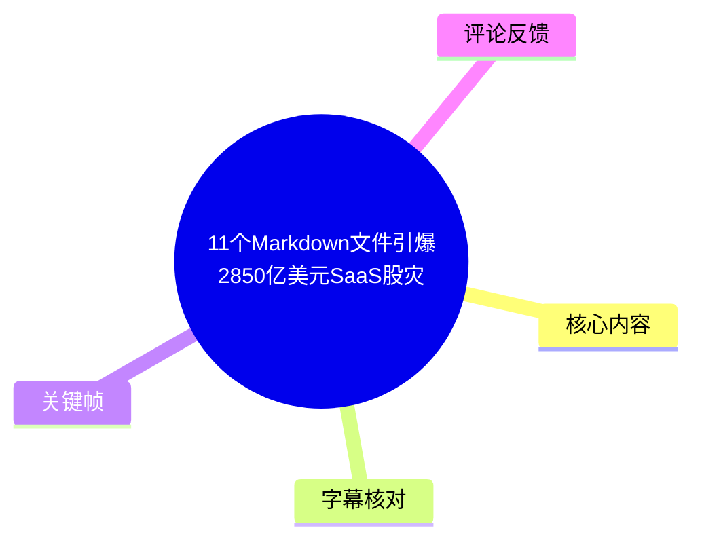
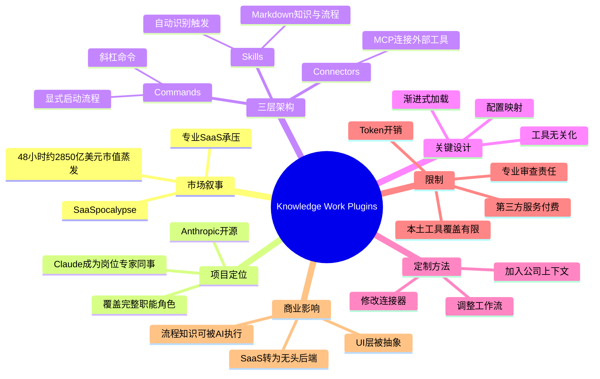
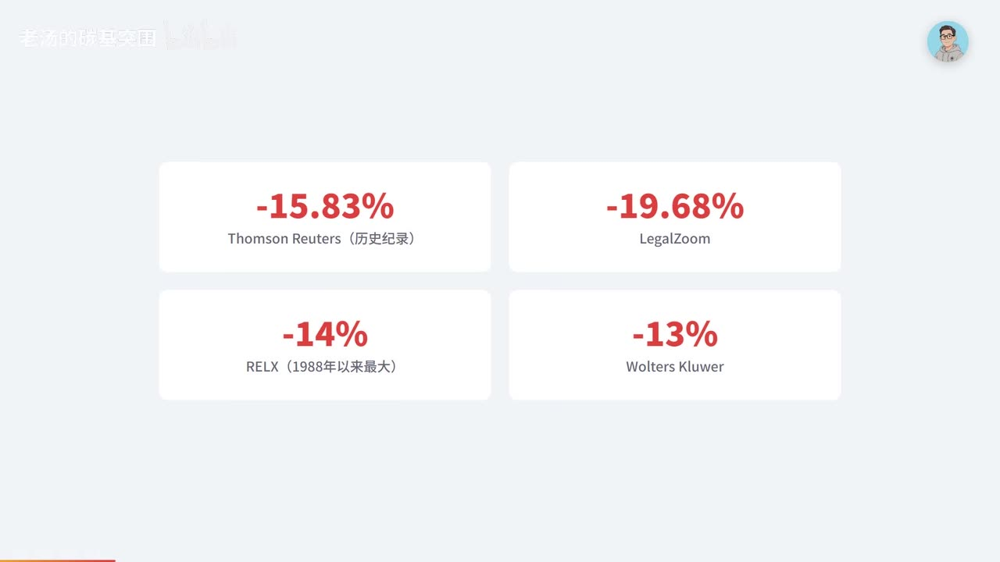
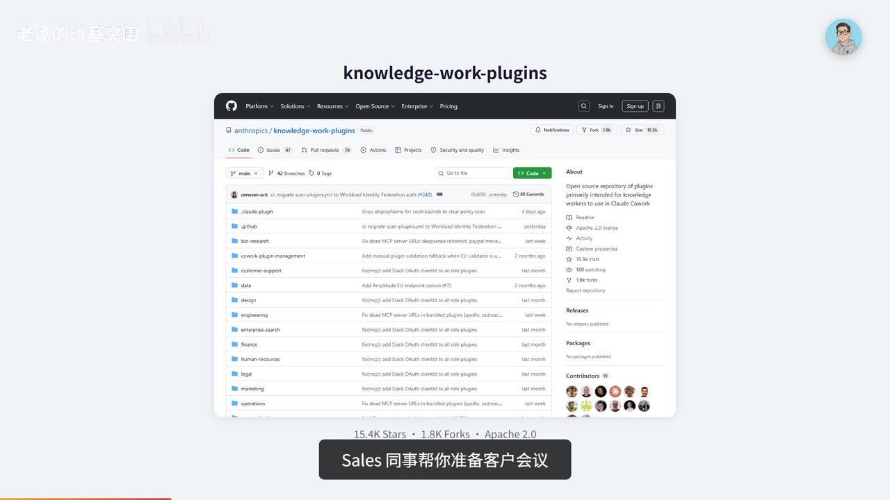

# 11个Markdown文件引爆2850亿美元SaaS股灾

> 来源：[Bilibili 视频](https://www.bilibili.com/video/BV1xTVF61EhD)<br>
> UP 主：老汤的碳基突围｜视频时长：05:36｜整理依据：本次 ASR、关键帧、视频元数据与可获取热评

## 小结

视频围绕 Anthropic 开源项目 `knowledge-work-plugins` 展开。UP 主用“2026 年 2 月 3 日、SaaS 相关股票在 48 小时内蒸发约 2850 亿美元市值”的市场叙事，引出一个核心问题：为何一组主要由 Markdown 与 JSON 配置构成的 Claude 插件，会被市场视作对传统专业 SaaS 的潜在威胁。

视频给出的答案不是“Markdown 本身很强”，而是：**领域知识、组织术语与工作流程一旦被结构化、标准化，就可以被 AI 按流程调用和执行**。这些插件试图将 Claude 从通用聊天机器人转变为能够完成特定岗位任务的“专家同事”，例如销售会议准备、数据异常分析、合同风险审阅。

其技术结构由三部分组成：`Skills`（以 Markdown 编写的知识与工作流）、`Commands`（显式触发的斜杠命令）与 `Connectors`（经 MCP 协议连接 CRM、数仓或项目工具）。视频特别强调了渐进式加载和工具无关化：前者控制上下文读取，后者通过占位符与配置映射降低迁移不同工具栈的成本。

实践上，视频建议通过三步定制插件：修改连接器配置、补充公司上下文、调整工作流指令；并提到可使用 `Cowork Plugin Management` 插件协助创建新插件。适合重复性知识工作较多的非技术岗位、希望固化最佳实践的团队负责人，以及使用 Claude Code 的开发者。

但该方案并非“替代一切”：视频提到 Skills 可能被注入 Claude Code 命令行上下文、一次消耗约 6000 Token 的开发者反馈；法律与财务类输出需要持牌人士审核；部分连接器依赖付费第三方服务；对飞书、钉钉、企业微信等中文本土 SaaS 的 MCP 覆盖仍可能不足。视频中的市场数据、插件数量和连接器覆盖情况均属于具有时效性的陈述，应以项目仓库及官方页面的当前状态为准。

## 思维导图





## 目录

- [市场事件与问题背景](#市场事件与问题背景-0028)
- [项目定位：从聊天机器人到岗位同事](#项目定位从聊天机器人到岗位同事-0053)
- [三层插件架构与两项关键设计](#三层插件架构与两项关键设计-0129)
- [评测案例、插件分级与定制步骤](#评测案例插件分级与定制步骤-0237)
- [限制、成本与 SaaS 商业模式判断](#限制成本与-saas-商业模式判断-0326)
- [适用人群与不适用场景](#适用人群与不适用场景-0414)
- [结论与时效性](#结论与时效性-0502)
- [关键帧索引](#关键帧索引)
- [字幕比对](#字幕比对)
- [评论分析](#评论分析)
- [处理记录](#处理记录)

## 市场事件与问题背景 [00:28](https://www.bilibili.com/video/BV1xTVF61EhD?t=28)

视频在约 00:28 开始进入正文。UP 主称，**2026 年 2 月 3 日**，一家 AI 公司在 GitHub 发布 11 个插件后，全球软件类股票在 48 小时内蒸发约 **2850 亿美元**市值；一名 Jefferies 交易员将该日称作 **“SaaSpocalypse”**，即 SaaS 的“末日”。

视频列举的个股跌幅如下：

| 视频所述对象 | 视频所述变化 | 补充说明 |
| --- | ---: | --- |
| Thomson Reuters | 下跌 15.83% | 视频称为公司历史纪录 |
| LegalZoom | 下跌近 20%；画面为 -19.68% | ASR 口述为“将近 20%”，关键帧提供更精确展示值 |
| RELX（LexisNexis 母公司） | 约 -14% | 视频称为 1988 年以来最大单日跌幅 |
| Wolters Kluwer | 约 -13% | 仅在关键帧的统计卡片中展示 |


> 图：关键帧以 “SaaSpocalypse”“$285B”“48 小时市值蒸发”“11 个 Markdown 文件”为核心视觉信息，并标出 Thomson Reuters 下跌 15.83%。它直观呈现了视频的叙事起点：市场担忧并非来自传统意义上的大型软件发布，而来自可被 AI 执行的工作流插件。



> 图：该图将视频中分散提及的跌幅汇总为四张卡片，补足了 ASR 对 Wolters Kluwer 及 LegalZoom 精确跌幅记录不完整的问题。图中数值应理解为视频展示内容，未在本整理中独立核验市场行情。

UP 主认为，最“荒诞”的地方在于，这批插件没有复杂代码或特殊基础设施；从 GitHub 仓库看，主要是 **Markdown 文件与 JSON 配置**。视频提出的主问题因此不是“纯文本如何直接造成股灾”，而是：为什么标准化文本形式的岗位知识和操作流程，会改变市场对于专业软件价值的预期。

> **事实边界：**“2850 亿美元”“股价跌幅”及其与插件发布之间的关联，是视频转述的市场叙事与判断。视频未在素材中展示完整的事件因果验证、行情来源或计算口径，不能据此直接推出“11 个文件直接造成全部市值损失”的严格因果结论。

## 项目定位：从聊天机器人到岗位同事 [00:53](https://www.bilibili.com/video/BV1xTVF61EhD?t=53)

视频将项目名称识别为 **`knowledge-work-plugins`**，并称其为 Anthropic 官方开源项目。其定位被概括为：**把 Claude 从通用聊天机器人变成某一岗位上的专家同事，而不只是助手。**

视频中的岗位类比包括：

- **Sales（销售）同事**：协助准备客户会议；
- **Data（数据）同事**：协助分析数据异常；
- **Legal（法务）同事**：协助审核合同；
- 每个插件面向一个相对完整的职能角色，而非仅提供单点问答能力。

视频口述及项目介绍画面给出的规模信息为：

- 共 **15 个插件**；
- **85 个技能（Skills）**；
- **69 个命令（Commands）**；
- 连接 **40 多种外部工具**；
- 组件主要由 Markdown 和 JSON 构成，不需要传统构建步骤或独立基础设施。



> 图：该关键帧展示 GitHub 上的 `anthropics/knowledge-work-plugins` 仓库页面，画面可见多个按业务职能划分的目录，并以“Sales 同事帮你准备客户会议”说明项目角色化定位。它为“插件主要由文档与配置构成”的说法提供了画面语境，但仓库 Star 数、目录和代码状态会随时间变化。

这里的关键转变是交互单位发生变化：传统聊天式 AI 常由用户临时描述任务、补足上下文；视频所述插件则尝试把组织内已有的“做事方法”预先编码为可检索、可调用的工作流。模型仍需要理解用户意图，但可不必从零推导每个岗位的标准操作步骤。

## 三层插件架构与两项关键设计 [01:29](https://www.bilibili.com/video/BV1xTVF61EhD?t=89)

### 三个核心组件

视频将单个插件拆解为以下三层：

| 组件 | 视频定义 | 作用与触发方式 |
| --- | --- | --- |
| **Skills（技能）** | 使用 Markdown 写成的领域知识与工作流程 | Claude 自动判断何时需要使用相应技能 |
| **Commands（命令）** | 斜杠命令 | 由用户显式触发特定流程；视频示例为 `/data:write-query` |
| **Connectors（连接器）** | 通过 MCP 协议连接外部工具 | 让 Claude 接入 CRM、数据仓库、项目管理等系统 |


> 图：关键帧将三层结构可视化，并明确写出 “Skills：Markdown 领域知识”“Commands：`/data:write-query`”“Connectors：MCP 协议接入 CRM/数据仓库/项目工具”。这是理解视频技术论点最直接的结构图。

### 设计一：渐进式加载 [01:53](https://www.bilibili.com/video/BV1xTVF61EhD?t=113)

视频称，Claude 不会把全部技能文件一次性塞入上下文，而是按三层读取：

1. **元数据层**：先读取技能的元数据，视频称约用 **100 Token**，用于知道“自己具备哪些能力”；
2. **完整指令层**：仅当用户问题与技能相关时，才读取完整工作流指令；
3. **引用文件层**：只有模型认为需要进一步深入时，才读取技能所引用的文件。

UP 主用“高效同事”作类比：同事知道自己会哪些事，但并不会把所有手册记忆或展示出来；遇到相关问题时才去查阅相应资料。

这个设计的目标是平衡两件事：

- 为模型提供足够的岗位能力索引；
- 避免所有流程文档同时占据上下文，造成成本上升或干扰任务判断。

### 设计二：工具无关化 [02:17](https://www.bilibili.com/video/BV1xTVF61EhD?t=137)

第二项设计是**工具无关化**。视频称，技能文件中不写死具体工具名称，而是写入类似 `Data Warehouse` 的占位符；再在配置中将占位符映射到企业实际使用的工具。

可按如下抽象关系理解：

```text
技能文件（稳定）
  数据仓库：{{Data Warehouse}}
        ↓
连接器/配置（可替换）
  Snowflake / BigQuery / 其他实际系统
```

视频强调的迁移收益是：

- 更换数据仓库时，理论上只需改一行 JSON 配置；
- 技能文件无需跟着修改；
- 同一套业务技能可在不同技术栈中复用。

> **注意：**视频口述中的 “Jason” 明显是对 **JSON** 的 ASR 误识别；本整理依照视频上下文及前文“Markdown 和 JSON 配置”的表述校正为 JSON。视频没有提供实际 JSON 配置样例，不能补写具体字段或配置格式。

## 评测案例、插件分级与定制步骤 [02:37](https://www.bilibili.com/video/BV1xTVF61EhD?t=157)

### 视频转述的第三方测试

UP 主提到“一个第三方评测网站”进行了 **8 周实测**，并给出三个案例：

| 插件/场景 | 视频所述结果 | 解读边界 |
| --- | --- | --- |
| Data 插件 | 上传约 4000 行 CSV 后，8 分钟发现每月 14,000 美元的定价异常 | 视频称该问题销售团队两个季度未发现；未给出评测网站名称、数据集、复现实验条件 |
| Sales 插件 | 替代每次约 90 分钟的手工会议准备 | 属于视频转述的效率主张，未展示前后任务质量评价标准 |
| Legal 插件 | 用红黄绿灯系统标注合同风险 | 风险标记不等同于法律意见，后文也明确要求专业人士审查 |

由于原始 ASR 将“4000 行 CSV”等专有内容识别得较不稳定，本整理仅保留视频语义能够支持的信息，不推断具体行业、客户类型或测试工具。

### 视频给出的插件成熟度判断 [03:02](https://www.bilibili.com/video/BV1xTVF61EhD?t=182)

视频将插件粗分为三档：

- **S 级**：Data、Productivity、Sales，安装后即可使用；
- **A 级**：Legal、Design，需要投入时间进行定制；
- **C 级**：主要属于接入特定付费工具的入口。

此处的 S/A/C 评价是视频作者对插件使用门槛的总结，并非素材中可见的 Anthropic 官方统一评级标准。实际可用性仍取决于企业已有系统、权限配置、数据质量及连接器状态。

### 面向企业的三步定制法

视频引用 Anthropic 的核心判断：真正的威力在于**为自己的公司定制**，使插件匹配“你的工具、你的术语、你的流程”。给出的实际步骤如下：

1. **改连接器配置**  
   将通用连接器映射到企业实际使用的 CRM、数据仓库、协作或项目管理工具。

2. **加公司上下文**  
   补充企业内部术语、业务定义、数据口径、常见角色和工作背景，减少模型在组织语境中的歧义。

3. **调工作流指令**  
   根据团队的审批链路、交付格式、风险规则和标准作业程序修改 Skills 中的工作流描述。

视频还提到一个名为 **`Cowork Plugin Management`** 的原生插件，可用 Claude 协助创建新插件。素材未提供其安装命令、权限要求或创建模板，实际操作应回到项目说明与官方插件页面确认。

## 限制、成本与 SaaS 商业模式判断 [03:26](https://www.bilibili.com/video/BV1xTVF61EhD?t=206)

### 视频明确提出的三项限制

1. **上下文与 Token 成本**  
   视频称，有开发者发现 Skills 被静默注入 Claude Code 命令行环境，可能每次消耗约 **6000 Token**；并称 Anthropic 关闭了相关 issue。  
   这是一项开发者反馈的转述，不代表所有使用情境下固定存在 6000 Token 消耗；上下文加载策略和产品行为可能已更新。

2. **法律、财务类插件不能替代持牌专业人士**  
   视频明确指出，此类插件具有免责声明：不是律师、不是会计师，输出必须由持牌专业人士审查。  
   因此，合同风险灯号、财务分析或合规建议只能作为辅助材料，而不能作为最终专业意见或决策依据。

3. **连接器并不天然免费**  
   很多连接器依赖第三方付费服务。即便插件文件是 Markdown/JSON，企业总成本还可能包括模型订阅、第三方 SaaS 订阅、MCP 服务、权限治理、部署维护和人工复核。

### 对 SaaS 的判断：不是消亡，而是“变形” [03:50](https://www.bilibili.com/video/BV1xTVF61EhD?t=230)

视频转述 IDC 分析师的观点：**SaaS 并非消亡，而是在变形。**其判断框架如下：

- UI 层可能被 AI 抽象化；
- SaaS 可能更像提供数据与能力的“无头后端”；
- 真正承压的可能是那些主要提供漂亮界面、而底层又缺少独特数据或护城河的产品；
- 有数据资产、深度业务集成与可靠系统能力的公司，未必会因 AI 工作流插件而被直接替代。

视频用两类 AI 产品形态进行比喻：

| 形态 | 视频举例 | 工作方式 |
| --- | --- | ---|
| 在现有软件界面中加 AI | Microsoft Copilot、Google Gemini | 用户仍主要在 Word、Sheets 等既有应用界面中工作 |
| AI 直接跨工具完成工作 | Cowork 插件 | 尽量跳过多个产品的中间 UI，由 AI 组织和执行任务 |

UP 主的比喻是：前者像“给车加自动驾驶”，后者像“直接派了个司机”。这是用于说明交互范式差异的观点表达，不应理解为后者已经在所有任务上具备完全自主、可替代人的能力。

## 适用人群与不适用场景 [04:14](https://www.bilibili.com/video/BV1xTVF61EhD?t=254)

视频认为，这套插件最适合以下三类人：

1. **非技术岗位知识工作者**  
   特别是日常工作中存在高重复流程的人，例如反复做会议准备、数据初查、信息汇总、文档初审的岗位。

2. **团队负责人或管理者**  
   适合将团队中表现较好的工作方法固化为插件，再分发给团队成员使用，以降低新成员上手成本并提升流程一致性。

3. **使用 Claude Code 的开发者**  
   Data、Engineering 等插件可用于补强开发与数据工作流，但需同时关注前述上下文加载与 Token 成本问题。

视频也给出两类不适用或优先级较低的情况：

- **深度依赖微软生态的团队**：若日常完全基于 Microsoft 365 等环境工作，视频认为 Copilot 的原生集成度可能更高；
- **依赖中文本土 SaaS 的团队**：飞书、钉钉、企业微信等工具在视频所述的 MCP 连接器覆盖中可能尚未覆盖到位。

这里的“适合/不适合”是基于集成条件的判断，而不是产品能力高低的绝对结论。企业选择时至少应检查：

- 目标工具是否已有可用、可授权的 MCP 连接器；
- 数据访问权限是否可控；
- 是否允许模型读取相关业务数据；
- 输出是否有明确的人工审核环节；
- 工作流被固化后，是否仍能处理例外情况和规则更新。

## 结论与时效性 [05:02](https://www.bilibili.com/video/BV1xTVF61EhD?t=302)

视频最终将“11 个 Markdown 文件”的意义归纳为：

> 关键不在 Markdown 本身，而在于工作流程知识一旦被结构化、标准化，就可能被 AI 直接执行。

UP 主进一步用“过去花三年教一个新人，现在花三小时写一份 Markdown”作对比，意在强调组织经验的可编码性与可复用性。该说法是具有传播性的概念表达，不应被视为普遍适用的量化承诺：新人培养还涉及业务判断、责任承担、隐性知识、协作关系与专业资质，无法仅靠文档完全替代。

更可迁移的经验是：

- 将高频任务拆成明确的输入、判断条件、操作步骤、输出模板与复核节点；
- 把稳定部分写入可维护的流程文档；
- 将工具差异收敛到配置层，避免在每份流程中写死系统名称；
- 用小范围任务验证准确率、成本、权限和人工审核机制后，再扩展到团队流程。

### 时效性说明

- 视频中提及的股价、总市值变化、插件数量、技能/命令数量、外部工具数量、GitHub Star 数及连接器支持范围均可能变化。
- 元数据显示视频发布于 2026 年 5 月；视频叙述的市场事件日期为 2026 年 2 月 3 日。本整理不对视频所述新闻的行情因果关系做额外验证。
- 视频简介列出项目地址、Star 增长图、媒体报道与官方插件页面；如需实际部署，应优先查阅这些一手或当前资料，而不是仅据视频中的数字决策。

## 关键帧索引

| 关键帧 | 正文位置 | 画面信息 | 选用价值 |
| --- | --- | --- | --- |
| `frames/frame-001.jpg` | 市场事件与问题背景 | SaaSpocalypse、2850 亿美元、Thomson Reuters 跌幅 | 建立市场叙事与核心数字的视觉锚点 |
| `frames/frame-002.jpg` | 市场事件与问题背景 | Thomson Reuters、LegalZoom、RELX、Wolters Kluwer 的跌幅卡片 | 补足口述中不完整的个股数字 |
| `frames/frame-003.jpg` | 项目定位 | `knowledge-work-plugins` GitHub 页面及职能目录 | 说明项目是按工作角色组织的插件仓库 |
| `frames/frame-004.jpg` | 三层插件架构 | Skills、Commands、Connectors 的关系图 | 直接解释视频最核心的技术结构 |

其余关键帧虽已提供，但当前素材中未附带可供可靠辨识的对应画面描述；为避免将画面内容误配到正文，本整理仅选用能与 ASR 和已给画面信息相互印证的帧。

## 字幕比对

| 字幕来源 | 完整性 | 专有名词 | 时间轴 | 主要问题 |
| --- | --- | --- | --- | --- |
| Bilibili 站内字幕 `p01-ai-zh.srt` | 与本视频内容不匹配 | 出现“武功”“龙爪手”等无关内容 | 00:00–02:45 有分段，但对应的是错误内容 | 明显为错配字幕，不能用于本视频事实整理 |
| 本次 ASR（medium） | 覆盖约 301.05 秒语音，占视频时长约 89.75% | 多处英文专名、中文同音词识别不稳 | 有真实时间戳，首段语音 00:28.790，末段 05:33.420 | 分段过粗，部分名称如 Claude、Legal、JSON、SaaS 被误识别 |
| 关键帧与元数据 | 仅覆盖关键画面和简介信息 | 可确认仓库名、部分跌幅和三组件标题 | 不能替代逐句字幕 | 用于校正 ASR 中的明显专名与数字歧义 |

### 最终字幕选择与校正原则

最终以**本次 ASR 时间轴**作为章节定位依据，原因是其语言诊断为中文、语音覆盖率约 89.75%，且语义与视频标题、简介和关键帧一致。ASR 未标记 `noAudioStream=true`，说明源视频存在音轨；本次 ASR 是有效识别结果，并非工具失败。

站内字幕虽有精确的 SRT 时间段，但内容明显为另一段影视对白，与本视频主题完全无关，故予以排除。

结合关键帧、视频标题、简介与上下文，对 ASR 的重要校正如下：

| ASR 原文或近似识别 | 整理采用 | 校正依据 |
| --- | --- | --- |
| Cloud | Claude | 视频主题、项目归属 Anthropic 与上下文 |
| Jason | JSON | 视频称插件由 Markdown 与 JSON 配置组成 |
| Lego / Lego 插件 | Legal 插件 | 视频简介、上下文中的合同审核与法律免责声明 |
| SASpocalypse / SARS 末日 | SaaSpocalypse / SaaS 的“末日” | 视频标题与市场叙事上下文 |
| World 和 Sheets | Word 和 Sheets | Microsoft/Google 办公工具语境 |
| 飞梳 | 飞书 | 中文本土 SaaS 语境 |
| 4000 型苏伊 行 CSV | 约 4000 行 CSV | ASR 误识别，保留可确定语义并降低精度表述 |

## 评论分析

素材中可获取热评仅 **2 条**，少于要求上限“前三条”；以下仅分析已获取内容，不补造第三条评论。

1. **无情的学习机器2025**：  
   > “限流了吗，最近怎么没收到你的视频推送”  
   该评论关注的是账号推送或分发可见性，并未对视频中 SaaS、插件架构或市场数据提出补充。它只能反映该用户未收到视频推送的主观体验，不能据此确认平台是否存在限流。

2. **Kirk6571**：  
   > “UP主加油！”  
   这是支持性互动，没有提供可验证的技术信息、反驳观点或额外证据。

两条评论点赞数均为 0，且讨论未涉及视频核心论点，因此不能从评论区得到对市场数据、项目能力或部署效果的有效交叉验证。

## 处理记录

- **Worker ID**：worker-mrj0wbly-5dc4e50c
- **模型**：gpt-5.6-terra
- **使用素材与工具结果**：视频元数据、时长 336 秒；本次 ASR 结果与 SRT；站内字幕 `p01-ai-zh.srt`；12 张关键帧路径清单；可获取热评 JSON。
- **字幕选择**：检查了站内字幕与本次 ASR。站内字幕内容为无关影视对白，判定错配并弃用；采用带真实时间戳的本次 ASR 作为章节时间轴来源，并通过标题、简介和关键帧校正明显误识别专名。
- **ASR 状态**：ASR 诊断显示语言为中文、音频时长约 335.45 秒、首段语音位于 00:28.790、语音覆盖率约 89.75%；未出现 `noAudioStream=true` 标记。
- **关键帧选择依据**：选取 `frame-001` 至 `frame-004`，因为它们分别可对应市场数据、个股跌幅、GitHub 项目页面和三组件架构，能够与 ASR 内容直接互证；未对其余帧作未经证实的画面归因。
- **缓存清理**：素材清单未提供缓存清理执行日志；本整理未声称已执行或验证缓存删除。
- **未解决问题**：未独立核验“2850 亿美元市值蒸发”的计算口径、个股跌幅的市场数据来源、第三方八周评测的站点与复现实验条件；相关内容均按视频陈述记录。
