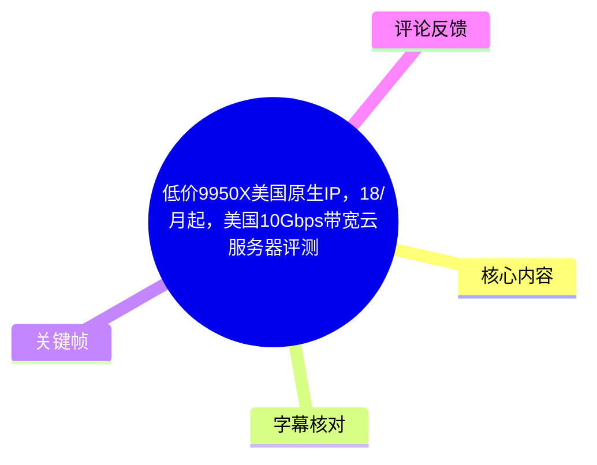
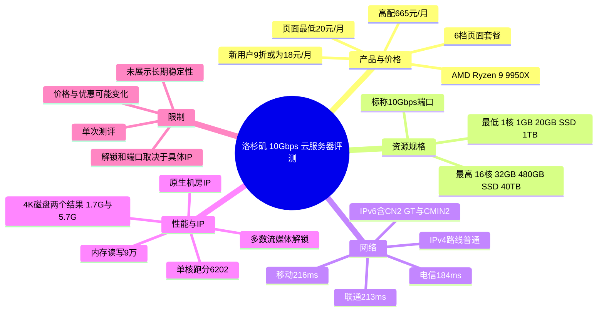
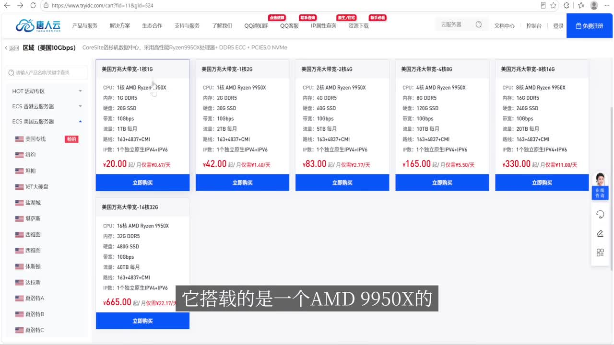
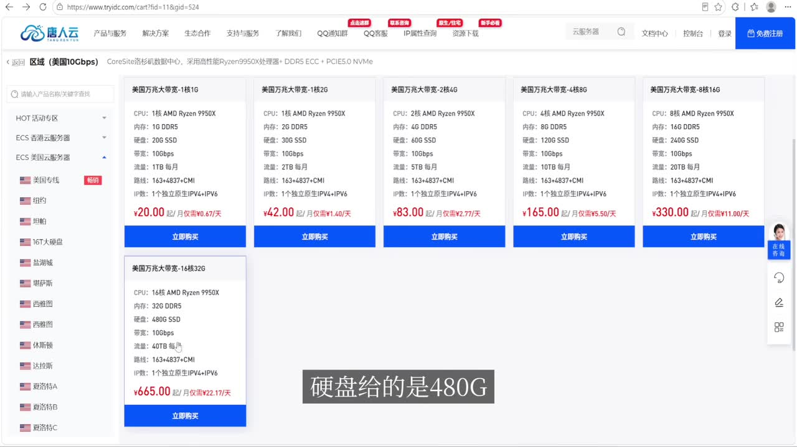
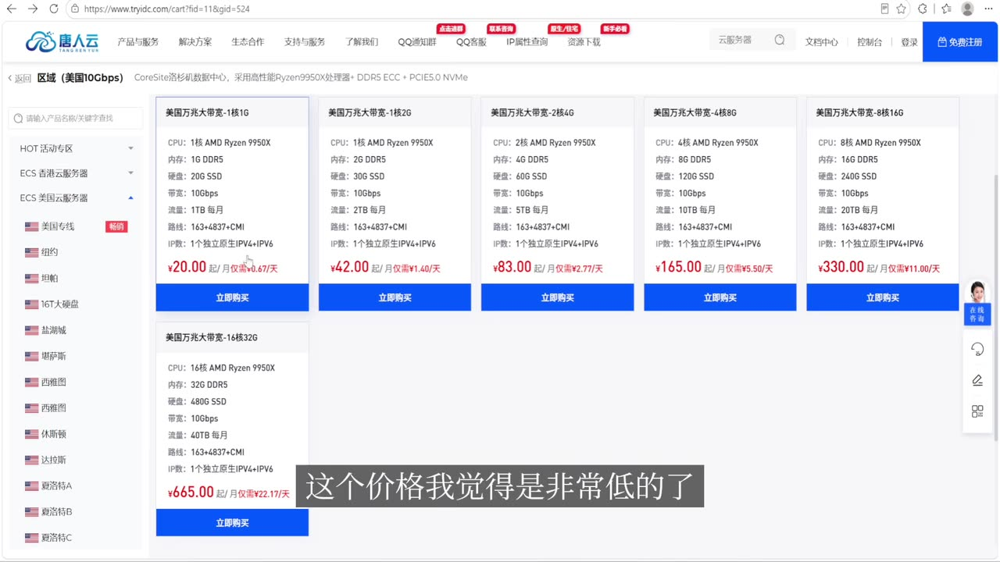
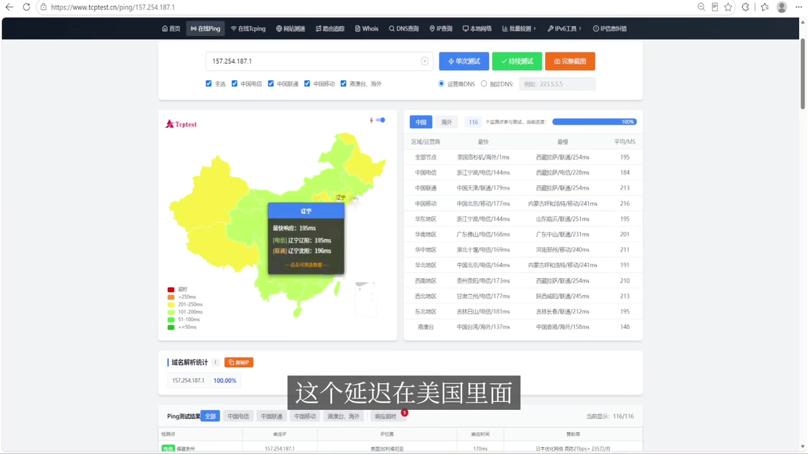

# 低价9950X美国原生IP，18/月起，美国10Gbps带宽云服务器评测

> 来源：[Bilibili 视频](https://www.bilibili.com/video/BV1reNw6xEnB) 
> UP 主：无聊的小秋｜时长：03:14｜合集：AIcode  
> 商品链接（视频简介提供）：<https://tryidc.com/cart?fid=11&gid=524>

## 小结

视频评测的是唐人云（页面与画面中的品牌名；ASR 将其识别为“檀仁云”）美国洛杉矶 10Gbps 云服务器。UP 主展示的套餐页面显示，该系列采用 AMD Ryzen 9 9950X，配置从 1 核 1GB、20GB SSD、1TB 月流量的低配方案起，到 16 核 32GB、480GB SSD、40TB 月流量的高配方案止，共列出 6 档套餐；这与口播“5 个套餐”存在差异，应以画面页面为准。

价格方面，页面中的最低套餐标价为 **20 元/月**，高配为 **665 元/月**。标题中的“18/月起”不能直接视作常规标价：热评中 UP 主补充新用户使用 `TRY2026` 可享 9 折，据此最低 20 元套餐折后可为 **18 元/月**。优惠码的适用范围、有效期及能否与其他活动叠加，视频未进一步说明。

网络测试中，UP 主给出中国大陆三网平均延迟：电信 184ms、联通 213ms、移动 216ms；并称 IPv4 路由较普通，免费分配的 IPv6 路由则包含 CN2 GT 与 CMIN2，属于相对更好的线路描述。洛杉矶本地下载、上传截图所示约为 9Gbps，UP 主据此判断 10Gbps 端口没有虚标；但视频没有展示长期高峰、跨境实际吞吐、丢包率或稳定性测试，因此不能将单次测试等同于持续服务质量承诺。

性能测试部分，视频称 CPU 确为 AMD Ryzen 9 9950X，单核跑分为 6202，内存读写“9 万”；硬盘 4K 测试展示 1.7G 与 5.7G 两个结果，但 ASR 未能可靠识别各数值对应的读写项目和计量单位，不能擅自补全。IP 测试方面，UP 主称其为原生 IP、机房 IP，多个风险库的风险值较低，并称流媒体多数可解锁、25 端口开放可发信。

本视频适合在寻找美国原生 IP、大带宽、高单核性能云服务器的用户作为初筛参考。需要特别注意：测评结论来自 UP 主在特定时间、特定实例和 IP 上的测试；价格、库存、线路、IP 质量、流媒体解锁和 25 端口策略都可能变动，购买前应以商家订单页、服务条款及自行开机实测为准。

## 思维导图

## 目录

- [产品定位、套餐与价格核对](#产品定位套餐与价格核对-0001)
- [网络延迟与三网路由](#网络延迟与三网路由-0037)
- [10Gbps 带宽与硬件性能](#10gbps-带宽与硬件性能-0126)
- [IP 属性、风控与流媒体](#ip-属性风控与流媒体-0220)
- [选购步骤与验证清单](#选购步骤与验证清单-0001)
- [结论、限制与时效性](#结论限制与时效性-0302)
- [字幕比对](#字幕比对)
- [评论分析](#评论分析)
- [处理记录](#处理记录)

## [产品定位、套餐与价格核对](https://www.bilibili.com/video/BV1reNw6xEnB?t=1) [00:01]

视频开场说明，本次对象为唐人云美国洛杉矶“万兆大带宽”云服务器，卖点是 AMD 9950X 高性能 CPU 与 10G 端口。画面套餐页顶部写有“美国 10Gbps”，并标注 CoreSite 洛杉矶数据中心、AMD Ryzen 9950X、DDR5 ECC、PCIe 5.0 NVMe 等字样；这些属于页面宣传与配置描述，视频没有独立验证数据中心或全部硬件链路。

> 图：关键帧直接展示“美国万兆大带宽”套餐卡片、9950X CPU、10Gbps 带宽、IPv4+IPv6 与各档标价，是校正 ASR 中品牌名称和套餐参数的主要视觉依据。

### 套餐信息：口播、标题与页面存在的差异

ASR 在 00:13—00:37 中称“套餐的话是 5 个”，但供给的套餐页关键帧实际上能看到 **6 张套餐卡片**：上排 5 档、下排 1 档高配。因此本文记录页面可见信息，不沿用口播的“五个”说法。

| 页面可见套餐 | CPU | 内存 | 磁盘 | 带宽 | 月流量 | 页面价格 |
| --- | ---: | ---: | ---: | ---: | ---: | ---: |
| 美国万兆大带宽 - 1核1G | 1 核 AMD Ryzen 9950X | 1GB DDR5 | 20GB SSD | 10Gbps | 1TB/月 | 20 元/月 |
| 美国万兆大带宽 - 1核2G | 1 核 AMD Ryzen 9950X | 2GB DDR5 | 30GB SSD | 10Gbps | 2TB/月 | 42 元/月 |
| 美国万兆大带宽 - 2核4G | 2 核 AMD Ryzen 9950X | 4GB DDR5 | 60GB SSD | 10Gbps | 5TB/月 | 83 元/月 |
| 美国万兆大带宽 - 4核8G | 4 核 AMD Ryzen 9950X | 8GB DDR5 | 120GB SSD | 10Gbps | 10TB/月 | 165 元/月 |
| 美国万兆大带宽 - 8核16G | 8 核 AMD Ryzen 9950X | 16GB DDR5 | 240GB SSD | 10Gbps | 20TB/月 | 330 元/月 |
| 美国万兆大带宽 - 16核32G | 16 核 AMD Ryzen 9950X | 32GB DDR5 | 480GB SSD | 10Gbps | 40TB/月 | 665 元/月 |

> 图：该帧聚焦最高配卡片，可核验 16 核 32GB、480GB SSD、40TB/月、665 元/月等高配参数，避免把口播中的数字误记为推测值。

页面上各套餐还写有“线路：163+4837+CMI”以及“IP数：1个独立原生 IPv4+IPv6”。这表示商家页面宣称每档提供一个独立原生 IPv4 加 IPv6；但“原生”是 IP 归属及使用属性描述，并不天然等于所有目标平台均可用。

> 图：此帧显示最低档的 20 元/月标价以及整组套餐，有助于识别标题“18/月起”与当时页面常规价格并不完全相同。

### 关于“18 元/月起”

- **页面常规标价**：最低档为 20 元/月，不是 18 元/月。
- **热评补充**：UP 主在可获取热评中称有新用户 9 折优惠码 `TRY2026`。
- **可推导结果**：20 × 0.9 = 18，因此标题的“18/月起”可能对应使用该码后的最低价。
- **不能确认的内容**：视频素材未展示优惠活动页，也未说明优惠截止时间、是否仅限首月、是否仅适用于特定套餐。因此“18 元/月”应视为带条件的潜在到手价，而非无条件长期价格。

## [网络延迟与三网路由](https://www.bilibili.com/video/BV1reNw6xEnB?t=37) [00:37]

UP 主先展示中国大陆多节点 Ping 测试，并在口播中给出三网延迟：

| 运营商 | UP 主口播的延迟 | 视频中的评价 |
| --- | ---: | --- |
| 中国电信 | 184ms | 在美国服务器中算较低，没有“全红”情况 |
| 中国联通 | 213ms | 同上 |
| 中国移动 | 216ms | 同上 |

> 图：该帧展示测试站的中国地图、节点列表和平均延迟区域，画面可见电信 184ms、联通 213ms、移动 216ms，是三网延迟数据的直观来源。

这些数字应理解为视频录制时该 IP 对测试节点的探测结果，而不是从全国任意家庭网络访问时必然达到的延迟。网络延迟还会受到本地宽带、入口省份、运营商调度、国际出口、目标节点负载及测试时段影响。

### 去程与回程的描述

| 网络方向 / 协议 | 视频陈述 | 解读边界 |
| --- | --- | --- |
| 电信去程 | AS4134 → 1163 | 这是 UP 主口播的路径编号描述；未提供完整 traceroute 文本。 |
| 联通去程 | AS4837 | 对应中国联通 AS 号的口播描述。 |
| 移动去程 | AS58453 与 CMI | 口播称“5845 跟 CMI”，按常见 AS 号表述可理解为 AS58453/CMI，但原视频未展示完整号码文本，保留这一不确定性。 |
| 回程 IPv4 | “非常普通的路线” | 没有给出每跳路由，无法进一步判定是否为优化回程。 |
| 免费 IPv6 | CN2 GT、CMIN2 | UP 主认为其路由较好；实际 IPv6 体验仍取决于本地网络是否具备可用 IPv6。 |

视频的可迁移经验是：不要只看“美国原生 IP”或“10Gbps”标签。对面向中国大陆访问的用途，应分别验证三网延迟、去回程、IPv4/IPv6 差异及晚高峰表现。特别是本视频明确区分了 IPv4 普通、IPv6 相对更好的情况，不能将 IPv6 路由优势外推到 IPv4。

## [10Gbps 带宽与硬件性能](https://www.bilibili.com/video/BV1reNw6xEnB?t=86) [01:26]

### 本地与多地区带宽结果 [01:26](https://www.bilibili.com/video/BV1reNw6xEnB?t=86)

UP 主展示带宽下载情况后称，洛杉矶本地下载和上传均约 **9Gbps**，据此认为 10Gbps 端口没有虚标；接着称各国测试“都是巨口”。这里的“巨口”是口语化评价，应理解为测试中观察到较高带宽，不能等同于所有目的地、所有时段都可稳定跑满。

带宽数据的正确使用方式：

1. **区分端口速率与实际可用带宽**：10Gbps 是端口上限或产品规格；实际吞吐受服务端、对端、路由、协议、并发数与限速策略影响。
2. **区分本地与跨境**：洛杉矶本地约 9Gbps 的结果说明机房内或近端测试表现较高，不代表中国大陆用户能获得同样吞吐。
3. **核对流量配额**：即使端口较大，套餐仍按 1TB—40TB/月限制月流量。高吞吐业务更容易消耗配额，应在下单前确认超额处理方式，视频未说明超额收费、限速或停机规则。

### CPU、内存与硬盘 [01:50](https://www.bilibili.com/video/BV1reNw6xEnB?t=110)

UP 主在性能段落给出的信息如下：

| 项目 | 视频中给出的结果 | 说明 |
| --- | --- | --- |
| CPU 型号 | AMD Ryzen 9 9950X | UP 主称“没有虚标”。这说明被测实例识别到该型号，不足以证明所有实例始终独享或同等性能。 |
| 单核跑分 | 6202 | 视频未在提供字幕中说明具体跑分软件、版本、测试参数及单位。 |
| 内存读写 | “9 万” | ASR 只识别出数值，未可靠给出单位或读写细项，不应擅自标为 MB/s、MiB/s 或分数。 |
| 磁盘 4K 测试 | 1.7G、5.7G | 视频称“硬盘跑 4K”，但字幕没有可靠对应读/写方向、单位及队列深度。 |
| 单线程结果 | 提及“单线程的话” | 紧接着的具体内容在 ASR 中缺失，不能补写数值。 |

因此，视频可以支持“该被测实例在 UP 主测试中显示为 9950X 且呈现较高性能”的结论；但无法仅凭这些片段判断 CPU 是否超售、磁盘介质是否固定、长期 I/O 抖动、不同套餐性能是否一致，或与其他厂商的严格横向排名。

## [IP 属性、风控与流媒体](https://www.bilibili.com/video/BV1reNw6xEnB?t=140) [02:20]

UP 主在 IP 检测环节称：

- 被测地址“确实是一个原生 IP”；
- IP 属性显示为“机房 IP”；
- 4 家风险库中的风险值都较低；
- 风控质量“过关”；
- 流媒体为“多家全解锁”，后续更全面的检测中“基本上大多数都是解锁的”；
- **25 端口开放**，因此按 UP 主表述可用于发信。

这里需要区分不同层面的含义：

1. **原生 IP 与机房 IP 不矛盾**：原生通常指 IP 注册、地理或网络归属未被伪装为住宅网络；机房 IP 则说明它属于数据中心网络。两者不代表住宅 IP。
2. **低风险值不是零风险**：风控库评分是检测时刻、特定库的结果。IP 曾经的使用历史、后续邻居行为与平台规则变更，都可能影响风控。
3. **流媒体解锁是平台和账号维度问题**：视频只说明被测 IP 在当时检测到的结果；不同流媒体服务、账号地区、支付方式、DNS、IPv6/IPv4 出口以及平台策略都会导致实际结果不同。
4. **开放 25 端口不等于可稳定送达邮件**：端口可连接只解决网络层的一部分；邮件实际投递还需要正确设置 PTR/rDNS、SPF、DKIM、DMARC、HELO，并受 IP 信誉与收件方反垃圾策略约束。视频未测试邮件送达率。

## [选购步骤与验证清单](https://www.bilibili.com/video/BV1reNw6xEnB?t=1) [00:01]

视频没有演示完整的下单、部署或 SSH 操作流程，但可以依据其实际展示的评测维度整理一份不超出素材的信息核验步骤。

1. **打开视频简介中的商品链接，核对实际套餐页。**  
   重点确认 CPU、内存、SSD、带宽、月流量、IPv4/IPv6 数量与月付价格。视频画面中最低档是 20 元/月，不能只依据标题直接按 18 元/月结算。

2. **如使用新用户优惠码，先确认适用条件。**  
   热评给出 `TRY2026`，并称为新用户 9 折码。应在付款前确认系统是否实际减价、可用套餐及有效期；素材没有提供更具体规则。

3. **按真实业务确定流量档位。**  
   视频页面的流量从 1TB/月至 40TB/月不等。10Gbps 端口适合突发吞吐，但持续传输会很快消耗月流量，因此需先估算业务的进出流量。

4. **开机后分别测试 IPv4 与 IPv6。**  
   视频的核心结论之一是 IPv6 路由相对更好、IPv4 相对普通。若业务用户主要使用 IPv4，不能只以 IPv6 路由作为决策依据。

5. **从自身目标用户网络测试三网延迟与路由。**  
   可将视频中的电信 184ms、联通 213ms、移动 216ms视作参考基线，再在自身所在地、目标运营商和业务高峰时间复测。

6. **验证业务所需的 IP 能力。**  
   对流媒体、跨境网站、邮件或 API 业务，分别测试目标平台，而不要以“原生 IP”“低风险值”“大多数解锁”替代实际验收。邮件业务还应验证 25 端口、反向解析和实际投递。

7. **压力与稳定性测试不应省略。**  
   视频展示的是单次带宽与性能结果。若用于生产，应补充 CPU 持续负载、磁盘长时间 I/O、跨境晚高峰吞吐、丢包、重启恢复与售后响应测试。

## [结论、限制与时效性](https://www.bilibili.com/video/BV1reNw6xEnB?t=182) [03:02]

从视频呈现的测试结果看，该实例的主要吸引点是：9950X 型号识别、洛杉矶本地约 9Gbps 上下行测试、相对较低的中国大陆三网 Ping、免费 IPv6 的 CN2 GT/CMIN2 路由描述，以及 UP 主观察到的原生机房 IP、较低风险值和多数流媒体解锁。

但决策时应保留以下限制：

- **测评范围有限**：视频未展示完整测试命令、完整路由、基准工具版本、测试服务器位置和多时段数据。
- **性能不可直接泛化**：同一产品不同实例、不同时间和不同邻居负载下，CPU、磁盘与网络结果可能不同。
- **线路存在协议差异**：UP 主明确称 IPv4 路线普通、IPv6 相对更好；仅支持 IPv4 的用户尤其需要自行验证。
- **流量是硬约束**：高带宽不代表无限流量，页面可见的月流量配额会影响实际可用性。
- **邮件与流媒体均有外部变量**：25 端口开放、平台“解锁”都不能保证邮件送达或长期可用。
- **价格及时效性**：页面价格、库存、优惠码和商家策略可能在视频发布后修改。视频元数据发布时间为 2026-07-12；本文中的价格和优惠仅反映该视频素材及可获取热评所述状态。

## 字幕比对

| 字幕来源 | 完整性 | 专有名词 | 时间轴 | 主要问题 |
| --- | --- | --- | --- | --- |
| Bilibili 站内字幕 | 未提供可用字幕 | 无法核验 | 无法使用 | 素材明确标注“未提供可用站内字幕”。 |
| 本次 ASR 字幕 | 较完整：11 段，语音覆盖约 184.55 秒，占全片约 95.45% | 存在误识别与截断 | 可用：含 00:00:01,040—00:03:12,780 的真实分段时间 | “唐人云”识别为“檀仁云”，“10Gbps 大带宽”识别为“万兆大贷款”；部分 AS 号、性能单位、单线程结果不完整。 |

### 最终字幕选择与校正原则

最终以**本次 ASR 的带时间戳分段**作为章节时间轴依据，并结合供给的关键帧进行有限校正。ASR 诊断显示音频存在、语言为中文、时间戳可用，且未标记 `noAudioStream=true`，因此不存在“源视频没有音轨”的情况。

已依据画面或上下文进行的关键校正：

- “檀仁云”校正为 **唐人云**：页面左上角品牌标识可见“唐人云”。
- “万兆大贷款”校正为 **万兆大带宽**：页面套餐名称与视频标题均支持该表述。
- 套餐数量以页面可见的 **6 档**为准，而非 ASR/口播中的“5 个”。
- 最低价格以页面可见的 **20 元/月**为准；“18 元/月起”仅在结合热评所述 9 折码时作为条件性计算结果。
- 对“内存读写 9 万”“硬盘 4K 1.7G、5.7G”“单线程”等 ASR 不完整内容，未虚构单位、读写方向、软件或具体数值。

## 评论分析

以下仅处理可获取热评前三条；评论属于个人观点或补充信息，不作为已验证事实。

1. **故国神游多情应笑我早生华发（4 赞）**  
   评论以反讽方式质疑低价产品的成本来源，暗示可能存在未明示的代价。该评论没有提供技术证据或具体指控，但提醒购买者关注超售、资源争用、服务限制、续费价格、流量规则和售后等视频未充分覆盖的风险。

2. **无聊的小秋（UP 主，1 赞）**  
   UP 主补充称新用户可使用优惠码 `TRY2026` 获得 9 折。该信息可以解释标题“18/月起”与套餐页“20 元/月起”的差异：最低套餐折后为 18 元/月。由于评论没有说明有效期、适用套餐和规则，付款前仍需在订单页实测验证。

3. **工程师-源（1 赞）**  
   评论称“名字是不是有点神了”，属于对名称的简短调侃，没有提供配置、性能、网络或服务质量方面的可用补充信息，也不构成对产品能力的评价证据。

## 处理记录

- **Worker ID**：worker-mrj0www4-e8d79408
- **模型**：gpt-5.6-terra
- **工具与素材**：视频元数据、ASR 结果与 SRT 时间轴、12 个关键帧路径清单及已提供的关键帧画面、可获取热评前三条。
- **字幕选择**：站内无可用字幕；已检查本次 ASR。采用 ASR SRT 的真实起止时间制作章节链接，并以关键帧校正品牌、套餐数量、价格和带宽名称。未将 ASR 无法可靠辨识的性能单位或路由细节补写为事实。
- **关键帧选择依据**：选用 `frames/frame-001.jpg`、`frames/frame-002.jpg`、`frames/frame-003.jpg` 核验套餐、配置、月流量与价格；选用 `frames/frame-004.jpg` 核验三网 Ping 数据。其余关键帧虽在路径清单中，但未提供对应画面内容，不据此臆测。
- **缓存清理**：未提供缓存清理执行日志或结果；为避免编造，不声明已完成清理。
- **未解决问题**：未提供完整测速命令和原始输出；ASR 中硬盘读写方向、单位、单线程数值及部分路由编号存在缺失或识别不确定；优惠码的有效期、限制与商家服务条款未在素材中展示。
