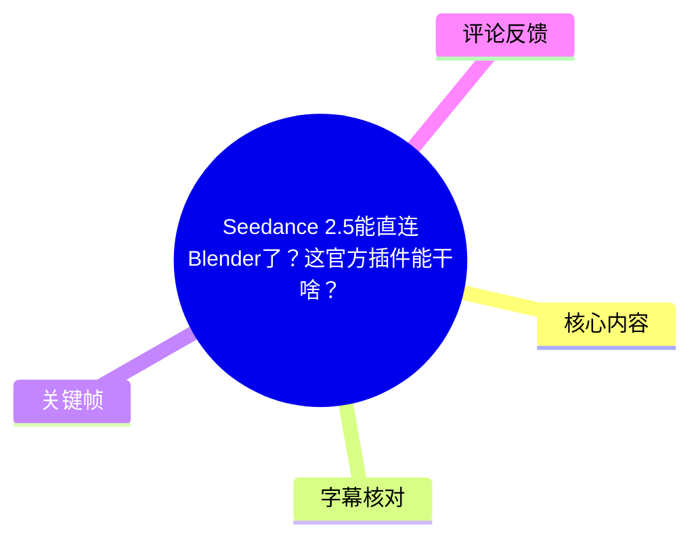
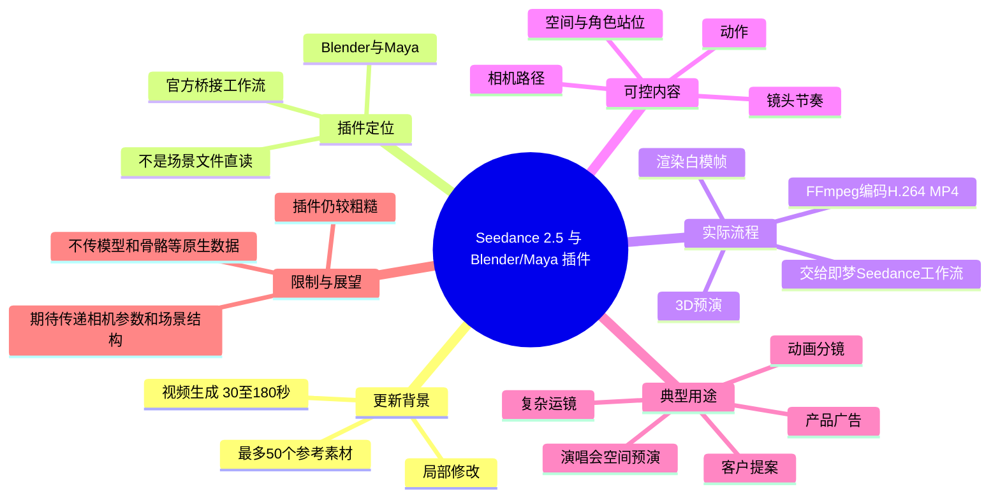
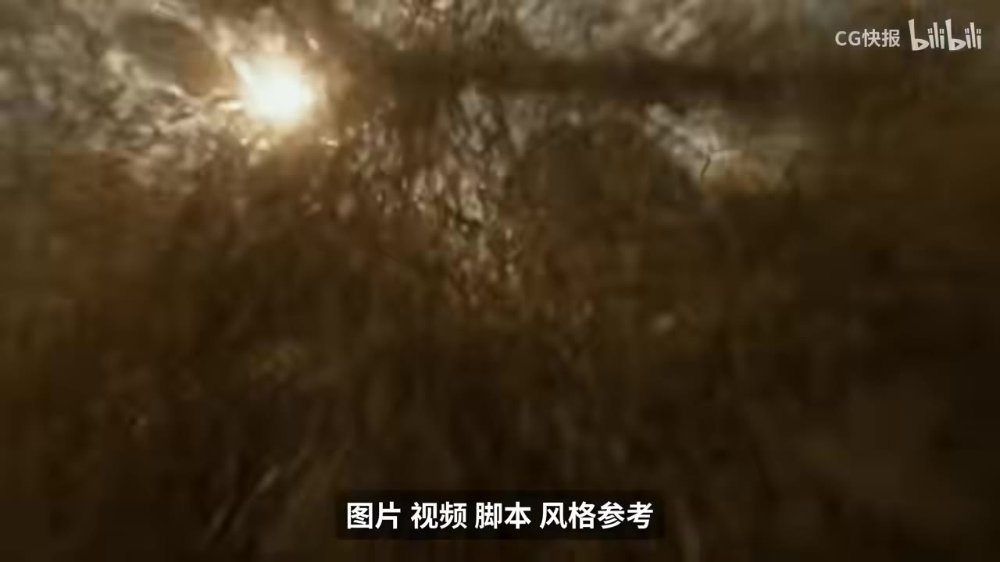
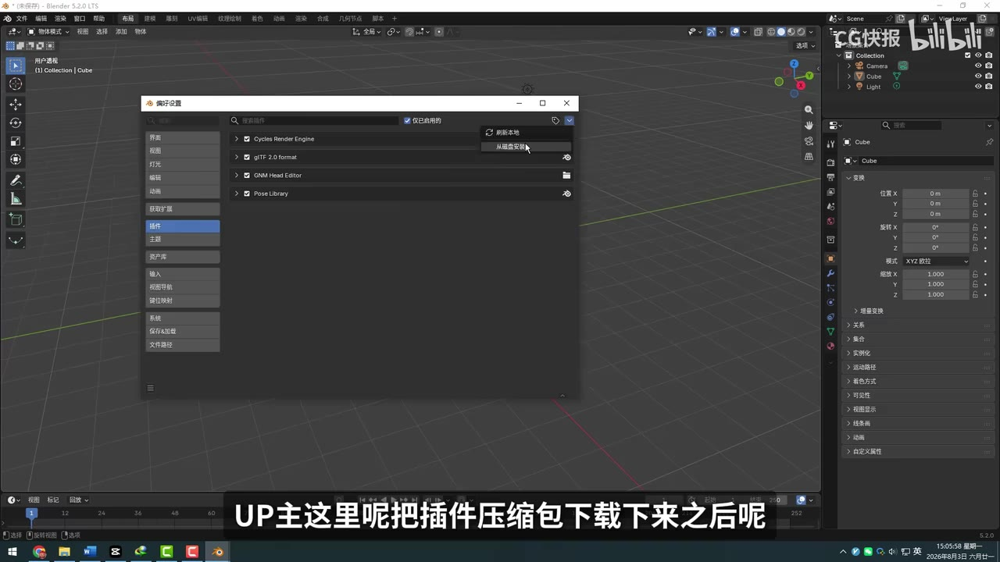
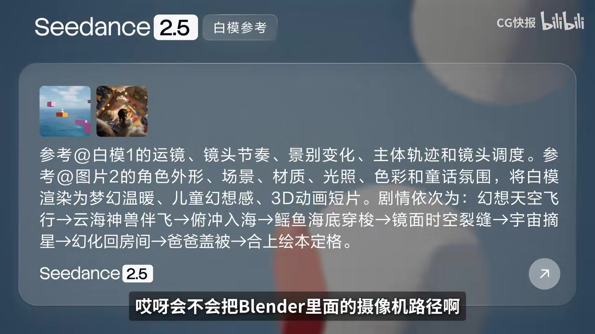

## 小结

这支视频介绍了 **Seedance 2.5 面向 Blender 与 Maya 的官方桥接插件**，并重点核实它是否能“直连”读取 Blender 场景数据。结论是：它并非把 Blender 的相机路径、模型位置、角色骨骼动画或场景结构直接传入 Seedance；当前核心仍是将 3D 场景按已设定的相机与帧率渲染为**白模预演视频**，编码为 MP4 后自动上传／跳转至即梦（视频中称“即梦”）的 Seedance 工作流。

相较于过去“手动渲染白模视频 → 找到文件 → 打开即梦 → 上传”的方法，插件主要省去了导出、定位与上传视频等机械步骤。因此，它的价值是**流程桥接与预演自动化**，而不是 3D 数据级控制或原生场景互通。

视频同时概述了 Seedance 2.5 的若干能力：生成时长可到 **30～180 秒**、最多可组合 **50 个参考素材**（图片、视频、脚本、分镜／参考等，原话表述存在 ASR 误识别），以及用于修正局部瑕疵的局部修改功能。该视频的实际重心并不在这些模型功能，而在 Blender/Maya 插件工作流。

对 3D 创作者而言，最实用的用法是：先在 Blender 中明确**空间、人物位置、动作节奏与镜头运动**，再将白模作为 Seedance 的结构参考。尤其是环绕、升降、俯压等复杂镜头路径，3D 关键帧通常比纯文字提示词更可控；白模本身不必美观，但必须清楚表达“谁在哪里、如何移动、镜头怎么拍”。

当前限制也很明确：视频作者实测认为插件还比较粗糙，尚不能直接读取 `.blend` 场景文件或传送更多原生数据。作者期待后续可支持相机参数、模型 ID、骨骼动画及场景结构等信息，但这属于对未来版本的期待，**不是视频所证实的现有能力**。

信息具有版本时效性：内容依据视频发布时的 Seedance 2.5 与其官方插件状态整理；服务入口、支持的 DCC 软件版本、素材数量／时长上限、积分价格和数据传输能力均可能随后续更新改变，使用前应以官方当前页面和插件说明为准。

## 思维导图





## 目录

- [背景：从白模控制 AI 视频到官方桥接](#背景从白模控制-ai-视频到官方桥接)
- [Seedance 2.5 本体更新概览](#seedance-25-本体更新概览)
- [插件安装、界面与可设置项](#插件安装界面与可设置项)
- [关键核实：插件实际传递了什么](#关键核实插件实际传递了什么)
- [从 Blender 到 Seedance 的实际流程](#从-blender-到-seedance-的实际流程)
- [适用场景与创作经验](#适用场景与创作经验)
- [结论、限制与时效性](#结论限制与时效性)
- [字幕比对](#字幕比对)
- [评论分析](#评论分析)
- [处理记录](#处理记录)

# Seedance 2.5能直连Blender了？这官方插件能干啥？

> 来源：[Bilibili 视频](https://www.bilibili.com/video/BV1PtMX65EDn)  
> UP 主：CG快报｜视频时长：4 分 44 秒｜分辨率：1920×1080｜合集：AIcode  
> 发布时间：2026-08-03（按素材目录中的发布日记录；元数据未提供可直接展示的格式化发布时间）  
> 本文只陈述视频、ASR 字幕、关键帧与所给热评中可确认的内容。

## [背景：从白模控制 AI 视频到官方桥接](https://www.bilibili.com/video/BV1PtMX65EDn?t=24)

视频开头先对比了两种画面：3D 软件中的白模，以及依据该白模生成的 AI 视频。作者将其概括为一种已有实践：先在 3D 软件中跑好人物动作、镜头与机位，再把白模视频交给 Seedance 进行“换皮”式生成。

本次的新闻点是：Seedance 2.5 更新后，官方提供了面向 **Blender 与 Maya** 的桥接插件。作者关注的问题不是“能不能生成”，而是插件到底是否能让 Seedance 直接理解 3D 工程内的结构化信息，从而超越传统的视频参考工作流。


> 图：关键帧显示即梦界面中的“视频生成”与“即梦 Seedance 2.5”入口，字幕为“终于连导视频这一步都能省了”。它直观对应作者所说插件改善的是工作流衔接，而非直接证明场景数据已经互通。

## [Seedance 2.5 本体更新概览](https://www.bilibili.com/video/BV1PtMX65EDn?t=32)

作者在进入插件实测前，列出其所理解的 Seedance 2.5 更新点：

| 项目 | 视频中的说法 | 应如何理解 |
| --- | --- | --- |
| 单次视频时长 | 可做到 30 秒到 180 秒 | 是作者在视频中的版本信息，实际可用时长可能受账户、入口或后续策略影响。 |
| 参考素材数量 | 最多可做到 50 个 | 作者称图片、视频、脚本、分镜／参考可以一起提交；ASR 对后半句识别较乱，不能从字幕推导更细的输入规格。 |
| 局部修改 | 可单独改镜头中的局部 | 用于处理已生成视频中手部异常、背景多余物等问题，目标是尽量保留原构图和动作。 |

局部修改的描述体现了一个实务定位：当整体结果已满意而局部出现 AI 常见瑕疵时，不必一定重新生成整段镜头。不过，视频没有展示该功能的具体界面、掩膜方法、可编辑范围、重试次数或消耗规则，因此不能据此延伸出具体操作参数。



> 图：关键帧字幕写有“图片 视频 脚本 风格参考”，用于辅助理解作者关于多参考输入的概述。画面是功能宣传／示意，未提供可复现的精确上传规则。

## [插件安装、界面与可设置项](https://www.bilibili.com/video/BV1PtMX65EDn?t=56)

作者的安装说明很简略，但给出了可执行的基本路径：

1. 下载官方插件压缩包。
2. 在 Blender 或 Maya 内安装插件。
3. 在插件 UI 中设置与生成／渲染有关的项目。
4. 选择用于输出参考视频的相机，或上传本地已有视频。
5. 通过插件执行渲染与桥接，随后进入对应的 Seedance 工作流。

视频提到 UI 中可设置的内容包括：

- **摄像机**；
- **画质**；
- **帧率**；
- **范围**，应是指渲染帧范围；
- 使用**当前相机**或其他相机进行渲染；
- 上传本地已完成的视频。

作者评价其界面“比较简单、上手没什么门槛”。但视频没有给出插件下载地址、版本号、Blender/Maya 的兼容版本、登录或授权流程、具体按钮名称，也没有展示 Maya 端操作。因此，以上只能作为流程层面的使用记录，不能替代官方安装文档。



> 图：关键帧展示 Blender 偏好设置中的插件页面及“从磁盘安装”按钮，直接印证“下载压缩包后在软件里安装”的步骤。画面中的 Blender 版本显示为 5.2.0 LTS，但这只是作者演示环境的界面信息，视频未明确声明其为插件最低版本要求。

## [关键核实：插件实际传递了什么](https://www.bilibili.com/video/BV1PtMX65EDn?t=81)

这是全片最关键的结论。作者一开始预期插件可能会把以下 Blender 信息直接交给 Seedance：

- 摄像机路径；
- 模型位置；
- 角色动画；
- 其他场景数据。

如果能直接传这些结构化数据，工作流就会与“导出一段视频再上传”有本质区别。但作者实测后的判断是：**目前插件做的事情仍较简单，核心是把场景渲染成白模视频，再把视频作为参考交给 Seedance。**

因此，应清楚区分两种“控制”：

| 控制方式 | 当前视频所证实的状态 |
| --- | --- |
| 以白模视频传达动作、构图和运镜 | 已展示，是当前插件的核心方式。 |
| 将 Blender 工程／场景文件直接交由 Seedance 读取 | 视频作者明确表示目前尚未做到。 |
| 直接传递模型坐标、模型 ID、骨骼动画、场景结构 | 未被视频证明；作者将其列为未来可能的升级方向。 |



> 图：关键帧顶部标明“Seedance 2.5 白模参考”，文本中把白模的运镜、镜头节奏、景别变化、主体轨迹和镜头调度作为参考对象。这张图有助于区分“以视频白模表达控制意图”与“上传可被直接解析的 3D 场景数据”。

## [从 Blender 到 Seedance 的实际流程](https://www.bilibili.com/video/BV1PtMX65EDn?t=104)

作者以 Blender 中一个已做好直升机动画、相机运动和帧率设置的场景为例，描述了插件的内部工作链。根据视频内容及 ASR 对专有名词的校正，流程可整理如下：

```text
Blender 场景预演
  ├─ 设置模型／角色、动作、相机运动、帧率与帧范围
  └─ 在插件中选择相机并发起渲染
        ↓
Blender 渲染白模动画
  ├─ 逐帧渲染当前场景
  └─ 得到白模帧序列
        ↓
插件调用 FFmpeg
  └─ 将帧序列编码为 H.264 MP4
        ↓
桥接至即梦的 Seedance 工作流
  ├─ 将白模视频作为参考提交／传递
  └─ 在浏览器中打开相应工作流
        ↓
Seedance 根据白模预演继续生成视觉结果
```

视频中的关键技术细节如下：

- **渲染源**：Blender 当前场景，依据选定相机；
- **画面性质**：白模动画，不是带最终材质、灯光与特效的成片；
- **编码工具**：作者口述和 ASR 中的“FFFag”应为 **FFmpeg**，这是结合上下文作出的专有名词校正；
- **输出格式／编码**：ASR 写作“A7.264 的 MP4”，结合常用视频编码及语境，应校正为 **H.264 编码的 MP4**；
- **工作流终点**：浏览器内对应的 Seedance 工作流，视频称为交给“即梦”。

相较于手动方法，插件省掉的主要是这些步骤：

1. 手动从 DCC 导出／渲染视频；
2. 在本地磁盘中寻找导出文件；
3. 手动打开即梦；
4. 将视频上传至工作流。

作者的措辞是“方便了一点点”，说明其并未将当前插件定位为彻底改写生产方式的方案。真正需要创作者完成的 3D 预演、渲染耗时、AI 生成与结果筛选依然存在。

## [适用场景与创作经验](https://www.bilibili.com/video/BV1PtMX65EDn?t=152)

### [1. 演唱会或舞台空间预演](https://www.bilibili.com/video/BV1PtMX65EDn?t=152)

作者举例：先在 Blender 里搭好演唱会空间，确定歌手站位、运动方式和镜头运动，再由 Seedance 增加材质、灯光、特效和动作表现。

这类流程的意义在于先把高确定性的空间与调度问题放进 3D 软件解决，减少依赖长提示词反复试错。需注意的是，视频中的“再加动作”是对 AI 最终生成能力的描述，不代表插件传递了角色动画数据；AI 接收到的仍是白模视频所呈现的运动参考。

### [2. 复杂相机路径：最具现实价值的方向](https://www.bilibili.com/video/BV1PtMX65EDn?t=176)

作者特别认可相机路径控制。举例来说，若希望镜头：

- 围绕人物旋转；
- 快速绕到人物上方；
- 再向下俯压；

只用一段提示词会有很强的随机性。与之相比，在 Blender 中可以：

1. 放置并移动相机；
2. 给相机位置、旋转等属性设置关键帧；
3. 调整关键帧之间的速度与节奏；
4. 渲染出白模预演；
5. 让 Seedance 以该预演为镜头结构参考生成画面。

可迁移的经验是：**把“运动与空间关系”交给 3D，把“材质、光影、风格与细节变化”交给 AI。** 这并不保证 AI 完全逐帧遵循白模，但能提高复杂运动意图表达的清晰度。

### [3. 白模不必漂亮，但信息必须明确](https://www.bilibili.com/video/BV1PtMX65EDn?t=200)

作者强调：Blender 内的内容即使很简陋也没有关系。白模不承担最终审美成片的职责，它需要传达的是：

- 谁在什么位置；
- 主体如何移动；
- 镜头如何拍摄；
- 镜头节奏与景别如何变化。

因此，实操上可以优先投入时间到轮廓、体块、站位、运动轨迹与镜头构图，而不是过早追求白模材质质量。反过来说，如果 3D 资产本身已经精致，则可作为更强的视觉基础，作者将这种情况称为“锦上添花”。

### [4. 产品广告、客户预演与内部提案](https://www.bilibili.com/video/BV1PtMX65EDn?t=200)

作者提出的商业化应用包括：

- 以已有的 3D 产品模型作为参考，生成动态产品广告镜头；
- 客户预演；
- 电商视频；
- 内部提案。

其适用前提是已有产品的 3D 模型，或至少能构建基本的产品形态与镜头。视频将其称为可行方向，但没有展示具体广告生成成果、客户交付标准、版权授权或商业素材使用限制；因此不能把这些例子视为已验证的商业生产承诺。

### [5. 基于既有动画分镜的生成](https://www.bilibili.com/video/BV1PtMX65EDn?t=224)

作者还提到一个动画工作流：若前期已将整段动画的分镜规划完成，包括人物出场顺序、人物动作和技能衔接，再把这些分镜／预演交给 Seedance 生成动画感画面。

这里 ASR 将“分镜”多次识别为“风景”，但上下文是“谁先出场、人物怎么动、技能怎么接”，且关键帧中出现剧情／镜头参考描述，因此正文采用“分镜／预演”这一保守校正。视频没有说明该场景是否必须经由插件，也没有说明可接受的分镜格式。

## [结论、限制与时效性](https://www.bilibili.com/video/BV1PtMX65EDn?t=248)

作者的最终判断可以概括为：技术逻辑本身仍是熟悉的“白模 + AI 视频”，新意在于 Seedance 开始以官方功能推动 3D 软件到 AI 视频的桥接。其方向是：

- **3D 软件**：先安排行动、空间与镜头；
- **AI 视频模型**：依据预演继续生成视觉表达。

### 已得到视频支持的结论

1. Seedance 2.5 相关官方插件面向 Blender 与 Maya。
2. 插件能够辅助从 DCC 场景生成白模视频，并自动衔接至 Seedance 工作流。
3. 当前核心传递物是渲染得到的白模 MP4，而非 Blender 的原生场景数据。
4. 对复杂运镜、空间预演、镜头调度来说，3D 关键帧是比纯提示词更明确的控制方法。

### 视频明确指出的限制

1. **尚未直读 Blender 场景文件**：不能据此理解为 Seedance 已经直接连接 `.blend` 文件。
2. **未证实结构化数据传输**：相机参数、模型位置／ID、角色骨骼动画、场景结构没有被证明会直接上传或解析。
3. **插件成熟度有限**：作者认为目前仍有些粗糙，优势主要是减少流程摩擦。
4. **AI 输出仍有不确定性**：视频提到手部异常、背景多余物等局部问题，说明即使有控制参考，仍可能需要局部修改或重新生成。
5. **未给出性能与成本数据**：白模渲染耗时、上传耗时、生成速度、显存／硬件要求及积分消耗均未在正文实测中量化。

### 对未来能力的期待，不应当作现状

作者期待后续插件可能传递更多 Blender 数据，例如：

- 相机参数；
- 模型 ID；
- 骨骼动画；
- 场景结构。

若未来能实现，作者认为熟悉 3D 的创作者做 AI 视频的手感会比单纯依赖提示词更舒适。这是视频的前瞻判断，不是功能公告或已验证路线图。

## 字幕比对

| 字幕来源 | 完整性 | 专有名词 | 时间轴 | 主要问题 |
| --- | --- | --- | --- | --- |
| Bilibili 站内字幕 | 未提供可用字幕，无法比对 | 无法评估 | 无法评估 | 素材明确标注“未提供可用站内字幕”。 |
| 本次 ASR 字幕 | 覆盖较完整：13 段、约 256.36 秒语音、覆盖率 90.44% | 存在多处音近／术语误识别 | 可用；SRT 提供毫秒级起止时间 | 首段文本被异常合并，且“插件、Seedance、FFmpeg、H.264、分镜、骨骼动画”等词语出现错误。 |

### 本次 ASR 检查结果

- ASR 模型：`large-v3-turbo`
- 识别语言：中文，语言置信度 `0.99853515625`
- 音频时长：`283.446` 秒
- 时间戳：存在，可直接使用
- `noAudioStream`：所给 ASR 结果**未标记** `noAudioStream=true`，且诊断显示存在 256.36 秒语音；因此本视频有可识别音轨，不属于“源视频没有音轨”的情况。
- 首段语音从 `00:00:24,940` 开始；这也是正文首个时间轴链接从 24 秒起算的依据。视频前约 25 秒虽可能有画面／字幕，但没有可供引用的 ASR 语音分段，正文不依据文字顺序虚构其时间位置。

### 采用与校正策略

由于没有可用站内字幕，正文以**本次 ASR 的带时间戳 SRT**为主，并结合关键帧画面及上下文做有限校正：

| ASR 结果 | 正文采用 | 校正依据 |
| --- | --- | --- |
| `Cdance`、`C-Dance` | Seedance | 视频标题、关键帧界面的“Seedance 2.5”、上下文一致。 |
| `插箭` | 插件 | 语义为下载、安装和调用的软件插件。 |
| `FFFag` | FFmpeg | 语境为将逐帧图像编码为 MP4 的常见工具；这是术语校正。 |
| `A7.264` | H.264 | 语境为 MP4 编码格式，属于明显音近误识别。 |
| `吉梦`、`吉蒙` | 即梦 | 关键帧显示“即梦 Seedance 2.5”，并与工作流语境一致。 |
| `风景` | 分镜／预演 | 前后文谈人物出场、动作、技能衔接；正文保留“分镜／预演”的不确定性表达。 |
| `谷歌动画` | 骨骼动画 | 与作者列举“相机参数、模型 ID、……、场景结构”的 3D 数据类型上下文一致。 |

除上述明显术语外，本文不将 ASR 的口语化表达扩展为未出现的技术实现细节。

## 评论分析

以下仅分析素材中可获取的热评前三条，评论内容反映用户体验或期待，**不等同于已验证事实**。

| 热评 | 点赞 | 观点与补充 | 可信度与边界 |
| --- | ---: | --- | --- |
| 小弟弟51484：“什么时候能和h3一样开源，会更友好” | 67 | 希望该工具具有类似 “h3” 的开源属性，以提升友好度和可控性。 | 评论未说明“h3”的全称、功能范围或对比标准，不能据此判断 Seedance 的开源策略。 |
| 范虎哥哥：“哭的人想鼠，h3如果能实现的话不会考虑sd” | 65 | 表达若另一工具 “h3” 能实现类似能力，则自己可能不会选择 SD／Seedance。 | 属于个人偏好和竞争产品比较，未附带功能测试或成本数据。且“sd”具体指代在评论中未展开。 |
| 下一站幸福是：“这个要耗多少积分呀。。刚才试了下单次生成都要780积分了，比h3和快乐马贵好多🤦‍♂️” | 65 | 提出成本疑问，并声称一次生成需 780 积分、相对“h3”和“快乐马”更贵。 | 这是用户自述，未提供账户类型、生成时长、清晰度、参考数量、时间或截图。可作为“用户关心积分成本”的信号，不能作为统一价格表。 |

评论区呈现的核心关注点是：**开放性、替代工具竞争，以及单次生成的积分成本**。视频本身未说明积分规则，因此这些问题仍需查看服务当前官方计费页面或在同一生成设置下实际测试。

## 处理记录

- Worker ID：`worker-mrj0wbly-5dc4e50c`
- 整理模型：`gpt-5.6-terra`
- 可用素材与工具结果：视频元数据、关键帧提取结果（`frames/`）、ASR 结果 JSON、ASR SRT 时间轴字幕、热评 JSON；ASR 模型为 `large-v3-turbo`，CUDA 推理，`int8_float16` 计算类型。
- 字幕选择：未发现可用 Bilibili 站内字幕；已检查本次 ASR，确认其带时间戳且视频存在音轨。正文以 ASR SRT 的真实起止时间定位，并仅对可由画面与语境支持的专有名词进行校正。
- 关键帧选择依据：
  - `frames/frame-001.jpg`：展示即梦 Seedance 2.5 入口，说明“省去导视频步骤”的桥接价值；
  - `frames/frame-002.jpg`：展示图片、视频、脚本、风格参考等多参考素材概念；
  - `frames/frame-003.jpg`：展示 Blender 插件安装页面，支撑安装步骤；
  - `frames/frame-004.jpg`：展示“白模参考”及对白模运镜、轨迹、调度的文字说明，支撑核心机制解释。
- 缓存清理：本次任务仅使用提供的素材清单和路径进行整理；未执行额外下载、转码或缓存写入，**无新增缓存需要清理**。
- 未解决问题：
  - 视频未给出插件官方链接、插件版本、Blender/Maya 兼容版本及完整安装配置；
  - 未演示 Maya 端实操；
  - 未量化渲染时间、上传稳定性、生成成功率或积分成本；
  - ASR 首段文本存在异常合并，且无站内字幕可用于逐字复核；
  - 评论提到的“h3”“快乐马”未在视频素材中解释，未对其做事实延伸。
