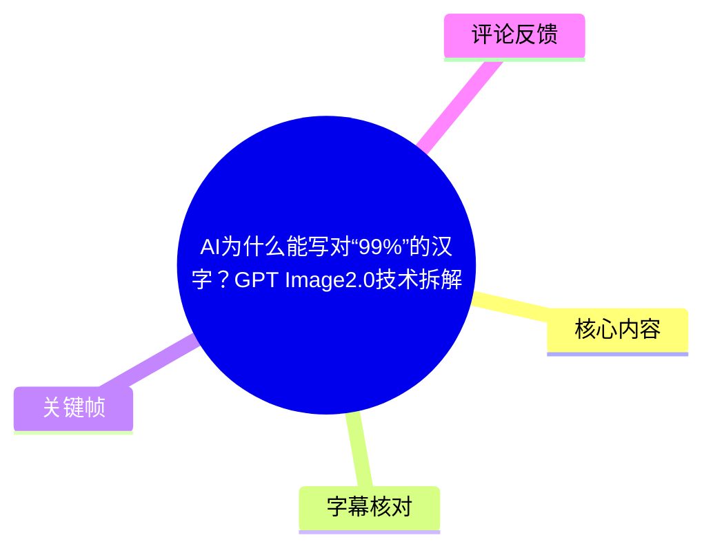
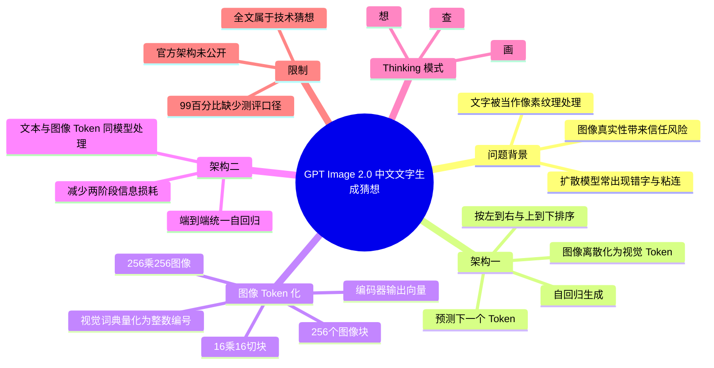
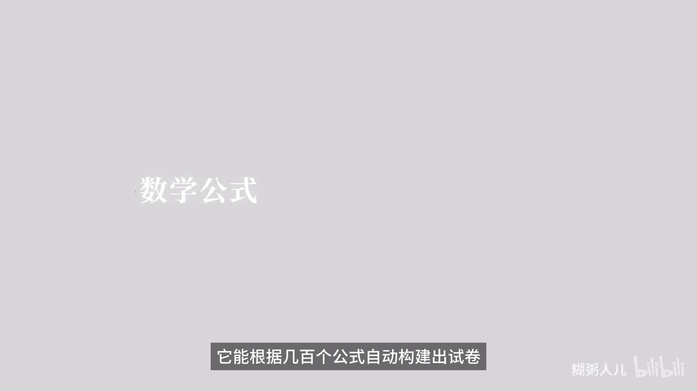
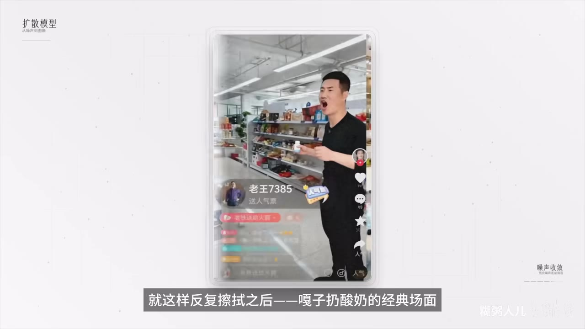
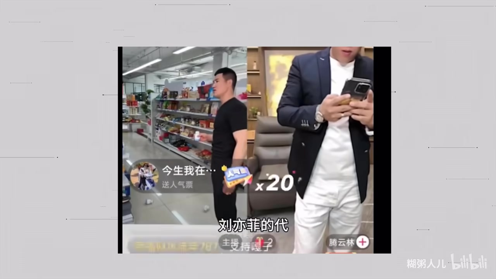
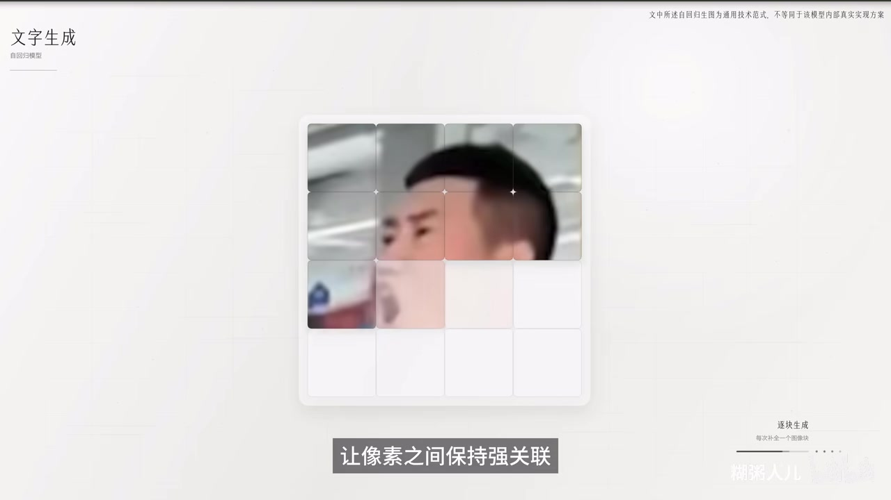

# AI为什么能写对“99%”的汉字？GPT Image2.0技术拆解

> 来源：[Bilibili 视频](https://www.bilibili.com/video/BV1HcRdBaEdU) 
> UP 主：糊粥人儿｜时长：06:40｜分辨率：3840×2160｜合集：AIcode  
> **内容性质提示**：视频结尾明确说明，OpenAI 尚未公开 GPT Image 2.0 的技术架构；片中关于架构、训练与工作流的内容是作者基于既有论文和技术路线作出的**技术猜想**，不应视为官方技术披露。

## 小结

视频围绕一个问题展开：为什么视频所称的 GPT Image 2.0 能较准确地生成汉字，而许多传统图像生成工具仍容易出现错字、粘连、结构变形或排版失控。作者用“扩散模型像一次擦出整张图”“自回归模型像逐字续写”的比喻，说明两类生成范式对文字一致性的潜在影响。

作者的第一个核心判断是：图像若被切分、编码并量化为按空间顺序排列的视觉 Token，就可以像文本 Token 一样被自回归模型逐个预测。按照从左到右、从上到下的顺序生成时，后续 Token 可以参考已生成的左侧和上方内容，因此更容易维持汉字笔画、部件与邻近文字之间的关联。

第二个判断是，GPT Image 2.0 的优势可能来自“端到端统一自回归”：文本 Token 与图像 Token 在同一模型内处理，避免“文本编码器—图像生成器”两阶段交接时丢失偏旁、笔画或版式要求。视频还将其与作者口中的 “Nano Banana 2.0” 路线对照：后者被描述为结合自回归理解与扩散式最终渲染，文字细节仍可能受扩散模块影响。

第三个判断是所谓 Thinking 模式形成“想—画—查”闭环：先拆解提示词与版式需求，必要时联网查询资料；再生成图像；最后校验错别字、排版、角色一致性和提示词元素是否齐全。视频将这一闭环视为把文字正确率推高的关键，但没有给出“99%”的测试集、统计口径、样本量或官方基准，因此该百分比不能据此视为可复现实测结论。

本视频适合希望理解图像 Token、自回归生成、端到端多模态建模与 AI 生图文字问题的读者。需要特别注意：片中“13 人团队、4 个月、LM Arena 领先 242 分、可写对 99% 汉字”等表述均由视频提出，本素材中没有附带原始公告、排行榜截图或论文链接可供核验；其中技术路线又已被作者明确标为推测，时效性与准确性均需以 OpenAI 后续公开资料为准。

## 思维导图

## 目录

- [背景：文字生成为何困难](#背景文字生成为何困难)
- [扩散模型：从噪声到图像，但不真正理解汉字](#扩散模型从噪声到图像但不真正理解汉字)
- [自回归：把图像当作可续写的 Token 序列](#自回归把图像当作可续写的-token-序列)
- [图像 Token 化的步骤与参数](#图像-token-化的步骤与参数)
- [统一模型与端到端自回归](#统一模型与端到端自回归)
- [与 Nano Banana 2.0 的视频内对照](#与-nano-banana-20-的视频内对照)
- [Thinking 模式：想、画、查闭环](#thinking-模式想画查闭环)
- [结论、限制与时效性](#结论限制与时效性)
- [关键帧索引](#关键帧索引)
- [字幕比对](#字幕比对)
- [评论分析](#评论分析)
- [处理记录](#处理记录)

## 背景：文字生成为何困难 [00:28](https://www.bilibili.com/video/BV1HcRdBaEdU?t=28)

视频开场提出若干影响力与能力主张：一个“仅有 13 人”的核心团队在约四个月内将 GPT Image 2.0 推向生图领域前列；其在 LM Arena 中“以 242 分优势领先第二名”；并可根据大量数学公式构建试卷、依据网页截图复刻社交网站页面。视频还认为，这类高保真图像能力会加剧“有图无真相”的信任风险。

其中，以下内容在本素材中**只能作为视频转述**记录，不能进一步确证：

- “13 人核心团队”“四个月”及“LM Arena 领先 242 分”没有配套可核验来源。
- “99%”是标题与后文口述中的概括，视频未定义其是单字准确率、整句准确率、OCR 识别率、人工主观评价，还是特定测试集上的结果。
- “能根据几百个公式构建试卷”“复刻社交网站页面”属于能力展示性表述；其成功条件、失败率、模型版本及是否含后处理均未提供。
- 视频没有展示 GPT Image 2.0 的官方模型卡、论文、API 文档或完整测试提示词。

> 图：画面以“数学公式”及“它能根据几百个公式自动构建出试卷”为例，呈现视频对高质量文字/版式生成能力的开场主张。它有助于理解本期讨论不只关乎单个汉字，还包括公式、布局与文档类图像的复杂文字场景。

## 扩散模型：从噪声到图像，但不真正理解汉字 [00:29](https://www.bilibili.com/video/BV1HcRdBaEdU?t=29)

作者先以噪声逐渐被“擦除”为清晰图像的动画解释扩散式生成：从一团随机噪点开始，经反复去噪后，画面逐步显出人物、货架等轮廓，最终形成短视频截图式画面。随后作者指出，传统生成结果中的中文仍可能粘连或不合规范。

> 图：画面以手机界面中的人物和商店场景演示“反复擦拭”后图像成形。该帧直观对应视频的扩散生成比喻，并为后续“文字为何会错”提供视觉语境。

视频将 Midjourney、Runway 等工具概括为以扩散模型为共同底座，并给出一种通俗解释：扩散模型主要在学习和重建视觉纹理；在作者的比喻中，它面对汉字时可能将其视为“黑色像素纹理”，模仿文字外观而未必掌握文字的语义、笔画结构和规范写法。

这一说法应作适度理解：

1. **视频的解释重点是机制差异，不是严格的模型定义。** 扩散模型并不等于只能处理“纹理”；现代系统也能通过文本条件、OCR 数据、布局控制、后处理等机制提升文字能力。
2. **文字错误具有多种来源。** 除生成范式外，还可能与训练数据质量、文字语言覆盖、分辨率、文本长度、字体、透视、图像压缩、采样策略以及是否采用文字重绘有关。
3. **“扩散模型不懂汉字”是作者的拟人化表述。** 它有助于解释常见错字现象，但不是可由本视频单独证明的严格科学结论。

> 图：该帧将短视频风格画面并置展示，强调图像主体可以较为逼真，而画面内的细小文字、直播 UI 或字符细节仍是更脆弱的区域。这与视频“图像可成形、文字却易失真”的问题设定相呼应。

## 自回归：把图像当作可续写的 Token 序列 [01:17](https://www.bilibili.com/video/BV1HcRdBaEdU?t=77)

视频将 GPT Image 2.0 的第一个“架构突破”归因于自回归模型。作者用文本生成作类比：

- 一句话会先被切分为一个个 Token；
- 模型依据已出现的上下文预测下一个 Token；
- 这一过程不断重复，直到生成完成。

在视频的图像类比中，图像也可被表示为一个 Token 序列。模型在预测后续视觉 Token 时，会参考此前已生成的部分，而不是同时独立决定整张图的所有局部。作者据此认为，自回归生成能使相邻像素或图像块保持更强的逻辑关联，从而有利于让汉字的结构连续、笔画协调。

> 图：画面以网格化图像块逐步出现的方式展示“文字生成 / 自回归模型”。该帧的价值在于把抽象的“预测下一个视觉 Token”转化为可见的逐块生成过程。

需要区分视频类比与更严格的技术表述：

- 视频说“生成下一个像素”，但随后的实际示例采用的是**图像块 Token**，因此更准确的表述应是“逐个预测离散化后的视觉 Token”，而非必然逐像素生成。
- 自回归并不自动保证文字正确。正确率仍依赖视觉编码方式、离散码本、训练数据、文本—图像联合训练、模型容量、解码策略和验证/修正机制。
- 视频所述 GPT Image 2.0 是否确实采用此架构，尚无官方公开材料确认；以下内容应理解为作者提出的可能实现路径。

## 图像 Token 化的步骤与参数 [02:05](https://www.bilibili.com/video/BV1HcRdBaEdU?t=125)

作者以一张 **256×256 像素**图像为例，拆解如何将图像转换成类似文本的序列表示。视频给出的具体参数和步骤如下。

### 1. 切分图像块

将 256×256 图像按 **16×16 像素**的尺寸切块：

\[
(256 / 16) \times (256 / 16) = 16 \times 16 = 256
\]

因此，一张图像被划分为 **256 个小方块**。每个小方块保留其对应局部区域的视觉信息。

### 2. 编码为高维向量

视频称，编码器会将每一个图像块压缩为“高维向量”。此时得到的是连续数值表示，而不是可直接像文字一样索引的离散符号。

### 3. 向量量化为离散整数编号

作者将模型预训练获得的码本比作“视觉词典”：

- 有的词条可对应蓝天纹理；
- 有的词条可对应皮肤质感；
- 有的词条可对应文字笔画的走向。

编码器输出的向量在这个“视觉词典”中寻找最相近的条目，并记录该条目的编号。这样，每个图像块就变成一个离散整数 Token；256 个图像块最终被表示为 256 个整数构成的序列。

### 4. 赋予序列顺序

视频强调，“图像变数字”本身不直接使文字更准确；更关键的是图像 Token 获得了顺序。作者给出的排列方式是：

1. 从左到右；
2. 从上到下；
3. 将二维图像块排成一条一维序列。

这样，当模型生成当前位置的 Token 时，按视频逻辑可查看前面已生成的左侧和上方内容。对于汉字，这意味着后续笔画、部件或相邻字符有机会受已生成结构约束。

| 视频中的参数/概念 | 视频给出的含义 | 可得出的作用 |
| --- | --- | --- |
| 图像尺寸 | 256×256 像素 | 用于演示固定尺度下的 Token 化 |
| 分块尺寸 | 16×16 像素 | 一个图像块承载局部视觉信息 |
| 图像块数量 | 256 个 | 16×16 的网格，共 256 个位置 |
| 编码器 | 把每个图像块压缩成高维向量 | 获得连续视觉表示 |
| 视觉词典/码本 | 存放可匹配的视觉原型 | 作为离散化参照 |
| 离散编号 | 每块匹配到的整数 ID | 让图像可表示为 Token 序列 |
| 排序规则 | 左到右、上到下 | 给二维图像建立自回归生成顺序 |

这些参数是视频的**示意性讲解参数**。素材并未证明 GPT Image 2.0 实际使用 256×256 输入、16×16 分块或恰好 256 个视觉 Token；不能将它们误读为官方配置。

## 统一模型与端到端自回归 [04:06](https://www.bilibili.com/video/BV1HcRdBaEdU?t=246)

作者提出第二个关键点：从“两阶段模块拼接”转向“原生端到端统一自回归架构”。

视频描述的上一代/常见两阶段流程是：

1. **文本编码器**先理解用户需求；
2. 文本表征交给**自回归图像生成器**；
3. 图像生成器据此生成结果。

作者以“翻译官—画师”作比喻：用户先把需求告诉翻译官，再由翻译官转达给画师。每发生一次转交，信息都可能损耗。例如，文本侧可能遗漏某个偏旁，图像侧也可能误解或漏画笔画。

相对地，视频描述的 GPT Image 2.0 假想路线是：

- 不将文本理解与图像生成拆为相互传递的两个主体；
- 文本 Token 与图像 Token 进入“同一个大脑”；
- 模型在绘制每个视觉 Token 时都可以直接访问原始提示词中的 Token；
- 因而文字、语义、笔画与布局要求可在单一序列建模过程中共同约束。

作者的结论是：若文本与图像共享统一的 Token 处理机制，模型在生成汉字时可调用的不只是“画出文字纹理”的能力，也可能利用文本语料中形成的字形、语义、读音、结构和规范写法知识。

不过，这里存在两层不能跨越的推论：

- “共享模型/统一 Token 空间”不等于模型真正具备人类式理解，也不必然意味着它显式存储每个汉字的笔顺规则。
- 即便统一端到端路线有潜在优势，视频没有提供消融实验，无法量化它相对于两阶段系统究竟贡献了多少文字正确率。

## 与 Nano Banana 2.0 的视频内对照 [04:54](https://www.bilibili.com/video/BV1HcRdBaEdU?t=294)

视频将“GPT Image 2.0”的假想端到端方案，与作者称为 “Nano Banana 2.0” 的混合路线作对照。按作者叙述，后者的工作方式是：

1. 用户输入提示词；
2. 自回归模型先负责理解需求，并勾勒草图与轮廓；
3. 最终成图则交由独立的“流匹配”模块完成文字、光影、细节和高精化；
4. 作者将该流匹配模块描述为扩散模型的优化分支；
5. 因最终渲染仍存在扩散式成分，中文文字可能继续出现错位或粘连。

这是一种用于帮助理解的**路线比较**，但应保留以下限制：

- ASR 对此段的专有名词识别不稳定，尤其是 “Nano Banana 2.0”“流匹配”附近存在音译与术语误识别风险。
- 视频未提供所称系统的官方技术资料、版本号、模型结构图或对照测试样本。
- 因此，不能依据本视频断言某一具体产品必然使用“自回归加扩散”的固定架构，也不能据此确认其中文生成表现。

可迁移的经验是：评估“AI 能否把字写对”时，不宜只问它是否有自回归模块；还应追问最终输出由哪个模块负责、文本条件如何进入生成器、是否有高分辨率重绘、是否有 OCR/规则校验，以及是否存在后处理。

## Thinking 模式：想、画、查闭环 [05:42](https://www.bilibili.com/video/BV1HcRdBaEdU?t=342)

视频把 Thinking 模式称为将准确率推向“99%”的第三个“杀手锏”，并概括为“先想、后画、再检查”。

### 视频描述的三步流程

1. **想：拆解需求**
   - 用户提交提示词后，模型不立即作图；
   - 先拆解复杂要求，例如文字内容、版式、主体、元素与关系；
   - 对不确定的信息，视频称它可以主动联网搜索最新资料后再作图。

2. **画：依规划生成**
   - 按已规划的布局逐步生成最终图像；
   - 生成过程中持续检查文字是否写对、排版是否歪斜。

3. **查：完成后自检**
   - 检查文字有无错别字；
   - 检查角色与上一张图是否为同一角色；
   - 检查提示词列出的元素是否全部出现。

作者将其概括为 AI 图像生成从“只会临摹的学徒”转向“会思考、会检查的人”。这个说法强调的是工作流层面的规划与验证，而不是单一网络结构本身。

### 实际使用时可借鉴的提示词检查清单

视频没有给出可直接执行的提示词模板，但其“想—画—查”逻辑可转写为人工验收清单：

| 检查维度 | 应明确的内容 |
| --- | --- |
| 文字 | 每一段需要出现的原文、标点、大小写、繁简体与禁止出现的错别字 |
| 版式 | 标题/正文/按钮的位置、对齐方式、行数、留白与层级 |
| 图像主体 | 人物数量、服装、动作、物品和场景关系 |
| 跨图一致性 | 角色脸部、服饰、配色、品牌元素和世界观是否延续 |
| 事实时效 | 涉及新闻、价格、日期、政策或实时人物信息时，先核验资料来源 |
| 输出验收 | 放大检查小字；必要时 OCR；发现错字则局部重绘或重新生成 |

“主动联网搜索”“生成中持续校验”“成图后自检”是否为 GPT Image 2.0 的实际功能，仍仅是视频主张。若将其用于真实生产，应以所使用产品的权限、隐私政策、联网开关、版本能力和实际测试结果为准。

## 结论、限制与时效性 [06:23](https://www.bilibili.com/video/BV1HcRdBaEdU?t=383)

视频最终明确给出最重要的限制：**OpenAI 尚未公布 GPT Image 2.0 的技术架构**。因此，前文关于自回归、视觉 Token、端到端统一架构、混合路线与 Thinking 模式的讨论，均是作者“对过往技术论文的推导”和技术猜想。

据此，最稳妥的结论应分为三层：

1. **可理解的技术逻辑**  
   将图像离散为有顺序的视觉 Token，并采用自回归方式进行联合文本—图像建模，理论上有助于加强局部结构与文本条件之间的一致性；“规划—生成—校验”工作流也可能改善复杂文字和版式任务的完成度。

2. **视频提出但未证实的产品结论**  
   GPT Image 2.0 是否采用上述全部设计、是否由 13 人团队在四个月完成、是否以 242 分领先，以及是否能稳定达到“99%”中文文字准确率，均不能由本素材独立验证。

3. **现实使用中的风险与限制**  
   - 生图中文字即便肉眼看似正确，仍可能有错别字、漏字、异体字、笔画错误或事实错误。  
   - 涉及证件、票据、学生证、防伪水印、网页仿冒或身份材料时，高保真编辑可被用于欺诈；不应将生成结果用于伪造、冒用或规避审核。  
   - 图像的“真实性”不能仅凭视觉效果判断；新闻、证件、通知、交易凭证等高风险内容应回到原始来源核验。  
   - 模型能力、榜单分数、联网政策和产品架构会随版本快速变化。视频发布于 2026 年，且其论述建立在未公开架构的推演上，阅读时应优先查阅后续官方模型卡、论文、更新日志和独立评测。

## 关键帧索引

| 关键帧 | 正文位置 | 画面内容 | 选择价值 |
| --- | --- | --- | --- |
|  | 背景 | “数学公式”与“根据几百个公式自动构建出试卷”的展示 | 说明问题对象包含公式、文档与复杂排版，而非仅单个汉字 |
|  | 扩散模型 | 手机短视频画面逐渐被生成/还原 | 对应从噪声去除到清晰图像的扩散式比喻 |
|  | 扩散模型 | 多个短视频画面与小字/UI 细节 | 帮助理解逼真场景与不稳定文字可同时出现 |
|  | 自回归 | 图像被网格化并逐块呈现 | 可视化视觉 Token 按顺序生成、保持局部关联的讲解 |

> 以上图片均使用所提供关键帧的相对路径。选择依据是其画面内容直接对应视频中的能力主张、扩散过程和自回归图像块解释，而非仅作装饰。

## 字幕比对

| 字幕来源 | 完整性 | 专有名词 | 时间轴 | 主要问题 |
| --- | --- | --- | --- | --- |
| Bilibili 站内字幕 | 未提供可用字幕 | 无法评估 | 无法使用 | 素材明确标注“未提供可用站内字幕” |
| 本次 ASR 字幕 | 较完整：17 段，覆盖约 362.69 秒语音，占 399.03 秒总时长约 90.89% | 存在较多误识别 | 可用：所有段落均有起止时间 | 多个英文名、术语与个别中文词识别不稳；开头及部分段落存在长句合并 |

本次 ASR 使用 `medium` 模型，识别语言为中文，语言置信度为 `0.99755859375`，使用 CUDA 与 float16 推理。诊断结果未标记 `noAudioStream=true`，且实际检测到音轨及连续人声，因此本视频并非无音轨素材。

最终采用策略如下：

- **时间轴**：采用本次 ASR SRT 的真实起止时间；正文链接均按 SRT 起始秒数换算，例如 01:17 对应 `t=77`。
- **正文语义**：以 ASR 为主，并以视频画面、上下文及作者结尾的自我限定作保守整理。
- **不强行纠错的内容**：没有官方字幕或原始技术资料支撑时，不把 ASR 中不稳定的名称擅自确定为唯一正确写法。
- **已作保守规范化的词语**：将 ASR 中的“扩展模型”按上下文整理为“扩散模型”；将反复出现的“GBT Image”整理为标题中的 “GPT Image”；“Prom”整理为“提示词（Prompt）”。“Nano Bonanno”“流皮配”等处保留为视频口述中可能存在的专有名词/术语识别不确定性，不将其当作已核验事实。
- **关键帧辅助**：关键帧确认视频确实包含数学公式、扩散去噪、短视频画面与图像网格化的可视化讲解；关键帧无法单独证实模型架构或准确率数据。

## 评论分析

仅获取到 2 条热评，少于“热评前三条”的上限；以下仅分析可获取内容，不补造第三条评论。

1. **御坂55536号｜200 赞**  
   评论者称，自己曾使用 GPT 对他人的学生证照片进行编辑：去除手写信息、保留防伪水印，再填入自己的信息，且“看不出来是假”。这是一则个人经历陈述，未附图片、模型版本、提示词、操作步骤或第三方验证，不能当作已证实能力数据。  
   其价值在于补充了视频所说“有图无真相”风险的具体滥用场景：证件编辑、身份冒用和防伪元素仿制可能降低伪造门槛。该行为涉及明显的欺诈与身份材料伪造风险，不应模仿或传播具体操作方法。

2. **發燈條等總計39000人｜120 赞**  
   评论内容仅为表情 `[doge]`，未提供可分析的观点、技术补充或证据。它最多反映了互动参与，不构成对视频技术结论的支持或反驳。

## 处理记录

- Worker ID：`worker-mrj0wjed-b0c290ad`
- 整理模型：`gpt-5.6-terra`
- 可用素材工具/产物：视频合并文件 `merged.mp4`、音频 `audio/audio.wav`、关键帧目录 `frames/`、ASR 结果 `asr/asr-result.json`、SRT `asr/transcript.srt`、评论文件 `comments/comments.json`。
- 字幕选择：站内字幕未提供可用版本；已检查本次 ASR，确认存在音轨、ASR 有真实时间戳且覆盖率约 90.89%，故采用 ASR SRT 作为时间轴依据，并对明显术语误识别作保守上下文校正。
- 关键帧选择依据：选用 `frame-001.jpg` 至 `frame-004.jpg`，分别对应数学公式能力展示、扩散去噪过程、文字/界面细节场景与自回归网格化示意；图片均服务于正文中的特定技术论点。
- 评论处理：仅分析实际获取到的前 2 条热评；未获取到第 3 条，因此未补充或推测。
- 缓存清理：素材清单未提供缓存清理执行日志；本记录不声称已执行或完成缓存删除。
- 未解决问题：
  - 未提供官方/站内字幕，无法进行逐句的双字幕校对。
  - 未提供 OpenAI 原始公告、技术论文、模型卡或 LM Arena 页面，无法核验视频中的团队规模、研发周期、排名分差与“99%”准确率。
  - ASR 对英文产品名与“流匹配”等术语识别存在误差，相关段落已在正文中标明不确定性。
