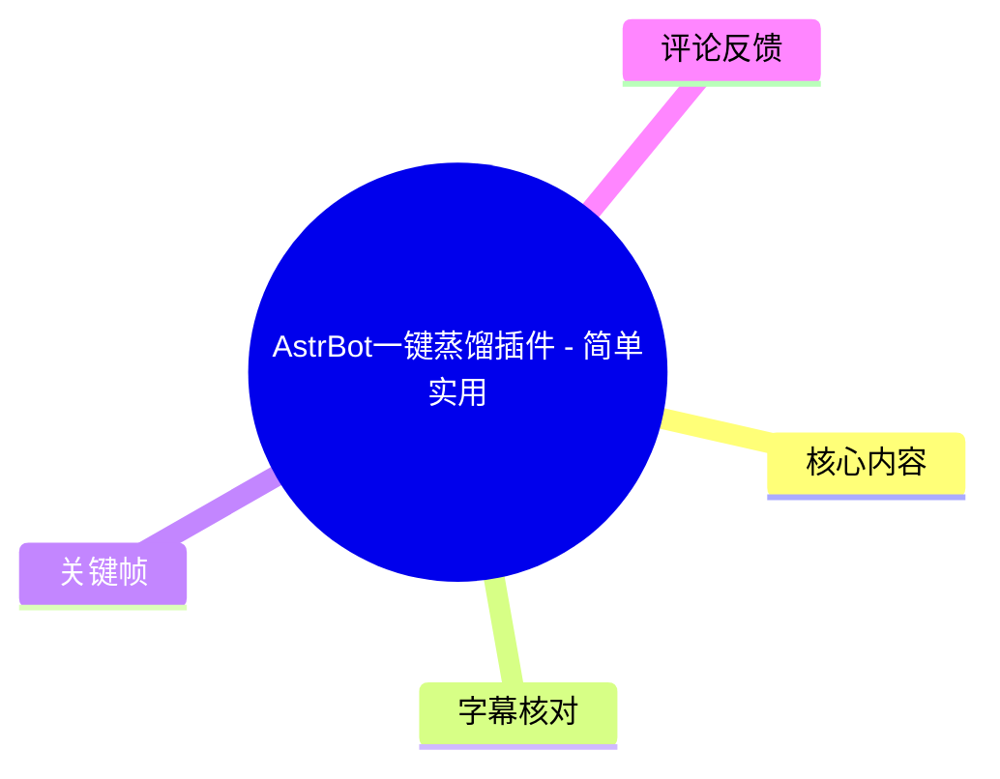
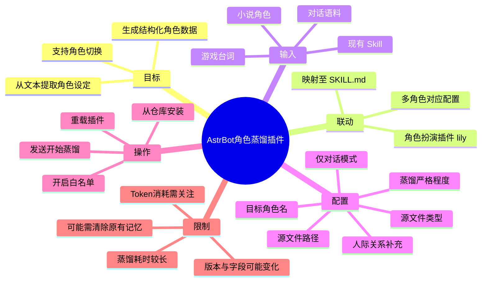
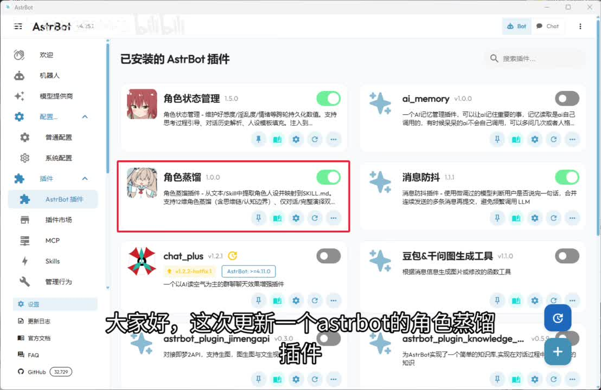
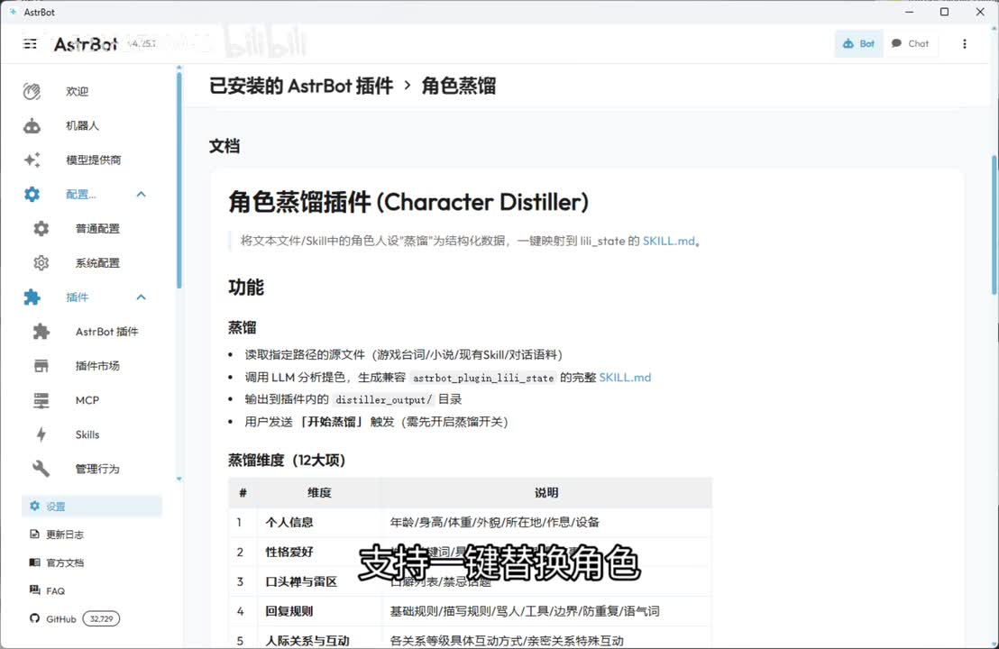
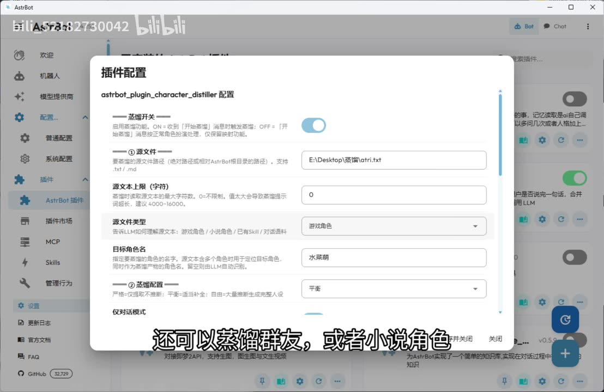
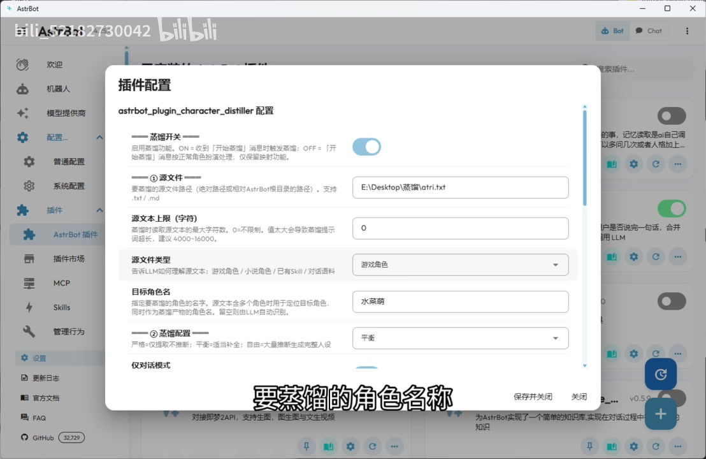

# AstrBot一键蒸馏插件 - 简单实用

> 来源：[Bilibili 视频](https://www.bilibili.com/video/BV1WmLh6iEi3) 
> UP 主：bili_52182730042｜时长：01:32｜合集：AIcode  
> 视频简介提供的仓库：  
> - 蒸馏插件：<https://github.com/mcxxiu/character_distiller_for_lily>  
> - 角色扮演插件：<https://github.com/mcxxiu/lily>

## 小结

视频介绍了一个面向 AstrBot 的「角色蒸馏」插件。它的目标不是直接让模型模仿一段文本，而是读取游戏台词、小说、已有 Skill 或对话语料等来源，经 LLM 分析后整理出结构化角色设定，并与此前的角色扮演插件联动使用。

核心价值在于角色切换：视频称，蒸馏结果可以映射到角色扮演侧的 `SKILL.md`，支持为多个角色准备配置并按需切换。演示界面还显示，蒸馏维度包含个人信息、性格爱好、口头禅与语区、回复规则、人物关系与互动等项目；这意味着它试图保留的范围不只是一句提示词，而是角色的人设和行为方式。

配置时需填写源文件路径、源文件类型、目标角色名和蒸馏配置，并可选择是否仅输出对话、是否映射到角色扮演插件、多个角色时的对应角色，以及补充角色人际关系。画面可确认源文件支持 `.txt` 与 `.md`，源文本上限设置为 `0` 时表示不限制；界面建议的文本规模为 `4000–16000` 字符。

安装流程为：在 AstrBot 的插件界面点击右下角加号，从仓库安装并填写仓库地址；随后进入插件配置，确保蒸馏插件与角色扮演插件均已启用白名单。配置完成后，对 Bot 发送“开始蒸馏”，等待处理结束，再到插件页面重载插件。

重要限制是蒸馏耗时较长，且实际效果与输入语料质量、模型分析能力及角色扮演插件的配置有关。UP 主在热评补充：若要让切换后的角色生效，可能需要先清除 Bot 原有记忆；该补充属于评论信息，视频正文未展示完整操作细节。视频发布于 2026-05，仓库、AstrBot 版本、插件字段与安装入口均可能随更新变化，应以仓库当前说明为准。

## 思维导图

## 目录

- [背景与插件定位](#背景与插件定位-0000)
- [角色蒸馏的内容与联动方式](#角色蒸馏的内容与联动方式-0004)
- [配置项、参数与输出限制](#配置项参数与输出限制-0013)
- [安装、启用与执行步骤](#安装启用与执行步骤-0044)
- [后续更新、预置文件与 Token 提示](#后续更新预置文件与-token-提示-0111)
- [结论与限制](#结论与限制-0122)
- [字幕比对](#字幕比对)
- [评论分析](#评论分析)
- [处理记录](#处理记录)

## [背景与插件定位](https://www.bilibili.com/video/BV1WmLh6iEi3?t=0)

视频开头说明，本次更新的是 AstrBot 的角色蒸馏插件。ASR 将产品名多次误识别为“SRBOT”，但画面左上角清晰显示为 **AstrBot**，因此正文统一采用 AstrBot。

在插件列表中，演示项名称为“角色蒸馏”，版本号显示为 `1.0.0`。其卡片说明可辨识出：这是一个从文本或 Skill 中提取角色人设、并映射到 `SKILL.md` 的插件；卡片同时提示其支持 **12 个角色蒸馏维度**。视频讲述的重点是它与此前角色扮演插件的联动，而不是独立的通用文本摘要工具。

> 图：画面在 AstrBot“已安装的 AstrBot 插件”列表中用红框标出“角色蒸馏 1.0.0”。这张图用于确认视频操作对象、插件名称及其位于 AstrBot 插件管理界面。

## [角色蒸馏的内容与联动方式](https://www.bilibili.com/video/BV1WmLh6iEi3?t=4)

视频称，新插件可与此前的角色扮演插件联动，能够蒸馏多个角色并供切换使用；ASR 中“提起一键替换角色”的语句结合画面，应校正为“支持一键替换角色”。

### 蒸馏处理的对象与结果

[00:10](https://www.bilibili.com/video/BV1WmLh6iEi3?t=10) 视频表示，蒸馏结果会尽量较完整地保留人设；除了既有角色，也可以蒸馏群友或小说角色。这里的“保留完整”是 UP 主对效果的描述，不代表对角色还原度的可量化保证。

画面中的插件文档将功能描述为：

1. 读取指定路径的源文件，来源可包括游戏台词、小说、现有 Skill、对话语料。
2. 调用 LLM 分析角色。
3. 生成兼容角色扮演插件的完整 `SKILL.md`。
4. 将输出写入名为 `distiller_output/` 的目录。
5. 用户发送“开始蒸馏”触发处理，但需要先开启蒸馏开关。

> 图：插件文档页明确展示“角色蒸馏插件（Character Distiller）”、读取源文件、调用 LLM、生成 `SKILL.md` 与输出目录等流程。它为“蒸馏”在本视频中的具体含义提供了画面依据。

### 可见的角色蒸馏维度

[00:13](https://www.bilibili.com/video/BV1WmLh6iEi3?t=13) 画面中的“蒸馏维度（12大项）”表格仅部分可见，可确认的前五项如下：

| 序号 | 可见维度 | 画面中可辨识的说明方向 |
| --- | --- | --- |
| 1 | 个人信息 | 年龄、身高、体重、外貌、所在地点、作品、设备等 |
| 2 | 性格爱好 | 性格与偏好相关信息 |
| 3 | 口头禅与语区 | 说话方式、表达习惯等 |
| 4 | 回复规则 | 基础规则、措辞规则、语气、人设边界等 |
| 5 | 人际关系与互动 | 关系等级、具体互动方式、亲密关系与特殊互动等 |

视频未完整展示表格第 6 至第 12 项的内容，因此不能据此补全或推定其余维度。

## [配置项、参数与输出限制](https://www.bilibili.com/video/BV1WmLh6iEi3?t=13)

### 源文件与目标角色配置

[00:13](https://www.bilibili.com/video/BV1WmLh6iEi3?t=13) 演示中的插件配置窗口标题为 `astrbot_plugin_character_distiller 配置`。可确认的主要字段如下：

| 配置项 | 视频中的含义或可见值 | 注意事项 |
| --- | --- | --- |
| 蒸馏开关 | 控制是否启用蒸馏功能 | 需要先开启，才能通过“开始蒸馏”消息触发 |
| 源文件 | 例子为 `E:\Desktop\蒸馏\atri.txt` | 支持 `.txt`、`.md`；应填绝对路径或相对 AstrBot 根目录的路径 |
| 源文本上限（字符） | 示例值 `0` | 画面说明 `0` 表示不限制；文本过大会导致蒸馏提示词过长，建议 `4000–16000` |
| 源文件类型 | 示例选择“游戏角色” | 下拉项对应游戏角色、小说角色、已有 Skill、对话语料等来源 |
| 目标角色名 | 示例为“水菜萌” | 用于指定要蒸馏的角色；源文本含多个角色时尤其重要 |
| 蒸馏配置 | 示例选择“平衡” | 画面中可见该项用于在严格还原与自由生成倾向之间调整 |
| 仅对话模式 | 视频口述提及 | 可控制输出是否仅保留对话，而不含场景、表情、动作描写 |
| 映射到角色扮演 | 视频口述提及 | 决定蒸馏材质是否映射给角色扮演侧；多角色时需选对应角色 |
| 人际关系补充 | 视频口述提及 | 可为被蒸馏角色配置或补充人物关系 |

> 图：配置窗口给出了源文件路径、源文本上限、源文件类型、目标角色名和“平衡”蒸馏配置的实际界面示例，是理解字段含义与字符上限建议的直接依据。

### 输出风格与多角色映射

[00:27](https://www.bilibili.com/video/BV1WmLh6iEi3?t=27) 视频说明，用户可以配置蒸馏结果是否“仅输出对话”，即不包含场景、表情和动作描写。这一选项适合希望将结果用于简洁聊天人设的场景；但视频未说明关闭该选项后具体输出模板或文件结构。

[00:35](https://www.bilibili.com/video/BV1WmLh6iEi3?t=35) 蒸馏产物可选择是否映射到角色扮演插件。当存在多个角色时，还需要选择对应的角色，以避免将 A 角色的蒸馏结果映射到 B 角色。

[00:41](https://www.bilibili.com/video/BV1WmLh6iEi3?t=41) 视频还提到可以配置或补充蒸馏角色的人际关系。由于演示未展开该字段，关系结构、填写格式和优先级均未在视频中给出。

> 图：该帧突出“目标角色名”字段，示例填写为“水菜萌”。它说明蒸馏过程并非只依赖源文本，还需要明确指定目标角色，特别适用于多角色文本。

## [安装、启用与执行步骤](https://www.bilibili.com/video/BV1WmLh6iEi3?t=44)

以下步骤按视频时间顺序整理；仓库地址来自视频简介，画面未逐字展示 URL。

1. **打开 AstrBot 并进入插件入口**  
   [00:47](https://www.bilibili.com/video/BV1WmLh6iEi3?t=47) 在 AstrBot 界面中点击右下角的“+”按钮。

2. **选择从仓库安装**  
   [00:51](https://www.bilibili.com/video/BV1WmLh6iEi3?t=51) 选择“从仓库安装”，再输入蒸馏插件仓库地址：  
   <https://github.com/mcxxiu/character_distiller_for_lily>

3. **打开插件配置页**  
   [00:54](https://www.bilibili.com/video/BV1WmLh6iEi3?t=54) 安装后进入角色蒸馏插件的配置页，填入源文件路径、来源类型、目标角色名等必要信息。

4. **同时启用两个插件的白名单**  
   [00:56](https://www.bilibili.com/video/BV1WmLh6iEi3?t=56) 视频特别要求：角色蒸馏插件和角色扮演插件都要开启白名单。  
   这里的“白名单”具体位置、授权对象和匹配规则没有在视频中展开，需查阅对应插件的当前说明。

5. **发送触发语句**  
   [01:01](https://www.bilibili.com/video/BV1WmLh6iEi3?t=61) 完成配置后，对 Bot 发送：`开始蒸馏`。

6. **等待蒸馏完成**  
   [01:04](https://www.bilibili.com/video/BV1WmLh6iEi3?t=64) UP 主明确提醒蒸馏需要较长时间，应耐心等待。视频未给出模型、硬件、文本长度与耗时的对应数据，无法估计固定完成时长。

7. **重载插件使结果生效**  
   [01:07](https://www.bilibili.com/video/BV1WmLh6iEi3?t=67) 蒸馏成功后，回到插件页面并重载本插件。视频将其作为成功后的必要操作。

## [后续更新、预置文件与 Token 提示](https://www.bilibili.com/video/BV1WmLh6iEi3?t=71)

[01:11](https://www.bilibili.com/video/BV1WmLh6iEi3?t=71) 结尾转而展示上一个视频中角色扮演插件的更新内容。

[01:15](https://www.bilibili.com/video/BV1WmLh6iEi3?t=75) 视频提及，两个插件联动时会生成 `SKILL` 文件。结合前文文档画面，结果文件与角色扮演侧 `SKILL.md` 的映射有关；但视频未展示完整生成内容或目录树。

[01:17](https://www.bilibili.com/video/BV1WmLh6iEi3?t=77) 插件自带“亚托莉”和“水菜萌”的蒸馏文件，可直接使用。视频未展示这些文件的具体路径、许可说明及适用版本。

[01:22](https://www.bilibili.com/video/BV1WmLh6iEi3?t=82) UP 主提醒，担心浪费 Token 的用户可观看其上一期视频，了解如何提高缓存命中率。本视频没有复述缓存配置方法，也没有提供 Token 消耗统计；因此不能从本视频推导某种模型、输入长度或单次蒸馏的实际成本。

## [结论与限制](https://www.bilibili.com/video/BV1WmLh6iEi3?t=82)

这个插件的可迁移经验是：将角色原始材料先整理为明确的输入文件，再以结构化维度抽取角色设定，并通过 Skill 文件与角色扮演系统衔接。相比在对话中反复粘贴长人设，这种方法更适合需要保存、复用、切换多个角色的 AstrBot 使用者。

但它不是“无损复刻”方案。视频只说明会较完整地保存人设，并未提供准确率、测试集、角色一致性对比或失败案例。LLM 对原始材料的理解、源文本是否混入多个角色、目标角色名是否准确，以及蒸馏严格程度设置，都会影响结果。

使用前还应注意以下边界：

- 需要同时安装并配置角色蒸馏插件和角色扮演插件，且两个插件都要开启白名单。
- 源文本不宜无控制地过长；画面给出的推荐范围是 `4000–16000` 字符，过大可能使提示词超限或调用失败。
- 蒸馏任务耗时较长；视频没有提供可复现的时长数据。
- 若角色切换后仍保留旧行为，UP 主在热评中称需要清除 Bot 原有记忆；该建议尚需按实际环境验证。
- GitHub 仓库、插件字段、AstrBot UI 与插件版本具有时效性。本文仅记录视频及抓取时已有材料，不保证与后续版本一致。

## 字幕比对

| 字幕来源 | 完整性 | 专有名词 | 时间轴 | 主要问题 |
| --- | --- | --- | --- | --- |
| Bilibili 站内字幕 | 未提供可用字幕 | 无法评估 | 无法使用 | 素材明确标注“未提供可用站内字幕” |
| 本次 ASR 字幕 | 较完整，共 20 段，语音覆盖约 85.26 秒 / 91.70 秒 | 存在较多误识别 | 可用，带毫秒级起止时间 | 将 AstrBot 识别为“SRBOT”，将“蒸馏”“插件”等高频词识别为“征流”“插建”等；部分角色/插件名称不稳定 |

最终采用 **本次 ASR 的时间轴**，并使用关键帧中的文字和视频简介对专有名词进行审校。ASR 诊断显示：

- 识别语言：中文，语言置信度 `0.9873`；
- 模型：`medium`，CUDA / `float16`；
- 总时长：`91.695625` 秒；
- 有时间戳，首段自 `00:00:00.000` 开始，末段至 `00:01:31.440`；
- 未标记 `noAudioStream=true`，说明该源视频存在音轨，本次 ASR 可作为主时间轴来源；
- 诊断未报告长间隔或覆盖异常。

主要校正如下：

| ASR 结果 | 校正后表述 | 校正依据 |
| --- | --- | --- |
| SRBOT | AstrBot | 关键帧左上角产品标识、视频标题 |
| 角色征流 / 征留 / 征牛 | 角色蒸馏 / 蒸馏 | 插件列表、文档标题与视频标题 |
| 插建 / 插舰 / 插箭 | 插件 | 全文语境与界面内容 |
| 从面积安裱 | 从仓库安装 | 安装流程语境 |
| X件页面重载本揉件 | 插件页面重载本插件 | ASR 前后语义与操作场景 |
| SKILL 文件 | `SKILL.md` | 文档画面明确显示该文件名 |
| 水彩蒙 | 水菜萌 | 配置窗口中“目标角色名”的可见文字 |

## 评论分析

仅处理本次可获取的热评前三条，不将评论内容直接视为已验证事实。

| 热评 | 点赞 | 内容概括 | 信息价值与可信度判断 |
| --- | ---: | --- | --- |
| 过来整点辣椒 | 70 | “群友：” | 是对“可蒸馏群友”这一视频说法的玩笑式回应，不提供技术细节或可验证补充。 |
| bili_52182730042（UP 主） | 28 | 表示已将蒸馏联动到角色扮演，可从角色设定到思维方式提取、支持随时换角色；并称需清除 Bot 原有记忆才会生效。 | 由 UP 主发布，具有一手开发/使用信息价值；但“思维方式提取”的实现方法、适用条件和“清除记忆”的具体步骤均未在视频或评论中展开，应在实操前查阅仓库说明并自行验证。 |
| SYS-ADOFAI-CHT | 17 | “我也要被蒸馏吗？” | 延续“蒸馏群友”的趣味讨论，不涉及功能、性能或配置。 |

评论区整体未出现对安装失败、兼容性、模型要求或输出质量的实测数据，因此无法据热评判断插件稳定性。

## 处理记录

- Worker ID：`worker-mrj0wjed-b0c290ad`
- 模型：`gpt-5.6-terra`
- 素材处理模型：ASR `medium`，识别语言 `zh`，CUDA / `float16`
- 使用的素材与工具产物：`merged.mp4`、`audio/audio.wav`、`asr/transcript.srt`、`asr/asr-result.json`、关键帧目录 `frames/`、评论文件 `comments/comments.json`、视频元数据。
- 字幕选择：站内字幕未提供可用内容；检查并采用本次 ASR 的 SRT 时间段作为时间轴依据，结合关键帧和视频简介校正 AstrBot、角色蒸馏、`SKILL.md`、水菜萌等误识别词。
- 关键帧选择依据：
  - `frames/frame-001.jpg`：确认 AstrBot 插件列表及“角色蒸馏”插件入口；
  - `frames/frame-002.jpg`：确认 Character Distiller 的功能说明、输入来源、`SKILL.md` 映射与可见蒸馏维度；
  - `frames/frame-003.jpg`：确认源路径、文件类型、字符上限、推荐范围和蒸馏配置；
  - `frames/frame-004.jpg`：确认目标角色名字段及其在配置流程中的作用。
- 缓存清理：素材未提供缓存清理的执行日志，无法确认是否已清理；本文不宣称完成清理。
- 未解决问题：
  - 未提供站内字幕，无法进行逐段站内字幕交叉验证；
  - 视频未展示第 6 至第 12 项蒸馏维度；
  - 未给出模型要求、API/Token 实际成本、蒸馏平均耗时、输出文件完整格式及白名单具体配置；
  - 视频发布后的仓库状态与插件兼容性未在本材料中验证。
