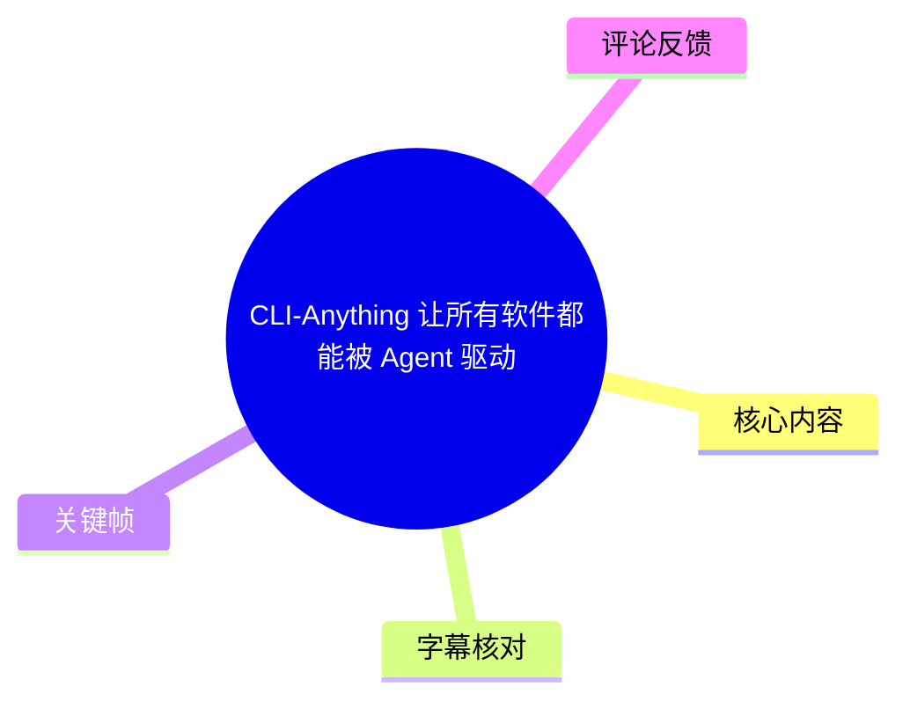
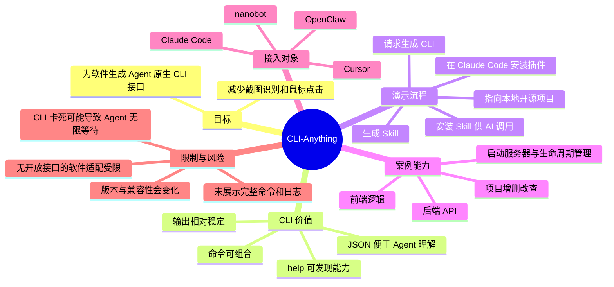
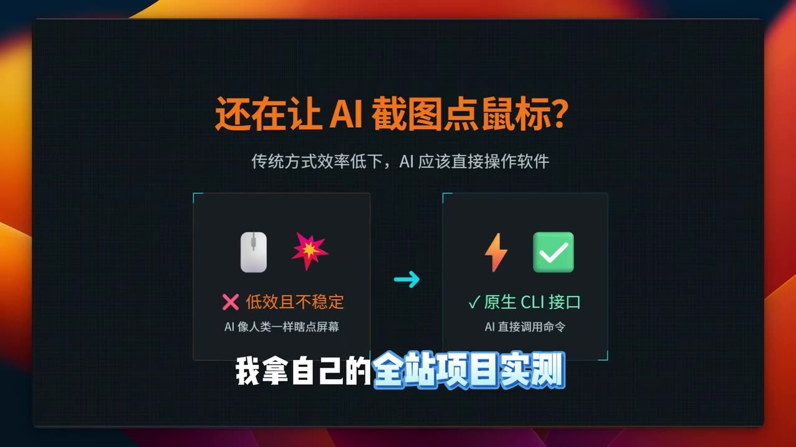
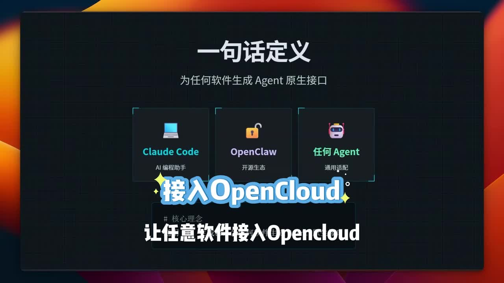
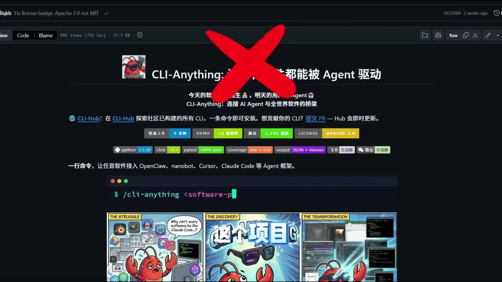
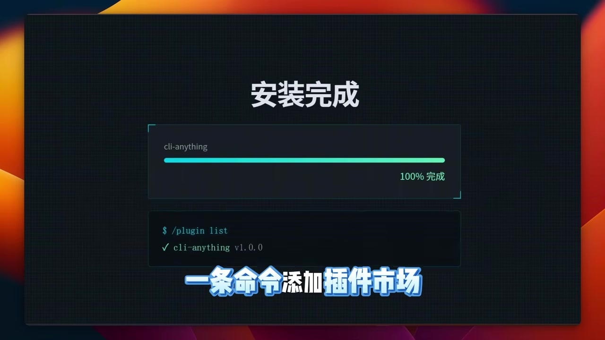

# CLI-Anything: 让所有软件都能被 Agent 驱动

> 来源：[Bilibili 视频](https://www.bilibili.com/video/BV1Xv5S6YEUK)<br>
> UP 主：徽杭天际AI｜时长：01:10｜标签：智能体、openclaw、CLI 命令行、工具

## 小结

视频介绍 **CLI-Anything**：其定位是为软件生成可被 Agent 调用的命令行接口（CLI），从而避免让 AI 依赖截图识别与鼠标点击来操作软件。视频将这种方式概括为“让任何软件变成 Agent 原生工具”。

核心演示是：在 Claude Code 中安装 CLI-Anything 插件后，向 Claude Code 提出将一个本地开源项目转换为 CLI 命令的要求。UP 主称，生成结果会将项目已有操作暴露为命令行能力，并同时生成可供 Agent 使用的 Skill；安装 Skill 后，AI 即可借由这些命令操作项目。

视频中的本地案例是一个具有项目“增、删、改、查”功能的开源项目。UP 主声称生成的 CLI 可覆盖后端 API、前端逻辑、服务器启动与生命周期管理，并可用 JSON 返回数据，降低 Agent 对非结构化界面内容的解析需求。上述覆盖范围为视频演示/陈述，素材中未提供生成代码、实际命令全文、接口清单或端到端执行日志，不能据此推断其对任意软件均可完整适配。

项目描述进一步阐述了选择 CLI 的理由：命令可组合、文本格式适配 LLM、跨平台且额外开销较低、`--help` 可用于能力发现、JSON 输出利于 Agent 读取，并强调 CLI 输出相对稳定。视频画面还列举 Claude Code、OpenClaw、nanobot、Cursor 等 Agent 框架或工具作为接入对象。

适合希望把**已有软件或项目能力以确定性命令暴露给 Agent**的开发者、自动化工作流设计者阅读。关键前提是软件本身必须存在可调用或可封装的操作路径；“任何软件”是项目宣传语，不代表已经验证了闭源、无接口、强交互式软件的普遍可用性。

时效性方面，视频元数据抓取于 2026-07-16，发布 Unix 时间戳换算为 2026-05-14；插件版本、支持的 Agent 框架、安装渠道和生成质量均可能随项目迭代变化，应以当时项目仓库与插件文档为准。

## 思维导图





## 目录

- [问题背景：从屏幕操作转向 CLI 接口](#问题背景从屏幕操作转向-cli-接口)
- [CLI-Anything 的定义与接入目标](#cli-anything-的定义与接入目标)
- [实操：将本地项目转换为 CLI](#实操将本地项目转换为-cli)
- [结果：CLI、JSON 与 Skill](#结果clijson-与-skill)
- [方法要点、参数与限制](#方法要点参数与限制)
- [字幕比对](#字幕比对)
- [评论分析](#评论分析)
- [处理记录](#处理记录)

## 问题背景：从屏幕操作转向 CLI 接口 [00:00:30](https://www.bilibili.com/video/BV1Xv5S6YEUK?t=30)

视频以“AI 还在靠截图点鼠标”为切入点，将两类软件操作路径进行对比：

| 路径 | 视频表达 | 对 Agent 的含义 |
| --- | --- | --- |
| 屏幕/鼠标自动化 | AI 像人一样根据截图点击界面，效率低且不稳定。 | 需要依赖视觉判断、界面元素位置和交互状态；界面变化可能影响执行。 |
| 原生 CLI 接口 | AI 直接调用命令。 | 可将操作写为结构化参数与标准输出，便于串联、复用和检查。 |



> 图：画面直接呈现“还在让 AI 截图点鼠标？”的提问，并将“低效且不稳定”的屏幕点击方式与“原生 CLI 接口”并列，是理解视频问题定义与方案方向的关键帧。

UP 主说自己以“全栈项目”进行实测。这里的“实测”仅能确认视频展示了该案例流程；素材没有给出项目地址、项目语言、运行环境、测试次数、失败案例或成功率，不能将它视为完整的性能或兼容性评测。

## CLI-Anything 的定义与接入目标 [00:00:30](https://www.bilibili.com/video/BV1Xv5S6YEUK?t=30)

### 一句话定义：为软件生成 Agent 原生接口

画面中的定义是“为任何软件生成 Agent 原生接口”，并以 Claude Code、OpenClaw 和“任何 Agent”作为潜在接入端。ASR 同时提到 nanobot、Cursor、Claude Code 等名称。



> 图：该帧写明“一句话定义：为任何软件生成 Agent 原生接口”，并列出 Claude Code、OpenClaw 与任何 Agent，直观说明工具位于“软件能力”与“Agent 调用”之间的接口层。

视频开头展示的项目页面还包含以下可见信息：

- 项目名称为 **CLI-Anything**；
- 项目页将其描述为连接 AI Agent 与全世界软件的探索；
- 画面提到 **CLI-Hub**：用于探索社区已构建的 CLI，并称可通过一条命令安装；
- 画面标注输出形式为 **JSON + Human**；
- 页面徽标可见 Python `>=3.10`、`click >=8.0`、`pytest 100% pass`、`coverage`、`Apache 2.0` 等字样。



> 图：项目页同时呈现 CLI-Hub、Agent 框架接入对象、`/cli-anything <software-p...` 形式的命令提示及“JSON + Human”标识，可作为视频所称项目定位与输出形态的画面依据。由于命令被截断，本文不补全其参数或语法。

### 为什么强调 CLI

视频描述区给出了选择 CLI 的六项理由，属于发布者提供的项目说明：

1. **结构化、可组合**：文本命令天然接近 LLM 的输入输出形式，可组合成工作流。
2. **轻量且通用**：宣称额外开销低、跨平台运行且不依赖额外环境。
3. **自描述**：可以通过 `--help` 让 Agent 发现功能。
4. **已有工程实践**：描述中以 Claude Code 大量经由 CLI 执行任务作为佐证。
5. **Agent 友好**：可输出结构化 JSON，减少额外解析。
6. **确定性与可靠性**：命令输出被描述为稳定一致，使 Agent 行为更可预测。

这些是项目主张，不等于对所有软件、所有平台或全部 Agent 环境的保证。尤其“轻量”“稳定”“无需额外环境”等表述仍取决于目标程序、权限、依赖和实现质量。

## 实操：将本地项目转换为 CLI [00:00:31](https://www.bilibili.com/video/BV1Xv5S6YEUK?t=31)

ASR 在 00:00:31—00:00:55 的连续片段中介绍了实操。可依素材还原的操作顺序如下。

### 1. 准备目标项目

UP 主称目标是“本地的一个开源项目”，且其功能包含对项目的“增、删、改、查”。素材未说明该项目的仓库地址、技术栈、数据库、API 定义或启动方式。

### 2. 在 Claude Code 安装 CLI-Anything 插件

UP 主表示先在 Claude Code 中安装 CLI-Anything 插件。画面明确展示“安装完成”、进度 `100% 完成`，以及插件列表中的 `cli-anything v1.0.0`。



> 图：该帧给出“安装完成”、`cli-anything v1.0.0` 和 `$ /plugin list` 的可见结果，是视频中对插件已安装状态最直接的画面证据。画面未展示实际安装命令，因此不能据此编写可直接复制的安装指令。

视频口播称过程包括“一条命令添加插件市场，再一条安装完成”。但提供的素材未保留两条命令原文，故仅记录流程，不虚构命令名、仓库地址或参数。

### 3. 向 Claude Code 提出转换请求

视频中的自然语言请求可概括为：

> 帮我把这个项目使用 CLI-Anything 做成 CLI 命令。

这里是让 Claude Code 基于已安装插件和当前项目上下文执行转换。视频未展示提示词的完整上下文、权限授予、工作目录、模型配置或等待时长。

### 4. 等待生成并检查结果

ASR 表示“运行成功后可以看到结果”，但未提供终端输出全文。UP 主称生成过程将项目中的操作“全都做成了 CLI 命令”，并生成 Skill。由于缺少生成目录、文件差异、命令帮助文本和测试记录，建议实际使用时至少检查：

1. 每个命令是否明确描述输入参数、默认值与错误码；
2. 危险操作（删除、写入、部署）是否要求确认或提供 dry-run；
3. JSON 输出是否有固定 schema，错误是否也以机器可读形式返回；
4. 命令是否能在非交互、超时和重试场景下正确退出；
5. 生成的 Skill 是否限定了可调用命令、权限边界与失败处理。

以上五项是基于 Agent 调用 CLI 的工程性检查建议，并非视频已展示的具体实现。

## 结果：CLI、JSON 与 Skill [00:00:55](https://www.bilibili.com/video/BV1Xv5S6YEUK?t=55)

UP 主在结尾提出三层结果：

| 结果层 | 视频陈述 | 可确定范围 |
| --- | --- | --- |
| CLI 化 | 将当前项目的操作转换成 CLI 命令。 | 已在口播中明确；未列出具体命令。 |
| JSON 返回 | 一条命令取回 JSON 数据，AI 可直接理解。 | 画面中的项目页有“JSON + Human”标识；未展示 JSON 示例与 schema。 |
| Skill 生成 | 自动“写好了 Skill”，安装后 AI 可操作软件。 | ASR 明确提及；没有给出 Skill 文件内容或安装命令。 |

视频还声称，转换后的 CLI 可使“所有后端 API、前端逻辑”成为命令行工具，并涵盖：

- 启动服务器；
- 管理生命周期；
- 获取 JSON 数据；
- 将项目操作交给 Agent。

应注意，“前端逻辑自动变为命令行工具”在工程上可能意味着对项目内部能力、自动化接口或已有业务流程进行包装；视频并未展示如何处理纯 GUI 行为、浏览器交互、鉴权弹窗、第三方服务限制或不可逆操作。因此，不能把这句话理解为已证明任意 UI 都可无损转换成 CLI。

### 可迁移的工作流结构

根据视频内容，可将其抽象为以下链路：

```text
目标软件/本地项目
        ↓
CLI-Anything 生成或封装命令接口
        ↓
CLI 命令 + 人类可读输出 / JSON 输出
        ↓
生成并安装 Agent Skill
        ↓
Claude Code、OpenClaw、nanobot、Cursor 等 Agent 调用
```

其中，视频实际演示的是“本地开源项目 + Claude Code + CLI-Anything 插件”的组合；对其他框架和软件类别的适配是项目宣传的目标范围，不是本视频逐一验证的结果。

## 方法要点、参数与限制 [00:00:55](https://www.bilibili.com/video/BV1Xv5S6YEUK?t=55)

### 素材中可确认的参数与环境信息

| 项目 | 可确认信息 | 说明 |
| --- | --- | --- |
| 视频时长 | 70 秒 | 实际媒体诊断时长为 69.75275 秒。 |
| ASR 模型 | `medium` | 本次中文 ASR 使用 CUDA、`float16`。 |
| ASR 语言 | 中文 | 语言概率为 `0.99951171875`。 |
| 语音覆盖 | 38.54 秒 / 55.25% | 语音从 00:00:30.350 开始，到 00:01:08.890 结束。 |
| 项目页可见版本 | `cli-anything v1.0.0` | 仅为关键帧所示插件列表版本，不代表当前最新版。 |
| 项目页可见运行要求 | Python `>=3.10`、click `>=8.0` | 来自画面徽标，未展示完整依赖锁定或安装方式。 |
| 输出形式 | `JSON + Human` | 画面表述，不含字段定义。 |
| 许可证 | Apache 2.0 | 项目页画面中可见。 |

### 实施时不可跳过的限制

1. **软件可调用性限制**：热评指出并非所有软件都有开放接口。即使工具能够生成 CLI，也仍需目标软件存在可被调用、分析或封装的能力；闭源、受权限限制、依赖复杂 GUI 流程的软件可能无法直接覆盖。
2. **生成质量未被完整展示**：视频没有提供生成前后的文件、命令列表、JSON schema、单元测试、错误处理策略或性能数据，不能验证“完整 CLI”的覆盖率。
3. **阻塞与超时风险**：CLI 若卡死，Agent 可能持续等待或在杀死进程后反复重试。实际工作流应设置超时、最大重试次数、可取消机制和非零退出码处理。
4. **权限与副作用风险**：将增删改查、服务器管理等操作暴露给 Agent 会扩大自动化权限边界。应最小化凭据、限制可执行命令，并对删除、发布、迁移等高风险操作加入确认。
5. **版本时效性**：视频画面所示 `v1.0.0`、支持框架与插件市场安装流程都可能改变。使用前应核验项目仓库、发布说明、CLI 帮助与兼容性文档。
6. **“任何软件”需审慎理解**：这是视频和项目的愿景式表述；基于现有素材，只能确认其展示了一个本地开源项目的转换过程。

## 字幕比对

| 字幕来源 | 完整性 | 专有名词 | 时间轴 | 主要问题 |
| --- | --- | --- | --- | --- |
| Bilibili 站内字幕 | 很低，仅有 00:00:07.700—00:00:22.370、00:00:34.120—00:00:41.980 的音乐标记 | 无法提供项目或框架名称 | 有真实 SRT 时间轴，但没有语义内容 | 字幕内容均为“♪ 音乐 ♪”，不能支撑正文转写。 |
| 本次 ASR 字幕 | 覆盖主要口播，语音覆盖 38.54 秒 | 存在多处误识别 | 有真实时间轴，00:00:30.350—00:01:08.890 | 仅分为 3 个超长句；个别词错误、断句不足；末尾时间略超 70 秒视频标称时长但仍在媒体诊断时长内。 |

最终以**本次 ASR 的真实时间轴**作为章节定位依据，并用关键帧文字和视频元数据校正专有名词；站内字幕只用于确认部分无口播区间存在音乐标记，不作为正文事实来源。ASR 诊断中**未标记** `noAudioStream=true`，且提供了可识别语音，因此本视频不是“无音轨”情形。

主要校正如下：

| ASR 原识别/表述 | 采用写法 | 校正依据 |
| --- | --- | --- |
| `CLI of Anything` / `CLIof Anything` | CLI-Anything | 视频标题、项目页关键帧。 |
| `agent填生工具` | Agent 原生工具 | 结合画面“一句话定义：为任何软件生成 Agent 原生接口”。 |
| `Open Cloud` | OpenClaw | 元数据标签 `openclaw`、关键帧中的 OpenClaw。 |
| `Cloud Code` | Claude Code | 关键帧和项目说明均指向 Claude Code。 |
| `项幕`、`项母` | 项目 | 中文 ASR 同音/分词错误。 |
| `增伸改差` | 增、删、改、查 | 结合上下文作出的语言纠正；视频未展示更细的功能定义。 |
| `Cloud运行成功` | Claude Code 运行成功 | 与前文“在 Claude Code 中安装插件并提出请求”的上下文一致。 |

## 评论分析

以下仅分析本次可获取的热评前三条；评论反映个人观点或使用体验，不作为已验证事实。

1. **sion醒了（9 赞）**：认为“不是所有软件都有开放接口”，质疑“让所有软件都能被 Agent 驱动”的普遍性。  
   - **补充价值**：指出目标软件是否有开放接口或可封装能力是核心前提。  
   - **与视频关系**：视频未展示无接口或闭源软件的适配，评论构成合理的边界提醒。  
   - **可信度判断**：该观点符合一般工程约束，但评论未提供具体失败案例，因此不能进一步量化限制范围。

2. **喻星星（0 赞）**：认为 CLI 卡死后 Agent 可能无限等待，杀死后还可能循环等待，造成时间浪费。  
   - **补充价值**：将关注点从“能否调用”推进到“调用失败如何收敛”，涉及超时、取消、重试上限和进程监管。  
   - **与视频关系**：视频只展示成功路径，未涉及卡死、异常返回或重试策略。  
   - **可信度判断**：这是常见自动化风险，但该评论没有指明 CLI-Anything 已实际发生该问题，不能认定为项目已知缺陷。

3. **SkillNerds（0 赞）**：询问项目“这么多 star 为什么下载量不多”。  
   - **补充价值**：提出社区关注度与实际安装/使用之间可能存在差异。  
   - **与视频关系**：视频未给出 star 数、下载量、统计来源或时间点。  
   - **可信度判断**：属于未附数据的疑问，不能据此判断项目热度、质量或采用率。

## 处理记录

- Worker ID：`worker-mrj0www4-e8d79408`
- 调用模型：`gpt-5.6-terra`
- ASR 模型与运行信息：`medium` / CUDA / `float16`；识别语言为中文，语言概率 `0.99951171875`。
- 使用的素材工具结果：已使用元数据、站内 SRT、`asr/asr-result.json`、`asr/transcript.srt`、热评 JSON 与提供的关键帧进行整理；未获得可验证的命令全文、项目仓库、生成文件或执行日志。
- 字幕选择：站内字幕仅含音乐标记，语义信息不足；采用本次 ASR 的时间轴与口播为主，并以关键帧、标题、标签和描述校正术语。已检查 ASR 诊断，未发现 `noAudioStream=true`。
- 关键帧选择依据：`frame-001` 用于项目定位、CLI-Hub 与可见技术标识；`frame-002` 用于“Agent 原生接口”定义与接入对象；`frame-003` 用于截图点击与 CLI 的问题对比；`frame-004` 用于插件安装完成和可见版本。其余关键帧路径虽在素材清单中列出，但未提供对应画面内容，未据此编造描述。
- 缓存清理：本次仅依据任务内已提供的素材生成文档，未执行或报告额外本地缓存清理；素材目录与相对图片路径保持不变。
- 未解决问题：CLI-Anything 的准确仓库地址、实际安装命令、完整参数、生成 CLI 的文件结构、JSON schema、Skill 内容、目标项目技术栈、支持软件范围与异常处理机制均未在素材中提供。
