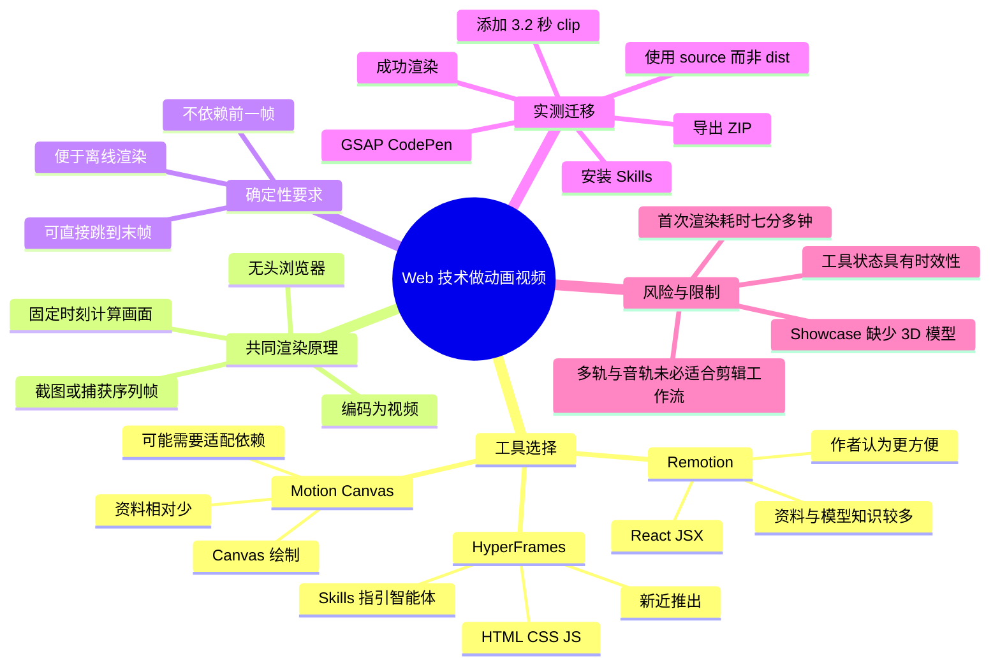
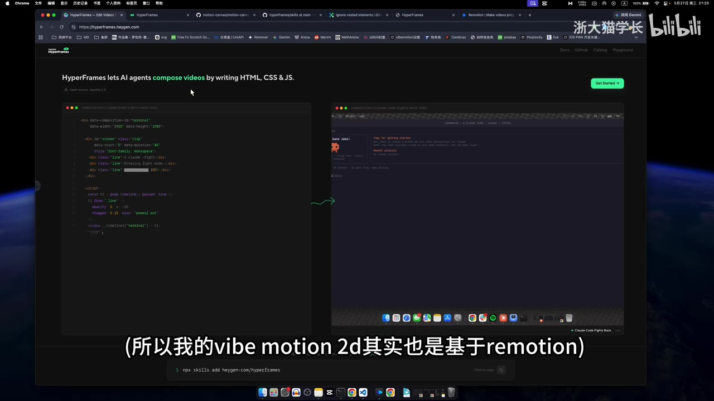
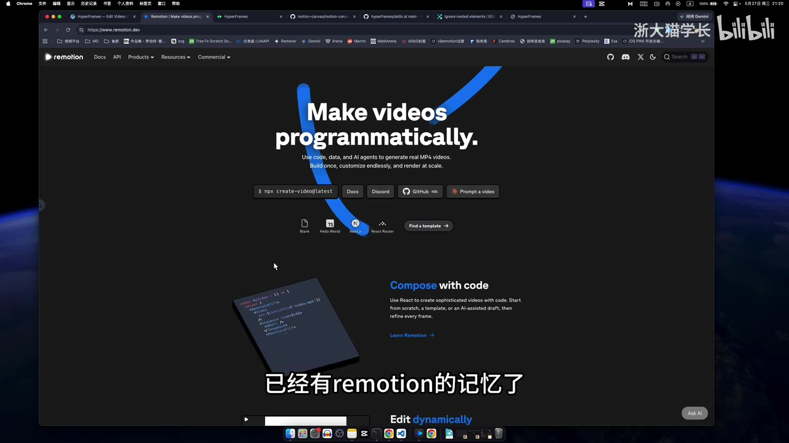
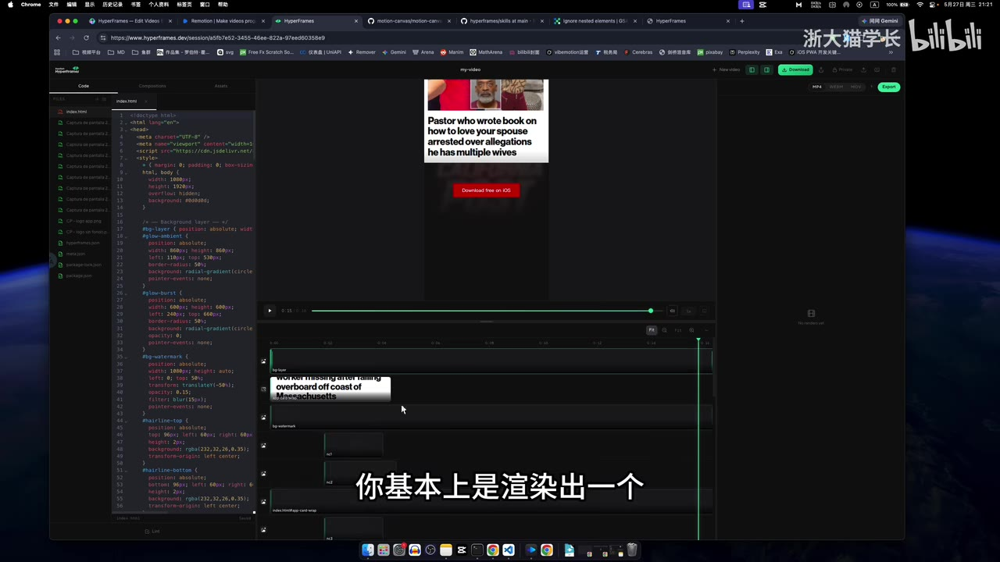
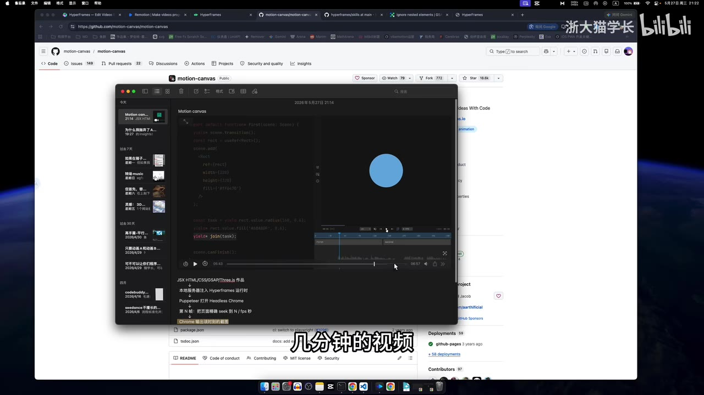

# hyperframes 对比 Remotion：Vibe Coding 做动画的选择与渲染原理

> 来源：[Bilibili 视频](https://www.bilibili.com/video/BV1urGU6XEWr)  
> UP 主：浙大猫学长｜时长：13 分 30 秒｜合集：AIcode  
> 本文中的“更方便”“鸡肋”“可以用”等判断，除特别注明外，均为视频作者基于当时版本的个人体验，不等同于独立基准测试结果。

## 小结

- 视频比较了新近推出的 **HyperFrames** 与已存在较久的 **Remotion**，讨论 AI/Vibe Coding 场景下如何用 Web 技术制作并导出动画视频。作者的直接结论是：在其使用体验中，HyperFrames **不如 Remotion 方便**；其自用的 WebMotion 2D 也基于 Remotion。
- 作者认为 Remotion 的重要优势不只是框架能力，还包括其历史更长、公开资料较多，因此大模型训练语料中已有更多相关知识。相对地，HyperFrames 在视频录制时约推出一个月，往往需要安装其面向智能体的 `skills`／工作流指引，才能帮助模型更稳定地调用相关动画技术。
- 二者的底层视频生成思路被作者概括为相近：在无头浏览器中渲染网页代码，按帧截图或捕获，最后编码为视频。关键约束是**真确定性**：任意时间点的画面应可直接计算，不能依赖动画播放过程中的前一帧状态。
- HyperFrames 的界面提供多轨、代码编辑、预览、导出和音轨等能力；但作者的实际工作流仍是先渲染单个动画片段，再进入剪映、Adobe Premiere Pro（PR）等工具剪辑，因而认为内置多轨和音频轨的实用价值有限。
- 对 Motion Canvas，视频的看法是：其可用代码完成完整动画视频，但项目资料相对少、维护状态与依赖更新会增加使用门槛；它以 Canvas 为主要绘制区域，与 HyperFrames、Remotion 所用的 HTML 页面渲染路径存在区别。
- 视频实测了一个迁移任务：从 GSAP 的 CodePen 示例导出 ZIP、复制源码至本地项目，再让安装了 HyperFrames Skills 的智能体改造成可渲染动画。首次因时长为 0 秒失败；智能体通过添加一个贯穿 **3.2 秒**的 clip 容器避免空视频后，成功还原了大致的下落效果。整个过程耗时“**七分多钟**”。
- 时效性要特别注意：视频内容反映的是 2026-05-27 左右作者访问到的 HyperFrames 官网、Showcase、Skills 和依赖状态。HyperFrames 是快速演进的软件，示例资源完整性、安装内容、渲染行为及性能均可能已改变。

## 思维导图




## 目录

- [背景：为什么比较 HyperFrames 与 Remotion](#背景为什么比较-hyperframes-与-remotion)
- [作者结论：Remotion 的便利性与模型知识优势](#作者结论remotion-的便利性与模型知识优势)
- [多轨界面、剪辑工作流与 Motion Canvas](#多轨界面剪辑工作流与-motion-canvas)
- [渲染技术：无头浏览器与真确定性](#渲染技术无头浏览器与真确定性)
- [Showcase 排查：3D 手机示例缺失模型](#showcase-排查3d-手机示例缺失模型)
- [Skills 的定位与可覆盖的动画技术](#skills-的定位与可覆盖的动画技术)
- [实操：将 GSAP CodePen 动画迁移并渲染](#实操将-gsap-codepen-动画迁移并渲染)
- [经验、限制与工具选择建议](#经验限制与工具选择建议)
- [关键帧索引](#关键帧索引)
- [字幕比对](#字幕比对)
- [评论分析](#评论分析)
- [处理记录](#处理记录)

## 背景：为什么比较 HyperFrames 与 Remotion [00:00](https://www.bilibili.com/video/BV1urGU6XEWr?t=0)

视频讨论的不是传统剪辑软件的逐项功能评测，而是一个更具体的问题：在 AI 辅助编程、Vibe Coding 的语境下，如何把 HTML、CSS、JavaScript 或 React 动画变为可交付的视频。

作者开场将 HyperFrames 作为这一领域“新来的朋友”介绍，并表示其由 **Hegyon** 推出；这一名称可由画面中官网域名 `hyperframes.hegyon.com` 辅助确认。视频随后以 Remotion 为主要对照，并穿插 Motion Canvas、GSAP、Anime.js、Lottie、Three.js、Tailwind CSS 等生态工具。



> 图：该画面直接展示 HyperFrames 对“AI agents + HTML/CSS/JS 视频创作”的产品定位，是理解视频比较范围的关键：它关注的是代码驱动的视频生成，而非一般意义上的时间线剪辑。

### 前置概念

| 概念 | 视频中的含义 |
| --- | --- |
| Vibe Coding | 借助大模型或智能体，以自然语言驱动代码生成、修改和调试的编程方式。 |
| 有头浏览器 | 有可视窗口、可直接看到页面的浏览器运行方式。 |
| 无头浏览器 | 在后台运行、通常用于自动化测试或批量渲染的浏览器运行方式。 |
| 真确定性 | 给定时间点即可直接得到该时刻画面，结果不需要从第一帧开始播放累积。 |
| 序列帧 | 视频被拆成一帧一帧的静态图像后再编码的中间结果。 |
| clip 容器 | 视频中用于承载一段具有明确时长的画面或动画的时间段对象；本次实测中需要它保证输出不为空。 |

## 作者结论：Remotion 的便利性与模型知识优势 [00:07](https://www.bilibili.com/video/BV1urGU6XEWr?t=7)

作者在 [00:00:07](https://www.bilibili.com/video/BV1urGU6XEWr?t=7) 给出明确判断：**HyperFrames 在使用上不如 Remotion 方便。** 这也是作者选择让 WebMotion 2D 基于 Remotion 的原因。



> 图：画面显示 Remotion 的“用程序制作视频”定位，佐证其与 HyperFrames 属于相近问题域，但技术栈和生态成熟度不同。

作者提出的核心理由如下：

1. **Remotion 出现得更早。**  
   作者称 Remotion 的代码仓库在 ChatGPT 出现之前已经存在，因此公开资料、示例和讨论沉淀较多。

2. **大模型对 Remotion 的既有知识较丰富。**  
   作者的推论是，由于 Remotion 已存在较长时间，它更可能进入模型训练语料；因此，使用模型编写 Remotion 时，通常不必额外安装专门的 Skills，模型已有较多先验知识可以利用。  
   这是一种基于训练资料可得性的工程经验，并非对任何模型、任何版本均成立的保证。

3. **HyperFrames 更依赖显式工作流提示。**  
   作者称 HyperFrames 在视频录制时刚推出约一个月，模型原生掌握的资料有限，故需要向智能体提供其 Skills／规范文档，以补充框架用法、动画库处理方式和渲染约束。

4. **表面栈不同，但输出目标相近。**  
   作者将二者的浅层差异概括为：HyperFrames 偏向普通 HTML，Remotion 基于 React，采用 JSX 语法。二者最终都要将代码生成的动态画面稳定地导出为视频。

> **时效说明**：关于“推出约一个月”、模型是否“内置记忆”、哪个框架资料更多，均为作者在录制当时的表述。模型版本、训练截止时间、检索能力与工具生态改变后，这些判断可能不再成立。

## 多轨界面、剪辑工作流与 Motion Canvas [00:47](https://www.bilibili.com/video/BV1urGU6XEWr?t=47)

HyperFrames 提供多轨时间线界面，支持在项目中组织视觉层、音频层及其他元素。作者认为这种界面看起来像多种工具能力的组合，并将其多轨形态与 Motion Canvas 联系起来。



> 图：画面可见左侧代码、上方预览、下方多轨时间线以及导出选项。它说明 HyperFrames 不只是命令行渲染器，也试图提供可视化编排环境。

### 作者实际采用的剪辑链路

作者描述了自己在当年制作视频时的典型流程：

1. 先用代码渲染出一个动画视频片段；
2. 再将片段导入剪映、PR 等工具；
3. 在后续剪辑工具内完成拼接、剪辑和音频处理。

因此，虽然 HyperFrames 支持音频轨道，作者仍认为其对自己的流程“比较鸡肋”。这里的关键不是音频轨道没有价值，而是：

- 如果最终仍要进入专用剪辑软件，代码动画工具中的多轨剪辑能力可能重复；
- 音频、旁白、配乐、混音通常要与整支视频统一处理；
- 对于只需批量生成可插入片段的创作者，稳定导出单段成片往往比内置编辑器更重要。

### Motion Canvas：能力与门槛

在 [00:01:11](https://www.bilibili.com/video/BV1urGU6XEWr?t=71) 至 [00:02:07](https://www.bilibili.com/video/BV1urGU6XEWr?t=127) 的演示中，作者展示了 Motion Canvas 相关项目和由代码制作的完整视频案例。



> 图：该画面把项目代码仓库与动画编辑界面并置，帮助理解作者所说“数分钟视频中的画面都可由代码生成”。

作者对 Motion Canvas 的归纳：

- 它可以以代码生成完整的数分钟动画视频；
- 作者称示例项目即使已不再维护，仍可运行并查看完整视频和代码；
- 但受库更新影响，旧项目可能需要“魔改”才能重新跑通；
- 相关资料较少时，大模型理解不足，更容易生成错误代码；
- 其绘制依赖浏览器页面内的 **Canvas**，而不是整个 HTML 页面。

这一段并未否认 Motion Canvas 的能力，而是强调其在“让智能体直接生成并稳定修改动画”这一目标上的资料与兼容性成本。

## 渲染技术：无头浏览器与真确定性 [02:25](https://www.bilibili.com/video/BV1urGU6XEWr?t=145)

作者在 [00:02:25](https://www.bilibili.com/video/BV1urGU6XEWr?t=145) 开始解释 HyperFrames 与 Remotion 的共同原理：**使用无头浏览器渲染代码，再把逐帧画面编码为视频。**

### 渲染链路

视频中描述的链路可整理为：

```text
HTML / CSS / JS 或 React / JSX 动画代码
                ↓
        无头浏览器后台加载
                ↓
      在指定时间点计算页面状态
                ↓
       自动截图或捕获每一帧
                ↓
           得到图像序列帧
                ↓
     编码为目标格式的视频文件
```

作者说明，平时在屏幕上打开网页、可以看到页面运行的是“有头浏览器”；而无头浏览器在后台运行，自动化测试就是常见使用场景。视频渲染则复用了这类自动化浏览器能力。

### 为什么必须“真确定性”

作者所说的“真确定性”可理解为：对于时间 `t`，渲染器应能直接计算画面 `Frame(t)`，而无需按照 `0 → 1 → 2 → … → t` 的顺序播放。

可将目标抽象为：

```text
Frame = render(时间 t, 固定输入数据, 固定配置)
```

而应避免：

```text
Frame(t) 依赖 Frame(t - 1) 的运行时状态
```

作者以 GSAP、Anime.js 等前端动画库说明：网页动画通常会随着时间推进逐帧计算，并且可能依赖前一帧状态；但离线视频渲染器必须支持直接拖到最后一帧，仍能准确知道此刻的画面。

这项约束带来的实际意义包括：

- 可以并行渲染不同时间点；
- 可以任意跳转预览；
- 重渲单帧时不需要回放完整动画；
- 避免帧率、机器性能、计时偏差造成输出不一致。

作者认为 HyperFrames 与 Remotion 都需要满足这一共同要求。

## Showcase 排查：3D 手机示例缺失模型 [04:09](https://www.bilibili.com/video/BV1urGU6XEWr?t=249)

作者进入 HyperFrames 官网右上角的 Playground，并查看其中的 Community／Showcase 内容。该区域允许上传和发布项目，但作者明确表示自己尚未亲自验证发布功能。

在一个视觉上较炫的 3D 手机示例中，作者发现预览无法正常显示。作者没有停留在“网页端有 Bug”的表面判断，而是继续下载示例工程并检查代码。

### 排查过程与结果

1. 在 Playground／Community 中打开 3D 手机展示案例；
2. 发现案例不能正常预览；
3. 下载该示例的完整工程；
4. 通过 Codex 辅助检查代码及资源引用；
5. 发现代码尝试从 `models` 文件夹加载 iPhone 的 `.glb` 文件；
6. 该 3D 模型文件缺失，导致后台报错；
7. 代码中可见 `GLTFLoader`，进一步表明示例依赖 GLTF/GLB 资源加载。

作者由此认为，Showcase 中有不少案例存在类似资源缺失问题。这里的结论应限定为：**视频录制时作者所检查的若干案例存在资源不完整或无法预览的现象**，不能据此推断所有 HyperFrames 项目都无法使用。

### 可复用的示例类型

作者也展示了不依赖缺失 3D 模型的案例。对于以矢量图形为主的示例：

- 下载后可正常运行；
- 画面中定义的 `path` 本质上接近 SVG 路径；
- 可见画面元素均有对应代码；
- 可在原项目基础上修改而非从零编写。

这也是代码动画的实用优势：若示例资源完整，开发者可以复用其布局、SVG、时间控制和视觉结构。

## Skills 的定位与可覆盖的动画技术 [07:02](https://www.bilibili.com/video/BV1urGU6XEWr?t=422)

作者打开 HyperFrames 的开源页面及 **HyperFrames Skills**。视频中的核心观点是：安装 Skills 本质上不是只安装一个名称为 HyperFrames 的功能，而是为智能体提供与多种技术配套的指导或工作流信息。

视频中明确提到的相关技术包括：

| 技术/工具 | 作者在视频中的说明 |
| --- | --- |
| HyperFrames | 本次讨论的代码视频工具及其 Skills。 |
| Lottie | 一类动画技术／动画库。 |
| GSAP | 很有名的前端动画库，也是后续实测迁移来源。 |
| Anime.js | 很有名的前端动画库。 |
| Three.js | 常见的 3D 技术栈。 |
| Tailwind CSS | 模块化、工具类风格的 CSS 方案。 |

作者强调，这些指引主要面向**智能体**，而非普通用户必须阅读的文档；人类用户当然也可以查看。其预期作用是让智能体知道：

- 如何识别和处理不同动画库；
- 如何遵守 HyperFrames 的数据模型；
- 如何避免渲染出空视频；
- 如何输出便于校验的结果或快照。

作者同时指出，Remotion 在当时暂未提供同类的 HyperFrames Skills 机制。这是产品形态差异，不代表 Remotion 无法通过其他文档、模板或提示词被智能体使用。

## 实操：将 GSAP CodePen 动画迁移并渲染 [09:17](https://www.bilibili.com/video/BV1urGU6XEWr?t=557)

这一部分是视频最具体的操作演示。作者试图验证：安装官方指引后，智能体能否较容易地把 GSAP Showcase 中的网页动画改造成 HyperFrames 动画并渲染。

### 操作步骤

#### 1. 新建测试目录 [08:16](https://www.bilibili.com/video/BV1urGU6XEWr?t=496)

作者新建文件夹，命名思路为 `GSAP HyperFrame Test`，用于隔离本次验证项目。

#### 2. 安装 HyperFrames Skills [08:43](https://www.bilibili.com/video/BV1urGU6XEWr?t=523)

作者在演示开始前尚未安装 Skills，随后执行安装。视频中可见其一次性安装了多个 Skills，并确认它们装在**本地目录**，作者认为这一点“没问题”。

> 视频未完整展示可复制的安装命令，因此本文不补写或猜测命令。实际安装方式应以当时 HyperFrames 官方文档为准。

#### 3. 从 GSAP 官网打开 CodePen 示例 [09:13](https://www.bilibili.com/video/BV1urGU6XEWr?t=553)

作者前往 GSAP 官网，选择一个希望复现的动画效果，并进入对应 CodePen 页面。

#### 4. 导出源码 ZIP [09:29](https://www.bilibili.com/video/BV1urGU6XEWr?t=569)

在 CodePen 中依次执行：

1. 点击 `Export`；
2. 点击 `Export .zip`；
3. 下载示例压缩包；
4. 解压。

#### 5. 复制示例文件进入测试项目 [09:39](https://www.bilibili.com/video/BV1urGU6XEWr?t=579)

作者将解压后的文件夹复制到 HyperFrames 测试目录中，以便让智能体在原始示例基础上改造。

#### 6. 优先使用 source 而非 dist [10:05](https://www.bilibili.com/video/BV1urGU6XEWr?t=605)

作者特别解释：

- `dist` 是 `distribution` 的缩写；
- 其中往往是已压缩、已构建后的产物；
- 本次应使用 `source` 中的源码来改造。

这是实践中重要的一点：若让智能体直接编辑压缩产物，不仅可读性低，也不利于维护和调试。

#### 7. 请求智能体改造成 HyperFrames 动画并渲染 [10:19](https://www.bilibili.com/video/BV1urGU6XEWr?t=619)

作者向智能体提出“改造成 HyperFrames 动画并渲染”的要求，并观察其是否读取了 HyperFrames 和 GSAP 的工作流说明。画面显示智能体确实读取了相关工作流。

#### 8. 处理首次“0 秒视频”失败 [11:22](https://www.bilibili.com/video/BV1urGU6XEWr?t=682)

首次渲染显示视频时长为 **0 秒**。智能体给出的处理思路是：当前版本只能根据带时间信息的 clip 计算合成时长，因此为主画面添加一个贯穿全程的 clip 容器，以避免输出空视频。

视频中给出的关键参数为：

| 参数 | 值 | 作用 |
| --- | ---: | --- |
| 主画面 clip 时长 | **3.2 秒** | 为合成提供明确时长，防止渲染为空视频。 |

这一问题揭示出 HyperFrames 数据模型的一个实际限制：动画“看起来存在”不等于渲染器已经获得可用于合成的时间轴时长，必须显式满足其 clip 时长规则。

#### 9. 等待重渲染并检查结果 [11:53](https://www.bilibili.com/video/BV1urGU6XEWr?t=713)

修改后渲染成功。作者查看结果，与原版对照后认为：

- 动画加入了一些额外内容；
- 后续样式仍可调整；
- 核心的“下落”效果已基本还原；
- 所以 HyperFrames “还是可以用”。

### 实测结果与性能

作者表示，从操作到渲染完成总共花了“**七分多钟**”。需要谨慎解释这个数值：

- 它是一次包含下载、复制、调用智能体、首次失败、修复和再次渲染的端到端演示耗时；
- 视频未给出硬件、模型调用延迟、网络条件、帧率、分辨率、编码器配置、纯渲染时长等细节；
- 因而不能把“七分多钟”视为 HyperFrames 固定的单次渲染性能指标。

## 经验、限制与工具选择建议 [12:32](https://www.bilibili.com/video/BV1urGU6XEWr?t=752)

### 可迁移经验

1. **先判断目标是“动画片段生产”还是“完整视频剪辑”。**  
   如果主要任务是量产可插入剪辑软件的动画片段，代码渲染器重点应放在稳定、可重复、可控导出；不必为了内置多轨而改变整体工作流。

2. **网页动画迁移前先检查确定性。**  
   GSAP、Anime.js 等网页动画并非天然适合离线逐帧渲染。应确保任意帧由固定时间值驱动，避免依赖前一帧、实时计时器或不可复现的状态。

3. **迁移示例时优先获取源码。**  
   应优先编辑 `source` 而不是 `dist`，并保留原始示例作为对照，以便验证视觉还原程度。

4. **将“视频时长”设为显式数据。**  
   本次 0 秒视频问题说明：项目必须有能被渲染器识别的时间范围。对于没有明确时间轴对象的网页动画，应显式配置总时长或贯穿全程的 clip。

5. **资源完整性是 Showcase 的前置检查项。**  
   3D 项目尤其要检查模型、纹理、字体、图片、音频等外部资源是否被一并下载和正确引用。看到炫酷预览不代表项目可复现。

6. **为智能体提供结构化约束有实际价值。**  
   作者认可 HyperFrames Skills 中的规范、快照和校验思路：在模型上下文有限或容易遗漏约束时，把渲染规则写成显式工作流可减少试错。

### 作者对未来模型上下文的判断

作者在结尾提到，若未来大模型拥有足够长的上下文，HyperFrames 的规范可能很有价值；同时他认为上下文过长可能导致模型“降智”。这是对模型行为的个人观察，不是视频中经过实验验证的技术定律。

作者还提到，Skills 中似乎包含“校验快照”之类的规范，使用户可通过一张或少量图了解动画大致状态。视频未展示该规范的完整字段、实现代码或具体截图数量，因此只能确认其存在相关指导思路，不能据此推定完整校验协议。

### 选择建议

| 场景 | 基于视频内容的倾向 |
| --- | --- |
| 希望让大模型直接生成 React 视频、依赖成熟资料与社区知识 | 作者更倾向 Remotion。 |
| 希望使用 HTML/CSS/JS 代码动画，且愿意遵循面向智能体的工作流约束 | 可尝试 HyperFrames。 |
| 希望将成熟 GSAP 示例快速转成可导出视频 | HyperFrames Skills 演示显示具备可行性，但应预留调试时间。 |
| 希望制作涉及大量剪辑、配音、混音的长视频 | 作者仍建议渲染片段后交给剪映、PR 等工具处理。 |
| 需要 3D 展示模板 | 应先验证模型及资源是否完整，不能仅依据 Showcase 外观判断。 |
| 打算使用 Motion Canvas | 需接受 Canvas 路线、资料较少和可能的依赖适配成本。 |

## 关键帧索引 [00:00](https://www.bilibili.com/video/BV1urGU6XEWr?t=0)

| 关键帧 | 正文位置 | 画面价值 |
| --- | --- | --- |
|  | [背景](#背景为什么比较-hyperframes-与-remotion) | 直观确认 HyperFrames 的 AI Agent、HTML/CSS/JS 定位及官网环境。 |
|  | [作者结论](#作者结论remotion-的便利性与模型知识优势) | 展示 Remotion“程序化制作视频”的产品方向，便于理解两者对照基础。 |
|  | [多轨界面](#多轨界面剪辑工作流与-motion-canvas) | 可见代码、预览和多轨时间线共存，是讨论其编辑器能力及作者工作流取舍的直接依据。 |
|  | [Motion Canvas](#多轨界面剪辑工作流与-motion-canvas) | 说明代码仓库、动画界面与代码生成视频之间的关系。 |

## 字幕比对 [00:00](https://www.bilibili.com/video/BV1urGU6XEWr?t=0)

本次同时检查了站内字幕与 ASR 结果。ASR 诊断中**未标记** `noAudioStream=true`，且识别到约 602.68 秒语音、语音覆盖率约 74.42%，因此可确认源视频存在音轨；ASR 的主要问题不在于无音频，而在于首段识别从 00:00:30.660 才开始，以及长段合并和专有名词误识别。

| 字幕来源 | 完整性 | 专有名词 | 时间轴 | 主要问题 |
| --- | --- | --- | --- | --- |
| Bilibili 站内字幕 | 覆盖 00:00:00—00:13:29，整体完整 | 存在误写，如“emotion”“apple frames”“黑警” | 分段细，起止时间完整，可直接使用 | 个别术语、英文名、口语断句不准确。 |
| 本次 ASR（large-v3-turbo） | 有效语音约 602.68 秒；首段缺失约前 30.66 秒 | 误识别较多，如 `ChatGBT`、`GSUB`、`Apple Frames`、`iPhone.jlb` | 有时间戳，但常以约 24 秒长段聚合 | 时间粒度粗，部分词出现乱码或同音误识别，且存在 3 个较大静音/未识别间隔。 |

### 最终字幕选择与校正方式

本文以**站内 SRT 的时间轴**作为章节链接依据，因为其从 0 秒开始覆盖完整视频、分段粒度更适合定位；以本次 ASR 用于交叉核对音轨存在、语义内容和时间覆盖情况。

根据站内字幕、ASR、视频语境及关键帧中的网页文字，对重要术语作如下规范化：

| 原始字幕/ASR 写法 | 本文采用写法 | 校正依据 |
| --- | --- | --- |
| emotion / REMOTION / Motion 基硕 | Remotion | 视频主题、官网画面及上下文均指向 Remotion。 |
| type frames / apple frames / HyperFrame | HyperFrames | 视频标题、官网画面及项目名称。 |
| 黑警 / 黑井 | Hegyon | HyperFrames 官网画面中的域名 `hyperframes.hegyon.com`。 |
| GSUB / G SUB / JSAP | GSAP | 作者随后访问 GSAP 官网及 CodePen。 |
| animal jazz / AnimeJS | Anime.js | 常见前端动画库名称，且站内字幕接近该拼写。 |
| iPhone.jlb | iPhone `.glb` 模型 | 作者说明这是 3D 模型，且画面语境为 GLTF Loader；本文仅修正文件扩展名表述。 |
| Steal | Skills | 前后文均在讨论安装 HyperFrames Skills。 |
| sources / sauce | source | 作者明确对比 `dist` 与 `source`。 |

## 评论分析 [00:00](https://www.bilibili.com/video/BV1urGU6XEWr?t=0)

以下仅处理素材中可获取的热评前三条，按点赞数排序。评论是个人观点，不作为已验证事实。

1. **秋裤_武装突袭｜28 赞**  
   - 观点：认为 HyperFrames 看起来强大，但与使用 AE 表达式做动画处在类似层级；高要求动画可能不够精细，而自媒体创作者使用 Remotion 可能已经足够。  
   - 补充价值：提出了视频未展开的评估维度——**动画精细度上限**与专业动效软件能力的差距。  
   - 可信度与限制：这是用户主观经验，未提供具体项目、精细度标准或对照样片，不能据此判定 HyperFrames 的能力上限。

2. **吟游诗人Robin｜19 赞**  
   - 观点：评论内容基本复述了视频标题，强调“不必焦虑，自己用 Puppeteer 做渲染器也行”。  
   - 补充价值：呼应了视频的底层技术观点：代码视频渲染的核心可拆为浏览器渲染、逐帧捕获与编码，未必必须依赖某一个完整框架。  
   - 可信度与限制：评论没有提供实现步骤或项目结果；“自己做渲染器都行”应理解为技术可行性，不等于工程成本、可靠性和维护成本都低。

3. **苏米老师ooooyasumi｜13 赞**  
   - 观点：该用户原本常用 HyperFrames，认可 UP 主讲解更专业，认为视频提供了与一般 Vibe Coding 不同的分析。  
   - 补充价值：说明 HyperFrames 已有实际使用者，且视频对熟悉该工具的用户也有参考价值。  
   - 可信度与限制：未说明具体使用规模、版本、项目类型或遇到的问题，无法据此反推工具稳定性或适用范围。

## 处理记录 [00:00](https://www.bilibili.com/video/BV1urGU6XEWr?t=0)

- Worker ID：`worker-mrj0wjed-b0c290ad`
- 整理模型：`gpt-5.6-terra`
- 已检查素材：视频元数据、站内字幕 `p01-ai-zh.srt`、本次 ASR 结果 `asr/asr-result.json` 与 SRT、热评数据、提供的关键帧。
- ASR 模型：`large-v3-turbo`；识别语言：中文；设备：CUDA；计算类型：`int8_float16`。
- 字幕选择：以站内 SRT 的完整分段时间为时间轴主依据；本次 ASR 用于交叉校验。未发现 `noAudioStream=true`，故未采用“无音轨”处理路径。
- 关键帧选择依据：优先选取能够直接展示 HyperFrames 官网定位、Remotion 官网定位、HyperFrames 多轨编辑器和 Motion Canvas 代码动画环境的画面；它们分别支撑产品定位、工具对比、工作流与技术背景，不用装饰性画面替代证据。
- 缓存清理：本任务仅基于提供的素材文本与关键帧路径进行整理，未执行额外下载、转码、文件生成或缓存写入；无新增缓存需要清理。
- 未解决问题：
  - 视频未给出 HyperFrames、Remotion 的版本号、具体安装命令、帧率、分辨率和编码参数，本文未补充猜测值。
  - 作者提到部分 Showcase 缺失资源，但未枚举所有受影响案例，无法量化问题范围。
  - “七分多钟”为端到端演示耗时，缺乏硬件与纯渲染阶段数据，不能用于性能横向结论。
  - 热评只提供前三条，未扩展到其他评论或弹幕。

## 评论分析

- 热评 1：看起来很强大，不过和用AE表达式做动画一个重量级的，要求高的动画这个肯定不够精细，自媒体人remotion好像就够了
- 热评 2：标题：hyperframes对比remotion，vibe做动画哪家强？结论是无需焦虑，你自己用puppeteer做一个渲染器都行
- 热评 3：本来常用hyperframe，感谢up的讲解，确实是专业的和其他只会vibe的人不一样

以上内容是观众反馈摘录，只用于补充理解视频反响，不作为正文事实依据。
