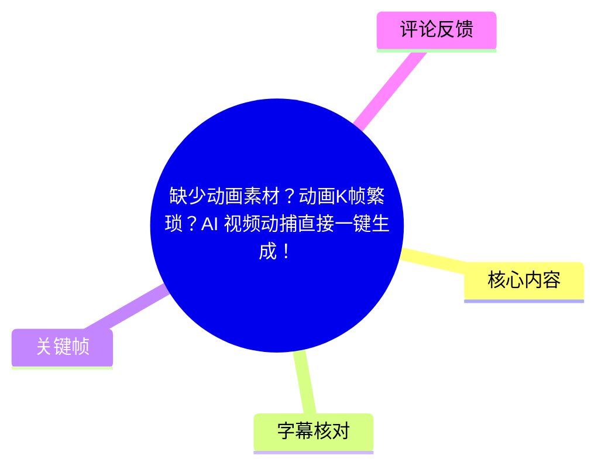
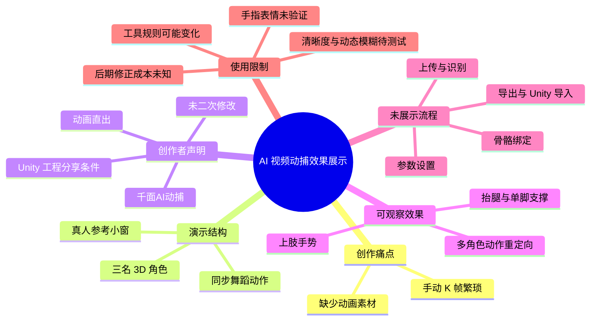
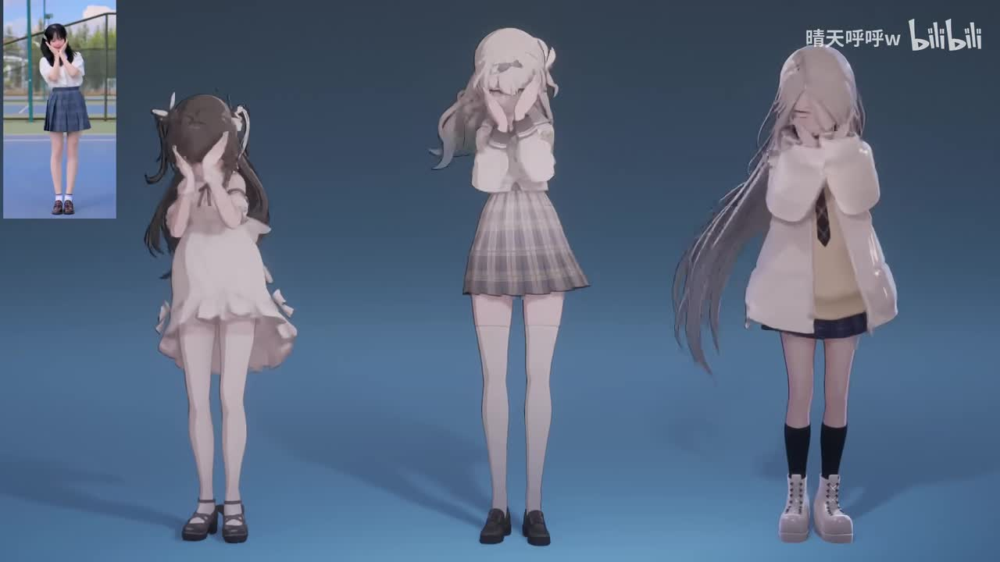
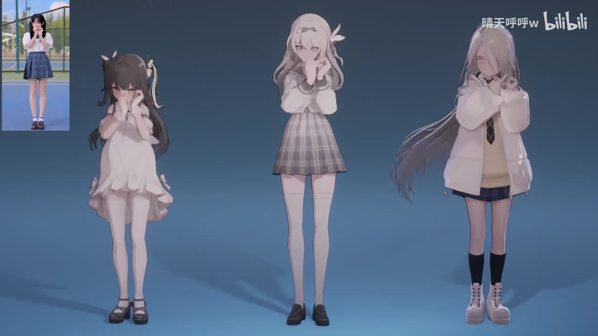
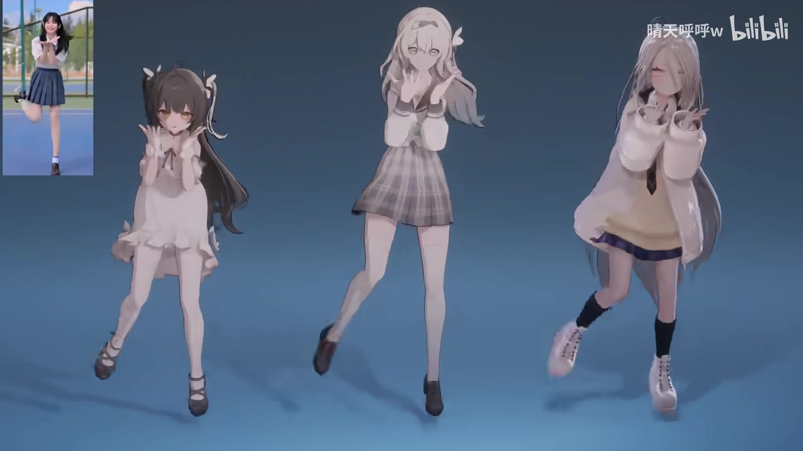
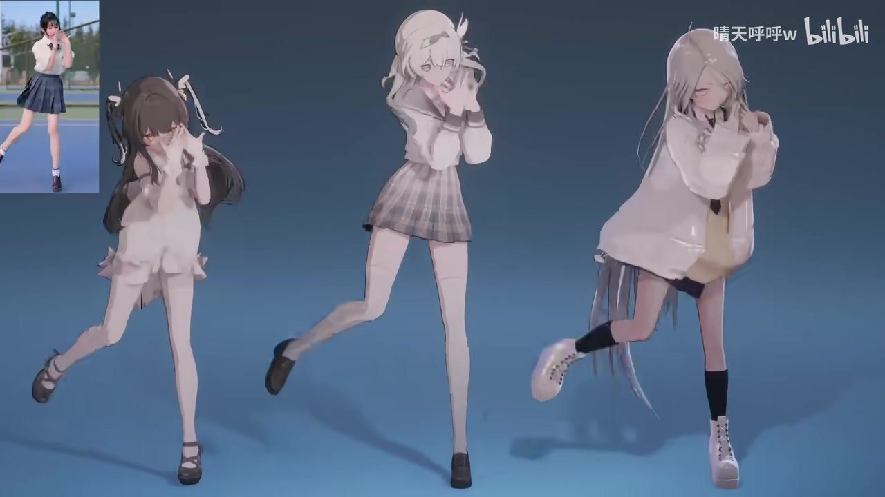

## 小结

这是一条时长约 64 秒的效果展示视频，主题是以“千面AI动捕”将真人舞蹈视频中的人体动作映射到 3D 角色，回应“缺少动画素材”“手动 K 帧繁琐”的动画制作痛点。视频没有口播教学或工具操作录屏，主要由音乐、真人动作参考小窗和三名 3D 角色的同步演示构成。

画面可确认的核心效果是：左上角真人参考人物做出遮脸、手部靠近面部、抬腿与单脚支撑等舞蹈动作时，画面中央的三名不同外观角色呈现大体相近的全身动作节奏与姿态。创作者在简介中声明，视频中的动画是“千面AI动捕直出，没有二次修改”；这是 UP 主自述，不等同于对所有输入素材、角色资产或使用条件下效果的保证。

视频简介还提供了工具入口 `https://www.qmai.vip?code=huhu66&type=video`，并称“此 Unity 完整工程点赞破 500 免费分享”。前者链接中的参数含义、功能与权益没有在素材中说明；后者是条件式承诺，现有素材无法确认工程是否已经公开。

本片适合作为“视频动捕可用于快速生成角色舞蹈基础动作”的案例参考，尤其适用于 MMD、Unity 或角色动画创作中的动作草稿阶段。但视频未展示上传、识别、导出、骨骼重定向、Unity 导入、参数配置或修正流程，亦不足以验证手指、表情、遮挡、动态模糊、脚部接触、节拍对齐和复杂镜头下的稳定性。

信息具有时效性：视频元数据发布时间为 2025-11-14，本次素材抓取时间为 2026-07-15。工具页面、功能范围、价格、邀请码、导出规则及工程分享状态都可能变化，应以官方当前信息和实际小样测试为准。

## 思维导图

## 目录

- [视频定位与元数据](#视频定位与元数据)
- [成片演示：真人参考与多角色输出](#成片演示真人参考与多角色输出-000025)
- [画面可观察的动作范围](#画面可观察的动作范围-000046)
- [实践线索、参数缺口与验证步骤](#实践线索参数缺口与验证步骤-000051)
- [结论、限制与时效性](#结论限制与时效性-000102)
- [关键帧索引](#关键帧索引)
- [字幕比对](#字幕比对)
- [评论分析](#评论分析)
- [处理记录](#处理记录)

## 视频定位与元数据

**视频**：《缺少动画素材？动画K帧繁琐？AI 视频动捕直接一键生成！》  
**来源**：[Bilibili / BV1yHCuB3EXj](https://www.bilibili.com/video/BV1yHCuB3EXj)  
**UP 主**：晴天呼呼w  
**时长**：01:04  
**分辨率**：1920 × 1080  
**合集**：AIcode  
**标签**：AI、MMD、Unity、千面AI动捕、流萤、动捕  
**发布时间**：2025-11-14  
**素材抓取时间**：2026-07-15  

视频标题将“AI 视频动捕”描述为缓解动画素材不足和手动关键帧繁琐的方案。就提供的画面、字幕和 ASR 而言，本片属于以成片结果为主的短演示，而不是包含软件界面、操作讲解或参数说明的教程。

视频简介中的可核实信息如下：

1. **工具名称**：千面AI动捕。
2. **结果状态声明**：UP 主称“视频动画效果为千面AI动捕直出，没有二次修改”。
3. **素材来源**：简介注明“视频素材来自 @优联酱uu”。
4. **工具链接**：`https://www.qmai.vip?code=huhu66&type=video`。
5. **工程分享承诺**：UP 主称“此 Unity 完整工程点赞破 500 免费分享”。
6. **官方账号信息**：简介称“动捕官方账号：@千面AI动捕”。

上述第 2、5 项均为创作者声明。特别是“点赞破 500 免费分享”并不表示工程已经公开；提供的素材没有工程下载地址、公开记录或后续状态，不能据此确认该承诺是否已执行。

## 成片演示：真人参考与多角色输出 [00:00:25](https://www.bilibili.com/video/BV1yHCuB3EXj?t=25)

站内字幕在 `00:00:25,000 --> 00:00:29,720` 标记为“♪ 音乐 ♪”。该时间段没有可用于技术说明的口播文字；以下结论来自关键帧呈现的画面结构与视频简介。

视频采用明确的“输入参考—角色结果”对照布局：

- **左上角小窗**：一名真人在室外场地跳舞，作为动作参考视频。
- **主画面**：三名不同发型、服装和身形比例的 3D 女性角色同时展示动作。
- **画面背景**：统一的蓝灰色纯色场景，便于观察角色肢体姿态和脚部位置。
- **画面关系**：真人与三名角色在相近动作阶段同时出现，强调同一参考动作被用于多名角色的效果。

> 图：左上角可见真人参考人物，主画面中三名角色以双手遮挡或靠近面部的姿态同步展示。该帧的价值在于清楚说明视频不是单独播放一段角色动画，而是将参考视频与多个角色结果并置比较。

> 图：真人与三名角色均处于手部靠近面部的动作阶段。该画面可用于观察上肢动作的整体方向与节奏关系，但静态截图不能证明关节曲线连续性、手指逐关节精度或动作插值质量。

三名角色的造型明显不同：左侧角色为深发浅色裙装，中间角色为浅发制服风服装与格裙，右侧角色为长发、宽松外套、短裤或短裙、长袜和靴子的搭配。不同角色仍展示近似的舞蹈动作，表明本片的宣传重点是“一个参考视频可驱动不同角色”，而非展示角色建模或场景生成。

不过，素材没有展示骨架、关键点、关节置信度、动作曲线、角色绑定规则或导出文件。因此可以确认的是最终视觉结果存在参考动作与角色动作的对应关系；不能仅凭成片反推出具体算法、骨骼标准、自动修正能力或完整工作流。

## 画面可观察的动作范围 [00:00:46](https://www.bilibili.com/video/BV1yHCuB3EXj?t=46)

站内字幕在 `00:00:46,030 --> 00:00:51,220` 仍仅标注为“♪ 音乐 ♪”。本节只归纳画面能够直接支持的观察，不将未展示的能力扩写为工具功能。

### 已展示的动作类型

1. **近面部双手动作**  
   真人参考人物与角色均出现双手靠近脸部、遮挡脸部或手掌向外展开的动作。这表明演示至少包含上臂、前臂与手腕位置的动作迁移。

2. **躯干与重心变化**  
   角色在不同姿态间发生身体倾斜和重心偏移，并非仅播放固定站姿下的手臂动作。

3. **腿部动作与单脚支撑**  
   演示中出现抬腿、支撑腿承重及腿部外展的姿态。就最终画面而言，动捕结果覆盖到下肢动作。

4. **多角色大体同步**  
   三名角色在相近时刻完成手势、腿部抬起和姿态切换，说明同一动作序列能够用于外观不同的多个角色展示。

> 图：左上角真人参考人物出现抬腿动作，三名角色也进入相近的单脚支撑或抬腿姿态。该帧是判断演示是否覆盖全身动作的重要依据，而非只展示上半身动捕。

> 图：三名角色均处于更明显的腿部抬起状态，服装、头发与身形差异更加显著。该图有助于说明不同角色可使用相近动作，但不应据此把衣物摆动、头发物理或每个关节的细节全部归因于动捕工具本身。

### 不可由本片确认的能力边界

| 能力或条件 | 是否能由视频确认 | 原因 |
| --- | --- | --- |
| 手指逐关节捕捉精度 | 不能确认 | 没有手部特写、骨骼可视化或手指数据展示。 |
| 面部表情与口型捕捉 | 不能确认 | 视频未展示面捕参数、面部特写或口型同步。 |
| 动态模糊条件下的稳定性 | 不能确认 | 没有不同清晰度、不同快门或不同模糊程度的对照。 |
| 强遮挡恢复能力 | 不能确认 | 未展示肢体被物体、其他人物或镜头边缘遮挡时的结果。 |
| 多人动捕能力 | 不能确认 | 参考小窗仅见单人舞蹈。 |
| 自动生成背景和运镜 | 不能确认 | 背景与镜头没有生成过程或控制参数展示。 |
| 自动修复脚滑、肩部僵硬或节奏偏移 | 不能确认 | 没有原始结果与修正结果的对比。 |
| Unity 导入与控制器配置 | 不能确认 | 虽然简介提及 Unity 工程，但视频没有操作界面。 |

画面中可见头发、裙摆和宽松服装的摆动效果，但其来源无法由素材判定：它们可能来自角色模型已有物理组件、渲染环境、动画系统或其他设置。因此，不应把这些次级动态直接等同于“AI 动捕自动生成”。

## 实践线索、参数缺口与验证步骤 [00:00:51](https://www.bilibili.com/video/BV1yHCuB3EXj?t=51)

站内字幕在 `00:00:51,220 --> 00:00:53,100` 标记为“♪ 音乐 ♪”。视频未提供按钮级操作流程，以下将“素材明确内容”与“实际使用前的验证建议”分开记录。

### 素材明确给出的实践线索

- 可见的输入形式：真人舞蹈视频。
- 预期结果：将全身动作呈现于 3D 角色。
- 工具名称：千面AI动捕。
- 工具入口：`https://www.qmai.vip?code=huhu66&type=video`。
- 结果环境线索：视频标签包含 Unity，简介提及 Unity 完整工程。
- 创作者对成片的说明：动捕直出、没有二次修改。

### 使用前应补齐的关键参数

下列信息将直接影响复现与交付，但本视频均未公开：

- 输入视频支持的格式、编码、分辨率、帧率、文件大小和时长上限；
- 是否要求人物全身始终入镜，以及人物在画面中的建议占比；
- 是否支持镜头移动、快速运动、逆光、复杂背景、多人画面和肢体遮挡；
- 是否支持手指、面部、脚锁定或根运动处理；
- 输出动画的帧率、文件格式、骨骼格式、坐标系和单位；
- 对 Unity Humanoid、非 Humanoid 骨骼、VRM、MMD 模型或自定义骨骼的兼容条件；
- 是否提供平滑、重定时、关键帧简化、接触修复、循环或曲线编辑；
- Unity 工程所用版本、渲染管线、动画控制器和角色物理组件；
- 当前价格、免费额度、排队时长、导出权限、商用许可和数据保存规则。

### 面向实际项目的验证步骤

以下是根据视频展示方向整理的**测试建议**，不是视频中已经演示的操作步骤：

1. **核验当前官方规则**  
   访问工具官方页面，确认视频动捕功能是否仍存在，并核对支持格式、时长限制、费用、导出格式和商用条款。简介链接中的 `code=huhu66` 参数具体作用未被素材说明，不应默认其长期有效或具有固定优惠。

2. **用短、清晰、全身入镜素材建立基线**  
   优先选择人物主体清楚、四肢可见、背景干扰较少、动作段落短的测试视频。这样更容易区分“源视频质量问题”和“动作重定向问题”。

3. **以目标角色做小样，而非仅参考宣传角色**  
   不同角色的骨骼拓扑、比例、关节限制、服装和头发物理都可能改变最终观感。应直接把测试结果应用到计划使用的角色资产上。

4. **逐项验收高风险动作**  
   建议重点检查：肩部转动、手腕朝向、肘膝弯曲、脚底接触、抬腿、单脚支撑、转身、快速摆臂和音乐节拍落点。若成片包含近景，还应单独验收手指与面部。

5. **计算后期修正成本**  
   即使基础动作可用，仍应记录脚滑、穿模、姿态僵硬、节奏偏移和肩部异常需要修正的帧区间。只有将自动生成时间与人工清理时间一起计算，才能判断它是否比手动 K 帧更省时。

因此，“一键生成”可作为标题中的宣传性概括，但现有素材不足以证明所有视频、所有角色和所有质量要求下都无需人工检查或后期修正。

## 结论、限制与时效性 [00:01:02](https://www.bilibili.com/video/BV1yHCuB3EXj?t=62)

站内字幕在 `00:01:02,000 --> 00:01:03,320` 出现孤立文本“报复的”。它与前后“♪ 音乐 ♪”标记及视频主题无法形成可解释的技术语义，因此不纳入任何功能或流程结论。

本视频最明确的价值在于用“真人参考小窗 + 三角色并列结果”的形式，直观展示视频动捕可用于生成角色舞蹈的基础动作。对于缺少现成动作素材、不希望完全从零开始手动 K 帧的创作者，它提供了一个值得小样验证的工作方向。

但该案例是效果展示，不是可复现的完整教程。视频未展示输入条件、识别过程、参数、导出格式、角色绑定、Unity 工程配置、异常样本和人工修正过程。创作者关于“直出、未二次修改”的自述有助于理解其展示定位，却不能替代独立的稳定性、精度和效率测试。

截至本次抓取时，元数据显示该视频约有：

- 播放：33,138
- 收藏：1,243
- 点赞：809
- 投币：69
- 分享：76
- 回复：54

这些数字只反映抓取时的传播情况，不构成工具效果、市场份额或技术性能指标。视频发布后的产品版本、定价、服务条款和工程公开状态都可能发生变化。

## 关键帧索引

> 素材提供了关键帧文件路径，但未提供每张图片对应的精确抽帧秒数。因此本文不将帧文件编号强行标记为视频中的精确时间点；涉及章节时间轴时，仅使用站内 SRT 已提供的真实时间分段。

| 关键帧 | 可见内容 | 正文使用价值 |
| --- | --- | --- |
| `frames/frame-001.jpg` | 真人参考小窗与三名角色同屏，人物和角色均处于近面部双手姿态。 | 建立“真人参考—多角色输出”的整体对照结构。 |
| `frames/frame-002.jpg` | 三名角色继续呈现靠近面部的手势，真人参考仍可见。 | 用于讨论上肢姿态与角色间同步展示。 |
| `frames/frame-003.jpg` | 真人与角色进入抬腿、单脚支撑或腿部外展的动态姿态。 | 证明演示范围包含下肢和全身姿态变化。 |
| `frames/frame-004.jpg` | 三名角色在较大幅度腿部动作中的姿态差异与服装发型差异可见。 | 用于说明动作重定向在不同角色上的视觉结果，以及次级动态的归因边界。 |

## 字幕比对

| 字幕来源 | 完整性 | 专有名词 | 时间轴 | 主要问题 |
| --- | --- | --- | --- | --- |
| Bilibili 站内字幕 `p01-ai-zh.srt` | 覆盖 `00:00:00,420` 至 `00:01:03,320` 的 17 个分段；绝大多数内容为“♪ 音乐 ♪” | 未包含“千面AI动捕”“Unity”等技术名词 | 具备真实起止时间，可作为本整理章节链接依据 | 不提供技术讲解；末尾“报复的”为语义孤立文本。 |
| 本次 ASR 字幕 `asr/transcript.srt` | 仅识别出 2 段，合计语音时长约 4.63 秒；覆盖率为 7.28% | 未识别出工具名、Unity 或中文技术术语 | 具备精确时间戳：`00:00:00,210 --> 00:00:02,490`、`00:00:05,560 --> 00:00:07,910` | 自动识别为日语，内容像音乐人声片段，不能作为技术讲解依据。 |

### ASR 检查结果

本次 ASR 已完成检查，模型为 `medium`，运行设备为 CUDA，计算类型为 `float16`：

- 自动识别语言：日语；
- 语言置信度：`0.87158203125`；
- 音频总时长：约 `63.6226875` 秒；
- 识别文本：
  - `00:00:00,210 --> 00:00:02,490`：`好きっての 好き`
  - `00:00:05,560 --> 00:00:07,910`：`っと 好きな 好き`
- 诊断未标记 `noAudioStream=true`，因此源视频**存在音轨**；
- ASR 的低语音覆盖与站内字幕大量“♪ 音乐 ♪”标记相互吻合，说明该视频以音乐为主，没有可供整理技术步骤的连续口播。

### 最终字幕采用策略

- **时间轴定位**：采用站内字幕 SRT 的真实时间分段，为正文中与演示有关的章节提供链接。
- **技术内容依据**：不从“♪ 音乐 ♪”或日语歌词片段虚构技术讲解；工具名称、直出声明、Unity 工程条件、素材来源与链接均来自视频简介。
- **画面内容依据**：真人参考、三角色并列、近面部手势、抬腿与单脚支撑等结论来自给定关键帧。
- **语义异常处理**：站内字幕末尾“报复的”缺乏上下文，不作为视频主题、功能或参数信息使用。

## 评论分析

> 以下仅处理本次可获取的热评前三条。评论反映观众体验、期待或主观看法，不应替代产品文档、技术测试或视频中已展示的事实。

### 1. 应沨年（13 赞）

> “如果手指，表情的细节生成好了，背景，运镜也能调整，我就改行送外卖”

这条评论表达了对更完整 AI 动画能力的期待，具体包括手指、表情、背景与运镜控制。其中，手指和表情与动捕细节直接相关；背景和运镜则可能属于场景、镜头或视频生成流程，未必是视频动捕工具的基础职责。

评论的价值在于说明观众会将“AI 一键生成”联想到更广泛的动画自动化能力；但本视频没有展示上述功能，不能据此认定工具已经支持或不支持它们。

### 2. 小奇之旅（7 赞）

> “不是，这么猛的吗动捕”

这是一条对演示观感的正向反馈。三名角色与真人参考同时展示舞蹈动作，确实具有较强的直观冲击力，容易让观众感受到动作重定向的效果。

不过，评论没有给出输入视频条件、角色骨骼、生成耗时、参数配置或修正成本，因此只能说明该展示在视觉上获得认可，不能据此证明工具在复杂项目中的精度、稳定性或生产效率。

### 3. 千年城下第一美少女（7 赞）

> “这千面太吃视频清晰度了 稍微有一点动态模糊就不行了。而且感觉和ai没有任何关系啊，不就追踪点吗，也没给我修什么动作啊，到头来还是僵硬的一，肩都不动的，拿来修有一些节奏都对不上，时间编辑器剪的我累死，最后还不如手k，70多算是白花了，体验超级差，最后出来的效果还不如我手k1个小时”

该评论提供了较具体的负面体验描述，涉及：

- 对源视频清晰度和动态模糊较敏感；
- 动作可能显得僵硬，肩部动作可能不足；
- 节奏可能不完全匹配，需要在时间编辑器中修正；
- 后期处理时间可能抵消自动化节省的时间；
- 评论者称“70多算是白花了”，但未说明币种、套餐、购买时间、产品版本或具体输入条件。

其中，“清晰度和动态模糊可能影响视频动捕效果”是值得纳入小样测试的风险项；但这是单一用户评论，未提供测试素材或可复核数据，不能直接概括为普遍产品结论。“和 AI 没有任何关系”则属于对技术路线的个人判断，也无法由本视频单独验证。

这条反馈的重要启示是：不要只依据宣传成片评估工具。应使用自己的目标视频和角色资产测试，并把生成时间、人工修正时间、动作质量和最终交付要求一起纳入成本评估。

## 处理记录

- **Worker ID**：`worker-mrj0www4-e8d79408`
- **整理模型**：`gpt-5.6-terra`
- **已使用素材与工具输出**：
  - 视频元数据与视频简介；
  - 站内字幕：`p01-ai-zh.srt`；
  - 本次 ASR：`asr/transcript.srt`、ASR 识别语言与覆盖诊断；
  - 关键帧目录：`frames/`；
  - 热评数据：`comments/comments.json`。
- **ASR 检查**：已检查本次 ASR 结果；未出现 `noAudioStream=true` 标记，故判断源视频具有音轨。ASR 识别到的是少量日语音乐人声，非中文技术口播。
- **字幕选择**：采用站内 SRT 的真实时间分段制作章节时间轴；不把“音乐”标记或 ASR 歌词片段误写成技术讲解。
- **关键帧选择依据**：选用 `frames/frame-001.jpg` 至 `frames/frame-004.jpg`，因为它们清晰展示真人参考小窗、三名不同角色、近面部双手姿态与抬腿动作，可直接支撑“多角色动作重定向”的画面描述。
- **时间轴依据**：章节中的 `t=` 秒数优先使用站内 SRT 已提供的起始时间换算，例如 `00:00:25,000` 对应 `t=25`，`00:01:02,000` 对应 `t=62`。
- **评论处理范围**：仅处理可获取的热评前三条，未扩展至其他评论或回复。
- **缓存清理**：提供的素材中没有缓存清理执行日志；本文未虚构清理操作，仅基于已提供的工作区产物完成整理。
- **未解决问题**：未获得工具操作录屏、输入规格、导出格式、当前价格、商用条款、Unity 工程配置及异常样本；也无法仅凭现有素材验证手指、表情、遮挡、动态模糊、脚部接触与节奏校正能力。
