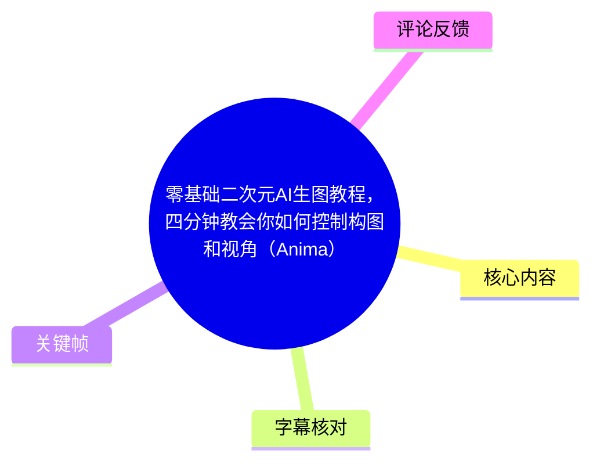
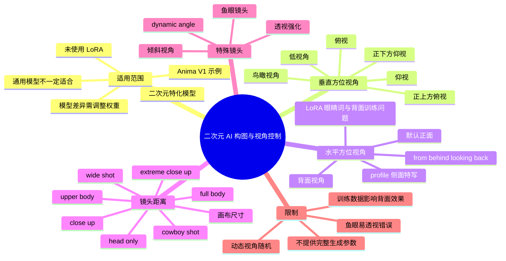
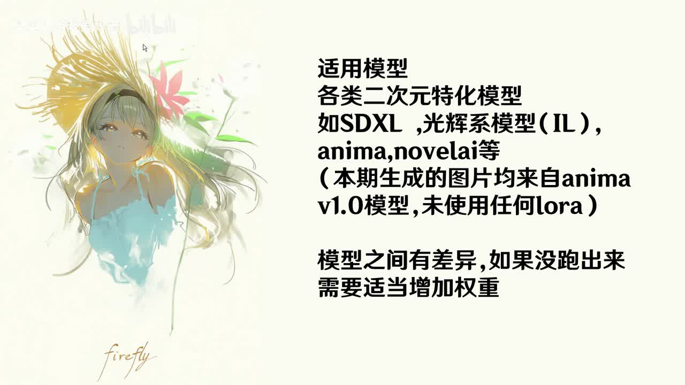
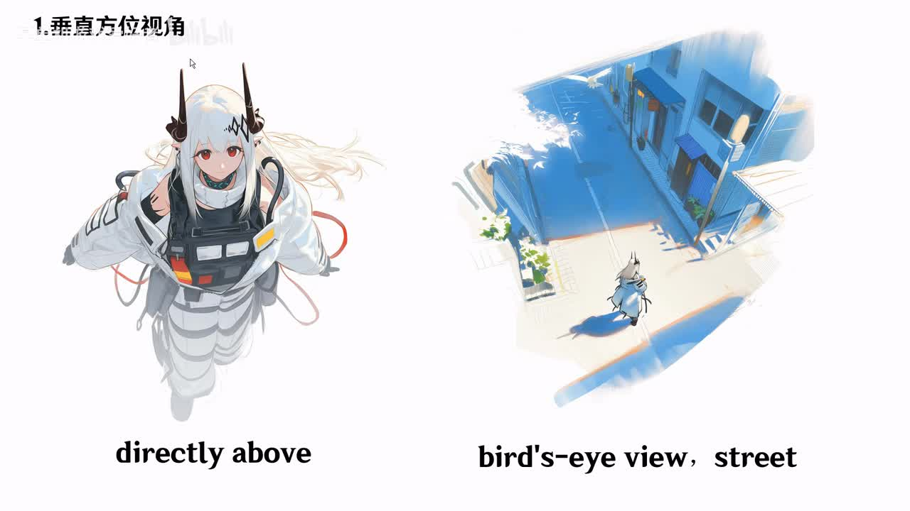
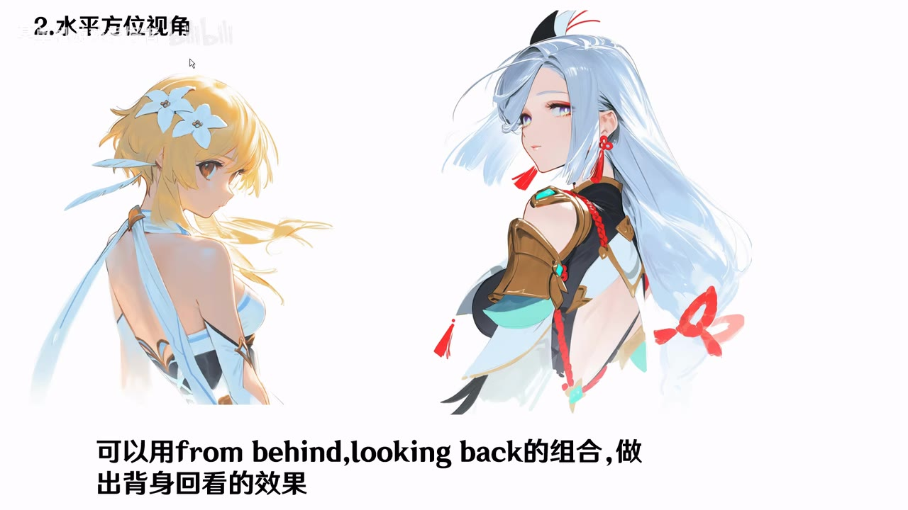

## 小结

这支 4 分 01 秒的视频讲解如何用提示词控制二次元 AI 生图的**构图、人物朝向与镜头视角**。作者将内容拆为四部分：垂直方位视角、水平方位视角、镜头距离与画布尺寸、特殊镜头视角。

视频示例均来自 **Anima V1**，且关键帧说明示例**未使用任何 LoRA**。作者认为方法适合 SDXL、光辉系模型（IL）、Anima、NovelAI 等二次元特化模型，不太适合豆包、大香蕉一类通用模型。不同模型对同一提示词的响应会有差异；若效果未出现，可适当提高相关词权重，但视频没有给出权重语法或具体数值。

实操重点是先确定画布能否容纳人物和环境，再以镜头距离控制人物占比，随后加入上下、左右方向的视角词，最后再叠加动态角度、倾斜、透视、鱼眼等特殊镜头效果。该流程可降低“内容生成出来了，但人物太小、脸部细节不足或环境不突出”的问题。

作者也明确指出提示词控制存在边界：角色 LoRA 若缺少背面训练图，可能难以稳定出背面；`dynamic angle` 的结果随机性较大；鱼眼镜头容易发生透视错误。视频并未提供种子、采样器、步数、CFG、完整正负提示词或具体画布像素，因此不能作为逐图复现配方。

时效性上，内容对应作者使用的 Anima V1 及视频发布时的模型表现。模型版本、提示词解析机制、自然语言与短标签的权重关系均可能变化，建议将本文作为构图提示词的测试框架，而非固定保证。

## 思维导图





## 目录

- [视频范围、示例条件与时效性](#视频范围示例条件与时效性)
- [垂直方位视角：俯视与仰视](#垂直方位视角俯视与仰视)
- [水平方位视角：正面、侧面、背面](#水平方位视角正面侧面背面)
- [镜头距离、局部特写与画布尺寸](#镜头距离局部特写与画布尺寸)
- [特殊镜头视角及风险](#特殊镜头视角及风险)
- [按视频内容整理的操作流程](#按视频内容整理的操作流程)
- [限制、复现边界与资料说明](#限制复现边界与资料说明)
- [字幕比对](#字幕比对)
- [评论分析](#评论分析)
- [处理记录](#处理记录)

## [视频范围、示例条件与时效性](https://www.bilibili.com/video/BV18kKR69Eks?t=0)

- **视频标题**：零基础二次元AI生图教程，四分钟教会你如何控制构图和视角（Anima）
- **UP 主**：某单机游戏爱好者
- **合集**：AIcode
- **时长**：241 秒（4 分 01 秒）
- **视频地址**：[BV18kKR69Eks](https://www.bilibili.com/video/BV18kKR69Eks)
- **平台发布时间戳**：`1782782700`；元数据未提供明确时区文本，本文不额外换算为本地发布时间。
- **视频简介补充**：作者写明图片制作使用 PS、模型采用 Anima、配音软件为 Index-TTS；并补充说明结尾图片不是 Anima 生成，而是 NAI 生成。

作者开场说明，本期目标是用 AI 生成指定构图和视角的图片。其适用范围是二次元特化模型，而不是所有通用图像模型。关键帧中列举了 SDXL、光辉系模型（IL）、Anima、NovelAI 等例子。



> 图：该帧明确写有“适用模型：各类二次元特化模型”，并标注“本期生成的图片均来自 anima v1.0 模型，未使用任何 lora”及“模型之间有差异，如果没跑出来需要适当增加权重”。这是判断教程适用边界与示例条件的直接依据。

视频没有说明 Anima 的具体部署方式、网页入口、工作流节点、采样器、步数、CFG、种子、提示词权重写法或负面提示词。因此，作者所说的“适当增加权重”只能理解为排错方向，不能推导出统一的数值参数。

## [垂直方位视角：俯视与仰视](https://www.bilibili.com/video/BV18kKR69Eks?t=22)

第一部分讲解从上往下、从下往上的垂直方位视角。

作者列出俯视方向的几类表达：

| 类别 | 视频中的说明 | 使用要点 |
| --- | --- | --- |
| 俯视 | 基础的由上向下观察 | 用于普通俯视效果。 |
| 正上方俯视 | 比普通俯视效果更强烈 | 关键帧对应英文为 `directly above`。 |
| 鸟瞰视角 | 需要补充场景相关提示词，效果较好 | 更适合突出人与环境、街道等空间关系。 |
| 高视角 | 被列为垂直方位视角的一种 | 视频未进一步给出单独示例或参数。 |



> 图：左侧人物示例使用 `directly above`，强调从正上方观察；右侧使用 `bird's-eye view, street`，画面同时包含街道环境。该帧直观说明作者所说的“正上方俯视更强烈”与“鸟瞰需要场景词配合”。

仰视方向则包括：

| 类别 | 视频中的说明 |
| --- | --- |
| 仰视 | 基础的由下向上观察视角。 |
| 正下方仰视 | 效果比普通仰视更明显。 |
| 低视角 | 作用与仰视接近；作者称一般不写这个。 |

这里的核心经验不是只堆叠镜头词，而是让方向词与画面需求匹配。若目标是突出人物高度、压迫感或由下向上的视觉关系，可从仰视类词开始测试；若目标是表现街道、地面、人物位置等空间关系，则鸟瞰类词需要同时配合环境描述。

## [水平方位视角：正面、侧面、背面](https://www.bilibili.com/video/BV18kKR69Eks?t=66)

第二部分讨论人物在水平方向上的朝向。

作者的经验判断是：对于大部分模型，如果不指定视角，通常会得到**正面视角**。因此，侧面、背面、背身回看等非默认构图，需要在提示词中明确说明。

### [侧面：`profile`](https://www.bilibili.com/video/BV18kKR69Eks?t=78)

作者解释 `profile` 是侧面特写，可能使模型生成角色的侧身与侧脸。


> 图：画面以侧向人物示例搭配文字“profile 侧面特写”，直接对应本段提示词含义。它可帮助区分“默认正面人物”与“明确要求侧面观察”的差异。

视频未声称 `profile` 能百分之百锁定人物角度。实际结果仍可能受底模、角色特征、提示词冲突和抽样随机性影响。

### [背面、面部词冲突与 LoRA 注意事项](https://www.bilibili.com/video/BV18kKR69Eks?t=88)

作者指出，若目标是背面视角，但提示词中仍存在面部、表情等描述，角色的脸可能不会如预期般背向观众。可将其视为提示词之间的目标冲突：一边要求背对镜头，另一边又要求模型展示面部表情。

对于角色 LoRA，作者给出两条经验：

1. 使用角色 LoRA 时，要记得去掉角色眼睛相关的提示词。
2. 部分角色 LoRA 训练得不够好，未使用角色背面图片训练；此时可能难以生成稳定的角色背面。

如需“人物背对镜头，但回头看向镜头”的效果，作者给出的组合是：

```text
from behind, looking back
```



> 图：该帧以两个人物示例展示背部朝向与回头露出脸部的构图，并直接标注 `from behind, looking back`。它说明这个组合的目标并非纯粹背面，而是背身后回看的姿态。

上述 LoRA 建议是视频作者的实操经验。视频没有展示 LoRA 训练集、权重、触发词或对照实验，因此不能将其扩展为所有角色 LoRA 都必须删除眼睛词的普遍规律。

## [镜头距离、局部特写与画布尺寸](https://www.bilibili.com/video/BV18kKR69Eks?t=113)

第三部分先讲画布尺寸，后讲镜头距离。作者展示了 NovelAI 常用的三种画布尺寸，但提供的字幕和关键帧资料中没有出现具体像素值，因此不能补写成确定分辨率。

作者给出的判断是：不同构图需要不同画布，画布应能容纳想生成的内容。如果尺寸选错，即便 AI 生成了目标内容，也可能因为人物太小而让面部缺少细节。

可据此整理出两个画布选择方向：

- 想突出人物面部、服装或上半身细节时，应避免让人物在大场景画面中占比过低。
- 想展示环境、人物与场景的关系时，应为背景留出足够面积，并接受人物占比下降。

视频提及的镜头距离和构图提示词如下：

| 提示词或组合 | 作者描述的结果或用途 |
| --- | --- |
| `close up` | 默认情况下生成人物头部和肩部。 |
| `extreme close up` | 常常生成更近的人物头部画面。 |
| `close up` + `focus` 相关词 | 用于特定部位的局部特写。 |
| 眼部 `focus` | 眼部特写。 |
| 足部 `focus` | 足部特写。 |
| `breast focus` | 胸部特写。 |
| `upper body` | 作者最常用的构图词；可让人物更大、增加细节。 |
| `full body` | 生成人物全身。 |
| `full body` + `sitting` 等姿势词 | 作者认为组合书写更不容易“崩”。 |
| `head only` | 只生成人物头部，例如制作 Q 版表情。 |
| `cowboy shot` | 生成人物膝盖以上的画面。 |
| `wide shot` | 用于场景画面，减少人物占比、更好展现环境。 |

`wide shot` 的英文存在字幕识别不确定性：站内字幕写作“white shut”，本次 ASR 写作 `Wideshot`。结合作者紧接着说明“减少人物的占比，更好地展现出环境”，本文采用语义上相符的 `wide shot` 作为整理写法，并保留其为字幕校正结果的说明。

视频给出的可组合思路是：镜头距离决定人物占比，方位词决定观察方向，局部 `focus` 词决定强调部位。例如，`upper body` 与侧面、俯视等词可以叠加使用；但视频没有展示一条完整的稳定提示词，也没有承诺组合后各个词都会被精确执行。

## [特殊镜头视角及风险](https://www.bilibili.com/video/BV18kKR69Eks?t=191)

第四部分介绍用于加强画面冲击力的特殊镜头视角。

| 提示词或名称 | 视频中的用途 | 作者提示的限制 |
| --- | --- | --- |
| `dynamic angle` | 随机生成一个有冲击力的视角 | 效果随机性大。 |
| 倾斜视角 | 增加画面动感 | 站内字幕中的英文词转写不可靠，不能据此确认标准拼写。 |
| `For shortening` / ASR 转写为 `Full Shortening` | 强化画面透视效果 | 两份字幕的英文拼写互相冲突。 |
| `FISHINE` | 作者解释为鱼眼镜头 | 对 AI 来说效果不够好，容易出现透视错误，应谨慎使用。 |

其中有两个需要明确保留不确定性：

- 站内字幕将倾斜视角相关词转写为“赤angle”，ASR 没有给出可靠对应词，因此本文仅记录其中文作用，不伪造英文原词。
- 站内字幕为 `For shortening`，ASR 为 `Full Shortening`，二者都指向“强化透视效果”的段落。素材不足以确认标准英文拼写，故不擅自修正为未在素材中出现的词。

这一部分适合在基础构图已经可用后再尝试。`dynamic angle` 的随机性和鱼眼镜头的透视风险，意味着它们不适合被当作严格构图控制工具。若任务是角色设定图、严格姿势还原或需要稳定批量输出的图像，应优先保证主体占比、方位和镜头距离，再小幅加入特殊效果。

## [按视频内容整理的操作流程](https://www.bilibili.com/video/BV18kKR69Eks?t=211)

以下流程按视频讲解顺序整理，只使用视频已经出现的方法和限制。

1. **确认模型类型与示例差异**  
   优先使用二次元特化模型进行测试。视频示例来自 Anima V1，且未使用 LoRA；其他模型即使支持相同提示词，也可能有不同响应。

2. **先确定画布服务的构图目标**  
   - 人物细节优先：避免让人物在画布中太小。  
   - 场景展示优先：为环境保留画面空间。  
   视频没有给出具体尺寸，应在所用平台中自行比较不同画布比例。

3. **选择镜头距离控制人物比例**  
   - 头肩画面：`close up`
   - 更近的头部画面：`extreme close up`
   - 上半身与细节：`upper body`
   - 人物全身：`full body`
   - 膝盖以上：`cowboy shot`
   - 仅头部：`head only`
   - 场景中的小比例人物：`wide shot`

4. **加入垂直方向词**  
   根据需求选择俯视、正上方俯视、鸟瞰、仰视、正下方仰视或低视角。鸟瞰画面应配合场景描述，例如关键帧中的：

   ```text
   bird's-eye view, street
   ```

5. **加入水平方向或人物朝向词**  
   正面通常是模型默认倾向；若需要侧脸、侧身，可尝试：

   ```text
   profile
   ```

   若需要背身回看，可尝试：

   ```text
   from behind, looking back
   ```

6. **排查背面目标的提示词冲突**  
   想让角色背对镜头时，检查面部、表情、眼睛等提示词是否仍在诱导模型展示角色正脸。若使用角色 LoRA，按作者经验尝试移除眼睛相关描述。

7. **最后叠加特殊镜头效果**  
   在主体比例、基本方位稳定后，再尝试 `dynamic angle`、倾斜视角、透视强化或鱼眼效果。对于随机性高或易产生透视错误的词，应多次抽样筛选。

8. **根据模型表现调整相关词权重**  
   作者建议效果未出现时适当提高权重，但未提供格式和数值。实践时应遵守所用平台的权重语法，并尽量一次只调整少量变量，便于判断改变来自哪一个提示词。

## [限制、复现边界与资料说明](https://www.bilibili.com/video/BV18kKR69Eks?t=224)

- **模型适用范围有限**：视频示例来自 Anima V1，作者认为更适合二次元特化模型，不太适合豆包、大香蕉等通用模型。
- **作者自述存在知识边界**：视频简介中写明，作者对 Anima 的了解“不算深入”，如有问题欢迎指正。
- **缺少完整生成参数**：素材未提供种子、采样器、步数、CFG、画布像素、完整正向提示词、负向提示词、LoRA 名称、LoRA 权重等信息。
- **提示词并非精确控制系统**：视频重点是构图与视角的提示词方向，并未展示 ControlNet、姿势骨架、参考图锁定、图生图构图还原或区域控制。
- **角色背面受训练数据影响**：作者指出若角色 LoRA 不含背面训练图，背面图可能难以稳定生成；增加提示词不保证能解决训练数据覆盖不足的问题。
- **特殊镜头有失败风险**：`dynamic angle` 随机性较大，鱼眼镜头容易发生透视错误。
- **结尾图不是 Anima 样本**：作者在简介中明确补充，结尾图片使用 NAI 生成，不能据此判断 Anima V1 的表现。
- **时效性**：元数据抓取时间为 2026-07-13；模型版本、提示词解析和平台功能都可能随时间更新。本文保留视频原有经验，不将其视为当前所有模型的稳定结论。

## [字幕比对](https://www.bilibili.com/video/BV18kKR69Eks?t=0)

本次任务中，**站内字幕可获取，且本次 ASR 已执行**。两份字幕均未提供逐句时间戳；本文的章节时间轴依据视频段落顺序、总时长与关键帧内容定位。

| 字幕来源 | 完整性 | 专有名词识别 | 时间轴 | 主要问题 |
| --- | --- | --- | --- | --- |
| Bilibili 站内字幕 | 较完整，覆盖开场、四个板块与结尾。 | 整体较好，能识别 Anima、LoRA、`profile`、`from behind looking back`、`close up`、`upper body` 等。 | 未提供逐句时间戳。 | `wide shot` 被写成“white shut”；透视词写作 `For shortening`；鱼眼词写作 `FISHINE`，英文标准拼写无法仅靠字幕确认。 |
| 本次 ASR 字幕 | 覆盖主要段落，但有漏词、重复、错断句。 | 多处失真，如“二次元特化模式”“Navvo AI”“人物的死亡”“非是碍事与眼睛同”。 | 未提供逐句时间戳。 | 垂直视角、特殊镜头、LoRA 与 NovelAI 等专有词识别不稳定；部分句子语义不完整。 |

### 最终字幕选择

本文采用**站内字幕为主、本次 ASR 为交叉校验**的策略。

关键校正如下：

- `directly above`、`bird's-eye view, street`、`profile`、`from behind, looking back`：均可由所给关键帧直接确认。
- 站内字幕“white shut”与 ASR 的 `Wideshot` 均不规范；结合“减少人物占比、更好展现环境”的语义，整理为 `wide shot`，并标注为上下文校正。
- 站内字幕 `For shortening` 与 ASR 的 `Full Shortening` 不一致；仅能确认其功能描述为“强化画面透视效果”，无法确认标准英文拼写。
- 站内字幕 `FISHINE` 被作者解释为鱼眼镜头；本次 ASR 没有提供可靠英文识别，因此保留站内转写并说明不确定性。
- ASR 对 NovelAI、LoRA、二次元特化模型等专有名词存在明显误识别，未被作为最终文本依据。

## [评论分析](https://www.bilibili.com/video/BV18kKR69Eks?t=0)

以下仅处理可获取的热评前三条。评论属于用户体验、观点或建议，不构成已经验证的技术事实。

### 1. 黎-Ming（3 赞）

评论认为 Anima 的提示词能力较强，但姿势和构图可控性仍然偏弱；即使可用提示词描述姿势，最终依然像“抽卡”。评论者认为光辉的 ControlNet 更好用。

- **补充价值**：指出文本提示词控制与精确姿势控制之间存在差距。
- **与视频关系**：视频只讲构图和视角提示词，没有讲 ControlNet、姿势骨架或参考图控制。
- **可信度边界**：该评论没有提供模型版本、ControlNet 工作流、样本数量或对比图，属于个人模型使用体验，不能据此认定所有任务中 ControlNet 都优于 Anima。

### 2. 雷昂_Lion（11 赞）

评论肯定视频例图画风干净，认为这是从大量视频中总结出的经验；同时建议 Anima 教程更着重讲自然语言（NL）写法。其观点是 Anima 的自然语言权重较大，短 Tag 容易被模型忽略。评论还提到 Newbie、多人构图与 Krea2 等模型方向。

- **补充价值**：提出短标签与自然语言描述可能有不同响应，建议补充自然语言提示词的写法。
- **与视频关系**：视频主要以简短英文提示词举例，没有比较自然语言与短标签的权重差异。
- **可信度边界**：关于 NL 权重、多人构图、不同模型能力和内容赛道的说法均是评论者判断；视频素材没有实验数据予以验证。

### 3. 普梨客观说（5 赞）

评论者称自己收集了近万张模特写真与 Coser 写真，想实现接近闭源工具的图生图构图、姿势还原；其体验是 Anima 图生图目前做不到“描图式”复现，更像是识图后给提示。

- **补充价值**：将需求从“文本控制镜头”扩展到“参考图精确还原构图和姿势”。
- **与视频关系**：视频没有展示图生图、参考图、姿势迁移或构图锁定，因此无法直接解决该评论者的需求。
- **可信度边界**：评论未给出输入图、模型版本、图生图强度、提示词、工作流或比较样本，不能将其体验外推为 Anima 图生图能力的统一结论。

## [处理记录](https://www.bilibili.com/video/BV18kKR69Eks?t=0)

- **Worker ID**：`worker-mrj0wbly-5dc4e50c`
- **模型**：`gpt-5.6-terra`
- **依据素材与工具输出**：任务提供的视频元数据、视频描述、站内字幕、本次 ASR 字幕、热评数据、关键帧及素材清单；可用输出路径包括 `merged.mp4`、`audio/audio.wav`、`frames/`、`comments/comments.json`、`subtitles/`、`asr/`。
- **字幕选择**：站内字幕为主要依据；本次 ASR 已执行，用于交叉比对。对英文提示词冲突处，优先参考关键帧；无法确认的拼写明确保留不确定性。
- **关键帧选择依据**：
  - `frames/frame-001.jpg`：展示适用模型、Anima V1、未使用 LoRA、模型差异与增加权重提醒。
  - `frames/frame-002.jpg`：展示 `directly above` 与 `bird's-eye view, street` 的视觉差异。
  - `frames/frame-003.jpg`：展示 `profile` 对应侧面特写。
  - `frames/frame-004.jpg`：展示 `from behind, looking back` 对应背身回看。
  - 其余关键帧文件虽在素材清单中列出，但未提供可核验图像内容，未强行引用或描述。
- **评论处理范围**：仅分析可获取热评前三条，未扩展至其余评论或弹幕。
- **缓存清理**：提供的素材记录中没有缓存清理执行日志；未虚构已清理结果。
- **未解决问题**：视频未提供逐句字幕时间戳、完整提示词、具体画布像素、模型生成参数、LoRA 参数，以及特殊镜头相关英文词的可靠标准拼写。

## 评论分析

本次流程未获取到可用热评，因此不推断观众态度或额外结论。
