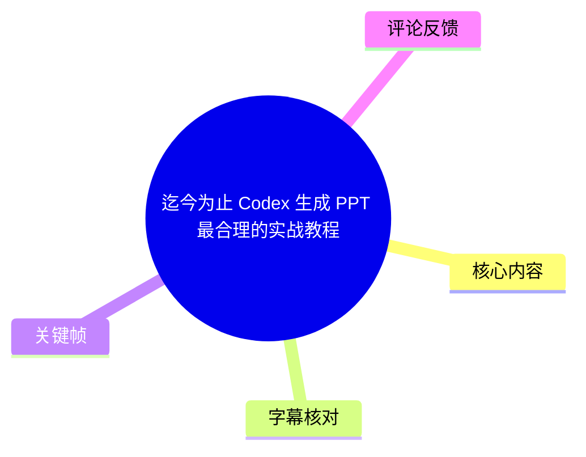
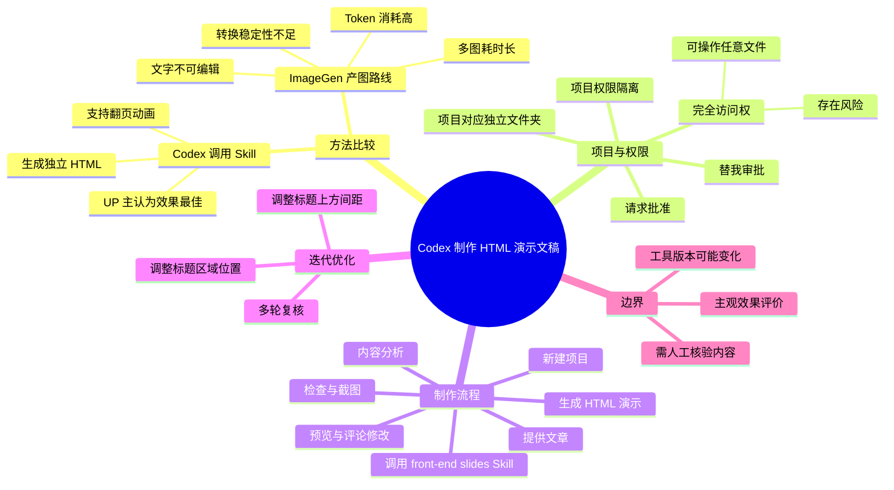
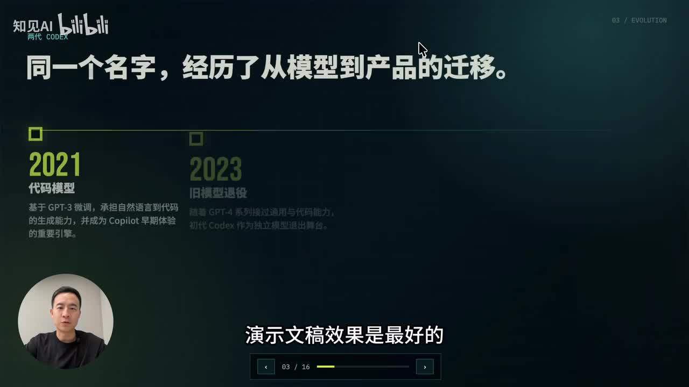
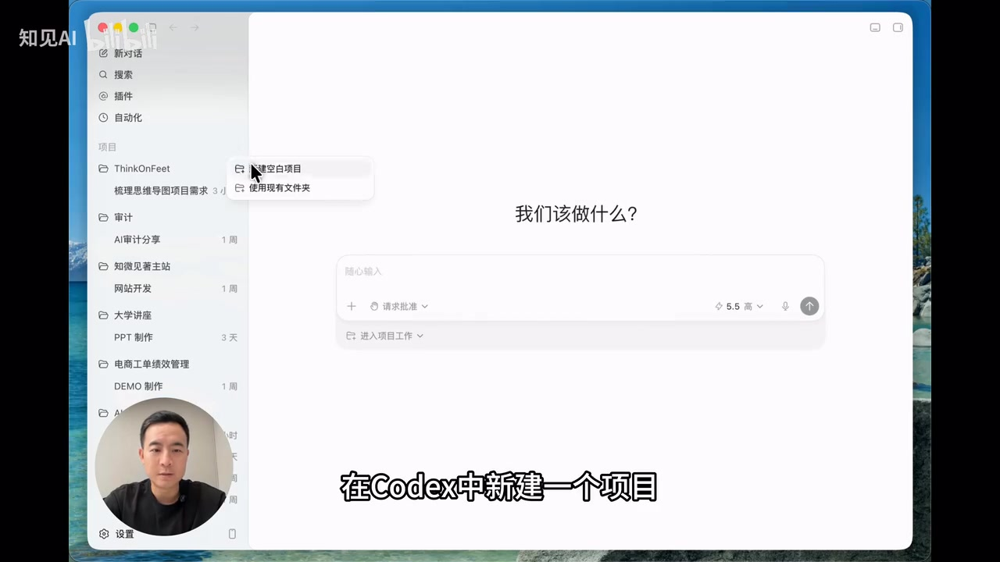
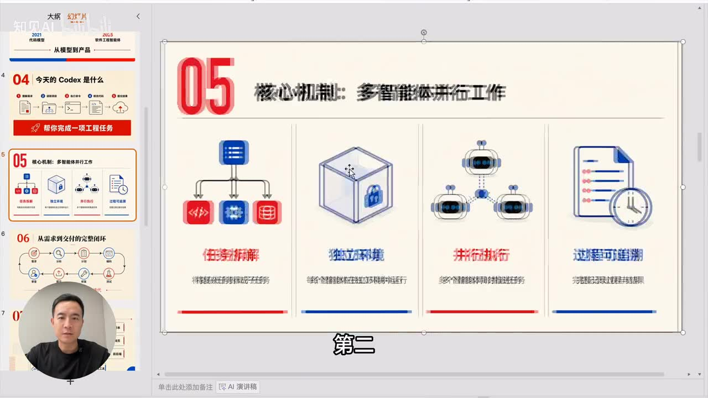
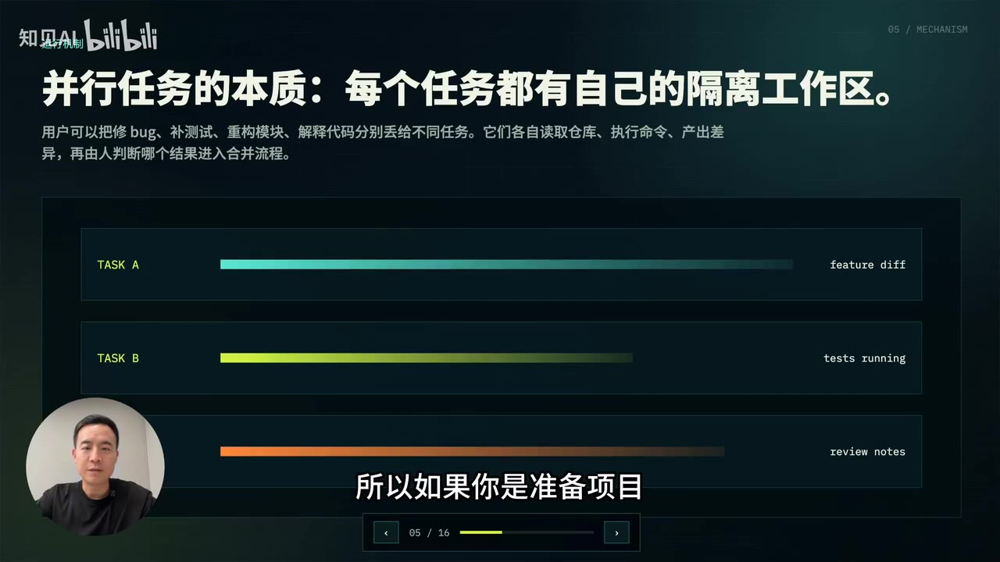

# 迄今为止 Codex 生成 PPT 最合理的实战教程

> 来源：[Bilibili 视频](https://www.bilibili.com/video/BV1mjEz6zEpr)  
> UP 主：知见AI｜视频时长：03:32｜分辨率：3840×2160  
> 视频描述：你也能做出发布会级别的 PPT！

## 小结

视频给出了一条以 **Codex + `front-end slides` Skill** 制作演示文稿的工作流：将一篇已准备好的文章交给 Codex，再通过提示词要求其调用该 Skill，生成独立的 HTML 格式演示文稿，并在 Codex 内预览、评论和迭代调整。

UP 主的核心判断是：在其已对比过的 AI 制作 PPT 方法中，直接让 Codex 调用 Skill 生成演示文稿，效果优于以 CodeX ImageGen 直接产图后再转换为 PPT 的路线。前者的成品可用于产品演示、项目汇报、培训或讲座；后者虽有较好的图像精致度，但存在多图生成慢、Token 消耗大、文字不可编辑、转换不稳定及反复修改成本高等问题。

实操上，视频特别强调新建项目、项目文件夹与权限隔离，以及三种操作权限：请求批准、替我审批、完全访问权。完全访问可操作电脑上的任意文件，效率较高但伴随文件安全风险；模型推理强度越高，通常意味着更高 Token 消耗。演示中因 Token 预算充足而选择“快速”速度。

生成结果不是一次性定稿。Codex 会先分析文章，再生成独立 HTML，并据视频说法进行一轮检查，确认 16 页演示内容可识别且无明显溢出，同时生成截图供检查。随后用户可针对标题与正文间距、标题区域位置等局部问题提出自然语言评论，经过数轮调整后达到可用状态。

需要注意，这是一支约 3 分半钟的流程演示，不是对 Codex、ImageGen、Presentation 插件或 PPT Master 的严谨基准测评。视频中的“效果最好”“80～90 分”“完全没有问题”均为 UP 主的使用判断；成品的事实准确性、品牌规范、图表质量、信息层级和兼容性仍应由实际使用者复核。工具能力、模型选项、Skill 名称、权限界面及 Token 规则均可能随产品版本变化。

## 思维导图





## 目录

- [方法选择：为什么不优先走“直接产图再转 PPT”路线](#方法选择为什么不优先走直接产图再转-ppt路线)
- [工作区与权限：项目隔离及风险控制](#工作区与权限项目隔离及风险控制)
- [从文章到 HTML 演示：完整生成步骤](#从文章到-html-演示完整生成步骤)
- [质量检查、预览与迭代修改](#质量检查预览与迭代修改)
- [结果评价、适用范围与限制](#结果评价适用范围与限制)
- [关键帧索引](#关键帧索引)
- [字幕比对](#字幕比对)
- [评论分析](#评论分析)
- [处理记录](#处理记录)

## 方法选择：为什么不优先走“直接产图再转 PPT”路线 [00:00](https://www.bilibili.com/video/BV1mjEz6zEpr?t=0)

视频开头先给出路线比较。UP 主表示，自己已比较过多种 AI 制作 PPT 的方式，并认为截至录制时，通过 Codex 调用 Skill 制作演示文稿的综合效果最好，足以用于产品演示。

### 两类路线的取舍

| 路线 | 视频中的做法/结果 | 视频指出的问题或优势 |
| --- | --- | --- |
| Codex 调用 Skill | 以文章为输入，调用 `front-end slides` Skill 生成 HTML 演示文稿 | UP 主认为视觉呈现较好，支持翻页动画，适合演示、汇报、培训 |
| CodeX ImageGen 直接生成图片 | 先让插件产出图片，再尝试借助 Presentation 插件或 PPT Master 转换 | 图片精致，但多图耗时长、Token 消耗大；图中文字无法作为可编辑文本处理；转换效果与稳定性不理想 |
| 传统转换式补救 | 通过 Presentation 插件或 PPT Master 将图片结果转换为演示稿 | UP 主反馈需反复运行和修改，时间成本高 |

这里的关键并不只是“图片好不好看”，而是演示文稿的**可维护性与交付效率**。视频强调，直接生成整张图片时，其中的文字属于画面的一部分，无法像普通文本框一样独立编辑；一旦需要修改标题、字号、内容或布局，通常需要重生成或转换，造成不稳定和额外成本。

视频在 [00:24](https://www.bilibili.com/video/BV1mjEz6zEpr?t=24) 明确将推荐场景限定为项目汇报、产品演示与培训课程，并推荐使用 Codex Skill 生成 HTML 格式演示文稿。这里的“推荐”是 UP 主的经验判断，不等同于各工具在所有题材、所有版本下的通用性能结论。



> 图：关键帧展示了生成演示中的第 3/16 页，页面采用深色背景、时间线结构和底部翻页导航。它用于说明视频所追求的是可播放的 HTML 演示形态，而非仅输出一张静态图片。

## 工作区与权限：项目隔离及风险控制 [01:01](https://www.bilibili.com/video/BV1mjEz6zEpr?t=61)

视频在新建项目后，解释了 Codex 中“项目”的工作方式：**每个项目对应电脑中的一个独立文件夹**，且不同项目具有各自隔离的权限。因此，处理不同类型事务时，应通过不同项目将文件和权限边界分开。

### 三种操作权限

视频指出输入框下方有三项需要重点注意的权限设置：

| 权限选项 | 视频中的解释 | 使用建议 |
| --- | --- | --- |
| 请求批准 | Codex 处于最小权限状态，每次操作都要询问用户 | 适合首次使用、敏感文件或需要逐项确认的任务；代价是交互更频繁 |
| 替我审批 | 当 Codex 检测到有风险的操作时，再请求用户批准 | 在效率与控制之间折中；具体风险识别能力需以实际产品行为为准 |
| 完全访问权 | Codex 可操作电脑上的任何文件 | 适合明确可信且需要连续执行的任务；视频明确提醒存在一定风险 |

UP 主在演示中选择完全访问权，但这不是必须步骤。更稳妥的实践是：先将素材复制到专用项目文件夹，避免在含有敏感资料、生产文件或重要个人文件的目录中直接授予高权限；完成后复核输出文件、截图和生成日志。

### 模型推理与速度选项

在右侧设置中，视频提到：

- **推理程度越高**：模型通常“更聪明”，但 Token 消耗也越大。
- **速度**：可选“标准”或“快速”。
- 演示因 Token 较充足，选择了“快速”。

这段内容没有给出具体模型名称、推理档位名、Token 上限或实际用量，因而不能据此推导成本数值。实际操作应根据账户套餐、任务复杂度、内容长度和当前产品界面决定。



> 图：关键帧显示 Codex 左侧项目列表及“新建空白项目 / 使用现有文件夹”入口。它直观对应“项目关联独立文件夹”的前置步骤，也提示用户可选择空白项目或接入已有目录。

## 从文章到 HTML 演示：完整生成步骤 [01:49](https://www.bilibili.com/video/BV1mjEz6zEpr?t=109)

以下流程按视频实际顺序整理。视频使用的是一篇预先准备好的文章作为内容源，没有展示文章全文、文件格式、篇幅或上传方式，因此这些细节不能补充臆测。

### 步骤 1：准备内容源

准备一篇作为演示基础的文章。视频强调“把准备好的一篇文章发给 Codex”，意味着 AI 主要依据输入文章组织演示内容。

建议在实际操作前人工检查文章：

1. 明确目标听众、演讲目的与页数预期；
2. 核对标题、数据、日期、人名和专有名词；
3. 删除不宜对外展示的敏感信息；
4. 对需要保留的结论、品牌色、图表和案例提出明确约束。

这些建议是基于演示文稿交付的一般风险控制，不是视频中逐项展示的命令。

### 步骤 2：在 Codex 中创建或进入项目

在 Codex 新建项目，或按画面所示使用已有文件夹。项目应对应本次演示文稿的专用工作目录，以便隔离源文件与输出文件。

### 步骤 3：选择权限、推理与速度

依据任务风险选择权限。视频示范选择完全访问权，原因是希望流程连贯执行；但若目录不受控或素材敏感，应优先选“请求批准”或“替我审批”。

视频没有给出可复制的完整系统提示词，仅展示了用于生成的关键指令：

```text
使用这个 skill front-end slides 制作演示文稿
```

其中 `front-end slides` 是视频口述和 ASR 中出现的 Skill 名称。它是否在所有 Codex 客户端、地区、账户或未来版本中均可用，视频未作保证。

### 步骤 4：等待 Codex 分析并生成

视频描述的内部流程为：

1. Codex 调用该 Skill；
2. 对文章内容进行分析；
3. 将演示做成一个独立 HTML；
4. 生成后继续执行检查。

这里的输出重点是 **HTML 格式演示文稿**。这与 `.pptx` 文件并不等价：HTML 的优势通常在于网页式布局、交互与翻页呈现；但视频未展示导出 `.pptx`、离线播放、字体嵌入或跨设备兼容测试，不能将其视为这些能力已被验证。



> 图：关键帧为一张浅色内容页，左侧可见多页缩略图，主区为“核心机制：多智能体协作工作”的图文页面。它表明生成结果具有封面外的结构化内容页、信息图与统一样式，而非仅有单页海报。

## 质量检查、预览与迭代修改 [02:13](https://www.bilibili.com/video/BV1mjEz6zEpr?t=133)

视频称，Codex 完成生成后会进行一轮检查，以确保这份 **16 页** 演示文稿能够被识别，并且没有明显内容溢出；检查过程中还会对生成的演示文稿截图。这里“16 页”来自视频口述，ASR 将该处识别为“16 页 PVT”，结合前后“演示文稿”语境及关键帧中的 `03 / 16` 页码，应理解为 16 页演示稿，而非名为 PVT 的独立格式。

### 检查应关注什么

视频实际提到的检查目标是“可识别”与“没有明显溢出”。从演示结果可见，至少应人工复查：

- 标题是否被裁切、重叠或贴近边缘；
- 正文与标题、图表、图标之间的间距是否合理；
- 长文本是否溢出容器、折行异常或缩放过小；
- 页码、导航和翻页行为是否正常；
- 图表、年份、数字、专有名词与原文是否一致；
- 浅色与深色页面下的字体对比度是否足够。

其中前两项在后续修改过程被直接展示；其余属于交付前应进行的通用人工校验，并非视频声称已自动完成的范围。

### 在 Codex 内预览和评论

视频在 [02:44](https://www.bilibili.com/video/BV1mjEz6zEpr?t=164) 展示了修改方式：直接在 Codex 中预览生成的演示文稿，如果发现瑕疵，即可通过评论提出修改要求。

演示中的两次明确修改为：

1. **标题与上方文字过于密集**  
   提出“上面的间距变大一些”，随后 Codex 按要求增大了顶部间距。
2. **整个标题区域位置偏下**  
   要求将其“再往上一点”，以修正垂直位置。

这个过程说明有效反馈应尽量具备可定位性：明确对象（标题/上方文字）、问题（过密/偏下）和修改方向（增加间距/向上移动）。相比笼统地说“页面不好看”，此类反馈更便于模型执行并供用户验收。



> 图：关键帧以“并行任务的本质：每个任务都有自己的隔离工作区”为标题，并用 TASK A、TASK B、TASK C 的进度条表达并行处理。它既是生成内容质量的示例，也呼应视频前述“项目与工作区隔离”的概念。

## 结果评价、适用范围与限制 [03:08](https://www.bilibili.com/video/BV1mjEz6zEpr?t=188)

经过数轮间距和位置调整后，UP 主认为演示稿在间距与位置上已校正较好，并给出“80 分到 90 分”的主观评价，认为可用于演示产品、做培训和讲座。

### 可迁移的经验

1. **将内容生产与版式生产连接起来**：先准备一篇相对完整的文章，再让 Skill 把文章转为演示结构，减少从空白页开始搭建的工作。
2. **优先选择可迭代的输出形式**：视频推荐 HTML 演示，而不是把整张带字图片作为最终文本载体。
3. **建立项目边界**：每个项目使用独立目录，减少不同任务文件混杂与权限扩散。
4. **把 AI 输出当作初稿**：自动检查可发现部分问题，但标题间距、元素对齐等仍需通过预览和评论迭代。
5. **将权限与效率分开决策**：高权限可能减少中断，但不应以牺牲不必要的文件安全为代价。

### 视频未验证或需要谨慎对待的部分

- **“最合理”“效果最好”**：是 UP 主在特定使用场景、提示词、文章素材与工具版本下的主观结论，视频没有给出横向测试样本、评价维度或成本数据。
- **最终可编辑性**：视频强调 ImageGen 整图文字不可编辑，但未完整展示 HTML 输出中每个元素是否可在传统 PPT 软件内编辑，也未展示 `.pptx` 导出。
- **稳定性与成本**：没有展示生成耗时、失败次数、Token 实耗、模型配置或并发情况。
- **内容正确性**：视觉无溢出不代表事实无误。涉及数据、业务结论、法律、医疗、财务或公开发布的内容，必须人工核对。
- **兼容性**：未展示在不同浏览器、投影设备、离线环境或移动端的播放结果。
- **时效性**：视频发布时间为 2026-06-11；Codex 的模型、权限名称、Skill 可用性、速度档位和 Token 计费均可能在之后更新，应以实际界面和官方文档为准。

## 关键帧索引

| 关键帧 | 正文位置 | 画面价值 |
| --- | --- | --- |
| [frame-001](frames/frame-001.jpg) | 方法选择 | 展示 16 页 HTML 演示中的深色时间线页面与翻页导航，说明成品形态 |
| [frame-002](frames/frame-002.jpg) | 生成步骤 | 展示多页缩略图、图文内容页和相对统一的版式语言，便于判断输出效果 |
| [frame-003](frames/frame-003.jpg) | 检查与迭代 | 展示深色信息图式页面，作为生成内容结构与视觉组织的例证 |
| [frame-004](frames/frame-004.jpg) | 工作区与权限 | 展示 Codex 新建项目入口及项目列表，直接支撑“新建项目”的操作说明 |

## 字幕比对

| 字幕来源 | 完整性 | 专有名词 | 时间轴 | 主要问题 |
| --- | --- | --- | --- | --- |
| Bilibili 站内字幕 | 未提供可用字幕 | 无法核验 | 无法使用 | 字幕获取过程报错 `Invalid URL`，素材中未提供可用站内字幕 |
| 本次 ASR 字幕 | 较完整：10 段，语音覆盖约 205.82 秒 / 211.70 秒，覆盖率 97.22% | 存在少量误识别或混淆 | 可用：SRT 含精确起止时间 | 如“囿片”“演示文税/文稈”“项在”“讯问权”“PVT”等识别异常 |

本次 ASR 已明确检查：识别语言为中文，语言置信度为 `0.9990234375`，使用 `medium` 模型、CUDA、`float16` 推理；诊断中**没有** `noAudioStream=true` 标记，且提供了音频文件与完整时间戳，因此可以确认源视频具有可识别的音轨，不属于“无音轨视频”。

由于没有可用站内字幕，正文时间轴以本次 ASR 的 SRT 起止时间为依据。结合语境与关键帧，对以下词语进行了最小必要校正：

| ASR 原文 | 正文采用写法 | 校正依据 |
| --- | --- | --- |
| 囿片 | 图片 | 上下文为“整张图片直接生成” |
| CodeX / Code x | Codex | 视频标题、界面与上下文均指向 Codex |
| front-end slides | `front-end slides` | ASR 对英文 Skill 名称识别相对稳定 |
| 16 页 PVT | 16 页演示文稿 | 前后文均为演示文稿；关键帧出现 `03 / 16` 页码 |
| 完全讯问权 | 完全访问权 | 前后说明其可操作电脑任意文件，符合权限语义 |
| 间跞 / 间跛 | 间距 | 后续均在讨论标题与文字的空间距离 |

未对 ASR 中未能由上下文、画面或素材确定的细节作扩写，例如未自行补充模型档位、Token 数量、HTML 文件名或导出格式。

## 评论分析

仅处理可获取的热评前三条。三条评论点赞数均为 0，且没有提供可复现的技术细节，不能作为工具质量的事实依据。

1. **执着的小虫**：  
   > “感谢分享，不过你对ppt的要求好低啊”  
   该评论对视频中的成品标准提出质疑，隐含观点是其认为演示稿质量未达到较高 PPT 要求。它没有说明具体问题位于排版、视觉、内容、动画还是可编辑性，因此只能视为主观审美与质量门槛分歧。该观点与视频中“80～90 分”的自评形成对照，也提醒读者应基于自己的品牌规范和交付标准验收。

2. **千层蛋糕真的高i**：  
   > “大大视频内容做得真好耶，一定会火🔥火速支持一波，期待一手互关”  
   这是对视频内容和创作者的支持性评价，没有提供关于 Codex 工作流、效果、成本或稳定性的可验证补充信息，技术参考价值有限。

3. **千层蛋糕真的高i**：  
   > “这就来评论支持UP主！”  
   该评论为单纯互动支持，不包含技术观点、反例或实际使用反馈，不能用于判断教程方法的有效性。

## 处理记录

- Worker ID：`worker-mrj0wbly-5dc4e50c`
- 整理模型：`gpt-5.6-terra`
- ASR 模型与运行参数：`medium` / CUDA / `float16`；自动识别语言为中文。
- 使用的素材工具结果：视频元数据、关键帧目录、音频文件、ASR SRT、ASR 分段诊断、热评 JSON；站内字幕获取尝试失败，错误信息为 `Invalid URL`。
- 字幕选择：未提供可用 Bilibili 站内字幕，采用本次 ASR 的带时间戳 SRT 作为正文时间轴依据；对可由语境、标题和关键帧确认的误识别进行了标注式校正。
- 关键帧选择依据：选择了能直接展示生成演示的页码与导航、图文版式、多页结构、项目创建界面的 `frame-001` 至 `frame-004`，以覆盖结果形态、内容质量示例及操作入口。
- 评论范围：仅分析可获取热评前三条，未扩展至其他评论。
- 缓存清理：素材未提供缓存清理执行记录，无法确认是否已执行清理；本记录不将其表述为已完成。
- 未解决问题：未获得站内字幕；未提供完整提示词上下文、原始文章、实际 Token 用量、生成耗时、导出文件、模型具体版本及跨设备兼容性测试结果。
