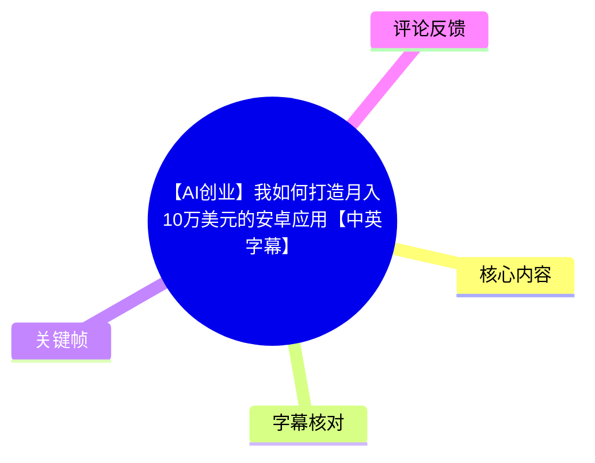
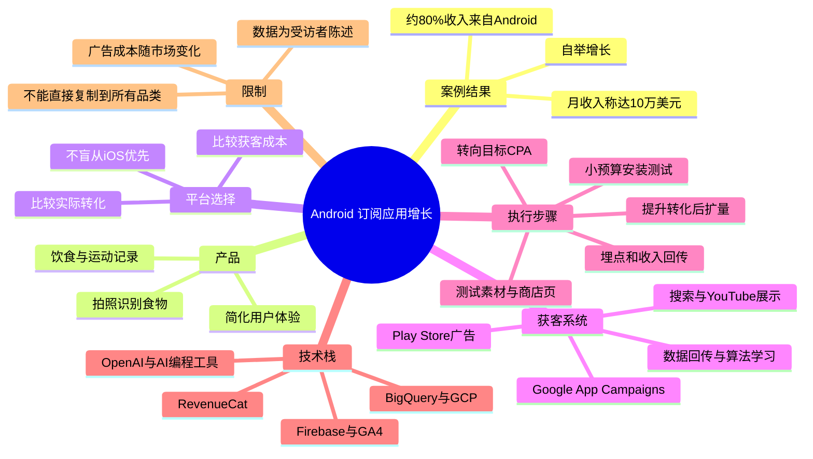
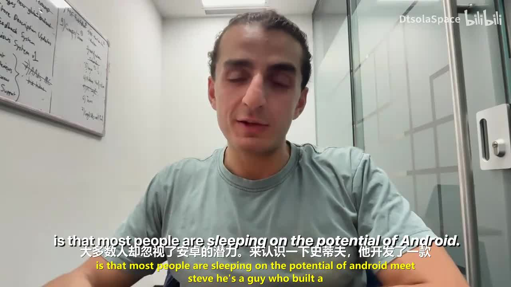
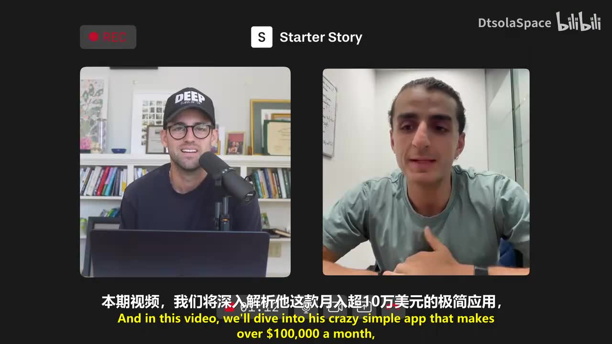
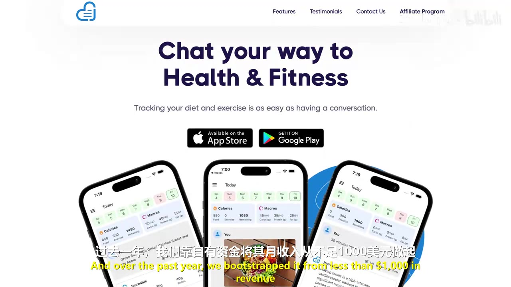
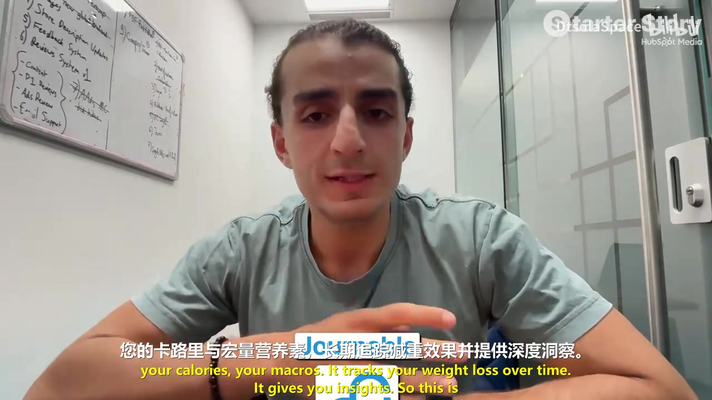

# 【AI创业】我如何打造月入10万美元的安卓应用【中英字幕】

> 来源：[Bilibili 视频](https://www.bilibili.com/video/BV1tiJc6KEdN)  
> UP 主：DtsolaSpace｜合集：AIcode｜时长：24 分 11 秒  
> 视频元数据发布时间：2026-06-14（按时间戳换算）｜数据抓取时间：2026-07-13  
> 标签：AI 创业、独立开发、Android、AI 应用、AI 编程、副业赚钱

## 小结

这是一段对创业者 Steve 的访谈，核心案例是一款面向饮食、运动与减重记录的订阅制健康应用。Steve 称，该产品在过去一年中从每月不足 1,000 美元收入增长到约 10 万美元/月，并且约 80% 的收入来自 Android；其展示的阶段性数据还包括约 12.5 万条 Play Store 评分、约 1 万条评论、约 8 万美元 MRR、约 3 万名订阅用户，以及以年底达到约 100 万美元 ARR 为目标。

视频最重要的观点不是“Android 比 iOS 一定更赚钱”，而是：在资金有限、自举创业的情况下，应先依据获客成本、转化表现和自身广告数据选择平台，而非机械接受“iOS 用户更愿付费”的行业常识。Steve 的团队因发现 iOS 获客成本明显更高，转而优先投放 Android，并从实际表现中验证了 Android 的可扩张性。

增长方法围绕 Google App Campaigns（Google 应用广告）展开：先完成应用内事件、收入和订阅行为的埋点；以安装目标积累算法学习数据；从每日 10～15 美元的小预算开始测试素材与商店页；确认有效后，转向目标 CPA（Target CPA）等更偏转化的目标。视频特别强调，Google 应用广告会直接使用 Play Store 的标题、副标题、描述、截图等资产，因此商店页优化是投放系统的一部分。

产品策略是“用更少复杂度提供同级价值”：用户可通过文字记录、拍照识别食物等方式追踪热量、宏量营养素、体重及运动。技术上，该团队以 Google 生态为主，包括 Firebase、GA4、BigQuery、GCP、Google Play 与 Google Ads；订阅管理使用 RevenueCat，应用中还接入 OpenAI，并使用多种 AI 编程及运营工具。

对独立开发者而言，视频可迁移的经验是：从自己真实遇到的问题中寻找尚未被充分解决的小众需求；用数据而非平台偏见做决策；持续提高产品转化率、定价和商店页表现；将内容记录与公开构建纳入长期增长系统。需要注意，所有营收、转化、成本倍数和市场规模判断主要来自受访者口述及其展示，视频素材未提供可独立复核的后台明细或报告原文。

## 思维导图





## 目录

- [背景、案例与数据口径](#背景案例与数据口径)
- [为何优先 Android：反直觉的平台决策](#为何优先-android反直觉的平台决策)
- [产品定位：将健康追踪做得更简单](#产品定位将健康追踪做得更简单)
- [Google 应用广告的获客路径](#google-应用广告的获客路径)
- [从零搭建投放系统的步骤与参数](#从零搭建投放系统的步骤与参数)
- [Android 市场机会与选题方法](#android-市场机会与选题方法)
- [应用技术栈与 AI 工具成本](#应用技术栈与-ai-工具成本)
- [可迁移经验、限制与时效性](#可迁移经验限制与时效性)
- [字幕比对](#字幕比对)
- [评论分析](#评论分析)
- [处理记录](#处理记录)

---

## 背景、案例与数据口径 [00:00](https://www.bilibili.com/video/BV1tiJc6KEdN?t=0)

视频由 Starter Story 的 Pat Walls 访谈创业者 Steve。开场的核心命题是：许多人低估了 Android 应用的商业潜力，并习惯性地把 iOS 视为唯一或主要的应用变现平台。

Steve 表示，他大约在 18 个月前开始做这款移动应用；过去一年中，产品的月收入从不足 1,000 美元增长至约 100,000 美元。这里需要区分几个视频中出现但并不完全一致的口径：

| 指标 | 视频中的表述 | 解读限制 |
| --- | --- | --- |
| 月收入 | “月入 10 万美元” | 是视频标题和访谈主叙事中的目标/阶段性结果表述。 |
| MRR | 约 80,000 美元 | MRR 通常指月度经常性收入，与“月收入 10 万美元”可能存在一次性收入、统计周期或口径差异。视频未解释差额。 |
| ARR 目标 | 年底达到约 100 万美元 | 该指标是受访者的预期目标，而非已经实现的财务结果。 |
| Android 收入占比 | 约 80% | 受访者口述，指其收入主要来自 Android 用户。 |
| Play Store 数据 | 约 12.5 万条评分、约 1 万条评论 | 受访者在 Play Store 页面演示时陈述，未提供应用名称与可供本文复核的商店链接。 |
| 订阅用户 | 约 3 万 | 未说明是活跃付费订阅、累计订阅还是试用用户，应谨慎理解。 |



> 图：画面以 Steve 的出镜和中英字幕呈现“多数人忽视 Android 潜力”的开场判断。它适合用于理解视频的主问题：并非泛谈应用创业，而是讨论 Android 平台上的订阅应用增长。



> 图：双人远程访谈画面明确写出“月入超 10 万美元”的案例主题。该帧能够直观确认视频围绕 Steve 的具体应用案例展开，而不是通用的 Android 开发教程。

---

## 为何优先 Android：反直觉的平台决策 [04:05](https://www.bilibili.com/video/BV1tiJc6KEdN?t=245)

Steve 的团队采取的是自举（bootstrapped）方式，即主要使用自有资金发展业务，没有依赖大额融资预算。这一约束直接影响平台选择：他们认为，在早期阶段 iOS 的获客成本高于 Android，视频中提到 iOS 的成本可达到 Android 的四倍以上。

受访者并没有否认“iOS 用户通常更具付费能力”这一市场印象，但其论证是：

1. **用户单体价值不等于投放回报。**  
   即使 iOS 用户平均付费能力较强，若 iOS 安装成本、试用成本或订阅获客成本高得多，有限资金也可能无法承受。

2. **需要看真实的转化差异。**  
   视频引用了一个未具名的 2025 年报告，称 iOS 用户的转化表现只比 Android 高约 20%。由于报告名称、样本与指标口径均未在素材中给出，这个“20%”只能作为受访者用于决策的参考，不能视为普适结论。

3. **以自己的广告结果验证，而不是跟随共识。**  
   团队最初同时测试了 Android 和 iOS；后来发现 Android 的转化与 iOS 相近，但广告获客更便宜，因而将更多预算和注意力集中到 Android。

4. **资金约束会放大获客效率的重要性。**  
   对自举团队来说，即使某个平台理论上的长期价值更高，若无法以可承受成本跨过冷启动阶段，也难以形成可持续增长。

视频中的逻辑可以概括为：

```text
平台优先级 ≠ 用户平均消费能力排名
平台优先级 = 获客成本 × 转化率 × 订阅留存 × 可承受现金流 × 可扩展库存
```

其中，后四项中的留存、退款、续费率、支付失败率、税费和渠道分成等，视频没有展开。因此不能仅凭 CPI 或首次付费成本，直接判断 Android 必然优于 iOS。

---

## 产品定位：将健康追踪做得更简单 [02:15](https://www.bilibili.com/video/BV1tiJc6KEdN?t=135)

Steve 与其联合创始人都经历过减重过程。Steve 称自己曾从约 125 公斤减至约 80 公斤，减重约 45 公斤。这个亲身经历成为团队进入健康追踪领域的起点。

他们观察到，饮食、热量与体重管理市场已有大量产品，但常见问题是功能复杂、使用门槛高。因此，该产品的定位不是创造全新品类，而是用更简单的交互提供已有的核心价值。

产品功能包括：

- 记录摄入食物；
- 估算热量与宏量营养素（macros）；
- 跟踪体重变化；
- 记录运动及热量消耗；
- 以照片识别或分析食物，并估算单项食物及整餐的热量、营养信息；
- 在首页查看每日、每周的饮食及运动概览。



> 图：画面展示“Chat your way to Health & Fitness”及 App Store、Google Play 双平台入口，并配有多张应用界面。它说明该产品以对话式、低摩擦方式处理健康记录，而非只是一款传统的表格型记账工具。



> 图：受访者配合字幕讲解应用追踪热量、宏量营养素和减重进展的功能。该帧有助于将视频的商业案例与实际产品价值对应起来：收入增长并非脱离产品体验的单纯投放结果。

### 产品层面的经验

视频隐含的产品策略是：把复杂任务压缩为用户易执行的单一步骤。例如，用户不是先学习营养数据库、食物单位和宏量营养素计算规则，而是尽量通过输入一句描述或上传一张食物照片完成记录。

但应注意，视频没有提供照片识别准确率、食物数据库覆盖范围、医学建议边界、隐私政策、AI 推理成本或不同国家营养标准适配情况。因此，该产品的“简单”是其定位与交互优势，不等于已被证明在健康数据准确性上优于其他工具。

---

## Google 应用广告的获客路径 [08:20](https://www.bilibili.com/video/BV1tiJc6KEdN?t=500)

Steve 表示，团队的主要获客方式是 Google Ads 中的应用广告活动。受访者所描述的投放覆盖面包括：

- Google 搜索；
- Google Play Store；
- YouTube；
- Discover Network / Discover 页面；
- 其他应用及 Google 广告网络中的展示位置。

其中，Play Store 广告被称为表现最好的位置之一。例如，当 Android 用户在 Play Store 中搜索“卡路里追踪器”等高意图关键词时，应用可能出现在靠前位置。

需要澄清的是：视频虽以“搜索关键词”为例解释用户会在哪里看到广告，但 Google App Campaigns 的核心机制并不是让广告主像传统搜索广告那样逐词手动管理全部关键词出价。其特点是广告主提供目标、素材和转化数据，由系统在 Google 的多种资源位中自动寻找更可能达成目标的用户。

### 为什么 Play Store 资产很重要

视频强调，Google 应用广告会使用 Play Store 的页面资产，包括：

- 应用标题；
- 副标题；
- 应用描述；
- 截图；
- 图标及其他商店素材。

因此，商店页并非投放完成后的静态页面，而是广告转化链路中的关键部分。若素材表达不清、截图无法说明价值、页面承诺与应用内体验不一致，即使广告带来安装，也可能无法形成试用和订阅。

---

## 从零搭建投放系统的步骤与参数 [11:15](https://www.bilibili.com/video/BV1tiJc6KEdN?t=675)

这是视频中最具操作性的部分。以下按 Steve 的叙述顺序整理，并保留其适用条件。

### 第一步：设置事件、归因与收入回传 [11:25](https://www.bilibili.com/video/BV1tiJc6KEdN?t=685)

需要让广告平台能识别用户在应用中完成的关键行为。视频列举的事件包括：

- 安装应用；
- 打开应用；
- 开始免费试用；
- 购买订阅；
- 将购买对应的货币价值回传给 Google Ads。

目的不是单纯做数据看板，而是让 Google 的投放算法获得足够的信号，识别更可能完成高价值行为的用户。

可将视频中的事件层级整理为：

| 事件层级 | 示例 | 对增长的作用 |
| --- | --- | --- |
| 浅层事件 | 安装、首次打开 | 用于冷启动与积累大量基础样本。 |
| 中层事件 | 完成注册、开始试用 | 更接近真实商业价值。 |
| 深层事件 | 首次订阅、续订、收入金额 | 直接服务于收入优化，但早期样本可能不足。 |

视频没有讲解具体 SDK 配置、归因窗口、隐私授权、SKAdNetwork、Firebase 事件命名或 RevenueCat 与 Google Ads 的具体集成方法。因此，实际执行时仍需依据所使用的分析与归因工具文档完成配置及测试。

### 第二步：先以安装目标启动广告活动 [12:20](https://www.bilibili.com/video/BV1tiJc6KEdN?t=740)

Steve 的建议是，在系统缺少数据、刚开始投放时，先运行以安装为导向的活动。原因是 Google Ads 的自动化系统需要优先数据来学习哪些用户群和素材组合有效。

这一阶段的原则是：

- 不要过早要求算法立即优化到稀缺的深层转化；
- 使用预算购买足够的安装样本；
- 允许算法完成早期学习；
- 以此验证市场、素材和商店页是否具备基础吸引力。

这不意味着安装量本身就是最终目标。安装活动更接近“为优化系统提供训练数据”的启动手段；若安装很多但试用、订阅和留存表现差，后续仍应回到产品、定价或商店页，而不是只扩大安装预算。

### 第三步：从小预算开始，给学习阶段留出时间 [12:55](https://www.bilibili.com/video/BV1tiJc6KEdN?t=775)

视频给出的起始预算示例是：

- **每日约 10～15 美元。**

Steve 的重点是不要频繁打断系统学习。在安装活动启动后，需要观察一段时间，让算法识别哪些用户、素材和展示位置更可能带来结果。

这一数字应视为案例中的经验起点，而非所有品类通用门槛。不同国家、竞品密度、应用定价、季节性、素材质量及转化事件定义都会显著影响可用预算。

### 第四步：测试广告素材与 Play Store 页面 [13:20](https://www.bilibili.com/video/BV1tiJc6KEdN?t=800)

在低预算测试期间，团队会使用不同的静态图片、原创创意和较醒目的文字表达，观察哪些内容有效、哪些无效。

优化对象包括：

1. **广告创意**：首屏信息是否快速说明问题、收益与使用场景；
2. **应用截图**：是否直观展示核心功能和结果；
3. **标题与副标题**：是否匹配用户搜索或浏览时的需求；
4. **描述内容**：是否解释产品价值、功能边界和订阅价值；
5. **商店页与应用内承诺的一致性**：广告强调的功能必须能在首次使用中被用户迅速感知。

视频没有给出具体的 A/B 测试统计阈值，也没有说明每次测试应持续多久。因此不能从素材中推导出显著性标准；实际应避免在样本过少时仅凭短期波动替换素材。

### 第五步：确认表现后，切换至目标 CPA 并扩大预算 [14:15](https://www.bilibili.com/video/BV1tiJc6KEdN?t=855)

当广告素材、商店页和转化数据已经具有一定稳定性后，视频建议开始使用目标 CPA（Target CPA）等更偏向获取付费行为的投放方式。

受访者给出的预算经验规则为：

> **每日预算至少约为目标事件成本的 10 倍。**

视频举例：如果一次购买或一次免费试用的价值/目标成本为 **15 美元**，每日预算应约为：

```text
15 美元 × 10 = 150 美元/天
```

这里存在一个表述上的重要歧义：字幕与口述转写中，“购买价值”“免费试用价值”“CPI”及“目标成本”的表述有混杂。按上下文，更合理的理解是：当使用深层转化优化时，预算应足以让系统在一个周期内获得多个目标事件，因而常以“约为目标 CPA 的 10 倍”来估算，而不是把所有场景都机械理解为“10 倍 CPI”。

### 第六步：靠产品转化率，而非单纯加预算继续飞轮 [15:15](https://www.bilibili.com/video/BV1tiJc6KEdN?t=915)

视频将增长描述为持续循环：

```text
改善产品价值与定价
        ↓
提升商店页和应用内转化率
        ↓
更有效地利用广告预算
        ↓
获得更多高质量用户与数据
        ↓
继续优化产品、素材和投放
```

Steve 明确建议测试价格、改善产品价值、优化转化，并在结果改善后增加预算。其核心观点是：扩量不是只靠“花更多广告费”，而是以更好的转化率降低有效获客成本，使系统能承受更大的投入。

---

## Android 市场机会与选题方法 [16:20](https://www.bilibili.com/video/BV1tiJc6KEdN?t=980)

受访者对 Android 机会的判断主要包括两条线索。

### 1. Android 的供给竞争可能较弱

视频提到，过去几年 iOS App Store 上架应用的数量显著多于 Android 应用，并以“iOS 上可能超过五倍、Android 仅两倍多”的模糊比较描述市场供给差异。由于 ASR 对这一段数字转写不稳定，且视频未提供统计来源、统计区间和“倍数”的具体分母，不能将其作为精确市场数据引用。

但其中可迁移的判断是：如果某类产品已在 iOS 证明需求存在，而 Android 侧的同类产品质量、适配或本地化不足，Android 可能存在可验证的机会窗口。

### 2. AI 降低开发成本后，小问题也可能值得做

Steve 认为，AI 和更低的软件开发门槛使得过去不够“大”的问题，也可能具备商业可行性。建议的选题方法是：

1. 从自己日常反复遇到的问题出发；
2. 检查当前使用的产品、流程或服务中有哪些摩擦；
3. 把问题缩小到一个明确人群和具体场景；
4. 寻找同样受困的人，验证他们是否愿意使用或付费；
5. 优先解决尚未被现有产品有效覆盖的细分需求。

这不是鼓励无验证地开发大量“小工具”，而是强调：开发成本下降后，验证小众需求的成本也下降了；决定项目是否成立的关键仍然是用户是否愿意持续使用和付费。

---

## 应用技术栈与 AI 工具成本 [19:05](https://www.bilibili.com/video/BV1tiJc6KEdN?t=1145)

Steve 描述的技术与运营组合以 Google 生态为中心。

| 类别 | 视频中提及的工具 | 用途或说明 |
| --- | --- | --- |
| 后端与分析 | Firebase、GA4 | 应用后端能力与行为分析。视频未展开具体模块。 |
| 数据仓库与云服务 | BigQuery、GCP | 数据分析与 Google Cloud 基础设施。 |
| 分发与广告 | Google Play、Google Ads | Android 应用上架、商店分发与广告获客。 |
| 订阅管理 | RevenueCat | 订阅与应用内购买管理。 |
| AI 能力 | OpenAI | 用于应用或运营中的 AI 功能；具体调用场景未完整说明。 |
| AI 编程 | Claude Code、Claude Cowork、GitHub Copilot、CodeRabbit | 工程开发、代码辅助及代码审查等。 |
| 网站与落地页 | Webflow | 官网与落地页制作。 |
| 客服/邮件辅助 | AI 电子邮件支持工具 | ASR 未能清晰识别具体产品名称。 |

视频提及的一些月度工具价格包括：

| 工具 | 视频口述价格 | 备注 |
| --- | ---: | --- |
| Claude Code / Claude Cowork | 约 100 美元/月 | ASR 对具体套餐名和归属存在噪声，应以原工具当前定价页为准。 |
| OpenAI Premium | 约 20 美元/月 | 视频口述价格，不等同于 API 调用成本。 |
| GitHub Copilot | 约 39 美元/月 | 可能对应特定套餐或团队价格，视频未说明。 |
| CodeRabbit | 约 30 美元/月 | 用于 AI 辅助代码审查。 |
| Webflow | 约 18 美元/月 | 用于网站或落地页。 |

这些价格均是视频制作时的口述信息。AI 工具、云服务、订阅管理和网站托管的套餐及计费方式变化较快，不能据此作为当前采购报价。

---

## 可迁移经验、限制与时效性 [21:00](https://www.bilibili.com/video/BV1tiJc6KEdN?t=1260)

### 视频给创业者的最终建议

Steve 回顾创业过程时，强调自己希望更早开始记录并公开分享构建过程。他认为，内容创作与公开构建不仅是营销行为，也能形成反馈、积累受众，并帮助创始人保持行动节奏。

主持人则把案例归纳为两条原则：

1. **高频看数据并据此做决策。**  
   不管是 Google Ads、TikTok 还是其他渠道，都应关注数据反映出的实际转化问题，并据此改变产品、定价、素材或投放。

2. **不要把 iOS/Android 当作非此即彼的信仰之争。**  
   平台选择应服务于用户覆盖、商业模型和实际获客效率。世界范围内 Android 设备量庞大，即使单个 iOS 用户可能更愿付费，也不意味着 Android 没有足够收入空间。

### 适用范围

这套方法更适合以下情况：

- 订阅制或具有明确高价值事件的消费级应用；
- 能够追踪安装、试用、购买与收入的产品；
- 可以持续更新创意和 Play Store 资产的团队；
- 有一定现金流能承受广告学习期的创业者；
- 产品已具备明确用户价值，而不是只希望用投放掩盖产品问题。

### 关键限制

1. **案例数据未独立审计。**  
   视频展示与口述的数据来自受访者，本文只能如实整理，无法验证月收入、收入占比、订阅用户口径及广告盈利性。

2. **广告效果存在强情境性。**  
   健康、减肥、热量追踪属于需求成熟且竞争较强的领域；不同品类的 CPM、CPI、试用率和订阅周期可能完全不同。

3. **“每日预算为目标 CPA 十倍”不是硬规则。**  
   它是访谈中的经验启发，实际还受国家、事件量、优化窗口、付款周期、广告账户历史与素材数量影响。

4. **AI 降低开发成本，不会自动降低获客成本。**  
   更容易开发也意味着更多竞争者能快速上线。真正的壁垒可能来自数据、留存、品牌、用户理解、渠道效率或服务能力。

5. **健康应用有额外风险。**  
   涉及饮食、体重和图像识别时，应特别注意营养信息准确性、免责声明、隐私合规和用户敏感数据处理。视频未讨论这些问题。

### 时效性说明

视频元数据发布时间为 2026 年 6 月，抓取于 2026 年 7 月。Google Ads 的产品机制、Google Play 政策、各类 AI 工具套餐、获客成本、平台供给规模和订阅市场均会快速变化。尤其是视频引用的“2025 年报告”及各项成本比例，没有提供原始来源，应在实际立项或投放前以最新的一方数据重新验证。

---

## 字幕比对 [00:00](https://www.bilibili.com/video/BV1tiJc6KEdN?t=0)

本次任务中，**站内字幕与视频主题严重不符**。站内字幕内容主要讨论亲子沟通、权威控制、教育家争议言论等，与本视频实际的 Android 应用创业、广告投放、健康追踪产品内容不一致，显然不能作为本视频知识整理的主要依据。

本次 ASR 已执行。ASR 整体能够覆盖访谈的主要结构、产品功能、增长策略、工具栈和结论，但存在繁体/简体混用、英文专有名词识别不稳定、数字与术语错转写等问题。因此本文采用“**ASR 主体 + 关键帧可见字幕校正 + 上下文语义校正**”的方式整理。

| 字幕来源 | 完整性 | 专有名词 | 时间轴 | 主要问题 |
| --- | --- | --- | --- | --- |
| Bilibili 站内字幕 | 与本视频内容不匹配，无法用于整理 | 不适用 | 未提供可用的逐句时间信息 | 内容是另一段关于亲子关系与长辈观念的视频文本，与当前画面及主题冲突。 |
| 本次 ASR 字幕 | 覆盖全片主要访谈段落 | 中等，部分英文工具名可识别 | 原始文本未附逐句时间戳，本文时间点按内容段落估计 | 存在同音误识别、中文转写不通顺、数字单位混乱和中英夹杂。 |

### 关键校正项

| ASR 中的疑似错误或不稳定表述 | 本文采用的校正 | 校正依据 |
| --- | --- | --- |
| “Steve 每月每月 100,000 美元” | Steve 的应用月收入称达到约 10 万美元 | 开场上下文及关键帧中的英文/中文字幕主题。 |
| “125 千元的资讯和评价”“几乎一万元的数量” | 约 12.5 万条评分、约 1 万条评论 | 结合访谈对 Play Store 数据的上下文整理；仍保留为受访者口述。 |
| “80k 的 MRR”“年底达到 1 万万 AAR” | 约 8 万美元 MRR，目标约 100 万美元 ARR | SaaS 常用指标语境校正。 |
| “T CPA” | Target CPA（目标 CPA） | Google Ads 常用投放目标术语。 |
| “Google app campaigns use your Play Store assets” | Google App Campaigns 会使用 Play Store 页面资产 | ASR 中保留的英文原句。 |
| “RevenueCAD” | RevenueCat | 订阅管理服务的常见正确名称。 |
| “Claudcode / Claudcowork” | Claude Code、Claude Cowork | 工具名称按 ASR 英文片段与常见产品名校正；未进一步核验具体套餐。 |
| “卡路里抗体”“卡拉里迪迦克” | 卡路里追踪器等相关搜索词 | 依据该段讨论 Play Store 搜索广告的语义判断。 |

本文未采用站内字幕中的亲子关系、教育争议等内容，因为它们没有出现在所提供的本视频 ASR 与关键帧证据中。

---

## 评论分析 [24:00](https://www.bilibili.com/video/BV1tiJc6KEdN?t=1440)

本次仅处理可获取的热评前三条。素材中的评论结果为：

```json
{
  "limit": 3,
  "items": []
}
```

当前未获取到任何热评，因此没有可分析的评论观点、补充信息或争议内容。

需要注意：视频元数据中显示总回复数为 1，但热评接口结果为空。这可能意味着该评论未被列入热评列表、评论可见性变化，或抓取时未成功返回；在缺少评论正文的情况下，不能推测其内容。

---

## 评论分析

本次流程未获取到可用热评，因此不推断观众态度或额外结论。

## 处理记录

- **Worker ID**：worker-mrj0wbly-5dc4e50c
- **模型**：gpt-5.6-terra
- **视频与素材工具产物**：已提供合并视频 `merged.mp4`、音频 `audio/audio.wav`、关键帧目录 `frames/`、元数据 `info.json`、评论数据 `comments/comments.json`、站内字幕目录 `subtitles/`、本次 ASR 目录 `asr/`。
- **字幕选择**：本次 ASR 已执行；站内字幕虽存在，但与视频实际主题完全不符，未作为正文依据。正文以 ASR 为主体，并基于关键帧中可见的中英字幕、英文术语上下文和行业常用名称对明显错误进行有限校正。
- **关键帧选择依据**：
  - `frames/frame-001.jpg`：开场陈述 Android 潜力被低估，支撑主题定位；
  - `frames/frame-002.jpg`：显示访谈形式及“月入超 10 万美元”案例主线；
  - `frames/frame-003.jpg`：展示健康应用官网、双平台分发与产品界面；
  - `frames/frame-004.jpg`：展示受访者对热量、宏量营养素、减重追踪功能的说明。
- **未选用其余关键帧的原因**：当前提供的可见关键帧素材中，前四张已覆盖访谈主题、商业案例与产品功能；未对未展示画面内容作推断或虚构引用。
- **评论处理**：仅请求并检查热评前三条；结果为空，未扩展分析普通评论。
- **缓存清理**：素材清单未提供缓存清理日志或结果；本文不编造已清理状态，记为“未提供清理结果”。
- **未解决问题**：
  1. 受访者应用名称、后台数据截图原始数值及财务口径无法从现有文本独立核验；
  2. 2025 年市场报告名称与原始统计方法未提供；
  3. ASR 未提供逐句时间戳，正文时间轴按内容出现顺序进行段落级估计；
  4. 部分工具名称、套餐和价格可能因 ASR 误识别或后续定价变化而存在偏差。
