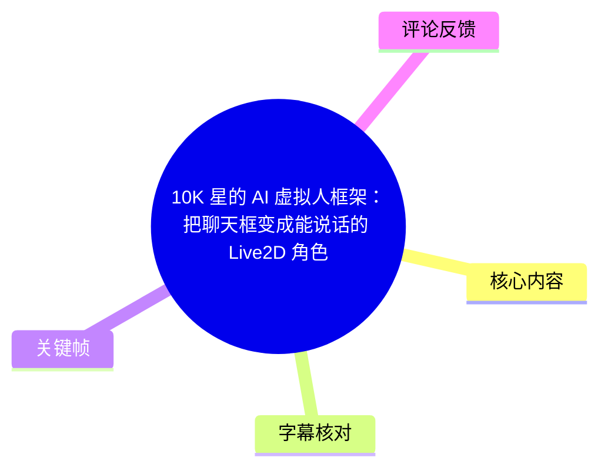
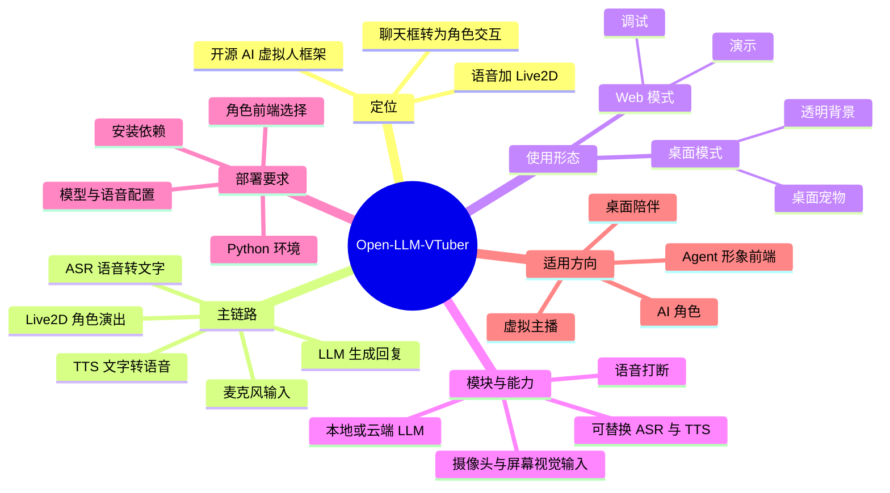
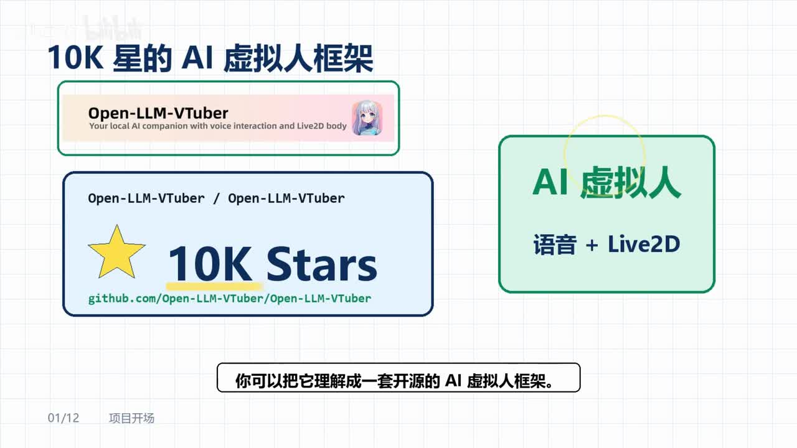
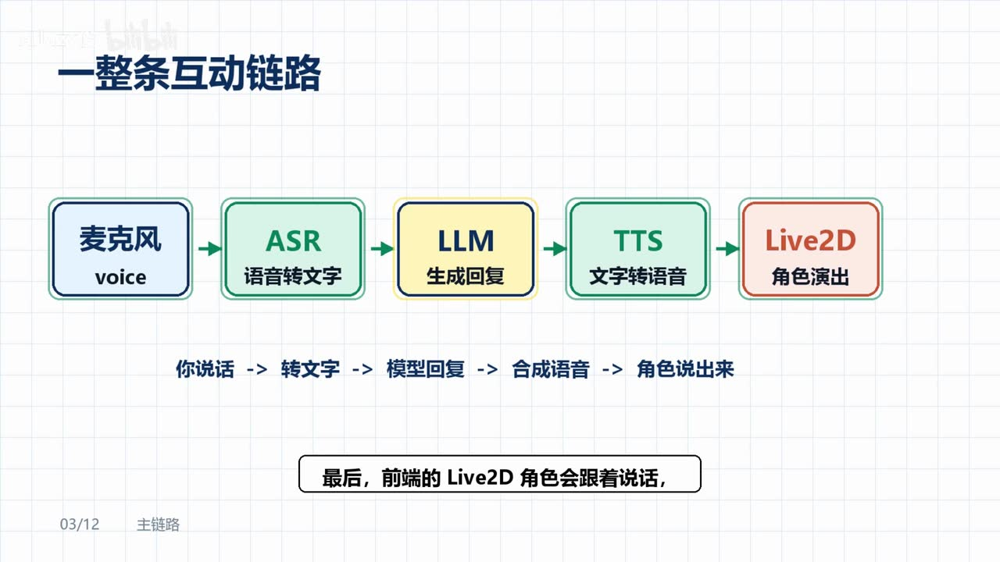
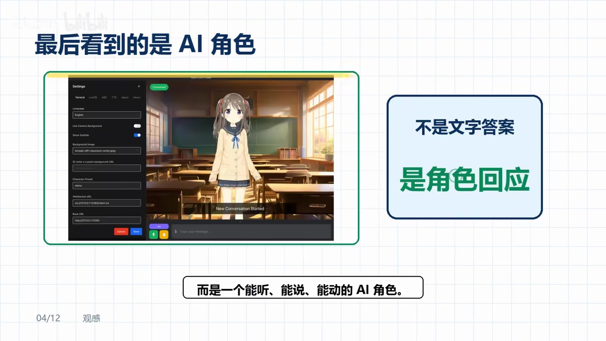

# 10K 星的 AI 虚拟人框架：把聊天框变成能说话的 Live2D 角色

> 来源：[Bilibili 视频](https://www.bilibili.com/video/BV1dNEu6vE3d) 
> UP 主：AIlazy俊｜时长：2 分 48 秒｜合集：AIcode  
> 项目地址（视频简介提供）：<https://github.com/Open-LLM-VTuber/Open-LLM-VTuber>

## 小结

视频介绍了开源 AI 虚拟人框架 **Open-LLM-VTuber**。其重点并非单独的 Live2D 形象，而是将麦克风输入、语音识别（ASR）、大语言模型（LLM）、语音合成（TTS）与 Live2D 角色前端串为一条可交互的链路：用户说话后，角色可以以语音、表情和动作形式回应。

从视频的架构说明看，系统流程为：**麦克风语音 → ASR 转文字 → LLM 生成回复 → TTS 合成声音 → Live2D 角色演出**。因此最终交付物不是普通聊天窗口中的文本，而是“能听、能说、能动”的角色界面。

视频给出两类使用形态：浏览器中的 Web 模式，适合调试和演示；以及可透明背景显示在屏幕边缘的桌面模式，定位为桌面宠物或桌面陪伴角色。它也被描述为可扩展至桌面助手、虚拟主播、AI 角色伙伴和带形象的 Agent 前端。

框架的工程价值在于模块化：视频称 LLM 可对接 Ollama 一类本地模型、OpenAI 兼容接口，以及 ASR/TTS 的本地或云端方案；使用者可以在隐私、本地算力、延迟、部署复杂度和 API 成本之间做选择。视频还提到语音打断与视觉输入（摄像头、录屏、截图）等能力。

它并不是“一键安装”的消费级工具。视频明确提示，首次运行需要准备 Python 环境、安装依赖、配置模型与语音模块、选择角色前端。真正需要理解的是 ASR、LLM、TTS、Live2D 分别负责什么，以及它们如何连接，而不是只记住启动命令。

“10K Stars”是画面中的项目宣传信息，反映的是视频制作/抓取时点的展示，GitHub Star 数会持续变化，不能将其视为当前实时值。模型服务、支持的供应商、安装方式与功能边界也可能随着项目版本迭代而变化；本文仅记录视频及其提供素材中出现的说法。

## 思维导图

## 目录

- [项目定位：从聊天文本到 AI 角色](#项目定位从聊天文本到-ai-角色)
- [互动主链路：ASR、LLM、TTS 与 Live2D](#互动主链路asrllmtts-与-live2d)
- [两种使用模式与可扩展场景](#两种使用模式与可扩展场景)
- [模块可替换性：本地部署与云端 API](#模块可替换性本地部署与云端-api)
- [交互能力：语音打断与视觉输入](#交互能力语音打断与视觉输入)
- [部署步骤、参数维度与限制](#部署步骤参数维度与限制)
- [适用人群、时效性与结论](#适用人群时效性与结论)
- [字幕比对](#字幕比对)
- [评论分析](#评论分析)
- [处理记录](#处理记录)

## 项目定位：从聊天文本到 AI 角色 [00:00:34](https://www.bilibili.com/video/BV1dNEu6vE3d?t=34)

视频将 Open-LLM-VTuber 定义为“一套开源的 AI 虚拟人框架”。其要解决的问题是：普通 AI 应用常以聊天框和文字答复为终点，而这个框架要将回复呈现为一个有声音、有动作、有表情的角色。

视频开场画面将项目概括为“AI 虚拟人：语音 + Live2D”，并显示项目名 `Open-LLM-VTuber`、GitHub 路径以及“10K Stars”的展示性信息。这里的“10K”应理解为视频画面陈述，而不是本文对当前仓库星标数的核验结果。

> 图：画面同时呈现项目名称、GitHub 路径、“10K Stars”与“AI 虚拟人 / 语音 + Live2D”的定位。它有助于区分：视频讨论的是整套虚拟人交互框架，而不只是一个 Live2D 模型或聊天机器人界面。

视频认为，用户看到的最终结果不应只是“冷冰冰的回答”，而应是一个可听、可说、可动的 AI 角色。这是体验层的定位；是否自然、实时或稳定，仍取决于所接入的模型、语音服务、前端角色资源与硬件/网络条件，视频没有给出量化性能数据。

## 互动主链路：ASR、LLM、TTS 与 Live2D [00:01:00](https://www.bilibili.com/video/BV1dNEu6vE3d?t=60)

视频用一条明确的数据流解释框架：

| 顺序 | 模块 | 视频中的职责 | 输入 → 输出 |
| --- | --- | --- | --- |
| 1 | 麦克风 / voice | 接收用户说话 | 声音 |
| 2 | ASR | 将语音转成文字 | 声音 → 文本 |
| 3 | LLM | 理解文本并生成回复 | 文本 → 回复文本 |
| 4 | TTS | 将回复读出来 | 回复文本 → 合成语音 |
| 5 | Live2D | 让角色随语音进行呈现 | 语音/状态 → 角色演出 |

> 图：该图直接给出“麦克风 → ASR → LLM → TTS → Live2D”的模块顺序，并标明“你说话 → 转文字 → 模型回复 → 合成语音 → 角色说出来”。这是理解项目架构、排查故障归属和替换组件时最关键的框架图。

这一拆分意味着不同问题应归属到不同层处理：

- **识别不准**：优先检查 ASR、麦克风输入、语言设置和噪声环境。
- **回答质量或人设不稳定**：优先检查 LLM、提示词、上下文及所接模型服务。
- **声音不自然或无法播放**：检查 TTS 选择、音频输出及语音服务配置。
- **角色不动、口型/表情不协调**：检查 Live2D 前端与其接收的音频或状态数据。
- **整体响应慢**：需要沿链路定位，可能来自识别、模型推理、云端网络调用、语音合成或前端渲染中的任一环节；视频未提供各环节延迟参数。

> 图：画面高亮 Live2D 环节，并以“最后，前端的 Live2D 角色会跟着说话”强调：Live2D 位于输出呈现端，不承担语音识别、内容生成或语音合成职责。

视频特别指出，Live2D “只是外壳”，真正麻烦的工作是把 ASR、LLM、TTS 与角色前端全部接通。对开发者而言，这一判断具有实践意义：选择角色资源并不等于完成 AI 虚拟人产品，接口联调、状态同步、异常处理与配置管理才是集成成本的主要来源。

## 两种使用模式与可扩展场景 [00:00:36](https://www.bilibili.com/video/BV1dNEu6vE3d?t=36)

视频介绍两种使用方式：

1. **Web 模式**：在浏览器中打开，适合调试和演示。
2. **桌面模式**：可做成透明背景的桌面宠物，将角色放在屏幕边缘，并在工作期间进行互动。

这两种模式对应不同的使用诉求：

| 模式 | 视频给出的用途 | 可直接得出的特点 |
| --- | --- | --- |
| Web | 调试、演示 | 更适合快速查看页面、调整配置和展示功能 |
| 桌面 | 屏幕边缘陪伴、桌面宠物 | 更强调常驻展示与角色化交互 |

> 图：画面展示带设置面板的角色界面，右侧文字强调“不是文字答案，是角色回应”。它说明 Web 界面并非只输出聊天内容，而是将角色形象作为回复载体；但图中具体角色、界面字段和服务地址不应被泛化为所有部署的默认配置。

在场景扩展上，视频列出以下方向：

- 桌面助手；
- 虚拟主播；
- AI 角色伙伴；
- 带有形象的 Agent 前端。

这些属于视频提出的应用定位，而不是对已完成产品能力、商业可用性或稳定性的独立验证。尤其“虚拟主播”场景通常还会涉及推流、审核、内容安全、角色授权和长时稳定运行等问题，视频并未展开。

## 模块可替换性：本地部署与云端 API [00:01:24](https://www.bilibili.com/video/BV1dNEu6vE3d?t=84)

视频称该项目已将关键模块拆分，因此可以针对模型和语音方案进行替换：

- **LLM 侧**：提到 Ollama 本地模型与 OpenAI 兼容接口；ASR 语音中还提及若干云端服务名称，但识别文本对部分专有名词存在不确定性，详见“字幕比对”。
- **语音侧**：ASR 与 TTS 可以更换为不同方案。
- **部署路径**：
  - 希望本地运行：选择本地模型与本地语音方案；
  - 希望降低部署操作：接入云端 API。

这一选择可以按以下维度评估；其中“视频已明确陈述”的是本地/云端均可选，其余为基于该架构作出的工程分析，不代表视频提供了具体参数或性能承诺：

| 决策维度 | 本地方案通常侧重 | 云端 API 通常侧重 |
| --- | --- | --- |
| 部署准备 | 本地运行环境、模型文件、硬件与服务配置 | API Key、服务商账户与网络连通性 |
| 数据路径 | 可减少音频/文本向外部服务传输的需求 | 请求通常需发往服务商接口 |
| 使用门槛 | 前期配置与运维工作更多 | 前期接入通常更省事 |
| 成本结构 | 主要是本地硬件与维护投入 | 可能随调用量计费 |
| 依赖条件 | 本地算力、磁盘和兼容性 | 网络质量、服务商可用性与配额 |

需要注意：视频没有列出支持版本、模型清单、上下文长度、显存要求、API 价格、并发量或端到端响应时间。因此不能据此推断任意模型或任意云服务均可直接接入。

## 交互能力：语音打断与视觉输入 [00:01:49](https://www.bilibili.com/video/BV1dNEu6vE3d?t=109)

视频列举了两个更适合展示实时交互的功能。

### 语音打断

当 AI 正在朗读回复时，用户可以直接插话，而不必等待整段语音播放完成。视频将此称为“语音打断”。

从链路角度看，这意味着系统至少需要在 TTS 播放或角色演出期间继续处理新的输入，并能中止、取消或切换当前回复状态。视频没有说明其具体实现方式，例如是否采用流式 ASR、如何停止音频队列、是否保留被打断的上下文，以及在不同后端配置下是否都可用。

### 视觉能力

视频称系统可连接：

- 摄像头；
- 屏幕录制；
- 截图。

这些输入让角色“看到”用户或当前屏幕内容，因此系统可不止于语音陪聊，也能向桌面助手或具备视觉感知的 Agent 前端扩展。

但应注意视频没有披露视觉模型、图像上传路径、权限机制、保存策略或隐私控制。若启用摄像头、录屏或截图，实际部署时必须自行确认系统权限、敏感信息暴露范围、云端传输及第三方服务的数据处理规则。

## 部署步骤、参数维度与限制 [00:02:13](https://www.bilibili.com/video/BV1dNEu6vE3d?t=133)

视频没有展示可逐行复现的命令、配置文件样例或版本号，因此不应编造安装命令。它给出的首次运行准备顺序可以整理为以下清单：

1. **准备 Python 环境**：视频明确提到需要 Python 环境，但未说明 Python 版本、虚拟环境工具或操作系统要求。
2. **安装项目依赖**：ASR 将此处识别为“安装……”，结合上下文可确定其表达的是安装环节；但具体依赖管理命令未在素材中给出。
3. **配置 LLM**：选择本地模型或云端/OpenAI 兼容接口，并填入相应连接配置。
4. **配置语音能力**：分别确定 ASR 与 TTS 使用的方案。
5. **选择角色前端**：配置 Live2D 角色，使其承担最终的视觉演出。
6. **联调整条链路**：验证麦克风输入、识别结果、模型回复、语音播放与角色动作是否能连续衔接。

### 首次部署的排查顺序

视频给出的核心经验是：不应只关注“命令难不难”，而应理解每个模块负责的部分。依据该思路，可按链路逐段验证：

1. 麦克风是否能采集到声音；
2. ASR 是否能返回正确文本；
3. LLM 是否能基于文本生成回复；
4. TTS 是否能将回复合成为可播放声音；
5. Live2D 是否会随输出语音或状态进行表情、动作呈现；
6. 再测试语音打断、摄像头、录屏或截图等附加功能。

### 视频明确的限制

- 该项目**不是一键安装的小工具**。
- 首次部署涉及 Python、依赖、模型、语音、角色前端等多个配置面。
- 关键难点是模块间集成，而不只是 Live2D 外观。
- 视频未给出任何安装命令、环境版本、性能基准、支持平台、角色授权要求或故障案例。

因此，本文不能提供“复制即运行”的命令，也不能保证某一配置组合可在读者设备上成功运行。需要以项目仓库在实际使用时的 README、发行版和配置说明为准。

## 适用人群、时效性与结论 [00:02:13](https://www.bilibili.com/video/BV1dNEu6vE3d?t=133)

视频推荐该框架给以下需求的人群：

- 正在制作 AI 角色；
- 希望搭建虚拟主播；
- 制作桌面陪伴角色；
- 想为已有 Agent 加上“能说话的外壳”。

可迁移的经验是：构建 AI 虚拟人时，应把它视为一个由输入、理解、生成、语音输出与视觉表现组成的系统，而不是把 Live2D 当成全部。把 ASR、LLM、TTS、Live2D 的职责边界先画清楚，才能有效选择本地/云端后端、定位延迟或报错、控制隐私与成本，并决定角色化呈现是否真的有必要。

时效方面，本视频元数据抓取于 2026-07-15，视频发布信息按元数据时间戳换算为 2026-06-08；项目 Star 数、可接入的模型与服务商、依赖版本、安装脚本和视觉能力均可能在后续发生变化。视频简介提供的仓库地址是后续核对实时文档的唯一明确入口。

## 字幕比对 [00:00:34](https://www.bilibili.com/video/BV1dNEu6vE3d?t=34)

| 字幕来源 | 完整性 | 专有名词 | 时间轴 | 主要问题 |
| --- | --- | --- | --- | --- |
| Bilibili 站内字幕 | 未提供可用站内字幕，无法比对 | 无法评价 | 无法评价 | 素材中没有可用站内字幕文件 |
| 本次 ASR 字幕 | 共 7 段，语音覆盖约 133.31 秒，占音频时长约 79.66%；首段语音 00:00:33.570，末段 00:02:47.010 | 项目名、Ollama、部分云服务名存在连写或误识别 | 具备 SRT 真实起止时间，可用于本页时间轴 | 每段过长、缺少标点；“语英合成”“大模形”“安裁 E-Line”等存在明显识别误差 |

本次 ASR 使用 `medium` 模型，识别语言为中文，语言置信度约 `0.9995`，运行于 CUDA / float16；素材诊断未标记 `noAudioStream=true`，且提供了真实音频流与带时间戳的 ASR 分段。因此本文以 **本次 ASR 的 SRT 起止时间** 作为时间轴依据，而非按文字顺序猜测。

站内字幕未提供，无法进行逐句校验。正文中对以下内容进行了谨慎规范或保留：

| ASR 原文片段 | 正文处理 | 依据与说明 |
| --- | --- | --- |
| `OpenLL MVTuber`、`OpenLL MvTuber` | 统一为 **Open-LLM-VTuber** | 视频简介项目 URL 与关键帧均显示该拼写 |
| `语英合成` | 统一为 **语音合成（TTS）** | 关键帧明确标有“文字转语音”，上下文亦为 TTS |
| `大模形` | 统一为 **大模型（LLM）** | 关键帧明确标有 LLM“生成回复” |
| `OLAMA` | 记为 **Ollama** | 视频语境为本地模型接入；正文同时避免延伸到未给出的接入细节 |
| `Cloud Gem ini DeepSec` | 保留为“ASR 提及的若干云端服务”，不将其全部强行校正 | 其中专名缺乏站内字幕或清晰关键帧交叉验证；不应据猜测写成确定事实 |
| `安裁E-Line` | 仅概括为“安装依赖/安装环节” | ASR 可确认该处讲部署准备，但无法从现有素材可靠还原具体工具或命令 |

ASR 在 00:00:00 至 00:00:33.570 前没有检测到语音，且原始素材未提供该段的站内字幕；因此本文不为开头静音/画面部分编造口播内容。

## 评论分析 [00:02:37](https://www.bilibili.com/video/BV1dNEu6vE3d?t=157)

仅处理可获取的热评前三条。评论是用户观点或个人实践陈述，并非经过本文验证的项目事实。

1. **早见空里**（2 赞）  
   评论提到“omni realtime”，并建议再做一个类似 “open llm realtime talk” 的方向。该评论反映出观众将本项目与实时多模态/实时语音交互方案联系起来，也暗示实时对话可能是进一步关注点。评论没有提供技术细节、链接或测试结果，不能据此认定两者能力等价或存在直接替代关系。

2. **demoCN**（1 赞）  
   评论者称自己做了一个手机端、3D 形态的类似方案，且 ASR/TTS “也是端测的”。这是关于个人项目的自述，可作为“移动端 + 端侧语音能力”这一实现方向的补充案例；但未提供代码、性能数据、模型名称或复现条件，无法验证其与视频框架在功能和架构上的“其他没差”这一判断。

3. **今天也开心的哟**（0 赞）  
   评论内容为对其他用户的提及及表情，没有提供关于 Open-LLM-VTuber、部署方法或技术路线的可分析信息。

评论区总体没有对视频提出的模块链路、安装要求或视觉能力形成实质性技术争议；可用信息主要是观众对实时交互和端侧部署方向的延伸讨论。

## 评论分析

- 热评 1：现在不是有了omni realtime吗？[doge][doge][doge]再做一个open llm realtime talk[吃瓜][吃瓜][吃瓜]
- 热评 2：撸了个手机端的，不过是3d的，其他没差，asr tts也是端测的
- 热评 3：@遗篇 🥲

以上内容是观众反馈摘录，只用于补充理解视频反响，不作为正文事实依据。

## 处理记录

- Worker ID：`worker-mrj0wbly-5dc4e50c`
- 模型：`gpt-5.6-terra`
- 调用工具与素材：素材编排结果中的 `merged.mp4`、`audio/audio.wav`、`asr/transcript.srt`、`asr/asr-result.json`、关键帧目录 `frames/`、评论文件 `comments/comments.json`；ASR 模型为 `medium`（CUDA / float16）。
- 字幕选择：未提供可用 Bilibili 站内字幕；已检查本次 ASR 结果。采用 ASR SRT 的真实起止时间生成时间轴，并依据视频简介与关键帧对项目名、ASR/TTS/LLM 等明显术语进行有限校正；无法验证的云服务专名不作强行补全。
- 关键帧选择依据：`frame-001.jpg` 用于项目名称、GitHub 路径和“10K Stars”展示；`frame-002.jpg` 用于完整模块链路；`frame-003.jpg` 用于强调 Live2D 的输出呈现角色；`frame-004.jpg` 用于说明“角色回应”而非纯文本回答。图片均按内容对应关系插入，未根据画面顺序虚构精确出现秒数。
- 缓存清理：未提供缓存清理执行记录，无法确认是否已清理；本文不将其表述为已完成。
- 未解决问题：未提供安装命令、配置文件、依赖与模型版本、性能参数、各云服务名的清晰原文、视觉数据处理机制及角色资源授权信息；需以后续项目仓库实时文档为准。
