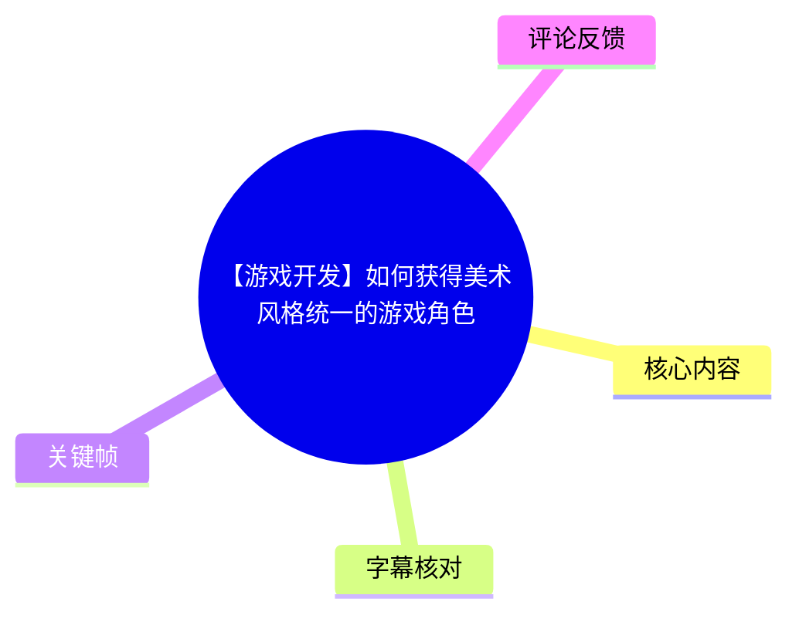
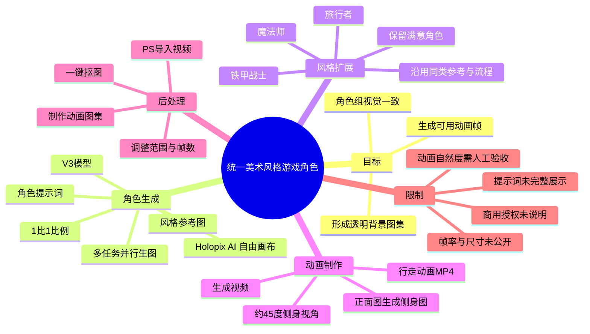
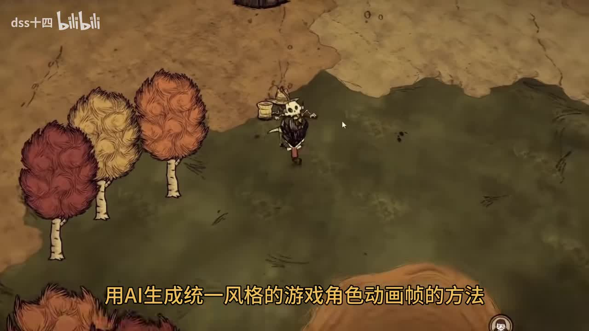
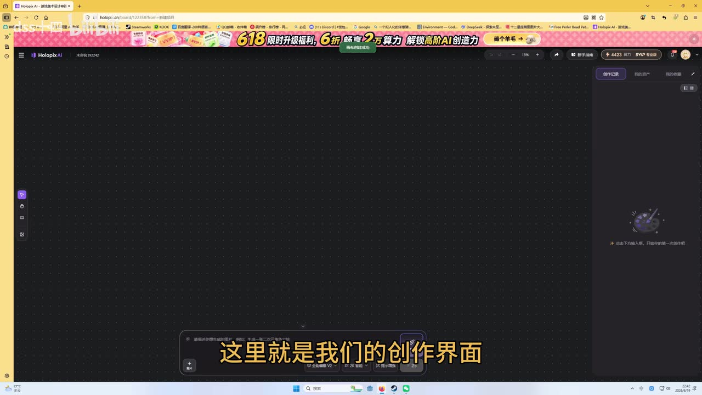
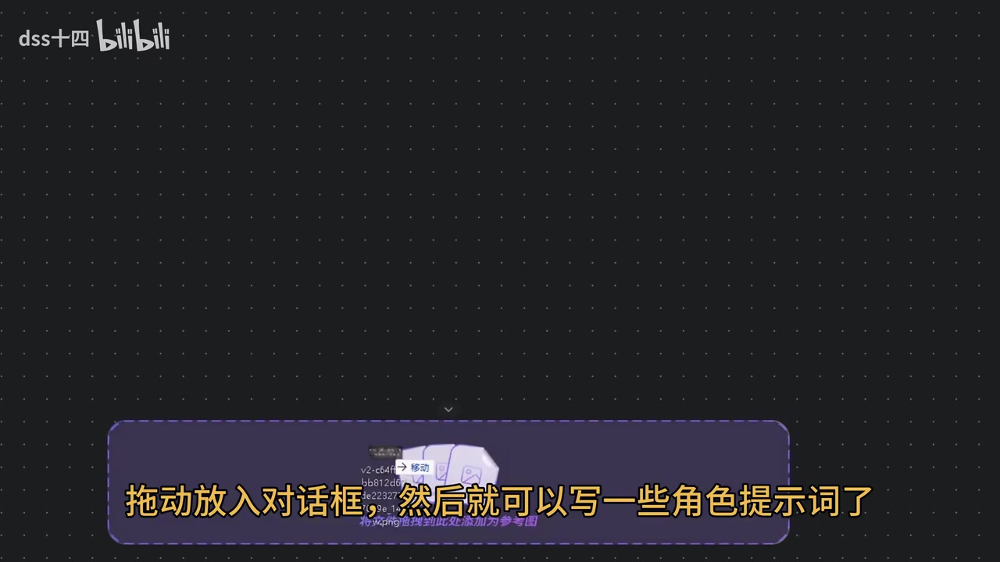
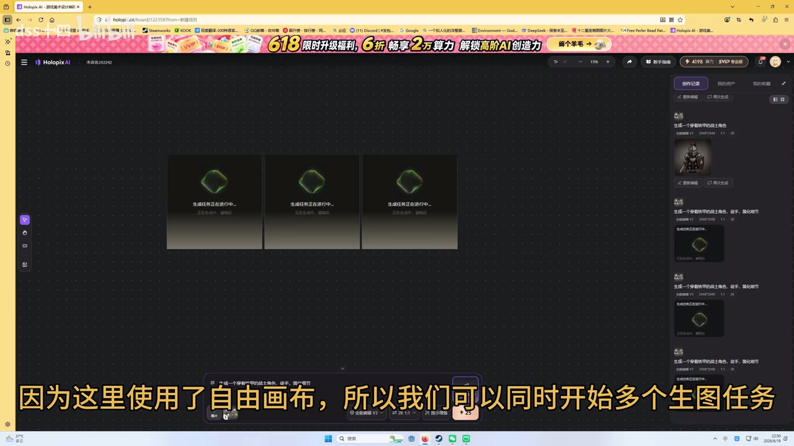

# 【游戏开发】如何获得美术风格统一的游戏角色

> 来源：[Bilibili 视频](https://www.bilibili.com/video/BV1uhTF6qEpA) 
> UP 主：dss十四｜发布时间：2026-07-01｜时长：02:57｜分辨率：3840 × 2160

## 小结

视频演示了一条以 **Holopix AI 的“自由画布”**为生成入口、结合 Photoshop（PS）整理动画帧的游戏角色资产制作流程。目标不是只生成一张角色概念图，而是产出一组**美术风格相对统一、可进一步用于游戏的角色动画资源**。

核心做法是：先准备一张或多张风格参考图，在自由画布中通过角色提示词生成角色；利用同一参考与重复生成，扩充出铁甲战士、魔法师、旅行者等不同设定但视觉语言一致的角色组；随后基于正面角色图生成约 45 度侧身视角，再使用“生成视频”制作行走动画。

视频把“可用资源”的后处理分为三步：将生成的 MP4 导入 PS、调整动画范围及大致帧数、整理为动画图集（sprite sheet）；最后回到 Holopix AI 对图集执行一键抠图，从而得到透明背景的角色动画帧。该流程适合需要快速制作原型、独立游戏素材或统一风格角色草案的开发者与美术人员。

值得注意的是，视频展示的是操作路径和示例结果，并未给出提示词全文、精确帧率、图集尺寸、导出格式、Unity 导入设置、生成成本或商用授权条款。因此，动画流畅度、资产可直接上线程度及版权/商业使用资格，均不能仅凭本视频确认。

工具界面、模型版本与“注册领取免费算力”的活动均属于发布时点信息，可能随平台更新变化；视频中明确提到的生成模型为 **V3**、画面比例为 **1:1**，但未说明其完整模型名称或后续版本兼容性。

## 思维导图

## 目录

- [背景、目标与适用边界](#背景目标与适用边界)
- [建立统一风格的角色生成基线](#建立统一风格的角色生成基线)
- [批量扩展角色组](#批量扩展角色组)
- [从角色图到行走动画](#从角色图到行走动画)
- [PS 整理动画帧与图集](#ps-整理动画帧与图集)
- [一键抠图与最终资源](#一键抠图与最终资源)
- [完整操作清单](#完整操作清单)
- [参数、经验与限制](#参数经验与限制)
- [字幕比对](#字幕比对)
- [评论分析](#评论分析)
- [处理记录](#处理记录)

## 背景、目标与适用边界 [00:00:00](https://www.bilibili.com/video/BV1uhTF6qEpA?t=0)

视频开场将问题定位为：如何使用 AI 生成一组**风格统一的游戏角色动画帧**。这里的“统一”并不等同于角色外观完全相同，而是让不同职业、服装和造型的角色共享相近的绘画质感、轮廓语言、配色倾向与画面表达。

演示开头以一段俯视角游戏画面作为成品语境：角色处于手绘感地图场景中，画面带有统一的描边与纸张质感。这说明教程所追求的不是高精度 3D 骨骼动画，而是可用于俯视角或斜俯视角游戏的 2D 角色视觉资源。

> 图：开场画面呈现了角色置于游戏场景中的效果。它的价值在于明确最终资产的使用语境：角色不仅要单张好看，还要能与场景画风协调，并具备动画帧资源的形态。

视频未展示 Unity 工程、导入器配置或实际运行逻辑。虽然视频标签含有 `UNITY`，但本片实际重点是 AI 美术资产生成与预处理，而非 Unity 的具体实现。

## 建立统一风格的角色生成基线 [00:00:00](https://www.bilibili.com/video/BV1uhTF6qEpA?t=0)

### 1. 打开 Holopix AI 并进入自由画布 [00:00:08](https://www.bilibili.com/video/BV1uhTF6qEpA?t=8)

作者打开 Holopix AI，并说明可以通过浏览器直接使用。随后选择“自由画布”，将其作为整个制作流程的创作界面。

画面中可见深色点阵画布、左侧工具栏、底部输入区域与右侧创作记录区域。视频的工作方式是把参考图、生成结果及后续图集放入同一画布流程中，而不是单纯在单轮对话窗口里完成操作。

> 图：该帧展示了 Holopix AI 的自由画布工作区。它说明视频的主要操作载体是画布式界面，后续的参考图输入、生成任务与一键抠图都在这一环境中完成。

### 2. 准备风格参考图 [00:00:20](https://www.bilibili.com/video/BV1uhTF6qEpA?t=20)

作者提出，创建第一个角色时需要准备**一张或多张风格参考图**。如果没有现成参考图，视频称可以使用“一键成稿”功能生成参考。

参考图在本流程中承担的是风格锚点：后续不同职业角色不必复制同一外貌，但应持续依附于同一组视觉参照。视频没有展开讲解如何挑选参考图，也没有给出权重、参考强度或图像混合比例等控制参数。

### 3. 拖入参考图并输入角色提示词 [00:00:25](https://www.bilibili.com/video/BV1uhTF6qEpA?t=25)

将参考图拖入对话框后，输入角色提示词。作者以“铁甲战士”为首个生成对象，并在视频中明确展示/说明以下设置：

| 项目 | 视频内容 |
| --- | --- |
| 角色示例 | 铁甲战士 |
| 画面比例 | 1:1 |
| 生成模型 | V3 |
| 风格控制 | 使用一张或多张风格参考图 |
| 操作环境 | Holopix AI 自由画布 |

视频没有公开完整 prompt 文本，因而无法复现其角色描述、负面词、风格词、镜头词或质量词的准确组合。实际使用时，应将“角色身份/装备/姿态”等可变内容与“线条、材质、色彩、视角”等稳定风格内容分开管理，避免每次创建新角色时重写风格基线。

> 图：画面字幕说明“拖动放入对话框，然后就可以写一些角色提示词了”。它直接对应参考图输入与文字提示词组合这一关键操作，是统一风格生成的起点。

### 4. 用并行生图提高候选质量 [00:00:42](https://www.bilibili.com/video/BV1uhTF6qEpA?t=42)

作者强调，自由画布可同时开启多个生图任务；多次生成并不是为了随机堆量，而是为了提高获得符合预期结果的概率。视频画面中并列显示了三个正在生成的任务卡片。

这一策略针对的是 AI 图像生成的不确定性：即便使用相同参考和相近提示词，角色服装细节、五官、轮廓、视角仍会发生偏移。并行生成后，应从候选中选择最符合当前风格基线的一张保留，而不是仅挑选局部“最华丽”的图。

> 图：该帧显示三个并行生成任务，并且画面字幕明确说明可同时开始多个生图任务。它为“多候选筛选”这一经验提供了直接画面依据。

## 批量扩展角色组 [00:00:48](https://www.bilibili.com/video/BV1uhTF6qEpA?t=48)

生成完成后，作者提到已经获得三个具有固定特征的角色形象，并从中选择一个满意的结果保留。之后以相同方式继续创建不同特征的角色。

视频举出的后续角色示例包括：

- 魔法师形象；
- 旅行者形象；
- 前文的铁甲战士形象。

作者的结论是：通过共享风格参考图、保持相似生成流程，并在候选中筛选，可得到一套美术风格统一的游戏角色。

这里可迁移的经验是，统一风格应由一套可复用的“生成基线”维持：

1. **固定或小范围固定参考图**：尽量不要在每个角色上更换完全不同的参考来源。
2. **固定核心视觉描述**：即使职业变化，画风、线条、材质、色彩与镜头表达应尽可能稳定。
3. **只替换角色变量**：如装备、职业、发型、服饰、道具与身份设定。
4. **建立筛选标准**：对比例、视角、边缘完整度、武器遮挡、服饰可读性和与现有角色的相似度进行验收。
5. **优先保留“可扩展”的角色图**：后续还需要从正面图生成侧身图与动画，初始图的轮廓清晰度会影响后续成功率。

不过，上述第 1—5 点是基于视频流程提出的实践整理，不代表视频已验证每种风格、每个角色类别都能稳定实现一致性。

## 从角色图到行走动画 [00:01:12](https://www.bilibili.com/video/BV1uhTF6qEpA?t=72)

### 1. 为什么要生成侧身图 [00:01:12](https://www.bilibili.com/video/BV1uhTF6qEpA?t=72)

作者指出，已有角色图后，如果要将其加入游戏，还需要制作可用的角色动画帧。视频称通常使用约 **45 度侧身视角**为角色添加动画，因此需要先由角色正面图生成侧身图。

这一步的本质是建立更符合游戏移动阅读习惯的角色朝向。对于俯视角、斜俯视角或等距视角项目，完全正面的立绘通常不适合作为行走帧的基础；侧向或斜侧向轮廓更容易呈现迈步动作，也更便于识别装备与移动方向。

### 2. 以角色图作为参考生成侧身形象 [00:01:29](https://www.bilibili.com/video/BV1uhTF6qEpA?t=89)

操作方式是点击一张角色图片，选择“作为参考”，然后输入提示词直接生成。视频未展示侧身生成所使用的完整提示词，也未披露是否存在姿态控制、角色一致性锁定或种子复用等机制。

因此，若要把该步骤用于实际项目，应特别检查：

- 身体朝向是否符合项目的固定方向；
- 武器、盾牌、背包等关键道具是否在侧身图中被错误替换；
- 服装颜色与纹样是否延续正面图；
- 人物比例、头身比与原始角色是否一致；
- 四肢与轮廓是否完整，能否承受后续视频生成的形变。

### 3. 由侧身图生成行走动画 MP4 [00:01:41](https://www.bilibili.com/video/BV1uhTF6qEpA?t=101)

获得侧身角色后，作者选择该图并点击“生成视频”，输入视频提示词，输出角色行走动画。最终得到一个角色动画 MP4。

视频展示的是“侧身静态图 → AI 视频 → 行走 MP4”的转换链路。其优势是减少逐帧手绘的起步成本；但 MP4 本身仍是视频资产，尚不能直接等同于游戏引擎中的精灵图或帧动画资源，还需要后续抽帧、裁切、图集整理及透明背景处理。

评论区中“行走动画好生硬啊”的反馈也提示：AI 生成视频得到的运动结果需要人工验收，不能因已经导出 MP4 就默认满足游戏动画质量标准。

## PS 整理动画帧与图集 [00:02:05](https://www.bilibili.com/video/BV1uhTF6qEpA?t=125)

作者将下载的行走动画 MP4 导入 Photoshop。视频中明确提到的处理动作包括：

1. 将下载好的 MP4 导入 PS；
2. 选择“导入视频帧到图层”（ASR 识别为“导入视频进到图层”，结合语境整理）；
3. 调整动画范围；
4. 调整或控制大致帧数；
5. 得到可用动画资源；
6. 为方便管理，进一步制作动画图集。

在游戏开发中，这个阶段的作用是将连续视频转换成离散、可被引擎逐帧播放的图像序列。视频没有说明每秒抽取多少帧、每个循环保留几帧、是否删除重复帧、是否统一画布尺寸、是否进行像素对齐，因而这些参数需根据项目另行确定。

建议将视频中的“大致帧数调整”理解为必要但未量化的筛选步骤：帧数过少会造成动作跳跃，帧数过多会增加图集体积、播放控制复杂度与冗余帧风险。具体取值不能从本视频推导。

## 一键抠图与最终资源 [00:02:05](https://www.bilibili.com/video/BV1uhTF6qEpA?t=125)

作者将制作好的动画图集拖回 Holopix AI 的自由画布，并选择“一键抠图”去除背景。视频将这一步作为流程的最后阶段。

抠图后的目标是将角色与原背景分离，使图集具备透明背景，便于叠加到不同游戏地图、UI 或特效层中。作者称此操作“非常方便”，但没有展示抠图边缘放大检查、半透明像素处理、阴影保留策略、批量图块分割或导出文件格式。

在实际项目中，应额外检查以下问题：

| 检查项 | 原因 |
| --- | --- |
| 发丝、武器边缘和披风边缘 | AI 抠图容易产生锯齿、残边或错误透明区域。 |
| 角色脚底位置 | 各帧脚底基准不一致会导致游戏中出现上下抖动。 |
| 图集内每帧边界 | 若图块边缘残留相邻帧像素，播放时可能出现串帧。 |
| 半透明阴影 | 透明度处理不当可能导致阴影消失、变黑或出现白边。 |
| 动画循环首尾 | 第一帧与最后一帧姿态不连续时，循环播放会产生跳变。 |

## 完整操作清单 [00:00:08](https://www.bilibili.com/video/BV1uhTF6qEpA?t=8)

以下按视频实际演示顺序整理为可执行清单：

1. 在浏览器中打开 Holopix AI。
2. 进入“自由画布”。
3. 准备一张或多张风格参考图；没有参考图时，视频建议使用“一键成稿”生成参考。
4. 将风格参考图拖入对话框。
5. 输入角色提示词，以铁甲战士为示例。
6. 设置画面比例为 **1:1**，选择 **V3** 模型。
7. 启动生成，并在自由画布中同时开启多个生图任务。
8. 在多个候选中保留满意的角色结果。
9. 重复同类流程，创建魔法师、旅行者等不同设定的角色，形成角色组。
10. 选择一张角色正面图，点击“作为参考”。
11. 输入提示词，生成约 45 度侧身的角色图。
12. 选择侧身图，点击“生成视频”。
13. 输入视频提示词，输出角色行走动画 MP4。
14. 下载 MP4，导入 Photoshop。
15. 使用“导入视频帧到图层”或对应的逐帧导入方式。
16. 调整动画范围和大致帧数，形成可用帧序列。
17. 将帧序列制作成便于管理的动画图集。
18. 将动画图集拖回 Holopix AI 自由画布。
19. 选择“一键抠图”去除背景。
20. 获得透明背景的游戏角色动画帧；以相同思路可扩展待机、行走、攻击等动画。

视频末尾还提到自由画布提供角色换装、动作迁移、Q 版画等创作模板，并宣传注册可领取免费算力。该信息属于平台功能与活动宣传，使用前应以当前产品页面和实际账户规则为准。

## 参数、经验与限制 [00:02:30](https://www.bilibili.com/video/BV1uhTF6qEpA?t=150)

### 视频明确给出的参数与事实

| 类别 | 内容 | 证据范围 |
| --- | --- | --- |
| 工具 | Holopix AI | 视频讲解与界面画面 |
| 主要工作区 | 自由画布 | 视频讲解与界面画面 |
| 角色示例 | 铁甲战士、魔法师、旅行者 | 视频讲解 |
| 图像比例 | 1:1 | 视频讲解 |
| 图像模型 | V3 | 视频讲解 |
| 动画视角 | 通常采用约 45 度侧身视角 | 视频讲解 |
| 视频输出 | 角色行走动画 MP4 | 视频讲解 |
| 后处理工具 | Photoshop | 视频讲解 |
| 后处理目标 | 逐帧整理、动画图集、去背景 | 视频讲解 |
| 可扩展动作 | 待机、行走、攻击等 | 视频讲解 |

### 关键经验

- **统一性来自流程约束，而非一次生成。** 参考图、提示词基线、固定构图和筛选标准共同决定角色组的一致程度。
- **先做“可被动画化”的角色。** 角色正面图若轮廓不清、装备遮挡严重，后续侧身图与视频生成更容易失真。
- **并行生成有助于提升筛选空间。** 视频直接利用自由画布同时创建多个生图任务，避免将单次随机结果视作唯一答案。
- **视频生成只是中间产物。** MP4 要经过抽帧、范围选择、帧数控制、图集管理与抠图，才接近游戏可用资源。
- **图集管理是资产工程化的一步。** 作者特别提到为了方便管理而制作动画图集，说明资源组织与生成本身同样重要。

### 未被视频解决的限制

1. **商用权利不明确**：视频未说明参考图、生成图、视频生成结果及抠图结果的授权范围，不能据此判断是否可商用。
2. **第三方 IP 风险不明确**：对于迪士尼、小马宝莉等已有角色，视频没有给出生成许可或版权结论。
3. **动画质量未量化**：没有帧率、循环长度、动作幅度、骨骼一致性或稳定性指标。
4. **缺少引擎落地细节**：未展示 Unity 的 Sprite Editor、切片规则、Animator、导入压缩、Pivot 或排序层配置。
5. **缺少成本与性能数据**：未说明每次生成消耗的算力、等待时间、免费额度上限或并发限制。
6. **工具与活动具有时效性**：V3 模型、界面布局、功能入口、模板类型和免费算力活动均可能在发布后调整。

## 字幕比对

| 字幕来源 | 完整性 | 专有名词 | 时间轴 | 主要问题 |
| --- | --- | --- | --- | --- |
| Bilibili 站内字幕 `p01-ai-zh.srt` | 与本视频不匹配，仅覆盖 00:00:00—00:00:33 | 内容为“鸡血给新车做法”等，与游戏开发主题无关 | 分段时间有效，但对应错误内容，不能用于本片定位 | 疑似串入其他视频字幕，且只覆盖约 33 秒 |
| 本次 ASR 字幕 | 覆盖约 169.99 秒，占音频约 96.57%，覆盖主体流程 | 工具名、部分功能名和术语有误识别 | 8 个长分段，时间戳有效；可用于章节定位 | 分段较粗；“HOLUP IX / Hole of X”“角素动画针”等存在明显识别错误 |

本次 ASR 已检查：识别语言为中文，置信度约 `0.9780`；音频时长约 `176.02` 秒；未标记 `noAudioStream=true`，说明源视频存在可识别音轨。诊断显示首段语音约从 `00:00:00.500` 开始、末段至 `00:02:55.060`，未发现较大语音空档。

最终采用**本次 ASR 的时间轴**作为正文链接依据，原因是站内字幕内容明显与本视频主题不符。对 ASR 中的以下词语，结合标题、语境与关键帧界面进行了审慎校正：

| ASR 结果 | 正文采用写法 | 校正依据 |
| --- | --- | --- |
| `HOLUP IX AI`、`Hole of X` | Holopix AI | 关键帧浏览器标签和产品界面可见 “Holopix AI” |
| `角素动画针`、`動畫针` | 角色动画帧 | 上下文均指游戏角色逐帧动画资源 |
| `侧掀视角`、`侧伸形象` | 侧身/约 45 度侧身视角、侧身形象 | 语义与游戏角色行走动画制作流程一致；保留“约”避免过度确定 |
| `导录杠视频进到图层` | 导入视频帧到图层 | 与 Photoshop 常见操作及前后“调整动画范围和帧数”的语境相符 |
| `免费胜利` | 免费算力 | 前后文为平台注册福利宣传；此处属于语义校正 |

上述校正仅用于提高可读性；视频未提供完整可复制的提示词与操作菜单截图，无法对每个 UI 按钮名称作进一步确认。

## 评论分析

以下仅处理当前可获取的热评前三条，评论观点不等同于已验证事实。

| 评论 | 观点与价值 | 可信度/待验证事项 |
| --- | --- | --- |
| 林夕-神格-：「能商用吗」 | 直接指出教程最重要的落地问题之一：生成角色、参考图、视频与抠图结果是否可以用于商业项目。 | 视频未回答，评论也未提供平台条款或授权依据；必须查阅 Holopix AI 当前服务协议、素材来源授权与目标发行平台规则。 |
| ZhiTravelsNorth：「行走动画好生硬啊」 | 对生成结果的观感提出负面反馈，提醒使用者关注动作自然度与游戏内循环效果。 | 属于主观体验，但与 AI 视频可能出现动作僵硬、形变或循环不顺的问题相符；应通过逐帧预览和游戏内实测判断。 |
| 神烦狗_：「迪士尼，小马宝莉角色能生成不，要不要版权」 | 将问题扩展至知名 IP 角色生成及版权风险，反映用户对“能不能生成”和“能不能使用”之间差异的关注。 | 视频没有讨论特定 IP，也没有给出版权结论。即使工具能够生成相似形象，也不意味着可公开发布、商用或规避权利风险。 |

## 处理记录

- Worker ID：`worker-mrj0wjed-b0c290ad`
- 模型：`gpt-5.6-terra`
- 调用工具与素材：视频元数据、站内字幕 `p01-ai-zh.srt`、本次 ASR 结果 `asr/asr-result.json`、ASR 时间轴字幕 `asr/transcript.srt`、关键帧 `frames/frame-001.jpg` 至 `frames/frame-004.jpg`、热评数据 `comments/comments.json`。
- ASR 检查结果：已检查；识别模型为 `medium`，设备为 CUDA、计算类型为 float16；源视频存在音轨，未出现 `noAudioStream=true` 标记。
- 字幕选择：站内字幕与视频主题完全不符，未采用；采用本次 ASR 的真实时间分段作为正文时间轴基础，并结合关键帧和上下文校正工具名与少量术语。
- 关键帧选择依据：选用开场游戏内效果帧说明目标使用场景；选用自由画布界面帧说明主要工作区；选用参考图拖入/提示词帧说明输入方法；选用并行任务帧说明多任务生图经验。未对未提供画面证据的具体 UI 状态作虚构描述。
- 评论处理范围：仅分析可获取热评前三条，未扩展至其他评论。
- 缓存清理：素材清单未提供缓存清理执行记录；本文不将其虚构为已完成。
- 未解决问题：完整提示词、视频提示词、V3 的具体版本定义、生成成本、帧率、图集尺寸、导出格式、Unity 接入参数、抠图质量控制及商用/第三方 IP 授权均未在素材中提供。
