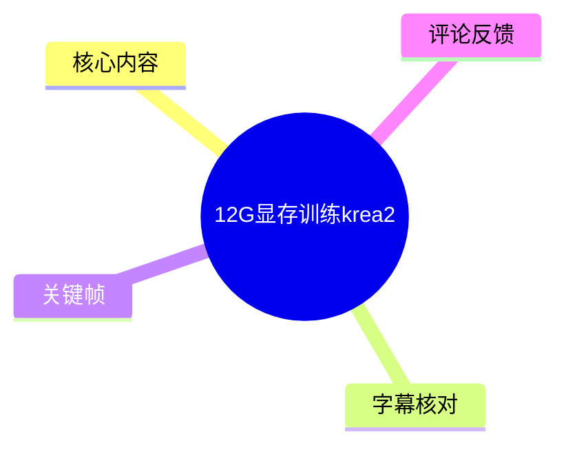
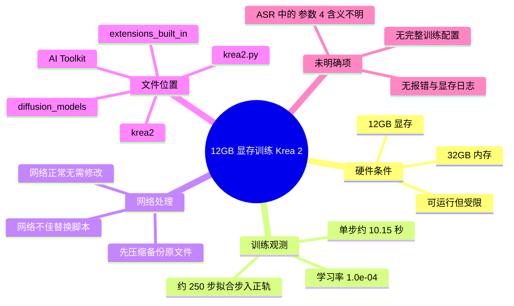
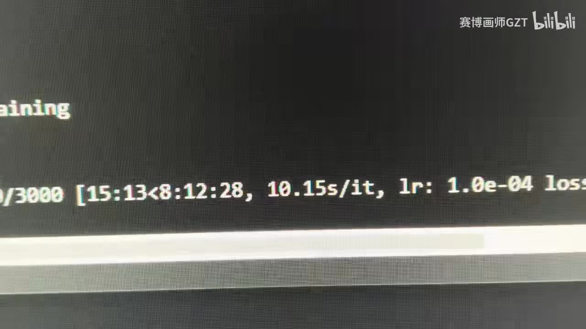

# 12G显存训练krea2

> 来源：[Bilibili 视频](https://www.bilibili.com/video/BV1fA756EEMV)<br>
> UP 主：赛博画师GZT ｜ 分区集合：AIcode ｜ 时长：01:08 ｜ 分辨率：1920×1080

## 小结

视频讨论的是在 **12GB 显存、32GB 内存** 的硬件条件下，通过 AI Toolkit 训练 Krea 2（视频 ASR 识别为“KR2”，结合标题、标签和文件路径校正为 Krea 2）时的可行性与网络问题处理方式。UP 主的核心结论是：**12GB 显存可以启动并运行训练，但受到明显配置限制**；ASR 中“只能跑那个 4”所指的具体参数或模式未能可靠识别，不能据此推断为 batch size、模型规格或其他具体设置。

视频展示了训练终端的一段状态信息。关键帧可辨识到单步耗时约为 **10.15 s/it**、学习率为 **`1.0e-04`**，且进度行右侧存在 loss 字段，但其具体数值被画面裁切，不能作为可复现实验结果记录。UP 主还在评论中补充称，训练大约到 **250 步**时已“步入正轨”；这属于作者经验反馈，不等同于通用于所有数据集和训练配置的结论。

实际操作重点不在完整训练流程，而在网络不佳时替换已修改的脚本：先备份原文件，再把作者提供的修改版 `krea2.py` 放到 AI Toolkit 的内置扩展目录中。视频简介明确给出目标路径：`ai-toolkit/extensions_built_in/diffusion_models/krea2/krea2.py`。网络正常时，UP 主明确表示不需要进行此替换。

本视频适合已有 AI Toolkit 与 LoRA / 扩散模型训练基础、并希望在消费级 12GB 显存设备上尝试 Krea 2 训练的读者。它不是完整安装教程：未提供操作系统、GPU 型号、PyTorch/CUDA 版本、完整配置文件、数据集规格、批大小、分辨率、保存策略或报错日志。因此，视频只能证明作者环境中的一次可运行实践，不能保证在其他环境中复现。

信息具有较强时效性。涉及的脚本路径、模型下载行为、依赖版本与网盘文件均可能随 AI Toolkit 或 Krea 2 相关代码更新而变化；替换第三方脚本前，应审阅差异并保留可回滚备份。

## 思维导图





## 目录

- [视频背景与信息边界](#视频背景与信息边界)
- [训练条件与可见参数](#训练条件与可见参数)
- [网络不佳时的脚本替换步骤](#网络不佳时的脚本替换步骤)
- [经验结论、限制与时效性](#经验结论限制与时效性)
- [字幕比对](#字幕比对)
- [评论分析](#评论分析)
- [处理记录](#处理记录)

## 视频背景与信息边界 [00:00](https://www.bilibili.com/video/BV1fA756EEMV?t=0)

视频标题为“12G显存训练krea2”，标签包含 `AI`、`ai炼丹`、`训练lora`、`aitoolkit`、`krea2`。据此可确定主题是 AI Toolkit 环境下的 Krea 2 训练尝试，而不是 Krea 2 的官方功能介绍或完整模型评测。

视频开头的 ASR 转写为“AI Talk 训练KR2 25G / 12G显存也可以跑”。其中：

- “AI Talk”与视频简介中的目录 `ai-toolkit` 不一致；此处采用元数据中的 **AI Toolkit** 作为工具名称。
- “KR2”与标题、标签和脚本路径中的 `krea2` 对应，正文统一写作 **Krea 2**。
- “25G”的语义不完整，素材未说明它代表模型文件大小、内存占用、下载量还是其他数值，因此不作解释或参数化记录。
- “12G 显存也可以跑”是 UP 主明确表达的实践结论，但不意味着所有 Krea 2 训练配置都能在 12GB 显存上稳定运行。

全片仅 68 秒，且提供的 ASR 没有逐句时间戳。因此下文的时间轴链接以可验证的全片起点为主；不会虚构精确到秒的讲述分段。

## 训练条件与可见参数 [00:00](https://www.bilibili.com/video/BV1fA756EEMV?t=0)

UP 主在口述中给出其运行条件：

| 项目 | 视频可确认内容 | 说明 |
| --- | --- | --- |
| 显存 | 12GB | UP 主称该容量“也可以跑”。 |
| 系统内存 | 32GB | ASR 明确识别为“32G 内存”。 |
| 训练对象 | Krea 2 | 由标题、标签及 `krea2.py` 路径相互印证。 |
| 训练工具/代码环境 | AI Toolkit | 由视频简介的目录路径确认。 |
| 学习率 | `1.0e-04` | 可从关键帧中的训练输出辨识。 |
| 单步耗时 | 约 `10.15s/it` | 关键帧可见的终端进度行信息。 |

ASR 中还有一句：“12G 显存 32G 内存只能跑那个4，会保险存”。其中“那个4”与“会保险存”的语义均不清晰，可能是识别错误、口语省略或画外上下文缺失。素材没有提供配置界面、完整命令或字幕校正依据，**不能将其擅自解释为 batch size=4、保存间隔=4 或某种量化模式**。



> 图：该帧记录了训练正在执行的终端进度行，可辨识 `10.15s/it` 和 `lr: 1.0e-04`。它为“训练实际运行过”以及两项可见参数提供了画面依据；但进度起始数字、总步数和 loss 具体值均不完整，不能据图补全。

从工程角度看，12GB 显存“能跑”的结论至少受到以下未披露条件影响：

1. 模型及训练组件的实际精度和加载方式；
2. 图像分辨率、batch size、梯度累积与是否启用 checkpointing；
3. LoRA 目标模块、rank、优化器及缓存策略；
4. 数据集数量、标注长度和数据预处理方式；
5. GPU 驱动、CUDA、PyTorch 及 AI Toolkit 的版本组合。

这些条件均未出现在素材中，不能以视频中的单次结果外推。

## 网络不佳时的脚本替换步骤 [00:00](https://www.bilibili.com/video/BV1fA756EEMV?t=0)

视频的实操信息聚焦于网络问题。UP 主说明：**网络不好时，可以使用修改后的文件；网络好则不需要替换。**

### 已确认的目标文件

视频简介给出的原始路径为：

```text
ai-toolkit/extensions_built_in/diffusion_models/krea2/krea2.py
```

UP 主还提供了“代码改好了的”网盘链接：

```text
https://pan.baidu.com/s/1vLVZ2zi7Cx9ZjVmL6ZuVdw?pwd=z9bj
```

该链接仅作为视频简介中提供的来源记录；素材未提供文件内容、哈希值、版本号或差异说明，无法验证其当前可访问性、安全性和与本地环境的兼容性。

### 视频明确表达的操作顺序

1. **判断是否确有网络问题。**  
   网络正常时不需要改文件；不要把替换脚本当成常规安装步骤。

2. **定位本地 AI Toolkit 安装目录。**  
   进入：
   ```text
   ai-toolkit/extensions_built_in/diffusion_models/krea2/
   ```

3. **备份原始 `krea2.py`。**  
   UP 主特别强调“换旧的，旧得压缩备份，不要直接覆盖”。建议将原文件复制或压缩保存，以便出现问题时还原。

4. **替换为修改版文件。**  
   在已完成备份的前提下，将获得的修改版 `krea2.py` 置入上述目录并替换原文件。

5. **重新启动或重新执行训练流程。**  
   视频未展示具体启动命令、日志验证步骤或失败处理方式。替换后应自行确认 Python 导入、模型下载和训练初始化是否正常。

### 替换时的边界与风险

- 视频没有展示代码 diff，不能确认该修改到底改变了下载地址、网络超时、模型加载逻辑，还是其他行为。
- 目录名 `extensions_built_in` 和文件名 `krea2.py` 依赖特定 AI Toolkit 版本；版本变更后路径可能失效。
- 直接覆盖不利于排障。除压缩备份外，更稳妥的工程做法是记录原文件校验值、保存替换来源与日期，并使用 diff 工具查看改动。
- 如替换后出现导入报错、模型加载失败或训练行为变化，应优先还原原文件，再核对工具版本与文件版本，而不是继续叠加未知修改。


> 图：该帧画面基本为空，仅能看到鼠标指针与视频水印，未展示脚本内容、路径或配置参数。保留它的价值在于说明素材在这一段缺乏可供复核的操作细节，因此本文未编造替换命令、代码改动或配置项。

## 经验结论、限制与时效性 [00:00](https://www.bilibili.com/video/BV1fA756EEMV?t=0)

### 可迁移的经验

- **低显存并非绝对不能训练。** 视频中的作者环境表明，12GB 显存与 32GB 内存组合可以进入 Krea 2 的训练运行状态。
- **网络问题与训练资源问题需要分开处理。** 脚本替换被作者定位为网络不佳时的应对手段，不是解决显存不足的方案。
- **先备份再改动是必要步骤。** 这条经验具备普遍性，尤其适用于替换内置扩展代码的情况。
- **应优先观察真实训练日志。** 关键帧中的迭代耗时与学习率属于可观测信号，但仅凭单行输出不足以评估训练质量、稳定性和最终效果。

### 视频未能回答的问题

| 问题 | 素材状态 |
| --- | --- |
| 12GB 显存对应的具体训练配置 | 未提供 |
| “只能跑那个4”的准确含义 | ASR 不清，未能确认 |
| 总训练步数、保存频率与 checkpoint 行为 | 未提供 |
| 显存峰值、内存峰值与显卡型号 | 未提供 |
| 数据集规模、训练分辨率、LoRA rank | 未提供 |
| 模型效果图、验证集结果或对比样张 | 未提供 |
| 修改版 `krea2.py` 的代码差异 | 未提供 |
| 网络问题的具体症状 | 未提供 |

### 时效性说明

元数据记录的视频发布时间为 2026-06-26（UTC 换算）。与代码路径、网盘文件、模型加载和网络访问有关的内容均可能快速过时。尤其是：

- AI Toolkit 更新可能调整内置扩展结构；
- `krea2.py` 的接口、依赖或实现可能变化；
- 网盘文件可能被更新、失效或不再匹配当前版本；
- 模型服务端、镜像源及下载策略可能变动。

因此，应将视频中的脚本替换方案视为作者发布时环境下的临时兼容措施，而非长期固定的标准操作。

## 字幕比对 [00:00](https://www.bilibili.com/video/BV1fA756EEMV?t=0)

本次任务已执行 ASR；站内没有提供可用字幕。

| 字幕来源 | 完整性 | 专有名词 | 时间轴 | 主要问题 |
| --- | --- | --- | --- | --- |
| Bilibili 站内字幕 | 无可用字幕 | 无法评估 | 无法评估 | 素材明确标注“未提供可用站内字幕”。 |
| 本次 ASR 字幕 | 覆盖主要口述，但内容短且有缺口 | 存在误识别或不确定项 | 未提供逐句时间戳 | 将 AI Toolkit 识别为“AI Talk”，将 Krea 2 识别为“KR2”；“25G”“那个4”“会保险存”等语义无法可靠还原。 |

### 最终字幕选择与校正原则

最终以 **本次 ASR 为基础**，再使用视频标题、标签、简介和关键帧进行有限校正：

| 原始 ASR 表达 | 正文处理 | 校正依据 |
| --- | --- | --- |
| `AI Talk` | 校正为 AI Toolkit | 视频简介路径以 `ai-toolkit` 开头，标签包含 `aitoolkit`。 |
| `KR2` | 校正为 Krea 2 | 标题为“训练krea2”，标签为 `krea2`，文件名为 `krea2.py`。 |
| `12G显存也可以跑` | 保留为作者实践结论 | ASR 语义清楚，与标题一致。 |
| `10.15s/it`、`lr: 1.0e-04` | 作为画面可见参数记录 | 关键帧中的终端输出。 |
| `25G` | 保留不解释 | 缺少上下文，不能确认量纲或对象。 |
| `只能跑那个4` | 标为无法确认 | 无配置画面或可靠字幕支撑。 |
| `会保险存` | 标为无法确认 | 表述不通顺，可能是 ASR 错误。 |

由于没有逐句时间戳，本知识整理不将 ASR 文本伪装为精确的秒级转写。

## 评论分析 [00:00](https://www.bilibili.com/video/BV1fA756EEMV?t=0)

以下仅处理可获取的热评前三条，评论内容均属于用户陈述或作者回复，不能替代实验验证。

### 1. 黄莺啼过窗纱：12GB 显存、32GB 内存使用 FP8 + LoRA 仍爆显存

> “我12+32，玩fp8加lora会爆是怎么回事”

- **观点与问题**：评论者的硬件组合与视频口述条件相同（12GB 显存、32GB 内存），但在 FP8 加 LoRA 场景仍发生显存溢出。
- **补充价值**：该评论直接说明“12GB 显存可跑”高度依赖实际配置；即使采用 FP8，仍可能 OOM。
- **可信度边界**：评论未提供模型、分辨率、batch size、梯度累积、rank、优化器、报错位置或显存峰值，无法定位原因，也不能据此判断与视频环境是否相同。
- **与视频的关系**：它强化了本文的限制判断：视频结论不是 12GB 条件下的普遍保证。

### 2. 赛博画师GZT：约 250 步后拟合步入正轨

> “拟合很快，才250步就步入正轨。”

- **观点与补充信息**：UP 主补充其此次训练观察为约 250 步后开始进入正常拟合状态。
- **价值**：这是视频之外唯一与收敛进程相关的具体步数信息，可作为作者单次训练的经验参考。
- **可信度边界**：没有展示 loss 曲线、样张、验证结果、数据集规模或“步入正轨”的判定标准。因此不能把 250 步当作 Krea 2 或 LoRA 训练的通用推荐步数。
- **使用建议**：可把它视为观察 checkpoint 与采样结果的早期检查点，而非固定停训阈值。

### 3. ximon1816：回顾显卡选型建议

> “赛博画师，NGA社区好久没更新了啊，当初听你劝，2080ti22G和4060ti16g，留了4060ti，感谢你的建议”

- **观点与补充信息**：评论者表示曾在 2080 Ti 22GB 与 RTX 4060 Ti 16GB 之间咨询，并最终保留 RTX 4060 Ti 16GB。
- **价值**：反映 UP 主此前可能持续提供过硬件选型建议，也说明显存容量是观众关注的实际购买与使用因素。
- **可信度边界**：该评论未说明选择原因、用途、价格、性能测试、驱动版本或最终训练效果；不能据此推出两张卡在 Krea 2 训练中的优劣结论。
- **与本视频的关系**：它属于社区互动背景，不构成本视频“12GB 显存训练 Krea 2”的技术证据。

## 处理记录 [00:00](https://www.bilibili.com/video/BV1fA756EEMV?t=0)

- **Worker ID**：`worker-mrj0wjed-b0c290ad`
- **模型**：`gpt-5.6-terra`
- **调用工具与素材**：使用任务提供的 Bilibili 元数据、视频简介、关键帧清单、已执行的 ASR 文本、热评数据及素材产物清单进行整理；未获得可用站内字幕。
- **字幕选择**：站内字幕不可用；采用本次 ASR 为主。仅对能被标题、标签、简介路径和画面交叉验证的专有名词进行校正；对“25G”“那个4”“会保险存”等不可靠片段保留不确定性，不作补写。
- **关键帧选择依据**：
  - `frames/frame-001.jpg`：终端训练输出可辨识约 `10.15s/it` 与 `lr: 1.0e-04`，能支撑训练运行和部分参数记录。
  - `frames/frame-002.jpg`：未提供可读的代码、路径或配置内容，用于明确说明该段无可复核操作细节，避免将空白画面误解释为脚本演示。
- **缓存清理**：素材清单仅报告媒体、音频、帧、信息、评论、字幕与 ASR 产物目录，未提供缓存清理执行日志；无法确认是否执行过缓存清理，故不作“已清理”声明。
- **未解决问题**：ASR 中“25G”“只能跑那个4”“会保险存”的真实含义；具体训练配置与硬件型号；修改版 `krea2.py` 的代码差异、文件版本和安全性；网盘链接当前有效性；评论所述 FP8+LoRA 显存溢出的具体原因。

## 评论分析

本次流程未获取到可用热评，因此不推断观众态度或额外结论。
