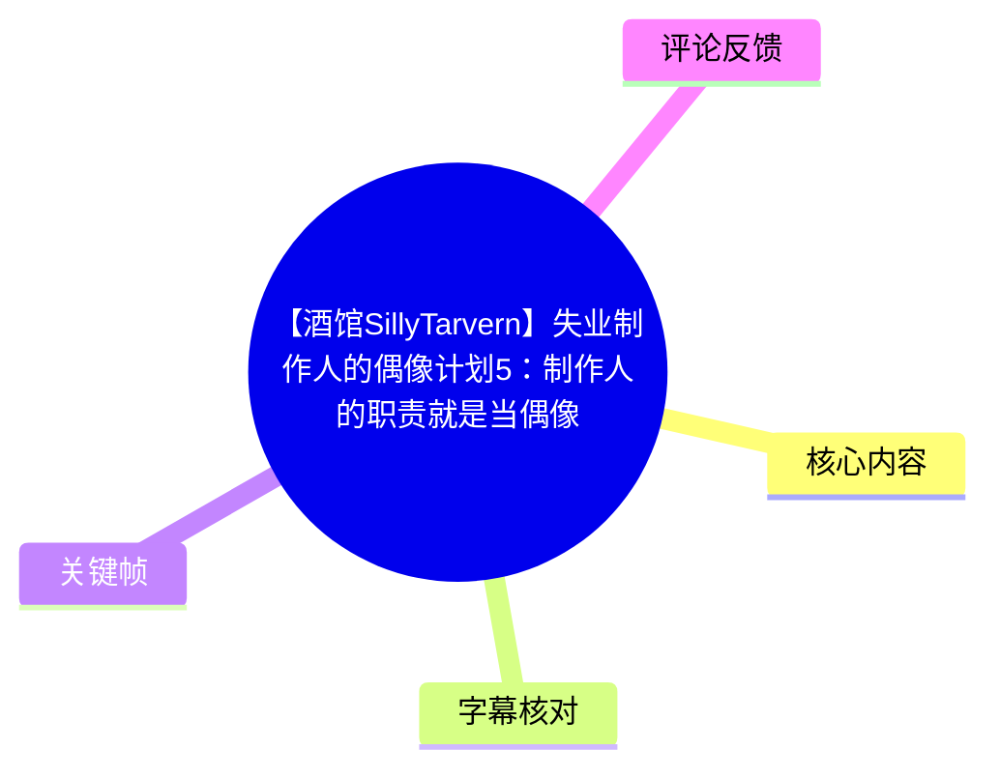
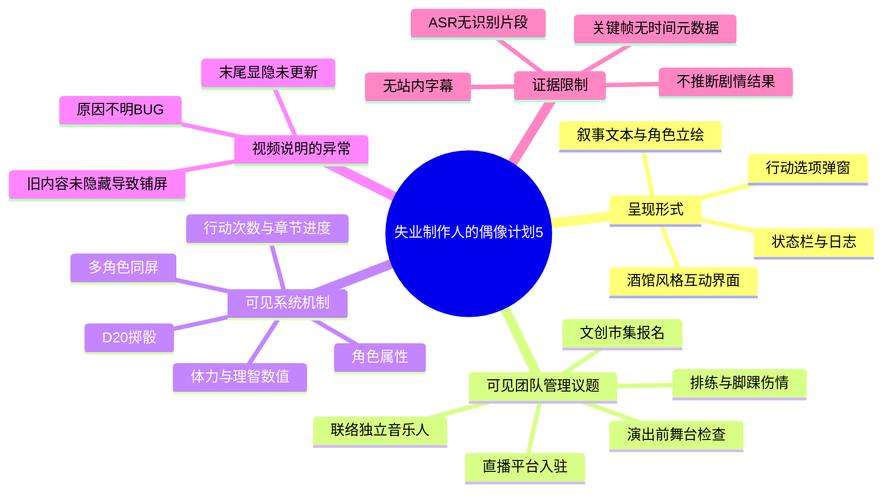
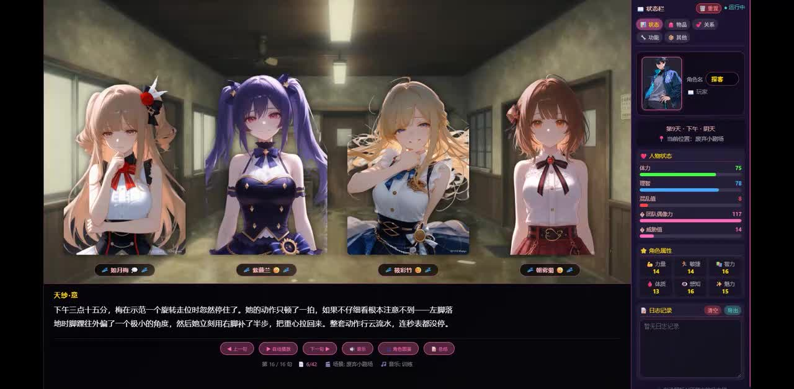
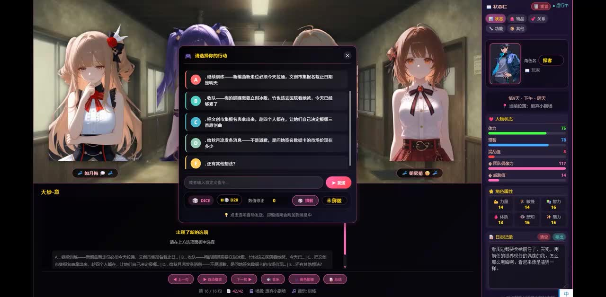
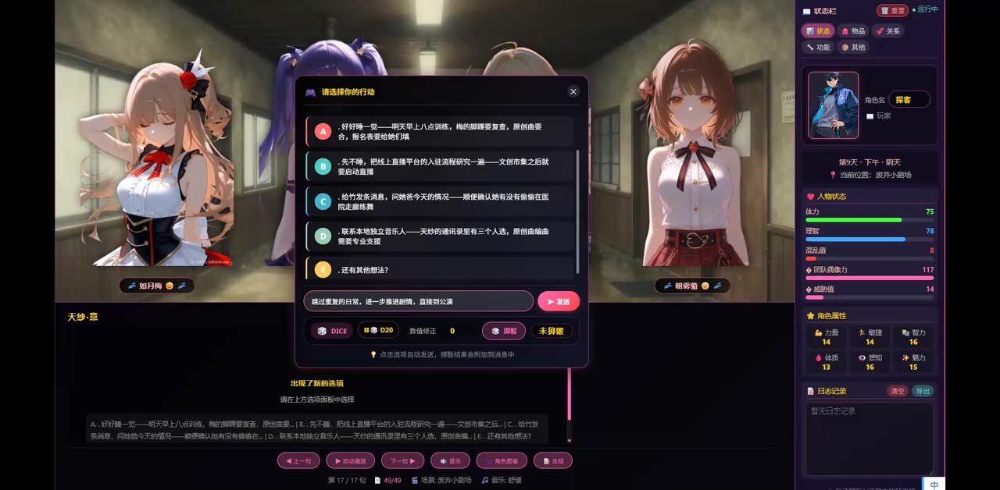
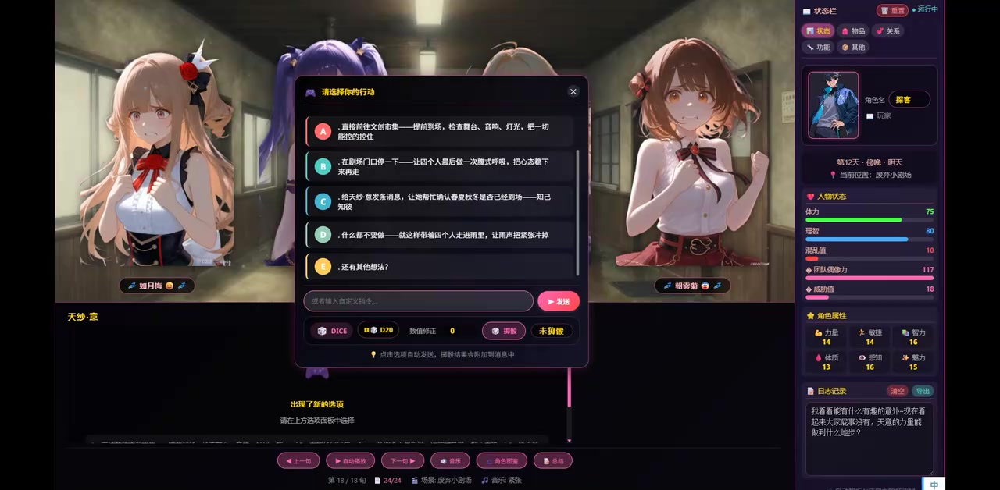

# 【酒馆SillyTarvern】失业制作人的偶像计划5：制作人的职责就是当偶像

> 来源：[Bilibili 视频](https://www.bilibili.com/video/BV1U9Eq6iEZk) 
> UP 主：技术探客｜时长：32 分 11 秒｜分辨率：1904×936 
> 视频简介称：过程中出现了原因不明的 BUG，但影响不大；末尾画面铺屏则是 AI 未更新显隐状态、先前内容未隐藏所致。

## 小结

本期素材展示的是一个以“制作人”身份推进偶像企划的酒馆／SillyTavern 风格互动界面。画面核心不是传统线性动画，而是由叙事文本、角色卡、状态栏、行动选项、掷骰模块及日志共同组成的 AI 驱动剧情管理界面。

从可见关键帧看，制作人面对的是偶像团队在排练、伤病、活动报名、直播入驻、独立音乐人联络与文创市集演出准备之间的资源分配问题。系统会给出多项行动方案，玩家需要选择处理顺序；这体现了“制作人的职责就是当偶像”这一标题所指向的复合职责：既管理团队，又要处理内容、舞台、商务和演出现场事务。

画面明确可见的机制包括：多名偶像角色同屏展示、可切换的状态／物品／关系／功能／其他标签页、体力与理智等数值状态、角色属性、日志记录，以及 `DICE`、`D20`、数值修正和“掷骰／未掷骰”组件。当前证据只能证明这些模块在界面中存在；无法仅凭关键帧确认具体数值如何影响剧情结果。

视频元数据与关键帧能够支撑对界面结构、已出现的行动议题和可见 BUG 说明的整理，但站内没有可用字幕，本次 ASR 也没有识别到任何语音片段。因此，不能将本视频还原为逐句口述实录，也不能为具体剧情段落编造精确发生时间。下文的时间轴链接仅统一指向视频起点，表示“全片可见素材范围”，并非对细分情节位置的推测。

适合希望研究 AI 角色扮演界面、偶像企划题材互动叙事、状态驱动式任务设计，或需要从有限多模态证据中辨析“已证实信息”和“待验证信息”的读者参考。

## 思维导图

## 目录

- [素材范围、时效性与证据边界](#素材范围时效性与证据边界)
- [可见界面：团队、叙事与状态面板](#可见界面团队叙事与状态面板)
- [制作人决策：排练、恢复、内容与商务](#制作人决策排练恢复内容与商务)
- [演出准备与现场风险处理](#演出准备与现场风险处理)
- [可见操作流程与参数](#可见操作流程与参数)
- [BUG 说明、限制与可迁移经验](#bug-说明限制与可迁移经验)
- [字幕比对](#字幕比对)
- [评论分析](#评论分析)
- [处理记录](#处理记录)

## 素材范围、时效性与证据边界 [全片起点；无可验证细分时标](https://www.bilibili.com/video/BV1U9Eq6iEZk?t=0)

### 可确认的来源信息

- 视频标题为“【酒馆SillyTarvern】失业制作人的偶像计划5：制作人的职责就是当偶像”。
- UP 主为“技术探客”，视频被归入 `AIcode` 收藏集合。
- 视频时长为 1931 秒，约 32 分 11 秒。
- 标签包括游戏实况、日常、科技、娱乐、人工智能、生活、制作人、AI、偶像、音乐人。
- 视频简介直接说明：有“原因不明的 BUG”，但 UP 主认为其影响不大；结尾的铺屏是 AI 没有更新显隐状态，导致前面显示的内容在后面没有隐藏。

### 时间轴的使用说明

本任务未提供站内 SRT，也未提供可用的 ASR 分段或关键帧提取时间。ASR 结果中的 `segments` 为空，无法据此为“排练”“演出”“选项”等画面分配真实秒数。

因此，本文所有章节链接都使用 `t=0`，仅作为回到视频全片起点的入口：

- **不是**对某个剧情发生在 00:00 的断言；
- **不是**按文字叙述顺序反推的视频定位；
- 后续若补充站内字幕、逐帧时间索引或有效 ASR 时间戳，应据真实起止时间替换这些链接。

## 可见界面：团队、叙事与状态面板 [全片起点；无可验证细分时标](https://www.bilibili.com/video/BV1U9Eq6iEZk?t=0)

关键帧显示，主界面由三部分构成：

1. **上方角色展示区**：多位二次元偶像角色以卡片或立绘方式同时出现，角色名显示在人物下方。
2. **下方叙事与操作区**：左侧／中部显示剧情文本、章节或行动进度，以及“上一步”“自动播放”“下一步”“音乐”“角色图鉴”“总结”等按钮。
3. **右侧状态面板**：可见“状态、物品、关系、功能、其他”等标签，包含角色卡、日期／当前进度、人物状态条、角色属性与日志记录。

在第一张关键帧中，叙事文本可辨识为一段对“梅”动作的描述：她在示范旋转走位时动作流畅，文本还强调了脚部小角度与用右脚补步等细节。该段落表明，系统不只记录事件结论，也会生成或展示偏舞台表演、动作观察性质的描写。

> 图：该图同时展示四名角色、下方剧情叙事区与右侧状态栏，是识别本视频“多角色互动叙事 + 制作人管理面板”结构的基础证据。画面中的动作描写也说明当前剧情与排练／舞台表现有关。

### 可见状态与属性信息

右侧栏中可辨识到以下类别：

| 类别 | 画面可见内容 | 可以确认的结论 | 不应过度推断的部分 |
| --- | --- | --- | --- |
| 人物状态 | 体力、理智等彩色状态条 | 系统至少展示了数值化角色状态 | 数值具体上限、消耗规则与恢复公式未提供 |
| 角色属性 | 力量、敏捷、智力、体质、感知、魅力等项目 | 使用了 RPG 式属性分类 | 属性是否参与全部事件判定无法确认 |
| 进度信息 | 天数／时段、行动位置等 | 剧情具有日程或回合推进结构 | 每日行动点的精确重置逻辑不明 |
| 日志记录 | 右侧“日志记录”区域 | 系统会保留事件摘要或历史文本 | 日志完整性及自动／手动记录方式不明 |

关键帧 1 中可见角色状态条的一组数值，包括体力 `75`、理智 `78`、团队凝聚力 `117`、疲劳值 `14`；关键帧 4 中的部分数值发生变化，例如体力显示为 `75`、理智 `80`、团队凝聚力 `117`、疲劳值 `18`。这只能说明不同画面状态下数值存在变动或显示不同，**不能仅据两张截图断言某项选项造成了某个精确变化**。

## 制作人决策：排练、恢复、内容与商务 [全片起点；无可验证细分时标](https://www.bilibili.com/video/BV1U9Eq6iEZk?t=0)

### 行动选项的呈现方式

关键帧中出现题为“请选择你的行动”的弹窗。系统以 A、B、C、D 及“还有其他想法？”形式列出备选方案，底部提供自由输入框和“发送”按钮。这意味着玩家并非只能从预设选项中选择，还可以尝试输入自定义行动。

在其中一组可辨识选项中，议题覆盖：

- 继续训练，并涉及文创市集报名截止日期；
- 收队，因“梅的脚踝”需要尽快冰敷，亦可安排医院复查；
- 取出文创市集报名表，在团队成员都在时共同决定；
- 处理与秋月相关的事务，文本中提及签名板卡；
- 通过“还有其他想法？”或输入框提出自定义方案。

这组问题的重点不在于“唯一正确的选择”，而在于制作人需要同时权衡：训练推进、成员伤情、活动报名时限、团队共同决策与周边／商务事务。

> 图：弹窗明确呈现 A—D 多项决策与自定义输入入口。其价值在于证明系统采用“预设选项 + 开放文本行动”的混合交互，而非仅播放固定剧情。

### 可见的制作人事务清单

另一张关键帧中，行动方向进一步扩展为：

| 事务方向 | 关键帧中可读到的内容 | 制作人职责的含义 |
| --- | --- | --- |
| 伤病与排练 | 明早训练、脚踝复查、原地休整 | 排练进度不能脱离成员身体状态 |
| 直播运营 | 研究直播平台入驻流程，筹备文创市集后续内容 | 制作人要处理线上曝光和内容渠道 |
| 团队沟通 | 向队员发消息，询问伤情／是否有情绪压在心里 | 需要主动识别成员的身心与情绪风险 |
| 外部合作 | 联系本地独立音乐人，寻找合适人选 | 需要扩展音乐与表演资源网络 |

> 图：该图将“偶像计划”的任务范围从排练扩展到直播平台、队员沟通与外部音乐合作，直接支持“制作人的职责具有复合性”的总结。

### 可迁移的决策原则

基于画面中出现的任务类型，可以提炼出以下**界面层面的管理原则**；它们不是视频已验证的最优解，也不应被理解为系统内置算法：

1. **先识别硬约束**：例如伤病处理、报名截止日、明确的活动时间窗，通常比可延后的探索型任务更具时效性。
2. **把“状态”与“任务”并看**：界面同时展示体力、理智、疲劳等状态，暗示行动选择不宜只看剧情收益。
3. **保留沟通与复盘通道**：在团队项目中，向成员确认伤情、情绪与安排，是降低信息遗漏的一种方式。
4. **将线下活动与线上内容联动**：文创市集、直播入驻、周边或签名板卡等事项在同一决策池中出现，说明活动、内容和商务并非完全割裂。

## 演出准备与现场风险处理 [全片起点；无可验证细分时标](https://www.bilibili.com/video/BV1U9Eq6iEZk?t=0)

关键帧 4 的行动弹窗可辨识出与“文创市集”及演出现场相关的方案。其中包括：

- 直接前往文创市集，提前到场检查舞台、音响、灯光，并将一切能够控制的环节控制好；
- 在即将登台时让四名成员进行最后一次鼓励／深呼吸，帮助稳定状态；
- 向相关人员确认演出信息，避免错误或遗漏；
- 一起进群、帮助团队梳理现场事务等方向；
- 继续提供“还有其他想法？”这一自定义输入入口。

> 图：该图把舞台、音响、灯光、登台前状态与信息确认放入同一决策界面，是识别视频中“制作人同时承担演出现场统筹职责”的关键证据。

### 可见步骤的整理

以下是按画面中任务逻辑归纳的工作流，括号内注明其证据强度：

1. **确认活动与时间压力**（直接可见）  
   画面多次提及文创市集、报名、演出及活动前准备，说明存在外部活动节点。

2. **评估成员状态与伤病处理**（直接可见）  
   选项中出现脚踝冰敷、医院复查、休整、询问伤情等内容；右侧状态栏也展示体力、理智、疲劳等数据。

3. **安排训练或减少负担**（直接可见）  
   画面显示继续训练、次日早上训练、原地休整等互相竞争的行动方向。

4. **推进内容／渠道／合作事项**（直接可见）  
   可见直播平台入驻流程、独立音乐人联络、文创市集报名等事项。

5. **演出前执行现场检查**（直接可见）  
   画面可读到舞台、音响、灯光的检查方向。

6. **进行登台前沟通与信息核验**（直接可见）  
   选项涉及最终鼓励、深呼吸、信息确认等。

7. **使用系统选择或自由输入执行行动**（直接可见）  
   弹窗提供预设选项和文本输入框，但当前素材未展示提交后结果，因此无法确认每个步骤的实际剧情后果。

## 可见操作流程与参数 [全片起点；无可验证细分时标](https://www.bilibili.com/video/BV1U9Eq6iEZk?t=0)

### 操作流程

依据可见 UI，可将一次交互概括为：

1. 阅读当前剧情描述与角色状态。
2. 查看“请选择你的行动”弹窗中的 A—D 预设方案。
3. 需要时选择“还有其他想法？”或在文本框输入自定义行动。
4. 通过“发送”提交内容。
5. 如涉及随机判定，界面下方可见 `DICE`、`D20`、数值修正和“掷骰”状态。
6. 使用底部“上一步”“自动播放”“下一步”等按钮继续或回看叙事。

上述流程仅描述已出现在画面中的控件与顺序关系。素材没有提供按钮点击记录，不能确认“自动播放”的具体播放策略，也不能确认“上一步”是否会回滚状态。

### 可见参数与界面标记

| 项目 | 画面可见值／标记 | 说明 |
| --- | --- | --- |
| 骰子类型 | `D20` | 界面显示二十面骰机制 |
| 数值修正 | `0` | 关键帧中显示“数值修正 0” |
| 掷骰状态 | `未掷骰` | 截图时未显示已完成的掷骰结果 |
| 行动选项 | A、B、C、D、E | E 为“还有其他想法？”一类开放入口 |
| 叙事推进 | 第 16／16、17／17、18／18 等可见标记 | 表明界面存在阶段或章节计数，但含义无法由截图完全确定 |
| 右侧页签 | 状态、物品、关系、功能、其他 | 表明系统至少划分这些信息维度 |
| 状态项目 | 体力、理智、团队凝聚力、疲劳值等 | 数值规则与影响范围未被素材证明 |

### 使用上的限制

- 不应因为界面中存在 `D20` 就假定所有行动均由骰点决定。
- 不应因为出现“数值修正 0”就推断角色没有任何属性加成；这可能只是当前判定的修正值。
- 不应把截图中的剧情选项视为最终选择，更不能把选项文字当成已发生事件。
- 图中角色名、部分小字号数值和个别选项文本受截图分辨率限制，本文只保留可较可靠辨识的内容，不对难以确认的专名作强行转写。

## BUG 说明、限制与可迁移经验 [全片起点；无可验证细分时标](https://www.bilibili.com/video/BV1U9Eq6iEZk?t=0)

### UP 主已说明的异常

视频简介是关于异常最直接、最可靠的来源。UP 主的说明可拆分为两点：

1. 视频中似乎存在原因不明的 BUG，但其判断为“影响不大”。
2. 末尾的铺屏并非新内容本身，而是 AI 没有更新显隐状态：前面已经显示的内容在后面没有被隐藏。

这说明观看或复现类似界面时，应将后段重叠、铺满的 UI 内容优先视为状态同步／显示层问题，而不是据此推断剧情、任务数量或角色设定突然发生变化。

### 对 AI 互动叙事界面的经验

1. **显隐状态应被视为独立状态管理问题**  
   内容生成正确，不等于界面展示正确。若历史卡片、弹窗或角色层未随阶段更新隐藏，用户会把旧信息误读为当前信息。

2. **复杂任务要保留可追溯记录**  
   本界面设置了日志与状态栏。对于包含伤病、演出、商务、直播和团队关系的长线企划，记录“当前状态—选择—结果”有助于避免上下文漂移。

3. **开放输入增强自由度，也提高约束需求**  
   “还有其他想法？”和文本输入框为玩家提供开放行动空间；但也要求系统明确处理边界、状态变更和异常 UI 回收。

4. **数值状态需要与叙事解释保持一致**  
   体力、理智、凝聚力、疲劳值等显示能帮助玩家理解选择代价，但若缺少明确规则或反馈，用户很难判断数值变化的原因。

### 时效性与未解决问题

- 本文所依据的视频元数据抓取时间为 2026-07-15；播放、点赞、收藏、评论等统计数据会持续变化，不宜视为永久值。
- 站内当前可获取数据仅显示 1 条评论；“热评前三条”并不意味着实际存在三条可供分析的热评。
- ASR 没有可用文本，无法核实视频是否含有未识别的人声、低音量语音、音乐、系统音或其他声轨内容。
- 没有关键帧时间戳，无法把四张截图映射到真实秒数，也不能据截图排列为视频中的严格发生顺序。
- 无法从当前素材判定该酒馆配置的具体提示词、模型、世界书、插件、角色卡字段、后端接口或工作流版本。

## 字幕比对

| 字幕来源 | 完整性 | 专有名词 | 时间轴 | 主要问题 |
| --- | --- | --- | --- | --- |
| Bilibili 站内字幕 | 未提供可用字幕 | 无法核验 | 无可用分段 | 素材明确标注“未提供可用站内字幕” |
| 本次 ASR 字幕 | 为空，识别覆盖率为 0% | 无法识别 | 无有效时间段 | `segments` 为空；诊断显示未识别到语音片段 |

### ASR 检查结果

本次 ASR 已被检查，结果如下：

- 识别模型：`medium`
- 自动语言识别结果：`en`
- 语言置信度：`0.541015625`
- 音频时长：`1930.176` 秒
- 识别分段数：`0`
- 语音时长：`0` 秒
- 语音覆盖率：`0`
- 首段／末段语音时间：均为 `null`
- 诊断警告：未识别到语音片段，建议确认源文件是否包含可听语音并检查正确音轨。

诊断中**没有** `noAudioStream=true` 标记。因此，不能把本次情况表述为“源视频没有音轨”；准确表述应为：已生成音频文件，但 ASR 未能识别出可用语音分段。可能原因包括无可识别口语、语音过低、背景音乐／音效占主导、语言误判或音轨内容不适配识别模型；这些均未被当前素材进一步证实。

### 最终字幕选择与校正方法

最终未采用任何一份字幕作为正文转写来源，原因是：

- 站内字幕不可用；
- 本次 ASR 输出为空；
- 不存在可合并的带时间戳文本。

正文改以以下证据层级整理：

1. 视频元数据和 UP 主简介；
2. 可直接辨认的关键帧文本与 UI 标签；
3. 关键帧中的多模态画面结构；
4. 对不可读文字、剧情结果、专名和时间位置保持保留。

未通过臆测校正专有名词；例如部分角色名、选项细节与小号数值因图像可读性不足，均未作为确定事实扩写。

## 评论分析

当前仅获取到 1 条热评，低于“热评前三条”的最大处理上限；没有可获取的第 2、3 条评论，因此不补造内容。

| 排名 | 用户 | 获赞 | 评论内容 | 分析 |
| --- | --- | ---: | --- | --- |
| 1 | 一二三三YESS | 0 | `[思考][哦呼]` | 这是以表情表达的即时反应，可能表示好奇、思索或惊讶，但没有提供对剧情、系统、BUG、技术配置或制作方法的可验证补充信息。 |

该评论没有形成可供交叉验证的事实主张，也不存在明确争议点。评论情绪不能替代对视频内容的技术判断。

## 处理记录

- Worker ID：`worker-mrj0wjed-b0c290ad`
- 模型：`gpt-5.6-terra`
- 可用素材与工具产物：视频元数据、封面、`merged.mp4`、`audio/audio.wav`、关键帧目录、ASR 诊断结果、评论 JSON；本次文档依据已提供的素材清单整理。
- ASR 检查：已检查 `asr/asr-result.json` 的诊断信息；模型为 `medium`，结果无识别分段。未发现 `noAudioStream=true`。
- 字幕选择：站内字幕未提供可用版本；本次 ASR 为空；最终不采用字幕转写，改用元数据、UP 主简介与关键帧可见信息。
- 时间轴选择：没有站内 SRT 起止时间、ASR 分段时间或关键帧时间索引；为避免按文本顺序猜测位置，所有章节仅链接到 `t=0` 的全片入口，并明确不将其作为细分情节时标。
- 关键帧选择依据：
  - `frames/frame-001.jpg`：同时呈现角色阵容、叙事文本、状态栏和底部控制区；
  - `frames/frame-002.jpg`：呈现排练、脚踝冰敷、报名等多目标行动选择；
  - `frames/frame-003.jpg`：呈现伤病复查、直播入驻、成员沟通、独立音乐人联络；
  - `frames/frame-004.jpg`：呈现文创市集演出前的舞台、音响、灯光与登台准备事项。
- 未选用的关键帧：其余关键帧未附带时间信息，且现有四张已覆盖界面结构与主要可辨识行动主题；为避免重复配图和过度解读，未额外引用。
- 评论处理：仅分析可获取热评中的 1 条，未虚构缺失的第 2、3 条。
- 缓存清理：提供的素材中未包含缓存清理执行日志；无法确认是否已执行清理，因此如实记录为“未提供清理结果，未作推断”。
- 未解决问题：音轨中是否存在未被 ASR 识别的有效口语、各关键帧的准确秒数、完整剧情选择及后果、掷骰判定规则、具体 AI／酒馆配置和 BUG 的复现条件，均无法由当前素材确认。
