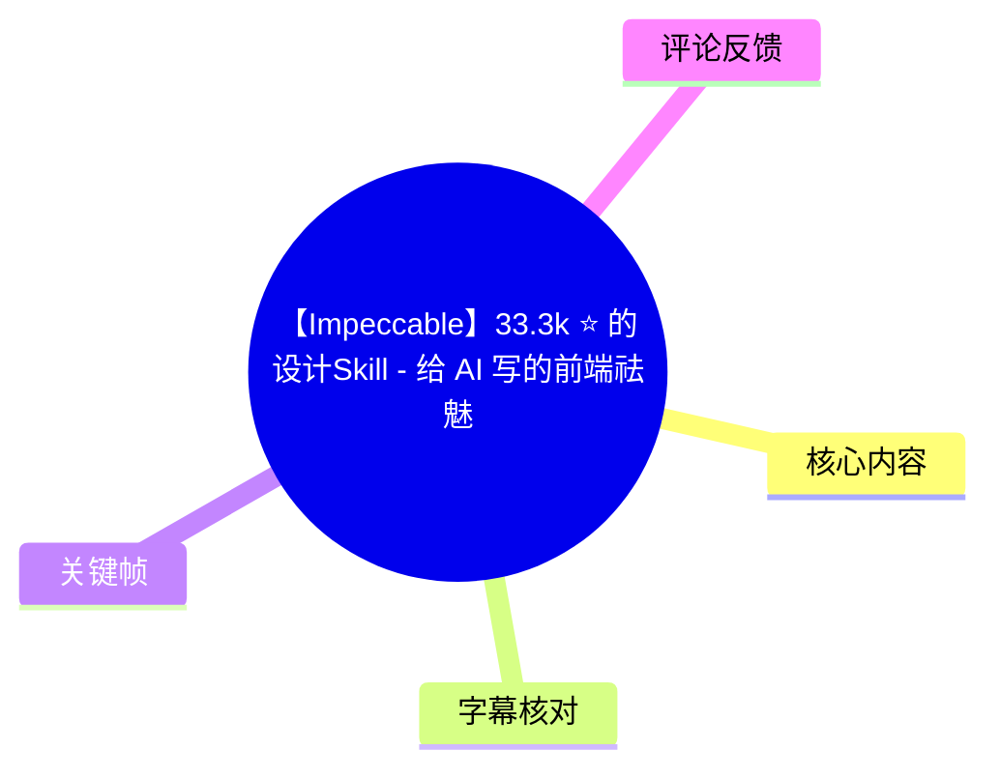
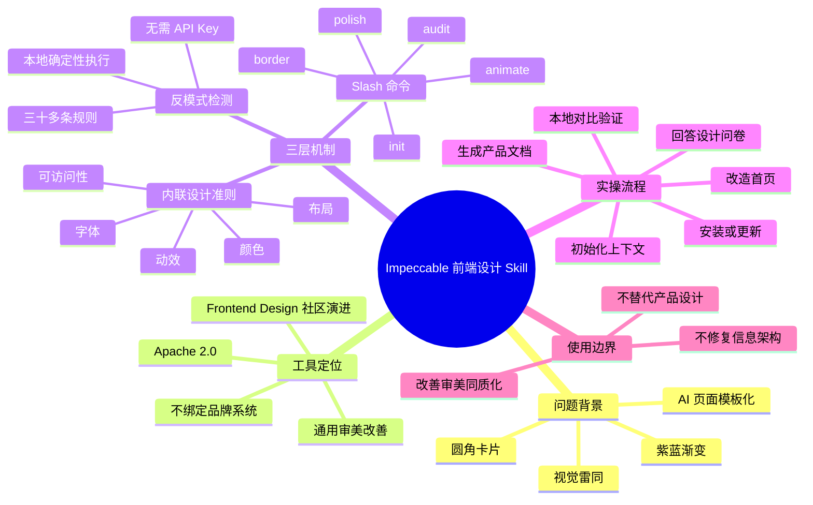
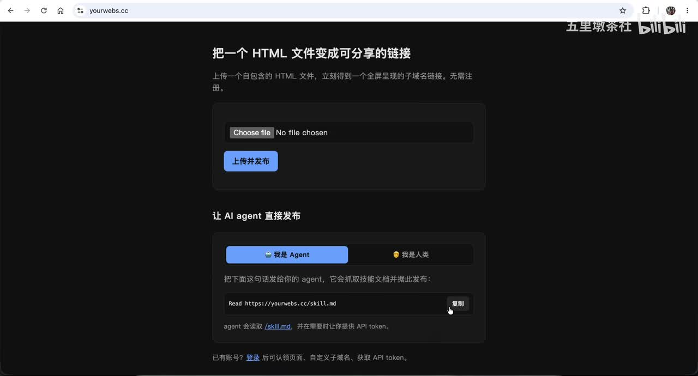
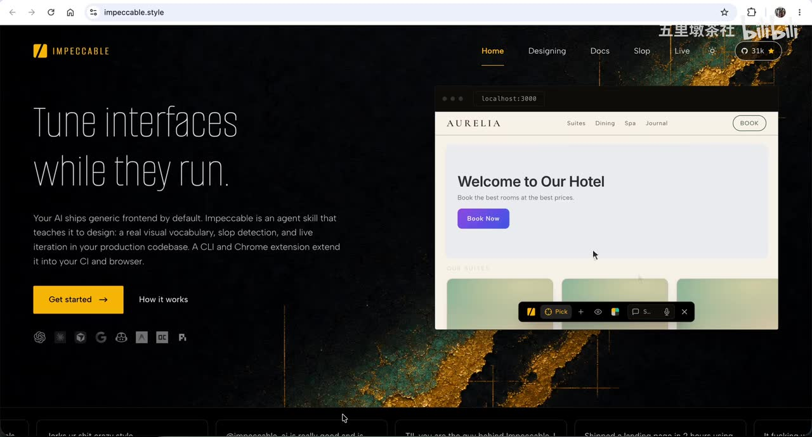
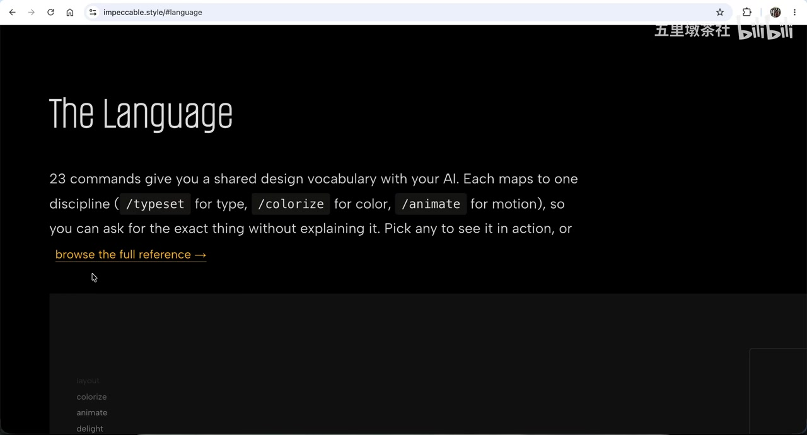
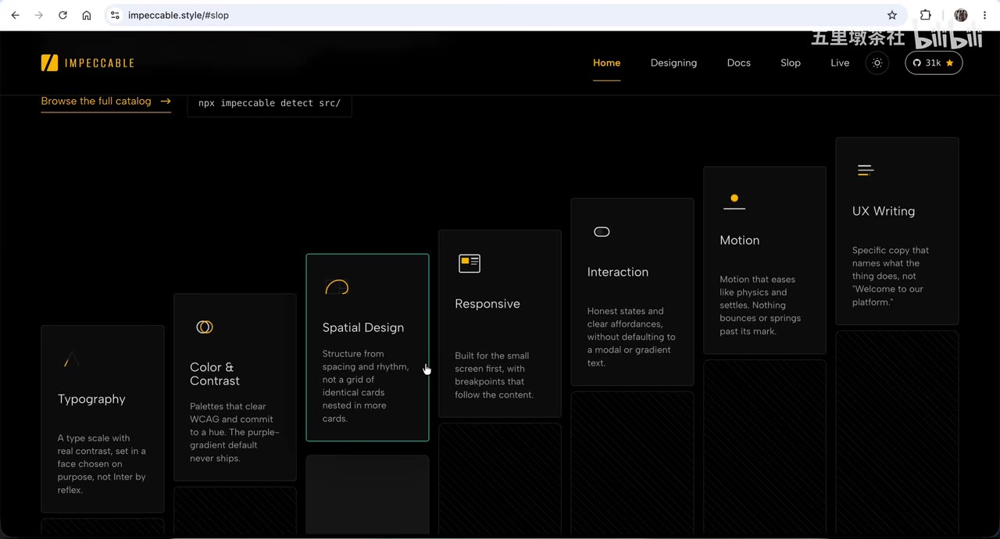

# 【Impeccable】33.3k ⭐ 的设计Skill - 给 AI 写的前端祛魅，解决AI设计同质化

> 来源：[Bilibili 视频](https://www.bilibili.com/video/BV128Vy6qEWe)<br>
> UP 主：五里墩茶社｜时长：10 分 42 秒｜合集：AIcode  
> 视频描述中的项目官网：[impeccable.style](https://impeccable.style/)

## 小结

视频讨论的核心问题是：大模型在缺少明确设计约束时，往往会生成高度相似的前端页面，例如“紫蓝渐变、圆角卡片、圆角按钮、熟悉的字体”等典型模板化特征。它们通常能够运行，但视觉上容易与大量 AI 生成页面雷同。

UP 主介绍的 **Impeccable** 是一个面向 AI 编程工作流的前端设计 Skill。视频将其定位为 Anthropic 的 Frontend Design Skill 的社区演进版本：在原有引导 AI 改善 UI 的基础上，补充了更具体的设计领域规则、可调用命令和反模式检测。视频口径称其 GitHub 星标超过 33,000，采用 Apache 2.0 许可证；这些均应视为视频录制时点的信息，后续可能变化。

Impeccable 的方法由三部分组成：一是将颜色、字体、布局、动效、交互、文案等要求写入 Skill 的内联设计准则；二是以 20 多个 Slash 命令把设计任务拆成明确动作；三是用 30 多条确定性反模式规则检测“AI 味”。其中，UP 主强调确定性规则可在本地运行，不依赖大模型调用或 API Key，与“提示模型注意设计”的概率性做法不同。

实操部分以一个 HTML 云端托管服务为例：先安装 Skill，再用 `/impeccable init` 建立产品和设计上下文；AI 会读取项目中的 `product.md`，或在其不存在时参考 `init.md`，继而询问站点方向、目标用户、品牌气质、参考站点和可访问性标准等问题。初始化后会产出 `product.md`、`config.json` 等文件，并给出设计原则、扫描问题与后续建议。

视频也明确了工具边界：Impeccable 解决的是**审美同质化与视觉完成度**，并不能修复混乱的信息架构、模糊的产品路径或“不知道下一步该点哪里”的结构性问题。它适合用于产品结构已经基本清楚、但需要系统化改善前端视觉与交互细节的阶段。

## 思维导图





## 目录

- [背景：AI 前端为何长得相似](#背景ai-前端为何长得相似)
- [项目定位与 Open Design 的差异](#项目定位与-open-design-的差异)
- [核心机制：规则、命令与反模式检测](#核心机制规则命令与反模式检测)
- [实践：安装、初始化与首页改造](#实践安装初始化与首页改造)
- [常用命令与演示结果](#常用命令与演示结果)
- [适用边界、限制与时效性](#适用边界限制与时效性)
- [字幕比对](#字幕比对)
- [评论分析](#评论分析)
- [处理记录](#处理记录)

## 背景：AI 前端为何长得相似 [00:00:02](https://www.bilibili.com/video/BV128Vy6qEWe?t=2)

视频开篇以一个典型页面说明问题：当人们看到紫蓝色渐变、圆角卡片、圆角按钮与常见字体时，往往会迅速将其识别为 AI 生成的前端页面。UP 主并未否定这类页面的可运行性，而是指出其问题在于缺少辨识度，与大量 AI 页面相似。

在 [00:00:27](https://www.bilibili.com/video/BV128Vy6qEWe?t=27)，UP 主给出的原因是：主流大模型学习和复用的前端模板相近；当用户没有对视觉方向、设计语言和约束作出引导时，模型会倾向于输出同一类“通用 SaaS 模板”效果。

视频将 Impeccable 作为解决方案，旨在降低这种“AI 味”或审美同质化。这里的“祛魅”并不是让 AI 不参与设计，而是给 AI 编程助手提供更细粒度、可执行的设计约束，使其不只生成“能跑”的页面。



> 图：画面展示了视频实操所用的 YourWeb 页面：一个用于上传 HTML 文件、生成可分享链接的服务。它是后续改造的业务载体，也说明演示并非从空白设计稿开始，而是在既有页面上做视觉优化。

## 项目定位与 Open Design 的差异 [00:00:51](https://www.bilibili.com/video/BV128Vy6qEWe?t=51)

### Impeccable 的来源与许可

在 [00:00:51](https://www.bilibili.com/video/BV128Vy6qEWe?t=51)，UP 主称 Impeccable 并非凭空出现，而是 Anthropic 自家 **Frontend Design Skill** 的社区演进版本。其作者 Paul 在原工具基础上增加了更深入的领域知识与更多控制方式。

视频还提到：

- 项目与 Anthropic 的关联可在 `Notice` 文件中查看；
- 项目使用 **Apache 2.0** 许可证；
- 视频录制时，GitHub 星标已超过 33,000；
- 官网的视觉叙述是“让界面在运行中持续调整”，而不是一次性生成后停止迭代。

这些项目状态、星标数和文档内容具有时效性，应在实际使用前以项目仓库、官网及许可证文件为准。



> 图：官网首页明确写出“Tune interfaces while they run.”，并将 Impeccable 描述为让 AI 学会设计的 agent skill。该画面有助于理解视频强调的定位：它面向现有代码库中的持续设计优化，而非仅提供静态模板。

### 与 Open Design 的功能分工 [00:01:27](https://www.bilibili.com/video/BV128Vy6qEWe?t=87)

UP 主用个人理解区分了 Open Design 与 Impeccable：

| 对比项 | Open Design | Impeccable |
| --- | --- | --- |
| 主要问题 | 将已有品牌视觉身份迁移到项目中 | 改善通用 AI 生成页面的审美同质化 |
| 前提输入 | 已有品牌规范、模板、设计系统 | 不要求绑定特定品牌 |
| 主要作用 | 应用已有的视觉资产与规范 | 避免页面像 AI 随手生成的模板 |
| 视频中的定位 | 品牌设计系统的应用工具 | 前端设计质量与反模式治理工具 |

这不是对两个项目完整能力边界的官方定义，而是视频作者在 [00:01:27—00:01:59](https://www.bilibili.com/video/BV128Vy6qEWe?t=87) 给出的使用层面概括。若组织已有成熟品牌系统，视频观点是 Open Design 更贴近“套用既有身份”；若问题是页面缺少审美决策、落入 AI 常见套路，则 Impeccable 更具针对性。

## 核心机制：规则、命令与反模式检测 [00:01:59](https://www.bilibili.com/video/BV128Vy6qEWe?t=119)

### 1. 内联设计准则：把“好看”转为可执行约束

在 [00:01:59](https://www.bilibili.com/video/BV128Vy6qEWe?t=119)，UP 主将第一部分概括为“内联设计准则”。它并非仅要求模型“做得好看”，而是把具体要求随 Skill 带入执行过程，覆盖：

- 颜色；
- 字体；
- 布局；
- 动效；
- 交互；
- 文案。

视频列举的明确规则包括：

| 范畴 | 视频提到的规则或做法 |
| --- | --- |
| 对比度 | 正文对比度至少 **4.5:1** |
| 彩色背景文字 | 不在彩色背景上使用灰色文字 |
| 颜色表达 | 使用 **OKLCH** 这一现代 CSS 色彩表达方式 |
| 动效 | 对 Motion 有明确的行为指令，而非泛化地“加动画” |

这些要求的价值在于把审美判断部分转为可检查、可复用的约束，减少模型根据模糊自然语言临场猜测设计风格的比例。

### 2. 20 多个命令：把设计任务拆分为动作 [00:02:47](https://www.bilibili.com/video/BV128Vy6qEWe?t=167)

视频称 Impeccable 提供了 20 多个命令，每个命令对应一个清晰动作；`/impeccable` 是总入口。UP 主重点点名：

- `audit`：诊断项目问题；
- `border`：强化视觉设计；
- `animate`：添加有意义的动效；
- `polish`：上线前统一设计系统、查漏补缺；
- `/impeccable init`：初始化设计上下文或设计场景。

官网画面中还展示了 “23 commands give you a shared design vocabulary with your AI”，并以 `/typeset`、`/colorize`、`/animate` 分别对应字体、颜色、动效作为示例。视频口述“20 多个”与官网画面“23 commands”在数量表述上并不冲突，均说明命令集处于二十余条的量级；具体命令清单应以实际安装版本的官方文档为准。



> 图：官网页面显示 “23 commands”，并展示 `/typeset`、`/colorize`、`/animate` 等命令示例。它直接佐证了视频所说“共享设计词汇”的思路：用户不必每次重新解释要调整的是字体、色彩还是动效。

### 3. 反模式检测：用确定性规则约束 AI 套路 [00:03:12](https://www.bilibili.com/video/BV128Vy6qEWe?t=192)

UP 主认为第三部分最关键：Impeccable 不只告诉 AI “应该做什么”，也明确“不要做什么”。视频称其包含 30 多条确定性规则，并叠加一轮大模型评审；官网中对应的板块为 **Slop**。

视频提到的反模式示例包括：

- 避免滥用常见、缺乏辨识度的字体；
- 不在彩色背景上配灰色文字；
- 不使用完全纯黑、纯灰的颜色，建议带一点色调倾向（Tint）；
- 不把所有内容都塞进卡片；
- 避免“卡片套卡片”；
- 避免侧边 Tab 边框、紫色渐变等可被机器检测的 AI 常见特征。



> 图：Slop 页面可见 Typography、Color & Contrast、Spatial Design、Responsive、Interaction、Motion、UX Writing 等分类。它说明反模式检测并非只针对配色，而是覆盖排版、空间、响应式、交互、动效和文案等多个前端体验层面。

### 确定性规则与提示词的差别 [00:03:36](https://www.bilibili.com/video/BV128Vy6qEWe?t=216)

UP 主特别强调两种方式的本质差异：

| 方式 | 执行特点 | 视频中的判断 |
| --- | --- | --- |
| 手写提示词要求模型“注意设计” | 概率性；模型有时遵循、有时偏离 | 结果不稳定 |
| Impeccable 的确定性规则 | 可本地运行；不需要调用大模型；不需要 API Key | 更容易稳定执行既定检查标准 |

这里需要注意：视频所说“不需要 API Key”，针对的是这些**确定性规则的本地检测能力**，不应被外推为整个 AI 编程工作流、所有初始化流程或所有模型调用都不需要 API Key。若使用 Claude、Cursor、Codex、Gemini CLI 等宿主环境，相关平台自身的账户、模型或 API 配置仍需按其实际要求处理。

## 实践：安装、初始化与首页改造 [00:04:24](https://www.bilibili.com/video/BV128Vy6qEWe?t=264)

### 第一步：安装或更新 Skill

在 [00:04:24](https://www.bilibili.com/video/BV128Vy6qEWe?t=264)，UP 主通过官网的 **Get Started** 入口查看安装说明：

1. 初次安装使用官网提供的 `Install` 指令；
2. 已安装时使用 `Update` 指令更新；
3. 安装结束后，进入项目环境；
4. 运行 `/impeccable init`，初始化设计上下文或场景。

视频画面和 ASR 没有完整提供 `Install` 与 `Update` 的命令文本，因此本文不补写或猜测具体 Shell/NPM 命令。实际命令应从视频描述链接或官网当前文档复制，以免版本差异导致失败。

### 第二步：执行 `/impeccable init` [00:04:48](https://www.bilibili.com/video/BV128Vy6qEWe?t=288)

UP 主在 Claude 中执行：

```text
/impeccable init
```

初始化阶段的行为如下：

1. 尝试查找当前项目中的 `product.md`，据此理解产品；
2. 演示项目较粗糙，并没有现成 `product.md`；
3. 因此改为参考文档中的 `init.md` 完成初始化；
4. 通过问答收集产品和视觉方向信息；
5. 形成可供后续设计工作使用的文档与配置。

视频称 Impeccable 支持较多 Harness，包括：

- Cursor；
- Claude Code；
- Codex；
- Gemini CLI。

“支持”是视频陈述；不同宿主的安装方式、命令支持度与版本兼容性均可能随项目更新而变化。

### 第三步：回答产品与视觉上下文问题 [00:05:12](https://www.bilibili.com/video/BV128Vy6qEWe?t=312)

演示项目是一个简单的 HTML 云端托管服务。UP 主提出的使用背景是：日常可能通过 Skills 生成基于 HTML 的幻灯片，因此希望有一个简洁的托管服务，方便将幻灯片分享给他人。

初始化过程中，视频展示了以下决策项：

| 决策项 | 演示中的选择或处理 |
| --- | --- |
| 站点方向 | 希望两者兼顾，视频未进一步展开“两者”的完整枚举 |
| 目标用户 | 开发者与技术人员 |
| 改造目标 | 重做整体视觉 |
| 品牌个性与气质 | 现代、干净、友好 |
| 参考站点 | 未提供，由 AI／Impeccable 决定 |
| 可访问性 | 选择默认的“常规高标准”选项 |

这一步体现了 Skill 的使用前提：AI 不能仅凭“把页面做漂亮”就完成可靠设计，需要用户提供目标用户、产品方向、品牌倾向、可访问性偏好等约束。

### 第四步：检查初始化产物并进入改造 [00:06:25](https://www.bilibili.com/video/BV128Vy6qEWe?t=385)

初始化结束后，UP 主展示了一个简要报告。视频明确提到以下产物：

- `product.md`：被称为“战略文档”；
- `config.json`：Impeccable 的配置文件；
- `product.md` 中包含指导后续工作的 **5 条设计原则**；
- 扫描代码时发现的问题；
- 对下一步工作的建议。

视频随后提到，可以创建 `design.md`，也可以为了快速展示效果先改造首页。演示选择了后者，并在 [00:07:13](https://www.bilibili.com/video/BV128Vy6qEWe?t=433) 对视觉方向、字体和改造范围作出偏好选择。

> 视频没有逐条展示 5 条设计原则的具体文本，也未展示完整 `product.md`、`config.json` 或 `design.md` 内容，因此不能据此推导具体配置字段、文件格式或默认参数。

## 常用命令与演示结果 [00:07:22](https://www.bilibili.com/video/BV128Vy6qEWe?t=442)

### `audit`：先诊断，不直接修改

在 [00:07:22](https://www.bilibili.com/video/BV128Vy6qEWe?t=442)，UP 主介绍 `audit` 会从五个维度对项目做“技术体检”，范围包括：

- 可访问性；
- 性能；
- 响应式；
- 以及视频未逐一念出的其他维度。

其行为边界是：**记录问题并打分，但不替用户自动修改。** 因此它适合在改造前建立问题清单，而不是替代实现工作。

### `border`：拒绝“假大胆”，用层级强化设计 [00:07:46](https://www.bilibili.com/video/BV128Vy6qEWe?t=466)

UP 主对 `border` 的描述重点是，它会先排除 AI 对“大胆设计”的刻板理解，例如：

- 紫色渐变；
- 玻璃拟态；
- 霓虹色。

视频将这类风格称作“假大胆”。`border` 的目标不是简单增加装饰，而是通过更清晰的层级、更果断的字体和字号来真正加强界面表现力。

这提供了一个可迁移经验：当页面缺少视觉重点时，优先检查信息层级、排版尺度与阅读路径，而不是第一时间追加高饱和渐变、发光和玻璃效果。

### `animate`：仅在需要反馈和状态说明时使用动效 [00:08:10](https://www.bilibili.com/video/BV128Vy6qEWe?t=490)

视频强调 `animate` 不等于给所有区块添加入场动画。UP 主将“每个区块都使用 `wait and raise` 一类效果”视为应避免的 AI 套路。

其设计原则是：只在以下情境增加动效：

- 需要用户反馈；
- 需要交代状态变化；
- 动效能够传达具体意义。

也就是说，动效应服务于理解和操作，而不是为了让页面显得“更炫”。

### `polish`：上线前统一系统与查漏补缺 [00:08:34](https://www.bilibili.com/video/BV128Vy6qEWe?t=514)

`polish` 被定位为上线前的最后检查工具，作用是：

1. 对齐设计系统；
2. 查漏补缺；
3. 在完成主要改造后处理一致性问题。

视频没有展示该命令的全部检测项、输出格式或自动修改范围。对于生产项目，仍应在执行后结合人工视觉验收、不同屏幕尺寸测试和真实内容测试。

### 本地与线上页面对比 [00:08:58](https://www.bilibili.com/video/BV128Vy6qEWe?t=538)

任务执行完成后，UP 主用本地开发服务器运行改造后的代码，并在浏览器中左右并排对比两个版本：

- 左侧：本地开发版本；
- 右侧：线上版本。

视频同时作出重要限定：此次 Demo **没有完全重做设计系统**；配色、文字信息等仍沿用原有版本。后续计划才是建立完整设计系统并观察站点变化。

因此，演示的结果应理解为局部视觉改造，而不是对品牌、信息、内容和全站设计系统的全面重构。视频最后表示会在分享后将改造部署上线，供感兴趣者体验；部署状态需要以实际页面为准。

## 适用边界、限制与时效性 [00:09:47](https://www.bilibili.com/video/BV128Vy6qEWe?t=587)

### 工具能解决什么

UP 主在结尾给出最重要的边界判断：

- Impeccable 解决的是“审美同质化”；
- 可以让一个**结构清楚但平庸**的页面更体面；
- 可用于把设计规则、检查标准和修正动作纳入 AI 编程工作流。

适合的使用阶段包括：

1. 产品目标和基本信息架构已经明确；
2. 页面已有可运行实现；
3. 团队希望提高视觉一致性、可访问性意识、排版层级或交互动效质量；
4. 需要避免 AI 默认产出的渐变、卡片堆叠和泛化动画套路。

### 工具不能替代什么

Impeccable 不能替代产品与信息架构设计。视频举例：如果页面本身的信息架构混乱，用户甚至不知道下一步该点击什么，那么更换字体、增加动效并不能解决问题。

因此，在使用前应先区分问题类型：

| 问题类型 | 是否适合优先用 Impeccable |
| --- | --- |
| 页面视觉雷同、缺少层级 | 是 |
| 设计规范不一致 | 是 |
| 对比度、动效、响应式细节需要检查 | 是 |
| 产品定位不清 | 否，应先做产品定义 |
| 页面任务流混乱 | 否，应先梳理信息架构与交互流程 |
| 内容表达不完整 | 否，应先补齐内容策略与文案 |

### 时效性说明 [00:10:11](https://www.bilibili.com/video/BV128Vy6qEWe?t=611)

视频回顾时的口径为：Impeccable 是 Frontend Design 的社区演进版，以一套内联设计准则、20 多个命令和 30 多条确定性反模式规则，系统性地减少 AI 生成前端的同质化。

以下内容均具有时效性，不能视为永久固定事实：

- GitHub 星标数量；
- 命令数量及命令名称；
- 支持的 Harness；
- 官网安装、更新方式；
- Slop 检测目录与规则数；
- 演示页面是否已部署；
- 项目许可证、发布版本与兼容性状态。

实际使用前应优先检查视频描述中的官网、项目仓库、`Notice` 与许可证文件，以及当前版本的安装文档。

## 字幕比对

| 字幕来源 | 完整性 | 专有名词 | 时间轴 | 主要问题 |
| --- | --- | --- | --- | --- |
| Bilibili 站内字幕 | 未提供可用字幕 | 无法评估 | 无法评估 | 素材记录显示字幕工具因 `Invalid URL` 退出，未获得站内 SRT |
| 本次 ASR 字幕 | 高：29 段，语音覆盖约 633.18 秒，占视频约 98.74% | 存在较多音近词和英文术语误识别 | 完整：提供毫秒级 SRT 起止时间 | 将 Impeccable、Anthropic、Claude Code、CSS、Prompt、Open Design 等识别为近似错误写法 |

本次整理实际采用 **ASR 的毫秒级时间轴** 作为所有章节时间链接依据，并结合视频标题、官网关键帧、上下文和项目常用命名对少量专有名词进行审慎校正。

重点校正包括：

| ASR 原文中的近似识别 | 本文采用写法 | 校正依据 |
| --- | --- | --- |
| Impecable / Impeccble / Impactable | Impeccable | 视频标题、官网画面与地址 `impeccable.style` |
| Anthropic(s) | Anthropic | 视频上下文中的 Frontend Design Skill 来源说明 |
| Cloud | Claude | 视频实操语境为启动 Claude |
| Clocode | Claude Code | 视频列举的 Harness 上下文 |
| CCS | CSS | “OKLCH 这种现代化的 CSS 表达方式”的技术语境 |
| Prom pt | Prompt | 与“概率性”的提示词讨论相符 |
| SARS 模板 | SaaS 模板 | 前端页面模板的语义与视频描述一致 |
| Open Design 的品牨、品物等 | 品牌 | 该段讨论品牌视觉身份、品牌规范与设计系统 |

ASR 诊断未标记 `noAudioStream=true`，并且素材中存在 `audio/audio.wav`；因此可确认该视频具备音轨，ASR 并非针对无音轨视频的替代方案。站内字幕不可用不是视频无音频，而是本次字幕获取过程未成功返回可用结果。

## 评论分析

以下仅分析素材中可获取的热评前三条。评论是个人体验或外部链接，不应当作已验证结论。

### 1. 鳄鱼骑士卡皮芭芭拉：认为长期使用后效果不佳

> “用过很久, 后面再也不用了. 效果很差, 原语太多, 而且效果很不明显. 特别容易做得很丑很简陋”

- 点赞数：4。
- 观点：该用户称自己使用时间较长，但最终放弃，理由包括“原语太多”、效果不明显，并认为容易产生丑陋、简陋的结果。
- 价值：构成对视频正面演示的反向经验提醒，即 Skill 的规则与命令数量可能带来学习、调用或执行负担，且实际结果依赖项目基础、模型、宿主环境和人工设计判断。
- 局限：评论没有给出使用版本、具体命令、项目类型、前后效果图或复现条件，无法据此验证其“效果很差”是否普遍成立。

### 2. 卅年卅班：分享 AI 资源仓库链接

> `https://github.com/qdleader/Awesome-AI-Pedia`

- 点赞数：3。
- 补充信息：评论提供了一个 GitHub 资源仓库链接，可能用于扩展 AI 工具、知识库或相关资源的检索渠道。
- 与视频关系：该评论未直接评价 Impeccable 的能力、效果或安装方法，属于外围资源补充。
- 局限：素材未提供该仓库内容、维护状态和与 Impeccable 的直接关联，不能据此判断其质量或推荐程度。

### 3. 我不爱做梦啊：质疑演示的视觉变化幅度

> “怎么感觉好像没有什么变化？”

- 点赞数：2。
- 观点：该用户认为本地版与线上版的差异不够明显。
- 与视频内容的对应：视频本身在 [00:08:58](https://www.bilibili.com/video/BV128Vy6qEWe?t=538) 已说明，此次 Demo 没有完全改造设计系统，配色与文字信息仍沿用旧版本。因此，这条观感与视频限定条件并不矛盾。
- 启示：若目标是评估工具效果，单次局部改造不足以证明其能带来显著的品牌级变化。应进一步比较完整设计系统重建前后、不同页面类型、可访问性指标和真实用户任务完成情况。

## 处理记录

- Worker ID：`worker-mrj0wbly-5dc4e50c`
- 整理模型：`gpt-5.6-terra`
- ASR 模型：`medium`，语言识别为中文，置信度 `0.9990234375`，CUDA / `float16`
- 使用的素材与工具产物：`merged.mp4`、`audio/audio.wav`、`asr/transcript.srt`、`asr/asr-result.json`、关键帧目录 `frames/`、评论文件 `comments/comments.json`
- 字幕选择：站内字幕未提供可用结果；已检查本次 ASR，并采用 ASR SRT 的 29 个带毫秒时间戳分段作为时间轴依据。ASR 对专有名词存在误识别，已仅在有标题、官网画面或明确上下文支持时校正。
- 关键帧选择依据：
  - `frames/frame-001.jpg`：展示 YourWeb 原始演示站点，支撑“既有页面改造”的实操背景；
  - `frames/frame-002.jpg`：展示 Impeccable 官网首页与工具定位；
  - `frames/frame-003.jpg`：展示 Slop 页面及其多维设计检测分类；
  - `frames/frame-004.jpg`：展示官网的“23 commands”及命令语言示例。
- 缓存清理：素材未提供缓存清理执行日志，无法确认是否执行过缓存清理；本文不将其表述为已完成。
- 未解决问题：
  - 站内字幕获取失败，仅知报错为 `Invalid URL`，无法与官方字幕逐句比对；
  - 视频未展示完整安装、更新命令，本文未补写；
  - 视频未公开完整规则列表、初始化生成文件全文及最终线上部署地址；
  - 演示为局部改造，未提供完整设计系统重建后的量化评估或用户测试结果。
