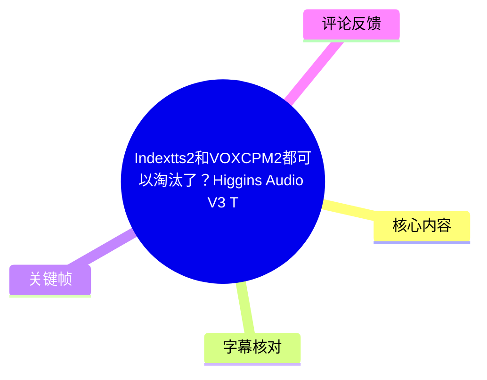
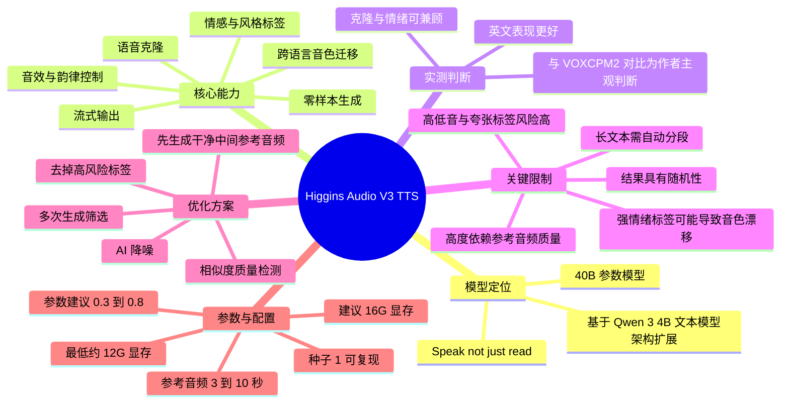
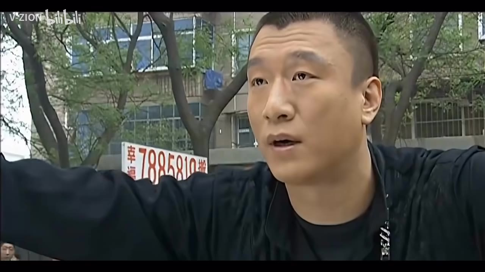
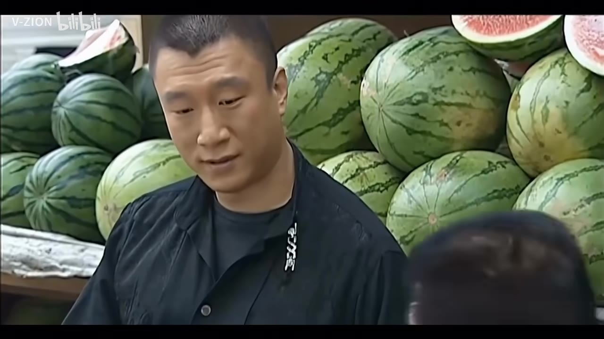
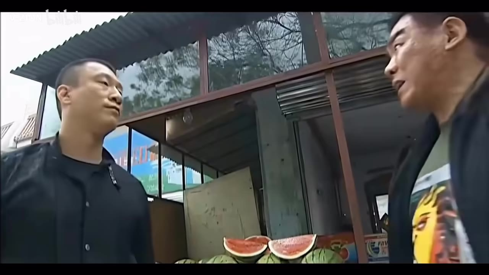

# Indextts2和VOXCPM2都可以淘汰了？Higgins Audio V3 TTS太强了！！！【整合包+教程+使用提示词】

> 来源：[Bilibili 视频](https://www.bilibili.com/video/BV1JSjG6LEWP)  
> UP 主：V-ZION｜合集：AIcode｜时长：27 分 27 秒｜画面规格：3840×2160  
> 标签：TTS、配音、教程、情感克隆、VOXCPM、Higgins Audio V3、AI 配音、语言克隆

## 小结

视频围绕 **Higgins Audio V3** 的实际试听、整合包界面与踩坑经验展开。UP 主的核心判断是：该模型并非传统朗读型 TTS，而是基于 **Qwen 3 4B 文本模型架构扩展**的语音模型；其优势在于流式输出、情感/风格/音效/韵律标签、跨语言音色迁移，以及在保持音色的同时尝试改变情绪。

从视频演示看，Higgins Audio V3 可进行零样本语音合成、参考音频驱动的音色克隆和跨语言生成。UP 主尤其认可其英文效果、情感表现和克隆上限，并主观认为其极致克隆能力可与 VOXCPM2 对比，功能覆盖则更丰富。但“Indextts2 和 VOXCPM2 都可以淘汰”的标题属于视频作者的强烈主观表达，并不能视为普适的性能结论。

真正决定结果的不是单纯模型能力，而是**参考音频质量、参考文本准确度、情绪标签强度及随机采样**。视频明确展示：当参考音频带有底噪、环境音、录音感或滤波痕迹，同时再叠加强烈情绪标签时，可能发生音色明显漂移，甚至男声变女声。UP 主将此概括为模型对参考音频“要求非常高”。

可复用的解决路径有四类：去掉高风险情绪标签、启用 AI 降噪、使用相似度质量检测配合多次生成“抽卡”、先用无情绪标签生成一条干净且音色稳定的中间音频，再将其作为新的参考音频。四种手段可以叠加，但最优先的仍然是提供干净、清楚、情绪饱满且文本准确的原始参考音频。

参数方面，UP 主通常使用约 **0.3～0.8** 的参数范围；数值较低被其描述为更固定、较稳定，较高则表现力和随机性更强。种子为 `1` 时，在标签、参数、语言和参考音频等其余条件固定的前提下可复现；种子为 `0` 时随机。官方建议的参考音频时长为 **3～10 秒**。

视频的时效性需要注意：模型、整合包、标签行为、许可与下载链接都可能更新。UP 主称 GitHub 上有“不准商用”的约定，建议使用者自行留意；该说法仅记录视频陈述，不构成对当前许可证或商用可行性的法律判断。视频还称部分标签存在未公开或需要实测才会暴露的 Bug，因此实际生产前必须进行自己的稳定性测试。

## 思维导图





## 目录

- [开场试听与模型定位](#开场试听与模型定位)
- [核心能力：流式、标签、跨语言与语言覆盖](#核心能力流式标签跨语言与语言覆盖)
- [实测：零样本、情感表达与语音克隆](#实测零样本情感表达与语音克隆)
- [整合包的标签写法与基础使用流程](#整合包的标签写法与基础使用流程)
- [参考音频是成败关键：问题与原因](#参考音频是成败关键问题与原因)
- [四种稳定音色的解决方案](#四种稳定音色的解决方案)
- [参数、指令模式与标签避坑](#参数指令模式与标签避坑)
- [长文本与多人配音](#长文本与多人配音)
- [硬件需求、许可与后续内容](#硬件需求许可与后续内容)
- [结论与限制](#结论与限制)
- [字幕比对](#字幕比对)
- [评论分析](#评论分析)
- [处理记录](#处理记录)

## 开场试听与模型定位 [01:49](https://www.bilibili.com/video/BV1JSjG6LEWP?t=109)

视频开头约 1 分 49 秒，UP 主说明前段“瓜摊”对白是模型效果展示的一部分，随后正式介绍 Higgins Audio V3，并将其评价为近几个月来自己认为“最牛”的 TTS 模型之一。该评价是作者基于测试体验作出的判断，不是统一基准测试结论。

在模型官网介绍页中，UP 主提到它是一个 **40B 参数**模型，并将其最有创造性的特点概括为：

- 模型从 **Qwen 3 4B** 文本模型架构扩展而来；
- 底层属于文本模型/LLM 路线，而不是传统 TTS 的典型结构；
- 因此可拥有传统 TTS 相对缺少的一些能力，但使用时也需要更多操作和调试；
- 官方理念被概括为 **“Speak not just read”**：目标是更接近自然讲话，而不是机械朗读。

这里的“Qwen 3 4B”“40B”等模型命名均按视频 ASR 内容记录。视频本身没有展示完整模型技术论文、架构图、训练集或客观评测方法，因此不能据此推导其具体网络结构、参数构成或全场景性能。


> 图：关键帧展示了视频开场采用的“瓜摊”影视对白画面。它有助于理解 UP 主为何在 01:49 处询问“前面段的音频效果怎么样”——开头片段被用作合成声音的试听引子，而非教程主体本身。

## 核心能力：流式、标签、跨语言与语言覆盖 [03:11](https://www.bilibili.com/video/BV1JSjG6LEWP?t=191)

### 流式输出与自然对话设想 [03:30](https://www.bilibili.com/video/BV1JSjG6LEWP?t=210)

UP 主将第一项能力称为“又快又能流式”，并解释为模型可以在运行过程中持续输出音频，而非必须等待整段音频全部生成完成。

其应用设想包括：

1. 将 TTS 接入对话系统；
2. 用于更即时的自然对话；
3. 接入视频中口述的 OpenClaw 等工具或系统。

这部分是应用方向描述，并没有在视频中给出完整接入命令、API、实时延迟指标或端到端部署流程。因此可将其视为模型能力与潜在用途，而不应直接等同于已完成的实时语音助手工程方案。

### 标签体系：情绪、风格、音效与韵律 [04:01](https://www.bilibili.com/video/BV1JSjG6LEWP?t=241)

UP 主展示的整合包将能力包装为可直接填写的标签，主要包括：

- **情感标签**：用于控制如愤怒、愉悦、悲伤等表现；
- **风格标签**：影响整体说话风格；
- **音效标签**：例如笑声；
- **节奏控制**：短暂停顿、长停顿、快速、慢速等；
- **音高控制**：高音、低音标签。

作者认为其情感标签种类较丰富，并主观比较称其比 IndexTTS2 丰富，且一些停顿、快慢速功能在不少其他 TTS 中不常见。后文也特别指出，并非每个标签都稳定有效，部分标签组合反而会伤害音色一致性。

### 跨语言音色迁移 [04:36](https://www.bilibili.com/video/BV1JSjG6LEWP?t=276)

UP 主将跨语言音色迁移解释为：输入一种语言的参考音频，却让模型生成另一种语言的内容，同时尽量保留说话者音色。例如，可用日语说话者的参考音频生成中文普通话。

视频中以“太乙真人”风格的中文参考音频为例，试听了英文输出：

> “Hello everyone. This is a cross-language test. I am using a Chinese voice reference.”

随后还试听了普通话输出。UP 主认可其效果，并认为该模型在跨语言音色保持方面优于很多其他 TTS 的通常表现；但视频没有给出客观音色相似度、语言可懂度或多人盲测数据。

### 语言覆盖与中英文表现 [05:57](https://www.bilibili.com/video/BV1JSjG6LEWP?t=357)

UP 主表示模型语言覆盖较广，并将其与 VOXCPM 等工具对比；不过他也明确给出自己的体验排序：

- 中英文适配相对更好；
- **英文效果可能优于中文**；
- 英文情感表达也被其认为更强。

这是一条重要的实操预期：若项目目标是高情绪、自然度较高的英文配音，作者的体验更乐观；中文输出可用，但不宜假定与英文完全同等。



> 图：该关键帧继续呈现开场对白素材。视频以熟悉的影视化片段作为试听对象，便于观众从自然口语、人物语气和情绪强度的角度感知合成效果。

## 实测：零样本、情感表达与语音克隆 [06:10](https://www.bilibili.com/video/BV1JSjG6LEWP?t=370)

### 零样本语音合成 [06:10](https://www.bilibili.com/video/BV1JSjG6LEWP?t=370)

UP 主先播放了不使用参考音频的零样本合成示例。视频将其称作“零参考音频进行语音合成”，并以不同内容试听效果。

需要区分两件事：

- 视频确实展示了零参考音频生成；
- 本期主要教程仍集中在**参考音频驱动的克隆、标签控制与稳定性问题**；
- 对无参考音频生成的深入分析，UP 主称将在下期继续讲解。

因此，不能仅凭本期视频将零样本功能视为已经讲透或完成全面调优。

### 情感表达：可塑性与语言差异 [06:59](https://www.bilibili.com/video/BV1JSjG6LEWP?t=419)

作者随后试听愤怒、激动、中文悲伤等内容。其结论是：

- 相比自己提到的 IndexTTS，Higgins Audio V3 的声音更有“真人感”；
- 英文情感表达在作者听感中更强；
- 中文效果仍可接受，但可能略逊于英文。

这意味着“带情绪的文本”不是自动可靠地生成：后续案例表明，一旦引入参考音频并使用高强度标签，音色一致性可能成为更严重的问题。

### 语音克隆：上限较高，但不是稳定保证 [07:40](https://www.bilibili.com/video/BV1JSjG6LEWP?t=460)

在语音克隆试听中，UP 主依次播放了多个英文例子和熟悉人物风格的中文样例，并在 09:10 左右给出主观判断：模型的极致克隆效果可与 VOXCPM2 相比，同时还提供额外的情绪等功能。

该结论的合理阅读方式是：

| 维度 | 视频展示与作者观点 | 应如何理解 |
| --- | --- | --- |
| 音色相似度 | 某些样例中效果非常接近参考声线 | 表示存在较高上限，不代表每个参考音频都稳定 |
| 情绪调整 | 能在部分案例中保留音色并改变情绪 | 这是后续重点，但强标签会提高失败风险 |
| 英文表现 | 作者认为更好 | 个人实测感受，未给出标准数据 |
| 与 VOXCPM2 对比 | 作者认为可比甚至更强 | 属于主观横向评价，不能替代可复现实验 |
| 长文本生产 | 仍需分段与质检 | 不支持一次性生成非常长文本的稳定结果 |



> 图：该画面延续开场的参考试听场景。对话类台词往往包含自然停顿、语气变化和情绪冲突，因此适合用于感知 TTS 的口语化与情绪表现，但不等于模型训练素材或官方测试集。

## 整合包的标签写法与基础使用流程 [09:38](https://www.bilibili.com/video/BV1JSjG6LEWP?t=578)

UP 主展示的整合包界面中，核心输入是待生成的文本。其说明的基本写法是：

1. **每句话开头**可以放置情感标签、风格标签、速度标签，以及高音/低音类标签；
2. **句子中间**可以插入停顿、长停顿、笑声等音效标签；
3. 可以先让 AI 生成带标签的文本草稿，再手动修订；
4. 整合包中内置了两套用于生成效果/标签文本的系统指令；
5. 参考音频、参考文本、质量检测和降噪共同构成实际工作流。

视频未逐字展示每一种标签的固定语法、标签全集或系统提示词完整原文。因此，应以整合包实际界面或 UP 主后续更新版本为准，不能从 ASR 片段虚构标签格式。

### 推荐的基础操作顺序

1. 准备目标文本；
2. 为每句话添加适度的情感、风格或速度标签；
3. 在需要处加入停顿、笑声等音效标签；
4. 上传干净的参考音频；
5. 录入并核对参考文本；
6. 先用相对温和的标签试听；
7. 若输出稳定，再逐步提高情绪强度或丰富标签；
8. 若出现音色漂移，优先回到参考音频质量与标签强度排查，而非盲目反复生成。

### 演示速度

视频以“雷哥”参考音频进行演示时，UP 主称生成约 **3 秒多的音频用了 5.8 秒**。该数据是视频单个演示环境下的口述结果，受硬件、模型版本、文本长度、参考音频、并行设置和质量检测开关影响，不能直接作为通用吞吐率。

## 参考音频是成败关键：问题与原因 [12:26](https://www.bilibili.com/video/BV1JSjG6LEWP?t=746)

### 参考文本必须尽量准确 [12:26](https://www.bilibili.com/video/BV1JSjG6LEWP?t=746)

UP 主称整合包内置 ASR 模型，可自动识别参考音频文本；但自动识别未必准确，用户需要手动调整。

这一步非常关键：参考文本错误会干扰模型对“音频—文字”对应关系的理解，增加克隆不稳定、读错、发音异常或风格偏移的概率。热评中也出现了“有的字不认识容易读错字”的补充反馈，与视频强调“参考文本准确”形成相互印证，但评论仍属于个人体验，不等于已验证的系统性结论。

### 低质量参考音频与强情绪的叠加风险 [13:09](https://www.bilibili.com/video/BV1JSjG6LEWP?t=789)

视频用一个带有录音感、底噪和环境特征的参考音频进行演示。常规生成效果尚可，但加入“怨恨”等高难度情绪后，UP 主称输出出现明显异常，表现为原本男声音色“变成了女生”。

UP 主归纳的原因包括：

- 参考音频不是纯净人声；
- 音频含有底噪；
- 带有录音室感、话筒感或其他处理痕迹；
- 从影视等成品视频中提取人声，通常无法完整去掉环境音、底噪和滤波器效果；
- 模型不像某些其他 TTS 一样，能够同时模仿参考音频中的底噪与环境音；
- 强烈情绪标签叠加较差参考音频时，尤其容易导致音色不一致。

可将这个问题理解为：模型希望从参考片段中提取一个相对干净的、可分离的说话者特征；当音频本身混入较多环境或处理特征，且生成任务又要求做激烈风格变换时，模型更容易在“保留音色”和“执行情绪”之间失衡。



> 图：该关键帧显示带有复杂场景信息的影视对白画面。它对应视频后段关于影视来源参考音频的提醒：这类素材虽然容易获取，但常伴随环境声、混响或后期处理，不一定是理想的克隆参考来源。

## 四种稳定音色的解决方案 [14:53](https://www.bilibili.com/video/BV1JSjG6LEWP?t=893)

UP 主在实测后给出了四种处理方式。它们不是保证成功的“万能修复”，而是降低音色崩坏概率的组合策略。

### 方案一：去掉情绪标签，依靠模型文本理解 [14:53](https://www.bilibili.com/video/BV1JSjG6LEWP?t=893)

做法：

1. 保留参考音频；
2. 去掉前置的高风险情绪标签；
3. 直接用文本生成。

UP 主把这称作“硬解”。其理由是模型底层具有 LLM/文本模型特征，即使不直接给情绪标签，也可能从语义中判断一句话大致的情绪方向。其表达力可能弱于明确训练过的情绪标签，但通常优于完全没有情绪。

适用条件：

- 参考音频质量一般；
- 强标签已造成音色漂移；
- 优先级是保住人物音色，而非追求极端情绪。

### 方案二：启用 AI 降噪 [15:34](https://www.bilibili.com/video/BV1JSjG6LEWP?t=934)

做法：

1. 对参考音频启用整合包中的 AI 降噪；
2. 再重新生成；
3. 对比降噪前后的音色和情绪效果。

UP 主的评价较谨慎：降噪可以在一定程度上去除背景噪声和环境音，但不能保证完全解决问题。对于参考音频本来就很差、且目标又是高难度强情绪的情况，改善可能有限。

正确预期是：降噪应被视作提升输入质量的辅助手段，而不是能够还原被混响、压缩、滤镜和复杂环境声污染的人声“原始真相”。

### 方案三：相似度质量检测与多次生成筛选 [16:10](https://www.bilibili.com/video/BV1JSjG6LEWP?t=970)

整合包中加入了自动质量检测小模型，用于比较“生成音频”和“参考音频”的相似度。

视频给出的逻辑为：

- 若相似度超过 **0.65**，停止重试；
- 若低于 **0.65**，继续重试；
- 用户可设置最大重试次数；
- 若设为重试 3 次，未达阈值时会连同首次生成累计得到 4 次候选；
- 系统从候选中选择相似度最高的一条作为最终输出。

可将流程抽象为：

```text
生成候选音频
  ↓
计算候选与参考音频的相似度
  ↓
相似度 ≥ 0.65？
  ├─ 是：停止，采用该候选
  └─ 否：未到最大次数则继续生成
                ↓
          达到最大次数后
                ↓
          选择相似度最高的候选
```

注意：`0.65` 是视频中该整合包演示的阈值，不应被理解为任何模型、任何相似度算法都通用的行业标准。不同嵌入模型、不同说话内容、不同语言下，该数值的含义可能不同。

### 方案四：先构造干净的“中间参考音色” [17:42](https://www.bilibili.com/video/BV1JSjG6LEWP?t=1062)

这是视频中最具操作性的经验之一，完整路径如下：

1. 找一段需要生成的文本；
2. **去掉情绪标签**，先生成一条音色相对稳定的语音；
3. 将这条生成音频当作新的参考音频；
4. 再用新的参考音频生成带有困难情绪标签的目标文本；
5. 视频中建议此步骤不要开启相关质量检测选项；
6. 对比结果，观察困难标签下音色一致性是否改善。

UP 主将此方法用于解决参考音频质量一般、同时又必须表现“愤怒”等情绪的问题。其核心思想不是从原始低质量素材中硬提纯，而是先让模型输出一条更符合自身偏好的稳定声线，再以此作为后续克隆锚点。

### 四种方案的优先级建议

| 优先级 | 操作 | 主要目标 | 代价或限制 |
| --- | --- | --- | --- |
| 1 | 更换为干净参考音频 | 从源头减少失败 | 好素材未必容易取得 |
| 2 | 去掉强情绪/危险标签 | 优先保持音色 | 情绪表现可能变弱 |
| 3 | 开启降噪 | 降低环境噪声影响 | 无法完全去除处理痕迹 |
| 4 | 多次生成与相似度筛选 | 用采样提高命中率 | 增加时间与算力消耗 |
| 5 | 构造中间参考音色 | 为困难标签建立稳定锚点 | 工作流变长，仍需试听验证 |

UP 主明确说四种方法可以叠加，但也指出最简单、最可靠的方式仍是上传高质量参考音频。

## 参数、指令模式与标签避坑 [20:03](https://www.bilibili.com/video/BV1JSjG6LEWP?t=1203)

### 参数与种子 [20:19](https://www.bilibili.com/video/BV1JSjG6LEWP?t=1219)

UP 主给出的参数经验如下：

| 项目 | 视频中的说明 | 实操含义 |
| --- | --- | --- |
| 生成参数 | 通常可使用 `0.3～0.8` | 作者个人感觉差异没有特别大 |
| 较低参数 | 输出更固定、可能更稳定 | 适合优先追求一致性 |
| 较高参数 | 表现力更强、随机性更高 | 可能增加不可控性 |
| 其他两个参数 | 作者称可保持固定，不重点调整 | 视频未清楚给出名称，不宜臆测 |
| 种子 `1` | 条件全固定时，重复生成效果相同 | 用于复现和对照 |
| 种子 `0` | 随机 | 用于扩展候选、进行“抽卡” |

其中“参数”在 ASR 中没有被可靠识别出具体名称，可能是界面中的采样类参数，但视频素材未提供可确认的 UI 文本，因此这里只保留其数值和作者描述，不擅自命名为 temperature、top-p 等。

### 参考音频规格 [21:02](https://www.bilibili.com/video/BV1JSjG6LEWP?t=1262)

UP 主称官方建议：

- 最佳参考音频时长：**3～10 秒**；
- 参考音频应包含较饱满的情绪；
- 发音要清楚；
- 参考文本一定要准确。

这组条件比“随便截一段声音”严格得多。尤其对影视素材而言，若片段有配乐、混响、环境声、台词重叠或明显后期音效，虽然听上去是一个可辨认的人声，但仍不一定是模型意义上的优质参考。

### 正常版与保守版系统指令 [21:16](https://www.bilibili.com/video/BV1JSjG6LEWP?t=1276)

UP 主的整合包提供两套系统指令：

- **正常版**：适合参考音频质量非常好的情况；
- **保守版**：适合参考音频不够理想的情况。

作者的实际偏好是更多使用保守版，因为即使参考音频较好，正常版偶尔也会出现异常。若参考音频较差，可先采用“方案四”加工出中间参考音频，再尝试保守版或正常版。

### 高风险标签与建议回避项 [22:42](https://www.bilibili.com/video/BV1JSjG6LEWP?t=1362)

UP 主在测试中给出的明确避坑建议：

1. 视频界面中标红的若干标签属于较困难、较容易失败的标签；
2. 有三个风格类标签效果不理想，作者推测模型学习可能不够；
3. **不建议使用高音、低音标签**：它们可能让输出“不像同一个声音”；
4. **尽量不要使用“夸张”标签**；
5. “夸张”叠加其他标签时，即使参考音频正常，也可能导致输出崩坏；
6. 对困难标签、参考音频质量差、强烈情绪三者叠加的场景，应预期更高失败率和更多重试。

视频没有完整列出“标红标签”和“三个风格标签”的具体名称，故不能补写为具体标签清单。

## 长文本与多人配音 [23:04](https://www.bilibili.com/video/BV1JSjG6LEWP?t=1384)

### 长文本模式：按行分段 [23:04](https://www.bilibili.com/video/BV1JSjG6LEWP?t=1384)

UP 主表示，和 VOXCPM2 一样，Higgins Audio V3 不适合一次性生成特别长的文本，否则可能出错。因此整合包的长文本模式会自动分段。

视频说明的关键规则是：

- 长文本按**分行**进行分段；
- 每一行前面都可以添加情感标签；
- 长文本模式同样支持 AI 降噪和质量检测；
- 质量检测会对每一个已生成分段单独执行。

因此，适合将长文整理为“一行一个可独立合成的语义段”。这不仅方便给不同段落设置情绪，也有利于定位哪一段的发音、音色或情绪出了问题。

### 多人配音格式 [24:03](https://www.bilibili.com/video/BV1JSjG6LEWP?t=1443)

UP 主还展示多人配音功能，并将其视为未来制作小说、有声书类内容的目标路径。其描述的输入格式是：

```text
说话人：台词内容
```

整合包会自动识别文本中有哪些说话人。视频开头的对白效果即被说明为该多人配音模式生成的来源之一。

但 UP 主同时强调：

- 多人配音仍有较强随机性；
- 可能需要反复生成筛选；
- 情感标签是否有效依然高度依赖参考音频质量；
- 想达到商品化有声书或专业平台配音品质，不能仅凭一次生成判断，需要长期质量控制。

## 硬件需求、许可与后续内容 [25:04](https://www.bilibili.com/video/BV1JSjG6LEWP?t=1504)

### 显存与附加模型 [25:04](https://www.bilibili.com/video/BV1JSjG6LEWP?t=1504)

视频给出的硬件经验：

| 项目 | 视频中的说法 |
| --- | --- |
| 最低显存建议 | 大约 **12G** |
| 更推荐的显存 | **16G** |
| 12G 是否一定可用 | UP 主未亲自验证 |
| AI 降噪与质量检测小模型 | 合计仅占十几 MB 内存，速度很快 |
| 内置 ASR 模型 | 约 800 多 MB，可能是更大的附加组件 |
| 速度比较 | UP 主认为比 VOXCPM2 快很多 |

这里须注意“内存”和“显存”在口述中可能混用。视频明确提出的是显存门槛“至少 12G、最好 16G”，而 AI 降噪、质量检测和 ASR 模型的占用描述并不构成完整的 CPU 内存、GPU 显存、磁盘空间与模型权重占用清单。实际部署时应以整合包 README、运行日志和本机硬件为准。

### 商用与分发提醒 [09:20](https://www.bilibili.com/video/BV1JSjG6LEWP?t=560)

UP 主称该模型有“不准商用”的协议/约定，并提到 GitHub 上类似“君子协定”，提醒观众注意。这是视频作者的转述，不等价于完整、有效或当前版本的许可证文本。

如需用于任何商业用途，应自行核验：

1. 官方仓库和模型权重的最新许可证；
2. 整合包中所含每个第三方组件的许可证；
3. 参考音频及被克隆声线的授权状态；
4. 所在地区关于声音克隆、人格权益、肖像与版权的规则；
5. 输出内容是否构成冒充、误导或侵犯他人权益。

### 后续内容与信息时效 [25:49](https://www.bilibili.com/video/BV1JSjG6LEWP?t=1549)

UP 主预告下期将重点讨论**无参考音频生成语音**。其设想是：为 Higgins Audio V3 专门生成更干净的参考音频，解决影视提取声源不可避免地包含底噪、环境音和滤波痕迹的问题。

视频结尾还提到：

- 许多标签问题并未在官网中完整说明；
- 部分标签的 Bug 来自作者实测；
- 整合包会分享，但更新可能通过群聊进行；
- 下载链接容易失效或被吞。

这意味着本视频特别依赖版本、整合包实现和作者后续维护，读者应将其作为一份测试经验文档，而不是永久不变的产品说明书。

## 结论与限制

Higgins Audio V3 在视频中呈现出的最强价值，是把**音色克隆、情绪控制、音效/节奏标签、跨语言迁移和流式输出**放在同一个工作流中。对于希望制作角色对白、情绪化旁白、多语言配音、小说/有声书试验内容的创作者，它具备值得测试的能力上限。

但模型并非“替换一切 TTS”的无条件答案。视频反复展示的现实限制包括：

- 参考音频质量对结果有决定性影响；
- 影视、直播、录屏等常见素材不必然适合作为参考；
- 参考文本必须人工校正；
- 强情绪、夸张、高低音等控制可能造成音色漂移；
- 长文本必须分段；
- 多人配音和复杂标签存在随机性，可能需要多次采样；
- 相似度阈值 `0.65` 仅是视频整合包中的经验配置；
- “比 VOXCPM2 强”“可淘汰 IndexTTS2”等是作者基于个人测试作出的评价，不是普适结论；
- 商用限制需要以最新官方许可证与具体权利授权为准。

最可迁移的方法论是：**先保证输入干净，再逐步提高控制强度；先建立可复现基线，再以随机采样寻找上限；把质量检测当成筛选工具，而不是把差素材变好的魔法。**

## 字幕比对

| 字幕来源 | 完整性 | 专有名词 | 时间轴 | 主要问题 |
| --- | --- | --- | --- | --- |
| Bilibili 站内字幕 | 未提供可用站内字幕 | 无法核验 | 无法使用 | 素材获取日志显示字幕工具因 URL 无效而退出，未获得站内字幕内容 |
| 本次 ASR 字幕 | 较高，125 个分段；语音覆盖约 82.12% | 存在较多识别偏差 | 完整提供，已用于所有时间轴链接 | 人名、模型名、英文术语、数字及口语重复处误识别较多 |

### 最终字幕选择

本次未获得可用站内字幕，因此正文以 **本次 ASR 时间轴字幕**为唯一可定位文本来源。ASR 诊断显示：

- 识别语言：中文；
- 模型：`large-v3-turbo`；
- 音频时长：约 1646.55 秒；
- 有时间戳：是；
- 语音覆盖：约 82.12%；
- 首段语音：01.810；
- 最后一段语音：27:25.350；
- 未标记 `noAudioStream=true`，说明源视频存在音轨，本次 ASR 也实际完成了识别。

### 结合上下文校正的重点术语

下列写法是依据视频标题、元数据标签、上下文及 ASR 交叉校正后的表达：

| ASR 常见识别 | 正文采用写法 | 校正依据 |
| --- | --- | --- |
| Queen 34B / Quin | Qwen 3 4B | 视频口述上下文与模型命名语境 |
| index TTS2 | IndexTTS2 | 视频标题与标签 |
| VoxCPM / VokeCPM2 / ValkCBM | VOXCPM2 | 视频标题与标签“VOXCPM” |
| Higgins AudioV3 | Higgins Audio V3 | 视频标题与标签 |
| AEI | AI | 语义为“先用 AI 生成标签文本” |
| 参导文本、参讨文本 | 参考文本 | 上下文明确为参考音频对应文本 |
| 抽卡 | 多次随机生成筛选 | 视频创作者口语表达 |
| AI降低 | AI 降噪 | 上下文明确讨论去除背景噪声 |
| 相估度 | 相似度 | 后续明确描述为生成音频和参考音频的相似度比较 |

ASR 对开场影视台词、英文试听内容和个别中文词句存在较明显听写偏差，因此正文未把这些片段当作精确引用材料；涉及技术参数、阈值和操作顺序的部分，均优先采用有明确时间段支持的口述内容。

## 评论分析

仅获取到 2 条热评，少于“热评前三条”的上限；以下仅分析可获取内容，不补造第三条。

### 热评 1：音色克隆不等于节奏克隆

> 用户“阿山看世界”（9 赞）：  
> “只克隆了音色，没有克隆到说话节奏，一字一句都是匀速的”

这条评论指出了一个与视频主线不同的评价维度：即使音色接近，**说话节奏、断句、重音和个体韵律**未必被完整保留。视频侧重演示情绪标签、音效和音色一致性，但并未对“原说话人独有的自然节奏是否被高保真复刻”进行专门对照测试。

该评论属于单一用户听感，不足以证明模型一定“匀速”。但它提醒实际使用者：验收克隆结果时，应把音色相似度、节奏、重音、停顿、情感和发音准确性分开评价，不能只听“像不像”。

### 热评 2：稳定性、读字与生产可用性问题

> 用户“小新L00”（4 赞）：  
> “Higgins Audio V3 的音色确实可以，但情感指令难学，有的字不认识容易读错字，使用指令的话，音色会不准确，男声变女生都很常见。整体非常不稳定，不能投入生产，需要大量生成”

该评论的主要观点包括：

- 认可模型音色能力；
- 认为情感指令较难掌握；
- 指出可能读错字；
- 认为使用指令时音色准确性下降；
- 提到男声变女声；
- 认为不稳定且需要大量生成，不宜直接投入生产。

其中“男声变女生”“强情感指令与音色不一致”“需要抽卡”的描述，与视频中 UP 主展示的失败案例和质量检测方案方向一致。视频同样没有宣称模型已经稳定适合直接规模化生产，反而强调参考音频质量、标签风险和多次生成筛选。

但“不能投入生产”仍是评论者的结论，不应当作已验证事实。更稳妥的表述是：在没有建立参考素材规范、参数模板、自动质检、人工复听和错误回退机制之前，该模型的随机性会为生产流程带来风险。

## 处理记录

- Worker ID：`worker-mrj0wjed-b0c290ad`
- 整理模型：`gpt-5.6-terra`
- ASR 模型：`large-v3-turbo`
- ASR 运行环境：CUDA，`int8_float16`
- 使用的素材工具：视频元数据读取、音频提取、关键帧提取、ASR 时间轴转录、热评获取。
- 字幕检查：
  - 已检查站内字幕：未提供可用站内字幕；
  - 字幕工具日志：`Invalid URL`，未取得站内字幕；
  - 已检查本次 ASR：存在有效音轨与带时间戳的 125 段 ASR 结果；
  - 最终采用：以 ASR SRT 时间轴为准，结合标题、标签、上下文校正模型与工具名称。
- 关键帧选择依据：
  - 选用 `frames/frame-001.jpg`、`frames/frame-002.jpg`、`frames/frame-003.jpg`、`frames/frame-004.jpg`；
  - 这些画面均对应视频开头用于展示 TTS 效果的影视对白素材；
  - 由于已提供关键帧主要为开场试听画面，未展示后续整合包 UI 的可确认截图，故未将其误标为参数界面或模型官网界面。
- 热评处理：仅分析成功获取的前 2 条热评；未提供第 3 条，不予虚构。
- 缓存清理：素材清单未提供缓存清理执行记录，无法确认是否已清理；本整理不对该状态作未经证实的声明。
- 未解决问题：
  - 未获得站内字幕，ASR 中存在专有名词和英文片段误识别；
  - 未提供模型官网、GitHub 仓库、整合包下载地址及当前许可证原文；
  - 未提供可供核验的完整整合包界面关键帧；
  - 视频内的性能比较和“淘汰”判断主要来自作者个人测试，缺少统一基准与可复现实验配置。
