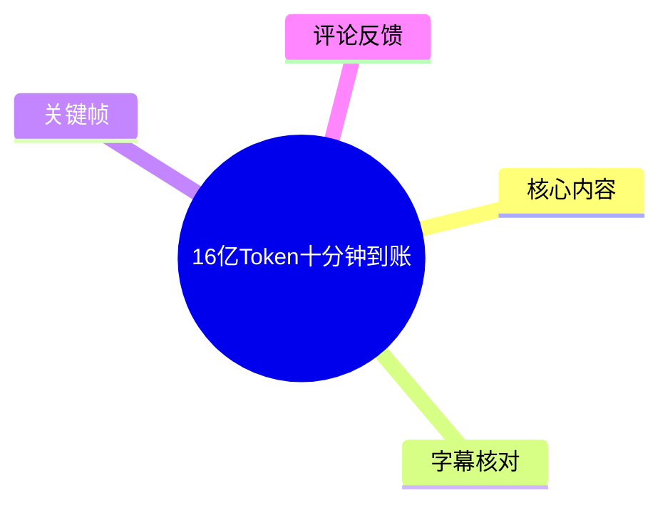
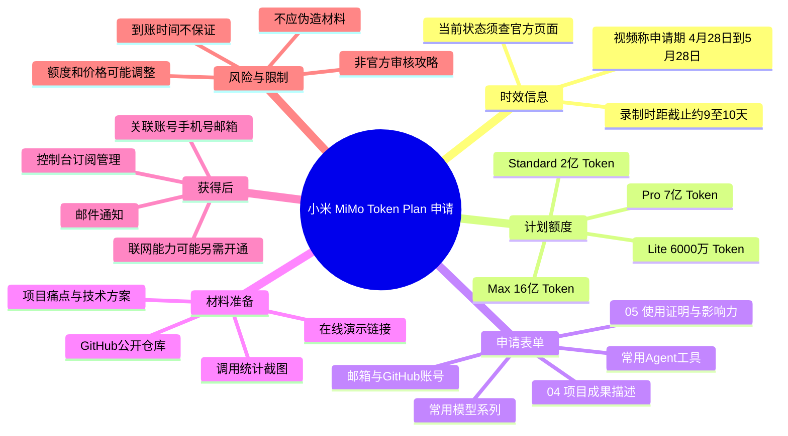
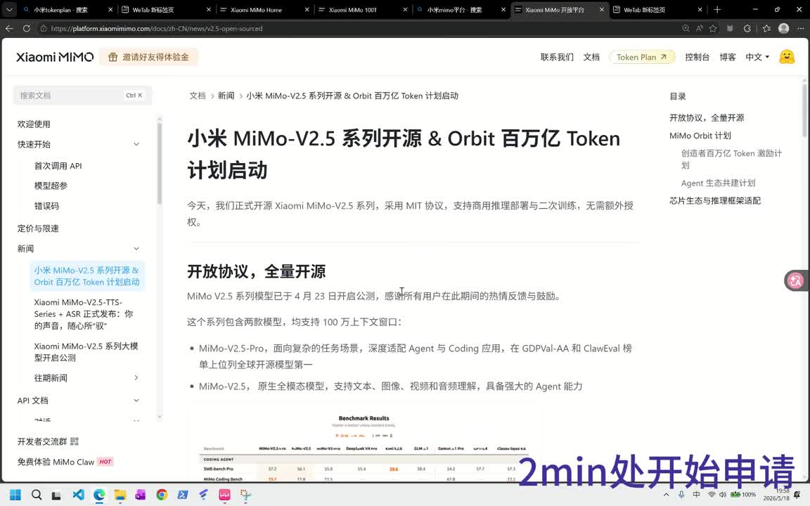
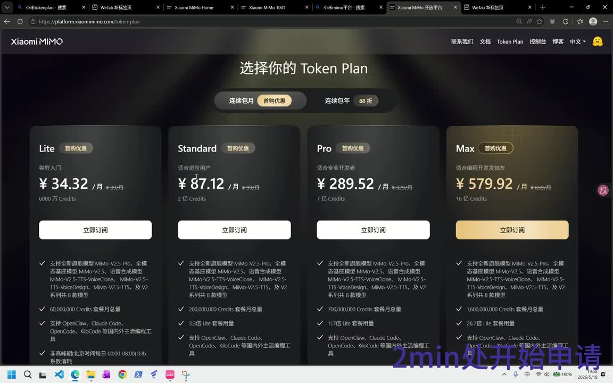
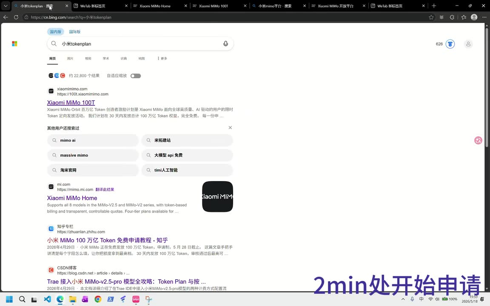
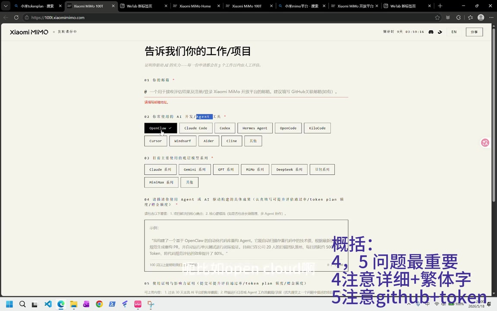

# 16亿Token十分钟到账

> 来源：[Bilibili 视频](https://www.bilibili.com/video/BV1UULA6cEBt) 
> UP 主：Qqqqqq_777｜时长：10 分 39 秒｜合集：AIcode  
> 视频简介：小米百万亿 Token Plan 计划申请。

## 小结

视频演示的是小米 MiMo V2.5 相关「Token Plan」的申请思路与后台查看方式。UP 主介绍，活动申请窗口在其录制时为北京时间 **4 月 28 日至 5 月 28 日**；其录制当天为 5 月 18 日，页面还显示约 9 天倒计时。因此这是一条强时效内容，按视频中的日期推算，该窗口现已过期，是否有新的计划、规则或额度，必须以小米 MiMo 当前官方页面为准。

视频画面中的 Token Plan 包含 Lite、Standard、Pro、Max 四档。UP 主重点讲述的额度分别为 **6000 万、2 亿、7 亿、16 亿 Token**，并以当时页面月费价格约 **34.32 元、87.12 元、289.52 元、579.92 元**作对照。标题所称“16 亿 Token”对应 Max 档，而非每位申请者均可获得的固定额度。

申请流程的核心不是前面的工具和模型勾选，而是表单第 04、05 项：一项是使用 AI/Agent 构建项目的具体成果，另一项是使用证明与影响力证明。UP 主的经验是：项目描述要具体、附上真实的调用统计截图、提供公开的 GitHub 项目或在线演示链接，并把小米账号、手机号和申请邮箱完成关联，等待邮件通知。

需要特别区分“视频经验”与“官方规则”。例如“前面选项不会被验证”“04、05 是决定因素”“繁体字可能更容易获得高额度”“审核由 AI 完成”等，均为 UP 主个人推测、观察或来自评论区的经验，视频没有给出官方审核规则证明。申请材料应真实准确，不应为了获得额度而伪造使用记录、项目成果或影响力。

标题中的“十分钟到账”也不能由视频正文直接证实。UP 主实际分享的是自己晚上 9 点申请、凌晨约 1 点到账，约为数小时；热评中有人称次日收到 16 亿额度。到账速度存在个体差异，不能据此承诺十分钟或固定时限。

## 思维导图

## 目录

- [活动背景、模型与额度](#活动背景模型与额度)
- [申请入口与基础表单](#申请入口与基础表单)
- [关键材料：第 04、05 项](#关键材料第-0405-项)
- [GitHub 项目与账号关联](#github-项目与账号关联)
- [领取后查看订阅与联网限制](#领取后查看订阅与联网限制)
- [可执行申请清单](#可执行申请清单)
- [时效性、风险与结论](#时效性风险与结论)
- [关键帧索引](#关键帧索引)
- [字幕比对](#字幕比对)
- [评论分析](#评论分析)
- [处理记录](#处理记录)

## [活动背景、模型与额度](https://www.bilibili.com/video/BV1UULA6cEBt?t=0)

视频开头说明主题为「小米 MiMo V2.5 的百万亿 Token 计划如何申请」。站内字幕与本次 ASR 均能确认主题和主要时间段；其中模型名应以画面和站内页面中的 **MiMo** 为准，而不是 ASR 偶有识别出的 “MIMO”“memo”。

### 申请窗口与适用方向 [00:00:09](https://www.bilibili.com/video/BV1UULA6cEBt?t=9)

UP 主口述的申请窗口为北京时间 **4 月 28 日至 5 月 28 日**，并称当时是 5 月 18 日、还剩 10 天；随后申请页画面显示倒计时约 9 天。这一日差可能来自录制、页面倒计时与口述时点不同，不影响其“临近截止”的结论。

UP 主将 MiMo 的主要适用方向概括为：

- **Agent（智能体）**：面向可自主执行或协同完成任务的 AI 工作流；
- **Coding（编程）**：在终端或开发流程中辅助完成代码工作；
- 一般 AI 应用尝试：适合希望试用 Agent 或构建 AI 应用的人。

> 图：画面展示小米 MiMo 文档页标题「小米 MiMo-V2.5 系列开源 & Orbit 百万亿 Token 计划启动」，并列出模型定位。它用于确认视频讨论的对象是 MiMo V2.5 及其 Token 计划，而非泛指任意小米产品。

### 套餐额度与视频所示价格 [00:01:03](https://www.bilibili.com/video/BV1UULA6cEBt?t=63)

UP 主通过 Token Plan 页面，按月费视图说明了四档套餐。画面与口述可整理如下：

| 档位 | 视频所示月费 | 视频所述月度 Token 额度 | UP 主的说明 |
| --- | ---: | ---: | --- |
| Lite | ¥34.32/月 | 6000 万 Credits / Token | 最低档 |
| Standard | ¥87.12/月 | 2 亿 Credits / Token | UP 主称多数申请者获得这一档 |
| Pro | ¥289.52/月 | 7 亿 Credits / Token | UP 主称较少数人获得 |
| Max | ¥579.92/月 | 16 亿 Credits / Token | 视频主角所获档位 |

这里有两个口径需要注意：

1. 页面使用的是 **Credits**，UP 主在讲解中统一称为 Token；视频没有解释 Credits 与 Token 是否严格按 1:1 对应，本文沿用视频的说明，不额外推断兑换关系。
2. 上表是视频画面在当时显示的价格和额度，不构成当前价格、可申请资格或必然发放结果。

UP 主将 Max 的 16 亿额度折算为“接近 600 元”的月度价值，这是基于当时 Max 页面价格约 579.92 元的口语化对照，并非现金返还或可直接兑现的价值。

> 图：画面同时呈现 Lite、Standard、Pro、Max 四档，能直观看到 6000 万、2 亿、7 亿、16 亿的分档关系，以及视频所引的月费数字，是核对参数的核心画面依据。

## [申请入口与基础表单](https://www.bilibili.com/video/BV1UULA6cEBt?t=118)

### 1. 搜索并进入活动页 [00:02:04](https://www.bilibili.com/video/BV1UULA6cEBt?t=124)

UP 主没有在视频中口述固定 URL，而是建议通过搜索引擎搜索 **“小米 token plan”**，从结果中进入相关页面。搜索结果画面中出现 “Xiaomi MiMo 100T” 字样及活动简介。

由于活动页、域名、页面标题均可能随时间调整，更稳妥的做法是：

1. 优先从小米 MiMo 官方文档、开发者平台或官方导航进入；
2. 核对页面域名、活动状态、申请截止时间和服务条款；
3. 不要仅依据视频截图或第三方搜索结果填写账号资料。

> 图：画面示范了 UP 主的入口发现方式：搜索“小米tokenplan”并进入 MiMo 相关结果。它说明的是搜索路径，不等同于长期有效的官方链接。

### 2. 填写邮箱与基础偏好 [00:02:24](https://www.bilibili.com/video/BV1UULA6cEBt?t=144)

表单前半部分在画面中可见：

- **01：你的邮箱**  
  画面提示该邮箱用于接收评估结果及注册/登录 Xiaomi MiMo 开放平台。UP 主建议使用与 GitHub 账号相关的邮箱，并建议先拥有 GitHub 账号。
- **02：你常使用的 AI 开发 / Agent 工具**  
  画面可见 OpenClaw、Claude Code、Codex、Hermes Agent、OpenCode、KiloCode、Cursor、Windsurf、Aider、Cline、其他等选项。
- **03：目前主要使用的底层模型系列**  
  画面可见 Claude、Gemini、GPT、MiMo、DeepSeek、豆包、MiniMax 等系列。

UP 主建议按照实际情况填写常用工具与模型。其“若想尽量申请 Max 可都点一遍”的说法属于个人策略，不是官方指引；同时，他认为这部分未必是决定计划档位的真正因素。由于视频没有公开审核逻辑，填写时应坚持真实原则。

> 图：该画面展示邮箱、工具、模型系列以及第 04、05 项输入区，是理解表单结构、识别关键问题位置的直接证据。画面中的紫色大字为视频后期标注，不是官方页面字段。

## [关键材料：第 04、05 项](https://www.bilibili.com/video/BV1UULA6cEBt?t=203)

### 3. 第 04 项：AI / Agent 构建成果描述 [00:03:23](https://www.bilibili.com/video/BV1UULA6cEBt?t=203)

UP 主认为第 04 项需要写得详细。根据表单画面，其内容是描述“使用 Agent 或 AI 驱动构建的具体成果”，并提示可包括：

- 项目解决的核心痛点；
- 技术难度；
- 是否包含长链推理；
- 是否包含多 Agent 协作；
- 约定的调用量或使用规模要求。视频口述提到“100 次以上”，但未完整展示具体文字要求。

UP 主的实操建议是：将表单要求截图或复制给 AI，再让 AI 协助生成初稿。这个方式只能用于组织表达和润色；最终文本必须与真实项目、真实工作量一致，不能把 AI 自动生成的虚构经历直接提交。

UP 主举例称自己的表述中写到约 **1200 次**，并主观推测材料可能由 AI 审核。他没有展示官方审核说明，因此这不能作为事实或申请规则。

### 4. 第 05 项：使用证明与影响力证明 [00:04:20](https://www.bilibili.com/video/BV1UULA6cEBt?t=260)

UP 主反复强调第 05 项“比较重要”。其理解是应证明近期 Token 使用量，并体现项目或使用场景的价值。视频给出的材料方向包括：

| 材料类型 | 视频中的做法 | 应注意的真实性要求 |
| --- | --- | --- |
| API 使用额度 / 用量 | 若日常调用 DeepSeek V4 / V4 Pro 一类 API，可放对应使用额度或统计 | 截图应为本人账户、真实期间和真实数据 |
| 工具使用统计 | 若使用 cc switch，可在工具内查“使用统计” | 不要修改截图、拼接数据或隐去关键归属信息 |
| 项目说明 | 写清核心痛点、长链推理、多 Agent 协作等 | 只描述实际实现、可复现的能力 |
| GitHub / Demo | 提交项目链接或产品在线演示地址 | 链接应可访问，项目应与表单描述相符 |

UP 主展示的个人情况是：在 cc switch 中选择约 **30 天**的统计范围，显示自己使用了 **3 亿多 Token**。他称这部分高用量与此前接入 OpenAI 额度有关；目前则更多使用 DeepSeek 和小米 MiMo。该用量只代表其个人账户与个人历史，不能用作普通申请人的参考基线，更不能理解为官方门槛。

### 关于繁体字建议 [00:06:04](https://www.bilibili.com/video/BV1UULA6cEBt?t=364)

UP 主称自己在第 04 项使用繁体字、最终获得 16 亿 Token；该建议来源于 B 站评论区。他明确表示“我不确定”，因此应将其视为未证实的个例相关性，而不是提高额度的有效方法。文字字体或语言版本不应替代真实项目成果、使用证明与合规资料。

## [GitHub 项目与账号关联](https://www.bilibili.com/video/BV1UULA6cEBt?t=417)

### 5. 上传可验证的项目链接 [00:06:57](https://www.bilibili.com/video/BV1UULA6cEBt?t=417)

UP 主建议第 05 项附上：

- GitHub 项目链接；或
- 产品在线演示地址。

他展示自己为了该计划上传了一个 “skill” 项目，并以扩展某个既有主题内容的仓库为例，称结合近两年的素材、文稿、访谈与视频进行了深化。视频未提供仓库 URL，因此无法独立核验该项目内容或质量。

关于仓库设置，视频口述有“设置为 public（公开）”“加到公共仓库”等表述。可确定的操作要求是：**如果要让审核方访问仓库，仓库链接必须具备相应公开访问权限**。但“公共仓库而非个人仓库”的说法语义并不严谨：GitHub 的个人账户仓库也可以设为公开；关键在于链接可访问、内容与申请一致、没有泄露密钥或个人隐私。

提交前应检查：

1. 仓库首页有清晰 README，描述问题、架构、安装方式和实际效果；
2. 不提交 API Key、访问令牌、手机号、真实用户数据或其他敏感文件；
3. 如项目尚未开源，可改用经授权、可访问的演示页面或项目说明；
4. 链接内容应能支持表单中的使用成果叙述。

### 6. 关联账户并等待邮件 [00:08:38](https://www.bilibili.com/video/BV1UULA6cEBt?t=518)

UP 主表示，提交后需要将小米模型相关服务、小米账号、手机号和表单登记邮箱进行绑定，结果会通过邮件通知。站内字幕写作“要绑定一下”，本次 ASR 将此处误识别为“要保密一下”；结合语义及站内字幕，本文采用“绑定”。

UP 主的个人到账经历为：

- 晚上约 9 点提交申请；
- 凌晨约 1 点 Token 到账。

这是单一案例，约 4 小时，而非标题所称“十分钟到账”。实际审核、通知、额度生效时间可能受到活动阶段、申请量、账号状态和规则变化影响。

## [领取后查看订阅与联网限制](https://www.bilibili.com/video/BV1UULA6cEBt?t=565)

### 控制台与订阅管理 [00:09:25](https://www.bilibili.com/video/BV1UULA6cEBt?t=565)

UP 主展示在控制台查看账户和订阅管理的方式，并称其账户里显示 15 元余额：

- 初始赠送 5 元；
- 邀请好友后又得到 10 元；
- 由于其 16 亿 Token 尚未耗尽，这部分余额尚未使用。

这是 UP 主个人账户状态，不能推导为所有账户都有相同赠送、邀请奖励或余额规则。

在“订阅管理”处，他展示自己为 **Max** 档、额度为 **16 亿 Token**，下方还有 API 相关信息。可用模型方面，他重点提及 MiMo V2.5、MiMo V2.5 Pro，画面还提示可能有其他模型可选；UP 主也明确表示自己对其他模型了解不多。

### 联网能力的额外限制 [00:10:14](https://www.bilibili.com/video/BV1UULA6cEBt?t=614)

视频末尾特别提醒：UP 主称 MiMo 的“联网”能力需要另外开通，**他认为可能需要付费**；也提到存在不花钱的办法，但会较麻烦，未展开具体操作。

因此能够确认的只有：

- Token Plan 额度不应默认等同于所有增值能力均已开通；
- 联网功能是否收费、如何开通、免费方案是否存在及其限制，视频没有给出完整的官方规则；
- 应在当前控制台、定价页和服务条款中确认，不宜依据视频尝试绕过付费或权限机制。

## [可执行申请清单](https://www.bilibili.com/video/BV1UULA6cEBt?t=118)

以下清单按视频流程整理，并对其中未验证的经验作了风险标注。

1. **确认活动是否仍开放**  
   从小米 MiMo 官方入口核对申请页、截止时间、地区资格、价格和条款。视频中的 4 月 28 日—5 月 28 日窗口仅反映当时信息。

2. **准备可接收邮件的邮箱**  
   使用自己可长期访问的邮箱；如确实有 GitHub 账号，可使用与其关联的邮箱，便于材料一致性核验。

3. **如实填写常用 Agent 工具和模型**  
   根据真实使用情况选择，不把“全选”当作提高额度的方法。

4. **完善第 04 项项目描述**  
   写出真实的问题、实现方式、使用的 Agent/模型、难点、实际结果和使用规模。可用 AI 协助整理语言，但必须人工核实每一句。

5. **准备第 05 项使用证明**  
   上传真实的 API 用量、工具统计、项目运行记录或其他可验证材料。视频中的“3 亿多 Token / 30 天”只是 UP 主案例，不是官方标准。

6. **提供可访问的项目证据**  
   可提交公开 GitHub 仓库或在线 Demo。确保 README 清楚、链接未失效、仓库没有泄露密钥。

7. **关联账号与联系方式**  
   按申请页面要求完成小米账号、手机号、邮箱等绑定，留意邮件通知和垃圾邮件箱。

8. **在控制台核对生效结果**  
   查看订阅档位、剩余额度、可调用模型、API 配置和联网能力是否另有费用。

9. **避免将经验当规则**  
   不依赖“繁体字”“全选模型”“AI 审核”等未经官方证实的策略；不伪造项目、Token 截图或影响力证明。

## [时效性、风险与结论](https://www.bilibili.com/video/BV1UULA6cEBt?t=535)

### 时效性

- 视频中的活动倒计时与截止日期属于录制时快照。
- 当前元数据记录视频发布时间为 2026-05-18；按视频口述的 5 月 28 日截止时间，该轮申请已不应被视为仍开放。
- Token 档位、价格、支持模型、申请资格、审核方式、赠送余额和联网收费均可能变动，应以当前官方页面为准。

### 关键限制

- 视频没有给出官方审核标准，无法证明第 04、05 项一定是额度决定因素。
- UP 主获得 16 亿 Token 是个人结果，不代表可复制性。
- 标题“十分钟到账”与正文分享的约 4 小时到账经历不一致，不能作为时效承诺。
- 评论中出现的更高额度、次日到账和模型能力评价均未经独立验证。
- 视频内“繁体字可能更好”的说法明确带有不确定性，不应作为申请技巧依赖。
- 任何申请应遵守平台条款、隐私规则与诚信要求；项目公开前应先清理敏感信息。

### 可迁移经验

真正具备普适价值的部分是：以可验证的项目成果、真实用量记录和清晰的技术说明构成申请材料；对外提供 GitHub 或 Demo 前做好可访问性和安全性检查；领取后再分别核对订阅额度、API 权限及联网等附加服务。相比“堆选项”或猜测审核偏好，这些做法更稳健、合规。

## [关键帧索引](https://www.bilibili.com/video/BV1UULA6cEBt?t=0)

| 关键帧 | 正文位置 | 画面价值 |
| --- | --- | --- |
|  | 活动背景 | 确认 MiMo V2.5、开源与 Orbit 百万亿 Token 计划的官方页面语境。 |
|  | 额度与价格 | 同屏展示 Lite、Standard、Pro、Max 的价格、Token / Credits 档位。 |
|  | 申请入口 | 记录视频使用搜索“xiaomi tokenplan”寻找入口的过程。 |
|  | 表单关键项 | 展示邮箱、Agent 工具、模型系列与第 04、05 项的实际布局。 |

## [字幕比对](https://www.bilibili.com/video/BV1UULA6cEBt?t=0)

| 字幕来源 | 完整性 | 专有名词 | 时间轴 | 主要问题 |
| --- | --- | --- | --- | --- |
| Bilibili 站内字幕 | 覆盖完整，覆盖至 10:31 | 整体较好，能稳定识别 MiMo、GitHub、Token Plan、cc switch 等 | 分段细，适合定位章节 | 有口语重复、少量转写不规范，如 “MIO”“A景”“DPSKV4” |
| 本次 ASR 字幕 | 覆盖 560.11 秒语音，占视频约 87.69%，共 41 段 | 专名误识别较多 | 有完整时间戳，整体与站内字幕起止点接近 | 将 MiMo 识别为 MIMO / memo / min；DeepSeek 识别为 dipstick；“绑定”误为“保密”；Claude Code、OpenClaw 等亦有混淆 |

### 最终字幕选择与校正

最终以**站内字幕为主、本次 ASR 为交叉核对**，并结合关键帧中的网页文字校正专有名词和含义。此次 ASR 诊断显示音频存在，语言为中文、置信度约 0.9995，且 `noAudioStream` 未标记为 `true`；因此不存在“源视频没有音轨”的情况。

重点校正如下：

| 原始转写表现 | 本文采用写法 | 校正依据 |
| --- | --- | --- |
| MIO / MIMO / memo / min | MiMo | 关键帧官方页面显示 “Xiaomi MiMo” |
| MIMO V2.50 Pro | MiMo V2.5 Pro | 站内字幕与官方页面标题 |
| DeepStick / dipstick | DeepSeek | 站内字幕语境与视频标签 |
| Cloud Core / Open Cloud | Claude Code / OpenClaw | 申请表单画面中的工具选项 |
| “要保密一下” | 要绑定一下 | 站内字幕及“账号、手机号、邮箱、邮件通知”的上下文 |
| getup / gethub | GitHub | 画面与站内字幕 |

## [评论分析](https://www.bilibili.com/video/BV1UULA6cEBt?t=535)

仅处理本次可获取的热评前三条；评论均是用户个体陈述，不能视为平台政策或已验证事实。

1. **上上签_v｜21 赞**  
   > “怎么给了我820亿啊[笑哭]”  
   该评论声称获得 820 亿额度，远高于视频所示 Max 16 亿。它没有提供截图、套餐说明或官方依据，可能是玩笑、口误、累计额度或其他机制，无法验证。其价值在于提示：实际页面或活动规则可能与视频所示档位不同，但不能据此断言存在 820 亿标准套餐。

2. **心可白｜15 赞**  
   > “免费送都不用，嫌浪费时间”  
   这是对申请成本与个人需求不匹配的态度表达，没有提供技术信息。它提醒潜在申请者评估实际开发需求、材料准备成本和后续使用计划，而不是因为“免费额度”本身投入时间。

3. **Spiral-Z｜12 赞**  
   > “我申请了第二天就给我 16 亿了，不知道这活动能不能延续下去。这 AI 真的挺强的，特别是搭配 agent感觉不输 Deepseek V4 Pro。”  
   评论提供两个补充：其个人案例为次日获得 16 亿；其主观感受是 MiMo 搭配 Agent 时不输 DeepSeek V4 Pro。前者说明到账速度可能为次日而非固定十分钟，后者属于未给出任务集、模型版本、提示词、成本或评测方法的个人体验，不能替代性能结论。该评论对活动能否延续也明确表示不确定。

## [处理记录](https://www.bilibili.com/video/BV1UULA6cEBt?t=0)

- **Worker ID**：worker-mrj0wjed-b0c290ad
- **整理模型**：gpt-5.6-terra
- **使用素材与工具结果**：视频元数据、站内时间轴字幕 `p01-ai-zh.srt`、本次 ASR 结果与 SRT、12 张抽帧素材、热评接口返回的前三条评论。
- **ASR 模型与运行信息**：`medium`；中文识别；CUDA / float16；音频时长约 638.73 秒；ASR 语音覆盖约 87.69%。
- **字幕选择**：站内字幕为主，ASR 逐段复核；对 MiMo、DeepSeek、GitHub、OpenClaw、Claude Code 及“绑定”等错误或不稳定识别，依据画面和上下文校正。
- **关键帧选择依据**：选用 `frame-001` 至 `frame-004`，分别对应官方计划说明、套餐参数、搜索入口、申请表单，能直接支撑正文中的活动对象、额度、路径与关键字段。
- **评论范围**：仅使用可获取热评前三条，未扩展至其他评论。
- **缓存清理**：所提供素材未包含缓存清理执行日志；本文不宣称已完成清理。
- **未解决问题**：无法从视频与现有素材独立核实当前活动是否仍开放、实际审核标准、Credits 与 Token 的精确换算关系、联网能力具体定价，以及标题“十分钟到账”的依据。

## 评论分析

- 热评 1：怎么给了我820亿啊[笑哭]
- 热评 2：免费送都不用，嫌浪费时间
- 热评 3：我申请了第二天就给我 16 亿了，不知道这活动能不能延续下去。这 AI 真的挺强的，特别是搭配 agent感觉不输 Deepseek V4 Pro。

以上内容是观众反馈摘录，只用于补充理解视频反响，不作为正文事实依据。
