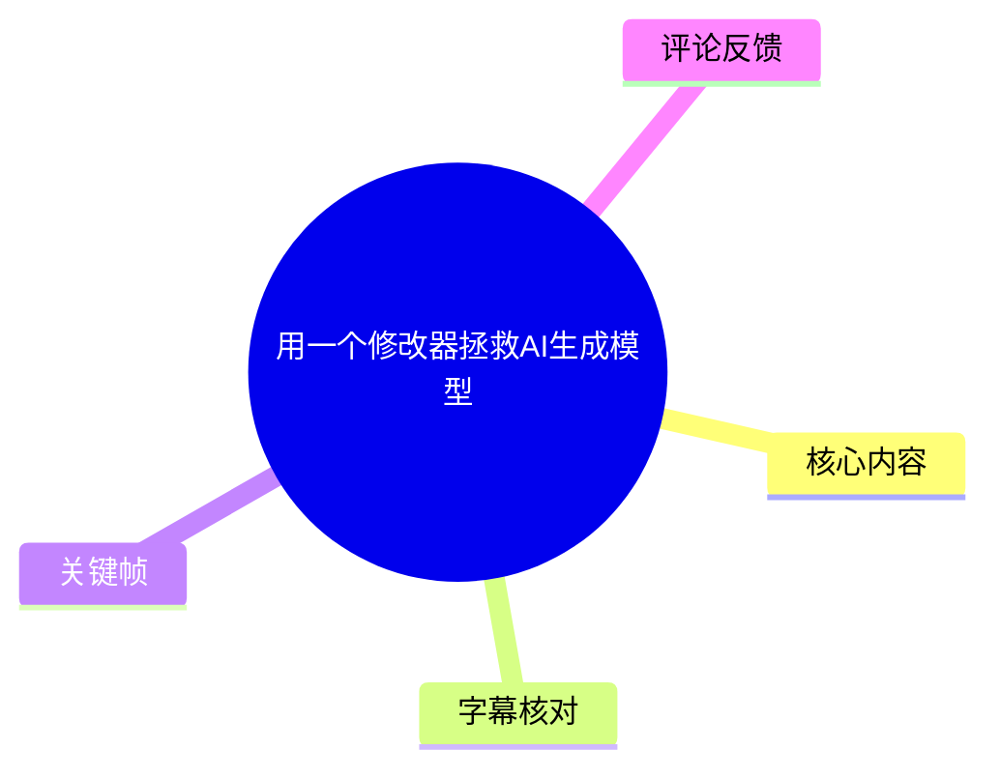
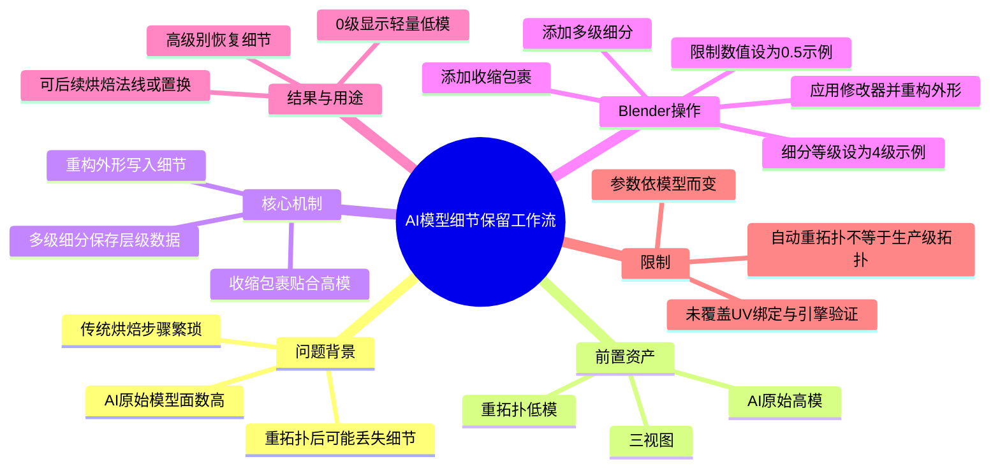
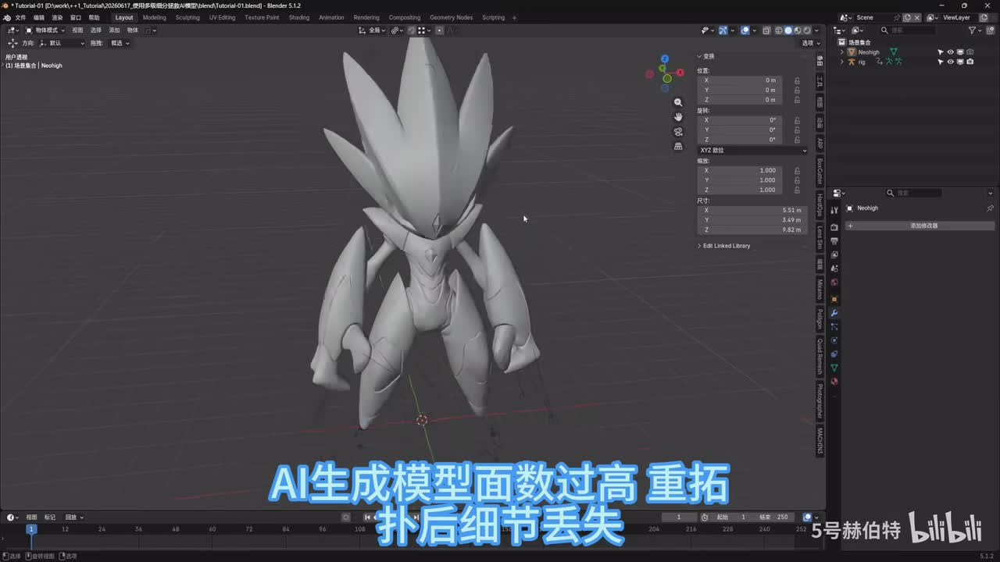
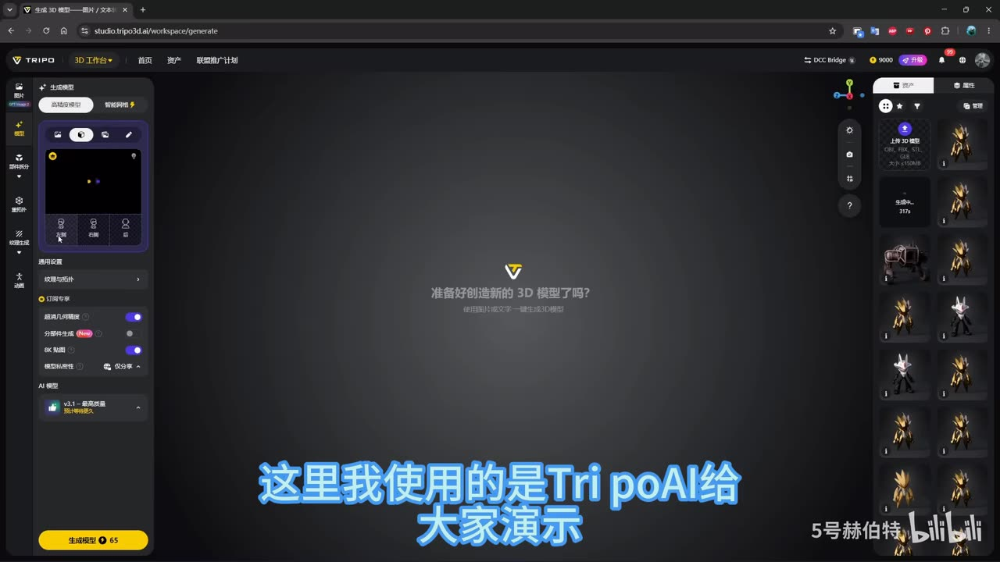
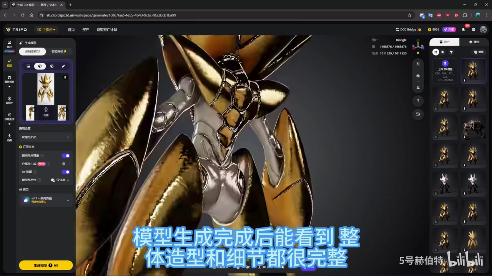
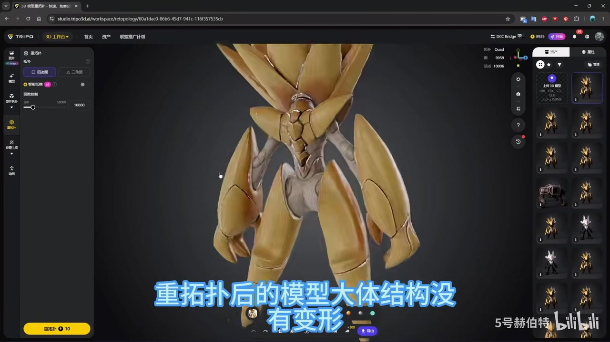

# 用一个修改器拯救AI生成模型

> 来源：[Bilibili 视频](https://www.bilibili.com/video/BV1qijw65EAt) 
> UP 主：5号赫伯特｜发布时间：2026-06-18｜视频时长：02:35 
> 标签：AI、3D、模型、AI 建模、经验分享、Blender、Blender 教程

## 小结

视频提出了一套面向 AI 生成 3D 模型的 Blender 工作流：先利用 Tripo AI 生成模型并进行重拓扑，再通过 Blender 的**多级细分（Multiresolution）修改器**与**收缩包裹（Shrinkwrap）修改器**，将高模的表面细节重构到低模的多级细分层级中。

该方法试图解决三个连续问题：AI 原始模型面数过高、自动重拓扑后细节可能流失，以及传统“高模到低模”细节转移通常需要法线/置换烘焙、流程较繁琐。视频的关键思路不是立即烘焙贴图，而是让高模细节以多级细分数据的形式保留在低模对象中。

实操中，作者为低模添加多级细分和收缩包裹修改器，将收缩包裹目标设为 AI 原始高模；示例角色因细节较多，将细分等级设为 **4 级**，并在发生错位或穿模时把视频所称的“限制数值”调整为 **0.5**。完成投射贴合后，通过复制、应用修改器、删除复制高模，以及在多级细分“形状”面板执行“重构外形”，将高模外观重建进多级细分数据。

完成后，将多级细分视图等级切回 **0**，即可显示为轻量低模；需要高精度外观时再提高细分等级。作者还称，后续可继续烘焙法线或置换贴图，并能自由调节细节强弱。这里“免烘焙”应理解为**细节存储与工作阶段不必先烘焙**，而不是完全排除后续为特定引擎或资产管线烘焙贴图的需求。

适用对象是已经具备 Blender 修改器、基础网格和高低模概念的 AI 建模使用者。视频展示的是单个角色案例，未验证复杂分件、UV、骨骼绑定、动画变形、非重叠拓扑、游戏引擎导出和极端细节下的结果；自动重拓扑质量也不能只依据演示画面直接等同于动画级生产拓扑。

## 思维导图

## 目录

- [背景：AI 模型的面数、重拓扑与烘焙难题](#背景ai-模型的面数重拓扑与烘焙难题)
- [Tripo AI 生成与重拓扑准备](#tripo-ai-生成与重拓扑准备)
- [方法原理：用多级细分保存高模细节](#方法原理用多级细分保存高模细节)
- [Blender 实操步骤](#blender-实操步骤)
- [结果、经验与限制](#结果经验与限制)
- [字幕比对](#字幕比对)
- [评论分析](#评论分析)
- [处理记录](#处理记录)

## 背景：AI 模型的面数、重拓扑与烘焙难题 [00:00](https://www.bilibili.com/video/BV1qijw65EAt?t=0)

视频开头概括了 AI 建模资产常见的处理困难：

1. **AI 生成模型面数过高**：高面数模型不利于实时预览、后续编辑和轻量化使用。
2. **重拓扑可能导致细节损失**：重拓扑可获得较规整的网格，但生成模型上的褶皱、装甲边缘或局部起伏等高频细节不一定能随低模保留。
3. **传统烘焙流程繁琐**：若要把高模细节转移给低模，常见做法是烘焙法线、置换等贴图；作者将其概括为步骤复杂。

作者给出的替代思路是：利用 Blender 的多级细分修改器，直接把 AI 高模细节写入低模对象的高细分层级。视频的表述是“一次性搞定所有问题”；这是作者对工作流便利性的判断，并非对所有资产类型均已验证的通用结论。

> 图：开头在 Blender 中展示角色模型，并直接标出“AI 生成模型面数过高、重拓扑后细节丢失”。该画面明确了后续技术流程要解决的对象与问题边界。

## Tripo AI 生成与重拓扑准备 [00:16](https://www.bilibili.com/video/BV1qijw65EAt?t=16)

### 导入三视图并生成模型 [00:16](https://www.bilibili.com/video/BV1qijw65EAt?t=16)

作者以 **Tripo AI** 为演示平台。在生成界面中，先导入预先制作的三视图，再交给 AI 生成 3D 模型。ASR 原文中的“Triple AI”“三式图”“生存模型”均与画面和语义不一致，结合界面品牌与上下文校正为“Tripo AI”“三视图”“生成模型”。

画面中可见 Tripo 的生成工作台、图片输入区域及右侧资产列表；这一步得到的是后续细节来源，即 AI 原始高模。

> 图：Tripo 工作台的图像生成界面，左侧为输入和生成设置区域，右侧为已有资产缩略图。它说明本教程的起点是基于三视图生成的 AI 资产，而非手工雕刻高模。

### 检查生成结果并进行重拓扑 [00:29](https://www.bilibili.com/video/BV1qijw65EAt?t=29)

模型生成后，作者认为整体造型和细节较完整。接着直接使用 Tripo AI 自带的重拓扑工具，选择合适面数并生成低模。视频没有给出这一环节的具体目标面数，只展示了工具界面中的面数设置，因此不能补充具体推荐值。

在生成后的模型画面中，角色具有金色装甲、头部尖刺和多处边缘细节；这些细节正是作者希望在低模上继续保留的信息。

> 图：生成完成的角色近景。高光、装甲分件边界及头部结构说明高模中包含大量表面细节，后续需要通过投射与多级细分进行转移。

### 导出高模与低模 [00:33](https://www.bilibili.com/video/BV1qijw65EAt?t=33)

作者表示，重拓扑后模型的大体结构没有变形，布线也较规整；确认无误后，将**高模与低模分别导出**，用于 Blender 中的后续操作。

需要注意，视频仅凭演示模型给出“布线规整”的判断，未展示线框细节、UV、边缘环线、关节区域或动画变形测试。因此，这里的“规整”适合视作该案例中的观察，而不能据此断言自动重拓扑输出已经适用于全部生产环节。

> 图：Tripo 的重拓扑界面显示了重拓扑后的角色与面数控制区域。该画面用于理解视频的资产准备阶段：保留原始高模，同时取得较低面数的网格作为后续载体。

## 方法原理：用多级细分保存高模细节 [00:48](https://www.bilibili.com/video/BV1qijw65EAt?t=48)

### 从“烘焙转移”转向“层级存储” [00:48](https://www.bilibili.com/video/BV1qijw65EAt?t=48)

作者先对比传统流程：平时若想将高模细节转移到低模，通常依赖烘焙。随后提出的问题是：能否同时保留干净的低模布线和高模全部细节？

视频给出的答案是使用 Blender 的**多级细分修改器**。作者指出，使用 Blender 进行高精度雕刻时，多级细分会同步保存原始低模数据。基于这一特性，本流程把 AI 高模的表面细节保存到多级细分的高细分层级。

可以将视频中的对象关系整理为：

| 对象/数据 | 在流程中的作用 |
| --- | --- |
| AI 原始高模 | 提供完整外观和表面细节，是收缩包裹投射目标。 |
| AI 重拓扑低模 | 提供相对简洁、规整的基础网格。 |
| 多级细分高层级 | 最终保存经重构写入的高精度细节。 |
| 多级细分 0 级 | 保留轻量基础网格，可用于更流畅地处理模型。 |
| 收缩包裹修改器 | 使细分后的低模外观贴近 AI 原始高模。 |

这里的“全部细节”是视频作者的目标性表述。实际保留效果仍取决于低模拓扑、细分层级、投射方向与距离、模型是否存在薄片/交叠、局部遮挡等条件。

## Blender 实操步骤 [01:17](https://www.bilibili.com/video/BV1qijw65EAt?t=77)

### 1. 向低模添加两个修改器 [01:17](https://www.bilibili.com/video/BV1qijw65EAt?t=77)

导入高模和低模后，先选中低模，并添加：

1. **多级细分修改器**；
2. **收缩包裹修改器**。

ASR 中的“多级系分”“缩果修感器”经上下文校正为“多级细分修改器”“收缩包裹修改器”。视频没有展示完整的修改器堆栈顺序说明，但后续描述明确是在低模上同时使用这两种修改器。

### 2. 根据复杂度设置细分等级 [01:21](https://www.bilibili.com/video/BV1qijw65EAt?t=81)

细分等级需要按照模型复杂度调整。作者给出的单个案例参数为：

| 参数 | 视频示例值 | 适用说明 |
| --- | ---: | --- |
| 多级细分等级 | 4 级 | 示例角色细节较多；不是所有模型的固定推荐值。 |

更高的细分级别意味着更多顶点和更高的计算/内存开销。视频没有提供面数增长、显存占用或性能阈值，因此实际使用应根据模型规模逐步测试，而不是机械固定为 4 级。

### 3. 配置收缩包裹投射 [01:27](https://www.bilibili.com/video/BV1qijw65EAt?t=87)

在收缩包裹修改器中，按视频操作：

1. 将**目标对象**选择为 AI 原始高模；
2. 将投射模式改为**投影**；
3. 勾选视频所示的附加选项。

最后一项的 ASR 仅识别为“勾选副项”，无法可靠确定 Blender 界面中的具体选项名称；现有素材没有给出足以确认该文字的清晰界面，因此不将其扩写为某个确定设置。

### 4. 用限制数值处理错位与穿模 [01:34](https://www.bilibili.com/video/BV1qijw65EAt?t=94)

若出现模型错位或穿模，作者建议提高“限制数值”，自己在示例中设置为 **0.5**，并称效果合适。

| 场景 | 视频处理方式 | 已知参数 |
| --- | --- | ---: |
| 低模与高模错位、发生穿模 | 调高收缩包裹相关的限制数值 | 0.5（作者案例） |
| 贴合正常 | 继续后续复制与重构操作 | 未提供统一数值 |

由于 ASR 未能稳定识别该字段的准确 UI 名称，且关键帧中未提供 Blender 参数面板特写，不能将“限制数值”确定写成“偏移量”“距离”或其他具体属性。可确定的是：它与收缩包裹的贴合结果有关，作者使用 0.5 解决了该案例的问题。

完成调整后，作者称低模外观会与高模完全重合。这应通过局部区域检查来验证，尤其应关注薄结构、凹槽、交叉部位、肩甲/手指等容易发生投射遮挡的位置。

### 5. 复制对象、应用修改器并保留新网格 [01:44](https://www.bilibili.com/video/BV1qijw65EAt?t=104)

视频接下来的操作顺序为：

1. 将高模和低模**各复制一份**；
2. 将复制出的对象移至场景空白处；
3. 选中复制出来的低模，**应用全部修改器**；
4. 删除复制出来的高模；
5. 保留一个顶点数据与高模外观匹配的新网格。

这一复制操作的目的，是在不直接破坏原始低模与高模关系的情况下，制作一个已应用修改器的匹配网格，供下一步“重构外形”使用。

### 6. 在多级细分中执行“重构外形” [01:57](https://www.bilibili.com/video/BV1qijw65EAt?t=117)

作者描述的最终重构步骤是：

1. 先选中“应用完修改器”的网格；
2. 再按住 `Ctrl` 选中原始低模；
3. 在原始低模的多级细分修改器中，打开“形状”面板；
4. 点击**重构外形**。

素材的 ASR 在此处出现对象称呼不一致：前一步明确说“复制出来的低模应用全部修改器”，而本句识别成“选中应用完修改器的高模网格”。基于流程关系，更稳妥的记录是“选中已应用修改器、外观匹配高模的复制网格”，而不武断断言该对象在 Blender 中被命名为高模或低模。

运算完成后，删除原始低模上的收缩包裹修改器。作者称此时高模的所有细节已经存入低模的多级细分数据中。

## 结果、经验与限制 [02:12](https://www.bilibili.com/video/BV1qijw65EAt?t=132)

### 轻量查看与后续输出 [02:12](https://www.bilibili.com/video/BV1qijw65EAt?t=132)

作者认为，完成整套流程后：

- 将多级细分的**视图细分等级切换到 0**，模型就是轻量化低模；
- 后续进行操作时不会因高细分外观持续显示而卡顿；
- 高模细节保存在多级细分中，可按需要提高或降低细节强度；
- 后续仍可直接烘焙法线贴图、置换贴图。

其中“都不会卡顿”是视频中的经验性表述。实际性能仍受原始低模面数、细分层级、硬件配置、场景复杂度及是否同时启用其他修改器影响。

### 可迁移经验

1. **保留两套资产是流程前提**：AI 原始高模用于提供细节，重拓扑低模用于提供轻量基础网格。
2. **先贴合，再重构**：收缩包裹使低模细分后的轮廓接近高模；“重构外形”才是将这种外观关系写入多级细分数据的关键操作。
3. **参数不能脱离模型照搬**：细分等级 4、限制数值 0.5 都只是作者角色案例中的设置。
4. **多级细分与烘焙可串联**：本流程减少了“立即烘焙才能带走细节”的依赖，但如目标平台需要贴图资产，仍可在后续阶段烘焙法线或置换。

### 适用范围与未验证限制

- 视频未展示 UV 展开、材质迁移、贴图保留、顶点色、骨骼权重或动画测试；这些环节不能默认会随本流程自动正确处理。
- 自动重拓扑的“布线规整”不等同于手工动画拓扑。若模型需要关节弯曲、面部表情或严格的边线控制，仍应单独检查拓扑。
- 收缩包裹投影可能在相邻表面距离很近、部件互相遮挡、模型自交或有薄片时产生错误贴合；视频只给出了调整限制数值的方向，没有覆盖其他排错策略。
- 多级细分高等级会增加数据量。轻量化的优势来自将显示等级切回 0，而不是高层级数据完全不存在。
- 本视频发布于 **2026-06-18**。Tripo AI 的界面、模型版本、额度/计费、重拓扑能力及 Blender 版本中的菜单位置均可能在之后更新；应以使用时的实际软件界面为准。

## 字幕比对

| 字幕来源 | 完整性 | 专有名词 | 时间轴 | 主要问题 |
| --- | --- | --- | --- | --- |
| Bilibili 站内字幕 | 未提供可用字幕 | 无法核验 | 无法核验 | 素材采集阶段站内字幕工具返回 `Invalid URL`，没有可用站内 SRT。 |
| 本次 ASR 字幕 | 较完整，22 段，覆盖约 133.42 秒语音/154.44 秒视频 | 存在多处同音或近音误识别 | 有真实分段时间戳，可直接定位 | “Tripo AI”“三视图”“重拓扑”“多级细分”“收缩包裹”等术语识别不稳定；个别对象称呼前后不一致。 |

最终采用**本次 ASR 的时间轴**作为章节定位依据，并依据关键帧、界面品牌、视频标题、简介与 3D 软件上下文对术语进行有限校正。源文件存在可用音频：ASR 诊断显示识别语言为中文、音频时长约 154.44 秒，且**未标记 `noAudioStream=true`**，因此不存在“源视频无音轨”的情况。

重要校正与保留项：

| ASR 识别文本 | 本文采用表述 | 校正依据/处理方式 |
| --- | --- | --- |
| Triple AI | Tripo AI | 关键帧中的平台品牌为 TRIPO，视频简介 @TripoAI。 |
| 三式图 | 三视图 | AI 建模工作流语义及画面输入形式。 |
| 生存模型 | 生成模型 | 上下文语义。 |
| 重塗鋪、重塞鋤 | 重拓扑 | 视频标题、简介和重拓扑工具画面。 |
| 多级系分 | 多级细分 | Blender 常用修改器名称与后续“形状/重构外形”操作语义。 |
| 缩果修感器 | 收缩包裹修改器 | 与设置目标高模、投影贴合的功能语义一致。 |
| 勾选副项 | 未强行命名 | 未取得清晰的 UI 字段证据，仅保留“勾选视频所示附加选项”。 |
| 应用完修改器的高模网格 | 已应用修改器的匹配网格 | 与前一步“复制低模并应用全部修改器”的叙述存在冲突，避免超出素材的推断。 |

## 评论分析

以下仅分析当前可获取的热评前三条；评论内容属于用户观点，不作为已验证事实。

1. **鹿树人（4 赞）：“嗷嗷，还能这样啊”**  
   - 观点：对“以多级细分保存细节”的方案表示新奇和认可。  
   - 补充信息：没有提供技术细节或反例。  
   - 参考价值：反映该工作流对部分观众具有启发性，但不构成效果验证。

2. **leosama（18 赞）：“tripo 的重拓扑就是 C4D 的网格重构，根本就不是拓扑……看混元的拓扑才是拓扑，布线好看还不要钱”**  
   - 观点：质疑 Tripo 所谓“重拓扑”的质量，认为其更接近减面或平均布线，而非适合生产的拓扑；同时推荐“混元”的拓扑能力。  
   - 与视频的关系：该评论直接触及本教程的重要前提——低模拓扑质量。若低模仅是自动减面，即使细节重构成功，也未必满足动画、变形或严格布线需求。  
   - 可信度边界：评论未提供模型文件、线框对比、测试标准或版本信息，且对其他工具的评价也未在视频素材中验证，因此应作为待测试的经验性提醒，而非结论。

3. **QuadPixels（5 赞）：“这个法线细节好奇怪啊”**  
   - 观点：对展示模型的法线/表面细节视觉效果提出疑问。  
   - 与视频的关系：说明观众可能观察到表面高光、法线或细节投射异常；这与收缩包裹贴合、重构外形、后续贴图烘焙等环节都可能有关。  
   - 可信度边界：评论没有指出具体部位、截图或参数，无法判断问题来自 AI 原始模型、显示材质、法线、重拓扑还是多级细分重构。视频本身也未展示法线检查与贴图对比，故不能据此确认流程存在必然缺陷。

## 处理记录

- Worker ID：`worker-mrj0www4-e8d79408`
- 模型：`gpt-5.6-terra`
- 调用工具与素材：视频元数据、关键帧提取结果（`frames/`）、音频文件（`audio/audio.wav`）、本次 ASR 结果（`asr/asr-result.json`、`asr/transcript.srt`）、评论数据（`comments/comments.json`）。
- 字幕选择：站内字幕未提供可用内容；已检查本次 ASR，采用其 22 个带时间戳分段定位章节，并对可由画面与上下文确认的术语进行校正。
- 时间轴依据：所有章节时间均取自 ASR SRT 的实际起始时间并换算为秒数，例如 01:17 对应 `t=77`，未按文字顺序猜测。
- 关键帧选择依据：  
  - `frame-001.jpg`：呈现视频提出的核心问题；  
  - `frame-002.jpg`：确认演示平台为 Tripo AI；  
  - `frame-003.jpg`：展示 AI 原始高细节模型；  
  - `frame-004.jpg`：展示重拓扑阶段与面数控制。  
  其余关键帧未附带可核验画面信息，未强行引用。
- 站内字幕获取情况：素材清单记录字幕工具警告 `Invalid URL`，故无可比对的 Bilibili 站内 SRT。
- 缓存清理：提供的素材中没有缓存清理执行日志，无法确认是否已清理；本文不将其描述为已完成。
- 未解决问题：收缩包裹中“勾选副项”及“限制数值”的准确 Blender 字段名未被 ASR 与现有关键帧可靠识别；“应用修改器的网格”在 ASR 中高低模称谓存在矛盾，已按流程关系保守表述。
