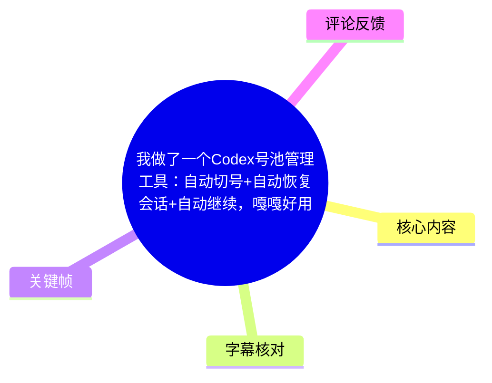
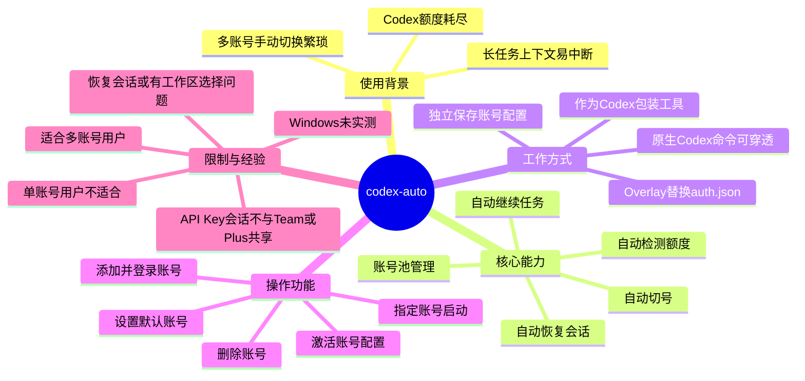
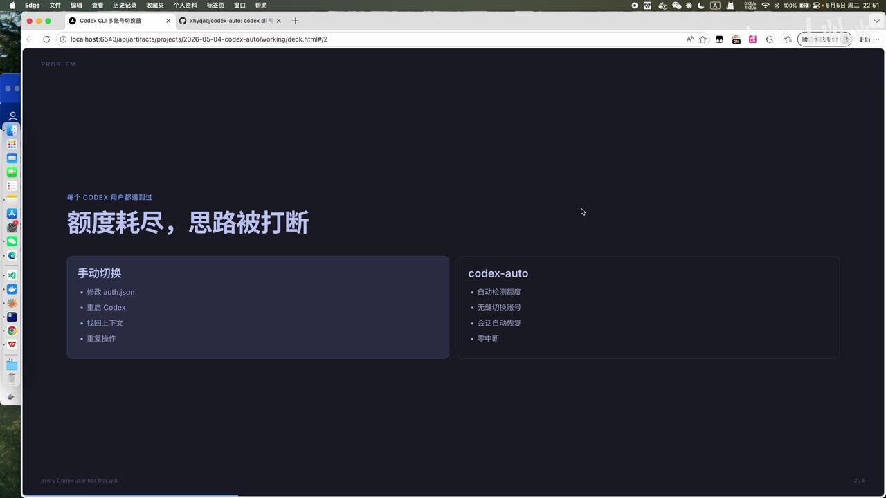
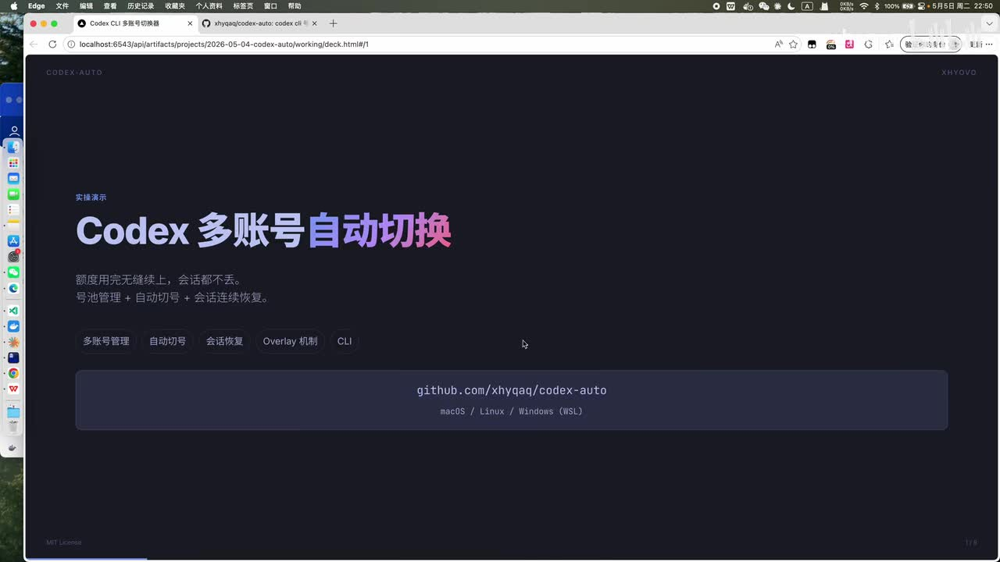
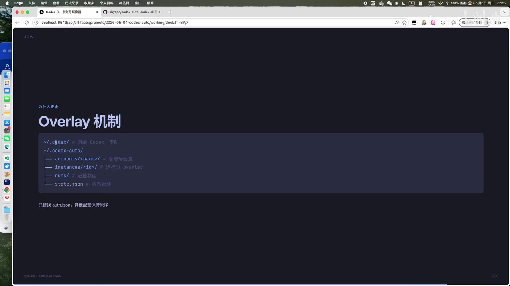

# 我做了一个 Codex 号池管理工具：自动切号 + 自动恢复会话 + 自动继续

> 来源：[Bilibili 视频](https://www.bilibili.com/video/BV1DFRnBLE6r)<br>
> UP 主：xhyovo｜视频时长：09:35｜合集：AIcode  
> 项目地址：<https://github.com/xhyqaq/codex-auto>（由视频简介及片中页面提供）

## 小结

视频介绍了 UP 主制作的 **codex-auto**：一个面向 Codex CLI 多账号使用场景的账号池管理包装工具。它的目标不是替代原生 Codex，而是在额度耗尽时，自动检测状态、切换到可用账号，并尝试恢复原会话后继续任务，减少手动改配置、重启终端和找回上下文的中断。

与视频中作为参照的 CC Switch 相比，UP 主认为 codex-auto 不止管理账号，还覆盖了三项核心能力：**额度/账号池管理、自动切号、会话自动恢复**。这特别针对 Team 或 Plus 账号存在限额、且用户拥有多个账号并在执行长任务的情形。

工具通过独立的 `codex-auto` 配置目录保存账号信息，强调不直接覆盖原有 Codex 的整体配置；其运行机制只围绕 `auth.json` 做替换或 Overlay（覆盖层）处理。视频画面给出的目录结构还显示了按账号存放的配置、运行时实例、进程状态和状态文件。

操作层面，UP 主展示了通过在 Codex 命令后添加 `--auto` 使用包装功能、用 `--help` 查看帮助、手动添加账号并命名，以及选择指定账号启动、设为默认、删除账号和激活账号等功能。部分命令名称在 ASR 中识别不可靠，本文保留视频能确认的功能，不擅自补全命令行参数。

需要注意：UP 主明确称 Windows 尚未由其本人测试；工具支持 Team 和 Plus，但恢复会话时可能极小概率出现工作区选择异常。另据其使用经验，**API Key 会话与 Team/Plus 会话不共享**，而 Team 与 Plus 的会话在其演示环境中共享；这是视频中的个人观察，未给出原理或官方依据。

## 思维导图





## 目录

- [背景：额度耗尽为何会中断工作](#背景额度耗尽为何会中断工作)
- [工具定位与 CC Switch 的区别](#工具定位与-cc-switch-的区别)
- [安装、平台与适用对象](#安装平台与适用对象)
- [配置隔离与 Overlay 工作机制](#配置隔离与-overlay-工作机制)
- [命令与账号池操作流程](#命令与账号池操作流程)
- [自动切号、恢复时间与命令穿透](#自动切号恢复时间与命令穿透)
- [限制、已知问题与会话共享经验](#限制已知问题与会话共享经验)
- [字幕比对](#字幕比对)
- [评论分析](#评论分析)
- [处理记录](#处理记录)

## 背景：额度耗尽为何会中断工作 [01:19](https://www.bilibili.com/video/BV1DFRnBLE6r?t=79)

UP 主描述的典型问题是：在 Codex CLI 中执行较长任务时，一个账号的可用额度耗尽，使用者必须中断当前工作流，手动切换到另一个账号。按其描述，这一过程通常包含修改认证配置、重新启动 Codex，以及重新接续此前会话与上下文。

视频将该问题与订阅类账号的用量限制联系起来：对于登录 Team 或 Plus 的 Codex 使用方式，UP 主称存在 **5 小时限额**与**周限额**。视频没有说明具体数值、计算规则、地区差异或官方政策版本，因此不能据此推导某账号的实际可用额度。



> 图：画面以“额度耗尽，思路被打断”为题，对比手动切换所需的“修改 auth.json、重启 Codex、找回上下文、重复操作”和 codex-auto 的自动检测、无缝切号、会话恢复能力。这是理解工具设计动机的关键帧。

该工具的价值建立在两个前提上：

1. 使用者确实拥有并已登录多个 Codex 账号；
2. 使用场景是长时间或连续性要求高的任务，切号后的会话恢复具有实际价值。

UP 主也直接指出：若只有一个账号，工具并不适合，因为没有可用于轮换的账号池。

## 工具定位与 CC Switch 的区别 [00:29](https://www.bilibili.com/video/BV1DFRnBLE6r?t=29)

视频中的项目名称为 **codex-auto**（ASR 多处误识别为 “Codes Auto”“Code S Auto”，结合标题、简介、网页和 GitHub 地址校正）。UP 主将其定义为 Codex CLI 的包装工具：原生 Codex 仍是底层工具，codex-auto 在外层增加账号池和会话连续性能力。

UP 主以 CC Switch 为对比对象，给出的区别如下：

| 维度 | 视频对 CC Switch 的描述 | 视频对 codex-auto 的描述 |
| --- | --- | --- |
| 主要定位 | 账号管理 | 账号池管理及自动化衔接 |
| 额度耗尽后 | 用户需要手动点击启用账号 | 尝试自动检测额度并切号 |
| 会话处理 | 视频未断言其是否支持恢复 | 自动恢复会话、继续后续工作 |
| 与 Codex 的关系 | 视频中作为辅助管理工具出现 | 原生 Codex 的包装层 |

这属于 UP 主对两种工具能力的介绍，而非对 CC Switch 的独立测评。视频未展示统一条件下的性能、稳定性或功能完整性比较，不能将其理解为已验证的优劣结论。



> 图：页面明确写有“Codex 多账号自动切换”“额度用完无缝续上，会话都不丢”，并列出“多账号管理、自动切号、会话恢复、Overlay 机制、CLI”。它直接呈现了项目对外宣称的功能边界。

## 安装、平台与适用对象 [01:43](https://www.bilibili.com/video/BV1DFRnBLE6r?t=103)

### 安装信息

UP 主称安装“只需要一行命令”，并演示从项目页面复制安装命令后在终端执行。由于提供的 ASR 在命令内容处只识别到不可靠的“mini”，而关键帧中也未包含完整安装命令，本文不臆造具体包管理器、命令文本或版本号。

可确认的获取入口为：

- GitHub：<https://github.com/xhyqaq/codex-auto>
- 视频简介还提供社区地址：`code.xhyovo.cn`

建议以仓库 README 中的当前安装说明为准，而不是直接依据本视频转写执行命令。

### 平台状态

片中页面标注：

- macOS
- Linux
- Windows（WSL）

但 UP 主同时明确说明：**Windows 由其本人尚未测试**；其在 macOS 上的使用没有遇到问题。这里应区分“页面宣称支持的平台”与“作者实际验证的平台”，后者仅能确认 macOS。

### 适用范围

适合：

- 拥有多个 Codex Team 或 Plus 账号；
- 会执行长任务；
- 希望在额度耗尽时减少人工干预；
- 对会话连续性有需求的 Codex CLI 使用者。

不适合或价值较低：

- 仅有一个 Codex 账号的用户；
- 不需要长任务、也不在意手动切换的用户；
- 不能接受第三方工具管理本地认证配置的用户。

## 配置隔离与 Overlay 工作机制 [02:23](https://www.bilibili.com/video/BV1DFRnBLE6r?t=143)

UP 主强调，codex-auto 不会整体覆盖原有 Codex 配置，而是将自己的账号配置保存在独立目录中。视频画面给出的结构可整理为：

```text
~/.codex/                 # 原始 Codex，不动
~/.codex-auto/
├── accounts/<name>/      # 各账号配置
├── instances/<id>/       # 运行时 Overlay
├── runs/                 # 进程状态
└── state.json            # 状态管理
```

> 上述目录名来自片中“Overlay 机制”画面；视频未展开每个文件的完整字段、权限要求或生命周期。



> 图：该画面展示 `~/.codex/` 与 `~/.codex-auto/` 的并行关系，以及 `accounts`、`instances`、`runs`、`state.json` 的分工；底部写明“只替换 auth.json，其他配置保持原样”。这是判断配置影响范围的重要证据。

按视频说明，核心原则是：

1. 原始 Codex 目录不作为账号池的存储位置；
2. 每个账号有独立配置；
3. 启动时只处理 `auth.json`；
4. 其他 Codex 配置尽量保持不变；
5. 若需脱离包装层使用原生 Codex，也可将选中账号的认证配置写回原生 Codex 的 `auth.json`。

这里的“只替换 `auth.json`”是视频中的设计说明，并不等同于对文件原子性、并发安全、故障回滚或凭证加密的完整保证。实际使用前应自行备份现有认证文件，并审查仓库源码对凭证文件的处理方式。

## 命令与账号池操作流程 [03:33](https://www.bilibili.com/video/BV1DFRnBLE6r?t=213)

### 1. 以自动模式启动

UP 主演示：在 Codex 命令后添加 `--auto` 以启用 codex-auto 的包装能力；也可以使用 `--help` 查看支持的命令。视频没有提供一份完整、可逐字核验的帮助输出，因此只能确认以下调用形态：

```bash
codex --auto
codex --help
```

> 第二行是否须与 `--auto` 组合、以及不同版本的准确参数格式，应以项目实际帮助信息为准。

### 2. 添加账号并完成登录 [03:33](https://www.bilibili.com/video/BV1DFRnBLE6r?t=213)

视频中，UP 主展示自己已手动添加 6 个账号。添加时需要：

1. 执行添加账号的功能；
2. 为账号指定名称，例如视频中的 `Team-6`；
3. 根据终端提示完成登录；
4. 工具保存该会话/认证信息，并将其作为账号池中的一个账号。

视频能确认存在“Add”操作和账号命名，但 ASR 没有可靠给出对应 CLI 子命令，故不将其写成可执行命令。

### 3. 指定账号启动会话 [03:57](https://www.bilibili.com/video/BV1DFRnBLE6r?t=237)

UP 主提到可通过 `Name` 选择本次会话使用的账号。这里的 `Name` 是账号名称，不是账号邮箱或订阅类型。该机制适合在自动选择之外，明确指定某个账号发起一次会话。

### 4. 激活账号并兼容原生 Codex [04:18](https://www.bilibili.com/video/BV1DFRnBLE6r?t=258)

视频解释了 `Active` 的用途：激活一个账号，并将该账号对应的认证配置写入原生 Codex 的配置中。其目的在于，当包装工具本身出现问题时，用户仍可以转回原生 Codex 命令继续使用。

按 UP 主说法，这等价于把 codex-auto 某账号目录下的 `auth.json` 写入 Codex 原始位置的 `auth.json`。这一操作会改变原生 Codex 当前使用的认证身份，因此执行前应确认目标账号，避免覆盖后忘记当前认证状态。

### 5. 默认账号与删除账号 [05:05](https://www.bilibili.com/video/BV1DFRnBLE6r?t=305)

视频还展示：

- **设置默认账号**：列表中以符号标记默认账号，之后会优先使用它；
- **删除账号**：移除不再需要的账号配置；
- **列出账号状态**：可查看账号池中账号和可用情况。

由于 ASR 对“删除”相关词语存在明显误识别，无法可靠复原其命令名；这里只记录功能层级。

## 自动切号、恢复时间与命令穿透 [05:29](https://www.bilibili.com/video/BV1DFRnBLE6r?t=329)

UP 主尝试演示自动切换：当当前账号被检测为没有额度时，工具将尝试切换到下一个账号；如果下一个账号也无额度，则继续轮换，直到没有可用配置。由于录制时其账号几乎都已无额度，未能完成一个“有可用账号、成功续跑”的完整实时演示。

从演示说明可整理出预期流程：

```text
任务运行
  ↓
检测到当前账号额度耗尽
  ↓
从账号池选择下一可用账号
  ↓
切换认证状态
  ↓
恢复原会话
  ↓
继续执行任务
```

工具还会在账号列表后标注该账号的**下一次额度恢复时间**。视频未说明恢复时间的数据来源、计算逻辑、时区处理方式或准确率，因此应把它视为工具展示的状态提示，而非官方配额保证。

### 命令穿透 [05:53](https://www.bilibili.com/video/BV1DFRnBLE6r?t=353)

UP 主称，Codex 原本支持的命令可以“穿透” codex-auto 使用，即包装层不会阻断原生 Codex 子命令；其以 `account` 功能作为示例。这意味着工具希望兼容既有 Codex CLI 使用方式，而不要求用户改写全部工作流。

不过视频只展示了有限命令，未展示复杂参数、交互式子命令、并发多终端、失败重试或版本升级后的兼容性测试。对于生产任务，应先在非关键项目中验证自动模式与自身常用命令的组合。

## 限制、已知问题与会话共享经验 [06:22](https://www.bilibili.com/video/BV1DFRnBLE6r?t=382)

### 支持范围与已知问题

UP 主称工具支持：

- Codex Team；
- Codex Plus。

其也坦言工具可能存在小 Bug。已明确提及的一项异常是：在**恢复会话**时，极小概率会要求用户选择不同的会话/工作区空间。遇到该问题时，UP 主给出的处理思路是：选定 Team 账号后，使用“重写配置到 Codex”的能力，再通过原生 Codex 启动。

该恢复路径的具体命令同样未被 ASR 清晰记录，且视频没有展示完整故障复现和修复过程。因此，它可作为排障方向，不能视为经过充分验证的标准操作手册。

### Team、Plus 与 API Key 的会话关系 [07:10](https://www.bilibili.com/video/BV1DFRnBLE6r?t=430)

UP 主分享的实测经验为：

| 使用方式 | 视频中的会话关系说明 |
| --- | --- |
| API Key | 仅能看到 API Key 体系下的会话 |
| Team / Plus | 在其演示中，两者会话共享 |
| API Key 与 Team / Plus | 两边会话不共享、列表不一致 |

演示中，UP 主切换到“中转商/API Key”形式后，发现此前会话不存在，由此说明不同认证形式下会话列表不同。他明确表示没有研究原理。因此，这一结论只适用于视频所示客户端、账号和时间点，不应外推为 Codex 官方永久规则。

### 与 CC Switch 同时使用可能冲突 [08:42](https://www.bilibili.com/video/BV1DFRnBLE6r?t=522)

UP 主发现账号列表中原本显示的“下次额度恢复时间”后来消失，猜测可能和在 CC Switch 中来回切号有关，但随后也表示自己并不确定，并认为这更可能是自身工具的 Bug。其最终判断是：该问题不影响“额度管理、自动切号、会话恢复”三项核心功能。

这部分是未定位的现象，不应据此断言 codex-auto 与 CC Switch 存在确定兼容性冲突。实际使用中，若同时使用多个会修改 Codex 认证状态的工具，应避免并发操作，并保留原始 `auth.json` 备份。

## 结论与时效性 [09:11](https://www.bilibili.com/video/BV1DFRnBLE6r?t=551)

codex-auto 的核心思路是将多账号认证状态从原生 Codex 配置中抽离出来，形成账号池，并通过包装层在额度耗尽时完成账号切换和会话恢复。对有多个合法账号、且高频进行长任务的 Codex CLI 用户，这种设计能减少手工切换造成的上下文中断。

使用时应把握以下边界：

- 该工具依赖多个可用账号，单账号场景不适用；
- 视频确认作者在 macOS 上使用正常，但 Windows 尚未被作者实测；
- 真实自动切换成功的完整过程没有在本片中演示完成；
- 会话恢复存在小概率工作区选择异常；
- API Key 与 Team/Plus 的会话隔离是 UP 主经验，机制未证实；
- 配额规则、Codex CLI 行为、认证文件结构和项目命令都可能在视频发布后变更。

因此，视频适合作为理解项目目标与使用路径的入门材料；执行安装、认证配置或自动化任务前，应以 GitHub 仓库当前 README、版本发布说明和自身环境测试结果为准。

## 字幕比对

| 字幕来源 | 完整性 | 专有名词 | 时间轴 | 主要问题 |
| --- | --- | --- | --- | --- |
| Bilibili 站内字幕 | 未提供可用字幕 | 无法评估 | 无法使用 | 素材明确标注“未提供可用站内字幕” |
| 本次 ASR 字幕 | 较完整，覆盖约 509.98 秒语音，首段 00:29.020、末段 09:34.600 | 多处误识别 | 可用，提供 SRT 毫秒级分段 | `codex-auto`、Codex、CC Switch、Team、Plus、API Key、会话等词语混淆较多；个别命令名无法可靠还原 |

本次 ASR 使用 `medium` 模型、中文识别，语言置信度为 `0.9990`，音轨存在；诊断中**没有** `noAudioStream=true` 标记，因此不存在“源视频无音轨”的情况。ASR 共 32 段，语音覆盖率约 `0.887`，没有大间隔警告，时间轴可作为章节定位依据。

最终采用策略为：以本次 ASR 的 SRT 时间为准建立链接；以视频标题、简介、关键帧和上下文校正以下关键术语：

| ASR 常见误识别 | 采用表述 | 校正依据 |
| --- | --- | --- |
| CodesAuto / Code S Auto | codex-auto | 视频标题、简介 GitHub 地址、片中网页 |
| CTSwitch | CC Switch | 片中应用窗口与页面文字 |
| mini | 未据此确定具体安装工具或命令 | ASR 不可靠，素材未给出可核验完整命令 |
| 耗瓷管理 / 耗时管理 | 额度管理或账号池管理 | 片中“额度耗尽”、功能列表及上下文 |
| 绘画恢复 | 会话恢复 | 视频标题、页面和上下文 |
| API-K | API Key | 上下文及常见术语 |

## 评论分析

以下仅处理本次素材可获取的热评前三条；评论内容属于用户观点或建议，不作为已验证事实。

1. **瓶盖PING（8 赞）**  
   评论推荐另一个工具 “Cockpit tools”，称其在 Codex 上“比 cc switch 强很多”，支持 GUI 配置、账号加入/移出号池、额度用完自动换号，并提供类似 Sub2API 的 API 服务；同时不确定它是否支持“继续会话”。  
   - 补充价值：提出了可比较的替代方案，并将“会话继续/恢复”指出为一个关键差异点。  
   - 可信度边界：这是评论者主观评价，视频未测试 Cockpit tools，也没有提供版本、平台或复现实验，不能据此确认其功能或优劣。

2. **Yeb1234（5 赞）**  
   评论“codex跑冒烟了要”，表达对高强度使用 Codex 的调侃。  
   - 补充价值：反映观众将该工具理解为高频、多账号、高额度消耗场景的辅助工具。  
   - 可信度边界：没有提供功能、配置或性能方面的可验证信息。

3. **Scorpion丶泽（4 赞）**  
   评论希望增加“批量注册号池”功能，认为这样可进一步打通流程。  
   - 补充价值：指出账号池工具在账号创建/接入环节仍可能存在人工操作。  
   - 风险与边界：视频没有宣称支持批量注册；该建议涉及账号注册和服务条款等外部限制，不能将其视为项目路线或推荐操作。

## 处理记录

- Worker ID：`worker-mrj0wjed-b0c290ad`
- 模型：`gpt-5.6-terra`
- 调用工具与素材：视频元数据读取、音频提取、关键帧提取、本次 ASR、SRT 时间轴解析、热评抓取。
- ASR 工具与参数：`medium` 模型；语言自动检测结果为 `zh`；CUDA / `float16`；音频时长 `574.9333125` 秒。
- 字幕选择：站内字幕未提供可用版本；已检查本次 ASR，采用其 SRT 的真实起止时间建立时间轴，并对专有名词结合标题、简介、关键帧进行校正。
- 关键帧选择依据：
  - `frames/frame-002.jpg`：项目首页和核心功能标签，说明项目定位；
  - `frames/frame-003.jpg`：手动切换与自动化能力的对比，说明痛点；
  - `frames/frame-004.jpg`：Overlay 目录结构与“只替换 auth.json”说明，支撑技术机制描述。
- 缓存清理：素材中未提供缓存清理执行回执；无法确认是否已清理，故不作已清理声明。
- 未解决问题：
  - 未提供完整、清晰的安装命令与全部 CLI 帮助输出，本文未编造命令；
  - 自动切号至可用账号并成功恢复会话的完整过程未在视频内实际完成；
  - 恢复时间消失现象、与 CC Switch 的关系及会话隔离原理均未被定位；
  - Windows 兼容性仅有页面标注，作者本人未实测。
