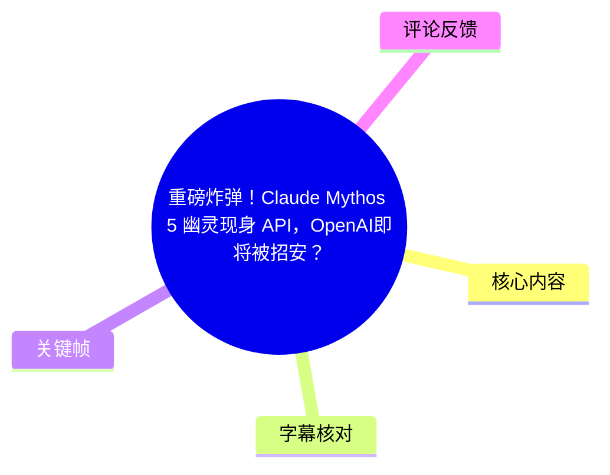
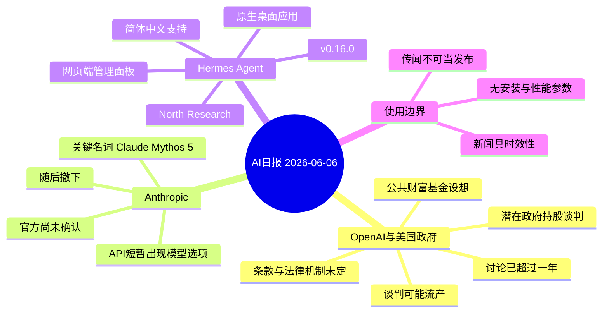
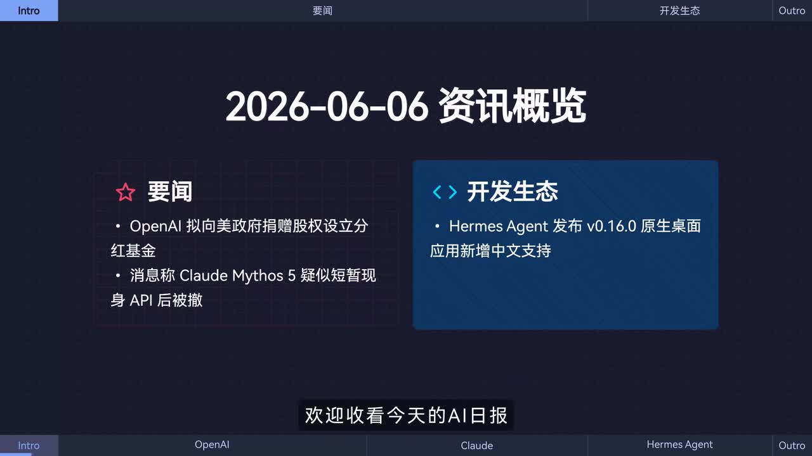
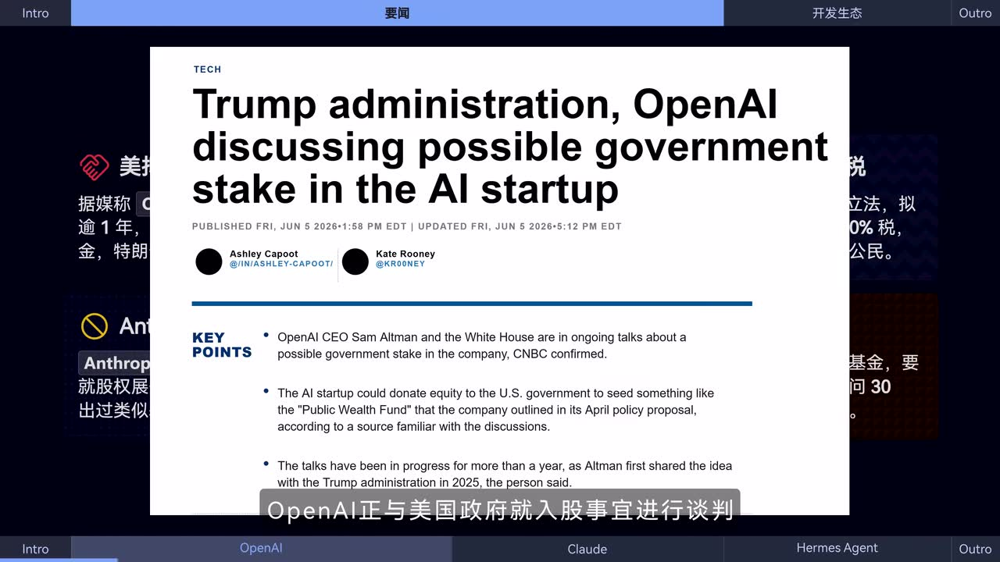
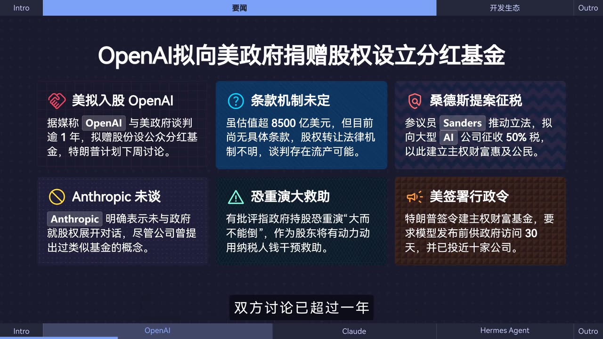
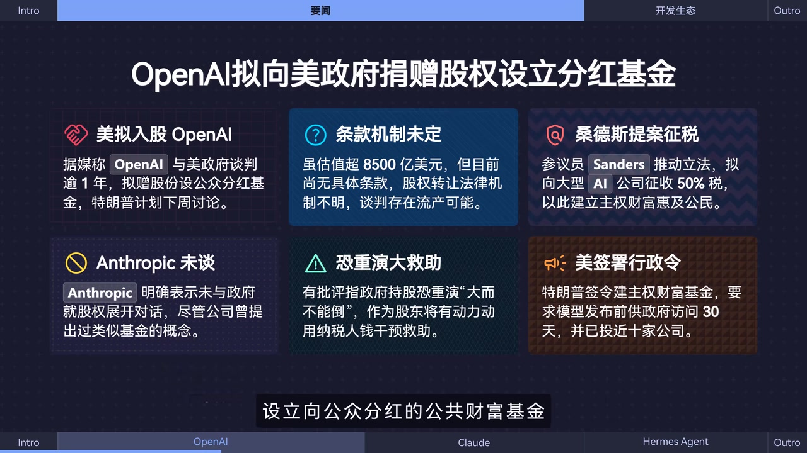

# 重磅炸弹！Claude Mythos 5 幽灵现身 API，OpenAI即将被招安？特朗普与奥特曼惊天密谋泄露！| AI日报0606

> 来源：[Bilibili 视频](https://www.bilibili.com/video/BV1JBEn6kEfD) 
> UP 主：黑鸦Heya｜合集：AIcode｜时长：53 秒｜画面规格：3840×2160 
> 信息日期：视频画面标注为 **2026-06-06**；以下内容仅整理视频及所给素材，不将传闻写作既成事实。

## 小结

这是一则 53 秒的 AI 日报，依次播报三项信息：OpenAI 与美国政府就潜在政府持股进行的谈判、Anthropic API 中疑似短暂出现的 **Claude Mythos 5** 模型选项，以及 Hermes Agent v0.16.0 的发布与功能更新。

最具公共政策含义的信息是 OpenAI 相关谈判。视频称，双方已讨论超过一年，设想包括由 OpenAI 向美国政府转让或捐赠部分股权，并设立向公众分红的公共财富基金；但具体条款、股权转让的法律机制均未明确，谈判仍可能流产。画面同时援引 CNBC 标题与要点，进一步将其表述为“可能的政府持股”讨论。

关于 Claude Mythos 5，视频的确定事实仅限于：有 X 平台用户声称 Anthropic API 曾短暂显示该模型选项，随后被迅速撤下。它引发“即将发布”的猜测，但视频明确说明 **官方尚未确认**；因此不能据此推断其能力、价格、发布日期或产品已正式上线。

对开发者最可直接使用的是 Hermes Agent 更新信息：视频称 North Research 发布 Hermes Agent **v0.16.0**，新增原生桌面应用、简体中文支持及完整网页端管理面板。视频未给出安装方式、系统要求、下载链接、接口参数或迁移步骤，实际使用仍须以项目后续正式文档为准。

## 思维导图

## 目录

- [内容范围与信息时效](#内容范围与信息时效)
- [OpenAI 与美国政府的潜在持股谈判](#openai-与美国政府的潜在持股谈判)
- [Claude Mythos 5 疑似现身 Anthropic API](#claude-mythos-5-疑似现身-anthropic-api)
- [Hermes Agent v0.16.0 更新](#hermes-agent-v0160-更新)
- [实践指引：如何使用这则日报信息](#实践指引如何使用这则日报信息)
- [结论与限制](#结论与限制)
- [字幕比对](#字幕比对)
- [评论分析](#评论分析)
- [处理记录](#处理记录)

## [内容范围与信息时效](https://www.bilibili.com/video/BV1JBEn6kEfD?t=0)

视频以“2026-06-06 资讯概览”开场，将内容分为“要闻”与“开发生态”两类。开场画面列出的重点是：

1. OpenAI 拟向美国政府捐赠股权、设立分红基金；
2. Claude Mythos 5 疑似短暂出现在 API 后被撤下；
3. Hermes Agent 发布 v0.16.0 原生桌面应用并新增中文支持。

> 图：该关键帧直接给出当日资讯总览及栏目结构，可用于确认本期并非单一产品教程，而是三则高时效新闻/更新的汇总；其中“Claude Mythos 5”的中文名称也为后续字幕校正提供画面依据。

视频的核心性质是新闻转述而非官方公告合集。尤其是涉及政府入股与未发布模型的内容，必须区分：

- **视频转述的报道称/消息称**：谈判或 API 短暂出现事件；
- **视频明确保留的不确定性**：条款未定、机制不明、谈判可失败、Anthropic 未官方确认；
- **视频没有提供的内容**：官方合同、监管文件、API 截图原始链接、模型能力评测、版本发布日期、价格及调用参数。

## [OpenAI 与美国政府的潜在持股谈判](https://www.bilibili.com/video/BV1JBEn6kEfD?t=5)

### [报道所述的谈判框架](https://www.bilibili.com/video/BV1JBEn6kEfD?t=5)

站内中文字幕从 00:00:05.030 起称：OpenAI 正与美国政府就“入股事宜”谈判，双方讨论已超过一年。其核心方案是探讨 OpenAI 向政府转让部分股份，并设立向公众分红的公共财富基金。

画面展示的英文新闻标题为“Trump administration, OpenAI discussing possible government stake in the AI startup”，并在要点中写有：

- OpenAI CEO Sam Altman 与白宫就政府可能持股持续对话；
- 可能向美国政府捐赠股权，以启动类似 OpenAI 在四月政策提案中提到的“Public Wealth Fund（公共财富基金）”；
- 据画面所引来源，谈话已进行一年以上，且 Altman 在 2025 年已向特朗普政府提出这一想法。

> 图：该关键帧呈现视频引用的英文报道标题及三个要点，说明视频对 OpenAI 新闻的依据是媒体报道，而非视频作者展示的政府文件或 OpenAI 官方公告。

### [方案细节、关联议题与约束](https://www.bilibili.com/video/BV1JBEn6kEfD?t=10)

视频画面将这一议题概括为“OpenAI 拟向美政府捐赠股权设立分红基金”，并补充以下信息：

| 画面/字幕信息 | 视频中的含义 | 应如何理解 |
| --- | --- | --- |
| 美国拟入股 OpenAI | 双方正讨论潜在政府持股或股权安排 | 属谈判/设想层面，不代表交易完成 |
| 讨论逾 1 年 | 视频称双方已进行长期讨论 | 不等于已有具体协议 |
| 公共财富基金 | 设想由基金向公众分红 | 分红对象、资金来源、治理结构均未披露 |
| 估值超 8,500 亿美元 | 画面列为背景信息 | 视频未交代估值口径、日期与来源细节 |
| 条款机制未定 | 尚无具体条款，法律机制不明 | 是方案落地的核心障碍 |
| 谈判可能流产 | 视频明确提示失败可能 | 不能预设政府一定入股 |

画面还列出若干外围政治与政策信息：参议员 Sanders 推动对大型 AI 公司征收 50% 税的立法构想；画面称特朗普已签署建立主权财富基金的行政命令，并要求模型发布前进行政府访问 30 天，且已投近十家公司。上述均是视频画面中的补充背景，并未在本段口播字幕中展开来源、适用范围或制度细则，不能据此推导为已普遍生效的监管要求。

> 图：该关键帧集中列出“条款机制未定”“恐重演大救助”“Anthropic 未谈”等限定信息，能避免将标题中的“被招安”式表达误读成已经完成的国有化或收购。

### [视频呈现的争议点](https://www.bilibili.com/video/BV1JBEn6kEfD?t=19)

视频画面提出的主要争议不是模型技术本身，而是潜在政府持股的治理与激励问题：

- **法律可行性不清**：股权由谁转让、以何种法律结构进入基金、基金如何管理，视频均称尚不明确。
- **公共收益分配未定义**：虽提到“向公众分红”，但视频没有定义受益人范围、分红频率、额度或税务安排。
- **救助风险批评**：画面提及一项批评，即政府持股可能形成“大而不能倒”的预期，并可能激励以纳税人资金干预救助；这是画面转述的观点，不是视频提供证据后得出的结论。
- **竞争公司立场需区分**：画面称 Anthropic 明确表示未与政府就股权展开对话，尽管其曾提出过类似基金概念。这不能推出 Anthropic 对所有公共财富基金构想的完整政策立场。

## [Claude Mythos 5 疑似现身 Anthropic API](https://www.bilibili.com/video/BV1JBEn6kEfD?t=23)

### [事件链：社交平台爆料、短暂出现与撤下](https://www.bilibili.com/video/BV1JBEn6kEfD?t=23)

视频称，有用户在 X 平台发文，指 Anthropic 的 API 中短暂出现一个模型选项，随后被迅速撤下；这一现象引发了该模型即将发布的猜测。

本次 ASR 将该名称识别为 **“Cloud Mythos 5”**，而站内中文字幕错误或机器翻译式地写为 **“cloud missiles 五模型选项”**。结合视频标题和资讯概览画面所写的“Claude Mythos 5”，本文采用：

> **Claude Mythos 5（疑似模型名，未获官方确认）**

这并不意味着该名称、版本或产品一定真实存在；它只是对本视频中被提及对象的最一致转写。

### [可确认内容与不可确认内容](https://www.bilibili.com/video/BV1JBEn6kEfD?t=32)

| 信息层级 | 内容 |
| --- | --- |
| 视频陈述 | 一位 X 用户称该选项曾短暂出现在 Anthropic API，之后被撤下。 |
| 视频陈述 | 此事引发即将发布的猜测。 |
| 视频明确限制 | Anthropic 官方尚未确认。 |
| 不能从视频推出 | 模型已发布、模型名称最终确定、具备何种能力、上下文窗口、推理性能、定价、可用区域或发布时间。 |

> 图：该关键帧在“Anthropic 未谈”区块强调其与政府股权议题没有展开对话。它有助于将 OpenAI 的政府持股新闻与 Anthropic 的 API 传闻区分开来，避免把两个独立事件混为一谈。

对开发者而言，面对“API 中短暂出现模型名”这一类信息，应遵循以下验证顺序：

1. **确认来源层级**：区分社交平台截图、第三方转述、控制台界面变化与官方模型文档。
2. **等待官方接口文档**：只有模型 ID、版本说明、定价、速率限制、弃用政策等出现在官方文档或正式公告中，才适合进入生产评估。
3. **避免依赖临时选项**：即使界面曾显示，也可能是测试配置、灰度发布、命名占位或误配置；在未确认前不要将其写入固定模型路由。
4. **记录但不扩散结论**：可将其作为观察信号，但不能将“猜测即将发布”转换为产品排期或采购依据。

视频没有展示 API 请求、响应、模型 ID、控制台截图或测试结果，因此无法据此整理调用代码或性能参数。

## [Hermes Agent v0.16.0 更新](https://www.bilibili.com/video/BV1JBEn6kEfD?t=38)

### [发布信息与版本参数](https://www.bilibili.com/video/BV1JBEn6kEfD?t=38)

视频在开发生态部分称，**North Research** 正式发布 **Hermes Agent v0.16.0**。本条新闻给出的明确版本参数和功能如下：

| 项目 | 视频给出的信息 |
| --- | --- |
| 发布方 | North Research |
| 产品 | Hermes Agent |
| 版本 | v0.16.0 |
| 形态变化 | 原生桌面应用程序 |
| 本地化 | 提供简体中文支持 |
| 管理能力 | 新增完整网页端管理面板 |

站内中文字幕将发布方写作 “north research”；本次 ASR 误识别为 “NAS Research”。由于站内中文字幕与视频资讯概览均指向 Hermes Agent 的同一则发布信息，本文保留站内字幕的 **North Research** 写法，并在字幕比对中标注该差异。

### [对使用者的实际含义与缺失信息](https://www.bilibili.com/video/BV1JBEn6kEfD?t=42)

视频所称“原生桌面应用”表示该版本引入了桌面端产品形态；“完整网页端管理面板”则表明还存在 Web 管理入口。两者的具体关系——例如桌面端是否依赖本地服务、网页面板是否支持多用户、权限控制、部署位置、是否收费——均未在视频说明。

同样，“简体中文支持”只能确认视频宣称产品增加了中文相关支持，不能进一步断言已覆盖以下内容：

- 所有界面、文档、错误提示均已完成汉化；
- 模型对中文任务的质量发生提升；
- 支持中文语音、中文 OCR 或中文本地知识库；
- 该功能适用于全部操作系统或所有部署方式。

视频没有提供下载地址、安装命令、支持的操作系统、依赖环境、更新日志全文、许可证、Agent 能力边界或安全配置。因此本期内容适合用作“有版本更新值得跟踪”的线索，而不足以替代部署文档。

## [实践指引：如何使用这则日报信息](https://www.bilibili.com/video/BV1JBEn6kEfD?t=38)

本视频没有演示软件操作、命令行命令、API 调用或配置步骤。基于视频实际提供的新闻性质，可执行的工作流应是“核实—评估—再采用”，而不是直接照着标题行动。

### 1. 对政策类新闻建立事实层级

- 将“正在谈判”“拟转让/捐赠股权”“可能设立基金”记录为**未定方案**。
- 在内部简报中保留“条款未定、法律机制不明、谈判可能流产”三个限制。
- 若其影响投资、合作或合规判断，需追溯至 OpenAI、美国政府或可靠媒体的后续正式材料。

### 2. 对未确认模型名保持 API 路由稳定

- 不要将 “Claude Mythos 5” 写入生产配置或采购承诺。
- 继续使用已在正式文档中列出的模型 ID。
- 当官方公告出现时，再核对模型标识、能力、价格、限额、弃用策略及区域可用性。
- 将本视频中“API 短暂出现”的内容标记为**传闻观察项**，而非发布公告。

### 3. 对 Hermes Agent v0.16.0 进行版本评估

- 前往发布方正式渠道确认 v0.16.0 是否仍是可获取版本。
- 重点核验桌面应用支持的平台、简体中文覆盖范围、网页管理面板的认证与权限机制。
- 在测试环境完成升级，检查现有配置、数据目录、Agent 任务和管理权限是否兼容。
- 视频未提供任何升级命令，不能据此编造安装步骤；应以正式 README、Release Notes 或官方安装器说明为准。

## [结论与限制](https://www.bilibili.com/video/BV1JBEn6kEfD?t=49)

本期日报压缩呈现了“AI 公司与政府关系”“未确认模型传闻”“Agent 工具版本更新”三个不同层面的信息。阅读时最重要的迁移经验是：**报道、传闻和正式发布必须分层处理**。

- OpenAI 新闻的关键不是“政府已经入股”，而是视频所称的潜在股权与公共财富基金方案仍处谈判状态，且存在制度与谈判失败风险。
- Claude Mythos 5 是基于 API 短暂出现说法而来的未证实线索，视频已明确没有官方确认，不能用于性能比较或上线决策。
- Hermes Agent v0.16.0 是本期最明确的产品版本信息，但视频只列出桌面端、简体中文和网页管理面板三项更新，未给出可复现的部署细节。

视频时长仅 53 秒，未展示原始 X 帖文、API 页面、官方 Release Notes、法律文件或完整新闻报道。因此，本文不会补写模型参数、政策结论、产品价格、命令或发布日期。所有新闻状态均可能在视频信息日期之后变化。

## [字幕比对](https://www.bilibili.com/video/BV1JBEn6kEfD?t=0)

| 字幕来源 | 完整性 | 专有名词 | 时间轴 | 主要问题 |
| --- | --- | --- | --- | --- |
| Bilibili 站内中文字幕 `p01-ai-zh.srt` | 完整覆盖 00:00:00.480–00:00:52.060，分句细 | OpenAI、Anthropic、Hermes Agent、v0.16.0 基本可用 | 22 个细粒度分段，适合作为正文时间轴依据 | 将“Claude Mythos 5”转写为“cloud missiles / 五模型选项”；“简体中文提供简体支持”表述重复 |
| 本次 ASR（medium） | 覆盖 00:00:00.270–00:00:51.860，语音覆盖率 98.88% | 正确接近“Cloud Mythos 5”，但将 North Research 识别为 NAS Research | 仅 3 个超长片段，不利于精确定位 | 存在“谈盘”“简题支持”等识别错字，且第二段在“网页端完”处截断、第三段续接 |
| 站内英文字幕 `p01-ai-en.srt` | 与中文站内字幕对应完整 | 将异常模型名译作 “cloud missiles” | 与站内中文时间轴一致 | 未能修正模型名称，不能单独作为该专名的可靠依据 |

### 最终字幕选择与校正方法

正文以 **站内中文字幕的细粒度时间轴** 为主，因为其 22 段 SRT 可直接对应新闻段落；同时逐项检查了本次 ASR，未发现 `noAudioStream=true` 标记——本素材存在音轨，且 ASR 的语言识别为中文（概率 0.9970703125）。

关键校正如下：

- **Claude Mythos 5**：站内字幕的“cloud missiles”显然与本次 ASR 的“Cloud Mythos 5”不一致；再以视频标题及资讯概览关键帧中的“Claude Mythos 5”为画面依据，采用“Claude Mythos 5”，并始终保留“未获官方确认”的限定。
- **North Research**：站内字幕为 “north research”，ASR 为 “NAS Research”；采用站内字幕写法。视频未提供发布页原文，不能进一步扩展机构背景。
- **简体中文支持**：站内字幕有“简体中文提供简体支持”的重复表达；ASR 有“简题支持”错字。两者均指向“提供简体中文支持”，据此规范表述。
- **OpenAI 相关时间点**：正文的 5 秒、10 秒、19 秒等链接均由站内 SRT 的实际起始时间换算，未按文字顺序自行估计。

## [评论分析](https://www.bilibili.com/video/BV1JBEn6kEfD?t=23)

以下仅处理可获取热评前三条。评论反映观众态度，不构成对视频消息或产品能力的证据。

| 热评 | 观点概括 | 可提供的补充与局限 |
| --- | --- | --- |
| @去买灯老板给我偷抹零（489 赞） | 以连续反讽方式表达对 Anthropic 的不满或质疑，涉及营销、安全、版权、蒸馏、隐私、用户补偿、竞争等多个话题。 | 评论未提供事件出处、时间、证据链或与本视频 API 传闻的直接关系。其价值主要是呈现社区对厂商形象的情绪化争论，不可视作事实清单。 |
| @墨曦水晨（358 赞） | 称自己目前主要使用 GPT 与 Claude，并感叹 Gemini 2.5 Pro 0325 曾经表现突出、如今竞争力似乎下降。 | 是个人工具偏好与主观纵向体验，未说明任务类型、评测集、价格、地区、版本设置或测试日期；不能用于比较各模型的客观能力。 |
| @乔木入木思（220 赞） | 猜测 Mythos 可能没有传闻中“炸裂”，至多接近或略高于 “gpt 5.6 xhigh” 水平，并质疑持续炒作。 | 这是对未证实模型的推测，视频未给出 Mythos 的基准测试，亦未提供 “gpt 5.6 xhigh” 的可比标准。可反映社区对预热叙事的怀疑，但零验证价值。 |

整体看，三条热评均没有补充可复核的一手资料。它们共同体现了观众对模型厂商营销、公平性、产品迭代和实际可用性的关注，但不应改变本文对“Claude Mythos 5 尚未获官方确认”的判断。

## [处理记录](https://www.bilibili.com/video/BV1JBEn6kEfD?t=0)

- **Worker ID**：worker-mrj0wbly-5dc4e50c
- **模型**：gpt-5.6-terra
- **调用工具与素材产物**：已使用任务提供的元数据、站内多语言 SRT、`asr/transcript.srt`、`asr/asr-result.json`、关键帧目录 `frames/`、热评数据；素材流水线产物包含 `merged.mp4`、`audio/audio.wav`、ASR 结果及关键帧。
- **ASR 配置与诊断**：ASR 模型为 `medium`，运行设备为 CUDA、`float16`；自动识别语言为中文，语言概率 0.9970703125，音频时长 52.17525 秒，语音覆盖率 98.88%。诊断未标记 `noAudioStream=true`，因此按“存在音轨”处理。
- **字幕选择**：以 `p01-ai-zh.srt` 的细粒度真实时间戳定位正文；结合 ASR 检查语音内容；对 “Claude Mythos 5” 采用“ASR + 视频标题 + 关键帧概览”三者交叉校正，对 North Research 采用站内字幕写法。
- **关键帧选择依据**：`frame-001.jpg` 用于确认本期三项主题及 Claude Mythos 5 的画面文字；`frame-002.jpg` 用于呈现视频引用的 OpenAI/政府持股新闻来源界面；`frame-003.jpg` 用于保留条款未定、法律机制不明、谈判风险等限制；`frame-004.jpg` 用于区分 Anthropic 与 OpenAI 的政府股权议题。未将关键帧中无法由字幕或画面直接支持的内容扩展为事实。
- **评论范围**：仅分析素材中可获取的热评前三条，未延伸至其他评论。
- **缓存清理**：提供的素材未包含缓存清理执行日志或结果，无法核验是否完成清理；本文不虚构清理状态。
- **未解决问题**：未提供 OpenAI/美国政府谈判的原始文件、X 帖原文与 API 截图、Anthropic 官方确认、Hermes Agent 的完整发布说明及安装文档；这些问题均需以后续官方或一手来源核验。

## 评论分析

- 热评 1：哦牛批，最不会营销、最清白、最懂安全、最尊重版权、最不会蒸馏、最严于律己宽于待人、最喜欢给用户发福利、最不爱定制榜单、最不喜欢把模型降智给用户限流、最便宜、最喜欢人工维护、最不会全程让AI工作然后出岔子只会甩锅、最不会侵犯用户隐私然后倒打一耙限制蒸馏、最喜欢修bug然后补偿用户损失、最见的别人家好、最喜欢公平竞争、最讨厌装神弄鬼的Anthropic也有人黑啊😦
- 热评 2：Gemini真的快成路边了 我现在就只用GPT和Claude干活 去年的时候还在用Gemini 2.5 Pro 0325，那个时候拳打各路英雄好汉，好不风光，令人感叹
- 热评 3：A/经典操作，我盲猜其实mythos没有它炒作的那么炸裂，最多也就是gpt 5.6 xhigh水平或者略高一点点，而不是所谓的“原子弹爆炸”，真原子弹爆炸A/早拿出来了，也不会天天发文章天天小人长戚戚了

以上内容是观众反馈摘录，只用于补充理解视频反响，不作为正文事实依据。
